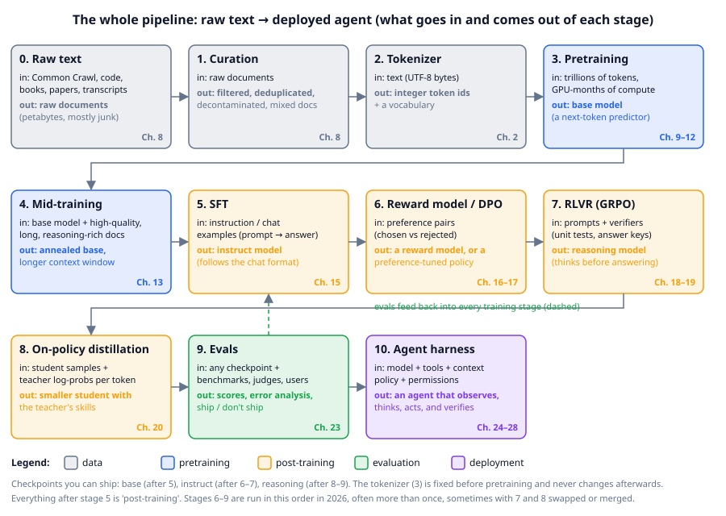
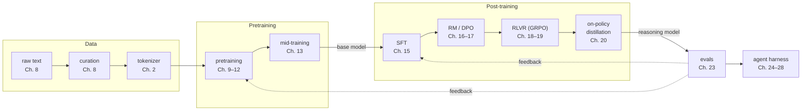

# Chapter 0: The whole pipeline on one page

**Part 0 · ~1.5 hours · Prerequisites: none**

> 🎯 Goal: Name every stage from raw text to a deployed agent and say what goes in and comes out of each.
> 🧪 Lab: `labs/lab00_setup.py` · 🎛️ Interactive: `interactive/00_pipeline_map.html`

## Why this matters

When someone says "we trained a model", they are compressing a dozen distinct steps into three words. A 2026 frontier model starts as petabytes of web text, passes through a curation pipeline, is cut into tokens, is pretrained for weeks on thousands of GPUs, is then annealed (its learning rate wound down on better data), fine-tuned, preference-tuned, reinforcement-trained against verifiers, distilled, evaluated at every step, and finally wrapped in a harness that gives it tools and a memory. Each step has its own data, its own objective and its own failure modes, and the people who build models argue about each one separately. This chapter gives you the map before you walk the territory: every stage, what goes in, what comes out, and where in this course you will build it yourself. It also gets your machine ready, because from the next chapter on you run code. By the end you should be able to read a 2026 model-card line such as "a 2.8-trillion-parameter MoE, pretrained with Muon, post-trained with RLVR" (a mixture-of-experts model, Chapter 12; an optimizer, Chapter 10; a reinforcement-learning recipe, Chapter 19) and know which boxes of the map are being named.

## The idea in pictures 📐

Here is the entire course as one diagram. Read it left to right, top to bottom; each box names what flows in and what flows out.



A **large language model (LLM)** is, at its core, a **next-token predictor**: a function that reads a sequence of tokens and returns a probability for every possible next token (Chapter 1 makes this precise). Everything in the figure is either preparing data for that function, training it, changing what it prefers to say, measuring it, or wrapping it so it can act. The boxes group into five phases, colour-coded in the figure.

**Data (grey, stages 0–2).** Raw text comes from web crawls, code repositories, books and transcripts, and most of it is junk: boilerplate, duplicates, spam, other languages, private data. **Curation** (Chapter 8) filters, deduplicates, scrubs and mixes it into a training set. The **tokenizer** (Chapter 2) then turns text into integer ids. The tokenizer is trained once, before pretraining, and can never change afterwards, because every weight in the model is tied to its ids.

**Pretraining (blue, stages 3–4).** **Pretraining** (Chapters 9–12) trains the model on trillions of tokens to do one thing: predict the next token. The result is a **base model**: it will continue any text you give it in the style of its training data, but it does not know it is supposed to answer you. **Mid-training** (Chapter 13) is the 2026 name for the last stretch of pretraining, run on a smaller, higher-quality mix with a decaying learning rate, and often where the context window is extended.

**Post-training (orange, stages 5–8).** **Supervised fine-tuning (SFT)** (Chapter 15) trains the base model on examples of prompts and good answers in a chat format, producing an **instruct model**. **Preference learning** (Chapters 16–17) uses pairs of answers where humans or judges preferred one, either to train a **reward model** that scores answers or to shift the policy directly with **DPO**. **Reinforcement learning with verifiable rewards (RLVR)** (Chapters 18–19) lets the model try problems whose answers can be checked (unit tests, arithmetic, proofs) and reinforces what works; this is how **reasoning models** learned to think before answering. **On-policy distillation** (Chapter 20) transfers a big teacher's skills to a smaller student cheaply. **Agentic RL** (Chapter 21) extends RLVR to multi-turn tool use, and **safety training** (Chapter 22) shapes refusals and honesty. In 2026 these stages are run in roughly this order, often several times, sometimes merged.

**Evaluation (green, stage 9).** **Evals** (Chapter 23) measure every checkpoint on benchmarks, with LLM judges and with real users. The dashed arrow in the figure is the point: evaluation is not a final gate, it feeds back into every training decision.

**Deployment (purple, stage 10).** An **agent harness** (Chapters 24–28) is the program around the model: it gives the model tools, decides what goes into its context, checks permissions, and loops until the task is done. Since 2025 the harness has been as much of the product as the model.

The same pipeline in Mermaid form, with the course chapters attached, is the version you should be able to draw from memory by the end of the course:



### Base, instruct, reasoning, agentic

The four words you will hear most often name **checkpoints** (a model's weights saved to disk at some point in training) at different depths of the pipeline. They are not different architectures: the same network, with different training after pretraining.

| Kind | Made by | Given `"What is 12 + 7?"` it will... | Strength | Weakness | Course |
|---|---|---|---|---|---|
| **Base model** | pretraining (+ mid-training) | continue the text: maybe `" Answer: 19."`, maybe `" What is 3 + 4?"` | broad knowledge, best raw predictor of text | no notion of a user or a task; must be prompted with examples | Ch. 9–13 |
| **Instruct model** | SFT + preference learning on top of base | answer `"19."` in a helpful register and stop | follows instructions, chats, formats output | answers immediately, so hard problems get shallow answers; can be confidently wrong | Ch. 15–17 |
| **Reasoning model** | RLVR on top of instruct (or base) | write a hidden or visible chain of steps, then `"19"` | much better at maths, code, multi-step problems; can check its own work | slower, more tokens per answer; can over-think easy questions | Ch. 18–20 |
| **Agentic model** | agentic RL + a harness | decide whether to call a calculator tool, call it, read the result, then answer | acts over many steps with tools, recovers from errors, completes long tasks | needs a harness, sandbox and permissions; failures compound over long runs | Ch. 21, 24–28 |

The lab at the end of this chapter shows you a base model in the wild: TinyLM's nano checkpoint, prompted with `"What is 12 + 7?\nAnswer:"`, produces `" 78 + 78 = 78."` (the small checkpoint in `--full` mode produces `" 5 + 17 = 55."`). It has learned the *shape* of Storyland arithmetic and nothing else yet. That gap between "knows the shape" and "gets it right" is what Chapters 15 through 21 close.

An analogy for the whole pipeline: pretraining is years of reading everything in a library; SFT is a short apprenticeship in how to answer questions politely; RLVR is practice with an answer key; the harness is being given a desk, a phone and a to-do list. The limit of the analogy: a human keeps learning at the desk, while a deployed model's weights are frozen, and everything it "remembers" during a task lives in its context window (Chapter 25).

## The idea in code

The course library `llm/` mirrors the map. Every stage is one file you will read and, in most chapters, write parts of:

| Stage | File | Chapter |
|---|---|---|
| Storyland corpus and curation | `llm/data.py` | 8 |
| Tokenizer | `llm/tokenizer.py` | 2 |
| Model (attention, blocks, MoE) | `llm/model.py`, `llm/config.py` | 5, 6, 12 |
| Generation and KV cache | `llm/generate.py` | 7 |
| Pretraining loop, Muon | `llm/train.py`, `llm/optim.py` | 10 |
| SFT and chat template | `llm/sft.py`, `llm/chat.py` | 14–15 |
| Reward model, DPO | `llm/reward.py`, `llm/dpo.py` | 17 |
| REINFORCE, PPO, GRPO | `llm/rl.py` | 18–19, 21 |
| Distillation | `llm/distill.py` | 20 |
| Evals | `llm/evals.py` | 23 |
| Agent harness, tools, MCP | `llm/agent/` | 24–28 |
| Shared artifacts | `llm/pipeline.py` | every lab |

`llm/pipeline.py` is the glue: it hands every lab "the" corpus, "the" tokenizer and "the" base model, training and caching them in `runs/` the first time. Here is the whole stack in twelve lines. Every snippet in this course is runnable after the imports shown; this one takes a few seconds once the checkpoint exists.

```python
import torch
from llm.pipeline import get_corpus, get_tokenizer, get_base_model, device_summary
from llm.generate import generate

print(device_summary())                  # e.g. torch 2.14.0+cu130 | device cpu | threads 2
docs = get_corpus()                      # 6000 Storyland documents (dicts with "text")
tok = get_tokenizer()                    # byte-level BPE, 871 ids, trained on Storyland
model, tok = get_base_model(quick=True)  # loads runs/base_nano.pt (trains it the first time)

ids = tok.encode("Mia had a")            # str -> list[int], e.g. [675, 442, 259]
x = torch.tensor([ids])                  # (B=1, T=3)   batch of 1 sequence, 3 tokens
logits, _ = model(x)                     # (B, T, V)    a score for every vocab entry at every position
probs = torch.softmax(logits[0, -1], -1) # (V,)         distribution over the token after "a"
```

Read the shapes as the course's standing notation: `B` sequences in a batch, `T` tokens each, `V` vocabulary entries. Every model in this course, and every model in production, has this signature: ids in, one row of `V` scores per position out. The raw scores are called **logits**; `softmax` turns a row of them into probabilities that are positive and sum to 1 (Appendix A has the formula). The last row is the prediction for the next token:

```python
top = torch.topk(probs, 3)
[(tok.token_str(i), round(p, 3)) for p, i in zip(top.values.tolist(), top.indices.tolist())]
# [(' orange', 0.117), (' blue', 0.115), (' pink', 0.101)]

generate(model, tok, "Mia had a", max_new_tokens=20, temperature=0.8, seed=0)
# ' orange cake. One windy day Nora took the cup to the hill. The horse gave the cake back'
```

The probabilities are what the checkpoint in `runs/base_nano.pt` computes; if you retrain it they will shift by a few thousandths. The completion is *sampled* (`temperature=0.8`), so a different seed, or the same seed on a machine whose floating-point arithmetic differs slightly, gives a different sentence.

`generate` is the loop of Chapter 1's flow diagram: score, sample, append, repeat. Chapter 7 opens it up.

### Storyland

The corpus is synthetic on purpose. **Storyland** (`llm/data.py`) is a generated world of 16 characters, 20 objects, 10 colours and 15 places, in short stories built from ten templates, plus two-digit arithmetic and question–answer lines:

```
Then Leo and Zoe played with the orange apple until the sun went down. Leo and Zoe looked for the
pear near the market. A fox was sitting on it! At the market, Leo met Zoe. Zoe was sleepy because
Zoe lost a pear. ...
What is 93 + 34?
Answer: 93 + 34 = 127.
```

A 300k-parameter model learns it in a minute on a CPU, the arithmetic gives later chapters problems with checkable answers (the "verifiable" in RLVR), and Chapter 8 plants realistic noise into it to test the curation pipeline. When you want real text, `llm.data.download_tinyshakespeare()` fetches 1 MB of Shakespeare, and Chapters 1 and 2 use it to show what changes.

### TinyLM

**TinyLM** is the model you build, a decoder-only Transformer (the architecture of Chapters 5–6) with the 2026 defaults: RMSNorm, RoPE, grouped-query attention, SwiGLU (Chapters 5–6), tied embeddings (Chapter 3), optional MoE and multi-token prediction (Chapter 12). Three presets in `llm/config.py`:

| Preset | `d_model` | layers | heads (kv) | non-embedding params (with the 871-id tokenizer) | trains in |
|---|---|---|---|---|---|
| `nano` | 96 | 3 | 3 (1) | 295,584 (379,200 total) | ~1 min CPU (`--quick` labs) |
| `small` | 192 | 6 | 6 (2) | 2,361,792 (2,529,024 total) | ~5–10 min CPU (the course model) |
| `medium` | 384 | 12 | 12 (4) | ~18.9 M (~19.2 M total) | a GPU |

The parameter counts are tiny by 2026 standards (a frontier model is a million times larger), but the *code path* is the same: the pretraining loop in Chapter 10 supports AdamW and Muon, warmup, and cosine or WSD schedules (the shared base model is trained with Muon + WSD); the RL loop in Chapter 19 is GRPO with the DAPO fixes. What changes at scale is the subject of Chapter 11 and the capstone.

## Worked example 🧪

```bash
python3 labs/lab00_setup.py            # quick: nano model, ~25 s once the checkpoint exists
python3 labs/lab00_setup.py --full     # small model: trains it the first time (~5–10 min), then seconds
```

The lab checks your environment, then walks the stack once. On the machine that produced this chapter (4 cores, no GPU, PyTorch limited to 2 threads because the machine was shared) the quick run looked like this:

```
--- environment ---
python  3.11.15  (/usr/local/bin/python3)
✅ Python 3.10 or newer
numpy 2.4.6 | matplotlib 3.11.1
✅ torch, numpy and matplotlib import
regex   installed (the tokenizer uses the full GPT-4-style pattern)
torch 2.14.0+cu130 | device cpu | threads 2
cpu     x86_64 | 4 logical cores | torch using 2 threads
✅ PyTorch can run on this CPU
a 256x256 matmul takes 230 µs  (145.8 GFLOP/s)
```

The matmul line is your speed reference. A laptop core typically scores 20–150 GFLOP/s on this test, and on a busy shared machine the same test has scored as low as 2 GFLOP/s; every "minutes" figure in the course should be read against your own number. If `regex` is missing the lab says so; install it, because without it the tokenizer falls back to an ASCII-only pattern and Chapter 2's German and emoji examples will differ.

```
--- corpus: Storyland ---
6000 documents, 1,494,377 characters; sources: stories=4509, math=1491
✅ 6000 Storyland documents generated deterministically (seed 0)

--- tokenizer: text -> integers -> text ---
vocab size 871 | 56 chars -> 25 tokens
tokens: Mia| had| a| red| kite|.| What| is| |12| +| |7|?
|Answer|:|...
✅ tokenizer round trip: decode(encode(s)) == s
✅ every id is inside the vocabulary
```

Look at the token boundaries: ` had` and ` kite` carry their leading space, `12` is one token, and the newline before `Answer` is its own token. Chapter 2 explains each of these choices. The round-trip check is the one property a tokenizer must never break.

```
--- base model (nano) ---
loading cached checkpoint runs/base_nano.pt
ready in 0.0s | 295,584 non-embedding params, 379,200 total | config: d_model=96 layers=3 heads=3 kv_heads=1
✅ checkpoint saved to runs/
logits shape (1, 3, 871) = (batch, tokens, vocab)
P(next | 'Mia had a'): ' orange'=0.117, ' blue'=0.115, ' pink'=0.101, ' white'=0.094, ' red'=0.092
✅ next-token probabilities sum to 1
✅ logits have shape (B, T, V)
```

The first time you run this there is no checkpoint, and `get_base_model` pretrains the nano model for 150 steps (about a minute on an idle laptop; the loss starts at 6.8, which is ln 871, the cost of a uniform guess over the vocabulary, and after 150 steps the checkpoint scores 1.08 per token on held-out Storyland, a perplexity of 2.9; Chapter 1 defines both "held-out" and "perplexity"). After that it loads in a fraction of a second. The logits shape `(1, 3, 871)` is the signature described above, and the top-5 row is a base model doing its one job: after `Mia had a`, Storyland continues with a colour, and the model has learned the ten colours are roughly equally likely (Chapter 1 gets the same answer by counting).

```
--- generate ---
prompt: 'Mia had a'
completion: ' orange cake. One windy day Nora took the cup to the hill. The horse gave the cake back. Nora was very calm and said thank you. At the park, Jack met Mia. Ben was'
40 tokens in 0.10s = 404 tokens/s
✅ model generated text
prompt: 'What is 12 + 7?\nAnswer:' -> ' 78 + 78 = 78.'   (a base model may or may not get this right yet)
📊 saved figures/generated/lab00_next_token.png

10/10 checks passed in 2.5s
✅ checks passed
```

Two things to notice. The story continuation is fluent Storyland, with the right template order and consistent characters within a sentence, from a model with 300k parameters and one minute of training: next-token prediction on repetitive data is not hard. And the arithmetic answer is wrong in the characteristic base-model way: the *form* `a + b = c.` is right, the *content* is copied from nowhere. A 150-step nano model has not seen enough arithmetic to learn it. Run `--full` and the 700-step small model answers `" 5 + 17 = 55."`: same shape, still wrong. Chapter 19 is where TinyLM learns to add reliably, with a verifiable reward.

The 404 tokens/s is a property of this machine, not of the model: the same lab on a heavily loaded shared machine has measured 3 tokens/s. Chapter 7 measures generation speed properly, with and without a KV cache.

## 🆕 The 2026 snapshot

To read this course's "what changes at scale" sections you need a rough picture of the field as of September 2026. Everything here is reported by the cited sources; parameter counts for closed and even open models are approximate.

**Open-weight models.** The strongest open-weight models are mixture-of-experts (MoE) models with total parameter counts in the trillions but far fewer active per token: Kimi K3 (July 2026, about 2.8 T total / 104 B active, 1 M-token context), DeepSeek V4 (about 1.6 T, MIT licence, with a technical report on million-token context), GLM-5.2 (744 B / 40 B active, MIT), Qwen3.8 (a 2.4 T sparse model and a 27 B dense Apache-2.0 multimodal model), plus Gemma 4, Llama 4 and Mistral Medium 3.5. Sources: https://arxiv.org/abs/2606.19348 , https://wavect.io/blog/open-weight-llm-comparison-2026/ , https://www.morphllm.com/best-open-source-llm . The practical consequence for this course: the architecture you build in Chapters 5–6 and extend with MoE in Chapter 12 is the architecture these models use.

**How they are trained.** The Muon optimizer, a 2024 research idea, is now mainstream in pretraining (Kimi K2/K2.5, GLM-5, DeepSeek-V4 report using it; a July 2026 paper reports it matching or beating AdamW on 30 B and 72 B hybrid MoE models: https://arxiv.org/abs/2607.20548 ). You implement it in Chapter 10. FP8 mixed precision (storing and multiplying numbers in 8 bits, Chapter 10) is the default and FP4 pretraining is being validated ( https://arxiv.org/abs/2605.09825 ). Hybrid attention (sparse and compressed attention interleaved with sliding windows, or attention mixed with state-space layers) is how million-token contexts are made affordable (Chapter 12).

**How they are post-trained.** RLVR with the GRPO family (DAPO, Dr. GRPO, GSPO and 2026 variants: https://www.turingpost.com/p/reasoning-rl-in-2026 ) is the dominant recipe for reasoning; on-policy distillation is the cheap way to move those gains into smaller models ( https://thinkingmachines.ai/blog/on-policy-distillation/ , https://arxiv.org/abs/2604.13016 ); rubric-based rewards extend RL to tasks without a checkable answer ( https://aclanthology.org/2026.acl-long.791/ ); agentic RL trains multi-turn tool use directly ( https://arxiv.org/abs/2510.04206 ).

**Agents.** Two protocols organise the ecosystem: MCP (Model Context Protocol, latest spec 2025-11-25) connects agents to tools, and A2A (v1.0, April 2026) connects agents to other agents (Chapter 26). The lessons from a year of long-running coding agents, initializer/coder splits, progress files, verification loops, are the material of Chapter 27 ( https://www.infoq.com/news/2026/04/anthropic-three-agent-harness-ai/ ).

**Evals.** SWE-bench Verified, the 2024–2025 standard for coding agents, is reported contaminated and partly mis-specified (an audit found 59.4% of hard tasks had flawed tests), and attention has moved to Terminal-Bench 2.x, Humanity's Last Exam and ARC-AGI-3 (Chapter 23).

**What $100 buys.** The most useful calibration point for this course is nanochat (Karpathy, October 2025: https://github.com/karpathy/nanochat ): a complete pipeline, tokenizer → pretraining → mid-training → SFT → optional RL → evals → chat UI, that trains "the best ChatGPT that $100 can buy" in about four hours on a rented 8×H100 node. It produces a model that chats, writes simple stories and poems, and answers easy questions, but is far below any 2026 product. TinyLM is nanochat's pipeline shrunk another thousand-fold so that every stage fits on a CPU in minutes; the capstone (Chapter 29) walks through what nanochat does differently and what a 1 B, 10 B and 100 B+ run add on top. For comparison, the community speed-run of a GPT-2-quality model, which took days on a GPU in 2019, is reported at about 1.35 minutes on 8×H100 by April 2026 using Muon, FlashAttention-3, an FP8 output head and multi-token prediction ( https://github.com/KellerJordan/modded-nanogpt ).

## How to use this course

**Setup.** Python 3.10+, then `pip install torch numpy matplotlib pytest regex tqdm`. CPU PyTorch is enough; no chapter requires a GPU. Run `python3 labs/lab00_setup.py` from the `course/` directory. Everything the labs produce goes in `runs/` (checkpoints, tokenizers; git-ignored) and `figures/generated/` (plots).

**The loop for each chapter.** Read the chapter (each follows the same five beats: why it matters, the idea in pictures, the idea in code, a worked example from the lab, then exercises, a five-question self-check, takeaways and references). Open the interactive and do its Challenge. Run the lab in `--quick` mode, then `--full`. Do the ✍️ exercises. Check yourself with the ✅ questions. Tick it off in `PROGRESS.md`.

**Conventions.** **Bold** marks a term being defined; every bold term is in the glossary (Appendix C). Equations are followed by "Read this as". Analogies are labelled and their limits stated. Numbers in the text were produced by the labs on a CPU. Items from 2025–2026 are marked 🆕 and cited; where the field has not settled, the chapter says so. Notation everywhere: `B` batch, `T` sequence length, `d` model width, `h` heads, `V` vocabulary size, `N` parameters, `D` training tokens.

**Paths.** The full course is about 60–80 hours. The fast path (about 20 hours) is Chapters 0, 1, 2, 5, 6, 7, 10, 14, 15, 19, 24, 27, 29. If you care about training, do Parts I–III fully and skim Part IV; if you care about agents, do 0, 1, 2, 7, 14, 21, 23 and all of Part IV.

**Shared artifacts.** Labs build on each other through `llm/pipeline.py`: `get_tokenizer()` returns the same tokenizer every time, `get_base_model(quick=False)` returns the same small base checkpoint that Chapters 13–23 fine-tune. If you ever want to start over, delete `runs/`.

## Try it yourself ✍️

1. **Draw the map.** Close this file and draw the pipeline from memory: eleven boxes, an input and an output for each. Then compare with the figure. Which boxes did you forget, and which chapter covers each?
2. **Classify five models.** Pick five models you have heard of (open or closed) and put each in the base / instruct / reasoning / agentic row of the table. For each, name one piece of evidence for your classification (a model card line, a behaviour you observed).
3. **Prompt a base model.** Run `generate(model, tok, "Question: Where did Mia take the kite?\nAnswer:", max_new_tokens=20, temperature=0.0)` on the nano model. Then run it with `"Mia took the kite to the"`. Which prompt works better, and what does that tell you about how a base model must be prompted? Then load the small model with `get_base_model(quick=False)` and try both prompts again.
4. **Count the stages nanochat runs.** Read the nanochat README and list its stages in the order they run. Which boxes of the figure does it skip, and why do you think that is?
5. **Timings.** Record your matmul GFLOP/s and quick-lab wall-clock from the lab output in `PROGRESS.md`. You will compare against them in Chapter 10.
6. **Interactive** 🎛️: open `interactive/00_pipeline_map.html`. Click each stage to see what goes in, what comes out and what changes inside the model, then use the base / instruct / reasoning / agentic buttons to highlight which stages each kind of model has been through. The Challenge asks, before you look: which stages does *every* model type share, and which is the first stage where the model is trained on a reward rather than a target token?

## Check yourself ✅

<details><summary>1. In one sentence: what does a language model compute?</summary>

Given a sequence of tokens, it returns a probability for every possible next token (a distribution over the vocabulary); generation repeats this, appending one sampled token at a time.
</details>

<details><summary>2. Why can a tokenizer not be changed after pretraining?</summary>

Every weight in the model, starting with the embedding row for each id and the output row that scores it, was learned for the ids that tokenizer produces. A different tokenizer produces different ids for the same text, so the learned weights no longer refer to anything meaningful.
</details>

<details><summary>3. A base model, given <code>"What is 12 + 7?\nAnswer:"</code>, writes <code>" 78 + 78 = 78."</code>. Which stages of the pipeline would change this, and what would each contribute?</summary>

More pretraining or mid-training on arithmetic would improve the raw prediction; SFT would teach it to answer in the expected format and stop; RLVR with a verifier that checks the sum would directly reward correct answers and teach it to work step by step; an agent harness could let it call a calculator instead. Chapters 10, 15, 19 and 24 respectively.
</details>

<details><summary>4. What is the difference between an instruct model and a reasoning model, in terms of both training and behaviour?</summary>

An instruct model is SFT plus preference learning on a base model; it answers immediately in a helpful format. A reasoning model additionally goes through RLVR, learning to produce a chain of intermediate steps before the answer; it is slower and uses more tokens but is far better at maths, code and multi-step problems.
</details>

<details><summary>5. The evals box has a dashed arrow back into training. What does that arrow mean in practice?</summary>

Evaluation is not a final gate but a feedback signal: eval results decide which data to add, which checkpoint to continue from, when to stop a stage, and whether a post-training change helped or caused regressions. Every training stage in the course ends by evaluating and, in Chapter 23, the whole history of checkpoints is compared.
</details>

## Key takeaways

- An LLM is a next-token predictor; every stage of the pipeline either prepares data for it, trains it, reshapes its preferences, measures it, or wraps it to act.
- The stages are: raw text → curation → tokenizer → pretraining → mid-training → SFT → reward model / DPO → RLVR (GRPO) → on-policy distillation → evals → agent harness.
- Base, instruct, reasoning and agentic models are the same architecture at different depths of post-training.
- The tokenizer is fixed before pretraining; evals feed back into every stage; the harness is part of the product.
- TinyLM runs the same code path as a 2026 frontier model at a millionth of the size; nanochat ($100, 8×H100, ~4 h) is the intermediate calibration point.
- Run `labs/lab00_setup.py` now; every later chapter assumes it passed.

## Going deeper

- Vaswani, A. et al. "Attention Is All You Need" (2017). The architecture at the centre of the map; Chapters 5–6 build it.
- Ouyang, L. et al. "Training language models to follow instructions with human feedback" (InstructGPT, 2022). The paper that established the base → SFT → reward model → RL sequence.
- DeepSeek-AI, "DeepSeek-R1: Incentivizing Reasoning Capability in LLMs via Reinforcement Learning" (2025). Where RLVR produced reasoning at scale; Chapter 19 reproduces the effect at toy scale.
- 🆕 Karpathy, A. *nanochat* (October 2025). The $100 full pipeline; the closest real-world sibling of TinyLM. https://github.com/karpathy/nanochat
- 🆕 DeepSeek-AI, "Towards Highly Efficient Million-Token Context Intelligence" (DeepSeek-V4 technical report, 2026). A complete 2026 model card to test your map against. https://arxiv.org/abs/2606.19348
- 🆕 "SOAP, Muon, and Beyond: Pushing LLM Pretraining Scales" (July 2026). Why Muon is in the pretraining box in 2026. https://arxiv.org/abs/2607.20548
- 🆕 Anthropic, "Effective harnesses for long-running agents" (November 2025) and the three-agent variant reported by InfoQ (April 2026). Why the harness is a box on the map at all. https://www.infoq.com/news/2026/04/anthropic-three-agent-harness-ai/
- 🆕 Thinking Machines, "On-Policy Distillation" (October 2025). The cheapest post-training stage and why it has its own box. https://thinkingmachines.ai/blog/on-policy-distillation/

---

← [Outline](../OUTLINE.md) · [Course home](../README.md) · [Chapter 1](01-next-token-prediction.md) →
