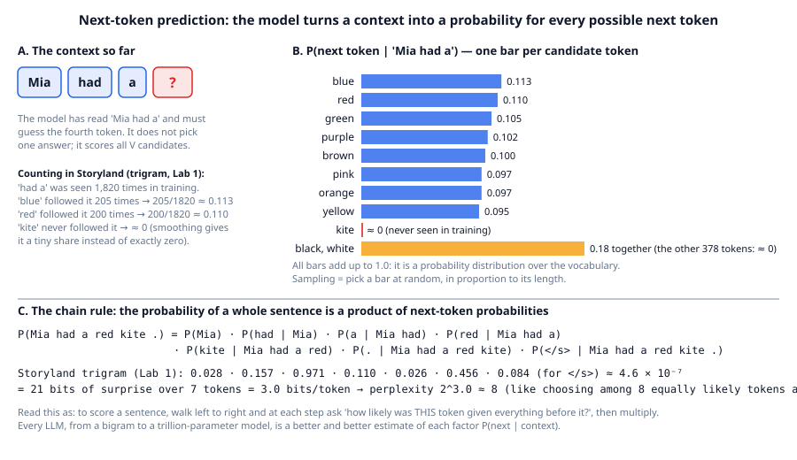
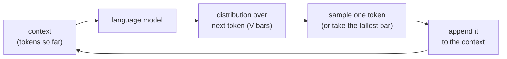

# Chapter 1: Language models are next-token predictors

**Part I · ~2 hours · Prerequisites: Chapter 0**

> 🎯 Goal: Explain "predict the next token" and build a model that does it with counting alone.
> 🧪 Lab: `labs/lab01_ngram.py` · 🎛️ Interactive: `interactive/01_ngram_playground.html`

## Why this matters

Every large language model you have used, from the chat assistant on your phone to the coding agent in Chapter 27, is doing one thing at its core: given some text, it produces a probability for every possible next piece of text. Answering a question, writing code, "reasoning", calling a tool: all of it is built on that single operation, repeated one token at a time. If you understand what "predict the next token" means precisely, including what a probability over a vocabulary is, how a whole sentence gets a probability, and how to measure whether a model predicts well, then every later chapter is a story about *estimating those probabilities better*. In this chapter you build a language model with no neural network at all, using nothing but a Python dictionary and counting. It will write recognisable Storyland sentences. It will also fail in a specific, instructive way (it cannot handle contexts it has never seen), and that failure is the reason the rest of the course exists.

## The idea in pictures 📐

A **language model** is a function that takes a sequence of tokens and returns a **probability distribution** over what the next token will be: a list of non-negative numbers, one per possible token, that add up to 1. A **token** is the unit of text the model works with; in this chapter a token is a word or a punctuation mark, and Chapter 2 replaces that with learned sub-word pieces. The figure shows the three ideas of this chapter in one place.



In panel A the model has read the **context** `Mia had a` (everything that came before the position being predicted) and must produce a distribution over the fourth token. It does not commit to one answer. Panel B shows that distribution as bars: one bar per candidate token, with a length equal to its probability. In Storyland, `had a` is almost always followed by a colour, so eight colour words get about 0.1 each, and `kite`, which never followed `had a` in the training text, gets a bar so short it is invisible. The bars sum to 1.0. Panel C shows how a model that only ever predicts *one* token can nevertheless score a *whole sentence*: multiply the probability of each token given everything before it. That product rule is the chain rule, and we return to it below.

Generation is the same picture run in a loop:



Read the flow as: look at what you have, score every candidate continuation, pick one, glue it on, repeat. A chat model that writes a 500-word answer has run this loop about 700 times (Chapter 2 explains why a word is more than one token). Nothing in the loop knows what a "sentence" or an "answer" is; those are patterns in the probabilities.

An analogy that helps: predictive text on a phone keyboard shows three suggested next words, ranked. A language model is a predictive-text engine that ranks *every* word in its vocabulary, with a number attached to each. The limit of the analogy: phone keyboards mostly look at the last one or two words, while the models in this course look at thousands of tokens of context, and that difference is what the chapters on attention are about.

## The idea in code

Throughout this chapter the imports are:

```python
import math, random, re
from collections import Counter, defaultdict
from llm.pipeline import get_corpus            # 6000 Storyland documents
```

### Probability of the next token, by counting

The most direct way to estimate "how likely is `kite` after `red`?" is to look at a large amount of text and count. If `red` appears 1,131 times and is followed by `hat` 209 times, then the estimate is 209/1131 ≈ 0.185. This is the **maximum-likelihood estimate**: the probability that makes the training text as likely as possible, which for counts is the plain ratio.

$$P(\text{next}=w \mid \text{context}=c) = \frac{\text{count}(c, w)}{\text{count}(c)}$$

Read this as: the probability of `w` following `c` is the number of times you saw `c` then `w`, divided by the number of times you saw `c` at all.

A model that uses the previous *n − 1* tokens as its context is an **n-gram model**. With *n* = 2 it is a **bigram** model (one token of context), with *n* = 3 a **trigram** model (two tokens of context). The assumption that only the last *n − 1* tokens matter is the **Markov assumption**; it is false for real language ("the keys that I left on the kitchen table yesterday *are*..."), and the chapters on attention exist to drop it. Here it is what makes counting possible.

The lab's tokenizer for this chapter is a one-line regular expression that splits text into words and punctuation marks, and every document is wrapped with a start token `<s>` (repeated *n − 1* times so the first word has a full context) and an end token `</s>` so the model can learn where documents stop:

```python
BOS, EOS = "<s>", "</s>"

def words(text: str) -> list[str]:
    return re.findall(r"[A-Za-z']+|\d+|[^\w\s]", text)     # words, numbers, punctuation

def doc_tokens(text: str, n: int) -> list[str]:
    return [BOS] * (n - 1) + words(text) + [EOS]

print(doc_tokens("Mia had a red kite.", 3))
# ['<s>', '<s>', 'Mia', 'had', 'a', 'red', 'kite', '.', '</s>']
```

Counting is a nested dictionary: `counts[context][next_token]`, where the context is a tuple of the previous *n − 1* tokens. `defaultdict(Counter)` creates the inner counter on first use.

```python
class NGramModel:
    def __init__(self, n: int, k: float = 0.01):
        self.n, self.k = n, k
        self.counts: dict[tuple, Counter] = defaultdict(Counter)
        self.vocab: set[str] = set()

    def fit(self, texts: list[str]) -> "NGramModel":
        for t in texts:
            toks = doc_tokens(t, self.n)
            self.vocab.update(toks)
            for i in range(self.n - 1, len(toks)):
                ctx = tuple(toks[i - self.n + 1:i])       # the previous n-1 tokens
                self.counts[ctx][toks[i]] += 1
        return self
```

That is the entire training procedure: one pass over the text, one dictionary increment per token. Compare it with the training loop of Chapter 10, which is also "one pass over the text, one update per token", just with a far more expensive update.

### Smoothing: never say never

The plain ratio has a fatal flaw: if a context/next pair never appeared in training, its probability is exactly 0, and one zero in the chain rule makes the whole sentence impossible. **Smoothing** is any method that moves a little probability from things you saw to things you did not. The lab uses the simplest one, **add-k smoothing**: pretend every possible pair was seen *k* extra times.

$$P(w \mid c) = \frac{\text{count}(c, w) + k}{\text{count}(c) + k \cdot V}$$

Read this as: add *k* to every count on top, and add *k* once per vocabulary entry on the bottom so the *V* probabilities still sum to 1. With *k* = 0.01 and a vocabulary of 389, an unseen pair after a context seen 1,000 times gets 0.01 / 1003.89 ≈ 0.00001: tiny, but not zero. If the context itself was never seen, every next token gets exactly 1/*V* (the model admits it has no idea).

```python
    def prob(self, ctx: tuple, nxt: str) -> float:
        c = self.counts.get(ctx, Counter())
        V = len(self.vocab)
        return (c[nxt] + self.k) / (sum(c.values()) + self.k * V)

    def top(self, ctx: tuple, m: int = 5) -> list[tuple[str, float]]:
        c = self.counts.get(ctx, Counter())
        return [(w, self.prob(ctx, w)) for w, _ in c.most_common(m)]
```

Better smoothing methods (Kneser–Ney, in the reading list) were the state of the art for two decades. They matter less now because neural networks smooth in a much better way: they share statistics between *similar* contexts, which is what Chapter 3 (embeddings) is about.

### The chain rule: from one token to a whole sentence

The probability of a sequence of tokens is the product of each token's probability given the tokens before it. This is the **chain rule of probability**, and it is exact, not an approximation:

$$P(w_1, w_2, \ldots, w_T) = \prod_{i=1}^{T} P(w_i \mid w_1, \ldots, w_{i-1})$$

Read this as: the chance of the whole sentence equals the chance of the first token, times the chance of the second given the first, times the chance of the third given the first two, and so on to the end. An n-gram model plugs in its approximation *P*(*w*ᵢ | last *n* − 1 tokens) for each factor; a Transformer plugs in a factor that depends on the whole prefix. Either way, the model is defined by the factors.

Products of many small numbers underflow (5.5 × 10⁻⁶ for a six-word sentence; a 1,000-token document would be 10⁻¹⁰⁰⁰ or smaller, which a float cannot hold). So in practice everyone works with the **log-probability**: the logarithm turns a product into a sum. Using log base 2 gives units of **bits**: −log₂ *P* is the **surprisal** of a token, how surprised the model was to see it. A token with probability ½ costs 1 bit; probability 1/1024 costs 10 bits; probability 1 costs 0 bits.

```python
    def log2_prob_doc(self, text: str) -> tuple[float, int]:
        toks = doc_tokens(text, self.n)
        bits, n = 0.0, 0
        for i in range(self.n - 1, len(toks)):
            ctx = tuple(toks[i - self.n + 1:i])
            bits += math.log2(self.prob(ctx, toks[i]))    # log of a product = sum of logs
            n += 1
        return bits, n                                    # (log2 P(doc), number of tokens)
```

### Perplexity: how surprised is the model, per token?

To compare models we need one number that does not depend on how long the test text is. The average surprisal per token, in bits, is the **cross-entropy** of the model on that text (the loss that every neural language model in this course is trained to minimise, just in natural-log units). Raising 2 to that power gives **perplexity**:

$$\text{PPL} = 2^{-\frac{1}{N}\sum_{i=1}^{N} \log_2 P(w_i \mid \text{context}_i)}$$

Read this as: take the average number of bits the model needs per token, and turn it back into a count. Perplexity has a plain reading: it is the **effective branching factor**, the number of equally likely choices the model is, on average, choosing between at each step. A model that assigns every one of *V* tokens probability 1/*V* has perplexity exactly *V* (the lab checks this: 389). A perplexity of 3.8 means the model is, on average, as uncertain as a fair choice among 3.8 tokens. Lower is better; 1 would mean the model always knew the next token in advance.

```python
    def perplexity(self, texts: list[str]) -> float:
        total_bits, total_n = 0.0, 0
        for t in texts:
            b, n = self.log2_prob_doc(t)
            total_bits += b
            total_n += n
        return 2 ** (-total_bits / total_n)
```

One rule must never be broken: perplexity is measured on **held-out data**, text the model did not see during training. On the training text a trigram model with no smoothing has near-zero perplexity, because it memorised the counts, and that number says nothing about how it handles new text. The gap between training and held-out performance is the subject of **generalization**, and it appears in every chapter from here on.

### Sampling text from the distribution

To generate, start from the context `<s> <s>`, look up the counter for that context, draw one token at random in proportion to its count, append it, and repeat until the model draws `</s>`. `random.choices` with weights does the draw. Raising each weight to the power 1/*T* is the **temperature** *T* of Chapter 7: *T* < 1 sharpens the distribution toward the most common token, *T* > 1 flattens it toward uniform.

```python
    def generate(self, max_tokens: int = 40, seed: int = 0, temperature: float = 1.0) -> str:
        r = random.Random(seed)
        toks = [BOS] * (self.n - 1)
        for _ in range(max_tokens):
            ctx = tuple(toks[len(toks) - self.n + 1:]) if self.n > 1 else ()
            c = self.counts.get(ctx)
            if not c:
                break
            cand, wts = zip(*c.items())
            if temperature != 1.0:
                wts = [w ** (1.0 / temperature) for w in wts]
            nxt = r.choices(cand, weights=wts)[0]
            if nxt == EOS:
                break
            toks.append(nxt)
        return " ".join(t for t in toks if t != BOS)
```

This is **sampling**: choosing randomly according to the distribution, so the same model gives different text each run. Always taking the tallest bar instead is **greedy decoding**; it is deterministic and, for n-gram models, quickly falls into loops.

## Worked example 🧪

Run the lab:

```bash
python3 labs/lab01_ngram.py            # quick: Storyland only, about 15 s
python3 labs/lab01_ngram.py --full     # adds 4- and 5-grams, a data-size sweep, and Shakespeare (about 25 s)
```

The lab splits the 6,000 Storyland documents into 5,400 for training and 600 held out, and fits unigram (*n* = 1, no context), bigram and trigram models. Look at the sizes first:

```
vocabulary: 389 distinct word-tokens (incl. <s> and </s>)
1-gram:       1 distinct contexts,      389 distinct (context, next) pairs
2-gram:     389 distinct contexts,    3,014 distinct (context, next) pairs
3-gram:   2,835 distinct contexts,   11,179 distinct (context, next) pairs
```

Each extra token of context multiplies the number of table rows. The trigram table is already 29 times bigger than the bigram table, and Storyland is a tiny, repetitive world of 389 words; the trigram table for English would have billions of rows, almost all empty.

The probability tables are where the model becomes legible. Every row is a distribution:

```
unigram  P(w)              : .=0.101, the=0.085, and=0.033, was=0.024, a=0.022, :=0.020, ,=0.017, </s>=0.016
bigram   P(w | 'the'   )  : sun=0.062, garden=0.027, park=0.027, market=0.027, school=0.027, forest=0.027
bigram   P(w | 'Mia'   )  : and=0.115, was=0.106, took=0.067, met=0.061, wore=0.057, laughed=0.056
bigram   P(w | 'was'   )  : sitting=0.232, very=0.222, at=0.096, warm=0.034, rainy=0.034, sunny=0.031
trigram  P(w | 'Mia','had'): a=0.971
trigram  P(w | 'the','sun'): went=0.998
trigram  P(w | 'was','very'): excited=0.131, calm=0.129, sad=0.128, proud=0.127, brave=0.127, shy=0.124
```

Compare `P(w | 'the')` with `P(w | 'the', 'sun')`: one extra word of context turns a spread-out guess (many places at 0.027 each) into near-certainty (`went` at 0.998), because in Storyland the sun only ever "went down". That is the whole argument for longer context, and it is why the trigram wins below. Note also that `P(w | 'was', 'very')` is flat across eight feelings: the counts are honest about the corpus generator picking feelings at random, and no amount of extra context will sharpen that row.

Next the lab scores one held-out sentence with the chain rule, token by token:

```
token   context                P(bigram)  P(trigram) bits(tri)
Mia     <s> <s>                   0.0276      0.0276      5.18
had     <s> Mia                   0.0542      0.1570      2.67
a       Mia had                   0.9979      0.9709      0.04
red     had a                     0.0734      0.1102      3.18
kite    a red                     0.0353      0.0260      5.26
.       red kite                  0.2929      0.4558      1.13
</s>    kite .                    0.1344      0.0841      3.57
log2 P(sentence) under trigram = -21.04 bits  ->  P = 4.62e-07
per-token: 3.01 bits  ->  perplexity 8.04
```

Read down the bits column: `a` after `Mia had` costs 0.04 bits (nearly free), while `Mia` at the start costs 5.18 bits (there are 16 names, plus other ways to begin a story). Add them up to 21 bits, divide by 7 tokens, and 2³·⁰¹ ≈ 8 is this sentence's perplexity: on average the model was choosing among about 8 options.

Now the number that matters, held-out perplexity over all 600 test documents:

```
uniform guess :   389.00   (= V = 389: every word equally likely)
1-gram        :   107.29
2-gram        :     6.83
3-gram        :     3.81
```

Each step of context divides the uncertainty. A unigram model knows word frequencies and gets from 389 down to 107; one word of context gets to 6.8; two words to 3.8. Generated text shows the same progression:

```
1-gram #0: Mia green a . liked lost day A There thank balls clapped looked Ruby wore . snowy meadow = Ella A blue owl ? three the : at red castle
2-gram #1: The owl ran across the forest . Lily was sitting on it ! At the hill . Max counted the sun went home and Leo clapped .
3-gram #0: Leo counted the flags : one , two , three . There were three keys . Tom went home and put the flag back . Jack wore a black cake
```

The unigram output is a bag of words. The bigram output has local grammar (`ran across the forest`) but drifts mid-sentence (`Max counted the sun went home`), because it forgets everything more than one word back. The trigram output holds together for a clause or two and then makes a *semantic* slip (`three flags ... three keys`, `a black cake`) because two words of context cannot carry "we were talking about flags" across a sentence boundary. Every increase in context fixes the errors of the previous level and reveals the next kind.

Then the failure mode. The lab counts how many held-out (context, next) pairs never occurred in training:

```
1-gram:  0.00% of held-out (context, next) pairs were never seen
2-gram:  0.11% of held-out (context, next) pairs were never seen
3-gram:  1.23% of held-out (context, next) pairs were never seen
```

This is **sparsity**: the number of possible contexts grows exponentially with *n*, so the fraction you have actually observed shrinks, and every unseen pair is handled by smoothing (a guess) rather than by evidence. On Storyland the numbers are small because the corpus is generated from ten templates. Watch what happens when training data is scarce:

```
train docs  1-gram ppl  2-gram ppl  3-gram ppl  unseen1  unseen2  unseen3
       100       116.3        10.5        10.7     1.5%     8.9%    22.1%
       300       110.4         8.2         6.6     0.4%     3.5%    11.2%
      1000       108.1         7.3         4.7     0.1%     1.2%     4.5%
      3000       107.4         6.9         4.0     0.0%     0.3%     1.8%
      5400       107.3         6.8         3.8     0.0%     0.1%     1.2%
```

With 100 training documents the trigram is *worse* than the bigram (10.7 vs 10.5): 22% of its contexts are unseen, so it falls back to a uniform guess far more often than the bigram does. Longer context only pays off once there is enough data to fill the table. `--full` pushes this further with 4- and 5-gram models and a 30-document run, where the 5-gram scores 66.8 against the bigram's 17.6, and then switches to real text:

```
--- real text: tiny Shakespeare ---
6499 training paragraphs, 723 held-out, 233,226 word-tokens, 13,977 distinct words
1-gram: perplexity     847.2   unseen   5.0%
2-gram: perplexity     696.2   unseen  35.0%
3-gram: perplexity    3799.5   unseen  74.1%
4-gram: perplexity    8901.2   unseen  90.3%
```

On Shakespeare, with 14,000 distinct words instead of 389, the trigram model has never seen 74% of the test contexts, and its perplexity is *five times worse* than the bigram's. This is the wall that counting hits. The 2026 fix is not a bigger table: it is a model that turns tokens into vectors (Chapter 3) so that `red kite` and `blue kite` share evidence, learns those vectors by gradient descent (Chapter 4), and looks at the whole context at once (Chapter 5). The objective those models minimise is exactly the per-token cross-entropy you computed here.

The lab saves `figures/generated/lab01_ngram.png`: the `Mia had` bar chart, the perplexity ladder on a log scale, and the perplexity-vs-data curves that cross over.

## Try it yourself ✍️

1. **Temperature.** Call `models[3].generate(30, seed=0, temperature=0.3)` and then `temperature=2.0`. Describe what changes and connect it to the shape of the bars in the figure.
2. **Greedy decoding.** Add a `greedy=True` option that always picks the most common continuation. Generate 60 tokens from the bigram model. What happens, and why does a longer context reduce (but not remove) the problem?
3. **Smoothing strength.** Re-run the held-out perplexity for the trigram with `k` = 1, 0.1, 0.01, 0.001. Which is best, and why does a very large *k* hurt? (Hint: what does the model believe about an unseen pair when *k* is huge?)
4. **Train vs held-out.** Compute the trigram's perplexity on the *training* documents with `k = 1e-9`. Compare with the held-out number and explain the gap in one sentence about memorisation.
5. **A 4-gram on Storyland.** In quick mode add `n = 4` to `orders`. At which training size does it overtake the trigram? Predict before running.
6. **Character-level model.** Replace `words()` with `list(text)` so tokens are single characters. What is *V* now? Fit a 5-gram and compare its perplexity with the word trigram, then explain why the two numbers are not comparable (units!).
7. **Interactive** 🎛️: open `interactive/01_ngram_playground.html`, paste a paragraph of your own writing, and watch the count table fill as you type. Try the Challenge: find the shortest text on which the trigram model generates a loop, then break the loop by adding one sentence.

## Check yourself ✅

<details><summary>1. A language model outputs a probability distribution over the next token. What two properties must those numbers have, and why is "the model picked <code>kite</code>" an incomplete description of what it did?</summary>

Every probability is ≥ 0 and they sum to 1 over the vocabulary. The model did not pick anything: it assigned a number to every token. "Picking" happens afterwards, by sampling (random draw weighted by the bars) or greedy decoding (tallest bar). The same distribution can produce different tokens on different runs.
</details>

<details><summary>2. Write the chain rule for <code>P(the sun went down)</code> and say which factor a bigram model gets wrong first and why.</summary>

*P*(the) · *P*(sun | the) · *P*(went | the sun) · *P*(down | the sun went). A bigram model replaces the third factor with *P*(went | sun) and the fourth with *P*(down | went), throwing away all but the previous word. The first loss of information is at the third factor: `the sun` is a far more specific context than `sun` alone (0.998 vs a spread-out row in the lab).
</details>

<details><summary>3. A model has an average surprisal of 2 bits per token on a held-out text. What is its perplexity, and what does that number mean in plain words?</summary>

2² = 4. On average the model is as uncertain as if it were choosing among 4 equally likely tokens at each step (the effective branching factor). If the average were 0 bits the perplexity would be 1: the model always knows the next token.
</details>

<details><summary>4. Why must perplexity be measured on held-out text, and what would you see if you measured a trigram model with tiny <code>k</code> on its own training text?</summary>

Because the goal is to predict *new* text, and a count table can memorise its training text perfectly. On the training set an unsmoothed trigram assigns high probability to every pair it counted, giving a perplexity close to 1 that says nothing about generalization. Exercise 4 measures this.
</details>

<details><summary>5. On tiny Shakespeare the trigram model (perplexity 3,800) is much worse than the bigram (696), while on Storyland the trigram wins (3.8 vs 6.8). What single quantity explains both results?</summary>

The fraction of held-out contexts never seen in training (sparsity): 74% for the Shakespeare trigram vs 1.2% for Storyland. When most contexts are unseen, the trigram falls back to a uniform guess over 14,000 words, which is far worse than the bigram's informed guess. More context helps only when the data are dense enough to fill the larger table; neural models fix this by sharing evidence between similar contexts rather than by collecting more counts.
</details>

## Key takeaways

- A language model maps a context to a probability distribution over the next token; generation is that step in a loop.
- The chain rule turns next-token probabilities into the probability of any sequence, exactly; logs turn the product into a sum of bits.
- Perplexity = 2^(average bits per token) = the effective number of choices per step; a uniform model has perplexity *V*. Measure it on held-out text only.
- An n-gram model estimates each factor by counting; add-k smoothing keeps unseen pairs from having probability zero.
- Longer context lowers perplexity (389 → 107 → 6.8 → 3.8 on Storyland) *until* sparsity bites: with little data or rich text, the trigram loses to the bigram.
- Neural language models keep the objective (per-token cross-entropy) and replace the count table with a function that generalises across similar contexts.

## Going deeper

- Shannon, C. "Prediction and Entropy of Printed English" (1951). The original next-letter guessing experiment and the birth of perplexity's cousin, entropy per character.
- Jurafsky, D. and Martin, J. *Speech and Language Processing*, 3rd ed. draft, chapter "N-gram Language Models" (2024). The standard textbook treatment, including Kneser–Ney smoothing. https://web.stanford.edu/~jurafsky/slp3/
- Chen, S. and Goodman, J. "An Empirical Study of Smoothing Techniques for Language Modeling" (1998). Why add-k is the worst reasonable choice and what beats it.
- Bengio, Y. et al. "A Neural Probabilistic Language Model" (2003). The paper that replaced the count table with embeddings and a neural network, for exactly the sparsity reason shown in this chapter.
- Karpathy, A. *makemore* video series (2022). Builds a bigram model, then a neural one, in the same spirit as this lab. https://github.com/karpathy/makemore
- Radford, A. et al. "Language Models are Unsupervised Multitask Learners" (GPT-2, 2019). Shows that the next-token objective alone, at scale, yields translation, summarisation and question answering.
- 🆕 Karpathy, A. *nanochat* (2025). A full ChatGPT-style pipeline in one repository whose pretraining stage optimises the same per-token cross-entropy as this chapter, at about $100 of compute. https://github.com/karpathy/nanochat

---

← [Chapter 0](00-the-whole-pipeline.md) · [Course home](../README.md) · [Chapter 2](02-tokenization.md) →
