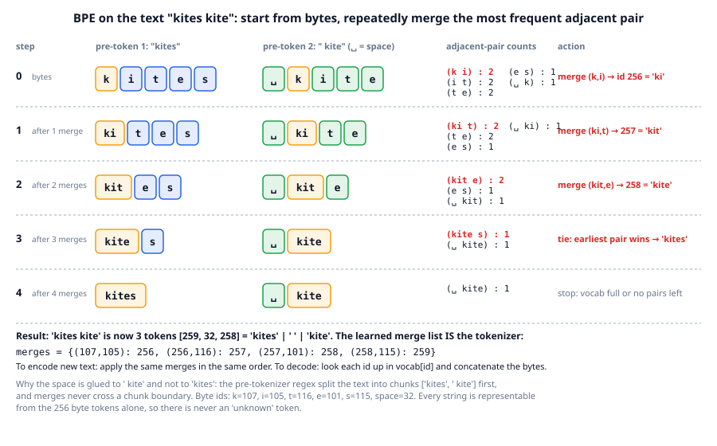
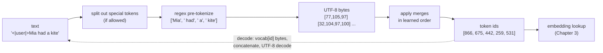

# Chapter 2: Tokenization

**Part I · ~2 hours · Prerequisites: Chapters 0, 1**

> 🎯 Goal: Turn text into integers and back, and explain why subword tokens won.
> 🧪 Lab: `labs/lab02_tokenizer.py` · 🎛️ Interactive: `interactive/02_bpe_stepper.html`

## Why this matters

A neural network cannot read letters. It multiplies numbers, so the first thing that happens to any text on its way into a language model is that it is turned into a list of integers, and the last thing that happens on the way out is that integers are turned back into text. The component that does this is the **tokenizer**, and the choices it makes are baked into the model for its whole life: change the tokenizer and every learned weight becomes meaningless. Many of the strange failures people notice in 2026 models are tokenizer failures: a model that cannot count the letters in "strawberry" is looking at the pieces `st|ra|w|b|e|r|r|y`, not at letters; a model that is clumsy with arithmetic on long numbers is seeing `202|4`, not four digits; a model that is worse in German than in English is spending twice as many tokens per sentence. In this chapter you build the algorithm every major model uses, **byte-pair encoding (BPE)**, train it on Storyland, and watch each of those failures appear on a 230-line tokenizer you can read in full.

## The idea in pictures 📐

Three designs are possible. **Character-level** tokens (one token per letter) give a tiny vocabulary and never meet an unknown word, but every sequence is long and the model spends its capacity re-learning spelling. **Word-level** tokens are short sequences with a natural meaning, but the vocabulary is unbounded (every typo, name and new word is "unknown") and rare words get almost no training signal. **Subword** tokens are the compromise that won: common words become one token, rare words are split into a few common pieces, and because the pieces bottom out at raw bytes, every string is representable. BPE is the algorithm that learns which pieces to use, by counting.



The figure runs BPE on the two-word text `kites kite`. Step 0 shows the starting point: the text has been split by a regular expression into two chunks, `kites` and ` kite` (the space travels with the word that follows it), and each chunk is a row of bytes. The right-hand column counts every pair of adjacent symbols; `(k, i)`, `(i, t)` and `(t, e)` each occur twice. BPE takes the most frequent pair (ties go to the earliest seen), invents a new symbol for it (id 256, the first id after the 256 byte values), and replaces every occurrence. Steps 1 to 3 repeat this: `ki` + `t` becomes `kit`, `kit` + `e` becomes `kite`. After three merges the word `kite` is a single token in both chunks. Merge 4 breaks a tie and glues `kite` + `s`. Notice what can *never* be merged: the final `s` of `kites` with the space that follows it, because the chunk boundary sits between them. The space and `kite` are in the same chunk and would become one token ` kite` if the vocabulary budget continued, which is exactly what happens on the full corpus. The learned list of merges *is* the tokenizer. To encode new text you replay the same merges in the same order; to decode you look up each id's bytes and concatenate.

The full path from a string to model input and back:



Read the flow as: special tokens are recognised first so they are never broken up; the regex decides where merges may *not* cross; bytes give a universal starting alphabet; the merges compress; the ids go to the model. Decoding walks the dotted arrow back.

An analogy: BPE is like the abbreviations a note-taker invents during a long lecture. The first time a phrase recurs you write it out; by the tenth time you have a symbol for it; the most common phrases get the shortest symbols. The limit of the analogy: a note-taker chooses abbreviations for *meaning*, BPE chooses them for *frequency* only, which is why it happily creates tokens like ` th` that mean nothing.

## The idea in code

The library file is `llm/tokenizer.py` (about 230 lines). The imports for this chapter:

```python
from collections import Counter
from llm.tokenizer import BPETokenizer, pretokenize, CHAT_SPECIAL_TOKENS
from llm.pipeline import get_corpus
from llm.data import corpus_text
```

### Step 1: pre-tokenization

**Pre-tokenization** splits the text into chunks with a regular expression before any merging. Merges are learned and applied *inside* chunks only. Without this, BPE on English would learn tokens like ` the.` or `dog and`, spanning words and punctuation, which waste vocabulary on accidents of adjacency. The library's pattern is a simplified version of the GPT-4 one:

```python
print(pretokenize("Mia's kite flew in 2024!"))
# ['Mia', "'s", ' kite', ' flew', ' in', ' ', '202', '4', '!']
```

Three rules to notice. A leading space belongs to the word that follows it (` kite`), so "kite at the start of a sentence" and "kite after a space" are different tokens, and the model learns that ` kite` is far more common. Contractions are split (`'s`). And **digits are chunked in groups of at most three** (`202`, `4`): this is the GPT-4 rule, chosen so that the number of distinct number tokens stays bounded (at most 1,110 tokens cover every 1-, 2- and 3-digit string) instead of BPE learning arbitrary popular numbers like `1999` and `2020` as single tokens while `2019` is split. It makes long-number arithmetic uniform, at the cost that no model ever sees `2024` as one unit.

### Step 2: bytes, and why "unknown" never happens

Each chunk is converted to its UTF-8 bytes (**UTF-8** is the standard encoding that turns any character into one to four bytes, each a number from 0 to 255; `str.encode("utf-8")` in Python). The starting vocabulary is the 256 possible byte values, ids 0–255, so `'k'` is 107 and a space is 32. Because every string is a sequence of bytes, every string is encodable with no special "unknown" token. The price is that a character outside ASCII costs several tokens until merges learn it: `ä` is two bytes, `🍓` is four.

### Step 3: training = count pairs, merge the top one, repeat

Two small helpers do all the work. `_count_pairs` counts adjacent pairs across the whole corpus, weighted by how often each chunk occurs (counting *distinct chunks* rather than every occurrence is the trick that makes training fast). `_merge_word` replaces one pair with a new id inside one chunk.

```python
word_counts = Counter(tuple(c.encode("utf-8")) for c in pretokenize("kites kite"))
# {(107,105,116,101,115): 1, (32,107,105,116,101): 1}

pairs = BPETokenizer._count_pairs(word_counts)
# Counter({(107,105): 2, (105,116): 2, (116,101): 2, (101,115): 1, (32,107): 1})
best = max(pairs, key=pairs.get)           # (107, 105) = ('k', 'i'); ties -> earliest inserted

word_counts = {BPETokenizer._merge_word(w, best, 256): c for w, c in word_counts.items()}
# {(256,116,101,115): 1, (32,256,116,101): 1}   <- 'ki' is now symbol 256
```

`BPETokenizer.train` is that loop run `vocab_size − 256 − (number of special tokens)` times, recording each **merge** (a pair of ids and the new id that replaces them) in `self.merges` (pair → new id) and its bytes in `self.vocab` (id → bytes). Training on all of Storyland:

```python
text = corpus_text(get_corpus())                       # 1.5 MB of Storyland
tok512 = BPETokenizer().train(text, vocab_size=512)    # 256 merges, about a second
list(tok512.merges.items())[:3]
# [((32, 116), 256), ((104, 101), 257), ((256, 257), 258)]
tok512.vocab[258]                                      # b' the'
```

The first merge is space + `t`, the second `h` + `e`, and the third joins those two new symbols into ` the`, the most common English word, three merges in. Merges compose: id 258 is built from id 256, which is why the order of the merge list matters.

### Step 4: encoding applies the merges in order

To encode a chunk, start from its bytes and repeatedly merge whichever adjacent pair was learned *earliest* (`_encode_chunk` in the library does this with `min(pairs, key=merge rank)`). Applying merges in learning order guarantees that training and encoding agree: a word seen in training encodes to exactly the symbols training left it with.

```python
ids = tok512.encode("The kite was red.")
print(ids)                                             # [84, 257, 32, 107, 377, 277, 504, 46]
print([tok512.token_str(i) for i in ids])              # ['T', 'he', ' ', 'k', 'ite', ' was', ' red', '.']
print(tok512.decode(ids))                              # 'The kite was red.'
```

At vocabulary 512, `The` (capital, sentence-initial) is still `T` + `he`, and ` kite` is still ` ` + `k` + `ite`; at 1,024 both are single tokens. Decoding is a lookup and a concatenation: `vocab[id]` gives bytes, join them, decode UTF-8. Round-tripping is exact for any input, which the lab checks on every tricky string.

### Step 5: special tokens

A **special token** is a string such as `<|user|>` or `<|eos|>` that gets its own id and is never split into pieces. The chat format of Chapter 14 depends on them; `<|eos|>` marks document boundaries when the corpus is packed into one stream (Chapter 10). Specials are matched *before* pre-tokenization, and encoding can refuse to recognise them:

```python
chat = BPETokenizer().train(text, 1024, CHAT_SPECIAL_TOKENS)
chat.encode("<|user|>hi", allowed_special=True)        # [866, 104, 105]   <- one id for <|user|>
chat.encode("<|user|>hi", allowed_special=False)       # [60, 124, 117, 349, 114, 124, 62, 104, 105]
```

The second call spells `<|user|>` out as nine ordinary tokens. That is the safe way to encode *untrusted* text: if a user types `<|assistant|>` into a chat box, it must arrive at the model as text, not as the control token that says "the assistant is speaking now". Forgetting this is a real class of prompt-injection bug in 2026 systems (Chapter 26).

### Step 6: measuring a tokenizer

The single most useful number about a tokenizer is its **compression ratio**: bytes of text per token. Higher means each token carries more text, so a fixed context window (the maximum number of tokens a model reads at once; Chapter 25) holds more, and every forward pass covers more content.

```python
tok512.compression_ratio(text[:100_000])               # 3.08 bytes per token on Storyland
```

`--full` in the lab shows why this number is corpus-specific: a Storyland tokenizer gets 4.07 bytes/token on Storyland and 1.56 on Shakespeare.

## Worked example 🧪

```bash
python3 labs/lab02_tokenizer.py            # quick: about 15 s
python3 labs/lab02_tokenizer.py --full     # vocab sweep to 4096 + tiny Shakespeare: about 90 s
```

The lab trains at vocabulary 512 and 1,024 and reports the first fact worth knowing about Storyland:

```
6000 Storyland docs, 1,506,375 characters, 1,506,375 UTF-8 bytes
distinct pre-tokens (regex chunks): 401
vocab   512: learned  256 merges in 0.88s -> actual vocab 512
vocab  1024: learned  606 merges in 1.29s -> actual vocab 862
✅ vocab 1024 stopped early at 606 merges: Storyland ran out of pairs to merge
```

Storyland has only 401 distinct chunks (the character names, objects, colours and template words). (The timings are from a shared 4-core machine with PyTorch limited to two threads; yours will differ.) After 606 merges every chunk is a single symbol, there are no adjacent pairs left to count, and training stops on its own at 862 entries even though 1,024 were requested. The course tokenizer in `runs/tokenizer.json` is this one plus nine chat specials, 871 ids in total, and that is why TinyLM's output layer has 871 rows rather than 1,024. Real corpora never saturate: tiny Shakespeare has 15,258 distinct chunks and takes all 768 merges.

The first 15 merges are a portrait of English word-starts:

```
merge  0:     b' ' + b't'     -> id 256 = b' t'
merge  1:     b'h' + b'e'     -> id 257 = b'he'
merge  2:    b' t' + b'he'    -> id 258 = b' the'
merge  3:     b' ' + b'a'     -> id 259 = b' a'
merge  4:     b' ' + b'w'     -> id 260 = b' w'
merge  5:     b' ' + b'b'     -> id 261 = b' b'
merge  6:     b'r' + b'e'     -> id 262 = b're'
merge  7:     b'n' + b'd'     -> id 263 = b'nd'
merge  8:     b'l' + b'a'     -> id 264 = b'la'
merge  9:    b' a' + b'nd'    -> id 265 = b' and'
merge 10:     b'h' + b'a'     -> id 266 = b'ha'
merge 11:     b' ' + b'c'     -> id 267 = b' c'
merge 12:     b' ' + b's'     -> id 268 = b' s'
merge 13:     b'e' + b'd'     -> id 269 = b'ed'
merge 14:     b'i' + b'n'     -> id 270 = b'in'
```

Six of the first thirteen merges attach a space to a first letter. That is the pre-tokenizer's doing: because the space rides with the following word, "space + letter" pairs are the most frequent pairs in any English corpus. ` the` and ` and` arrive at merges 2 and 9. Shakespeare's first ten merges (` t`, `he`, ` a`, `ou`, ` s`, ` m`, `in`, ` w`, `re`, `ha`) overlap heavily, because the statistics of English letters do not care whose English it is.

Compression is the payoff:

```
raw bytes  : 1.00 bytes/token  (200,000 tokens for the sample)
vocab   512: 3.10 bytes/token  (64,597 tokens)
vocab  1024: 4.07 bytes/token  (49,150 tokens)
word-level : 4.89 bytes/token  (40,922 whitespace words)
```

Going from bytes to a 512-entry vocabulary shrinks the sequence three-fold; 862 entries reach 4.07 bytes/token, close to the 4.89 of whole words, with none of the unknown-word problem. Fewer tokens means TinyLM's 128-token training window covers about 520 characters of story instead of 128.

Then the tricky strings, at vocabulary 1,024:

```
a common word     17 bytes ->  5 tokens  |The| kite| was| red|.|
a number          31 bytes -> 14 tokens  |I|n| |20|2|4| the|re| were| |123|45| kites|.|
strawberry        10 bytes ->  8 tokens  |st|ra|w|b|e|r|r|y|
whitespace runs   18 bytes ->  9 tokens  |Mia| | | | had|	|	|a| kite|
an emoji          11 bytes ->  8 tokens  |I| lo|ve| |�|�|�|�|
German            39 bytes -> 25 tokens  |D|e|r| H|u|nd| l|�|�|u|f|t| sch|n|ell| du|r|ch| d|en| |P|ar|k|.|
code              28 bytes -> 17 tokens  |f|or| i| in| ran|ge|(|10|)|:| p|r|in|t|(|i|)|
```

Read each line against the "why this matters" list. **Numbers**: `2024` pre-tokenizes to `202` + `4`, and since Storyland's arithmetic only has numbers up to 198, `202` is further split into `20` + `2`; `12345` becomes `123` + `45`. A model doing arithmetic on this sees digit groups whose boundaries depend on the length of the number. **strawberry**: eight pieces, and the three `r`s are spread across `ra`, `r`, `r`; to count letters, a model has to have learned the spelling of each piece, which is why letter-counting questions were a famous failure of 2024 models and why the fix was to teach models to spell tokens out, not to change the tokenizer. **Whitespace**: three spaces become three separate space tokens because Storyland never contains runs of spaces, so no merge for `  ` was ever learned; a code-trained tokenizer would have single tokens for 4, 8 and 12 spaces of indentation. **Emoji and German**: `🍓` is four raw bytes and `ä` two, shown as `�` because a lone byte is not a valid character; both round-trip perfectly, but a model that has never seen the bytes together has no idea what they mean. The German sentence costs 25 tokens for 39 bytes, 1.6 bytes/token against 3.4 for the English line: the same context window holds half as much German. This is the non-English tax, and 2026 frontier tokenizers reduce it by training on multilingual data with vocabularies of 100k–250k, not by a better algorithm.

The special-token check makes the security point concrete:

```
allowed_special=True : 10 tokens |<|user|>|What| is| |2| +| |2|?|<|assistant|>|
allowed_special=False: 26 tokens |<|||u|se|r|||>|What| is| |2| +| |2|?|<|||as|s|i|st|a|n|t|||>|
✅ with allowed_special=True '<|user|>' is ONE token
✅ with allowed_special=False it is spelled out as text
✅ both decode back to the same string
```

Same string, same decoded output, different meaning to the model: in the first line the model receives the structural signal "a user turn starts here"; in the second it receives some punctuation.

`--full` sweeps the vocabulary and adds the embedding cost for TinyLM's `d_model = 192`:

```
 requested  actual V  merges  bytes/tok   tokens   embed params (V×d)  train s
       256       256       0       1.00  200,000               49,152     0.62
       300       300      44       1.52  131,325               57,600     0.63
       400       400     144       2.19   91,288               76,800     0.75
       512       512     256       3.10   64,597               98,304     0.90
       768       768     512       4.06   49,233              147,456     1.01
      1024       862     606       4.07   49,150              165,504     1.18
```

The first 44 merges (256 → 300) cut the token count by a third; the next 500 buy another factor of 2.7; after 768 the curve is flat. Meanwhile the embedding matrix grows linearly with *V*. This is the **vocabulary size trade-off**: a bigger vocabulary means fewer tokens per text (cheaper inference, longer effective context) but a bigger embedding and output matrix (`V × d` parameters each), and each individual token seen fewer times in training, so rare tokens get poorly trained vectors. The sweet spot depends on the corpus and the model size. For TinyLM small (2.53 M parameters in total) the 871 × 192 = 167 k embedding parameters are already 7%; frontier models in 2026 use 128k–256k vocabularies (Llama 3: 128,256; GPT-4o's `o200k_base`: about 200k) because at 10⁹–10¹² parameters the embedding cost is negligible and the compression gain is not.

Finally Shakespeare:

```
Storyland tok  on Storyland       4.07 bytes/token
Storyland tok  on Shakespeare     1.56 bytes/token
Shakespeare tok on Shakespeare    2.61 bytes/token
Shakespeare tok on Storyland      2.20 bytes/token
Storyland tok    24 tokens |T|o| be|,| |or| |n|o|t| to| be|,| tha|t| is| the| |q|ue|st|i|on|:|
Shakespeare tok  15 tokens |To| be|,| or| not| to| be|,| that| is| the| qu|est|ion|:|
```

A tokenizer compresses the distribution it was trained on. The Storyland tokenizer spells `not` letter by letter because Storyland contains no negations; the Shakespeare tokenizer has ` not` as one token. Frontier labs train the tokenizer on a sample of the same mix they will pretrain on, for exactly this reason, and a tokenizer trained on English-heavy web text is the root cause of the code-indentation and non-English inefficiencies above.

The lab saves `figures/generated/lab02_tokenizer.png`: compression vs vocabulary size and embedding parameters vs vocabulary size, side by side.

## 🆕 2026 directions

Three things about tokenization are settled and three are open.

Settled: byte-level BPE with a GPT-4-style pre-tokenizer regex is what nearly every 2026 open-weight model ships (Llama, Qwen, DeepSeek, GLM, Kimi and gpt-oss all use variants of it, though the digit rule varies: GPT-4 and Llama 3 chunk up to three digits, while Qwen and DeepSeek split numbers into single digits); vocabularies have grown into the 128k–256k range; tokenizer and pretraining mix are designed together.

Open, with evidence accumulating:

- **Tokenizer-free, byte-level models.** The Byte Latent Transformer (Meta, December 2024) reads raw bytes and groups them dynamically into "patches" whose size depends on how predictable the next byte is, spending more compute where text is surprising. The paper reports matching Llama 3 quality at 8B scale with better robustness to noise and spelling tasks, at a higher training cost per byte. As of September 2026 no frontier open-weight model has shipped tokenizer-free; the idea is a live research direction, not a default. https://arxiv.org/abs/2412.09871
- **Whether digit chunking is right.** The three-digit rule fixes number tokens at a bounded set, but there is no consensus on whether right-to-left grouping (matching how humans read thousands) beats left-to-right, and reasoning-model post-training (Chapter 19) has made arithmetic accuracy far less sensitive to tokenization than it was in 2023.
- **Vocabulary size vs model size.** The current evidence is that the optimal vocabulary grows with the model: small models are hurt by huge vocabularies (rare tokens undertrained), large models are hurt by small ones (wasted context). nanochat (Karpathy, October 2025) trains its own 2¹⁶ = 65,536-entry BPE for a ~560M-parameter model, a deliberately modest size for a $100 budget. https://github.com/karpathy/nanochat

The safe engineering advice in 2026: do not invent a tokenizer; take a well-tested byte-level BPE, train it on your actual data mix, protect your special tokens, and measure bytes/token on every language and domain you care about.

## Try it yourself ✍️

1. **Watch the vocabulary fill.** Train with `vocab_size=300` and print all 44 merges. At which merge does the first whole word appear? The first word with a capital letter?
2. **Change the pre-tokenizer.** Copy `PRETOKEN_PATTERN` into a scratch file, remove the `\p{N}{1,3}` alternative so numbers are ordinary characters, retrain at 1,024, and encode `"12345 + 98765"`. What tokens appear now, and why is that worse for arithmetic?
3. **Whitespace merges.** Append 2,000 lines of Python source (any file) to the Storyland text, retrain, and encode a line indented by 8 spaces. How many tokens is the indentation now?
4. **The non-English tax, measured.** Take the four German, Spanish, French and Italian sentences in `llm.data.NON_ENGLISH` and compute bytes/token for each with the course tokenizer. Then train a tokenizer on Storyland plus those sentences repeated 500 times and measure again.
5. **Special-token injection.** Build a chat string with `"<|assistant|>"` typed by a "user", encode it once with `allowed_special=True` and once with `False`, and print `token_str` for each id. Explain in two sentences what a model would "see" in each case.
6. **Bytes/token vs perplexity.** Chapter 1's perplexity was per *word*. If a tokenizer produces 1.2 tokens per word, convert a per-token perplexity of 3.0 into per-word perplexity (hint: bits add; multiply bits per token by tokens per word). Why can you not compare perplexities across tokenizers without this?
7. **Interactive** 🎛️: open `interactive/02_bpe_stepper.html`, press Train and drag the step slider from 0 upward to watch one merge happen at a time (type `kites kite` first to reproduce the figure); watch the tokens-in-text count fall as the vocabulary grows, then paste new text in the encoder box to see how a vocabulary trained on one text splits another. The Challenge: predict how many merges it takes before ` kite` becomes a single token and which pairs must merge on the way, then scrub the slider to check; then change the text so "kite" appears only once and see what happens.

## Check yourself ✅

<details><summary>1. Why does a byte-level BPE tokenizer never need an "unknown" token, and what does it cost?</summary>

Every string is a sequence of UTF-8 bytes and all 256 byte values are in the base vocabulary, so any input can be encoded. The cost is that characters outside the training data's alphabet cost several tokens each (`ä` = 2, `🍓` = 4), and the model has to learn their meaning from bytes it may rarely see together.
</details>

<details><summary>2. The pre-tokenizer splits <code>"2024"</code> into <code>"202"</code> and <code>"4"</code>. What problem does that rule solve, and what problem does it create?</summary>

It bounds the set of number tokens (every 1–3 digit string, at most 1,110 tokens) so that numbers are tokenized uniformly, instead of BPE learning frequent numbers like `1999` as single tokens and splitting `2019` arbitrarily. The cost: no number longer than three digits is ever a single unit, and the grouping boundary depends on the number's length, which makes digit-by-digit arithmetic harder to learn.
</details>

<details><summary>3. Training at <code>vocab_size=1024</code> on Storyland stopped at 862 entries. Why, and would this happen on Wikipedia?</summary>

Storyland has only 401 distinct pre-tokenizer chunks; after 606 merges each chunk is a single symbol, so there are no adjacent pairs left to count and training stops early. Wikipedia has millions of distinct chunks and would use every merge up to any practical vocabulary size.
</details>

<details><summary>4. Give one argument for a bigger vocabulary and two against.</summary>

For: fewer tokens per text, so a fixed context window covers more and each forward pass produces more content (4.07 vs 3.10 bytes/token at 862 vs 512 in the lab). Against: the embedding and output matrices each have `V × d` parameters (a real fraction of a small model), and each token is seen fewer times in training, so rare tokens get poorly trained vectors.
</details>

<details><summary>5. What is the difference between <code>encode(text, allowed_special=True)</code> and <code>allowed_special=False</code>, and when must you use the second?</summary>

With `True`, strings like `<|user|>` in the text are mapped to their single special id; with `False` they are treated as ordinary characters and spelled out as many tokens. Use `False` for any text that comes from an untrusted source (user input, tool results, web pages), so that the text cannot impersonate the chat structure by containing control tokens.
</details>

## Key takeaways

- A tokenizer maps text to integer ids and back; it is fixed before pretraining and every weight in the model depends on it.
- Subword tokens won because they combine short sequences (like words) with a bounded vocabulary and no unknown token (like bytes).
- BPE learns merges by repeatedly joining the most frequent adjacent pair inside regex-defined chunks; the ordered merge list is the whole tokenizer.
- Compression ratio (bytes/token) is corpus-specific: 4.07 on Storyland vs 1.56 on Shakespeare for the same tokenizer; train on your real data mix.
- Number chunking, whitespace runs, non-English text and letter-level questions are tokenizer artefacts, not model stupidity.
- Special tokens must be protected in the template and locked out (`allowed_special=False`) for untrusted text.

## Going deeper

- Sennrich, R., Haddow, B. and Birch, A. "Neural Machine Translation of Rare Words with Subword Units" (2016). The paper that brought BPE to NLP.
- Radford, A. et al. GPT-2 (2019), section 2.2. Byte-level BPE with a pre-tokenizer, the design this chapter implements.
- OpenAI, *tiktoken* (2022–). The reference implementation of `cl100k_base` / `o200k_base`; its regex is the source of the 3-digit rule. https://github.com/openai/tiktoken
- Karpathy, A. *minbpe* and "Let's build the GPT Tokenizer" (2024). A line-by-line construction very close to `llm/tokenizer.py`. https://github.com/karpathy/minbpe
- Kudo, T. and Richardson, J. "SentencePiece" (2018). The main alternative (Unigram LM tokenization), used by T5 and Gemma.
- Pagnoni, A. et al. "Byte Latent Transformer: Patches Scale Better Than Tokens" (December 2024). The tokenizer-free direction discussed above. https://arxiv.org/abs/2412.09871
- 🆕 Karpathy, A. *nanochat* (October 2025). Trains its own BPE as stage one of a $100 end-to-end pipeline; read `tokenizer` in the repository and compare with the lab's sizes. https://github.com/karpathy/nanochat

---

← [Chapter 1](01-next-token-prediction.md) · [Course home](../README.md) · [Chapter 3](03-embeddings.md) →
