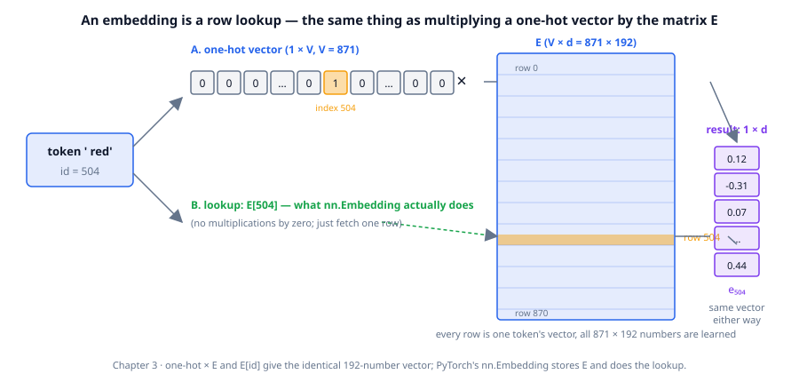
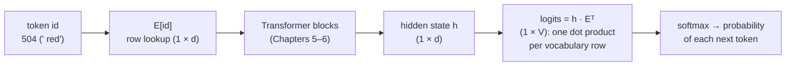
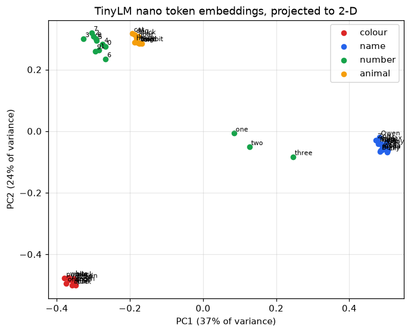

# Chapter 3: Embeddings — words as vectors

**Part I · ~1.5 hours · Prerequisites: Chapters 1, 2**

> 🎯 Goal: Explain what an embedding is and why similar tokens end up near each other.
> 🧪 Lab: `labs/lab03_embeddings.py` · 🎛️ Interactive: `interactive/03_vector_playground.html`

## Why this matters

Chapter 2 turned text into integers: in the course tokenizer `" red"` is 504, `" blue"` is 480 and `" Mia"` is 359. Those integers are labels, not quantities — 504 is not "closer" to 480 than to 359 in any sense that matters, and a model that did arithmetic on them would be learning from noise. A language model needs a representation in which *similar things are near each other* and in which arithmetic is meaningful, because everything that follows (attention in Chapter 5, the Transformer block in Chapter 6) is arithmetic. That representation is the **embedding**: a table that maps each token id to a list of `d` numbers, learned along with the rest of the model. This chapter shows what the table is, how to measure "near", and what a trained TinyLM's table looks like. The headline: after a minute of training on Storyland, nobody told the model that `" red"` is a colour, yet its five nearest tokens are `" purple"`, `" blue"`, `" white"`, `" orange"` and `" black"`, and `" Mia"`'s neighbours are all names.

## The idea in pictures 📐

### From a one-hot vector to a lookup

The naive way to hand an integer to a model is a **one-hot vector**: a list of `V` numbers (one per vocabulary entry) that is all zeros except for a single 1 at the token's index. Every token is then equally far from every other token, and each vector is 871 numbers long in our case — 128,256 for Llama 3 — almost all of them zero.



In the figure, path A multiplies the one-hot vector (1 × V) by the **embedding matrix** `E` (V × d): every entry of the result is a sum of `V` products of which all but one are zero, so the result is row 504 of `E`. Path B fetches row 504 directly. They give the identical vector, and the lookup skips 870 multiplications by zero per token; that is what `torch.nn.Embedding` does. The important fact is not the shortcut but what it means: *an embedding layer is a matrix multiply by a one-hot input*, so it is an ordinary linear layer whose weights get gradients like any other, and the rows of `E` are ordinary parameters.

The result has `d` numbers. `d` is the **dimension** of the embedding (`d_model` in the library: 96 for the nano preset, 192 for small, 8,192 for Llama-3-70B). A **vector** is such a list of numbers, thought of as a point — or an arrow from the origin — in a `d`-dimensional space. Two dimensions you can draw; 192 you cannot, but every formula below works the same way for any `d`. A helpful analogy is that each coordinate is a dial the model can turn: "how colour-like", "how name-like", "how plural". The limit of the analogy: in a trained model the dials are not neatly labelled, and a concept is usually spread across many coordinates at once.

### Measuring "near": the dot product and cosine similarity

The **dot product** of two vectors multiplies them coordinate by coordinate and adds up:

$$
a \cdot b = \sum_{i=1}^{d} a_i b_i
$$

Read this as: "for each coordinate, multiply the two entries; then add all the products." It is large and positive when the vectors point the same way, zero when they are at right angles, and negative when they point in opposite directions — but it also grows with the *lengths* of the vectors, so a long vector has a big dot product with everything. **Cosine similarity** removes the lengths:

$$
\cos(a, b) = \frac{a \cdot b}{\lVert a \rVert \, \lVert b \rVert}
$$

Read this as: "the dot product divided by both lengths — the cosine of the angle between the two arrows." It is +1 for the same direction, 0 for perpendicular, −1 for opposite, whatever the lengths. `‖a‖` is the **norm** (length) of `a`: the square root of `a · a`. Here are the values for three 2-D arrows:

| pair | dot | cosine |
|---|---|---|
| `a = (3, 4)` vs `b = (6, 8)` (same direction, twice as long) | 50 | 1.00 |
| `a` vs `c = (4, −3)` (right angle) | 0 | 0.00 |
| `a` vs `−a` | −25 | −1.00 |

The dot product is the single most common operation in a Transformer: attention scores (Chapter 5) are dot products between queries and keys, and the model's output **logits** (the raw, un-normalised score for each possible next token, which `softmax` turns into probabilities; Chapter 0) are dot products between a hidden state and the embedding rows (below).

### Where the vectors come from: they are learned

Nothing in `E` is designed. Rows start as small random numbers. During training the loss (Chapter 4) produces a gradient for every row that was looked up, and each row drifts in whatever direction reduces the loss on the contexts it appeared in. Tokens that appear in the same kinds of context receive similar pushes and end up in similar places. This is the old linguistic idea that "you shall know a word by the company it keeps" (Firth, 1957), rediscovered as a side effect of next-token prediction. It has a consequence you will see in the lab: the embedding reflects the *training data's* statistics, not the world's. In Storyland every colour can replace every other colour in every template, so the model learns colour-ness strongly and the difference between red and blue barely at all.

### The same matrix, used twice: tied embeddings

Here is the flow of one token through TinyLM, from id to next-token probabilities:



The input side looks up a row of `E`. The Transformer blocks turn that row into the **hidden state** `h`, a vector of `d` numbers that summarises the position and its context. The output side computes a score for every possible next token — and in TinyLM (and GPT-2, Gemma, and most small models) that score is the dot product of the hidden state with the *same* row of `E`. This is **tied embeddings** (weight tying): `model.lm_head.weight` and `model.embed.weight` are one tensor. It saves `V × d` parameters (167,232 for TinyLM small — 7% of the model; over a billion for a 128k-vocabulary model), and it forces the input and output spaces to agree: a hidden state that "means red" is close to the row for `" red"`, so it produces a high logit for `" red"`. The largest models often untie the two matrices because at their scale the parameter saving is negligible and separate matrices give a little extra capacity; whether to tie is a size-dependent engineering choice, not a settled rule.

### Seeing 96 dimensions in two

To draw the space we need to throw away dimensions. **Principal component analysis (PCA)** finds the two directions along which a set of points is most spread out and projects every point onto them. The lab does it with a singular value decomposition (SVD, a standard matrix factorisation that numpy provides; only the two lines that use it matter here) — no extra library needed — and reports how much of the total spread the two directions capture (46% for the small model in the figure below, 61% for the nano model — faithful, but not complete).



In the figure, the four categories form four separate clusters — colours, animals and digits tight, names more spread out — and the number words `one`, `two`, `three` sit apart from the digits, because in Storyland they only ever appear in the counting template ("one, two, three"). No label was given to the model; the clusters are the company each token kept.

One thing an embedding does *not* carry is position. `E[" kite"]` is the same vector whether the word is the first or the fifteenth token; the model learns about order in the attention layer (RoPE, Chapter 5).

## The idea in code

All snippets assume:

```python
import numpy as np, torch, torch.nn.functional as F
from llm.pipeline import get_base_model, get_tokenizer
from llm.model import TinyLM
from llm.config import preset
```

### A lookup is a one-hot matmul

```python
tok = get_tokenizer()
V, d = tok.vocab_size, 192
emb = torch.nn.Embedding(V, d)                 # weight E: (V, d), random for now
ids = torch.tensor(tok.encode(" red kite"))    # (2,)  -> [504, 531]
onehot = F.one_hot(ids, V).float()             # (2, V): one 1 per row
via_matmul = onehot @ emb.weight               # (2, V) @ (V, d) -> (2, d)
via_lookup = emb(ids)                          # (2, d)
assert torch.equal(via_matmul, via_lookup)
```

### Cosine similarity, and nearest neighbours in a trained model

```python
model, tok = get_base_model(quick=True)        # nano base model (trains one if runs/base_nano.pt is missing)
E = model.embed.weight.detach()                # (V, d) — learned parameters
En = F.normalize(E, dim=1)                     # divide each row by its norm -> rows of length 1

def neighbours(word, k=5):
    i = tok.encode(word)[0]
    sims = En @ En[i]                          # (V,)  dot of unit vectors = cosine
    sims[i] = -2                               # exclude the word itself
    top = sims.topk(k)
    return [(tok.token_str(j), round(s, 2)) for s, j in zip(top.values.tolist(), top.indices.tolist())]

neighbours(" red")   # [(' purple', 0.95), (' blue', 0.95), (' white', 0.94), (' orange', 0.94), (' black', 0.93)]
```

`F.normalize` turns every row into a unit vector, so one matrix–vector product gives the cosine of `" red"` with all 871 tokens at once. (The lab additionally skips control bytes and special tokens as candidates.)

### PCA with numpy's SVD

```python
words = [" red", " blue", " green", " Mia", " Leo", " Ava", " dog", " cat"]
X = E[[tok.encode(w)[0] for w in words]].numpy()     # (8, d)
Xc = X - X.mean(axis=0)                              # centre the cloud on the origin
U, S, Vt = np.linalg.svd(Xc, full_matrices=False)    # rows of Vt: directions of greatest spread
P = Xc @ Vt[:2].T                                    # (8, 2): coordinates on the top two directions
explained = S**2 / (S**2).sum()                      # fraction of variance per direction
```

### Tied embeddings, from `llm/model.py`

The tie is two lines in `TinyLM.__init__`:

```python
self.embed = nn.Embedding(cfg.vocab_size, cfg.d_model)
self.lm_head = nn.Linear(cfg.d_model, cfg.vocab_size, bias=False)
if cfg.tie_embeddings:
    self.lm_head.weight = self.embed.weight       # one tensor, two jobs
```

and you can confirm what the output layer computes:

```python
ids = torch.tensor([tok.encode("Mia had a")])                 # (1, T)
logits, _, h = model(ids, return_hidden=True)                # logits (1, T, V); h (1, T, d)
manual = h[0, -1] @ E.T                                      # (d,) @ (d, V) -> (V,)
assert torch.allclose(logits[0, -1], manual, atol=1e-4)      # logit for token t = h · E[t]
```

## Worked example 🧪

Run `python3 labs/lab03_embeddings.py` (quick mode: the nano base model, `runs/base_nano.pt`; a few seconds if the checkpoint exists, about a minute if it has to train one) and then `--full` (the small base model, `runs/base_small.pt`; 5–10 minutes if it has to train one). If another lab is already training the checkpoint, the lab waits for it (polling every 30 s for up to 10 minutes) rather than training a duplicate. The excerpts below are real output from the checkpoints in `runs/`; if you retrain a base model, the exact cosines and orderings will shift (the *pattern* will not).

**Section 1 — the lookup.**

```
tokens: [' red', ' kite'] ids: [504, 531]
one-hot shape (2, 871), ones per row [1.0, 1.0]
max |onehot @ E - E[ids]| = 0.0e+00
✅ one-hot @ E == E[ids]: an embedding is a row lookup
a one-hot vector stores 871 numbers per token (all but one zero); the embedding stores 192, all of them informative
```

**Section 3 — nearest neighbours (quick mode, nano model: 3 layers, d = 96).**

```
model: 3 layers, d_model=96, vocab=871; embedding matrix (871, 96) = 83,616 parameters (22% of the model)
E[' red'][:6] = [-0.007, 0.012, -0.08, -0.074, -0.051, 0.096] ...
row norms: mean 0.699, min 0.520, max 0.950

nearest neighbours (cosine) in the TRAINED embedding matrix:
  ' red'     -> ' purple' 0.95, ' blue' 0.95, ' white' 0.94, ' orange' 0.94, ' black' 0.93
  ' kite'    -> ' lamp' 0.93, ' ring' 0.92, ' drum' 0.92, ' boat' 0.92, ' shell' 0.92
  ' Mia'     -> ' Ruby' 0.93, ' Finn' 0.92, ' Lily' 0.91, ' Sam' 0.91, ' Ava' 0.91
  '7'        -> '77' 0.94, '22' 0.93, '48' 0.93, '60' 0.92, '62' 0.92
  ' three'   -> ' two' 0.45, ' were' 0.43, ',' 0.28, ' down' 0.24, '!' 0.19
(note: ' 7' is two tokens in this tokenizer — ' ' and '7' — so we probe the digit '7')

for contrast, neighbours of ' red' in an UNTRAINED model:
  ' k' 0.36, ' O' 0.29, '196' 0.28, ' pro' 0.26, ' sit' 0.26
```

Three things to look at. First, the categories: colours near colours, objects near objects, names near names, numbers near numbers, with cosines above 0.9. Second, the *untrained* model: the same code on random rows gives arbitrary neighbours with cosines around 0.3 — the structure is entirely learned. Third, `" three"`: its neighbours are `" two"`, `" were"` and a comma, because in Storyland the word only occurs in "one, two, three. There were three ...", so the company it keeps is that one template. An embedding is a summary of the contexts a token was seen in; it cannot know more than the data showed it. Note also the tokenizer detail: `" 7"` is not one token (numbers were pre-tokenized separately from the space in Chapter 2), so the lab probes the digit `"7"` — which sits with other numbers from the arithmetic documents.

**Section 4 — group structure.** The mean cosine between every pair of categories (nano model):

```
mean cosine between groups (rows/cols: colour, name, object, animal, number):
  colour    0.92  -0.11   0.35  -0.12  -0.06
  name     -0.11   0.91  -0.31  -0.07  -0.24
  object    0.35  -0.31   0.83  -0.05  -0.07
  animal   -0.12  -0.07  -0.05   0.93   0.10
  number   -0.06  -0.24  -0.07   0.10   0.47
mean within-group cosine 0.812 vs across-group -0.057
✅ tokens are closer to their own category than to others
```

Within-group cosines of 0.92 are remarkably high: the nano model has learned that colours are interchangeable, which in Storyland they are. Colours and objects are mildly similar (0.35) — both appear as "a {colour} {object}"; names and objects are *anti*-correlated (−0.31) — they never fill the same slot.

**Section 5 — PCA.** `top-2 principal axes explain 34% + 27% = 61% of the variance in 96 dimensions`, and the figure above.

**Section 6 — tied embeddings.**

```
✅ model.lm_head.weight IS model.embed.weight (one tensor, two jobs)
logits shape (1, 3, 871); max |logits - h·Eᵀ| = 9.5e-07
✅ next-token logits = hidden state · embedding rows
after 'Mia had a', top next tokens: ' orange' 0.12, ' blue' 0.11, ' pink' 0.10, ' white' 0.09, ' red' 0.09
parameters: tied 379,200 vs untied 462,816 -> tying saves 83,616 (= V x d = 871 x 96)
```

After "Mia had a" the model's top five candidates are all colours, at roughly equal probability — which is both correct (the template is "{A} had a {c} {o}") and a direct picture of the embedding geometry: the hidden state points toward the colour cluster, and every colour row has about the same dot product with it.

**Full mode — the small model (6 layers, d = 192, 700 training steps).** The same sections with `--full`:

```
model: 6 layers, d_model=192, vocab=871; embedding matrix (871, 192) = 167,232 parameters (7% of the model)
row norms: mean 1.556, min 0.500, max 2.341

nearest neighbours (cosine) in the TRAINED embedding matrix:
  ' red'     -> ' orange' 0.93, ' purple' 0.92, ' black' 0.92, ' yellow' 0.91, ' white' 0.91
  ' kite'    -> ' map' 0.79, ' book' 0.71, ' cake' 0.70, ' cup' 0.70, ' rope' 0.68
  ' Mia'     -> ' Zoe' 0.60, ' Ruby' 0.57, ' Sam' 0.57, ' Jack' 0.56, ' Lily' 0.54
  '7'        -> '2' 0.76, '8' 0.74, '16' 0.74, '13' 0.72, '5' 0.71
  ' three'   -> ' two' 0.38, ' for' 0.24, ',' 0.24, ' were' 0.18, ' more' 0.17
' red' neighbours that are colours: 5/5 | ' Mia' -> names: 5/5 | '7' -> digits: 5/5

mean cosine between groups (rows/cols: colour, name, object, animal, number):
  colour    0.91  -0.07   0.17  -0.06  -0.05
  name     -0.07   0.47  -0.09  -0.07  -0.21
  object    0.17  -0.09   0.56  -0.05  -0.07
  animal   -0.06  -0.07  -0.05   0.90   0.05
  number   -0.05  -0.21  -0.07   0.05   0.40
mean within-group cosine 0.649 vs across-group -0.046
top-2 principal axes explain 27% + 19% = 46% of the variance in 192 dimensions
after 'Mia had a', top next tokens: ' blue' 0.11, ' brown' 0.11, ' red' 0.11, ' green' 0.10, ' orange' 0.10
parameters: tied 2,529,024 vs untied 2,696,256 -> tying saves 167,232 (= V x d = 871 x 192)
```

The categories are the same, but the bigger model, trained longer, keeps its names *apart*: the within-name cosine drops from 0.91 (nano) to 0.47, and `" Mia"`'s nearest name is only 0.60 away. Colours and animals stay near-interchangeable (0.91, 0.90) because Storyland never distinguishes them, while names appear in more varied slots (subject, object, possessive `Mia's`) and the Q&A lines ask *which* name did what, so telling names apart pays off in the loss. The embedding matrix has also spread out: row norms now range from 0.50 to 2.34 (mean 1.56) against a mean of 0.70 in the nano model, and two principal axes capture only 46% of the variance instead of 61% — the extra dimensions are being used. This is a preview of a theme that recurs through the course: what a model learns is exactly what the data rewards, and more capacity is spent where the loss cares.


The lab ends with `8/8 checks passed`.

## Try it yourself ✍️

1. **More neighbours.** Print the neighbours of `" park"`, `" beach"`, `" happy"` and `"."`. Which categories does the model group that the lab did not check? Does `"."` have meaningful neighbours?
2. **Space or no space.** `"Mia"` (id 675, sentence-initial) and `" Mia"` (id 359) are different tokens. Compute their cosine. Then compare `"red"` — which is two tokens, `"re"` + `"d"` — and explain why you cannot look up a single row for it.
3. **The average colour.** Compute the mean of the ten colour rows and find its nearest tokens. Then compute `E[" red"] − E[" blue"]` and find the nearest tokens to that difference vector. Is the difference between two colours meaningful in this model? Relate your answer to the 0.92 within-group cosine.
4. **Use the dot product instead of cosine.** Rewrite `neighbours` without `F.normalize`. Which tokens jump to the top and why? (Look at their row norms.)
5. **Dimension.** Train a nano model with `d_model=32` (Chapter 10's `train()`; about a minute) and compare the within-/across-group table. Does a narrower embedding still separate the categories?
6. **Untie.** Build `TinyLM(preset("nano", vocab_size=tok.vocab_size, tie_embeddings=False))`, confirm `num_params` grows by `V × d`, and train it for the same 150 steps as the quick base model. Compare final validation loss with the tied model. (Expect a small difference in either direction; the point is to see the size of the effect.)

🎛️ In `interactive/03_vector_playground.html` you drag the tips of two 2-D arrows **a** and **b** and watch their dot product, lengths and cosine update live. Make them point the same way, opposite ways and at right angles, and notice that the dot product changes sign while the cosine stays between −1 and 1; drag one arrow to twice its length and note that the dot product doubles while the cosine does not move. The word panel below does 2-D word arithmetic: compute *two − one + three* and check which word is the nearest neighbour of the result. The Challenge asks you to make **a** and **b** orthogonal (dot product 0) without making either the zero vector, in two different ways, and to say why an embedding model might want two unrelated words to end up like that.

## Check yourself ✅

<details><summary>1. Why is `nn.Embedding` described as "a linear layer with a one-hot input", and why does that matter for training?</summary>

Multiplying a one-hot vector by the matrix `E` selects one row of `E`, which is exactly what the lookup returns. Because it is a matrix multiply, gradients flow into `E` like into any other weight matrix: the row that was looked up receives a gradient, and rows are learned like all other parameters.
</details>

<details><summary>2. Two tokens have dot product 50. Are they similar?</summary>

You cannot tell. The dot product grows with the lengths of the vectors; two long vectors at a wide angle can have the same dot product as two short vectors pointing the same way. Divide by both norms (cosine similarity) to compare directions independent of length.
</details>

<details><summary>3. Nobody labelled colours in Storyland. How did `" red"` end up next to `" orange"`?</summary>

Both tokens appear in the same template slots ("a {colour} {object}", "wore a {colour} hat"), so the next-token loss pushed their rows in similar directions on similar contexts. The embedding summarises the contexts each token occurred in; tokens with the same contexts end up with similar vectors.
</details>

<details><summary>4. What does tying the embeddings change, and what does it cost or save?</summary>

The output projection uses the same matrix as the input lookup, so the logit for token `t` is the dot product of the hidden state with `E[t]`. It saves `V × d` parameters and forces the input and output representations to share one space. Large models sometimes untie for a little extra capacity; small models almost always tie.
</details>

<details><summary>5. Why do `" one"`, `" two"`, `" three"` sit far from the digits in the PCA plot even though they are all numbers?</summary>

Because their contexts differ: the number words appear only in the counting template ("one, two, three"), while digits appear in arithmetic lines ("12 + 7 = 19"). The embedding tracks context, not meaning as a human would define it.
</details>

## Key takeaways

- An embedding is a learned table `E` of shape `(V, d)`; looking up a token is the same as multiplying its one-hot vector by `E`, so the rows are ordinary parameters.
- The dot product measures alignment but grows with length; cosine similarity divides the lengths out and is the standard "how similar" measure.
- Rows are learned from context: tokens that appear in the same places end up with similar vectors, so an embedding reflects the training data's statistics.
- After one minute of training, TinyLM's colours, names, objects and numbers form separate clusters with within-group cosines above 0.8.
- Tied embeddings reuse `E` as the output layer: logits are dot products between the hidden state and each token's row, saving `V × d` parameters.
- Embeddings carry no position information; that arrives in the attention layer (Chapter 5).

## Going deeper

- Bengio et al., *A Neural Probabilistic Language Model* (2003) — the paper that introduced learned word vectors inside a language model.
- Mikolov et al., *Efficient Estimation of Word Representations in Vector Space* (word2vec, 2013) — where "king − man + woman ≈ queen" comes from. https://arxiv.org/abs/1301.3781
- Pennington, Socher & Manning, *GloVe* (2014) — embeddings from co-occurrence counts, which makes the "company it keeps" idea explicit.
- Press & Wolf, *Using the Output Embedding to Improve Language Models* (2017) — the case for tied embeddings. https://arxiv.org/abs/1608.05859
- Alammar, *The Illustrated Word2vec* (2019) — pictures for everything in this chapter. https://jalammar.github.io/illustrated-word2vec/
- Olah, *Deep Learning, NLP, and Representations* (2014) — an early, clear essay on why embeddings form structure.
- 🆕 The 2026 open-weight models (DeepSeek-V4, Qwen3.8, GLM-5.2, Kimi K3 — as reported by aggregators) keep exactly this lookup-table embedding; what has changed is vocabulary size (128k–256k tokens) and the growing share of parameters the table represents. https://wavect.io/blog/open-weight-llm-comparison-2026/

---

← [Chapter 2](02-tokenization.md) · [Course home](../README.md) · [Chapter 4](04-how-networks-learn.md) →
