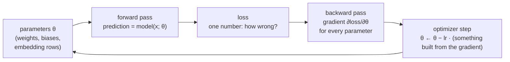
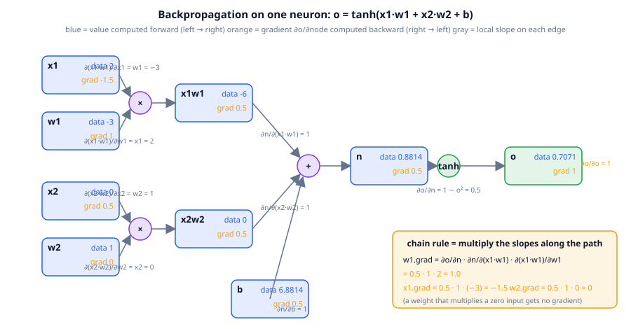
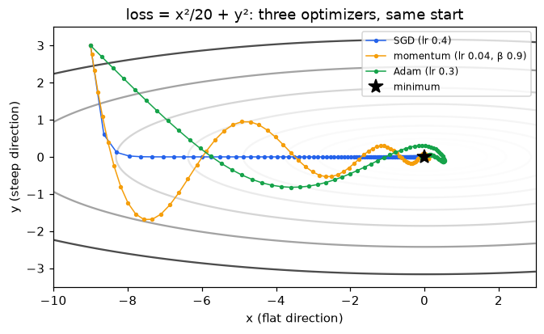
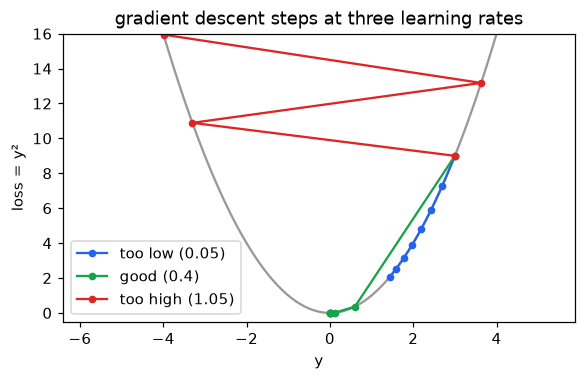
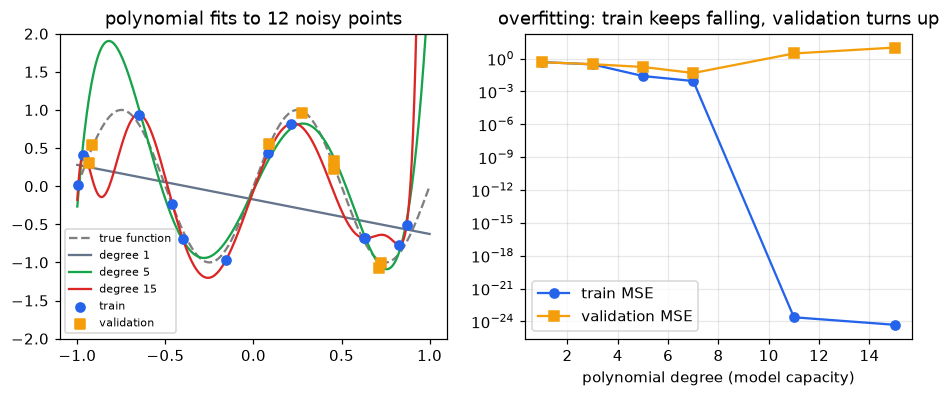
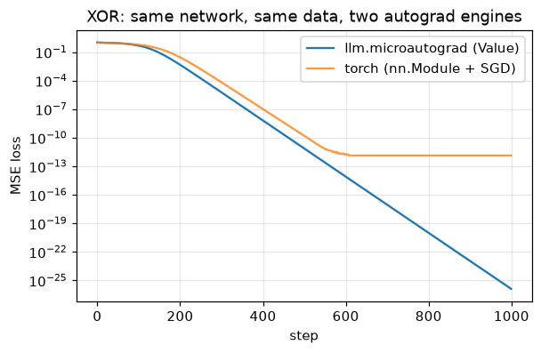

# Chapter 4: How neural networks learn (the minimum you need)

**Part I · ~2 hours · Prerequisites: Chapters 1, 3**

> 🎯 Goal: Explain loss, gradient, backpropagation and an optimizer step in your own words.
> 🧪 Lab: `labs/lab04_autograd.py` · 🎛️ Interactive: `interactive/04_gradient_descent.html`

## Why this matters

Chapter 3 ended with a promise: the embedding matrix, and every other number in TinyLM, is "just a parameter that gets learned". This chapter pays that promise. TinyLM has about 2.5 million parameters; the largest open-weight models of 2026 are reported at 1.6 trillion (DeepSeek-V4) to 2.8 trillion (Kimi K3). Nobody sets a single one of them by hand. One mechanism sets all of them: measure how wrong the model is, work out for every parameter which direction would make it less wrong, nudge every parameter a little in that direction, and repeat. That loop is the whole of pretraining (Chapter 10), fine-tuning (Chapter 15) and reinforcement learning (Chapters 18–21); only the definition of "wrong" changes. The concrete example we use is XOR — a function so small you can write it as a four-row table, yet one that a single neuron provably cannot represent. A network with 17 parameters learns it from random weights in 200 steps, and by the end of the chapter you will have watched every gradient of that network being computed by an engine of about 100 lines (`Value` in `llm/microautograd.py`) that you can read in full.

## The idea in pictures 📐

### The loop

Every learning algorithm in this course is the following cycle.



In the diagram, the parameters feed a **forward pass** — running the model on an input to get a prediction. A **loss function** turns the prediction and the correct answer into a single number that is zero when the prediction is perfect and grows as it gets worse. The **backward pass** computes, for every parameter, how much the loss would change if that parameter changed a tiny bit. The **optimizer** uses those numbers to move the parameters, and the loop starts again. One trip round the loop is a **training step**.

### A neuron and a layer

A **neuron** is the smallest unit: it multiplies each input by a **weight**, adds the products and a **bias**, and pushes the sum through an **activation function** — a fixed non-linear curve such as `tanh` or `relu` that lets stacks of neurons represent bends and corners, not only straight lines.

$$
o = \tanh\big(x_1 w_1 + x_2 w_2 + b\big)
$$

Read this as: "the output is the inputs, each scaled by its weight, summed with the bias, then squashed into the range −1 to 1".

A **layer** is a row of neurons that all read the same inputs; a **multi-layer perceptron (MLP)** is a chain of layers where each layer's outputs are the next layer's inputs. `MLP([2, 4, 1])` in `llm/microautograd.py` has 2 inputs, one hidden layer of 4 neurons and 1 output: (2·4 + 4) + (4·1 + 1) = 17 parameters. Inside TinyLM the same idea appears as `llm.model.MLP` (Chapter 6), where the "row of neurons" is one matrix multiply.

### Loss: one number for "how wrong"

For XOR we use **mean squared error (MSE)**: the average over examples of the squared difference between the prediction and the target.

$$
L = \frac{1}{N}\sum_{i=1}^{N}\big(\hat y_i - y_i\big)^2
$$

Read this as: "for each of the N examples, take the prediction minus the truth, square it so that over- and under-shooting both count as bad, and average". For language models the loss is **cross-entropy** — the negative log-probability the model gave to the correct next token (you met it as "surprise" in Chapter 1). The mechanics below do not care which loss you pick.

### Gradient: which way is downhill

The **derivative** of a function at a point is its slope there: if you nudge the input by a tiny amount `h`, the output moves by about `slope × h`. The **gradient** of the loss is the list of slopes with respect to every parameter — one number per parameter, saying "if this parameter goes up a little, the loss goes up by this much per unit". A positive slope means "increase this and things get worse", so we move the other way. Stepping every parameter a little against its gradient is **gradient descent**:

$$
\theta \leftarrow \theta - \eta \, \nabla_\theta L
$$

Read this as: "new parameters = old parameters minus the learning rate times the gradient". The **learning rate** η is how big a step to take.

An analogy that helps: you are on a hillside in thick fog and want to reach the valley. You cannot see the valley, but you can feel the slope under your feet, so you step downhill and feel again. The limit of the analogy: the "hill" for TinyLM lives in 2.5-million-dimensional space, there is no map, and "downhill" is only known at the point where you are standing. That is why we keep the steps small and take many of them.

### Backpropagation: the chain rule as a graph

How do we get one slope per parameter without trying each parameter one at a time (which would cost one forward pass per parameter — trillions for a frontier model)? The answer is **backpropagation**: record the computation as a graph of small operations, each of which knows its own local slope, then walk the graph backwards multiplying slopes together.



In the figure, the forward pass runs left to right: `x1·w1 = −6`, `x2·w2 = 0`, their sum plus `b` gives `n = 0.8814`, and `tanh` gives `o = 0.7071`. Each edge is labelled with a local slope that depends only on that one operation: for a product, the slope with respect to one factor is the *other* factor (∂(x1·w1)/∂w1 = x1 = 2); for a sum it is 1; for `tanh` it is `1 − o² = 0.5`. The backward pass runs right to left, starting from ∂o/∂o = 1, and at each node multiplies the gradient that arrived by the local slope. That is the **chain rule**:

$$
\frac{\partial o}{\partial w_1} = \frac{\partial o}{\partial n}\cdot\frac{\partial n}{\partial (x_1 w_1)}\cdot\frac{\partial (x_1 w_1)}{\partial w_1} = 0.5 \cdot 1 \cdot 2 = 1.0
$$

Read this as: "to find how `o` responds to `w1`, multiply the slopes along the path from `w1` to `o`". Two details in the figure repay attention. The node `w2` gets gradient 0 because it multiplies an input that is 0 — a weight cannot learn from an example where its input is off. And the gradient at `n` is 0.5 but at `o` is 1: `tanh` is "flattening" the signal, and a saturated `tanh` (output near ±1) would flatten it to almost nothing, which is one reason modern networks prefer `relu`-like activations and normalisation layers (Chapter 6).

### Optimizers: what to do with the gradient

Plain gradient descent is rarely used as is. The lab draws three optimizers on the same landscape, `loss = x²/20 + y²`, a bowl that is 20× wider along `x` than along `y` — a *valley*. Its gradient is large along `y` (the steep walls) and tiny along `x` (the valley floor), which is exactly the situation real losses put you in: some directions are steep, most are flat.



- **SGD** (stochastic gradient descent) is the plain update above. The word *stochastic* means the gradient is computed on a random **minibatch** — a small sample of the training data — rather than on everything, so each step is a noisy estimate of the true downhill direction. In the figure it drops straight down the steep wall, then inches along the floor because the gradient there is small.
- **Momentum** keeps a running velocity `v ← βv + g` and steps along `v`. Consecutive gradients that agree (along the valley floor) add up; ones that flip sign (across the walls) cancel. In the figure it reaches the floor in 61 steps but overshoots the walls first — momentum with β = 0.9 behaves like a heavy ball.
- **Adam** keeps two running averages per parameter, the mean of the gradient `m` and the mean of its square `s`, and steps by `m / √s`. Dividing by √s means every coordinate moves by roughly `lr` per step no matter how steep it is, so the step along the flat `x` direction is as large as the step along steep `y`. In the figure Adam walks the floor in a straight line at constant speed. **AdamW** is Adam plus **weight decay** — each step also shrinks every parameter slightly toward zero (`θ ← θ − lr·λ·θ`), which discourages any single weight from growing large. AdamW is the default for almost every language-model run since 2019.

$$
m \leftarrow \beta_1 m + (1-\beta_1) g, \qquad s \leftarrow \beta_2 s + (1-\beta_2) g^2, \qquad \theta \leftarrow \theta - \eta\,\frac{\hat m}{\sqrt{\hat s} + \epsilon}
$$

Read this as: "remember a smoothed gradient and a smoothed squared gradient; step by the ratio, so that the step size is about η in every direction". The hats denote a small correction for the first few steps, when the averages start at zero.

🆕 In 2025–2026 a newer optimizer, **Muon**, became the default for the largest open pretraining runs (Kimi K2, GLM-5, DeepSeek-V4 are reported to use it). Muon treats each weight *matrix* as a unit and replaces its momentum-averaged gradient by the nearest orthogonal matrix (one whose columns all have length 1 and are mutually perpendicular, so every direction gets an equal-sized push) before stepping; the commonly cited figure is about 2× the compute-efficiency of AdamW (Moonshot, "Muon is Scalable", 2025; the 2026 study at https://arxiv.org/abs/2607.20548 reports it matching or beating AdamW on hybrid MoE models up to 3T tokens). `llm/optim.py` contains a from-scratch Muon; Chapter 10 uses it. Everything in this chapter still applies: Muon is one more way to turn a gradient into a step.

### Learning rate: the one knob you must get right

On `loss = y²` each gradient step multiplies `y` by `(1 − 2·lr)`. At lr = 0.05 the factor is 0.9: convergence, but slowly. At lr = 0.4 it is 0.2: fast. At lr = 1.05 it is −1.1: each step *overshoots* the minimum and lands further away on the other side, and the loss explodes.



Real losses are not this clean, but the pattern is the same: too low wastes compute, too high diverges, and the safe window depends on the curvature of the loss (how quickly the slope itself changes; 2 for `y²`), which changes during training. That is why real runs use a **learning-rate schedule** — warm up from zero so the first noisy steps are small, hold, then decay (`llm.optim.lr_at`, Chapter 10).

### Batch size

The gradient on a minibatch of B examples is the average of B per-example gradients. Larger B means a less noisy estimate of the true gradient but more compute per step; smaller B means more steps per unit of compute but noisier ones. Language models in 2026 train on batches of millions of tokens; TinyLM uses 32 sequences × 128 tokens = 4,096 tokens per step (Chapter 10's `TrainConfig`). Steps × tokens per step is the training-token budget *D* of Chapter 9.

### Overfitting and the validation split

A model with enough parameters can reproduce its training data exactly — including the noise. That is **overfitting**: training loss keeps falling while performance on *new* data gets worse. The defence is to hold out a **validation set** the model never trains on and to watch the loss there. The lab fits polynomials of rising degree to 12 noisy points from a sine curve and measures the error on 8 held-out points:



Every pretraining run in this course logs a `val loss` next to the training loss for exactly this reason. Chapter 10's `train()` computes it every `eval_every` steps.

## The idea in code

All snippets below assume:

```python
import torch, torch.nn as nn
from llm.microautograd import Value, MLP, sgd_step, train_xor
```

### A number that remembers how it was made

`Value` wraps one float. Every arithmetic operation returns a new `Value` that remembers its parents and a closure (a small inner function that keeps access to the variables around it) that knows the local slope. Here is multiplication, the whole idea in twelve lines (from `llm/microautograd.py`):

```python
def __mul__(self, other):
    other = other if isinstance(other, Value) else Value(other)
    out = Value(self.data * other.data, (self, other), "*")

    def _backward():                       # d(a*b)/da = b, d(a*b)/db = a
        self.grad += other.data * out.grad
        other.grad += self.data * out.grad
    out._backward = _backward
    return out
```

`out.grad` will hold ∂loss/∂out once the backward pass reaches this node; the closure multiplies it by the local slope and *adds* it into each parent's `.grad`. The `+=` matters: a value used in two places receives gradient from both.

### The backward pass

`backward()` orders the graph so that every node comes after all the nodes that depend on it, seeds `self.grad = 1`, and calls each node's closure in that order:

```python
def backward(self) -> None:
    order, seen = [], set()
    def build(v):
        if id(v) not in seen:
            seen.add(id(v))
            for child in v._prev:
                build(child)
            order.append(v)
    build(self)
    self.grad = 1.0                        # d(loss)/d(loss) = 1
    for v in reversed(order):
        v._backward()
```

That is the entire engine. `torch.autograd` does the same thing on tensors instead of scalars, with hundreds of operations instead of eight, and with C++ kernels; conceptually nothing is added.

### The neuron from the figure

```python
x1, x2 = Value(2.0), Value(0.0)
w1, w2 = Value(-3.0), Value(1.0)
b = Value(6.8813735870195432)
o = (x1 * w1 + x2 * w2 + b).tanh()   # forward: o.data = 0.7071
o.backward()                         # backward: fills every .grad
print(w1.grad, x1.grad, w2.grad)     # 1.0  -1.5  0.0
```

### The training loop, in the engine and in PyTorch

`train_xor` in the library is the loop from the flowchart, written out:

```python
net = MLP([2, 4, 1], seed)                   # 17 parameters, random start
for _ in range(steps):
    preds = [net(x) for x in xs]                             # forward
    loss = sum(((p - y) ** 2 for p, y in zip(preds, ys)), Value(0.0)) * (1 / len(xs))
    net.zero_grad()                                          # .grad accumulates, so reset
    loss.backward()                                          # backward
    sgd_step(net.parameters(), lr)                           # p.data -= lr * p.grad
```

The PyTorch version of the same loop, from the lab, is line-for-line the same with each job handed to a library object:

```python
net = nn.Sequential(nn.Linear(2, 4), nn.Tanh(), nn.Linear(4, 1))  # MLP([2, 4, 1])
opt = torch.optim.SGD(net.parameters(), lr=0.1)                   # sgd_step
for _ in range(steps):
    pred = net(xs)                          # (4, 1)   forward on all four examples at once
    loss = ((pred - ys) ** 2).mean()        # ()       MSE
    opt.zero_grad()                         # net.zero_grad()
    loss.backward()                         # loss.backward()
    opt.step()                              # sgd_step(...)
```

Swap `torch.optim.SGD` for `torch.optim.AdamW(net.parameters(), lr=1e-3, weight_decay=0.1)` and you have the optimizer used for most of this course. `llm/train.py` (Chapter 10) is this loop plus batching, a schedule, gradient clipping and checkpointing.

### Adam in ten lines of numpy

The lab implements all three optimizers on the 2-D bowl. Adam is:

```python
m, s = np.zeros(2), np.zeros(2)          # first and second moment estimates
b1, b2, eps = 0.9, 0.999, 1e-8
for t in range(1, n_steps + 1):
    g = grad_fn(p)                        # (2,)  gradient at the current point
    m = b1 * m + (1 - b1) * g             # running mean of the gradient
    s = b2 * s + (1 - b2) * g * g         # running mean of its square
    m_hat, s_hat = m / (1 - b1 ** t), s / (1 - b2 ** t)   # bias correction for early steps
    p = p - lr * m_hat / (np.sqrt(s_hat) + eps)           # per-coordinate step ≈ lr
```

### A learning-rate schedule from the library

```python
from llm.optim import lr_at
[round(lr_at(s, total_steps=100, peak_lr=1.0, warmup_steps=10, kind="cosine"), 2) for s in (0, 5, 10, 50, 99)]
# [0.1, 0.6, 1.0, 0.63, 0.1]  — warm up over 10 steps, then cosine-decay to 10% of peak
```

## Worked example 🧪

Run `python3 labs/lab04_autograd.py` (about 15 seconds) and then `--full` (about 25 seconds; longer XOR runs and more seeds). The lab has six sections; the excerpts below are its actual output.

**Section 1 — one neuron.** The gradients match the figure and match PyTorch to floating-point precision:

```
  x1    data =   2.0000   grad =  -1.5000
  w1    data =  -3.0000   grad =   1.0000
  x2    data =   0.0000   grad =   0.5000
  w2    data =   1.0000   grad =   0.0000
  b     data =   6.8814   grad =   0.5000
  n     data =   0.8814   grad =   0.5000
  o     data =   0.7071   grad =   1.0000
  torch: o = 0.7071; max |grad difference| vs microautograd = 3.6e-07
✅ microautograd gradients match torch.autograd
```

Look at `w2`: its gradient is exactly 0 because `x2 = 0`. Look at `n` and `o`: the `tanh` halved the gradient.

**Section 2 — derivative = slope.** The engine's derivative equals the finite-difference slope `(f(x+h) − f(x−h)) / 2h` for a function built from `relu`, `tanh` and products: `autograd df/dx = 7.30457; (f(x+h)-f(x-h))/2h = 7.30457`. If you ever doubt a gradient, this is how you check it.

**Section 3 — XOR, twice.** Quick mode runs 200 steps:

```
  microautograd loss: step 0: 1.0429  step 25: 0.9611  step 50: 0.8747  step 100: 0.4770  step 199: 0.0049
  200 steps in 0.60s (3.0 ms/step)
  torch          loss: step 0: 1.0759  step 25: 0.9486  step 50: 0.8622  step 100: 0.5953  step 199: 0.0297
  200 steps in 0.36s (1.8 ms/step)
  torch predictions: [-0.89, 0.86, 0.85, -0.76]  targets: [-1.0, 1.0, 1.0, -1.0]
```

Both curves have the same shape: a long plateau near loss 1 (the network outputs about 0 for everything) followed by a sudden drop once the hidden layer finds a useful bend. The two runs differ in their random initial weights, which is why the numbers are not identical. In `--full` mode (1,000 steps) both reach `0.0000` and the PyTorch predictions are `[-1.0, 1.0, 1.0, -1.0]`. Note the timing (from a shared machine; yours will differ): the pure-Python engine is only about 2× slower than PyTorch at this size, because with 17 parameters the cost is Python overhead either way. At TinyLM's size PyTorch's tensor kernels are thousands of times faster.



**Section 4 — three optimizers.** Full mode, 300 steps on the valley:

```
  SGD (lr 0.4)                 final loss 9.34e-11   steps to loss<1e-3: 102
  momentum (lr 0.04, β 0.9)    final loss 8.90e-14   steps to loss<1e-3: 61
  Adam (lr 0.3)                final loss 1.22e-13   steps to loss<1e-3: 79
```

Momentum wins on this landscape because its effective learning rate along the floor is `0.04 / (1 − 0.9) = 0.4` while its oscillations across the walls are damped. Adam's walk is the straightest, but with lr 0.3 it moves at most 0.3 per step and the start is 9 units away, so it needs 30 steps just to arrive at the bottom of the valley. Try lr 0.5 for Adam and you will see it win. There is no universally best optimizer; there is a best optimizer for a given landscape, budget and tuning effort, and for language models the evidence favours AdamW (settled) and, since 2025, Muon for the matrix parameters (well supported, still being studied).

**Section 5 — learning rate.**

```
  lr too low (0.05)  : y after 15 steps =      0.618   (each step multiplies y by +0.90)
  lr good (0.4)      : y after 15 steps =      0.000   (each step multiplies y by +0.20)
  lr too high (1.05) : y after 15 steps =    -12.532   (each step multiplies y by -1.10)
```

**Section 6 — overfitting.** Full mode, median over 10 random draws of 20 noisy points:

```
  degree  train MSE      val MSE   (median over 10 seeds; 12 train / 8 validation points)
       1     0.4813       0.4669
       3     0.2984       0.5067
       5     0.0337       0.1634
       7     0.0068       0.0610
      11     0.0000   12886.3205
      15     0.0000   27745.2240
  best degree by validation error: 7
```

Training error falls all the way to zero — a degree-11 polynomial through 12 points is exact — while validation error is best at degree 7 and then explodes by five orders of magnitude. The training loss alone would have told you to pick degree 15. Quick mode uses 3 seeds and lands on the same conclusion with smaller numbers (degree 15: validation MSE 10.19 vs 0.048 at degree 7).

The lab ends with `8/8 checks passed`.

## Try it yourself ✍️

1. **A third input.** Add `x3 = Value(1.0)` and `w3 = Value(0.5)` to the neuron in Section 1 and predict `w3.grad` before running. (Answer: `x3 · (1 − o²)` at the new `o`.)
2. **Break the engine.** Remove the `+=` in `__add__`'s `_backward` and replace it with `=`. Build `y = x + x` and call `y.backward()`. What does `x.grad` become, and what should it be?
3. **Adam wins.** In Section 4 change Adam's learning rate to 0.5 and momentum's β to 0.95. Which reaches `loss < 1e-3` first now? Then start all three at `(−9, 0.1)` instead of `(−9, 3)` — why does SGD look so much worse?
4. **Find the edge.** For `loss = y²` the divergence threshold is lr = 1.0. Change the landscape to `loss = 3y²` and find the new threshold by experiment, then derive it. (Hint: the step multiplies `y` by `1 − 2·3·lr`.)
5. **Early stopping.** In Section 6 fit degree 15 with gradient descent instead of least squares (the closed-form fit the lab uses; a few hundred steps of `sgd_step` on the coefficients instead) and print validation error every 20 steps. Does validation error go down and then up? Stopping at the minimum is called early stopping and is a form of regularisation (any technique that limits overfitting).
6. **Weight decay.** Add `p.data -= lr * 0.01 * p.data` to `sgd_step` and re-run XOR. Does it still converge? Print the sum of squared parameters with and without decay.

🎛️ In `interactive/04_gradient_descent.html` you pick a landscape (a stretched bowl, the Rosenbrock "valley", or a saddle), choose SGD, momentum or Adam, set a learning rate, click anywhere on the map to drop a start point, and press Step or Run; each run keeps its colour so you can compare trajectories. The valley is the classic hard case: SGD either crawls or explodes, momentum overshoots, Adam adapts its step per coordinate. The Challenge: on the bowl with plain SGD, find a learning rate at which the ball diverges and the largest one at which it still converges, and explain why the threshold is so sharp (the answer is the same `|1 − lr·curvature| < 1` argument as Section 5); then, on the valley, find any optimizer and learning rate that reaches the minimum (1, 1) within 300 steps.

## Check yourself ✅

<details><summary>1. In one sentence each: what is a loss, a gradient, and an optimizer step?</summary>

A loss is a single number measuring how wrong the model's outputs are on some data (zero when perfect). The gradient is the list of slopes of that loss with respect to every parameter — how much the loss would rise per unit increase of each one. An optimizer step changes the parameters using the gradient, in the direction that decreases the loss, by an amount set by the learning rate.
</details>

<details><summary>2. Why does the weight w2 in the figure receive zero gradient, and what does that mean for learning?</summary>

Its local slope is `∂(x2·w2)/∂w2 = x2 = 0`. The chain rule multiplies by that zero, so no gradient reaches `w2` from this example. A weight only learns from examples where its input is non-zero; with a dataset where an input is always zero, that weight never changes.
</details>

<details><summary>3. Backpropagation is "the chain rule on a graph". Why is that cheaper than measuring the effect of each parameter separately?</summary>

Measuring each parameter separately needs one extra forward pass per parameter — for N parameters, N passes. Backpropagation reuses work: one backward walk over the graph delivers the gradient of every parameter at once, at a cost of roughly two forward passes, because each node's local slope is computed once and shared by every path that goes through it.
</details>

<details><summary>4. On loss = y², why does lr = 1.05 diverge while lr = 0.4 converges?</summary>

One step maps `y` to `y − lr·2y = (1 − 2·lr)·y`. Convergence needs `|1 − 2·lr| < 1`, i.e. `0 < lr < 1`. At 0.4 the factor is 0.2 (fast shrink); at 1.05 it is −1.1, so every step overshoots to the other side and grows by 10%.
</details>

<details><summary>5. Training loss is 0.0000 and validation loss is 27,745. What happened, and what should you have looked at?</summary>

The model overfit: it has enough capacity to reproduce the training points (and their noise) exactly, and it behaves arbitrarily between and beyond them. You should have chosen the model — or stopped training — using the validation loss, which was lowest at a much smaller capacity (degree 7 in the lab).
</details>

## Key takeaways

- Learning = repeat {forward, loss, backward, optimizer step}. Every stage of the LLM pipeline is this loop with a different loss.
- A derivative is a slope; the gradient is one slope per parameter; the chain rule multiplies slopes along a path; backpropagation does that for every path at once by walking the computation graph backwards.
- `llm/microautograd.py` is the whole idea in under 200 lines; `torch.autograd` is the same idea on tensors.
- Optimizers differ in what they do with the gradient: SGD steps along it, momentum averages it over time, Adam/AdamW also normalises each coordinate; Muon (2025–2026) orthogonalises whole matrices.
- The learning rate must be neither too low (slow) nor too high (divergence); real runs use warmup and decay schedules.
- Always hold out validation data and watch its loss; training loss alone will tell you to overfit.

## Going deeper

- Rumelhart, Hinton & Williams, *Learning representations by back-propagating errors* (1986) — the paper that made backprop standard.
- Karpathy, *micrograd* and the lecture "The spelled-out intro to neural networks and backpropagation" (2022) — the inspiration for `llm/microautograd.py`. https://github.com/karpathy/micrograd
- Kingma & Ba, *Adam: A Method for Stochastic Optimization* (2014). https://arxiv.org/abs/1412.6980
- Loshchilov & Hutter, *Decoupled Weight Decay Regularization* (AdamW, 2019). https://arxiv.org/abs/1711.05101
- Goodfellow, Bengio & Courville, *Deep Learning* (2016), chapters 6–8 — the textbook treatment of MLPs, backprop and optimizers.
- PyTorch, *Autograd mechanics*. https://pytorch.org/docs/stable/notes/autograd.html
- 🆕 Jordan et al., *Muon* (2024) and Moonshot AI, *Muon is Scalable for LLM Training* (2025) — the optimizer behind Kimi K2 and, reportedly, GLM-5 and DeepSeek-V4. https://pytorch.org/blog/using-muon-optimizer-with-deepspeed/
- 🆕 *SOAP, Muon, and Beyond: Pushing LLM Pretraining Scales* (2026) — Muon vs AdamW on hybrid Mamba-attention MoE models up to 3T tokens. https://arxiv.org/abs/2607.20548

---

← [Chapter 3](03-embeddings.md) · [Course home](../README.md) · [Chapter 5](05-attention.md) →
