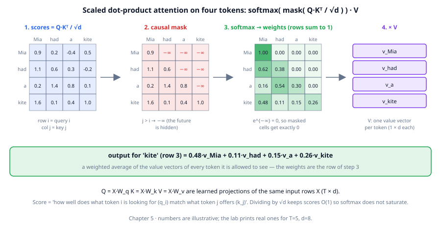
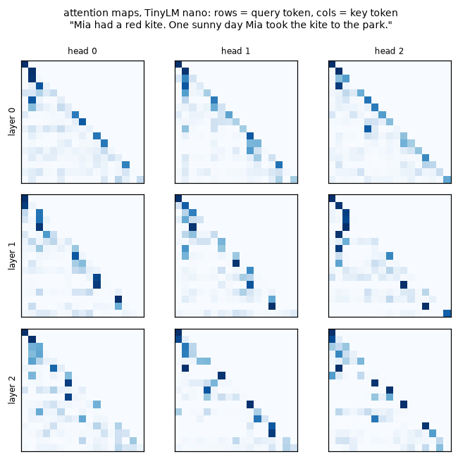

# Chapter 05: Attention

**Part I · ~3 hours · Prerequisites: Chapters 3, 4**

> 🎯 Goal: Explain attention as a soft, learned lookup and implement it.
> 🧪 Lab: `labs/lab05_attention.py` · 🎛️ Interactive: `interactive/05_attention_explorer.html`

## Why this matters

An embedding (Chapter 3) gives every token one fixed vector. But the meaning of `" kite"` in "Mia had a red kite" and in "took the kite to the park" depends on the words around it, and predicting the next token after "took the kite to the" requires knowing that the kite was Mia's, several tokens back. Something has to move information *between positions*. In a Transformer that something is **attention**, and it is the only place where tokens interact; every other layer treats each position on its own. The idea is a lookup that is *soft* (every earlier token contributes, with a weight) and *learned* (the model decides what to look for). This chapter builds it in six lines, verifies the library's version against PyTorch's reference to seven decimal places, and then covers what changes at scale: how positions are encoded (RoPE), why serving long contexts is a memory problem (the KV cache: 40 GiB per 128k-token conversation for a 70B model), and the 2019–2026 line of fixes — MQA, GQA, MLA, FlashAttention, sliding windows and sparse attention.

## The idea in pictures 📐

### A soft lookup

Think of a dictionary: you have a **query** (what you are looking for), every entry has a **key** (what it is filed under), and if the key matches you get back the entry's **value**. Attention is the same, with two changes. Matching is a dot product, so it returns a *score* rather than yes/no; and instead of returning the single best entry it returns a weighted average of *all* values, with weights that sum to 1. Nothing is ever matched exactly, and everything blends — that is the limit of the dictionary analogy, and also the point: a blend is differentiable, so the model can learn what to look for.



In the figure, each of the four tokens has produced a query, a key and a value by multiplying its input vector by three learned matrices. Step 1 forms the score matrix: entry (i, j) is the dot product of query i with key j, divided by √d. Step 2 masks the upper triangle with −∞: token i may not look at tokens after it. Step 3 applies **softmax** to each row — exponentiate every entry and divide by the row's total — so each row becomes a set of positive weights summing to 1, with the −∞ entries becoming exactly 0. Step 4 multiplies the weights by the value vectors: the output for `kite` is `0.48·v_Mia + 0.11·v_had + 0.15·v_a + 0.26·v_kite`, a blend dominated by the token it scored highest against.

The formula for the whole thing is:

$$
\text{Attention}(Q, K, V) = \text{softmax}\!\left(\frac{QK^{\top}}{\sqrt{d}} + M\right) V
$$

Read this as: "score every query against every key with a dot product, shrink the scores by √d, add the mask (0 where looking is allowed, −∞ where it is not), turn each row of scores into weights that sum to 1, and use those weights to average the values." Q, K, V are the `(T, d)` matrices of all queries, keys and values; the result is `(T, d)`, one new vector per token.

### Why divide by √d

A dot product of two random `d`-dimensional vectors with unit-variance entries has standard deviation √d (the lab measures 8.04 for d = 64). Without scaling, larger `d` gives larger scores, softmax puts almost all weight on the single largest one (the lab measures a mean top weight of 0.92 unscaled vs 0.44 scaled at d = 64), and the gradients through a saturated softmax are near zero. Dividing by √d keeps scores of order 1 whatever `d` is.

### Why the causal mask

During training the model predicts the next token at *every* position of a sequence in one forward pass. If position 3 could read position 4, it could copy the answer. The **causal mask** forbids it: query i sees keys 0..i only. The same mask at generation time means the model never depends on tokens it has not produced — which is what makes the KV cache below possible. Removing the mask gives *bidirectional* attention (BERT-style encoders); every generative LLM in this course is **decoder-only** and keeps it.

### Multiple heads

One set of weights can only express one pattern of "who looks at whom" per token. **Multi-head attention** runs `h` independent attentions in parallel, each on a slice of the vector of width `head_dim = d / h`, and concatenates the outputs. In TinyLM small `d = 192`, `h = 6`, `head_dim = 32`. The lab finds a head in the trained model that puts 0.33 of its weight, on average, on the previous token and another that looks mostly at the first token of the sequence. Different heads specialise; Chapter 6 says more about what they do.

### The full path through the library's `Attention`

```mermaid
flowchart LR
    X["x (B, T, d)<br/>from the residual stream"] --> P["q_proj / k_proj / v_proj<br/>q (B,h,T,hd)  k,v (B,kv,T,hd)"]
    P --> R["RoPE: rotate q and k<br/>by their positions"]
    R --> C["KV cache (generation):<br/>append k, v; S = past + T keys"]
    C --> G["GQA: repeat each kv head<br/>h/kv times"]
    G --> S["scores = q·kᵀ / √hd<br/>(B, h, T, S)"]
    S --> M["causal (+ sliding-window)<br/>mask → −∞"]
    M --> W["softmax → weights"]
    W --> V["weights · v<br/>(B, h, T, hd)"]
    V --> O["concat heads → o_proj<br/>(B, T, d)"]
```



Every box is a line or two of `llm/model.py::Attention.forward`. Three boxes go beyond the four-token figure and get their own sections: RoPE, the KV cache and GQA.

### Position: RoPE

Attention has no notion of order: permute the keys and values and the outputs permute the same way, because a weighted sum does not care which term came first. Something has to inject position. **Rotary position embeddings (RoPE)** rotate each query and key vector by an angle proportional to its position — before the dot product — treating the `head_dim` channels as `head_dim/2` pairs, each pair a point in a plane, each plane spinning at its own speed (fast for the first pairs, slow for the last: the lab prints speeds from 1.0 down to 0.00018 radians per position for `head_dim = 32`). The dot product of two rotated vectors depends only on the *difference* of their angles, so the score between query at position i and key at position j depends on i − j and not on i or j themselves:

$$
\langle R_i q,\; R_j k \rangle = \langle q,\; R_{j-i} k \rangle
$$

Read this as: "rotating q by i and k by j, then taking the dot product, is the same as rotating k by (j − i) alone." The lab confirms it numerically: the same q and k at positions (5, 2), (15, 12), (105, 102) and (200, 197) give the identical score −2.0127, and at (5, 3) a different one. Rotation also preserves length, so RoPE does not change the scale of the scores. Because RoPE encodes *relative* offsets, a model can be extended to longer contexts by changing the rotation base frequency (`extend_context` in the library; Chapter 13).

### Generation and the KV cache

When generating, the model produces one token at a time. The new token's query must score against the keys of *all* previous tokens — but those keys and values were already computed when those tokens were processed, and (thanks to the causal mask) they do not change. So we store them: the **KV cache** holds, per layer, the `k` and `v` tensors of every past token, and each generation step computes q, k, v for just the newest token and appends. The memory cost is:

$$
\text{bytes} = 2 \times L \times B \times T \times h_{kv} \times d_{head} \times \text{bytes per number}
$$

Read this as: "two tensors (K and V), for each of L layers, for each of B sequences, for each of T tokens, for each of the kv heads, head_dim numbers each." For TinyLM small at T = 256 in float32 this is 786,432 bytes — the lab checks the formula against the bytes actually held by `model.new_cache()`. For a Llama-3-70B-class model (80 layers, 8 kv heads × 128, bf16) at a 128k-token context it is 40 GiB — for *one* conversation. This is why the 2019–2026 attention variants exist.

### Sharing keys and values: MQA, GQA, MLA

The cache formula has `h_kv` in it, and so does the parameter count of `k_proj` and `v_proj`. The fixes share those across query heads:

| variant | kv heads | k+v params (TinyLM small) | KV cache at 128k, 70B-class | used by |
|---|---|---|---|---|
| **MHA** (multi-head) | `h` = 6 | 73,728 | 320 GiB | GPT-2, Llama 1 |
| **GQA** (grouped-query) | `h / g` = 2 | 24,576 | 40 GiB (8 kv heads) | Llama 2-70B, Llama 3, Qwen, TinyLM |
| **MQA** (multi-query) | 1 | 12,288 | 5 GiB | PaLM, Falcon |
| **MLA** (multi-head latent) | one compressed latent | — | ≈8.6 GiB (DeepSeek-V3 shape) | DeepSeek-V2/V3/V4 |

**Grouped-query attention (GQA)** keeps `h` query heads but only `h_kv` key/value heads; each kv head serves `h / h_kv` query heads (`repeat_interleave` in the library). **Multi-query attention (MQA)** is the extreme, `h_kv = 1`. **Multi-head latent attention (MLA)** (DeepSeek-V2, 2024) instead projects each token's key/value information into a small latent vector (512 numbers in DeepSeek-V3, plus 64 for a shared RoPE key), caches only that, and reconstructs per-head keys and values on the fly; for the DeepSeek-V3 shape the lab computes 8.6 GiB at 128k where MHA would need 488 GiB. The current evidence is that GQA with 4–8 kv heads costs almost no quality versus MHA (Ainslie et al., 2023) and MLA can match MHA while caching less than MQA (DeepSeek-V2 report); MQA alone tends to lose a little.

### FlashAttention: the same maths, done in a different order

The score matrix is `T × T` per head: 65,536 entries at T = 256, 17 *billion* at T = 128k. **FlashAttention** (Dao et al., 2022) never materialises it. It processes keys in blocks, keeps a running softmax normaliser, and writes only the final output — reading and writing GPU memory far less. The result is *numerically the same attention* (up to floating-point order), which is why the lab compares the library's attention to `torch.nn.functional.scaled_dot_product_attention` — the function that dispatches to a FlashAttention kernel on a GPU — and why the chapter's outline insists it is "an implementation trick, not a new model". Any attention variant you can write as softmax(QKᵀ)V can use it.

### Restricting the lookup: sliding windows and 🆕 sparse attention

A **sliding-window** mask lets query i see only keys in `(i − w, i]`. The lab's `causal_mask(6, 6, 0, window=4)` shows the band; a model built with `preset("nano", sliding_window=4)` puts exactly zero weight beyond the window. The cache then holds `w` tokens per layer however long the conversation, and the score matrix is `T × w`. Mistral 7B (2023) and Gemma 2/3 (2024–25) interleave windowed layers with full-attention layers so that some layers retain long-range recall.

🆕 The 2025–2026 frontier goes further, and the pattern is worth knowing even though this course implements only the mask. *Native Sparse Attention* (NSA, 2025) and *DeepSeek Sparse Attention* (DSA, DeepSeek-V3.2, 2025) let each query attend to a small **top-k** subset of keys chosen by a cheap "lightning indexer" rather than to all of them. DeepSeek-V4 (report at https://arxiv.org/abs/2606.19348 ; summary at https://www.lmsys.org/blog/2026-04-25-deepseek-v4/) interleaves two kinds of layer — *Compressed Sparse Attention* (compress every m key/value tokens into one entry, then DSA top-k over the compressed entries, plus a sliding window) and *Heavily Compressed Attention* (much stronger compression, dense attention over what remains) — to make a 1M-token context tractable. Separately, hybrid models (Nemotron-H, Qwen3-Next, Kimi Linear, 2025) replace most attention layers with linear/state-space layers that have no growing cache at all and keep a few full-attention layers for recall. All of these keep the four-token picture intact: scores, a (now sparse or compressed) set of keys, softmax, weighted values. What changes is *which* keys a query is allowed to score.

## The idea in code

All snippets assume:

```python
import math, torch, torch.nn.functional as F
from llm.config import preset
from llm.model import Attention, TinyLM, apply_rope, causal_mask, rope_tables
from llm.pipeline import get_base_model
```

### Attention in six lines (T = 5 tokens, d = 8)

```python
T, d = 5, 8
x = torch.randn(T, d)                                    # (T, d): one row per token
Wq, Wk, Wv = [torch.randn(d, d) / math.sqrt(d) for _ in range(3)]
q, k, v = x @ Wq, x @ Wk, x @ Wv                          # (T, d) each
scores = (q @ k.T) / math.sqrt(d)                         # (T, T): scores[i, j] = q_i · k_j / √d
mask = torch.tril(torch.ones(T, T, dtype=torch.bool))     # query i may see keys 0..i
weights = F.softmax(scores.masked_fill(~mask, float("-inf")), dim=-1)   # rows sum to 1
out = weights @ v                                         # (T, d): weighted average of values
ref = F.scaled_dot_product_attention(q[None, None], k[None, None], v[None, None], is_causal=True)[0, 0]
assert torch.allclose(out, ref, atol=1e-6)
```

### The mask, from `llm/model.py`

```python
def causal_mask(T, S, past, window, device):
    """(T, S) bool: query i (absolute position past+i) may see key j iff j <= past+i,
    and, with a sliding window, j > past+i-window."""
    qpos = torch.arange(past, past + T, device=device)[:, None]
    kpos = torch.arange(S, device=device)[None, :]
    allowed = kpos <= qpos
    if window is not None:
        allowed &= kpos > qpos - window
    return allowed
```

`past` is how many tokens are already in the KV cache, so during generation `T = 1` and `S = past + 1`.

### RoPE, from `llm/model.py`

```python
def rope_tables(head_dim, max_seq_len, theta=10_000.0, device=None):
    inv_freq = 1.0 / (theta ** (torch.arange(0, head_dim, 2, device=device).float() / head_dim))
    pos = torch.arange(max_seq_len, device=device).float()
    angles = torch.outer(pos, inv_freq)                # (T_max, hd/2): position × speed
    return angles.cos(), angles.sin()

def apply_rope(x, cos, sin):                           # x: (B, h, T, hd); cos/sin: (T, hd/2)
    half = x.shape[-1] // 2
    x1, x2 = x[..., :half], x[..., half:]              # channel i pairs with channel i + hd/2
    cos, sin = cos[None, None], sin[None, None]
    return torch.cat([x1 * cos - x2 * sin, x1 * sin + x2 * cos], dim=-1)   # 2-D rotation per pair
```

### The library's forward pass

This is `Attention.forward`, lightly trimmed (dropout and attention recording removed):

```python
def forward(self, x, cos, sin, cache=None):
    B, T, _ = x.shape
    hd = self.head_dim
    q = self.q_proj(x).view(B, T, self.n_heads, hd).transpose(1, 2)      # (B, h, T, hd)
    k = self.k_proj(x).view(B, T, self.n_kv_heads, hd).transpose(1, 2)   # (B, kv, T, hd)
    v = self.v_proj(x).view(B, T, self.n_kv_heads, hd).transpose(1, 2)
    q, k = apply_rope(q, cos, sin), apply_rope(k, cos, sin)
    past = 0
    if cache is not None:
        past = cache.length
        k, v = cache.append(k, v)                                        # (B, kv, past+T, hd)
    S = k.shape[2]
    rep = self.n_heads // self.n_kv_heads                                # GQA: share kv heads
    if rep > 1:
        k, v = k.repeat_interleave(rep, dim=1), v.repeat_interleave(rep, dim=1)
    scores = (q @ k.transpose(-2, -1)) / math.sqrt(hd)                  # (B, h, T, S)
    mask = causal_mask(T, S, past, self.cfg.sliding_window, x.device)
    attn = F.softmax(scores.masked_fill(~mask, float("-inf")).float(), dim=-1).type_as(q)
    out = (attn @ v).transpose(1, 2).reshape(B, T, self.n_heads * hd)   # concat heads
    return self.o_proj(out)                                              # (B, T, d)
```

### Verifying it against PyTorch's reference

The lab rebuilds q, k, v with the module's own projections, applies the same RoPE, expands the kv heads the same way, and calls the reference:

```python
cfg = preset("small", vocab_size=871, n_kv_heads=2)          # 6 query heads, 2 kv heads (GQA)
attn = Attention(cfg)
x = torch.randn(2, 16, cfg.d_model)
cos, sin = rope_tables(cfg.head_dim, cfg.max_seq_len)
ours = attn(x, cos[:16], sin[:16])                            # (2, 16, 192)

B, T, h, kv, hd = 2, 16, 6, 2, cfg.head_dim
q = apply_rope(attn.q_proj(x).view(B, T, h, hd).transpose(1, 2), cos[:T], sin[:T])
k = apply_rope(attn.k_proj(x).view(B, T, kv, hd).transpose(1, 2), cos[:T], sin[:T])
v = attn.v_proj(x).view(B, T, kv, hd).transpose(1, 2)
k, v = k.repeat_interleave(h // kv, dim=1), v.repeat_interleave(h // kv, dim=1)
ref = attn.o_proj(F.scaled_dot_product_attention(q, k, v, is_causal=True).transpose(1, 2).reshape(B, T, h * hd))
print((ours - ref).abs().max())                                # tensor(1.8e-07)
```

### KV cache size, and attention maps from a trained model

```python
def kv_cache_bytes(n_layers, n_kv_heads, head_dim, T, bytes_per_number, batch=1):
    return 2 * n_layers * batch * T * n_kv_heads * head_dim * bytes_per_number

kv_cache_bytes(80, 8, 128, 131_072, 2) / 2**30        # 40.0 GiB: Llama-3-70B-like at 128k, bf16

model, tok = get_base_model(quick=True)
ids = torch.tensor([tok.encode("Mia had a red kite.")])
maps = model.attention_maps(ids)                       # list of n_layers tensors, each (1, h, T, T)
maps[0][0, 0]                                          # layer 0, head 0: rows = query, cols = key
```

## Worked example 🧪

Run `python3 labs/lab05_attention.py` (quick mode, nano base model; about 15 seconds when the checkpoint exists) and `--full` (small base model; 5–10 minutes if it has to train one, seconds otherwise). Sections 1–5 need no trained model and are identical in both modes except for the sequence length used in the reference comparison (16 vs 64). The excerpts are real output.

**Section 1 — six lines of attention on a toy.**

```
attention weights (after mask + softmax):
 tensor([[1.00, 0.00, 0.00, 0.00, 0.00],
        [0.48, 0.52, 0.00, 0.00, 0.00],
        [0.20, 0.33, 0.47, 0.00, 0.00],
        [0.14, 0.32, 0.23, 0.31, 0.00],
        [0.07, 0.06, 0.39, 0.10, 0.39]])
✅ every row of the attention matrix sums to 1
✅ causal mask: no weight on future tokens (upper triangle is 0)
✅ token 0 can only see itself, so its output is exactly v_0
✅ our 6 lines match torch.nn.functional.scaled_dot_product_attention
```

Row 0 is `[1, 0, 0, 0, 0]`: the first token has nobody else to look at, so its output is its own value vector. Each later row spreads its weight over more keys.

**Section 2 — why √d.**

```
  d=   8: std of q·k =   2.88 (≈ sqrt(d) =  2.83);  mean max softmax weight: raw 0.66  scaled 0.32
  d=  64: std of q·k =   8.04 (≈ sqrt(d) =  8.00);  mean max softmax weight: raw 0.92  scaled 0.44
  d= 512: std of q·k =  22.17 (≈ sqrt(d) = 22.63);  mean max softmax weight: raw 0.95  scaled 0.43
```

Without scaling, at d = 512 the largest of eight random scores takes 95% of the weight; with scaling the distribution stays the same at every width.

**Section 3 — the library vs PyTorch's reference.**

```
  n_heads=6, n_kv_heads=6 (MHA): output (2, 16, 192), max |ours - torch| = 2.4e-07
  n_heads=6, n_kv_heads=2 (GQA): output (2, 16, 192), max |ours - torch| = 1.8e-07
  n_heads=6, n_kv_heads=1 (MQA): output (2, 16, 192), max |ours - torch| = 1.8e-07
```

Differences of 10⁻⁷ are float32 rounding; the two implementations compute the same function.

**Section 4 — RoPE.**

```
  same q, same k, positions (i, j) with i - j = 3: (5,2) -> -2.0127  (15,12) -> -2.0127  (105,102) -> -2.0126  (200,197) -> -2.0126
  but (i, j) = (5, 3), distance 2 -> 2.8937;  (5, 5), distance 0 -> 3.6646
✅ q·k is identical for every pair with the same relative offset
✅ RoPE is a rotation: it does not change vector length
  rotation speed per channel pair (radians per position), first 4 and last 2: [1.0, 0.5623, 0.3162, 0.1778] ... [0.00032, 0.00018]
```

**Section 5 — GQA and the KV cache.**

```
    n_kv_heads=6: k_proj+v_proj =  73,728 params, whole attention layer =  147,456
    n_kv_heads=2: k_proj+v_proj =  24,576 params, whole attention layer =   98,304
    n_kv_heads=1: k_proj+v_proj =  12,288 params, whole attention layer =   86,016
  TinyLM small, T=256, fp32: formula 786,432 bytes = 768 KiB; measured cache 786,432 bytes
  Llama-3-70B-like (80 layers, 8 kv heads x 128, bf16), T=  8,192: GQA    2.5 GiB  vs MHA (64 kv heads)   20.0 GiB
  Llama-3-70B-like (80 layers, 8 kv heads x 128, bf16), T=131,072: GQA   40.0 GiB  vs MHA (64 kv heads)  320.0 GiB
  DeepSeek-V3-like MLA (61 layers, latent 512 + rope 64, bf16), T=131,072:   8.6 GiB (vs 488 GiB if it used MHA with 128 heads)
  score matrix size per head, T x T entries: T=    256:          65,536, T=  4,096:      16,777,216, T=131,072:  17,179,869,184
```

Going from 6 to 2 kv heads cuts the k/v projection parameters by 3× and the cache by 3×; the query and output projections are untouched, which is why the whole layer shrinks by only a third.

**Section 6 — attention maps of the trained model (quick mode, nano: 3 layers × 3 heads).**

```
  17 tokens: ['Mia', ' had', ' a', ' red', ' kite', '.', ' One', ' sunny', ' day', ' Mia', ' took', ' the', ' kite', ' to', ' the', ' park', '.']
  3 layers x 3 heads, each map (17, 17)
✅ every attention row sums to 1
✅ trained model is causal: zero weight on future tokens
  strongest 'previous token' head: layer 1 head 0 (mean weight on t-1 = 0.33)
  strongest 'first token' head:    layer 2 head 2 (mean weight on token 0 = 0.12)
  layer 0 head 0, query = second ' kite' (pos 12): top keys ' the'@11 0.24, ' a'@2 0.13, ' kite'@4 0.11
```



In the figure every map is lower-triangular (the mask), and the bright diagonal-below-the-diagonal in layer 1 head 0 is the "previous token" pattern the lab detected. The query for the second `" kite"` in layer 0 head 0 spends 0.24 on the previous token `" the"`, then 0.13 on the earlier `" a"` and 0.11 on the *first* `" kite"` — the beginning of the copy-from-earlier-context behaviour that lets a model track "Mia's kite" across a sentence. These patterns are typical of small trained Transformers; they are found by the model, not built in.

<!--FULL05-->

**Section 7 — sliding window.**

```
  causal_mask(T=6, S=6, window=4):
 [[1 0 0 0 0 0]
 [1 1 0 0 0 0]
 [1 1 1 0 0 0]
 [1 1 1 1 0 0]
 [0 1 1 1 1 0]
 [0 0 1 1 1 1]]
  with sliding_window=4, max weight on keys more than 3 back = 0.0e+00
✅ sliding window: zero weight beyond the window
```

The lab ends with `16/16 checks passed`.

## Try it yourself ✍️

1. **No scaling.** In Section 1 remove `/ math.sqrt(d)` and set `d = 256`. Print the attention weights. How many rows are (nearly) one-hot?
2. **Bidirectional.** Remove the mask from the six-line version and compare `out[0]` with `v[0]`. Explain why token 0's output changed, and why a next-token predictor must not do this.
3. **Your own KV budget.** Use `kv_cache_bytes` for Llama-3-8B (32 layers, 8 kv heads, head_dim 128, bf16) at 8k and 128k context, for a batch of 16 conversations. How much of an 80 GB GPU is left for the 16 GB of weights?
4. **RoPE base.** Rebuild `rope_tables(32, 256, theta=500_000)` (Llama 3's base) and repeat the relative-offset check. Then print the rotation speeds: which pairs became slower, and why might that help long contexts (Chapter 13)?
5. **Head hunting.** For the small model (`--full`), find the head whose attention from the second `" kite"` to the first `" kite"` is largest. Plot it with token labels (the lab's second figure shows how).
6. **Window in the toy.** Add a sliding window of 2 to the six-line attention using `causal_mask(T, T, 0, 2, "cpu")` and confirm the output matches `TinyLM` built with `sliding_window=2` in spirit: every row has at most two non-zero weights.
7. **Cost curve.** Time `attn(x, cos[:T], sin[:T])` for T in (64, 256, 1024) on the small config. Does the time grow closer to T or to T²? (Expect somewhere between at these sizes: the projections are linear in T, the scores quadratic.)

🎛️ In `interactive/05_attention_explorer.html` you type a sentence and see the attention matrix of the trained TinyLM for each layer and head, with a toggle for the causal mask and a slider for a sliding window. Try a sentence that mentions the same name twice, hover over the second mention and look for a head that lights up the first; then switch off the mask and watch the upper triangle fill in. The challenge asks you to find the layer and head that most consistently attends to the previous token across three different sentences.

## Check yourself ✅

<details><summary>1. In the dictionary analogy, what are the query, key and value, and what makes attention "soft"?</summary>

The query is what a token is looking for, the key is what each token advertises, and the value is what each token hands over if selected. Attention is soft because it never selects one entry: it scores the query against every key, turns the scores into weights that sum to 1 with softmax, and returns the weighted average of all the values.
</details>

<details><summary>2. Why divide the scores by √d, and what goes wrong if you do not?</summary>

The dot product of two random d-dimensional vectors has standard deviation about √d, so scores grow with d. Large scores make softmax put nearly all its weight on one key (0.95 on the top of eight at d = 512 in the lab), the output stops being a blend, and gradients through the saturated softmax vanish. Dividing by √d keeps the scores of order 1 for any d.
</details>

<details><summary>3. What does RoPE guarantee about the score between a query at position i and a key at position j?</summary>

Only the offset i − j matters. Rotating q by angle ∝ i and k by angle ∝ j, then taking the dot product, equals the dot product with k rotated by (j − i) alone; the lab shows identical scores for (5, 2), (15, 12) and (200, 197). Rotation also preserves vector length, so scores keep their scale.
</details>

<details><summary>4. A 70B-class model with 8 kv heads needs 40 GiB of KV cache for a 128k-token conversation. Name three ways to reduce that and what each gives up.</summary>

Fewer kv heads (GQA → MQA) shrinks the cache proportionally at a small quality cost; MLA caches a compressed latent per token (about 8.6 GiB for the DeepSeek-V3 shape) at the cost of extra projection work; a sliding window caps the cache at the window size but loses direct long-range recall in that layer (so models keep a few full-attention layers). Sparse/compressed attention (DSA, CSA/HCA) and hybrid linear layers are the 2025–2026 extensions of the same trade.
</details>

<details><summary>5. Does FlashAttention change the model's outputs? What does it change?</summary>

No — it computes exactly softmax(QKᵀ/√d)V, up to floating-point rounding order. It changes *how*: the T × T score matrix is never written to memory; keys are processed in blocks with a running softmax normaliser, which cuts memory traffic and makes long sequences feasible. Any model that uses standard attention can use it.
</details>

## Key takeaways

- Attention is a soft, learned lookup: score each query against every key with a dot product, scale by √d, mask the future, softmax into weights, and average the values.
- It is the only place in a Transformer where positions exchange information; every other layer works on one token at a time.
- RoPE injects position by rotating q and k so that scores depend only on relative offset; it preserves length and extends to longer contexts by changing the base frequency.
- `llm.model.Attention` — GQA, RoPE, KV cache, optional sliding window — matches PyTorch's `scaled_dot_product_attention` to 10⁻⁷.
- The KV cache makes generation cheap but costs 2·L·T·h_kv·d_head numbers per sequence; GQA, MQA and MLA shrink it, sliding windows bound it, and 2026's sparse/compressed attention (DSA, CSA/HCA) and hybrid linear layers push it further.
- FlashAttention is the same mathematics in a memory-aware order, not a different model.

## Going deeper

- Vaswani et al., *Attention Is All You Need* (2017) — scaled dot-product and multi-head attention. https://arxiv.org/abs/1706.03762
- Alammar, *The Illustrated Transformer* (2018) — the pictures most people learn attention from. https://jalammar.github.io/illustrated-transformer/
- Su et al., *RoFormer: Enhanced Transformer with Rotary Position Embedding* (2021). https://arxiv.org/abs/2104.09864
- Shazeer, *Fast Transformer Decoding: One Write-Head is All You Need* (MQA, 2019); Ainslie et al., *GQA: Training Generalized Multi-Query Transformer Models from Multi-Head Checkpoints* (2023). https://arxiv.org/abs/2305.13245
- Dao et al., *FlashAttention: Fast and Memory-Efficient Exact Attention with IO-Awareness* (2022); *FlashAttention-2* (2023); FlashAttention-3 (2024). https://arxiv.org/abs/2205.14135
- DeepSeek-AI, *DeepSeek-V2* (2024) — multi-head latent attention. https://arxiv.org/abs/2405.04434
- 🆕 Yuan et al., *Native Sparse Attention* (NSA, 2025) and DeepSeek-V3.2 with DeepSeek Sparse Attention (2025) — trainable top-k sparse attention with a lightning indexer.
- 🆕 DeepSeek-AI, *DeepSeek-V4: Towards Highly Efficient Million-Token Context Intelligence* (2026) — CSA/HCA hybrid attention for 1M context; summary at LMSYS. https://arxiv.org/abs/2606.19348 · https://www.lmsys.org/blog/2026-04-25-deepseek-v4/
- 🆕 Hybrid linear/attention models — Nemotron-H, Qwen3-Next (gated DeltaNet), Kimi Linear (2025): a few full-attention layers among many cache-free ones; Chapter 12 covers them.

---

← [Chapter 04](04-how-networks-learn.md) · [Course home](../README.md) · [Chapter 06](06-transformer-block.md) →
