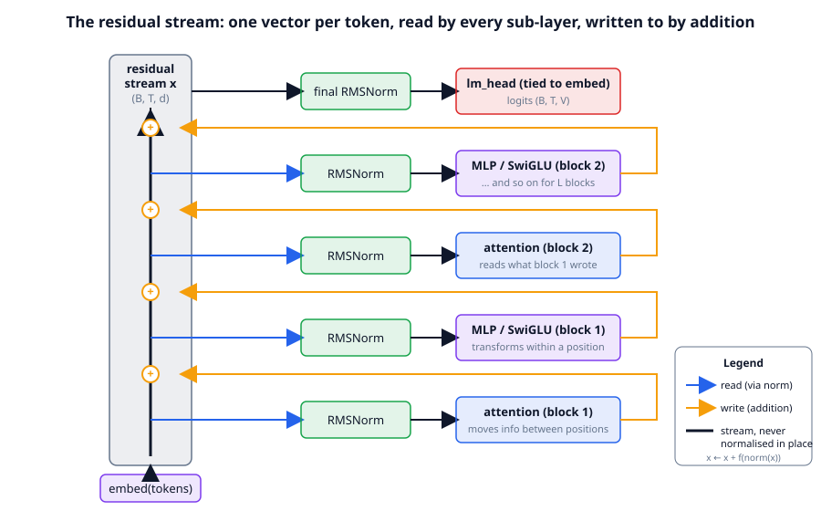
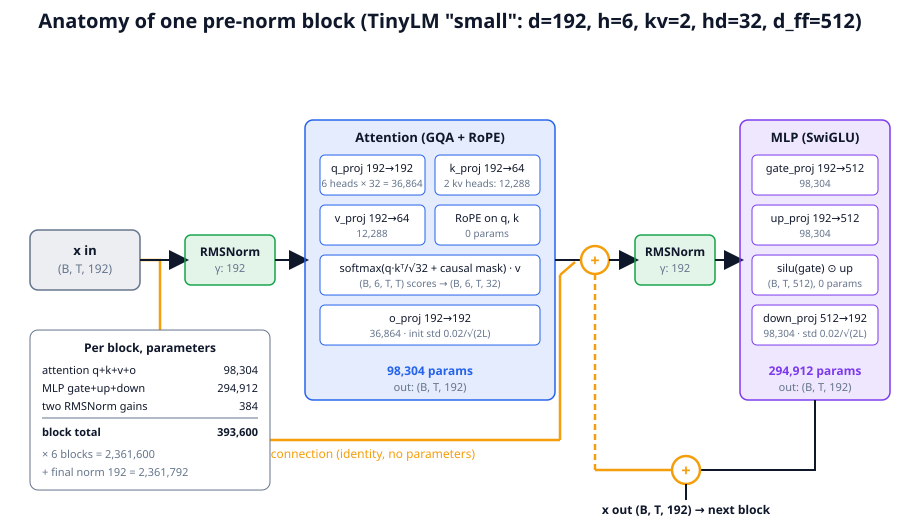
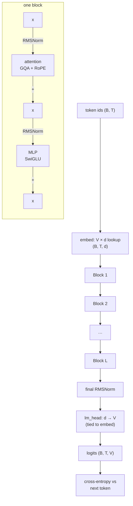

# Chapter 06: The Transformer block and the residual stream

**Part I · ~2.5 hours · Prerequisites: Chapters 3, 4, 5**

> 🎯 Goal: Draw a Transformer block from memory and count its parameters.
> 🧪 Lab: `labs/lab06_build_tinylm.py` · 🎛️ Interactive: `interactive/06_block_dataflow.html`

Imports used by every snippet in this chapter:

```python
import math, torch
from llm.config import preset, TinyLMConfig
from llm.model import TinyLM, Block, RMSNorm, MLP, Attention
from llm.pipeline import get_tokenizer, get_base_model
from llm.generate import generate
```

## Why this matters

In Chapter 5 you built attention: a layer that lets every token look at the tokens before it. On
its own, one attention layer is a weak model. A modern language model stacks dozens of
**Transformer blocks** — a fixed pair of sub-layers (attention, then a small feed-forward network)
wrapped around a shared running vector — and it is the *stacking* that makes the model capable.
Every model on a 2026 leaderboard, whether it has 1 billion or 1.6 trillion parameters, is this
block repeated, with the same three or four design decisions made the same way. If you can draw
one block and say where every parameter lives, you can read any model card: "80 layers, d=8192,
64 heads, 8 KV heads, SwiGLU" becomes a sentence you can turn into a parameter count and a FLOP
count on a napkin. This chapter builds the block, then the whole of TinyLM, counts everything by
hand, checks the count against the code, and ends by generating text from a model that has
learned Storyland.

## The idea in pictures 📐

### The residual stream is shared memory

The single most useful mental model of a Transformer is the one the interpretability community
uses: the **residual stream** is the vector `x` (one per token, width `d`) that flows straight up
through the model, and every sub-layer *reads* from it and *writes* back into it by addition.



In the figure, the grey column on the left is `x` for one token, shape `(B, T, d)`. The blue
arrows are reads: a sub-layer takes the current `x`, normalises it, and computes something from
it. The orange arrows are writes: whatever the sub-layer computed is *added* to `x`. Nothing ever
replaces `x`; the stream that enters the bottom of the model is still present, unchanged, in the
vector at the top, plus everything each sub-layer chose to add. This is why the stream is called
"residual": each sub-layer learns a *residual* (a correction) to what is already there.

An analogy: the residual stream is a whiteboard that every layer can read and append to; the
attention sub-layers copy notes between whiteboards of different tokens, the MLP sub-layers
rewrite notes on the same whiteboard. Its limit: the whiteboard has only `d` dimensions and
layers write on top of each other, so "notes" are directions in a vector space that overlap and
interfere, not tidy separate cells.

Two consequences fall out of the picture. First, the gradient (Chapter 4) has a straight path from
the loss to the embedding along the stream, through additions only, so depth does not starve the
lower layers of signal. Second, any layer can read what *any earlier* layer wrote, not just the one
immediately below it, because writes accumulate.

### One block, with shapes



The block figure zooms into one block of the "small" preset (`d=192`, 6 heads, 2 KV heads,
`head_dim=32`, `d_ff=512`). Follow the arrows left to right. The input `x` is normalised
(green), projected to queries, keys and values (blue), rotated by RoPE, attended, projected back
by `o_proj`, and added to the skip connection (orange `+`). The result is normalised again and
passed through the MLP (purple): two projections up to width 512, a gate, a projection back down,
and a second addition. Every number in the boxes is a parameter count you will reproduce by hand
in the code section; the two `+` circles and the RoPE box own no parameters at all.

### The whole model



Read the flow top to bottom: integers become vectors by a table lookup (Chapter 3), the vectors
pass through `L` identical blocks, a final norm, and a linear map back to vocabulary size to give
one score per possible next token (the **logits**). Chapter 7 turns those logits into text.

🎛️ **Interactive: `interactive/06_block_dataflow.html`.** Open it now. Press *Step* to move one
token's vector through the block one stage at a time and read the tensor shape at each stage; the
shapes follow the config sliders on the right, which start at TinyLM's real `nano` and `small`
presets. Then drag `d_model` and `vocab` and watch the parameter budget bar: the attention and
MLP slices grow with `d²`, the embedding slice only with `V·d`. Confirm that the `small` preset
shows 393,600 parameters per block — the number the table below derives by hand — and try the
page's *Challenge*: find a configuration where the embedding is more than half of all parameters,
then the smallest change that brings it under a quarter. (That is why scaling laws in Chapter 9
count *non-embedding* parameters.)

## The idea in code

### Pre-norm vs post-norm

Where the normalisation sits is the first design decision. The 2017 paper used **post-norm**:
`x = norm(x + f(x))`, normalising the stream *after* each addition. Almost every model since GPT-2
uses **pre-norm**: `x = x + f(norm(x))`, normalising only the *copy* that the sub-layer reads,
leaving the stream itself untouched. Here is the whole of TinyLM's block, straight from
`llm/model.py`:

```python
class Block(nn.Module):
    def forward(self, x, cos, sin, cache=None, record_attention=False):
        # The residual stream x is read by each sub-layer and written back to by addition.
        x = x + self.attn(self.attn_norm(x), cos, sin, cache, record_attention)   # (B, T, d)
        x = x + self.mlp(self.mlp_norm(x))                                        # (B, T, d)
        return x
```

Read this as: "normalise a copy of `x`, let attention compute an update from it, add the update to
`x`; repeat with the MLP." Pre-norm won because it trains stably at depth without delicate
learning-rate warm-up: the identity path from top to bottom is never interrupted by a norm, so
gradients keep their scale (Xiong et al., 2020). The price is that the stream's magnitude grows
with depth (each write adds variance), which the init section below addresses. Some 2024–2025
models add a *second* norm on the sub-layer output before the addition (Gemma 2's "sandwich"
arrangement); the pre-norm read is still there in all of them.

### RMSNorm vs LayerNorm

**LayerNorm** subtracts the mean of a token's vector, divides by its standard deviation, then
applies a learned scale and shift. **RMSNorm** (Zhang & Sennrich, 2019) drops the mean
subtraction and the shift, keeping only the division by the root-mean-square and a learned gain
`γ`:

```
RMSNorm(x) = x / sqrt( mean(x²) + ε ) · γ
```

Read this as: "rescale the vector so its typical entry has size 1, then let each channel choose
its own volume `γ`." One division and one multiply per channel, no mean, no bias. Llama, Qwen,
DeepSeek and TinyLM all use it because it is cheaper and, in every published comparison, no worse:

```python
class RMSNorm(nn.Module):
    def __init__(self, dim, eps=1e-5):
        super().__init__()
        self.eps = eps
        self.weight = nn.Parameter(torch.ones(dim))          # γ, shape (d,)

    def forward(self, x):                                    # x: (B, T, d)
        rms = x.float().pow(2).mean(-1, keepdim=True).add(self.eps).rsqrt()
        return (x.float() * rms).type_as(x) * self.weight
```

Note the `.float()`: the square-and-mean is done in 32-bit even when the model runs in **bf16**
(bfloat16, the 16-bit number format most models are trained and stored in; Chapter 10), because
squaring small numbers in 16-bit loses precision. Check that it does what the formula
says:

```python
x = torch.randn(2, 5, 192) * 7
y = RMSNorm(192)(x)
print(y.pow(2).mean(-1).sqrt())          # ≈ 1.0 everywhere: each token now has unit RMS
```

### The MLP and SwiGLU: why 8/3·d

The second sub-layer is a two-layer network applied to *each position independently*, the same
weights for every token. The 2017 version was `down(relu(up(x)))` with hidden width `4d`. The
modern version, **SwiGLU** (Shazeer, 2020), adds a *gate*: a second projection whose output,
passed through the smooth `silu` function (`silu(z) = z·sigmoid(z)`), multiplies the first one
element-wise:

```
MLP(x) = down( silu(gate · x) ⊙ (up · x) )
```

Read this as: "compute two hidden vectors from `x`; use one as a soft on/off switch for the other;
project the result back to width `d`." The gate lets the layer *choose* which hidden units fire
for this token, which a plain ReLU cannot do as flexibly.

```python
class MLP(nn.Module):
    def __init__(self, d_model, d_ff):
        super().__init__()
        self.gate_proj = nn.Linear(d_model, d_ff, bias=False)   # (d_ff, d)
        self.up_proj   = nn.Linear(d_model, d_ff, bias=False)   # (d_ff, d)
        self.down_proj = nn.Linear(d_ff, d_model, bias=False)   # (d, d_ff)

    def forward(self, x):                                       # (B, T, d)
        return self.down_proj(F.silu(self.gate_proj(x)) * self.up_proj(x))
```

SwiGLU has *three* matrices where the ReLU MLP has two. To keep the parameter count the same as
the classic `4d` MLP, the hidden width shrinks: `3·d·d_ff = 2·d·4d` gives `d_ff = 8d/3`. That is
where the odd-looking 8/3 comes from — it is a budget-matching choice, not an arbitrary constant. In
practice `d_ff` is then rounded to a multiple of 64 or 256 so matrix shapes suit the hardware;
`TinyLMConfig.__post_init__` does exactly this: `d=192 → 8·192/3 = 512`, already a multiple of 64.
Notice also that no projection in the block has a bias term; modern models drop them because they
add parameters that do not measurably help.

### Counting parameters by hand

Here is the count for `preset("small")` with its default vocabulary `V = 4096`. Every entry is
"rows × columns" of one weight matrix from the block figure.

| Component | Shape | Count |
|---|---|---:|
| `embed` | V × d = 4096 × 192 | 786,432 |
| per block: `q_proj` | d × (h·hd) = 192 × 192 | 36,864 |
| per block: `k_proj` | d × (kv·hd) = 192 × 64 | 12,288 |
| per block: `v_proj` | d × (kv·hd) = 192 × 64 | 12,288 |
| per block: `o_proj` | (h·hd) × d = 192 × 192 | 36,864 |
| per block: attention total | | **98,304** |
| per block: `gate_proj` | d × d_ff = 192 × 512 | 98,304 |
| per block: `up_proj` | d × d_ff = 192 × 512 | 98,304 |
| per block: `down_proj` | d_ff × d = 512 × 192 | 98,304 |
| per block: MLP total | | **294,912** |
| per block: two RMSNorm gains | 2 × d | 384 |
| **per block total** | | **393,600** |
| × L = 6 blocks | | 2,361,600 |
| `final_norm` | d | 192 |
| `lm_head` | V × d, **tied** to `embed` | **0 extra** |
| **non-embedding total** | | **2,361,792** |
| **total including embedding** | | **3,148,224** |

Three things to notice. GQA (Chapter 5) makes `k_proj` and `v_proj` a third the size of `q_proj`
because there are 2 KV heads for 6 query heads. The MLP holds three quarters of every block's
parameters (294,912 of 393,600) — this ratio is typical and is why "where do the facts live?"
points at the MLP. And with **tied embeddings** — the same `V × d` matrix used both to look up
input vectors and, transposed, to score output tokens — the output head costs nothing extra. For a
model this small the embedding is a quarter of all parameters, so tying matters; at frontier scale
`V·d` is a rounding error next to `N`, and many large models untie because the two jobs are
slightly different. The library agrees with the table to the parameter:

```python
cfg = preset("small")
model = TinyLM(cfg)
print(model.num_params())                     # 2361792  (non-embedding, the number papers quote)
print(model.num_params(non_embedding=False))  # 3148224
print(TinyLM(preset("small", tie_embeddings=False)).num_params(non_embedding=False))  # 3934656 = +V·d
```

One caveat: the *trained* course checkpoint uses the course tokenizer, whose BPE run stopped at
`V = 871`, so its embedding is `871 × 192 = 167,232` and its total is 2,529,024. The non-embedding
count does not change with `V`; that is the reason it is the number people quote.

### Depth versus width

`d` (width) and `L` (depth) are the two dials. Per block, parameters scale as roughly `12·d²`
(attention `4d²` for MHA, MLP `8d²`), so doubling width quadruples the block; doubling depth
merely doubles the model. Width is capacity *per step*; depth is the number of sequential
read-then-write steps a token's vector goes through. Published models keep the ratio `d/L`
roughly between 64 and 128 (GPT-3: 12288/96 = 128; Llama-3-70B: 8192/80 ≈ 102). The "small"
preset is `192/6 = 32`, deliberately narrow so it trains fast on a CPU. Chapter 9 turns this into
a scaling law you fit yourself.

### FLOPs per token

A **FLOP** is one floating-point multiply or add. A matrix–vector product of a `(m × n)` weight
with one token's vector costs `2·m·n` FLOPs (one multiply and one add per weight). So a forward
pass costs about `2N` FLOPs per token over all `N` weights, the backward pass costs about twice
that, and training costs the celebrated:

```
C ≈ 6 · N · D          (FLOPs for N parameters trained on D tokens)
```

Read this as: "every parameter is touched six times per training token — twice going forward,
four times going backward." Attention adds a term that does not live in a weight: the `q·kᵀ` and
`attn·v` products cost `2·T·d` FLOPs each per layer per token in the forward pass, so
`12·L·d·T` for forward + backward. `TinyLM.flops_per_token()` returns `6N + 12·L·d·T_max`:

```python
N = model.num_params(non_embedding=False)                 # 3148224
attn = 12 * cfg.n_layers * cfg.d_model * cfg.max_seq_len   # 12·6·192·256 = 3538944
print(6 * N + attn, model.flops_per_token())               # 22428288  22428288.0
```

At `T=256` the attention term is 16% of the total; at `T=128k` on a frontier model it dominates,
which is why Chapter 12's sparse and compressed attention exists.

### Initialisation and the 1/√(2L) rule

Before training, every weight is a random draw. TinyLM uses the GPT-2 recipe: every linear and
embedding weight is Gaussian with standard deviation `init_std = 0.02`. There is one refinement,
and the residual-stream picture explains it. Each block makes *two* writes into the stream
(attention and MLP), so after `L` blocks the stream is a sum of `2L` random vectors. Sums of
independent random vectors grow like `√(2L)` in size. To keep the stream's scale flat with depth,
the two matrices that *write* — `o_proj` and `down_proj` — are initialised with standard
deviation `0.02/√(2L)`:

```python
# from TinyLM.__init__ in llm/model.py
for name, p in self.named_parameters():
    if name.endswith("o_proj.weight") or name.endswith("down_proj.weight"):
        nn.init.normal_(p, mean=0.0, std=cfg.init_std / math.sqrt(2 * cfg.n_layers))
```

The lab hooks every block's output at init and measures the stream's root-mean-square with and
without this scaling; the numbers are in the worked example. The scaling is not the only known
fix — modded-nanogpt zero-initialises the output projections, and muP (Chapter 9) rescales by
width — but it is the simplest one that works.

### Assembling TinyLM

With the pieces defined, the model itself is short. Here is `TinyLM.forward` reduced to its
shapes (the real one also handles the KV cache, MTP heads and loss masks):

```python
def forward(self, idx, targets=None):              # idx: (B, T) token ids
    T = idx.shape[1]
    cos, sin = self.rope_cos[:T], self.rope_sin[:T] # RoPE tables for positions 0..T-1
    x = self.embed(idx)                             # (B, T, d)
    for block in self.blocks:
        x = block(x, cos, sin)                      # (B, T, d), L times
    x = self.final_norm(x)                          # (B, T, d)
    logits = self.lm_head(x)                        # (B, T, V)
    loss = None if targets is None else F.cross_entropy(
        logits.reshape(-1, logits.shape[-1]).float(), targets.reshape(-1))
    return logits, loss
```

Read this as: "look up, refine `L` times, normalise, score every vocabulary entry; if we know the
right answers, measure surprise." Run it on real tokens and check the shapes and the loss:

```python
tok = get_tokenizer()                                     # the course tokenizer, V = 871
cfg = preset("small", vocab_size=tok.vocab_size)
model = TinyLM(cfg)
ids = torch.tensor([tok.encode("At the park, Mia met")])  # (1, 6)
logits, _ = model(ids)
print(logits.shape)                                       # torch.Size([1, 6, 871])
x, y = ids[:, :-1], ids[:, 1:]                            # inputs and next-token targets
print(model(x, y)[1].item(), math.log(tok.vocab_size))    # ≈ 6.65 (seed-dependent)  vs  ln(871) = 6.77
```

The loss of an untrained model sits within a few hundredths of `ln V` (the lab measures 6.79 on
512 tokens against `ln 871 = 6.77`). That is not a coincidence: with
weights of size 0.02 the logits are all near zero, the softmax is uniform, and the surprise at a
uniform guess over `V` options is `ln V`. Every pretraining run in this course starts from this
number; if yours starts much higher, the init is wrong.

### Generating: untrained versus trained

`generate` (Chapter 7 explains it) samples one token at a time. From a fresh model you get
uniform noise over the vocabulary; from the pretrained base (`runs/base_small.pt`, produced by
`get_base_model()`) you get Storyland:

```python
print(generate(model, tok, "At the park, Mia met", max_new_tokens=20, seed=0))   # gibberish
base, tok = get_base_model()          # loads runs/base_small.pt (trains it first if missing, ~5 min)
print(generate(base, tok, "At the park, Mia met", max_new_tokens=20, temperature=0.8, seed=0))
```

The exact strings are in the worked example below.

### What each part does — the current understanding

Nothing in the block's definition says "attention does X, the MLP does Y"; the roles are learned.
But a decade of probing trained models has produced a fairly stable picture, and it is worth
holding in your head while you read the rest of the course. Treat the rest of this section as
*current understanding*, not proven fact; the evidence comes from case studies on specific models
and the general story is still being tested.

- **Attention moves information between positions; it is the only part that does.** The MLP,
  the norms and the additions all act on each token's vector in isolation. The lab proves the
  contrapositive: zero out every attention sub-layer of the trained model and the prediction at a
  position depends only on the token at that position — the model collapses to a bigram model
  (Chapter 1). Specific attention heads have been found that copy the previous token, that find
  earlier occurrences of the current token and attend to what followed them (**induction heads**,
  Olsson et al., 2022 — the mechanism behind in-context copying), and that track syntax.
- **The MLP transforms within a position and stores associations.** Geva et al. (2021) showed
  that MLP layers behave like key–value memories: the `up`/`gate` rows are patterns that detect
  "the stream currently says *Paris*", and the `down` columns write "…so add *France*, *Eiffel*,
  *capital*." Most factual recall that has been localised lives in mid-depth MLPs. With three
  quarters of the parameters, the MLP is also where most of a model's raw capacity is.
- **Layers specialise by depth.** Early blocks tend to build token- and syntax-level features,
  middle blocks do most of the "computation", and late blocks turn the result into a prediction
  over the vocabulary. The lab's ablation table shows how unevenly the loss depends on each block.
- **The stream is crowded.** Because `d` is smaller than the number of things worth representing,
  features are stored as overlapping directions (**superposition**), which is why clean "one
  neuron, one concept" stories are the exception. This is the open part of the field.

### 🆕 What has changed by 2026 (and what has not)

The block you just built is, to a first approximation, still the block inside every 2026 model.
The changes are around its edges:

- **Hyper-connections and mHC.** Plain residual addition gives every layer one shared stream.
  Hyper-connections (ByteDance, 2024) widen this to several parallel streams with learned mixing
  between them; DeepSeek-V4's technical report (arXiv 2606.19348, June 2026) uses a
  manifold-constrained version, **mHC**, in place of plain residuals. The read/write picture is
  unchanged; there are just more whiteboards.
- **Multi-token prediction (MTP).** Extra output heads predict tokens `t+2, t+3, …` from the same
  stream during training (DeepSeek-V3, 2024; kept in V4). `TinyLMConfig(mtp_heads=k)` turns this
  on; Chapter 12 explains why it helps and how it doubles as a speculative-decoding draft
  (Chapter 7).
- **Mixture of Experts.** The MLP is replaced by many MLPs and a router that sends each token to
  a few of them, so parameters grow without FLOPs growing. `TinyLMConfig(use_moe=True)` swaps in
  `llm/model.py::MoE`; Chapter 12 builds it.
- **Attention variants** (sparse, compressed, hybrid with linear layers) change what the
  attention sub-layer reads, not where it writes. Also Chapter 12.

## Worked example 🧪

Run the lab twice:

```bash
python3 labs/lab06_build_tinylm.py            # --quick: nano base model, ~1 minute
python3 labs/lab06_build_tinylm.py --full     # small base model (trains runs/base_small.pt if absent)
```

### What to look at (quick run, nano base model)

The quick run took about 2 minutes on a 4-core CPU that was shared with other jobs; alone it is
closer to one minute. Section 2 is the parameter table, printed by the lab from the same formulas
as the table above and checked against the library:

```
--- 2. Parameter count by hand vs model.num_params() ---
component                           count
embed (V x d)                     786,432
  attn q_proj (d x h*hd)           36,864
  attn k_proj (d x kv*hd)          12,288
  attn v_proj (d x kv*hd)          12,288
  attn o_proj (h*hd x d)           36,864
  mlp gate_proj (d x ff)           98,304
  mlp up_proj   (d x ff)           98,304
  mlp down_proj (ff x d)           98,304
  2 RMSNorm gains (2d)                384
per block                         393,600
x L blocks + final norm         2,361,792
lm_head (tied -> 0 extra)               0
TOTAL incl. embedding           3,148,224
library: non-embedding 2,361,792  total 3,148,224
✅ hand-counted non-embedding params == model.num_params()
✅ hand-counted total == model.num_params(non_embedding=False)
untied lm_head would add V*d = 786,432: total 3,934,656 vs tied 3,148,224
✅ untying the head costs exactly V*d parameters
✅ tied: lm_head and embed share one tensor

--- 3. FLOPs per token: 6N + attention term ---
6*N = 6*3,148,224 = 18,889,344
attention term 12*L*d*T_max = 12*6*192*256 = 3,538,944 (15.8% of total)
hand 22,428,288  vs  model.flops_per_token() 22,428,288
✅ 6N + 12*L*d*T == model.flops_per_token()
the full course pretraining run sees D = 700 steps x 32 x 128 = 2,867,200 tokens -> C ~= 6.43e+13 FLOPs
```

The last line is the `6·N·D` rule applied to the course's own pretraining run: `6.4e13` FLOPs.
Chapter 10 measures the wall-clock and you can compute the CPU's achieved FLOP/s from the two.

Section 4 is the init experiment. Each row is the root-mean-square of the residual stream after
each block, at initialisation, for a 6- and a 12-layer "small" model:

```
--- 4. Init: residual-stream RMS across depth, with and without the 1/sqrt(2L) scaling ---
L=6 scaled 0.02/sqrt(2L)     RMS after block 1..6: 0.021 0.023 0.026 0.029 0.033 0.038
L=6 unscaled 0.02            RMS after block 1..6: 0.035 0.064 0.094 0.118 0.136 0.155
L=12 scaled 0.02/sqrt(2L)    RMS after block 1..12: 0.021 0.022 0.023 0.024 0.026 0.027 0.029 0.031 0.034 0.036 0.038 0.040
L=12 unscaled 0.02           RMS after block 1..12: 0.034 0.061 0.089 0.111 0.136 0.153 0.170 0.185 0.199 0.216 0.231 0.245
L=12 growth factor (last/first): scaled 1.90x   unscaled 7.13x
✅ without residual scaling the stream grows > 2x larger by the last block
✅ at init the residual stream has RMS ~ init_std = 0.02
```

The stream enters at RMS 0.02 (the embedding's `init_std`). With the scaled writes it drifts to
0.04 over twelve blocks; without them it reaches 0.245, a 7× growth, and the last block sees
inputs on a completely different scale from the first. `figures/generated/lab06_init_rms.png`
plots the four curves.

Section 5 confirms the shapes and the `ln V` starting loss, and section 6 is what an untrained
model says. Section 7 loads the pretrained base (nano in quick mode):

```
--- 5. Forward pass shapes and the loss at init ---
course tokenizer vocab = 871 -> nano model has 295,584 non-embedding / 379,200 total params
idx (8, 64) -> logits (8, 64, 871)  (B, T, V)
loss at init 6.7891  vs  ln(V) = ln(871) = 6.7696
✅ untrained loss ~= ln(V): a uniform guess over the vocabulary

--- 6. Generate from the UNTRAINED model ---
' ver animyor frogZ One At�85�157�159 ex�Max118Ruby\x19 co� marke bir41��103 books7'

--- 7. Load the pretrained base model and generate ---
loaded nano base: 295,584 non-embedding params
val loss 1.129 (perplexity 3.1)  vs untrained 6.789
✅ trained model's loss is > 2 nats below the untrained one
T=0.0: 'At the park, Mia met' -> ' Mia. Mia was proud because Mia lost a pear.'
T=0.8: 'At the park, Mia met' -> ' Ella. Ruby was calm because Nora lost a cup. Max liked the orange drum more than the pink shell. Then Ava and Ruby played with the white'
```

The untrained model's output includes raw byte tokens (the `�` characters) because a uniform
draw over the vocabulary hits them often. The loss is measured in **nats** (the unit of cross-entropy when the logarithm is natural; `ln 871 =
6.77` nats is the uniform-guess ceiling). The trained nano model — 150 optimizer steps, under a
minute of training — already speaks Storyland grammar, if not Storyland logic ("Mia met Mia").

Section 8 is the ablation. Each sub-layer's write is zeroed in turn (a forward hook that returns
zeros) and the validation loss is re-measured:

```
--- 8. What each part does: ablate attention / MLP sub-layers of the trained model ---
layer   no attn    no mlp   (loss; baseline 1.129)
    0     1.903     4.967
    1     1.323     1.628
    2     1.151     1.451
✅ zeroing any sub-layer's write raises the loss
with ALL attention zeroed, last-token logits of two different sentences ending in 'kite' differ by max 0.00e+00
✅ no attention -> each position only sees its own token (a bigram model)
```

Two things to look at. Block 0's MLP is by far the most important sub-layer in this tiny model
(loss 1.13 → 4.97 without it: nearly back to "uniform"), consistent with the picture that early
MLPs turn raw token embeddings into usable features; later blocks matter less and less. And the
last check is the cleanest demonstration in the chapter: with every attention write removed, two
different sentences that end in the same token produce *bit-for-bit identical* logits, because no
information can cross between positions any more.

<<LAB06_FULL>>


## Try it yourself ✍️

1. **Count a real model.** Llama-3-8B has `d=4096`, `L=32`, 32 heads, 8 KV heads,
   `head_dim=128`, `d_ff=14336`, `V=128256`, untied embeddings. Count its parameters with the
   table's method and compare with the 8.03 B people quote. Which component is largest?
2. **Break the 8/3 rule.** Build `preset("small", d_ff=768)` (a `4d` SwiGLU) and
   `preset("small", d_ff=384)`; print `num_params()` for each and compute how many more/fewer
   MLP parameters they have. Then train each for 150 steps with `llm.train.train` and compare
   losses. Does the extra width pay for itself at this scale?
3. **Post-norm by hand.** Write a `PostNormBlock` whose forward is
   `x = norm(x + attn(x)); x = norm(x + mlp(x))`. Instantiate a 12-layer model with it and repeat
   the lab's init-RMS measurement. Why does the stream's RMS stay flat *without* the `1/√(2L)`
   trick, and what does that do to the identity path?
4. **Find a head.** Use `base.attention_maps(ids)` (Chapter 5) on a sentence where a name
   repeats, such as `"Mia lost the kite. Mia found the"`. Is there a head in any layer whose
   second `Mia` attends strongly to the first one? That is the fingerprint of an induction head.
5. **Ablate a block, not a sub-layer.** Extend the lab's ablation to zero *both* sub-layers of a
   block (so the block is the identity). Plot the loss increase per block. Which block does the
   trained model rely on most?

## Check yourself ✅

<details><summary>1. In pre-norm, what exactly gets normalised, and what does not?</summary>

Only the *copy* of the residual stream that a sub-layer reads is normalised
(`self.attn(self.attn_norm(x))`). The stream `x` itself is never normalised inside a block; it is
only ever added to. The one exception is `final_norm`, applied once before the output head.
</details>

<details><summary>2. Why is d_ff = 8/3·d rather than 4·d for SwiGLU?</summary>

SwiGLU has three weight matrices (`gate`, `up`, `down`) instead of two. Setting `3·d·d_ff = 2·d·4d`
gives `d_ff = 8d/3`, so a SwiGLU MLP has the same number of parameters as the classic `4d` ReLU
MLP it replaced. The result is rounded to a multiple of 64 for hardware efficiency.
</details>

<details><summary>3. With tied embeddings, why does the output head add zero parameters, and why do large models often untie anyway?</summary>

`lm_head.weight` *is* `embed.weight` (the same tensor object, shape `V × d`), used as a lookup on
the way in and as a matrix multiply on the way out, so there is nothing extra to store. For a
small model `V·d` is a large fraction of the total, so tying is a real saving. For a 70 B model
`V·d ≈ 1 B` is negligible, and the two jobs (representing an input token vs. scoring an output
token) benefit from separate weights, so many large models untie.
</details>

<details><summary>4. Where does 6·N·D come from?</summary>

A forward pass multiplies each of the `N` weights once, costing about `2N` FLOPs per token
(multiply + add). The backward pass needs two matrix products per weight (gradient with respect
to the input and with respect to the weight), about `4N`. Total `6N` per token, times `D` tokens.
Attention's `q·kᵀ` and `attn·v` products add `12·L·d·T`, which is small at short context and
dominant at very long context.
</details>

<details><summary>5. Why scale o_proj and down_proj by 1/√(2L) at init, and what would you see without it?</summary>

Each block writes twice into the residual stream, so after `L` blocks the stream is the sum of
`2L` roughly independent random vectors, whose size grows like `√(2L)`. Dividing the writing
matrices' scale by `√(2L)` cancels that growth. Without it the lab shows the stream's RMS growing
roughly 7× over 12 blocks at init instead of staying nearly flat, so the last blocks see inputs on
a different scale from the first ones and training is less stable.
</details>

## Key takeaways

- A Transformer is an embedding, `L` identical blocks, a final norm and an output head; each block
  is `x += attn(norm(x)); x += mlp(norm(x))`.
- The residual stream is shared memory: sub-layers read it through a norm and write to it by
  addition; the stream itself is never overwritten.
- RMSNorm (no mean, no bias) and SwiGLU with `d_ff = 8/3·d` are the 2026 defaults; the MLP holds
  about three quarters of each block's parameters.
- You can count any model's parameters from its config: per block `4d²` (MHA) or less (GQA) for
  attention, `3·d·d_ff` for the MLP; the tied head is free. `num_params()` agrees to the parameter.
- Training costs `6·N·D` FLOPs plus an attention term; an untrained model's loss is `ln V`.
- Attention moves information between positions (nothing else does); MLPs transform and store
  within a position — as current understanding, not settled theory.

## Going deeper

- Vaswani et al., *Attention Is All You Need* (2017) — the original (post-norm) block.
- Xiong et al., *On Layer Normalization in the Transformer Architecture* (2020) — why pre-norm
  trains without warm-up.
- Zhang & Sennrich, *Root Mean Square Layer Normalization* (2019).
- Shazeer, *GLU Variants Improve Transformer* (2020) — SwiGLU and the 8/3 budget.
- Elhage et al., *A Mathematical Framework for Transformer Circuits* (2021) — the residual-stream
  view; Olsson et al., *In-context Learning and Induction Heads* (2022); Geva et al.,
  *Transformer Feed-Forward Layers Are Key-Value Memories* (2021).
- Karpathy, *nanoGPT* and Jordan et al., *modded-nanogpt* — the init tricks in code:
  https://github.com/KellerJordan/modded-nanogpt
- 🆕 DeepSeek-AI, *DeepSeek-V4: Towards Highly Efficient Million-Token Context Intelligence*
  (2026), https://arxiv.org/abs/2606.19348 — mHC hyper-connections, MTP, MoE in one 2026 model.
- 🆕 Karpathy, *nanochat* (2025), https://github.com/karpathy/nanochat — the same block, trained
  end to end for $100.

---

← [Chapter 05](05-attention.md) · [Course home](../README.md) · [Chapter 07](07-inference.md) →
