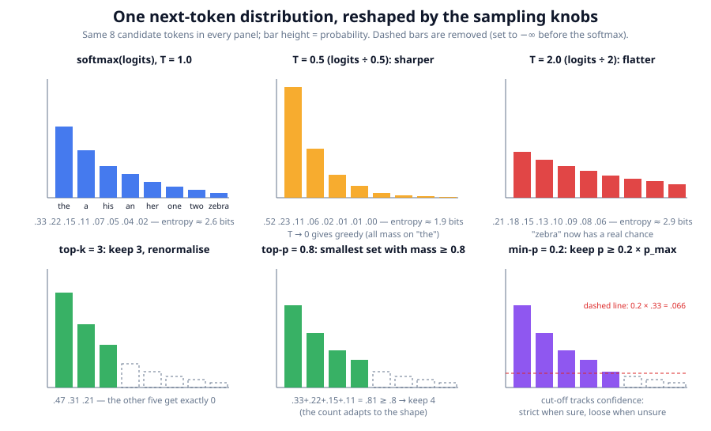
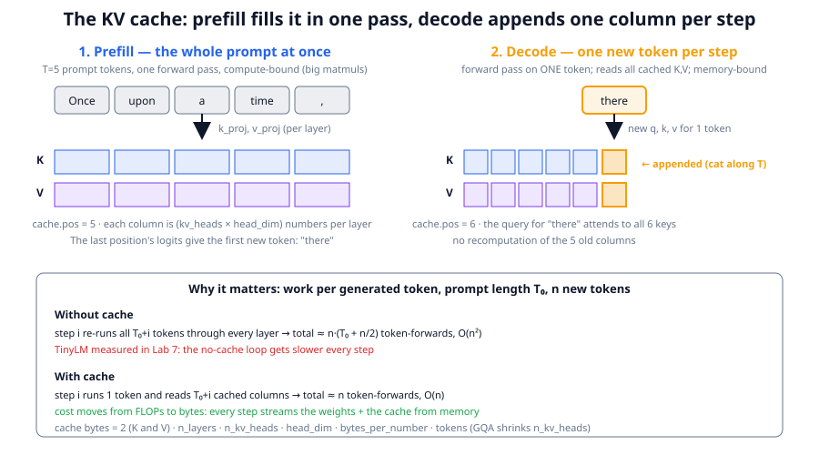
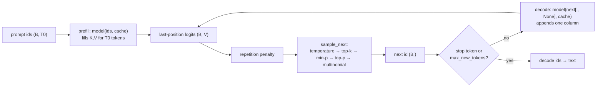

# Chapter 7: Inference — turning probabilities into text

**Part I · ~2.5 hours · Prerequisites: Chapters 1, 5, 6**
> 🎯 Goal: Explain every sampling knob and why generation is memory-bound.
> 🧪 Lab: `labs/lab07_generate.py` · 🎛️ Interactive: `interactive/07_sampling_playground.html`

Imports used by every snippet in this chapter:

```python
import math, torch
import torch.nn.functional as F
from llm.pipeline import get_base_model
from llm.generate import sample_next, apply_repetition_penalty, generate, generate_ids, benchmark_decode
from llm.chat import render, END
base, tok = get_base_model(quick=True)          # runs/base_nano.pt; drop quick=True for the small model
```

## Why this matters

Everything up to now produced a vector of `V` numbers per position — the logits. A user does not
want logits; they want the next word, and then the one after that, a thousand times, fast, and
cheap. Turning logits into text involves a handful of choices that change what a model *sounds*
like far more than most people expect: the same weights can produce a dull, repetitive paragraph
or a wild one depending on two numbers called temperature and top-p. And the loop that produces
the tokens has a performance profile unlike training: a modern GPU spends most of a generation
step waiting for memory, not computing, which is why a 70 B model at batch size one is limited to
a few dozen tokens per second no matter how many TFLOPs the chip advertises. This chapter gives
you every sampling knob with a demo on the trained Storyland model, then the KV cache, the
arithmetic of why decode is memory-bound, and the tricks (batching, speculative decoding,
quantization) that the serving industry uses to get around it. By the end, an API price sheet
should read as a physics problem.

## The idea in pictures 📐

### Reshaping one distribution



Every panel in the figure shows the *same* eight candidate next tokens after the prompt `"the
fox saw"`. The top-left panel is the model's raw belief: `softmax(logits)`. Temperature (top row)
sharpens or flattens the whole shape without removing anything: at `T=0.5` the leading token
"the" goes from 33% to 52%, at `T=2.0` the rare "zebra" climbs from 2% to 6%. The bottom row
*truncates*: top-k keeps a fixed number of bars, top-p keeps as many as needed to cover 80% of
the mass (four here, but it would be one if the model were confident), and min-p keeps bars taller
than a fraction of the tallest one, so the cut-off moves with the model's confidence. The dashed
bars are set to probability zero; the survivors are renormalised so they still sum to one.

### Prefill, decode and the cache



Generation has two phases. In **prefill** (left panel) the whole prompt goes through the model in
one forward pass — the same shape of work as a training step, large matrix products, and the
keys and values of every prompt token are kept. In **decode** (right panel) the model runs on
*one* new token; its query attends to every cached key, its own key and value are appended as one
new column, and the loop repeats. The cache is what makes decode cheap in FLOPs: without it, step
`i` would have to re-run all `T₀ + i` tokens through every layer just to recompute keys and
values that have not changed. The strip at the bottom of the figure gives the accounting: the
cache turns an `O(n²)` loop into an `O(n)` one, and moves the cost from arithmetic to *bytes*,
which is the theme of the second half of the chapter.

### The decode loop



Read it as a loop: one forward pass per generated token, only the last position's logits
matter, and the sampler chooses one id from them. Every box is a function in `llm/generate.py`.

🎛️ **Interactive: `interactive/07_sampling_playground.html`.** It shows a real next-token
distribution as a bar chart and lets you drag temperature, top-k, top-p and min-p sliders and
watch the bars reshape and the entropy read-out change. Try this sequence. Slide temperature from
1.0 down to 0.1 and watch the tallest bar swallow the others; slide it to 3.0 and watch the tail
rise. Reset to 1.0, then set top-p to 0.5 and count the surviving bars; now pick a *confident*
distribution from the preset menu and note that the same top-p keeps far fewer. Finally compare
top-k = 5 with min-p = 0.1 on both presets — the *Challenge* asks you to find a setting where
they keep exactly the same set of tokens, and one where they differ.

## The idea in code

### Logits → probabilities

The final layer produces `V` unnormalised scores. **Softmax** turns them into a probability
distribution:

```
p_i = exp(z_i / T) / Σ_j exp(z_j / T)
```

Read this as: "exponentiate every score (so they are positive), divide by the total (so they sum
to one); `T` is the temperature, and at `T=1` this is the model's honest belief." Look at the real
thing for the trained model:

```python
ids = torch.tensor([tok.encode("At the park, Mia met")])     # (1, 6)
with torch.no_grad():
    logits, _ = base(ids)                                    # (1, 6, V)
p = F.softmax(logits[0, -1], dim=-1)                         # (V,): belief about token 7
top = p.topk(5)
print([(tok.token_str(int(i)), round(float(q), 3)) for q, i in zip(top.values, top.indices)])
```

A useful single number for a distribution is its **entropy**, `H = −Σ p_i log₂ p_i`, measured in
bits. Read this as: "the average surprise, in yes/no questions, of the outcome." A distribution
with all its mass on one token has entropy 0; a uniform one over `V = 871` tokens has
`log₂ 871 = 9.8` bits. The lab reports the entropy after the prompt above and sweeps it against
temperature.

### The knobs, one at a time

All of them live in one function, applied in this order:

```python
@torch.no_grad()
def sample_next(logits, temperature=1.0, top_k=None, top_p=None, min_p=None, generator=None):
    if temperature <= 0:
        return logits.argmax(dim=-1)                                  # greedy
    logits = logits.float() / temperature
    if top_k is not None and top_k > 0:                               # keep the k best
        kth = logits.topk(min(top_k, logits.shape[-1]), dim=-1).values[:, -1, None]
        logits = logits.masked_fill(logits < kth, float("-inf"))
    if min_p is not None and min_p > 0:                               # keep p >= min_p * p_max
        probs = F.softmax(logits, dim=-1)
        limit = min_p * probs.max(dim=-1, keepdim=True).values
        logits = logits.masked_fill(probs < limit, float("-inf"))
    if top_p is not None and 0 < top_p < 1:                           # keep the nucleus
        sorted_logits, order = logits.sort(dim=-1, descending=True)
        cum = F.softmax(sorted_logits, dim=-1).cumsum(dim=-1)
        remove = cum - F.softmax(sorted_logits, dim=-1) >= top_p      # always keep the first
        sorted_logits = sorted_logits.masked_fill(remove, float("-inf"))
        logits = torch.full_like(logits, float("-inf")).scatter(-1, order, sorted_logits)
    probs = F.softmax(logits, dim=-1)
    return torch.multinomial(probs, num_samples=1, generator=generator).squeeze(-1)
```

- **Greedy decoding** (`temperature=0`) takes the argmax every step. Deterministic, and prone to
  loops ("the dog and the dog and the dog") because the most likely continuation of a repetition
  is often more of it.
- **Temperature** `T` divides the logits before the softmax. `T<1` sharpens (the model becomes
  more confident than it is), `T>1` flattens (rare tokens get a chance), `T→0` recovers greedy.
  It is the one knob that changes the *shape* rather than truncating.
- **Top-k** keeps the `k` highest-probability tokens and drops the rest. Its weakness: `k` is
  fixed, but sometimes one token deserves 99% and sometimes fifty tokens are all plausible.
- **Top-p** (nucleus sampling, Holtzman et al., 2019) keeps the smallest set whose cumulative
  probability reaches `p`. The set size adapts to the model's confidence.
- **Min-p** (Nguyen et al., 2024) keeps tokens whose probability is at least `min_p` times the
  top token's. When the model is sure, almost everything is cut; when it is unsure, most survive.
  Popular in 2025–2026 open-model defaults because it tolerates high temperature well.
- Setting a dropped token's logit to `−inf` makes its softmax probability exactly 0, and the
  survivors renormalise for free.

**Repetition penalty** (Keskar et al., 2019) is applied *before* `sample_next`, to the logits of
tokens already in the sequence: positive logits are divided by the penalty, negative ones
multiplied, so every seen token becomes less likely:

```python
def apply_repetition_penalty(logits, idx, penalty):
    if penalty == 1.0:
        return logits
    logits = logits.clone()
    for b in range(idx.shape[0]):
        seen = idx[b].unique()
        vals = logits[b, seen]
        logits[b, seen] = torch.where(vals > 0, vals / penalty, vals * penalty)
    return logits
```

It is a blunt tool — it penalises "the" as much as a rare word — but it is cheap and it does stop
loops. All the knobs are exposed by `generate`:

```python
for kw in [dict(temperature=0.0), dict(temperature=1.0), dict(temperature=1.0, top_p=0.9)]:
    print(kw, repr(generate(base, tok, "At the park, Mia met", max_new_tokens=20, seed=0, **kw)))
```

The lab runs eight settings on the same prompt and seed; the table is in the worked example.

### The KV cache

Attention at position `t` needs the keys and values of positions `0..t`. Those depend only on the
tokens at those positions (and the layers below), so once computed they never change. The **KV
cache** stores them per layer and appends one column per decode step. In `llm/model.py` it is a
list of `LayerCache` objects with a two-line `append`:

```python
@dataclass
class LayerCache:
    k: Optional[Tensor] = None          # (B, kv_heads, T_cached, hd)
    v: Optional[Tensor] = None
    def append(self, k, v):
        if self.k is None: self.k, self.v = k, v
        else:
            self.k = torch.cat([self.k, k], dim=2)     # one more column along T
            self.v = torch.cat([self.v, v], dim=2)
        return self.k, self.v
```

The model's `forward` accepts a cache; when given one it processes only the *new* tokens and
looks up the RoPE angles starting at `cache.pos`, so positions stay correct. The decode loop in
`generate_ids` is then:

```python
cache = model.new_cache()
logits, _ = model(idx, cache=cache)              # prefill: (B, T0) in, cache.pos == T0
for _ in range(max_new_tokens):
    nxt = sample_next(logits[:, -1, :], temperature=0.8)
    idx = torch.cat([idx, nxt[:, None]], dim=1)
    logits, _ = model(nxt[:, None], cache=cache)  # decode: (B, 1) in, cache grows by one
```

Correctness is easy to check and the lab does: the logits from one full-sequence forward pass
and from prefill-then-one-token-at-a-time agree to `1e-5`, and greedy generation produces
identical ids with `use_cache=True` and `False`. Speed is measured by `benchmark_decode`, which
times both loops.

### How big is the cache?

Each layer stores `K` and `V` for every token, each of shape `n_kv_heads × head_dim`:

```
cache bytes = 2 · n_layers · n_kv_heads · head_dim · bytes_per_number · n_tokens
```

Read this as: "two tensors, per layer, per KV head, per channel, per token." For TinyLM "small"
in fp32 that is `2·6·2·32·4 = 3,072` bytes per token — the lab confirms it against the actual
tensors. For a Llama-3-70B-shaped model in bf16 (80 layers, 8 KV heads, 128 channels) it is
`327,680` bytes per token: 2.7 GB at 8 k tokens, 43 GB at 128 k — a third of the weights. This
is why GQA exists (with 64 KV heads the 128 k cache would be 344 GB) and why 2026 models
compress the cache further (MLA in Chapter 5; DeepSeek-V4's compressed attention and the hybrid
linear-attention models in Chapter 12 exist largely to shrink this number for million-token
contexts).

### Why decode is memory-bound

A decode step at batch size `B` does about `2·N·B` FLOPs (every weight, once per token in the
batch) and must read every weight from memory once: `2N` bytes in bf16, regardless of `B`. The
ratio is the step's **arithmetic intensity**:

```
intensity = FLOPs / bytes ≈ (2·N·B) / (2·N) = B   FLOP per byte
```

Read this as: "at batch size one, each weight you fetch from memory is used for exactly one
multiply-add." A chip has a fixed ratio of the two resources. An H100 does about 1000 TFLOP/s of
dense bf16 arithmetic and moves 3.35 TB/s from its memory, so its **ridge point** is
`1000e12 / 3.35e12 ≈ 300` FLOP per byte. The **roofline** model says: below the ridge you are
**memory-bound** (time = bytes / bandwidth), above it you are **compute-bound** (time = FLOPs /
peak). Batch-1 decode sits at intensity 1, three hundred times below the ridge. The numbers for a
70 B model in bf16 (140 GB of weights) make it concrete: reading the weights once takes
`140e9 / 3.35e12 = 42 ms`, so one GPU cannot exceed about 24 tokens per second for one user, while
the arithmetic for that step would take `2·70e9 / 1e15 = 0.14 ms`. The compute units idle 99.7%
of the time. Prefill is the opposite: a 2,000-token prompt has intensity ≈ 2,000 and is
compute-bound, which is why prompt tokens are priced far below generated tokens.

Everything in the rest of the chapter is a way to move decode up the roofline: fetch the weights
once and use them for *more tokens* (batching, speculation), or make the weights *smaller*
(quantization).

### Batching and continuous batching

Serving many users at once raises `B` and therefore intensity, nearly for free until the ridge
point. The complication is that requests arrive and finish at different times. **Static batching**
waits for a batch to fill and runs it to the longest request's end, wasting slots. **Continuous
batching** (Orca, 2022) schedules at the granularity of a single decode step: whenever one
sequence emits its stop token, a waiting request takes its slot in the very next step. With
**paged attention** (vLLM, 2023) the KV cache is allocated in fixed-size blocks like virtual
memory, so sequences of different lengths pack without fragmentation. Together they are why
throughput-per-GPU went up by an order of magnitude between 2022 and 2024 with no change to the
model.

### Speculative decoding

Batching helps a *server*; a *single* user still waits 42 ms per token. **Speculative decoding**
(Leviathan et al., 2023; Chen et al., 2023) uses a small, fast **draft** model to guess `k`
tokens, then runs the big **target** model *once* on all `k` guesses in parallel — a prefill-shaped
step at intensity `k` — and keeps the longest prefix the target agrees with:

```mermaid
sequenceDiagram
    participant D as draft (nano, fast)
    participant T as target (small, slow)
    D->>D: guess t1, t2, t3, t4 one at a time
    D->>T: "At the park, Mia met" + [t1 t2 t3 t4]
    T->>T: ONE forward pass scores all 4 positions (+1 bonus)
    T-->>D: accept t1 t2 (match), reject t3, emit target's own t3'
    Note over D,T: 3 tokens produced for 1 target pass; loop
```

With greedy decoding the rule is exact: accept while the draft's token equals the target's
argmax, then append the target's own token at the first disagreement (or its bonus token if all
`k` matched). The output is *identical* to what the target alone would have produced — the trick
is lossless — and each target pass yields between 1 and `k+1` tokens. For sampling instead of
greedy, the general version accepts draft token `x` with probability `min(1, p_target(x) /
p_draft(x))` and resamples from the corrected residual on rejection; the outputs are then
distributed exactly as the target's samples. The lab implements the greedy version in 25 lines,
with TinyLM-nano drafting for TinyLM-small, and measures the acceptance rate. 2024–2026 models
fold the draft into the model itself: DeepSeek-V3's MTP head (Chapter 6, Chapter 12) is used as
a self-draft at inference, and the mechanism is standard in every serving stack.

### Quantization at a glance

If decode is bound by *bytes of weights*, storing each weight in fewer bytes is a direct speed-up
as well as a memory saving. **Quantization** maps 16-bit floats to a lower-precision format plus
a per-group scale factor:

| Format | Bits | Where it is used | Note |
|---|---|---|---|
| bf16 | 16 | training, reference inference | 1× |
| FP8 (E4M3) | 8 | H100+ native; DeepSeek-V3 trained in it | ~2× fewer bytes, near-lossless |
| INT8 | 8 | LLM.int8() (2022), most CPU/edge runtimes | integer, needs outlier handling |
| INT4 | 4 | GPTQ (2022), AWQ (2023), llama.cpp | ~4× fewer bytes; small quality loss |
| MXFP4 | 4 | 🆕 gpt-oss (2025) ships its weights in it | block-scaled 4-bit float, native on Blackwell |
| NVFP4 | 4 | 🆕 Blackwell training/inference recipe (reported) | finer 16-element blocks |

Read the table as a bytes-per-token dial: a 70 B model is 140 GB in bf16, 70 GB in FP8, 35 GB in
4-bit — and, memory-bound, roughly 4× faster per token at batch one. Post-training quantization
of *weights* is settled practice; quantizing the KV cache and *training* in 4-bit are 2026
research (arXiv 2605.09825 studies MXFP4 pretraining and finds Hadamard rotations are needed for
stability). Chapter 10 covers the training side.

### Stop tokens and the chat format (preview)

Nothing in the decode loop knows when an answer is finished; `generate_ids` stops when a token in
`stop_ids` appears or `max_new_tokens` is reached. A **stop token** is an ordinary vocabulary
entry — in TinyLM `<|end|>`, id 868 — that a *post-trained* model has learned to emit at the end
of a turn. The chat template (Chapter 14) wraps a conversation in such tokens:

```python
chat = render([{"role": "user", "content": "What is 2 + 3?"}])
print(repr(chat))            # '<|bos|><|user|>What is 2 + 3?<|end|><|assistant|>'
print(tok.encode(chat)[:6])  # each <|…|> is ONE token id
print(repr(generate(base, tok, chat, max_new_tokens=30, temperature=0.0, stop=(END,))))
```

The base model has never seen `<|end|>` during pretraining, so it never emits it and rambles
until the token budget runs out (the lab shows it answering with arithmetic, because `What is`
looks like a Storyland maths document). It *has* seen one stop-like token: `<|eos|>`, the
document separator that `tokenize_and_pack` placed between documents, and `generate` stops on it
by default — try the call above without the `stop=` argument. SFT (Chapter 15) is what teaches
the model to end a *turn* with `<|end|>`; the stop mechanism itself is already in place.

### The cost model of serving

Everything above compresses into one line:

```
$ per million tokens = (GPU $ per hour / 3600) / (tokens per second) × 10⁶
```

Read this as: "how many seconds of GPU rent one token costs, times a million." Plug in a $3/hour
H100 and the roofline numbers for a 70 B model: at batch 1 (24 tok/s) that is ~$35 per million
output tokens; at batch 64 with continuous batching (~1,500 tok/s aggregate) ~$0.55; approaching
the ridge (~7,000 tok/s) ~$0.12. That spread — two orders of magnitude from the same weights on
the same chip — is the entire economics of inference. It explains why providers price input
tokens (compute-bound prefill, high intensity) several times cheaper than output tokens; why
**prompt caching** (reusing the KV cache of a shared prefix across requests, Chapter 25) gets its
own discount; why latency-sensitive products cost more than batch APIs; and why a smaller
distilled model (Chapter 20) at 4-bit can be a hundred times cheaper to run than the teacher.

## Worked example 🧪

```bash
python3 labs/lab07_generate.py            # --quick: nano base model
python3 labs/lab07_generate.py --full     # small base model; longer benchmark; speculative decoding
```

<<LAB07_OUTPUT>>

## Try it yourself ✍️

1. **Hunt the loop.** Generate 80 tokens greedily from three different prompts. Find the first
   repeated phrase in each. Then add `repetition_penalty=1.3` and `min_p=0.05, temperature=1.2`
   in turn. Which fixes loops with the least damage to the text?
2. **Top-p vs min-p.** Write a function that, for a given position's probabilities, returns how
   many tokens survive `top_p=0.9` and how many survive `min_p=0.1`. Run it over every position
   of a 100-token Storyland document and plot both counts. Where do they disagree most?
3. **Cache growth.** Modify the lab's timing loop to record the time of *each* decode step
   without the cache. Plot step time against step index; it should grow linearly (total cost
   quadratic). Does it, and at what sequence length does the cached loop's per-step time start to
   rise?
4. **Your own roofline.** Estimate your CPU's peak FLOP/s (`cores × clock × 2 × SIMD width`) and
   memory bandwidth (a quick `torch.randn(2**28).sum()` timing gives a rough number). Compute your
   ridge point and the arithmetic intensity of TinyLM decode in fp32 at batch 1. Is a CPU
   memory-bound on TinyLM? (Hint: the whole model fits in cache.)
5. **Sampling-mode speculation.** Extend `speculative_greedy` to temperature 1: draw the draft's
   tokens from `softmax(draft logits)`, accept each with probability
   `min(1, p_target / p_draft)`, and on rejection sample from `max(0, p_target − p_draft)`
   renormalised. Verify empirically that the distribution of the first generated token matches
   plain sampling from the target over 500 runs.

## Check yourself ✅

<details><summary>1. Temperature 0.5 versus top-k 5: what does each do to the distribution?</summary>

Temperature rescales *all* logits before the softmax, sharpening the whole distribution without
removing any token (a rare token keeps a non-zero, smaller, probability). Top-k sets every token
outside the best five to probability exactly zero and renormalises the five survivors, without
changing their relative shape.
</details>

<details><summary>2. Why is the KV cache exact rather than an approximation?</summary>

The key and value at position `j` depend only on the tokens at positions `≤ j` (causal masking)
and are computed by the same weights whether or not later tokens exist. Storing them and reusing
them therefore gives the same numbers as recomputing; the lab's `torch.allclose` check shows
agreement to `1e-5`, with only floating-point rounding differences.
</details>

<details><summary>3. A 70 B model in bf16 on an H100: why is batch-1 decode limited to ~24 tokens/s?</summary>

Each decode step must read all 140 GB of weights from memory; at 3.35 TB/s that is 42 ms, so at
most ~24 steps (tokens) per second. The arithmetic (`2 × 70e9 = 140 GFLOP`) would take 0.14 ms
at 1000 TFLOP/s, so compute is not the limit — the step's arithmetic intensity (1 FLOP/byte) is
far below the chip's ridge point (~300).
</details>

<details><summary>4. What does speculative decoding change about the output, and what does it change about the cost?</summary>

With the greedy acceptance rule, nothing about the output: the accepted tokens are exactly the
target's argmax choices, so the text is identical to plain greedy decoding. The cost changes
because one target forward pass over `k` draft tokens has intensity ≈ `k` instead of 1 and yields
1 to `k+1` tokens, so the target's weights are read from memory fewer times per generated token.
The gain depends on the acceptance rate, which the lab measures.
</details>

<details><summary>5. Why are input tokens priced lower than output tokens?</summary>

Input tokens are processed in prefill, one forward pass over the whole prompt, which has high
arithmetic intensity and runs near the chip's compute peak. Output tokens are produced one decode
step at a time, each of which re-reads all the weights, so they are memory-bound and consume far
more GPU-seconds per token unless the server batches many users together.
</details>

## Key takeaways

- Softmax turns logits into a distribution; temperature reshapes it, top-k / top-p / min-p
  truncate it, the repetition penalty edits the logits of tokens already seen; greedy is `T=0`.
- The KV cache stores each layer's keys and values so decode processes one token per step; it is
  exact, and its size is `2·L·kv_heads·head_dim·bytes·T`.
- Prefill is compute-bound; decode at small batch is memory-bound because each step re-reads all
  the weights for a few FLOPs each — arithmetic intensity ≈ batch size, versus a ridge of ~300
  FLOP/byte on an H100.
- Batching and continuous batching raise intensity for a server; speculative decoding raises it
  for one user without changing the output; quantization shrinks the bytes.
- A stop token is a vocabulary entry a post-trained model learns to emit; the base model does not
  know it yet.
- `$ per million tokens = GPU $/s ÷ tokens/s × 10⁶`; the same model on the same chip spans two
  orders of magnitude depending on batching, which explains every line of an API price sheet.

## Going deeper

- Holtzman et al., *The Curious Case of Neural Text Degeneration* (2019) — nucleus sampling and
  why greedy loops.
- Nguyen et al., *Turning Up the Heat: Min-p Sampling* (2024) — the min-p rule.
- Williams et al., *Roofline: An Insightful Visual Performance Model* (2009) — the ridge point.
- Yu et al., *Orca* (2022) and Kwon et al., *Efficient Memory Management for LLM Serving with
  PagedAttention* (vLLM, 2023) — continuous batching and paged KV caches.
- Leviathan et al., *Fast Inference from Transformers via Speculative Decoding* (2023); Chen et
  al., *Accelerating LLM Decoding with Speculative Sampling* (2023).
- Dettmers et al., *LLM.int8()* (2022); Frantar et al., *GPTQ* (2022); Lin et al., *AWQ* (2023).
- 🆕 OpenAI, *gpt-oss* model card (2025) — open weights shipped in MXFP4; and *MXFP4 pretraining*
  (2026), https://arxiv.org/abs/2605.09825.
- 🆕 DeepSeek-AI, *DeepSeek-V4* (2026), https://arxiv.org/abs/2606.19348 — compressed sparse
  attention to make million-token KV caches tractable.

← [Chapter 6](06-transformer-block.md) · [Course home](../README.md) · [Chapter 8](08-pretraining-data.md) →
