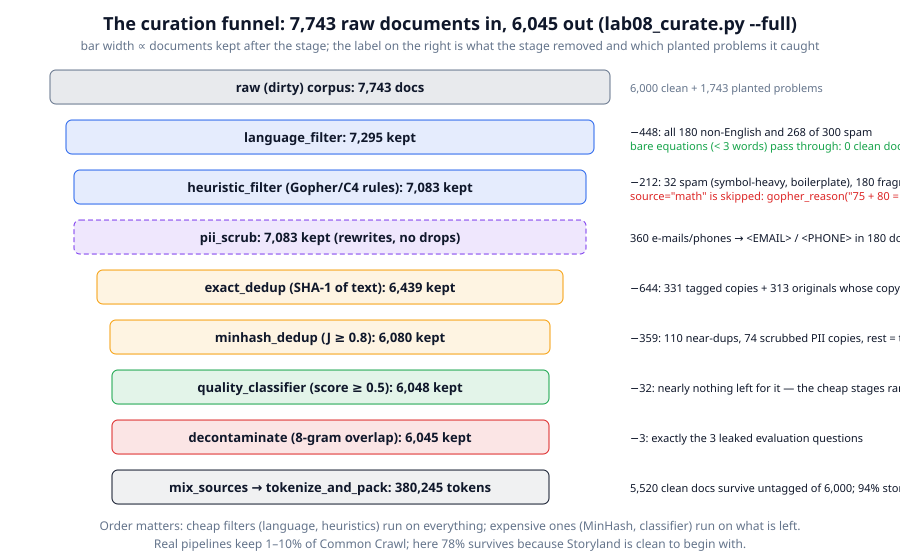
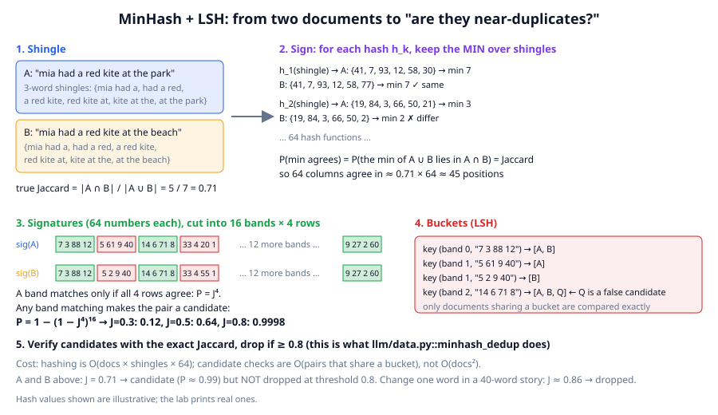

# Chapter 8: Pretraining data — where trillions of tokens come from

**Part II · ~2.5 hours · Prerequisites: Chapters 1, 2**
> 🎯 Goal: Describe a modern web-data pipeline and run one on a small corpus.
> 🧪 Lab: `labs/lab08_curate.py` · 🎛️ Interactive: `interactive/08_data_pipeline.html`

## Why this matters

A language model is a compression of its training data. Whatever is in the data — good explanations, spam, the same press release copied onto 40,000 sites, someone's phone number, the answers to the benchmark you will later use to grade the model — ends up in the weights. A 2026 frontier run reads 15–40 trillion tokens, and almost all of it starts as raw web crawl, of which the overwhelming majority is navigation menus, cookie banners, machine-translated product pages and duplicates. The work of turning that into training data is called **data curation**, and in the labs that publish their recipes (FineWeb, DCLM, Nemotron-CC) it is the single largest lever on model quality per FLOP: the same architecture trained on a better-curated slice of the same crawl scores several points higher on every benchmark.

Here is one concrete failure. Suppose the question *"Which animal returned the lost silver bell to Leo at the old stone bridge?"* is in your evaluation set, and a copy of it — with the answer — sits on a quiz website inside your crawl. The model will score well on that question for the wrong reason, and you will ship a model you believe is better than it is. This chapter builds the pipeline that removes it, and everything else that should not be there.

## The idea in pictures 📐

```mermaid
flowchart LR
    CC[Common Crawl<br/>WARC files] --> EX[text extraction<br/>trafilatura]
    EX --> LID[language ID<br/>fastText]
    LID --> HF[heuristic filters<br/>Gopher / C4 rules]
    HF --> DD[dedup<br/>exact + MinHash-LSH]
    DD --> QC[quality classifier<br/>FineWeb-Edu / DCLM]
    QC --> PII[PII scrub]
    PII --> DC[decontaminate<br/>vs. evals]
    DC --> MIX[mix + curriculum]
    MIX --> TOK[tokenize + pack]
    style CC fill:#e2e8f0,stroke:#64748b
    style TOK fill:#dcfce7,stroke:#16a34a
```



Read the flow left to right. Everything before `dedup` is cheap and runs on every page; everything after it is expensive and runs on what survives. The stages in `llm/data.py` are the same stages in the same order (with PII scrubbing moved before dedup so that two copies of a page that differ only in a scrubbed e-mail are still detected as duplicates).



The funnel above is the lab's `--full` run: 7,743 documents in, 6,045 out. Each bar's width is the number of documents still alive after that stage. Two things to notice now and remember for the rest of the chapter. First, the two cheap filters remove 660 documents — every planted foreign, spam and fragment document — and *nothing* from the clean corpus, but only because the pipeline routes maths around the prose rules: `gopher_reason("75 + 80 = 155")` returns `'odd_word_length'`, and a filter designed for prose has a false-positive rate on maths that you only discover by running it on data you trust. Second, by the time the expensive quality classifier ran, only 32 documents were left for it to remove: ordering the stages by cost is not an optimisation detail, it is what makes a petabyte-scale pipeline affordable.

### Where the raw text comes from

**Common Crawl** is a non-profit that has crawled the public web since 2008 and publishes each monthly crawl (2–3 billion pages, ~100 TB compressed) as **WARC** files — an archive format that stores the raw HTTP response, HTML and all. Every open pretraining dataset of the last five years (C4, The Pile's web slice, RefinedWeb, FineWeb, DCLM, Nemotron-CC) starts here. Common Crawl honours `robots.txt` at crawl time, so pages whose owners opted out are not in the archive to begin with.

**Text extraction** turns HTML into the main body text, dropping **boilerplate** — the navigation bars, footers, cookie notices and "related articles" that appear on every page of a site. The tool of choice since 2023 is `trafilatura`; FineWeb reports that switching from Common Crawl's own pre-extracted WET text to trafilatura extraction was one of their two biggest quality wins, because WET files keep the boilerplate. Our Storyland corpus is already plain text, so the lab skips this stage; nothing else in the pipeline changes.

### Language identification

**Language identification** assigns each document a language and a confidence. Real pipelines use fastText's 176-language classifier (a bag-of-character-n-grams linear model, trained on Wikipedia and Tatoeba) and keep documents above a confidence threshold, typically 0.65 for English. `llm/data.py` uses a two-line stand-in: the fraction of words that are common English stopwords. It catches every planted German, Spanish, French and Italian document in the lab. A bare equation like `75 + 80 = 155` has no words at all, so its score is 0 — not because it is foreign but because it carries no language signal — and `language_filter` therefore passes any document with fewer than three alphabetic words straight through. fastText-based filters make the same exception, and 2025–2026 pipelines go further: code and maths are routed through their own extractors and filters (Stack v2, OpenWebMath, FineMath) rather than the general web filter.

### Heuristic quality filters

A **heuristic filter** is a hand-written rule that drops a document for a measurable property, without any learned model. The two canonical rule sets are from C4 (2019: keep lines that end in punctuation, drop pages with "lorem ipsum" or curly braces, drop pages with fewer than three sentences) and Gopher (2021: drop documents outside 50–100,000 words, with mean word length outside 3–10 characters, with more than 10% of lines starting with a bullet, more than 30% ending in an ellipsis, with too many symbols, or where fewer than 80% of words contain an alphabetic character). FineWeb added rules for repeated lines and repeated n-grams, which is what catches spam that pads itself with `free free free`. `gopher_reason()` in the library implements a small subset (word count, mean word length, symbol ratio, duplicated lines, repeated trigrams, boilerplate phrases) and returns the *reason* a document fails, so the report can show you which rule fired.

Prose rules are wrong for non-prose. `gopher_reason("75 + 80 = 155")` returns `'odd_word_length'` (mean word length 1.4, below the 2–12 range that catches character-salad spam), and the same rule rejects most code. That is a **false positive** — a good document dropped by a filter — and it is why `heuristic_filter` takes `skip_sources=("math", "code")` and passes those documents through untouched. The real-pipeline version of this decision is bigger than one flag: maths and code get their *own* curation streams (their own extractors, their own quality classifiers trained on labelled maths and code, their own dedup thresholds), and the prose pipeline never sees them. The lab runs the pipeline on the clean corpus and reports every drop, which is how you find false positives before they cost you a training run.

### Deduplication

**Deduplication** removes documents that are copies, or near copies, of other documents. The web is enormously redundant: licence texts, wire-service articles, product descriptions and scraped Wikipedia mirrors appear millions of times. Two facts make this the most important stage in the pipeline.

The first is **memorisation**: a model trained on text that appears many times learns to reproduce it verbatim. Lee et al. (2021, "Deduplicating Training Data Makes Language Models Better") found that removing near-duplicates cut the fraction of generated text that was memorised from the training set by roughly a factor of ten, and that a model trained on the deduplicated data reached the same or better validation perplexity with fewer steps — you were spending compute re-learning what you already knew. The second is **train–test overlap**: benchmark questions and their answers are on the web, and dedup against the eval set (decontamination, below) is the same operation pointed at a different target.

**Exact deduplication** is easy: hash each document's normalised text (SHA-1 in `exact_dedup`) and keep the first occurrence of each hash. It misses the common case where two copies differ by a date, a byline or a changed word — a **near-duplicate**. For those, the standard tool since 2020 is MinHash with locality-sensitive hashing.



Follow the figure from the top left. **Shingles** (step 1) are the set of overlapping *n*-word windows of a document; with 3-word shingles, `mia had a red kite at the park` becomes six shingles. Two documents' similarity is their **Jaccard similarity**, the size of the intersection of their shingle sets divided by the size of the union:

$$J(A, B) = \frac{|A \cap B|}{|A \cup B|}$$

Read this as: of all the shingles that appear in either document, what fraction appear in both. Changing `park` to `beach` in the example leaves 5 shared shingles of 7 total, so *J* = 0.71. Computing *J* directly for every pair of a billion documents is 10<sup>18</sup> comparisons, so we need something that (a) summarises each document in a fixed-size **signature** and (b) lets us find likely-similar pairs without comparing all pairs.

**MinHash** (step 2) builds the signature. Take a hash function *h*<sub>1</sub>, apply it to every shingle of *A*, keep only the minimum value; do the same for *B*. The key fact: the minimum over the union *A ∪ B* lands in the intersection *A ∩ B* with probability exactly *J*, so

$$P\big[\min_{s \in A} h(s) = \min_{s \in B} h(s)\big] = J(A, B)$$

Read this as: one hash function gives you one coin flip whose probability of "heads" is the Jaccard similarity. Repeat with 64 independent hash functions and the fraction of positions where the two 64-number signatures agree is an estimate of *J*, with standard deviation √(*J*(1−*J*)/64) ≈ 0.06 at *J* = 0.5. The lab measures this on 200 pairs and finds a mean absolute error of 0.03.

**Locality-sensitive hashing (LSH)** (steps 3–4) finds candidate pairs without all-pairs comparison. Cut the 64-number signature into *b* = 16 **bands** of *r* = 4 rows each, and put each document into a bucket keyed by (band index, the 4 values in that band). Two documents land in the same bucket for band *k* only if all 4 values agree, which has probability *J*<sup>4</sup>; they share *at least one* bucket with probability

$$P[\text{candidate}] = 1 - (1 - J^{r})^{b} = 1 - (1 - J^4)^{16}$$

Read this as: a pair becomes a candidate if any band matches, and a band matches only if every row in it matches. Worked out: *J* = 0.3 gives 0.12, *J* = 0.5 gives 0.64, *J* = 0.8 gives 0.9998, *J* = 0.9 rounds to 1. The curve is S-shaped with its steep part near (1/*b*)<sup>1/*r*</sup> = 0.5, so nearly everything above the 0.8 threshold surfaces and most unrelated pairs never get compared. Candidates are then verified with the exact Jaccard (step 5) and dropped if *J* ≥ 0.8. Production systems (the `datatrove` library behind FineWeb, NVIDIA's NeMo Curator) use 5-word shingles, 112–260 hashes and a threshold of 0.7–0.8; the mechanism is identical to the 40 lines in `minhash_dedup`.

One consequence you will see in the lab: the threshold is on *Jaccard*, not on "how many words changed". Swapping one word in a 40-word story leaves *J* ≈ 0.86 and the copy is dropped; swapping one word in an 11-word arithmetic question leaves *J* ≈ 0.7 and the copy survives. Short documents need a lower threshold or a different similarity, and real pipelines tune this per source.

### Model-based quality classifiers

A **quality classifier** is a small model that scores each document for how much you want it in the training set, trained on labels that come from somewhere expensive. Two 2024 recipes define the state of the art:

- **FineWeb-Edu** asked Llama-3-70B to rate 500,000 web pages on a 0–5 "educational value" scale, then trained a small regressor on frozen sentence embeddings to imitate it, and kept pages scoring ≥ 3. The result is 1.3T tokens on which a 1.8B model outperforms the same model trained on the full 15T-token FineWeb on knowledge and reasoning benchmarks — fewer, better tokens.
- **DCLM** trained a fastText classifier to separate instruction-style text (OpenHermes-2.5 and high-scoring ELI5 answers) from random Common Crawl, and kept the top 10% of pages. Its 7B model trained on 2.6T of these tokens matched Llama-3-8B-class results with ~6× less compute.

Both are **distillation of a labelling function**: an expensive judge labels a sample, a cheap model learns to imitate the judge, and the cheap model scores everything. `QualityClassifier` in the library is the smallest possible version — logistic regression on hashed bag-of-words features — and the lab trains it on 300 clean and 300 planted-junk documents. The lab also shows the trap: an unbalanced labelled set produces a classifier that learns "most documents are junk" and throws away a quarter of the good ones, and a threshold moved from 0.5 to 0.7 rejects all the junk at the price of 24% of the clean documents. Every threshold is a precision–recall trade, and the only way to set it is to measure on held-out data you trust.

### PII, decontamination, mixing

**PII** (personally identifiable information — e-mail addresses, phone numbers, government IDs, street addresses) is scrubbed or replaced with placeholder tokens, both for legal reasons and because a model that has memorised a phone number will emit it. Regexes catch the structured kinds; the library replaces e-mails and phone numbers with `<EMAIL>` and `<PHONE>`. Names are not scrubbed — they are most of the content of any text.

**Decontamination** removes training documents that overlap with your evaluation sets. **Contamination** — eval text in the training set — inflates benchmark scores because the model has seen the answer, not because it can derive it; the inflation is largest on exact-match tasks and can be several points on a benchmark. The GPT-3 and Llama reports use **n-gram overlap**: any document sharing a 13-word window with an eval item is removed (the library uses 8 words, because Storyland questions are short). In the lab, this is the only stage that catches the three planted eval questions, and it catches exactly them. Contamination detection is an active 2026 topic in its own right — see Chapter 23.

**Data mixing** decides how much of each source (web, code, maths, books, Wikipedia, synthetic) goes into the final stream. Weights are set by small-scale sweeps and by **up-sampling** scarce high-value sources: Wikipedia is 0.01% of the crawl but is typically repeated 2–5× in the mix. `mix_sources` samples documents with replacement according to per-source weights, so a source with weight 3 and few documents gets each document repeated. A **curriculum** orders the mix over training — the 2025–2026 standard is to hold the highest-quality data (textbooks, maths, code, instruction-like text) for the final 10–20% of training, the *annealing* phase covered in Chapter 13.

Finally **packing** concatenates all documents into one token stream separated by an **EOS token** (end-of-sequence), and training takes random windows from it. No padding is wasted; the EOS tells the model where one document ends and an unrelated one begins.

### 🆕 What changed in 2025–2026

**Synthetic rephrasing.** Nemotron-CC (NVIDIA, Dec 2024) noticed that aggressive quality filtering discards 90% of the crawl, which is fine for a 1T-token run but starves a 15T-token run of unique tokens. Their fix: keep more of the crawl, but have an LLM *rephrase* low-quality pages into clean prose and generate Q&A, summaries and "distilled" versions of high-quality ones. The resulting 6.3T tokens (of which 1.9T synthetic) trained an 8B model that beat DCLM by ~5 points on MMLU at 1T tokens, and — the key finding — beat it by a larger margin in the long-horizon 15T-token setting where diversity matters more than aggressive filtering (https://arxiv.org/abs/2412.02595).

**Synthetic instructions at pretraining scale.** FineInstructions (Jan 2026) converts web documents into instruction–response pairs during pretraining, so the base model already has the format before SFT (https://arxiv.org/abs/2601.22146). A systematic 2026 study of synthetic pretraining data finds that the prompt design and the generator model matter more than the volume, and that source-document grounding is what keeps synthetic text from collapsing in diversity (https://arxiv.org/abs/2604.13977).

**Pipelines that curate themselves.** DataEvolve ("Data Darwinism II", Mar 2026) has an AI agent propose, run and evaluate modifications to the curation pipeline itself — new filters, new thresholds, new rephrasing prompts — scored by the downstream loss of small proxy models (https://arxiv.org/abs/2603.14420). The current evidence suggests this beats hand-tuned pipelines at equal compute, but the reported gains are from one group and one proxy-model scale; treat it as promising rather than settled.

**The quality-vs-diversity debate.** For runs of 15T tokens or more, the current evidence (Nemotron-CC, FineWeb-2, the DataComp follow-ups) is that the optimal filter is *less* strict than FineWeb-Edu's, because repeating a small high-quality set more than ~4 epochs is worse than adding lower-quality unique text. Where exactly the crossover sits depends on model size and is an open question.

### Licensing, ethics and robots.txt

An honest paragraph, because the field does not have a settled answer. Common Crawl respects `robots.txt` at crawl time, and since 2023 a large share of major publishers have added rules blocking AI crawlers, so the open crawl is shrinking in exactly the high-quality news and reference content that filters select for. Whether training on publicly accessible copyrighted text is fair use is being litigated in several jurisdictions as of 2026, with different outcomes so far; the EU AI Act requires training-data summaries for general-purpose models. Open datasets like FineWeb publish opt-out mechanisms and PII removal but cannot retroactively un-train a released model. The practical rules the open-data community converged on: honour robots.txt and opt-outs at crawl time, scrub PII, do not train on content whose licence forbids it when you can tell, publish what you trained on, and expect the rules to change.

## The idea in code

All snippets assume these imports and run in seconds on a CPU:

```python
import random
from llm.data import (make_corpus, add_noise, english_score, gopher_reason, scrub_pii,
                      shingles, minhash_signature, jaccard, QualityClassifier, decontaminate,
                      mix_sources, curate, CurationReport, tokenize_and_pack)
from llm.pipeline import get_tokenizer
```

**A clean corpus and a dirty one.** `add_noise` copies documents, swaps words, appends spam, foreign text, PII and fragments, and tags each planted problem so the report can grade the pipeline:

```python
clean = make_corpus(1500, seed=0)                       # list of {"text", "source", "id", ...}
eval_qs = ["Which animal returned the lost silver bell to Leo at the old stone bridge?"]
dirty = add_noise(clean, seed=0, eval_questions=eval_qs)
print(len(clean), len(dirty))                            # 1500 1936
print({d["planted"] for d in dirty if d.get("planted")})
# {'exact_dup', 'near_dup', 'spam', 'non_english', 'pii', 'too_short', 'contaminated'}
```

**The cheap filters.** Each returns `None` to keep or a reason string to drop, so the report can count reasons:

```python
print(english_score("Mia had a red kite and took it to the park."))   # 0.545 (6 of 11 words are stopwords)
print(english_score("Der Hund läuft schnell durch den Park."))         # 0.0
print(gopher_reason("Click here to subscribe!!! BUY NOW >>> $$$ ####"))   # 'symbol_heavy'
print(gopher_reason("ok"))                                                 # 'too_short'
print(scrub_pii("mail mia@example.com or call 555-0123-4567"))
# ('mail <EMAIL> or call <PHONE>', 2)
```

**MinHash by hand.** The signature agreement rate estimates the Jaccard similarity:

```python
a = shingles("mia had a red kite and took it to the park on a sunny day")
b = shingles("mia had a red kite and took it to the beach on a sunny day")
print(len(a), len(a & b), jaccard(a, b))                  # 13 10 0.625
sig_a, sig_b = minhash_signature(a, 64), minhash_signature(b, 64)   # each (64,) int64
print(sig_a.shape, (sig_a == sig_b).mean())               # (64,) 0.578  (true J = 0.625, ± 0.06)
print(1 - (1 - 0.625 ** 4) ** 16)                         # P(LSH candidate) = 0.92
```

**A quality classifier from a few hundred labels.** Good = clean documents, bad = the planted junk; the features are hashed word counts, the model is logistic regression trained by gradient descent:

```python
junk = [d["text"] for d in dirty if d.get("planted") in ("spam", "non_english", "too_short")]
good = [d["text"] for d in clean[:100]]
clf = QualityClassifier().fit(good + junk[:100], [1] * 100 + [0] * 100)
print(round(clf.score(clean[500]["text"]), 2), round(clf.score(junk[-1]), 2))   # 0.75 0.43
```

**Decontamination and mixing.**

```python
kept = decontaminate(dirty, eval_qs, n=8)                 # drop any doc sharing an 8-gram with an eval item
print(len(dirty) - len(kept))                              # 1  (the one planted leak)
mixed = mix_sources(clean, {"stories": 1.0, "math": 3.0}, n_out=1000, seed=0)
print(sum(d["source"] == "math" for d in mixed) / 1000)   # ~0.75
```

**The whole pipeline with a report.** `curate` chains the stages; `CurationReport` records kept/dropped/reasons/planted-caught per stage:

```python
report = CurationReport()
curated = curate(dirty, eval_texts=eval_qs, clf=clf, report=report)
print(report.table())              # one line per stage: kept, dropped, planted problems caught
tokens = tokenize_and_pack(curated, get_tokenizer())     # (n_tokens,) int64, EOS between docs
print(len(curated), tokens.shape)                          # 1511 torch.Size([92782])
```

## Worked example 🧪

Run `python3 labs/lab08_curate.py` (quick: 1,500 clean documents, 16 s) and then `--full` (6,000 documents, 33 s; both measured with two CPU threads on a shared 4-core VM). The report table from the full run:

```
stage                           kept  dropped  planted problems caught
language_filter                 7295      448  non_english:180, spam:268
heuristic_filter                7083      212  spam:32, too_short:180
pii_scrub (rewrites)            7083        0  pii:180
exact_dedup                     6439      644  exact_dup:327, near_dup:1, pii:3
minhash_dedup                   6080      359  exact_dup:8, near_dup:110, pii:74
quality_classifier              6048       32  near_dup:7, pii:25
decontaminate                   6045        3  contaminated:3

7,743 raw -> 6,045 curated documents in 12.2s
```

What to look at:

1. **The cheap filters do the language work** — the language filter catches all 180 foreign documents and 268 of 300 spam documents (spam has few English stopwords); the Gopher rules catch the other 32 spam documents (`symbol_heavy`, `boilerplate`) and all 180 fragments (`too_short`). Run on the *clean* corpus alone, the two stages drop nothing, because bare equations bypass the language test and `source="math"` bypasses the prose rules. Section 2 of the lab shows what happens without the routing: `gopher_reason('75 + 80 = 155') = 'odd_word_length'`.
2. **Dedup counts are not what they look like.** 600 exact duplicates were planted, but `exact_dedup` reports catching 327 tagged copies and dropping 644 documents. The corpus is shuffled, so for about half the pairs the *copy* came first and was kept, and the original was dropped — the lab reports that of the 480 clean documents that "disappear", 388 live on as their planted twin. (The other 40 are genuine duplicates: the generator drew the same equation twice.) The right check is the one the lab makes: every curated text is unique, and no surviving pair has Jaccard ≥ 0.8.
3. **PII is caught 282 times for 180 planted documents.** 180 rewrites, then 3 + 74 + 25 of the scrubbed copies dropped by later stages as near-duplicates of their originals. A document can be touched by several stages; a "caught" count is per stage, not per document.
4. **The MinHash scatter** (`figures/generated/lab08_minhash.png`) shows the 64-hash estimate against the true Jaccard on 200 pairs: mean error 0.031, maximum 0.134, matching the √(J(1−J)/64) theory. The red line at 0.8 is the drop threshold.
5. **The classifier thresholds:** `0.3 keeps 100% of clean, rejects 61% of junk · 0.5: 100% / 92% · 0.7: 76% / 100%`. Pick 0.5 here; a real pipeline would pick by the downstream loss of a proxy model.
6. **Mixing and packing:** with weights stories:1, math:3, maths becomes 76% of a 2,000-document sample and each of the 944 distinct surviving maths documents is repeated ~1.6×; packing the curated set gives 380,245 tokens, 94% of them story tokens — maths documents are short, so 25% of the documents is 6% of the tokens. Weights are per *document*; if you care about tokens, weight by tokens.

The quick run gives the same picture at a quarter of the size (1,938 raw → 1,511 curated, 92,720 tokens). Both end with `22/22 checks passed`.

🎛️ In `interactive/08_data_pipeline.html`, paste a paragraph of your own text and watch it pass through each stage: the language score, which Gopher rule fires (if any), the shingle set and MinHash signature next to a second document you edit, and the LSH candidate probability as you drag the band/row sliders. The challenge is to find the smallest edit to a 40-word paragraph that makes its copy survive dedup at threshold 0.8.

## Try it yourself ✍️

1. **Turn off the routing.** Run `heuristic_filter(clean, skip_sources=())` and `language_filter(clean, min_alpha_words=0)` on the clean corpus and count the drops by reason and by source. Then invent one rule of your own that would keep the maths *without* the `source` tag (real crawls do not come labelled). What does your rule do to `"LOGIN | REGISTER | CART (0)"`?
2. **Threshold sweep.** Run `minhash_dedup` with thresholds 0.6, 0.7, 0.8, 0.9 on the dirty corpus and count (a) planted near-duplicates removed and (b) clean documents removed. Plot both against the threshold. Where would you set it for Storyland?
3. **Bands and rows.** Keep 64 hashes but try 8×8, 16×4, 32×2 bands×rows. For each, compute *P*(candidate) at *J* = 0.5 and 0.8, then measure how many candidate comparisons `minhash_dedup` actually makes (add a counter). Which setting would you choose for a billion documents?
4. **A better classifier.** Replace the "bad" training set with only spam (no foreign text, no fragments). What does the classifier now do with the German documents? This is what happens when your labels do not cover a failure mode.
5. **Contamination, measured.** Train the Chapter 10 nano model twice on the packed tokens, once with the three eval questions left in and once with them removed, and compare the loss on those three questions. (Chapter 23 turns this into an eval harness.)
6. **Curriculum.** Using `mix_sources` twice, build a stream whose first 80% is the general mix and whose last 20% is maths-heavy, and hand it to Chapter 10's training loop. Compare the arithmetic accuracy of the two runs with `llm.tasks.verify`.

## Check yourself ✅

<details><summary>1. Why do real pipelines run the language filter and heuristic rules before MinHash and the quality classifier?</summary>

Cost. Language ID and heuristic rules are a few microseconds per document; MinHash hashes every shingle 64+ times and the classifier runs a model. Cheap stages typically remove 80–90% of the crawl, so the expensive stages see a tenth of the data. In the lab the classifier had only 32 documents left to reject.
</details>

<details><summary>2. Two 3-word-shingle sets share 30 shingles and have 40 in their union. With 64 hashes, what fraction of signature positions agree, and with 16 bands of 4 rows what is the probability they become an LSH candidate?</summary>

*J* = 30/40 = 0.75, so about 0.75 × 64 = 48 positions agree (± about 3.5). *P*(candidate) = 1 − (1 − 0.75<sup>4</sup>)<sup>16</sup> = 1 − (1 − 0.316)<sup>16</sup> = 1 − 0.684<sup>16</sup> ≈ 0.998.
</details>

<details><summary>3. Why does deduplication improve a model even when you are not worried about memorisation?</summary>

Duplicated text makes the model spend gradient steps re-learning the same sequence; Lee et al. (2021) showed a model trained on deduplicated data reaches the same or better perplexity in fewer steps. It also distorts the mix: if one licence text is copied a million times, the model's estimate of "what text looks like" is a million licence texts.
</details>

<details><summary>4. A 13-gram decontamination filter is run and the model still scores suspiciously well on a benchmark. Name two ways contamination can survive.</summary>

Paraphrase (the question is on the web reworded, so no 13-word window matches), and translation or formatting changes (numbers written as words, extra whitespace, a table rendered as text). Both are why 2026 work on contamination detection uses model-based and embedding-based methods, not only n-grams. A third: the contamination is in a *later* stage's data (SFT or RL prompts), which this filter never sees.
</details>

<details><summary>5. FineWeb-Edu keeps ~10% of FineWeb and trains better small models. Why would a 15T-token run use a looser filter?</summary>

Because 10% of a 15T-token crawl is 1.5T unique tokens, and a 15T-token run would have to repeat them 10 times. Repeating data beyond ~4 epochs gives diminishing and then negative returns, so the run is better off adding lower-scoring unique text (or LLM-rephrased text, as Nemotron-CC does) than repeating high-scoring text. Quality wins when tokens are plentiful relative to the run; diversity wins when they are not.
</details>

## Key takeaways

- Curation is a funnel ordered by cost: extraction → language → heuristics → dedup → classifier → PII → decontamination → mix → pack. Cheap stages remove most of the data.
- Filters have false positives; measure them on data you trust. Prose rules reject maths and code, so those get their own curation streams.
- MinHash turns "are these documents similar?" into "do these 64 numbers agree?", and LSH banding turns "compare all pairs" into "compare bucket-mates". *P*(candidate) = 1 − (1 − *J*<sup>r</sup>)<sup>b</sup>.
- Dedup reduces memorisation ~10× and saves compute; decontamination removes the eval answers the web already contains.
- Quality classifiers distil an expensive judge into a cheap scorer; balance the labels and pick the threshold on held-out data.
- 🆕 For ≥15T-token runs, diversity and synthetic rephrasing beat aggressive filtering; pipelines are starting to tune themselves.

## Going deeper

- Raffel et al., "Exploring the Limits of Transfer Learning with a Unified Text-to-Text Transformer" (C4 filtering rules), 2019.
- Rae et al., "Scaling Language Models: Methods, Analysis & Insights from Training Gopher" (Appendix A, the Gopher rules), 2021.
- Lee et al., "Deduplicating Training Data Makes Language Models Better", 2021.
- Broder, "On the resemblance and containment of documents" (MinHash), 1997 — and Leskovec, Rajaraman & Ullman, *Mining of Massive Datasets*, ch. 3 (LSH), free online.
- Penedo et al., "The FineWeb Datasets: Decanting the Web for the Finest Text Data at Scale", 2024. https://arxiv.org/abs/2406.17557
- Li et al., "DataComp-LM: In search of the next generation of training sets for language models", 2024. https://arxiv.org/abs/2406.11794
- 🆕 Su et al., "Nemotron-CC: Transforming Common Crawl into a Refined Long-Horizon Pretraining Dataset", Dec 2024. https://arxiv.org/abs/2412.02595
- 🆕 FineInstructions: synthetic instructions at pretraining scale, Jan 2026. https://arxiv.org/abs/2601.22146
- 🆕 DataEvolve / "Data Darwinism II": AI-evolved curation pipelines, Mar 2026. https://arxiv.org/abs/2603.14420
- 🆕 "A systematic study of synthetic pretraining data", Apr 2026. https://arxiv.org/abs/2604.13977

← [Chapter 7](07-inference.md) · [Course home](../README.md) · [Chapter 9](09-scaling-laws.md) →
