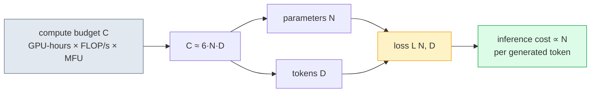
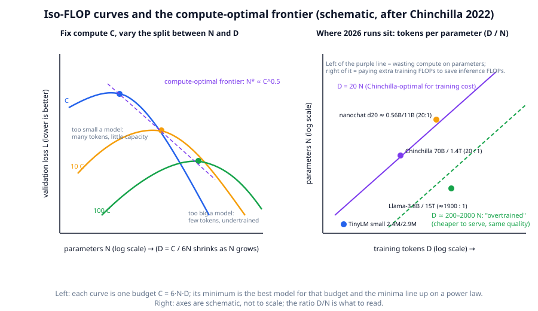

# Chapter 9: Scaling laws and compute budgets

**Part II · ~2 hours · Prerequisites: Chapters 6, 8**
> 🎯 Goal: Estimate how big a model and how much data a compute budget buys.
> 🧪 Lab: `labs/lab09_scaling.py` · 🎛️ Interactive: `interactive/09_scaling_calculator.html`

## Why this matters

Before a frontier lab spends $100 million on a training run, it knows — to within a few percent — what validation loss the run will reach. It knows this without training the model, from a handful of much cheaper runs and a formula with three fitted constants. That is what a **scaling law** is: an empirical relationship between the loss a model reaches and the three quantities you control — its number of parameters *N*, the number of training tokens *D*, and the compute *C* spent — that holds smoothly across six or more orders of magnitude.

The practical question the law answers is the one you will face at every scale, including a $100 run: given this much compute, should I train a bigger model on fewer tokens or a smaller model on more? Get it wrong by 10× in either direction and you waste most of the budget. In 2022 the answer changed (the Chinchilla paper showed that GPT-3 was ~4× too big for its token count), and in 2024–2026 it changed again, in the other direction, once labs started counting the cost of *serving* the model. This chapter derives the compute formula, explains both answers, and fits a tiny scaling law to three TinyLMs you train yourself.

## The idea in pictures 📐



Read the flow left to right: you start with a budget in FLOPs, the 6·N·D rule turns it into a trade-off curve between model size and data, the loss depends on where on that curve you sit, and once trained, every generated token costs about 2·N FLOPs forever. The whole chapter is about the arrow from *C* to the (*N*, *D*) pair.



The left panel is the key picture from the Chinchilla paper, drawn schematically. Each coloured curve is an **iso-FLOP curve**: every point on it costs the same compute *C*, and moving right means a bigger model trained on proportionally fewer tokens (because *D* = *C* / 6*N*). Each curve is U-shaped — too small a model cannot use the tokens, too big a model does not see enough of them — and the bottom of the U is the best model for that budget. The dots (one per budget) line up on a straight line in log–log space: the **compute-optimal frontier**, along which the optimal *N* grows as roughly *C*<sup>0.5</sup>, and therefore so does the optimal *D*. The right panel shows where actual 2022–2026 models sit relative to the frontier's "20 tokens per parameter" rule; almost everything trained since 2023 sits far to the right of it, on purpose. The rest of this section explains both panels.

### Counting compute: where 6·N·D comes from

A **FLOP** is one floating-point operation (a multiply or an add). Nearly all of a Transformer's compute is matrix multiplications, so count those. Push one token's activation vector *x* (length *d*) through one weight matrix *W* (*d* × *k*): every one of the *d·k* weights is multiplied by an input and added into an output, so that is *d·k* multiply-adds, or *2·d·k FLOPs per token in the forward pass* — two FLOPs per weight per token. Summing over every weight matrix in the model, the forward pass costs 2·*N* FLOPs per token, where *N* counts the parameters in weight matrices (the embedding lookup is a copy, not a multiply, which is why *N* is usually counted *without* embeddings).

The backward pass costs twice the forward pass. For each matrix multiply, backpropagation needs two more of the same size: one to compute the gradient with respect to the *input* (so the error can flow to the layer below) and one to compute the gradient with respect to the *weights* (the thing we actually update). That is 4·*N* FLOPs per token for backward, and

$$C \approx 6 \cdot N \cdot D$$

Read this as: the compute for a training run is six FLOPs per parameter per training token — two to go forward, four to go back. The lab checks this against `TinyLM.flops_per_token()`, which adds the attention-score term (12 · layers · *d* · *T* per token, quadratic in sequence length); for the `small` preset at *T* = 256 that adds 23% (11% at *T* = 128), and for a 2026 model at *T* = 8k–128k the attention term is why FlashAttention and the sparse attention of Chapter 12 matter. A frontier run is 10<sup>25</sup>–10<sup>26</sup> FLOPs; the lab's full run is 10<sup>13</sup>.

The other ingredient is how many FLOPs an hour of hardware delivers. An H100 has a peak of 990 TFLOP/s in bf16 dense matmul, but no real training loop reaches it: **MFU** (model FLOPs utilisation) is the fraction of peak that the *useful* 6·N·D FLOPs represent, after memory stalls, communication and everything that is not a matmul. 40% is a good large-run number; 50%+ is exceptional. So

$$C = \text{GPUs} \times \text{hours} \times 3600 \times 990\times10^{12} \times \text{MFU}$$

Read this as: one H100-hour at 40% MFU is 1.4 × 10<sup>18</sup> useful FLOPs. nanochat's 8 × H100 for 4 hours is 4.6 × 10<sup>19</sup>.

### Kaplan (2020) vs Chinchilla (2022)

Kaplan et al. (OpenAI, 2020) were the first to measure the smooth power laws: loss falls as a power of *N*, as a power of *D*, and as a power of *C* when the other quantities are not the bottleneck. Their compute-optimal recommendation was to spend most extra compute on a *bigger model*: *N*<sub>opt</sub> ∝ *C*<sup>0.73</sup>, tokens only ∝ *C*<sup>0.27</sup>. GPT-3 (175B parameters, 300B tokens, 1.7 tokens per parameter) followed this advice.

Hoffmann et al. (DeepMind, 2022, the **Chinchilla** paper) repeated the measurement with the learning-rate schedule matched to each run's length — Kaplan had used one fixed schedule, which penalised the short runs — and got a different answer: *N*<sub>opt</sub> ∝ *C*<sup>0.5</sup> and *D*<sub>opt</sub> ∝ *C*<sup>0.5</sup>. Scale model and data *together*, and at every budget they measured the optimum sat near

$$D_{\text{opt}} \approx 20 \cdot N_{\text{opt}}$$

Read this as: for the cheapest route to a given loss, train on about twenty tokens for every parameter. Chinchilla itself (70B parameters, 1.4T tokens) beat the 4× larger Gopher at the same compute. Their fitted loss surface is worth memorising in shape:

$$L(N, D) = E + \frac{A}{N^{\alpha}} + \frac{B}{D^{\beta}}$$

Read this as: the loss is an irreducible floor *E* (the entropy of the text itself, which no model can beat) plus a term that shrinks as the model grows plus a term that shrinks as the data grows. Chinchilla's fit for web text: *E* ≈ 1.69 nats, *α* ≈ 0.34, *β* ≈ 0.28. The two power terms have similar exponents, which is *why* the optimum scales *N* and *D* together. The lab fits the one-variable version *L*(*N*) = *E* + *A*/*N*<sup>α</sup> at fixed *D*.

### 🆕 2026 practice: overtraining and inference-aware scaling

Chinchilla optimises *training* cost. But a model is trained once and served billions of times, and serving cost is ∝ *N* per token. If you expect heavy inference, a smaller model trained on more tokens is cheaper over its lifetime even though it costs more to train to the same loss. Llama-3 8B (2024) was trained on 15T tokens — roughly 1,900 tokens per parameter, 95× the Chinchilla ratio — and the Llama-3 paper reports the loss was still falling. This is called **overtraining** (training well past the compute-optimal token count), and it is now the default for every model meant to be deployed: small open models in 2025–2026 are trained on 14–36T tokens (Qwen3 reports 36T; Gemma 3 27B, 14T), and aggregators report the same pattern for the 2026 Qwen3.8 27B dense model. The trade is quantified by **inference-aware scaling laws** (Sardana & Frankle 2023): add the expected lifetime inference FLOPs (2·*N* per served token) to the training FLOPs and minimise the total. For a model that will serve 10<sup>12</sup> tokens, the optimum shifts by a factor of several toward smaller *N* and larger *D*.

Two more 2026 corrections to the picture. First, the *quality* of tokens changes the constants: FineWeb-Edu-style filtering (Chapter 8) lowers the loss reached at a given *D* by an amount comparable to doubling *D*, so "tokens" in 2026 laws are quality-weighted. Second, the laws are for *loss*; downstream capabilities such as multi-step reasoning can appear at a threshold of loss and look like sudden jumps in accuracy even though the loss curve is smooth — which is why labs now fit laws to benchmark scores as well.

### muP: hyperparameters that transfer across sizes

There is a hidden cost in every scaling study: the best learning rate changes with model width, so each size needs its own sweep, and a sweep at 100B is not affordable. **muP** (Maximal Update Parametrisation, Yang et al. 2022) is a way of *scaling the initialisation and per-layer learning rates with width* such that the optimal learning rate stays the same as the model grows. The intuition: in the standard parametrisation, doubling the width of a layer roughly doubles the size of the update to its outputs (twice as many inputs feed each sum), so a wider model needs a smaller learning rate to make the same-sized change. muP divides the hidden-layer learning rate by the width (and scales the output layer's initialisation similarly) so that every layer's *output change per step* is width-independent. The payoff is **hyperparameter transfer**: tune LR, warmup and initialisation on a 40M-parameter proxy, then reuse them at 10B. The current evidence suggests it works well for width and reasonably for depth (with a depth-muP extension); Cerebras-GPT (2023) trained with it and later open-model reports have followed, while others get a similar benefit from Muon's shape-aware update scaling (Chapter 10). Either way, the lab you are about to run sweeps nothing — it uses one learning rate for three widths, which is a small unfairness to the widest model that you can fix in the exercises.

### Reading a loss curve

A loss curve is the training loss (one batch, noisy) or validation loss (a fixed set of windows, smooth) against steps or tokens, and every practitioner reads a few things off it:

- The *start*: ln *V* nats (uniform guessing over the vocabulary; 6.77 for TinyLM's 871-token vocabulary). The first few hundred steps drop fast as the model learns token frequencies, then bigrams.
- The *shape*: on a log-*x* axis the curve is close to a straight line for a long time — that is the power law — then bends as it approaches *E*. On a linear axis it looks like a hockey stick, with most of the visible drop in the first 10% of training.
- The *gap* between training and validation loss: near zero for a single-epoch web run (the model never sees a token twice), growing if the data is repeated (overfitting).
- The *end*: with a cosine or WSD schedule (Chapter 10), the loss drops noticeably during the final decay as the learning rate goes to zero — a run stopped early, before its decay, looks worse than it is.
- *Spikes*: a sudden jump followed by recovery (or not) — Chapter 10.

## The idea in code

Imports for every snippet:

```python
import math
import numpy as np
from llm.config import preset, TinyLMConfig
from llm.model import TinyLM
```

**Counting *N* and FLOPs.** The library counts non-embedding parameters by default, and its FLOP estimate is 6·N plus the attention term:

```python
model = TinyLM(preset("small", vocab_size=1024))
N = model.num_params()                       # non-embedding parameters
N_all = model.num_params(non_embedding=False)
print(f"{N:,} non-embedding, {N_all:,} total")           # 2,361,792 non-embedding, 2,558,400 total
print(f"6·N_all = {6 * N_all:,}   flops_per_token() = {model.flops_per_token():,.0f}")
# 6·N_all = 15,350,400   flops_per_token() = 18,889,344   (attention adds 23% at T = 256)
```

**The 6·N·D rule from one matmul.** A (*T*, *d*) activation through a (*d*, *k*) weight:

```python
T, d, k = 128, 192, 512
fwd = 2 * T * d * k                           # one multiply-add per weight per token = 2 FLOPs
bwd = 2 * fwd                                 # grad w.r.t. input AND grad w.r.t. weight
print(fwd / (T * d * k), (fwd + bwd) / (T * d * k))     # 2.0 6.0  FLOPs per weight per token
```

**Budget → Chinchilla-optimal (*N*, *D*).** Solve *C* = 6·N·D with *D* = *r*·N for a tokens-per-parameter ratio *r*:

```python
def chinchilla(C, tokens_per_param=20):
    N = math.sqrt(C / (6 * tokens_per_param))
    return N, tokens_per_param * N

C = 8 * 4 * 3600 * 990e12 * 0.40              # 8×H100, 4 h, 40% MFU = nanochat's budget
N_opt, D_opt = chinchilla(C)
print(f"C = {C:.2e}  ->  N = {N_opt / 1e6:.0f}M, D = {D_opt / 1e9:.1f}B tokens")   # C = 4.56e+19 -> N = 617M, D = 12.3B
N_ot, D_ot = chinchilla(C, 200)
print(f"at 200 tokens/param: N = {N_ot / 1e6:.0f}M, D = {D_ot / 1e9:.1f}B")       # N = 195M, D = 39.0B
```

nanochat's d20 model is ~560M parameters trained on ~11B tokens: the formula lands within 10% of what Karpathy chose by experiment.

**Fitting *L*(*N*) = *E* + *A*/*N*<sup>α</sup>.** For a fixed *α* the problem is linear in (*E*, *A*), so grid over *α* and solve each by least squares (no scipy needed):

```python
def fit_power_law(N, L, alphas=np.linspace(0.05, 2.0, 400)):
    best = None
    for a in alphas:
        X = np.stack([np.ones_like(N), N ** (-a)], axis=1)      # (n_points, 2)
        (E, A), *_ = np.linalg.lstsq(X, L, rcond=None)
        resid = float(((X @ (E, A) - L) ** 2).sum())
        if E >= 0 and A > 0 and (best is None or resid < best[0]):
            best = (resid, E, A, a)
    return best[1:]

N = np.array([1e5, 3e5, 1e6]); L = 2.0 + 300 * N ** -0.4      # points from a known law
print(fit_power_law(N, L))                                      # (2.009, 305.7, 0.402): recovered
```

## Worked example 🧪

Run `python3 labs/lab09_scaling.py` (quick: three models, 61,440 tokens each, 293 s when measured, 39 + 76 + 119 s of it training, with two threads on a shared 4-core VM running ~10 other jobs — an idle laptop should need about a minute) and `--full` (1,228,800 tokens each, 659 s measured on the same VM under one thread and heavy load). Timings are with two CPU threads on a shared 4-core VM; an idle laptop is faster.

**Quick run** — the three sizes and the fit:

```
train stream 357,931 tokens | budget D = 60 steps × 16 × 64 = 61,440 tokens per model
  xs: d= 64 layers=2  N=   98,624 (+55,744 embedding)  val loss 3.381  ...
  s: d= 96 layers=3  N=  295,584 (+83,616 embedding)  val loss 2.499  ...
  m: d=160 layers=4  N=1,117,600 (+139,360 embedding)  val loss 2.390  ...

val loss L(N, D) at intermediate token counts (rows: D, columns: model size):
  D (tokens)       xs        s        m   (biggest − smallest)
      13,312    5.102    4.775    4.804   -0.297
      25,600    4.451    3.888    4.043   -0.408
      37,888    3.855    3.081    3.158   -0.697
      50,176    3.518    2.663    2.639   -0.879
      61,440    3.381    2.497    2.388   -0.993
✅ bigger model -> lower loss at a fixed token budget

fit: L(N) = 2.381 + 5.55e+09 / N^1.951
     N=   98,624  measured 3.381  fitted 3.381
     N=  295,584  measured 2.499  fitted 2.498
     N=1,117,600  measured 2.390  fitted 2.390
extrapolation to N = 11,176,000 (10× the largest): predicted loss 2.381
```

**Full run** — twenty times the tokens:

```
train stream 357,931 tokens | budget D = 300 steps × 32 × 128 = 1,228,800 tokens per model
  xs: d= 64 layers=2  N=   98,624 (+55,744 embedding)  val loss 1.037  ...
  s: d= 96 layers=3  N=  295,584 (+83,616 embedding)  val loss 1.014  ...
  m: d=160 layers=4  N=1,117,600 (+139,360 embedding)  val loss 1.008  ...


fit: L(N) = 1.006 + 2.06e+04 / N^1.164

  xs: 6·N·D = 1.14e+12   model.flops_per_token()·D = 1.38e+12   (attention adds 21%)
  s: 6·N·D = 2.80e+12   model.flops_per_token()·D = 3.34e+12   (attention adds 19%)
  m: 6·N·D = 9.27e+12   model.flops_per_token()·D = 1.05e+13   (attention adds 13%)
  this lab used 1.52e+13 FLOPs in total — a frontier run is ~10^25–10^26, i.e. 10^12× more

budget                 GPU-hours     FLOPs  N (20 tok/param)        D  N (200 tok/param)        D
$100 (nanochat)               33   4.8e+19              629M    12.6B               199M    39.8B
$10k                       3,333   4.8e+21             6.29B     126B              1.99B     398B
$10M                   3,333,333   4.8e+24              199B    3.98T              62.9B    12.6T
```

What to look at:

1. **Bigger is better at fixed *D*, but by less and less.** In the quick run, going from `xs` to `s` (3× the parameters) buys 0.88 nats; going from `s` to `m` (3.8×) buys 0.11. In the full run the whole spread is 0.03 nats. At a fixed token budget the marginal parameter is worth less the more you already have — that is the *A*/*N*<sup>α</sup> term shrinking toward *E*.
2. **The fitted *E* is Storyland's irreducible loss.** With 1.2M tokens every size lands within 0.03 of *E* = 1.006 nats (perplexity 2.7). Storyland is generated from ten templates and a few hundred words, so most of the remaining uncertainty is *which* name, colour or object the template drew — no model can predict a random draw. This is what the constant in Chinchilla's law means, on a corpus small enough to see it.
3. **Do not trust *α* from three points.** Three measurements determine three constants exactly (the residual is zero by construction), and the two runs give *α* = 1.95 and 1.16 — nothing like Chinchilla's 0.34. Both runs are also unfair to the larger models: one learning rate for all widths (the muP section above) and a token budget so small that `m` is far from converged in the quick run. Exercise 1 adds a fourth point and exercise 2 a fair sweep; the *shape* of the fit is the lesson, not its exponent.
4. **The *L*(*N*, *D*) table** (quick run) is the same experiment read the other way: down a column, loss falls with tokens; across a row, with parameters. Look at `s` versus `m`: the wider model is *behind* until 50k tokens and only overtakes at the end. A bigger model needs more tokens before its extra capacity pays for its slower start (and it is the one most hurt by the shared learning rate). Read across the two runs and the whole Chinchilla surface appears: at 61k tokens the biggest-minus-smallest gap is still opening (−0.99 nats); by 1.2M tokens it has closed to −0.03 because every size is at the floor.
5. **The loss-vs-tokens plot** (`figures/generated/lab09_scaling.png`, right panel) for model `m` is the log-*x* hockey stick from the "reading a loss curve" section: 6.83 nats at 4k tokens, most of the drop by 100k tokens, then a slow slide to 0.99.
6. **The attention term** adds 7–21% to 6·N·D for these models at *T* = 64–128, more for the narrow ones (attention cost is ∝ *d*·*T* per layer while parameters are ∝ *d*<sup>2</sup>). The achieved rate was 1.6–4.2 GFLOP/s in the quick run and 12–32 GFLOP/s in the full run on this (contended) CPU; an H100 delivers ~400,000 GFLOP/s at 40% MFU.
7. **The budget table** turns the formula into decisions: at 20 tokens per parameter nanochat's budget buys a 629M-parameter model on 12.6B tokens (the real d20 model is 560M on 11B); at 200 tokens per parameter the same budget buys a 199M model that is 3× cheaper to serve. $10M buys a 199B model on 4T tokens by Chinchilla — or a 63B model on 12.6T tokens, which is close to how the open 2025–2026 dense models were actually sized.


🎛️ In `interactive/09_scaling_calculator.html`, set a cluster (GPU count from 1 to 4,096, GPU type, MFU, hours, price per GPU-hour) and read off the FLOPs, the dollar cost and the (*N*, *D*) pair that budget buys. Drag the GPU slider from 8 to 4,096 and watch the Chinchilla-optimal model move up the diagonal of the iso-FLOP chart; then switch the tokens-per-parameter setting from 20 to 500 or 2,000 — same compute, a much smaller model on far more tokens, with the per-token inference cost shown alongside. The presets ($100 on 8×H100, $10k, …) reproduce the budget table above; the challenge asks what $100 buys at 40% MFU and how it compares with nanochat's reported d20 run.

## Try it yourself ✍️

1. **A fourth point.** Add a size (`d_model=224, n_layers=5, n_heads=4`) to `SIZES` in the lab and re-fit. Does *α* change? Now you have four points for three parameters — report the residual.
2. **Fair learning rates.** Sweep `LR` in {1e-3, 2e-3, 4e-3, 8e-3} for each size and record the best final loss per size. Re-fit the law on the best-of-sweep numbers. This is what a real scaling study does, and it is what muP would let you skip.
3. **The other axis.** Fix the size `s` and train with *D* ∈ {30k, 60k, 120k, 240k} tokens (change `STEPS`). Fit *L*(*D*) = *E* + *B*/*D*<sup>β</sup>. Compare *E* with the *E* from the *L*(*N*) fit — they should be close if both fits are honest.
4. **Iso-FLOP by hand.** Using `flops_per_token()`, choose a budget of 5 × 10<sup>11</sup> FLOPs and train `xs`, `s`, `m` each for as many tokens as that budget allows. Which is best? You have just drawn one iso-FLOP curve.
5. **Inference-aware.** Extend `chinchilla()` to minimise 6·N·D + 2·N·D<sub>serve</sub> for D<sub>serve</sub> = 10<sup>11</sup>, 10<sup>12</sup>, 10<sup>13</sup> served tokens, at the nanochat budget. Plot the optimal tokens-per-parameter against D<sub>serve</sub>.
6. **Check the wall-clock.** The lab prints achieved GFLOP/s. Compare with your CPU's theoretical peak (cores × clock × FLOPs/cycle). What is your MFU?

## Check yourself ✅

<details><summary>1. Why six FLOPs per parameter per token, and not two?</summary>

Two is the forward pass: each weight is multiplied by an activation and the product added, once per token. The backward pass needs two more matmuls of the same size per layer — one for the gradient with respect to the layer's input (to propagate error downward) and one for the gradient with respect to the weights — so backward is 4 and the total is 6. Inference is only the forward 2·N.
</details>

<details><summary>2. You have 100× more compute than a Chinchilla-optimal 1B-parameter, 20B-token run. How big a model and how many tokens does Chinchilla recommend?</summary>

Both scale as *C*<sup>0.5</sup>: 10× each. A 10B model on 200B tokens. (Kaplan's exponents would have said ~29B parameters on ~70B tokens.)
</details>

<details><summary>3. Llama-3 8B was trained on 15T tokens, ~1,900 tokens per parameter. Was Meta wasting compute?</summary>

Not for its purpose. Chinchilla's ratio minimises *training* compute for a target loss. An 8B model that will serve trillions of tokens is much cheaper to run than the ~30B model that Chinchilla would have built with the same training budget, and it reaches a loss the Chinchilla-optimal 8B would not. Inference-aware scaling makes the trade explicit: minimise training plus lifetime serving FLOPs.
</details>

<details><summary>4. What does the constant *E* in L = E + A/N^α mean, and why can it not be zero?</summary>

It is the loss you would get with infinite parameters (and, in the two-variable form, infinite data): the irreducible entropy of the text. Natural language is genuinely uncertain — the next word after "the" is not determined — so the best possible predictor still has nonzero cross-entropy. Chinchilla's fit puts it near 1.69 nats per token for their tokenizer and data.
</details>

<details><summary>5. The lab uses one learning rate for three model widths. Which model is most likely disadvantaged, and what fixes it?</summary>

The widest one. Under standard parametrisation the optimal learning rate falls as width grows, so a rate tuned for the narrow model is too high for the wide one (or, if tuned for the wide one, too low for the narrow). muP rescales per-layer learning rates and initialisation with width so that one rate is near-optimal for all; short of that, a per-size LR sweep (exercise 2).
</details>

## Key takeaways

- *C* ≈ 6·N·D: two FLOPs per parameter per token forward, four backward. One H100-hour at 40% MFU is 1.4 × 10<sup>18</sup> FLOPs.
- Loss follows smooth power laws in *N*, *D* and *C* with an irreducible floor *E*; three fitted constants predict runs 1000× larger.
- Chinchilla: for minimum training cost, scale *N* and *D* together, about 20 tokens per parameter. This fixed a 2020 mistake (models too big).
- 🆕 2026 practice overtrains by 10–100× (Llama-3 8B: 1,900 tokens/parameter) because serving cost is ∝ *N*; inference-aware laws make the trade explicit.
- muP makes the best learning rate width-independent, so you tune on a small proxy and transfer.
- A loss curve is read on a log-token axis: fast start, straight power-law middle, bend toward *E*, and a final drop during LR decay.

## Going deeper

- Kaplan et al., "Scaling Laws for Neural Language Models", 2020. https://arxiv.org/abs/2001.08361
- Hoffmann et al., "Training Compute-Optimal Large Language Models" (Chinchilla), 2022. https://arxiv.org/abs/2203.15556
- Yang et al., "Tensor Programs V: Tuning Large Neural Networks via Zero-Shot Hyperparameter Transfer" (muP), 2022. https://arxiv.org/abs/2203.03466
- Sardana & Frankle, "Beyond Chinchilla-Optimal: Accounting for Inference in Language Model Scaling Laws", 2023. https://arxiv.org/abs/2401.00448
- Grattafiori et al., "The Llama 3 Herd of Models" (§3.2, scaling laws for benchmark performance; the 15T-token decision), 2024. https://arxiv.org/abs/2407.21783
- Porian et al., "Resolving Discrepancies in Compute-Optimal Scaling of Language Models" (why Kaplan and Chinchilla disagreed), 2024. https://arxiv.org/abs/2406.19146
- 🆕 Karpathy, nanochat — the $100 run whose d20 model the 6·N·D rule reproduces, Oct 2025. https://github.com/karpathy/nanochat
- 🆕 Epoch AI, "Machine learning trends" — a maintained tracker of training compute, tokens and parameters for released models (2025–2026). https://epoch.ai/trends

← [Chapter 8](08-pretraining-data.md) · [Course home](../README.md) · [Chapter 10](10-pretraining-loop.md) →
