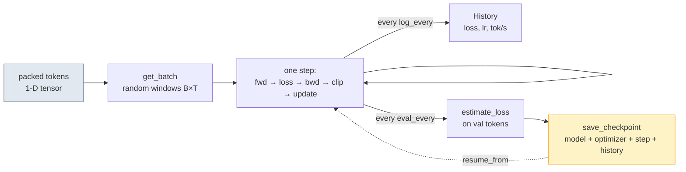
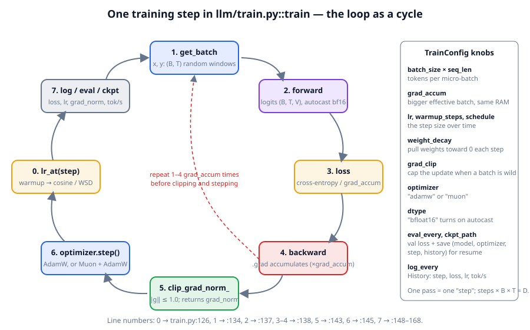
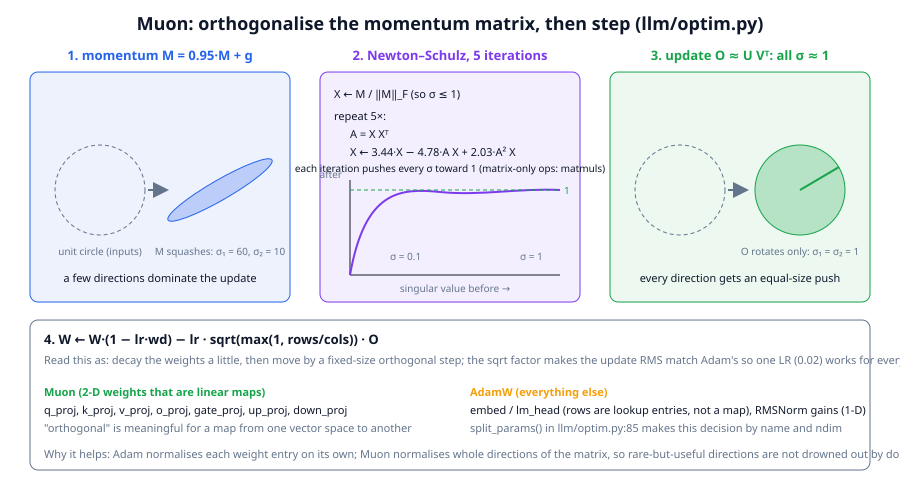

# Chapter 10: The pretraining loop

**Part II · ~3 hours · Prerequisites: Chapters 4, 6, 8, 9**
> 🎯 Goal: Pretrain TinyLM end-to-end and explain every line of the training loop.
> 🧪 Lab: `labs/lab10_pretrain.py` · 🎛️ Interactive: `interactive/10_training_dynamics.html`

## Why this matters

Everything before this chapter was preparation: a tokenizer, a model that outputs logits, a curated token stream, a budget. This chapter spends the budget. The **pretraining loop** is the program that repeatedly takes a batch of tokens, runs the model forward, measures how wrong its next-token predictions were, pushes the error back through the network to get a gradient, and moves every parameter a small step downhill — a few hundred thousand times for a frontier model, 700 times for TinyLM. `llm/train.py` is 171 lines and contains every mechanism a 2026 frontier run has: learning-rate warmup and decay, gradient accumulation, gradient clipping, decoupled weight decay, mixed precision, periodic validation, checkpointing and resuming, throughput logging, and a choice of two optimizers, AdamW and Muon.

Why read it line by line rather than call `train()` and move on? Because when a run goes wrong — and at scale runs go wrong weekly — the symptom is a number on a dashboard (the loss spiked, the gradient norm is climbing, tokens/second halved) and the fix is one of these lines. The lab trains the same model twice, once with AdamW and once with Muon, kills a run at step 100 and resumes it, and measures the throughput, so that you have seen each mechanism work before you need it.

## The idea in pictures 📐



Read the flow left to right: the packed stream from Chapter 8 is sliced into random windows, each window drives one step, and two side channels record what happened — a `History` of losses every few steps, and a validation loss plus a checkpoint every hundred. The dotted arrow is resuming: a checkpoint holds everything needed to continue as if the process had never stopped.



The cycle diagram is one step of `train()`, with the line numbers in `llm/train.py` at the bottom. Start at station 0, the learning rate for this step, and go clockwise: fetch a batch, run the model forward to logits, compute the cross-entropy loss, run backward to fill every parameter's `.grad`, clip the gradient's global norm, let the optimizer update the weights, log. The dashed red arrow inside the circle is **gradient accumulation**: stations 1–4 can repeat several times, adding gradients up, before one clip-and-step, which gives the effect of a larger batch without the memory for one. The panel on the right lists the knobs in `TrainConfig` that control each station.

### The loop, line by line

Open `llm/train.py` alongside this section.

**`TrainConfig` (lines 23–47).** A dataclass of every knob, with defaults that work for TinyLM: 600 steps, batches of 32 windows × 128 tokens, AdamW at a peak LR of 10<sup>−3</sup> (small models like large learning rates; a 70B model uses ~3 × 10<sup>−4</sup>), Muon at 0.02, weight decay 0.1, 50 warmup steps, cosine decay to 10% of peak (or WSD, with `decay_frac` = 0.2 setting how much of the run is the final decay), gradient clipping at 1.0, validation every 100 steps, logging every 25. The number of tokens the run will see is `steps × batch_size × seq_len × grad_accum` — that is *D* from Chapter 9.

**`get_batch` (49–56).** Batching by **random windows**: pick `batch_size` random start offsets into the packed stream, take `seq_len` tokens from each as the input `x`, and the same window shifted one token to the right as the target `y`. Every position in `x` is a training example: position *t* is trained to predict `y[t] = x[t+1]`. Because the stream is packed with EOS separators, a window may start mid-document and cross into the next one; the model learns to treat EOS as a reset. Real runs do the same thing with a shuffled, sharded stream and an *epoch* (one pass) rather than random windows, but the tensor shapes are identical: `x, y: (B, T)`.

**`estimate_loss` (59–73).** Validation loss on a *fixed* set of windows — the generator is re-seeded with the same seed every call, so two evaluations differ only because the model changed. It switches the model to `eval()` and back so that dropout (off in TinyLM anyway) behaves.

**`History` (76–86)** and **checkpoints (88–102).** A checkpoint holds the model weights, *every optimizer's state* (Adam's running moments, Muon's momentum buffers — without them a resumed run takes a visible hit), the step count, the training config and the history so far. `load_checkpoint` returns the step to continue from.

**`train` (105–171).** The setup: seed PyTorch (109), build the optimizer or the Muon+AdamW pair (112), and if `resume_from` points at a checkpoint, load it and jump `start_step` forward (116–119). The batch generator is seeded with `seed + start_step` (120), so a resumed run draws different batches than the uninterrupted one would have — good enough for training, but it means you cannot expect bit-identical curves after a resume. Then the loop:

- **Learning rate (127–128).** `lr_at` returns a multiplier in [0, 1] for this step, and `set_lr` applies it to every optimizer's base LR. **Warmup** — a linear ramp from 0 over the first `warmup_steps` — exists because Adam's running estimates of gradient scale are unreliable for the first few dozen steps, and a full-size step in a random direction can put the model somewhere it never recovers from. After warmup, **cosine decay** follows half a cosine wave down to `min_lr_ratio × peak` at the last step, and **WSD** (warmup–stable–decay) stays flat at peak until the last 20% of training (`decay_frac`), then decays linearly to zero. WSD is the 2025–2026 favourite for a practical reason: with cosine, the schedule is tied to the planned length, so you cannot extend a run or branch a "finished" model from the middle of it without retraining; with WSD, any checkpoint from the stable phase can be given its own short decay and becomes a finished model. The lab plots all three from `lr_at`.

- **Zero the gradients (131–132).** PyTorch *accumulates* into `.grad`, so it must be cleared before each step — except that accumulation is exactly what the next block wants.

- **Forward and backward with accumulation (134–141).** For each of `grad_accum` micro-batches: fetch, forward under `torch.autocast` (bf16 on hardware that supports it — off by default on CPU), divide the loss by `grad_accum` so the accumulated gradient is a *mean* over the whole effective batch, and call `backward()`. Loss is reported as the mean over micro-batches too. `tokens_seen` counts every token for the throughput number.

- **Clip (144).** `clip_grad_norm_` computes the global **L2 norm** of all gradients together (the square root of the sum of squares of every gradient entry, as if all of them were one long vector) and, if it exceeds `grad_clip` (1.0), scales every gradient down so the norm equals 1.0. It returns the *pre-clipping* norm, which is the single most useful health signal in the log: a slowly rising gradient norm precedes most loss spikes by hundreds of steps.

- **Step (145–146).** Each optimizer updates its parameters. For AdamW this is where **decoupled weight decay** happens: the parameter is first shrunk toward zero by `lr × weight_decay × w`, *then* the Adam update is added. The "decoupled" is the whole point (Loshchilov & Hutter 2019): the older way added `weight_decay × w` to the gradient, which Adam then rescaled by its per-parameter normaliser, so the effective decay varied wildly across parameters. `build_optimizer` (`optim.py:107–114`) applies decay only to matrices (`ndim ≥ 2`): decaying a norm gain or a bias toward zero has no regularising meaning.

- **Log (149–159).** Every `log_every` steps: loss, LR multiplier, gradient norm and tokens per second, both printed and appended to `History`.

- **Validate and checkpoint (162–169).** Every `eval_every` steps and at the end: estimate the validation loss, print its perplexity (*e*<sup>loss</sup>, "the effective number of equally likely next tokens"), and save a checkpoint tagged with `step + 1` — the number of *completed* steps, so that resuming continues at the right one.

### AdamW vs Muon

**Adam** keeps two running averages per parameter: the mean of recent gradients *m* (momentum) and the mean of recent *squared* gradients *v*, and updates each parameter by *m*/(√*v* + ε). Read this as: every single weight moves by roughly the same amount per step, whatever the size of its gradient — Adam normalises *per element*. AdamW is Adam with decoupled weight decay. It has been the default LLM optimizer since GPT-2, and it works; the question since 2024 is whether something reaches the same loss in fewer tokens.



**Muon** (Keller Jordan, 2024: MomentUm Orthogonalised by Newton–Schulz) normalises *per matrix* instead. Follow the figure left to right. A weight matrix's momentum-averaged gradient *M* is a linear map; picture what it does to the unit circle (panel 1): it squashes it into an ellipse whose axes are the matrix's **singular values** — the stretch factors along its principal directions. A gradient matrix typically has a few large singular values and many tiny ones, so an Adam or SGD step moves the weights mostly along a handful of dominant directions and barely at all along the rest. Muon replaces *M* by the nearest **orthogonal matrix** *O* = *UV*<sup>T</sup> (panel 3: every singular value set to 1, so the map only rotates), then steps along *O*. Read this as: push equally hard in *every* direction the gradient identified, not just the loud ones.

Computing *UV*<sup>T</sup> exactly needs an **SVD** (singular value decomposition: the factorisation *M* = *UΣV*<sup>T</sup> into two rotations and a diagonal of singular values), which is slow on GPUs. Panel 2 is the trick: the **Newton–Schulz iteration** repeatedly applies a fixed quintic polynomial *X* ← *aX* + *b*(*XX*<sup>T</sup>)*X* + *c*(*XX*<sup>T</sup>)<sup>2</sup>*X* with coefficients (3.4445, −4.7750, 2.0315) chosen so that every singular value in (0, 1] is pushed toward 1; five iterations of nothing but matrix multiplies get them within a factor of ~1.5 of 1, which is all an optimizer needs (`optim.py:21–38`). The step then scales by √(rows/cols) so that the update's RMS matches Adam's, letting one learning rate (0.02) serve every matrix shape, and applies decoupled weight decay (`optim.py:75–80`; the scaling is from Moonshot's "Muon is Scalable" recipe).

**Why matrices only.** "Orthogonal" is a property of a linear map from one vector space to another, which is what a `Linear` weight is. The embedding table is *not* a map — its rows are lookup entries, each one an independent vector — and orthogonalising it would force unrelated tokens' embeddings to stay mutually independent. RMSNorm gains and biases are 1-D. So `split_params` (`optim.py:85–101`) sends the 21 projection matrices of TinyLM-nano to Muon and the embedding (tied with the output head) plus the 7 norm gains to AdamW.

🆕 **Adoption in 2026.** Muon went from a speedrun trick (it set the modded-nanoGPT records through 2025) to the pretraining optimizer of Kimi K2 (1T parameters, 15.5T tokens, Moonshot 2025 — the "Muon is Scalable" paper, which reports roughly 2× the compute efficiency of AdamW at matched loss), GLM-4.5 through GLM-5, and DeepSeek-V4 (https://arxiv.org/abs/2606.19348). A July 2026 study, "SOAP, Muon, and Beyond: Pushing LLM Pretraining Scales" (https://arxiv.org/abs/2607.20548), reports that Muon matches or beats AdamW on a 30B/3B-active hybrid Mamba–attention MoE trained for 3T tokens and on a 72B/8B LatentMoE with multi-token prediction, with the largest gains on coding and commonsense tasks and gains that *grow with batch size* — consistent with Muon's better use of each batch. GLM-5 (744B) is reported to use a "Muon Split" that orthogonalises MLA up-projections per head rather than as one matrix. The 2× figure is the number people cite; treat it as "reported at these scales by these labs" rather than a law, and expect the lab's tiny comparison to show a smaller, noisier gap.

### Mixed precision

A 32-bit float (**fp32**) has 8 exponent bits (range) and 23 mantissa bits (precision). **bf16** keeps the 8 exponent bits and cuts the mantissa to 7: the same range as fp32, ~3 significant digits, half the memory and — on **tensor cores**, the GPU units built for low-precision matrix multiplies — 2–4× the matmul throughput. Since ~2021 every large run computes forward and backward in bf16 while keeping a **master copy** of the weights in fp32 for the optimizer update (small updates would otherwise round to zero); `torch.autocast` does the casting per operation and `train.py:136–137` turns it on with `dtype="bfloat16"`. On CPU the labs run fp32 because CPU bf16 matmuls are not faster.

🆕 **FP8 is the 2026 default at scale.** DeepSeek-V3 (Dec 2024) was the first published trillion-token run with FP8 matmuls (8 bits: the e4m3 format, 4 exponent and 3 mantissa bits, for activations and weights; e5m2, 5 and 2, for gradients, which need more range; with per-block scaling factors to recover the range that 8 bits lack), and by 2026 the major open-weight runs train the linear layers in FP8 with bf16 accumulation. **FP4** is the research frontier: NVIDIA's NVFP4 recipe (4-bit with per-16-element fp8 scales) is reported validated on multi-trillion-token runs up to ~120B parameters, MXFP4 pretraining on native FP4 hardware is studied in https://arxiv.org/abs/2605.09825 (Hadamard rotations of the activations are what keeps it stable), and gpt-oss (2025) shipped its weights in MXFP4. Each halving of precision roughly doubles matmul throughput and halves memory; each also needs a new stabilisation trick, which is what the papers are about.

### Loss spikes and what to do about them

A **loss spike** is a sudden jump in training loss — sometimes a few tenths of a nat (the unit of cross-entropy loss, Chapter 6) that recovers in a hundred steps, sometimes a divergence to ln *V* (the model has forgotten everything) that never recovers. Every large run sees them; the PaLM paper counted ~20 in one 540B run. Known causes: a learning rate that is too high for the current phase (most common; the spike often arrives right after warmup ends or when the batch composition shifts), attention logits growing without bound so the softmax saturates, fp16 overflow (a reason bf16 replaced it), and occasionally a single pathological batch. The remedies, roughly in the order people try them:

1. **Lower the peak LR or lengthen warmup** — costs a little final loss, fixes most spikes.
2. **Gradient clipping** (already in the loop) — bounds the damage of any one step.
3. **Skip the batch** — PaLM's recipe: restart from a checkpoint ~100 steps before the spike and skip the next 200–500 batches; the same data in a different order rarely re-spikes.
4. **z-loss** (PaLM) — add 10<sup>−4</sup> · (log *Z*)<sup>2</sup> to the loss, where *Z* is the softmax normaliser; it keeps the logits from drifting to huge values. Read this as: a tiny penalty for the output distribution being unnormalised.
5. **QK-norm** — RMSNorm the queries and keys before the dot product so attention logits stay bounded (standard in 2025–2026 architectures).
6. A smaller LR for embeddings, or a tighter initialisation, when the spike is traced to the embedding table.

### What to watch

The log line `step 250 | loss 2.3151 | lr×0.876 | grad_norm 0.61 | 8,200 tok/s` is a dashboard. **Loss** should fall fast, then slowly; compare train and val every eval. **Gradient norm** should settle to a roughly constant value after warmup; a steady climb is the early warning for a spike. **LR** should follow the schedule you intended (a wrong `steps` makes cosine decay at the wrong time). **Tokens per second** should be flat; a drop means a straggler (one device or process finishing late and holding the others up, Chapter 11), a data-loader stall, or thermal throttling. **MFU** = tok/s × FLOPs per token ÷ hardware peak is the number to report — the lab computes it against a placeholder CPU peak of 100 GFLOP/s and against the 990 TFLOP/s of an H100 in the discussion. Add to those, at scale: memory headroom, the fraction of time in communication (Chapter 11), and expert load balance (Chapter 12).

## The idea in code

Imports for every snippet:

```python
import torch
from llm.config import preset
from llm.model import TinyLM
from llm.optim import lr_at, newton_schulz_orthogonalize, split_params, build_optimizer
from llm.train import TrainConfig, train, get_batch, load_checkpoint
from llm.pipeline import get_tokenizer, get_tokens, run_path
```

**A batch.** Windows from the packed stream; the target is the input shifted by one:

```python
tok = get_tokenizer()
train_tokens, val_tokens = get_tokens(tok)              # (357931,), (18838,) int64
x, y = get_batch(train_tokens, batch_size=4, seq_len=8, generator=torch.Generator().manual_seed(0))
print(x.shape, y.shape, torch.equal(x[:, 1:], y[:, :-1]))   # torch.Size([4, 8]) torch.Size([4, 8]) True
```

**Schedules.** `lr_at` returns the multiplier for a step; warmup is linear from 0:

```python
for step in (0, 5, 9, 50, 90, 99):                     # 100-step run, 10 warmup steps
    print(step, round(lr_at(step, 100, 1.0, warmup_steps=10, kind="cosine"), 3),
          round(lr_at(step, 100, 1.0, warmup_steps=10, kind="wsd"), 3))
# 0 0.1 0.1 | 5 0.6 0.6 | 9 1.0 1.0 | 50 0.628 1.0 | 90 0.127 0.5 | 99 0.1 0.05
```

**Newton–Schulz drives singular values toward 1.** Five iterations of matmuls, no SVD:

```python
torch.manual_seed(0)
G = torch.randn(64, 32)
print(torch.linalg.svdvals(G)[[0, -1]])                   # tensor([13.3573,  2.7143])  largest, smallest
O = newton_schulz_orthogonalize(G, steps=5)
print(torch.linalg.svdvals(O)[[0, -1]])                   # tensor([1.0421, 0.6819])   all within ~1.5× of 1
```

**Which parameters get Muon.** Matrices that are linear maps; everything else to AdamW:

```python
torch.manual_seed(0)
model = TinyLM(preset("nano", vocab_size=tok.vocab_size))
muon_p, adam_p = split_params(model)
print(len(muon_p), sum(p.numel() for p in muon_p), len(adam_p), sum(p.numel() for p in adam_p))
# 21 294912 8 84288   -> 21 projection matrices to Muon; embedding + 7 RMSNorm gains to AdamW
print([type(o).__name__ for o in build_optimizer(model, "muon", lr=1e-3, muon_lr=0.02)])   # ['Muon', 'AdamW']
```

**Twenty steps, with a checkpoint.** The whole loop is one call; `ckpt_path` saves on every eval:

```python
cfg = TrainConfig(steps=20, batch_size=8, seq_len=32, optimizer="adamw", lr=2e-3, warmup_steps=5,
                  log_every=5, eval_every=10, ckpt_path=run_path("snip10_ckpt.pt"))
hist = train(model, train_tokens, val_tokens, cfg)
# step 0 | loss 6.8196 | lr×0.200 | grad_norm 1.81 | ...   step 19 | loss 4.9887 | lr×0.110 | grad_norm 1.01
print(hist.step, [round(l, 2) for l in hist.train_loss])   # [0, 5, 10, 15, 19] [6.82, 6.07, 5.43, 5.02, 4.99]
```

(The losses are deterministic for a given seed on CPU; a different PyTorch build can shift the third decimal.)

**Resume.** A fresh model plus `resume_from` continues at the saved step with the saved history:

```python
m2 = TinyLM(preset("nano", vocab_size=tok.vocab_size))   # random weights...
step, h = load_checkpoint(run_path("snip10_ckpt.pt"), m2)  # ...overwritten from the checkpoint
print(step, len(h.step))                                    # 20 5
cfg2 = TrainConfig(**{**cfg.to_dict(), "steps": 30})
h2 = train(m2, train_tokens, val_tokens, cfg2, resume_from=run_path("snip10_ckpt.pt"), verbose=False)
print(h2.step)                                              # [0, 5, 10, 15, 19, 20, 25, 29]
```

## Worked example 🧪

Run `python3 labs/lab10_pretrain.py` (quick: the nano model, 150 steps × 16 × 64 tokens per optimizer; 845 s wall-clock when last measured — AdamW 23 s, Muon 555 s, the rest the resume demo — on a shared 4-core VM whose load jumped from ~1 to ~20 partway through; expect two or three minutes on an idle laptop) and `--full` (the small model, 700 steps × 32 × 128, default 400 steps × 32 × 128 = 1.6M tokens per optimizer, or `--steps 700` for the same budget as `runs/base_small.pt`). Timings are with two CPU threads on a shared 4-core VM. The lab writes its models to `runs/lab10_adamw.pt` and `runs/lab10_muon.pt`; the shared `runs/base_small.pt` that later chapters use is untouched.

**Quick run** — the two training logs, side by side (every 25th step; the lab prints all of them):

```
[adamw] 295,584 non-embedding params, 2.72e+06 FLOPs/token
step     0 | loss 6.8026 | lr×0.067 | grad_norm 1.57
step    50 | loss 3.6542 | lr×0.859 | grad_norm 1.09      val loss 3.6366  (perplexity 38.0)
step   100 | loss 2.3516 | lr×0.372 | grad_norm 0.84      val loss 2.2492  (perplexity 9.5)
step   149 | loss 1.8920 | lr×0.100 | grad_norm 0.78      val loss 1.9163  (perplexity 6.8)

[muon]  295,584 non-embedding params, 2.72e+06 FLOPs/token
step     0 | loss 6.8026 | lr×0.067 | grad_norm 1.57
step    50 | loss 3.1136 | lr×0.859 | grad_norm 1.55      val loss 3.0868  (perplexity 21.9)
step   100 | loss 1.7247 | lr×0.372 | grad_norm 0.60      val loss 1.6422  (perplexity 5.2)
step   149 | loss 1.4116 | lr×0.100 | grad_norm 0.46      val loss 1.4305  (perplexity 4.2)

AdamW 1.9266  vs  Muon 1.4404   (difference +0.4862 nats, Muon lower)
```

**Full run** — the small model, 400 steps × 32 × 128 = 1,638,400 tokens per optimizer (21 min 38 s in total on the shared VM; the AdamW half ran under load ~14 and the Muon half on an idle machine, which is why their tokens/s differ so much — see point 3):

```
[adamw] 2,361,792 non-embedding params, 1.69e+07 FLOPs/token
step     0 | loss 6.7998 | lr×0.020 | grad_norm 4.50
step    66 | loss 1.4123 | lr×0.995 | grad_norm 0.66      val loss 1.0794  (perplexity 2.9)  <- at step 100
step   198 | loss 1.0427 | lr×0.658 | grad_norm 0.28      val loss 1.0277  (perplexity 2.8)  <- at step 200
step   264 | loss 1.0043 | lr×0.396 | grad_norm 0.25      val loss 1.0030  (perplexity 2.7)  <- at step 300
step   399 | loss 0.8562 | lr×0.100 | grad_norm 0.32      val loss 0.8623  (perplexity 2.4)
[adamw] final val loss 0.8591 (ppl 2.4) in 943.5s, 1,745 tok/s -> saved runs/lab10_adamw.pt

[muon]  2,361,792 non-embedding params, 1.69e+07 FLOPs/token
step     0 | loss 6.7998 | lr×0.020 | grad_norm 4.50
step    66 | loss 1.1601 | lr×0.995 | grad_norm 0.38      val loss 1.0573  (perplexity 2.9)  <- at step 100
step   198 | loss 1.0354 | lr×0.658 | grad_norm 0.37      val loss 1.0218  (perplexity 2.8)  <- at step 200
step   264 | loss 0.9848 | lr×0.396 | grad_norm 0.25      val loss 0.9731  (perplexity 2.6)  <- at step 300
step   399 | loss 0.8947 | lr×0.100 | grad_norm 0.30      val loss 0.8986  (perplexity 2.5)
[muon] final val loss 0.8956 (ppl 2.4) in 330.5s, 4,990 tok/s -> saved runs/lab10_muon.pt

AdamW 0.8591  vs  Muon 0.8956   (difference -0.0365 nats, AdamW lower)
  adamw     1,745 tok/s × 1.69e+07 FLOP/token =   29.6 GFLOP/s -> MFU ≈ 30% of an assumed 100 GFLOP/s peak
  muon      4,990 tok/s × 1.69e+07 FLOP/token =   84.6 GFLOP/s -> MFU ≈ 85% of an assumed 100 GFLOP/s peak

  [adamw] 'Mia had a' -> ' red cake. One windy day Mia took the cup to the hill. Mia went home and put the shell in a orange box. The end. ...'
  [adamw] 'What is 12 + 7?' -> '?\nAnswer: 64 + 87 = 160.'
```

**Checkpoint and resume** (both modes use the nano model for this part):

```
run 1: trained 100 steps, loss 6.803 -> 1.800; checkpoint saved at step 100
[train] resumed from runs/lab10_resume_ckpt.pt at step 100
step   100 | loss 1.8342 | lr×0.355 | grad_norm 0.76
step   149 | loss 1.4435 | lr×0.100 | grad_norm 0.84      val loss 1.4124  (perplexity 4.1)
run 2: resumed at step 100; first logged loss after resume 1.834 (before the checkpoint: 1.800; a fresh model would be at ~6.77)
✅ loss after resume continues from where it stopped
✅ loaded history matches the original run exactly
```

What to look at:

1. **Both runs start at 6.80 ≈ ln 871 = 6.77**, uniform guessing over the 871-token vocabulary (the random initial logits add a few hundredths), and the first 50 steps are the steep part of the hockey stick. The `lr×` column is the schedule: 0.067 at step 0 (warmup), 1.0 at step 15, cosine down to 0.1.
2. **Muon is ahead early, and the two runs disagree about the end.** In the quick run Muon leads at every checkpoint — 3.09 vs 3.64 at step 50, 1.44 vs 1.93 at the end — and its gradient norm settles lower (0.46 vs 0.78). In the full run Muon also leads at steps 100, 200 and 300 (1.057 vs 1.079, 1.022 vs 1.028, 0.973 vs 1.003) but AdamW finishes 0.037 nats *lower* (0.859 vs 0.896) after the final cosine decay. Both models are then within a few tenths of Storyland's floor (Chapter 9), where the data, not the optimizer, sets the loss, and neither learning rate was tuned. Read the pair of runs as "Muon learns faster per token early; the endgame on a saturated toy corpus is a coin flip" — consistent with the reported ~2× compute efficiency at scale, but no measurement of it. Exercise 3 (sweep `muon_lr`) is where you find out whether 0.02 with a decay to 0.002 is the right endgame for this model.
3. **The tokens/s columns are not an optimizer comparison.** The quick run shows AdamW at 7,451 tok/s and Muon at 281; the full run shows the reverse, 1,745 vs 4,990. Both are artefacts of a shared machine: in the quick run the load average rose from about 1 to about 20 as the Muon half started (its log shows throughput falling from 7,700 to 281 tok/s step by step), the AdamW half of the full run was measured with 10 other jobs competing, and the Muon half of the full run ran on an idle box. On a quiet laptop expect Muon to be modestly *slower* per step for this model: five Newton–Schulz iterations per matrix per step are five extra matmuls on 192 × 192 and 192 × 512 matrices, a noticeable fraction of a 2.4M-parameter model's compute. At 1B+ parameters the overhead is reported at ~1% of step time, and Moonshot distributes it across devices.
4. **MFU is only as good as the peak you divide by.** The idle-machine Muon run reaches 4,990 tok/s × 1.69 × 10<sup>7</sup> FLOP/token = 85 GFLOP/s, which against the lab's placeholder "100 GFLOP/s peak" prints as 85% MFU — a number no real training run achieves, which tells you the placeholder is too low for this CPU (two threads of AVX-512 fp32 can exceed 100 GFLOP/s). Replace `CPU_PEAK` with your own measured matmul peak (exercise 6 of Chapter 9) before believing the percentage. On an H100 the peak is known (990 TFLOP/s bf16) and 40–50% is a good large run; small matmuls, Python overhead and no tensor cores are why a laptop sits far lower on any honest denominator. "Tokens per second" is the number to watch on a laptop; MFU is the number to watch on a cluster.
5. **The resume is seamless because the optimizer state was saved.** The first loss after resuming (1.834) is within noise of the last loss before the checkpoint (1.800), the resumed history begins with the 11 log points loaded from the checkpoint, and the run finishes at 1.41 — the same place a 150-step run lands. Note the `lr×0.355` at step 100: run 1 was planned for 100 steps so its cosine had already decayed to 0.1, while run 2 is planned for 150 and *raises* the LR on resume. A schedule tied to the planned length is exactly what WSD avoids.
6. **The generated text** has Storyland's grammar and vocabulary and none of its logic. The quick model (perplexity 4) writes `' red hat. One windy day One windy day Ava took the until the orange drum to the village.'`; the full model (perplexity 2.4) writes `' red cake. One windy day Mia took the cup to the hill. Mia went home and put the shell in a orange box. The end.'` — every sentence is a valid template, the objects are wrong, and `'What is 12 + 7?'` still gets `'Answer: 64 + 87 = 160.'` (an equation that is at least internally consistent, unlike the quick model's `'40 = 87.'`). Low perplexity on this corpus means "fluent", not "correct" — Chapters 15–19 are about the difference.

The two figures the lab saves to `figures/generated/` — `lab10_lr_schedules.png` (cosine, WSD and constant from `lr_at`) and `lab10_adamw_vs_muon.png` (train and val curves for both) — are worth opening side by side with the log.


🎛️ In `interactive/10_training_dynamics.html`, a real (tiny) network — a 289-parameter MLP on a 2-D classification task, trained with the exact `lr_at` schedules from `llm/optim.py` — shows loss, learning rate and gradient norm side by side. Press the **Loss spike** preset (SGD, peak LR 1.5, no warmup) and watch the loss shoot up and stay stuck; then press each fix — `+ warmup 100`, `+ clip at 1.0`, `lower LR 3×` — with "keep previous run as ghost" ticked and compare the curves. Switch the schedule between cosine, WSD and constant and note where the final drop in loss happens. The Challenge is to find, without touching the peak LR, clipping or batch size, a warmup length that removes the spike and reaches a full-data loss below 0.01 by step 600, and then to check whether the same warmup holds for seeds 2 and 3. The shapes transfer to LLM training; the numbers do not (z-loss and batch-skipping are not in the page).

## Try it yourself ✍️

1. **Provoke a spike.** Train the nano model with `lr=3e-2` (30× the default) and `warmup_steps=0`. Plot loss and gradient norm. Then fix it with warmup alone, then with clipping at 0.5 alone. Which is more effective here?
2. **Gradient accumulation.** Run `batch_size=8, grad_accum=4` and `batch_size=32, grad_accum=1` with the same seed. Are the loss curves identical? (They should be close but not bit-identical — explain why from `get_batch`.)
3. **Muon's learning rate.** Sweep `muon_lr` in {0.005, 0.01, 0.02, 0.04, 0.08}. Muon is known to tolerate a wide range; where does it break?
4. **Give Muon the embedding.** Modify `split_params` in a copy so the embedding goes to Muon. What happens to the loss? This is why the exclusion exists.
5. **WSD in practice.** Train 300 steps with `schedule="wsd"` and a checkpoint at step 200 (`eval_every=100`). Then resume from that checkpoint with `steps=250, schedule="wsd"` — a 50-step decay branch. Compare its final loss with the 300-step run's. That is how 2025–2026 labs produce intermediate models.
6. **Autocast on CPU.** Set `dtype="bfloat16"` and compare tokens/second and final loss. On most CPUs it is slower; on Apple silicon or a recent Xeon it may not be.

## Check yourself ✅

<details><summary>1. Why divide the loss by grad_accum before calling backward()?</summary>

Because `.grad` accumulates a *sum* over the micro-batches. Dividing each micro-batch's loss by `grad_accum` makes the accumulated gradient the *mean* over the whole effective batch, which is what a single big batch would have produced, so the learning rate keeps its meaning.
</details>

<details><summary>2. A checkpoint saves the optimizer state. What goes wrong if you resume with only the weights?</summary>

AdamW's running moments *m* and *v* restart at zero, so the first steps after resuming behave like step 0 without warmup: the normaliser √*v* is tiny and the updates are far too large, giving a visible loss bump. Muon's momentum buffer resets similarly. Saving the state makes the resumed run continue smoothly (the lab checks this).
</details>

<details><summary>3. In one sentence each: what does Adam normalise, and what does Muon normalise?</summary>

Adam normalises each *element* of the update so every weight moves by about the same amount. Muon normalises each *matrix* of the update so every singular direction moves by the same amount — the update is orthogonal.
</details>

<details><summary>4. Why is WSD preferred over cosine for a run whose length might change?</summary>

Cosine's shape depends on the planned total steps, so extending the run or taking a model from the middle means the LR was decayed at the wrong time. WSD holds the LR constant until the end, so any stable-phase checkpoint can be given its own short decay to produce a finished model, and the run can be extended for free.
</details>

<details><summary>5. Your gradient norm has been rising slowly for 500 steps and the loss is fine. What do you do?</summary>

Treat it as an early warning of a spike. Check that the LR schedule is what you intended, consider lowering the peak LR or adding z-loss/QK-norm, and make sure checkpoints are frequent enough to roll back cheaply. Clipping is already bounding each step; the rising norm says the model's logits or activations are growing.
</details>

## Key takeaways

- One step = LR for this step → batch → forward → loss → backward (× accumulation) → clip → optimizer step → log; `train.py` does this in ~50 lines.
- Warmup protects the first steps; cosine and WSD decay the end. WSD lets you branch a finished model from any stable-phase checkpoint.
- AdamW decouples weight decay from the gradient and decays only matrices. Muon orthogonalises each matrix's momentum with five Newton–Schulz iterations and steps equally in every direction; embeddings and norms stay with AdamW.
- 🆕 Muon is the pretraining optimizer of Kimi K2, GLM-5 and DeepSeek-V4, with ~2× compute efficiency reported; FP8 is the default precision at scale and FP4 is being validated.
- Loss spikes come from LR, unbounded logits and bad batches; remedies are warmup, clipping, skipping, z-loss and QK-norm.
- Watch loss, gradient norm, LR, tokens/second and MFU. A checkpoint must include the optimizer state.

## Going deeper

- Loshchilov & Hutter, "Decoupled Weight Decay Regularization" (AdamW), 2019. https://arxiv.org/abs/1711.05101
- Chowdhery et al., "PaLM: Scaling Language Modeling with Pathways" (§5.1: loss spikes, the skip-batches recipe, z-loss), 2022. https://arxiv.org/abs/2204.02311
- Jordan et al., "Muon: An optimizer for hidden layers in neural networks", 2024. https://kellerjordan.github.io/posts/muon/
- Hägele et al., "Scaling Laws and Compute-Optimal Training Beyond Fixed Training Durations" (WSD schedules), 2024. https://arxiv.org/abs/2405.18392
- DeepSeek-AI, "DeepSeek-V3 Technical Report" (§3.3: FP8 training at scale), Dec 2024. https://arxiv.org/abs/2412.19437
- 🆕 Liu et al., "Muon is Scalable for LLM Training" (Moonshot; the RMS-matching scale, weight decay, Kimi results), 2025. https://arxiv.org/abs/2502.16982
- 🆕 "SOAP, Muon, and Beyond: Pushing LLM Pretraining Scales", July 2026. https://arxiv.org/abs/2607.20548
- 🆕 "MXFP4 pretraining on native FP4 hardware" (Hadamard rotations for stability), May 2026. https://arxiv.org/abs/2605.09825
- 🆕 PyTorch blog, "Using the Muon optimizer with DeepSpeed", 2026. https://pytorch.org/blog/using-muon-optimizer-with-deepspeed/
- Keller Jordan et al., modded-nanoGPT — the GPT-2 speedrun where Muon was born; 🆕 records through 2026 (a ~1.35-minute run on 8×H100 reported by April 2026, using Muon, FlashAttention-3, an FP8 head and MTP). https://github.com/KellerJordan/modded-nanogpt

← [Chapter 9](09-scaling-laws.md) · [Course home](../README.md) · [Chapter 11](11-distributed-training.md) →
