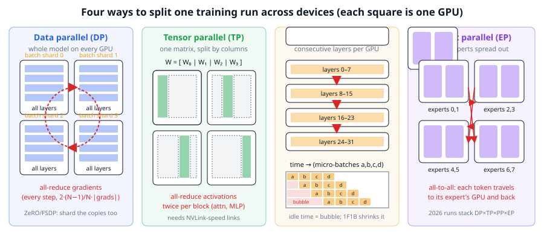
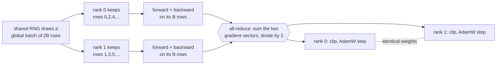

# Chapter 11: Distributed training

**Part II · ~2.5 hours · Prerequisites: Chapters 6, 9, 10**

> 🎯 Goal: Explain data, tensor, pipeline, expert and sequence parallelism and when each is used.
> 🧪 Lab: `labs/lab11_data_parallel.py` · 🎛️ Interactive: `interactive/11_parallelism_visualizer.html`

## Why this matters

In Chapter 10 you trained TinyLM on one CPU. A frontier model in 2026 is trained on tens of thousands of GPUs at once, and the reason is not ambition but arithmetic. Take a 70-billion-parameter model. Its weights alone, stored in the 2-byte `bfloat16` format, are 140 GB, and an NVIDIA H100 has 80 GB of memory. Training needs more than the weights: gradients, plus the optimizer's running averages, add up to about **16 bytes per parameter**, or 1,120 GB for 70B, so the model does not fit on one device even before the first token is processed. Compute is the second wall: training 70B parameters on 15 trillion tokens costs roughly 6·N·D ≈ 6.3 × 10²⁴ floating-point operations (Chapter 9), which one H100 doing 4 × 10¹⁴ useful operations per second would finish in about 500 years. Distributed training is the set of techniques for cutting a model and its data into pieces that fit and finish. This chapter gives you the five cuts, the cost of each, and a lab in which you run real data-parallel training on two CPU processes and prove numerically that it computes the same thing as one process.

## The idea in pictures 📐

There is one model, one batch of data, and N devices. Every parallelism strategy answers the same question: *which dimension do we slice?* You can slice the **batch** (each device sees different rows), the **weight matrices** (each device holds a slice of every layer), the **layers** (each device holds a contiguous run of blocks), the **experts** of a mixture-of-experts model (Chapter 12), or the **sequence** (each device holds a stretch of a very long context). The figure shows the first four side by side.



Read the figure left to right. In the **data parallel** panel each of the four squares holds *all* the layers (the four blue bars), and the only thing that differs is the data shard each square trains on; the red dashed ring is the gradient traffic that keeps the four copies identical. In the **tensor parallel** panel the same weight matrix W is cut into four column slices, one per device, so no device has the whole matrix and partial results must be combined by communication twice per block. In the **pipeline parallel** panel each device owns eight consecutive layers, and activations flow downward; the small timeline underneath shows the price: while device 3 is working on micro-batch *a*, devices 0–2 have already finished it and sit idle in the red **bubble** unless more micro-batches are queued. In the **expert parallel** panel the eight experts of a mixture-of-experts layer are spread two per device, and every token must travel to the device holding its expert and back, the red all-to-all arrows.

One data-parallel step, the one you will run in the lab, is a short loop:



Both ranks end each step with the same weights because they started identical, received the same averaged gradient, and ran the same deterministic optimizer update. That is the whole trick, and everything else in this chapter is about what to do when the model, not just the batch, is too big.

## The idea in code

Snippets in this chapter use these imports:

```python
import torch, torch.distributed as dist
from llm.config import preset
from llm.model import TinyLM
from llm.train import get_batch
from llm.pipeline import get_tokenizer, get_tokens
```

### Memory: why 16 bytes per parameter

**Mixed-precision training** keeps a `bfloat16` working copy of the weights for fast matrix multiplies, but updates a `float32` **master copy** so that small updates are not rounded away. AdamW (Chapter 4) also stores two running averages per parameter, both in `float32`. Count the bytes:

```python
def bytes_per_param(optimizer="adamw", mixed_precision=True):
    weights = 2 if mixed_precision else 4      # bf16 working copy of the weights
    grads   = 2 if mixed_precision else 4      # bf16 gradients
    master  = 4 if mixed_precision else 0      # fp32 master weights
    states  = 8 if optimizer == "adamw" else 4 # Adam: m and v in fp32; Muon: one momentum buffer
    return weights + grads + master + states   # = 16 for AdamW in mixed precision

for N, name in [(2.5e6, "TinyLM small"), (7e9, "7B"), (70e9, "70B"), (1.6e12, "1.6T")]:
    print(f"{name:>13}: {N * bytes_per_param() / 1e9:10.2f} GB")
# TinyLM small:       0.04 GB      7B:   112 GB      70B:  1120 GB      1.6T: 25600 GB
```

Read this as: every parameter costs sixteen bytes while it is being trained, so a 7B model already needs more than one 80 GB GPU for its *state* alone, before a single activation is stored. Activations (the intermediate tensors kept for backpropagation) come on top and scale with batch size × sequence length × width × depth; **activation checkpointing** (recomputing them during the backward pass instead of storing them) trades about 30% extra compute for a large memory saving and is on by default in large runs.

### Data parallel: the same model everywhere, different rows

**Data parallelism (DP)** gives every device a full copy of the model and a different slice of each batch. After the backward pass, every device holds a gradient computed on its slice; the devices average those gradients so that every copy takes the same step. The averaging is an **all-reduce**: a collective operation in which every participant ends up with the sum (or mean) of everyone's tensor.

The loop below is the one the lab runs. The two lines that make it *exactly* equivalent to single-process training are the shared generator and the `rank::world` row slicing:

```python
def train_shard(model, tokens, rank, world, steps, b_local, seq_len, seed, lr, allreduce_fn=None):
    opt = torch.optim.AdamW(model.parameters(), lr=lr, betas=(0.9, 0.95), weight_decay=0.0)
    g = torch.Generator().manual_seed(seed)            # the SAME generator on every rank
    params = list(model.parameters())
    for step in range(steps):
        x, y = get_batch(tokens, b_local * world, seq_len, g)   # everyone draws the same global batch
        x, y = x[rank::world], y[rank::world]                   # (b_local, T): this rank's rows
        _, loss = model(x, y)                                   # loss = mean over this rank's rows
        opt.zero_grad(set_to_none=True)
        loss.backward()
        if allreduce_fn is not None:
            flat = torch.cat([p.grad.reshape(-1) for p in params])   # (n_params,) one big message
            allreduce_fn(flat)                                  # sum over workers, in place
            flat.div_(world)                                    # sum / world = mean over the global batch
            offset = 0
            for p in params:                                    # scatter the averaged grads back
                p.grad.copy_(flat[offset:offset + p.numel()].view_as(p.grad)); offset += p.numel()
        torch.nn.utils.clip_grad_norm_(params, 1.0)
        opt.step()
```

Why is the mean of the two ranks' gradients the full-batch gradient? Each rank's loss is a mean over its `b_local` rows, and the full-batch loss is the mean over all `2·b_local` rows. Because both shards have the same size, the mean of the two shard-means equals the overall mean, and gradients are linear, so the same holds for gradients:

$$\nabla L_{\text{full}} = \frac{1}{2}\left(\nabla L_{\text{rank 0}} + \nabla L_{\text{rank 1}}\right)$$

Read this as: the gradient of the loss on the whole batch is the plain average of the gradients each worker computed on its half. If shards had different sizes you would need a weighted average; frameworks avoid this by making shards equal.

In a real process group the `allreduce_fn` is one line, `dist.all_reduce(t, op=dist.ReduceOp.SUM)`, after `dist.init_process_group("gloo", ...)` on CPU or `"nccl"` on GPUs. PyTorch's `DistributedDataParallel` wraps a model and does exactly this loop for you, with two refinements you should know by name: **gradient bucketing** (grads are grouped into ~25 MB buckets so each all-reduce is one large message rather than hundreds of tiny ones, as our `flat` tensor does) and **overlap** (the all-reduce of early buckets starts while the backward pass is still computing later layers, hiding communication behind compute).

### How much traffic? The ring all-reduce

A naive all-reduce sends every gradient vector to one device, which sums and broadcasts; that device's link becomes the bottleneck. The **ring all-reduce** arranges N devices in a ring and does two passes. In the *reduce-scatter* pass each device sends 1/N of its vector to its neighbour N−1 times, so that at the end each device owns the fully summed version of one N-th of the vector. In the *all-gather* pass those summed chunks go around the ring once more so everyone has all of them. Per device, the traffic is:

$$\text{bytes sent per device} = 2\,\frac{N-1}{N}\,S$$

Read this as: each device sends and receives just under twice the size S of the gradient vector, *no matter how many devices there are*. That N-independence is why data parallelism scales to thousands of GPUs. For a 70B model with 2-byte gradients, S = 140 GB, so every device moves about 245 GB per step on an 8-way ring; at NVLink speeds (hundreds of GB/s) that is under a second, which is why the all-reduce must be overlapped with the backward pass to be affordable.

### ZeRO and FSDP: stop replicating the state

Plain DP wastes memory: all N copies of the 16 bytes/parameter are identical. **ZeRO** (Zero Redundancy Optimizer, Rajbhandari et al. 2020) shards the state across the DP group in three stages, and PyTorch's **FSDP** (Fully Sharded Data Parallel) implements stage 3. The lab's `zero_memory_gb` function encodes the accounting:

```python
def zero_memory_gb(n_params, world, stage):
    per = {0: 16.0,                    # everything replicated (plain DDP)
           1: 4.0 + 12.0 / world,      # ZeRO-1: fp32 master + Adam m, v sharded
           2: 2.0 + 14.0 / world,      # ZeRO-2: gradients sharded too
           3: 16.0 / world}[stage]     # ZeRO-3 / FSDP: weights sharded as well
    return n_params * per / 1e9
```

For a 70B model on 64 GPUs: ZeRO-0 needs 1,120 GB per GPU (impossible), ZeRO-1 needs 293 GB (still impossible), ZeRO-2 needs 155 GB, and ZeRO-3 needs 17.5 GB, which fits with room for activations. The price of stage 3 is that every layer's weights must be **all-gathered** (collected from all shards) just before they are used in the forward and backward pass, then freed, so communication volume rises to roughly 3× the plain DP amount. In 2026 this is the workhorse for models up to a few tens of billions of parameters on a single node; beyond that it is combined with the strategies below.

### Tensor parallel: cut the matrix

**Tensor parallelism (TP)** splits individual weight matrices across devices. The SwiGLU MLP in TinyLM computes `down(silu(gate(x)) * up(x))`. Cut `gate` and `up` by *columns* and `down` by *rows*, and each device can do its share without talking to the others until the very end:

```python
torch.manual_seed(0)
x = torch.randn(4, 8)                        # (tokens, d)
W_up = torch.randn(8, 16); W_down = torch.randn(16, 8)   # (d, d_ff), (d_ff, d)
y_ref = torch.relu(x @ W_up) @ W_down        # what ONE device would compute

h0 = torch.relu(x @ W_up[:, :8])             # device 0: its 8 columns of W_up -> (tokens, 8)
h1 = torch.relu(x @ W_up[:, 8:])             # device 1: the other 8 columns, no communication
partial0 = h0 @ W_down[:8]                   # device 0: its 8 rows of W_down -> (tokens, d), incomplete
partial1 = h1 @ W_down[8:]
y_tp = partial0 + partial1                   # <- this add IS the all-reduce
print(torch.allclose(y_ref, y_tp, atol=1e-5))   # True
```

Read the last line as: a column-split matmul followed by a row-split matmul produces *partial sums* that are complete only after one all-reduce. Attention is split the same way, one group of heads per device, and the output projection is row-split, so a Transformer block needs two all-reduces in the forward pass and two in the backward pass. Each of those carries activations of size batch × sequence × `d_model`, and they cannot be overlapped with much, which is why TP is used only *within* a node over NVLink-class links, typically 2- to 8-way. Megatron-LM (Shoeybi et al. 2019) is the reference implementation. **Sequence parallelism** in the Megatron sense splits the norm and dropout, which TP leaves replicated, along the sequence axis to save activation memory.

### Pipeline parallel: cut the layers, then fight the bubble

**Pipeline parallelism (PP)** assigns consecutive layers to consecutive devices; only the activations at stage boundaries cross the wire, which is tiny compared with TP, so PP works across nodes over slower links. Its problem is the **pipeline bubble**: with one batch, stage k cannot start until stage k−1 finishes, so at any moment only one device is busy. The fix is to split the batch into m **micro-batches** and stream them through:

```python
def bubble_fraction(p_stages, m_microbatches):
    return (p_stages - 1) / (m_microbatches + p_stages - 1)

for m in [1, 4, 32, 128]:
    print(f"8 stages, {m:3d} micro-batches: {100*bubble_fraction(8, m):5.1f}% idle")
#  1 -> 87.5%    4 -> 63.6%    32 -> 17.9%    128 -> 5.2%
```

Read this as: the fraction of time the pipeline sits idle is (p−1)/(m+p−1), so you need many more micro-batches than stages to keep devices busy. The **1F1B** schedule (one forward, one backward, alternating; Narayanan et al. 2021) keeps the same bubble but caps the number of micro-batches whose activations must be held at p instead of m, which is what makes large m affordable. 2025–26 runs go further with **interleaved** stages (each device holds several non-contiguous chunks of layers) and DeepSeek-V3's **DualPipe**, which overlaps forward and backward of different micro-batches to hide expert-parallel communication inside the bubble.

### Expert parallel and context parallel

**Expert parallelism (EP)** is specific to mixture-of-experts models (Chapter 12): the experts of each MoE layer are spread across devices, and each token is shipped to the device holding its chosen expert by an **all-to-all** (every device sends a different chunk to every other device), then shipped back. Unlike DP's all-reduce, all-to-all traffic depends on the router's decisions, so an unbalanced router does not just hurt quality; it makes some devices wait for others. DeepSeek-V3 (2024) trained with 64-way EP across 8 nodes and limited each token to at most 4 nodes to bound this traffic.

**Context parallelism (CP)**, also called sequence parallelism in the long-context sense, splits one very long sequence across devices. Attention needs every query to see every earlier key, so the devices pass their key/value blocks around a ring while each computes its share of the attention scores (**Ring Attention**, Liu et al. 2023). It is the strategy that makes the 128k–1M-token context lengths of 2026 models trainable, and it is used only for the long-context phase (Chapter 13) because it adds communication proportional to the sequence length.

### Putting it together: 4-D parallelism, MFU, and the failure clock

A 2026 trillion-parameter run uses several of these at once, arranged as a grid: DP × TP × PP × EP, with CP added for long-context stages. The public DeepSeek-V3 recipe (671B, 2024) was 16-way pipeline, 64-way expert, and ZeRO-1 data parallelism with *no* tensor parallelism, an unusual choice made possible by their custom overlap schedule. 🆕 DeepSeek-V4 (reported ~1.6T parameters, tech report arXiv 2606.19348) and Kimi K3 (reported ~2.8T total / 104B active, July 2026) keep the same DeepSeekMoE + expert-parallel shape at larger scale; the public details are aggregator reports, so treat the exact degrees as approximate ([lmsys blog](https://www.lmsys.org/blog/2026-04-25-deepseek-v4/), [wavect](https://wavect.io/blog/open-weight-llm-comparison-2026/)). What is settled is the *shape* of the decision: TP inside a node, PP and EP across nodes, DP/ZeRO over the remaining replicas, CP only when sequences are long.

The scorecard for a configuration is **model FLOPs utilisation (MFU)**: the fraction of the hardware's peak arithmetic rate that goes into the model's own 6·N·D operations.

$$\text{MFU} = \frac{6\,N \cdot \text{tokens/s}}{\text{peak FLOP/s}}$$

Read this as: multiply the tokens you process per second by the six-times-parameters cost of each token, and divide by what the chips could do if they never waited. Llama 3's authors reported 380–430 TFLOP/s per H100 for the 405B run, about 38–43% of the 989 TFLOP/s dense bf16 peak; 40–50% is a good number at scale, and everything lost is communication, pipeline bubbles, memory-bound operations, and stragglers. **Communication versus compute** is the ratio that decides MFU: per step, compute grows with batch × parameters, while all-reduce traffic grows only with parameters, so larger batches per device hide communication better, which is one reason large runs use batches of millions of tokens.

Finally, **fault tolerance**. With 16,000 GPUs a hardware failure somewhere is a matter of hours; Llama 3's team reported 466 job interruptions over a 54-day run. The defences are routine: **checkpoints** written every few minutes to fast storage, written asynchronously so training does not pause; elastic launchers that restart on the surviving devices; and the WSD learning-rate schedule from Chapter 10, whose stable phase means a restart from a checkpoint loses nothing but the minutes since it was written.

## Worked example 🧪

Run `python3 labs/lab11_data_parallel.py` (quick, two processes, 8 steps) and then `--full` (40 steps). The lab launches two Python processes with `torch.multiprocessing`, connects them with a `gloo` process group (the CPU backend) through a file-based rendezvous, and trains a nano TinyLM in each using the `train_shard` loop above. It then trains the same model in one process on the whole batch and compares.

**Quick mode (measured on a shared 4-core machine at load ≈ 20 with `OMP_NUM_THREADS=2`; a quiet laptop is several times faster):**

```text
model: nano TinyLM, 379,200 params -> 1.52 MB of float32 gradients
world=2 workers, 8 steps, global batch 16 x 64 tokens (8 rows per worker)

--- 1. 2 processes, gradients averaged with all-reduce (gloo backend) ---
   platform Linux, torch 2.14.0+cu130, gloo available: True
   rank 0: first loss 6.8016 -> last loss 5.8780 | train wall 25.7s | time inside all-reduce 3.09s
   rank 1: first loss 6.8036 -> last loss 5.8996 | train wall 25.7s | time inside all-reduce 1.11s
   whole launch incl. process start-up: 61.6s  (torch.distributed)
   (time inside all-reduce includes WAITING for the other rank: the slower rank shows less,
    the faster rank shows more. That waiting is the straggler cost of synchronous training.)
✅ both workers hold identical weights after training (max |diff| = 0.00e+00)

--- 2. reference: ONE process, the whole global batch every step ---
   first loss 6.8026 -> last loss 5.8888 | wall 64.7s
   step | rank0 loss | rank1 loss | mean(ranks) | single-process
      0 |     6.8016 |     6.8036 |      6.8026 |         6.8026
      2 |     6.4307 |     6.3708 |      6.4008 |         6.4008
      4 |     6.2120 |     6.2073 |      6.2097 |         6.2097
      6 |     6.0172 |     6.0139 |      6.0155 |         6.0155
✅ mean of the ranks' losses == single-process loss at every step (max gap 7.2e-07)
   max |w_dp - w_single| = 1.53e-05

--- 3. control: rank 0 alone on its half of the data, NO all-reduce ---
   max |w_solo - w_single| = 1.51e-02  (this is how different a *different* run looks)
✅ data-parallel weights match the single-process weights (1.5e-05 < 1e-4)
✅ ...and are >100x closer than the no-all-reduce control (1.5e-02)
```

Three numbers to look at. First, the two ranks end with **bit-identical** weights (`max |diff| = 0.00e+00`): they never exchanged weights, only gradients, and identical deterministic updates keep them in lock-step. Second, the mean of the two ranks' losses equals the single-process loss at every step to 7 × 10⁻⁷, the equal-shard argument from the code section made concrete. Third, the data-parallel weights are within 1.5 × 10⁻⁵ of the single-process weights, while the control run (rank 0 alone on half the data, no all-reduce) is 1.5 × 10⁻² away, a thousand times further. The residual 10⁻⁵ is floating-point reordering: summing two half-batch gradients and dividing is not bit-identical to averaging over sixteen rows at once, and AdamW's normalisation amplifies tiny differences slightly. Note also the asymmetric all-reduce times (3.09 s on rank 0, 1.11 s on rank 1): a collective cannot finish until the slowest participant arrives, so the faster rank spends its time waiting, the **straggler** cost of synchronous training.

```text
--- 4. what went over the wire ---
   gradient vector: 379,200 floats = 1.52 MB
   ring all-reduce sends+receives 2(N-1)/N x that per device per step = 1.52 MB (N=2)
   over 8 steps: 12.1 MB per device
                           7B:       14 GB of bf16 gradients per step ->     24 GB per device on an 8-GPU ring
                          70B:      140 GB of bf16 gradients per step ->    245 GB per device on an 8-GPU ring
     1.6T (DeepSeek-V4-class):     3200 GB of bf16 gradients per step ->   5600 GB per device on an 8-GPU ring
   this run: 12.0% of worker wall-clock was spent inside all-reduce
   speed: single-process 64.7s (127 tok/s) vs data-parallel 25.7s (319 tok/s) -> 2.52x with 2 workers
   (on a quiet machine expect between 1x and 2x: the two workers share the same cores and memory bus;
    on a busy machine this number is noise)

--- 5. memory per GPU for a 70B model under AdamW mixed precision (weights+grads+optimizer only) ---
    GPUs |  ZeRO-0 (DDP) |    ZeRO-1 |    ZeRO-2 |  ZeRO-3/FSDP
       1 |        1120 GB |   1120 GB |   1120 GB |    1120.0 GB
       8 |        1120 GB |    385 GB |    262 GB |     140.0 GB
      64 |        1120 GB |    293 GB |    155 GB |      17.5 GB
     512 |        1120 GB |    282 GB |    142 GB |       2.2 GB
   (an H100 has 80 GB; activations come on top of these numbers)
✅ 16 bytes/param: 70B params need 1120 GB without sharding
```

The gradient vector is 1.52 MB, and with N = 2 the ring formula gives exactly that per device per step. Scale the same arithmetic to a 70B model and each device moves 245 GB per step; at 1.6T parameters it is 5.6 TB, which is why ZeRO-3 sharding, overlapped communication and multi-hundred-GB/s links are not optional. The speed-up line is printed for honesty rather than as evidence: on a busy shared machine it is noise (2.5× from two workers is not possible in a clean measurement; the single-process reference happened to run during a busier moment).

**Full mode (`--full`: 40 steps, global batch 32 × 128; 1,323 s on the same loaded machine):**

```text
world=2 workers, 40 steps, global batch 32 x 128 tokens (16 rows per worker)

--- 1. 2 processes, gradients averaged with all-reduce (gloo backend) ---
   platform Linux, torch 2.14.0+cu130, gloo available: True
   rank 0: first loss 6.8050 -> last loss 3.4737 | train wall 77.9s | time inside all-reduce 6.41s
   rank 1: first loss 6.8085 -> last loss 3.4708 | train wall 77.9s | time inside all-reduce 8.75s
   whole launch incl. process start-up: 113.1s  (torch.distributed)
✅ both workers hold identical weights after training (max |diff| = 0.00e+00)

--- 2. reference: ONE process, the whole global batch every step ---
   first loss 6.8067 -> last loss 3.4723 | wall 606.7s
   step | rank0 loss | rank1 loss | mean(ranks) | single-process
      0 |     6.8050 |     6.8085 |      6.8067 |         6.8067
     10 |     5.6779 |     5.6414 |      5.6596 |         5.6596
     20 |     4.7141 |     4.7175 |      4.7158 |         4.7158
     30 |     4.0496 |     4.0251 |      4.0374 |         4.0374
✅ mean of the ranks' losses == single-process loss at every step (max gap 9.5e-07)
   max |w_dp - w_single| = 9.15e-06

--- 3. control: rank 0 alone on its half of the data, NO all-reduce ---
   max |w_solo - w_single| = 7.41e-02  (this is how different a *different* run looks)
✅ data-parallel weights match the single-process weights (9.1e-06 < 1e-4)
✅ ...and are >100x closer than the no-all-reduce control (7.4e-02)
```

Five times as many steps and eight times as many tokens per step change nothing about the agreement: the ranks' loss means match the single process to 10⁻⁶ at every logged step, the weights agree to 9 × 10⁻⁶, and the control run has drifted to 7 × 10⁻² (further than in quick mode, because forty diverging steps compound). The loss itself falls from 6.81 to 3.47 in 40 steps at a global batch of 4,096 tokens. With 8.2% of worker wall-clock inside all-reduce for a 1.5 MB gradient over local sockets, this toy already shows the shape of the real problem: at 140 GB of gradients per step, that fraction would be catastrophic without overlap, which is why DDP starts reducing early buckets while the backward pass is still running.

## Try it yourself ✍️

1. **Break the equivalence.** In `train_shard`, change `x[rank::world]` to `x[:b_local]` for both ranks so they train on the *same* rows. Predict what happens to `max |w_dp − w_single|` before you run it, then explain the number you get.
2. **Unequal shards.** Give rank 0 twelve rows and rank 1 four rows (draw 16, split 12/4). Which weighting of the two gradients recovers the full-batch gradient? Implement it and confirm the parameter difference returns to ~1e-6.
3. **Per-tensor all-reduce.** Replace the single flat all-reduce with one `dist.all_reduce` per parameter tensor and time both. How many calls is that for the nano model? This is why DDP buckets.
4. **Your own ZeRO row.** Extend the memory table to a 1.6T-parameter model on 2,048 GPUs. Which stage first fits in 80 GB with 30 GB left for activations?
5. **Bubble budget.** Using `bubble_fraction`, find the smallest number of micro-batches that keeps a 16-stage pipeline above 90% busy. Then reason about why that many micro-batches makes 1F1B necessary.
6. **Interactive.** Open `interactive/11_parallelism_visualizer.html`, set 8 devices, and slide the model across pure DP, TP = 2 × DP = 4, and PP = 4 × DP = 2. Watch the per-step traffic and idle-time readouts; try to find the layout that minimises traffic for a model that does not fit on one device, then do its Challenge.

## Check yourself ✅

<details><summary>1. Why do the two ranks in the lab end with identical weights even though they never exchange weights, only gradients?</summary>

They start from identical weights (same seed before construction), and every step they apply the same deterministic AdamW update to the same averaged gradient. Identical inputs to an identical deterministic function give identical outputs, so the weights stay in lock-step. This is also why a single corrupted gradient on one rank silently diverges the whole job: nothing ever re-synchronises weights unless you add a check.
</details>

<details><summary>2. A 13B model is trained with AdamW in mixed precision on 8 GPUs with plain DDP. How much memory per GPU is the training state, and does it fit in 80 GB?</summary>

16 bytes × 13 × 10⁹ = 208 GB per GPU, because DDP replicates all of it. It does not fit. With ZeRO-3/FSDP it is 208/8 = 26 GB, which fits with room for activations.
</details>

<details><summary>3. Why is tensor parallelism kept inside one node while pipeline parallelism is allowed across nodes?</summary>

TP needs an all-reduce of a full activation tensor (batch × sequence × d_model) four times per block per step, and that traffic cannot be hidden behind compute. PP only sends the activations at a few stage boundaries per micro-batch. So TP demands the fastest links available (NVLink inside a node) while PP tolerates the slower inter-node network.
</details>

<details><summary>4. A pipeline has 8 stages and 32 micro-batches. What fraction of the time is the pipeline idle, and what would you change to reduce it?</summary>

(8−1)/(32+8−1) = 7/39 ≈ 18%. Increase the number of micro-batches (which needs 1F1B or interleaving to keep memory bounded), or reduce the number of stages by using fewer, fatter pipeline devices, possibly with more tensor parallelism inside each.
</details>

<details><summary>5. Why does ring all-reduce scale to thousands of devices while a "send everything to rank 0" reduce does not?</summary>

In the ring, each device sends 2(N−1)/N × S bytes regardless of N, so per-device bandwidth demand stays constant as N grows. A central reducer must receive (N−1) × S bytes, so its single link becomes N times slower than everyone else's.
</details>

## Key takeaways

- Training state is about 16 bytes per parameter with AdamW in mixed precision; a 70B model needs 1.1 TB before activations, so the model must be sharded, not only the data.
- Data parallelism averages gradients with an all-reduce; equal shards make the average exactly the full-batch gradient, and the lab proves this to within floating-point noise.
- Ring all-reduce moves 2(N−1)/N × S bytes per device, independent of N; ZeRO/FSDP shard the replicated state so memory per GPU falls as 16/N bytes per parameter.
- Tensor parallelism splits matrices (column then row) and pays an all-reduce of activations twice per block; use it inside a node. Pipeline parallelism splits layers and pays with idle bubbles of (p−1)/(m+p−1); use it across nodes with many micro-batches.
- Expert parallelism moves tokens to experts with all-to-alls; context parallelism moves keys and values around a ring for very long sequences. 2026 trillion-parameter runs combine all of these in a DP × TP × PP × EP grid.
- MFU (achieved ÷ peak FLOP/s) is the scorecard, 40–50% is good at scale, and frequent asynchronous checkpoints are how a run survives hardware failing every few hours.

## Going deeper

- Rajbhandari et al., *ZeRO: Memory Optimizations Toward Training Trillion Parameter Models* (2020), the 16-bytes-per-parameter accounting and the three sharding stages.
- Shoeybi et al., *Megatron-LM: Training Multi-Billion Parameter Language Models Using Model Parallelism* (2019), the column/row split of Transformer matrices.
- Narayanan et al., *Efficient Large-Scale Language Model Training on GPU Clusters Using Megatron-LM* (2021), 1F1B, interleaved pipelines and the 3-D parallelism analysis.
- Liu, Zaharia & Abbeel, *Ring Attention with Blockwise Transformers for Near-Infinite Context* (2023), the basis of context parallelism.
- DeepSeek-AI, *DeepSeek-V3 Technical Report* (2024), a public 671B MoE recipe: 16-way PP, 64-way EP, DualPipe, FP8, no TP.
- Meta, *The Llama 3 Herd of Models* (2024), 4-D parallelism for a 405B dense model, the MFU figures and the reliability statistics quoted above.
- 🆕 DeepSeek-AI, *DeepSeek-V4: Towards Highly Efficient Million-Token Context Intelligence* (2026), https://arxiv.org/abs/2606.19348 , and the lmsys summary https://www.lmsys.org/blog/2026-04-25-deepseek-v4/ , for how a ~1.6T-parameter MoE is laid out in 2026.
- 🆕 *SOAP, Muon, and Beyond: Pushing LLM Pretraining Scales* (2026), https://arxiv.org/abs/2607.20548 , for what optimizer state looks like when Muon replaces AdamW at scale (fewer bytes per parameter, see exercise 4).

← [Chapter 10](10-pretraining-loop.md) · [Course home](../README.md) · [Chapter 12](12-modern-architectures.md) →
