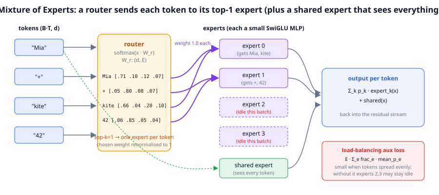
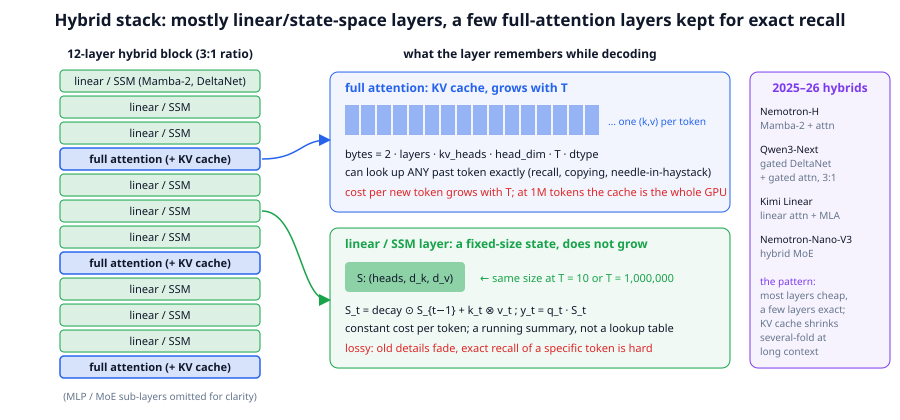
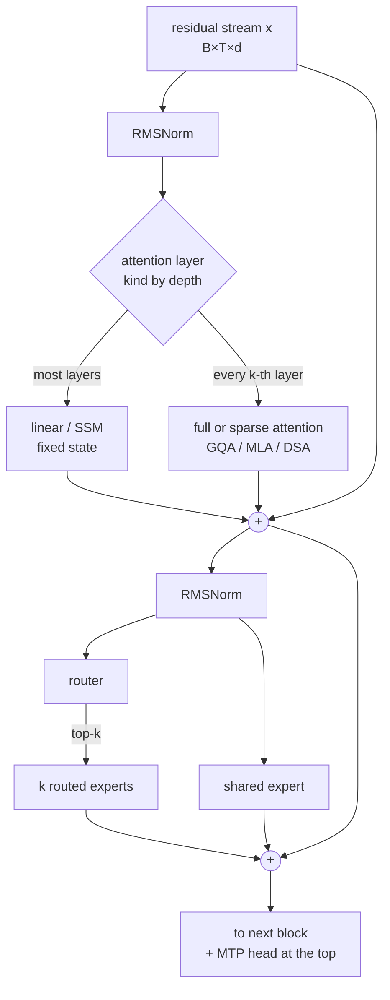

# Chapter 12: Modern architectures (2026)

**Part II · ~3 hours · Prerequisites: Chapters 5, 6, 7, 11**

> 🎯 Goal: Read a 2026 model card and recognise every architectural term.
> 🧪 Lab: `labs/lab12_moe.py` · 🎛️ Interactive: `interactive/12_moe_router.html`

## Why this matters

Open the model card of a 2026 open-weight model and you will read something like: "1.6T total parameters, ~40B active, fine-grained MoE with one shared expert, compressed sparse attention interleaved with heavily compressed attention, multi-token prediction, manifold-constrained hyper-connections, 1M-token context." Every one of those phrases is a fix for a specific cost that the plain 2017 Transformer pays: the MLP costs compute proportional to every parameter for every token, attention costs memory and time proportional to the context length, and next-token prediction gives one training signal per token. The TinyLM you built in Chapter 6 is the 2017 shape with 2023 polish (RMSNorm, RoPE, SwiGLU, GQA). This chapter adds the 2024–2026 pieces, three of which are switches in `TinyLMConfig` (`use_moe`, `mtp_heads`, `sliding_window`; the code behind them is in `llm/model.py`) that you will flip in the lab, and ends with the surprisingly short list of things that have not changed.

## The idea in pictures 📐

### Mixture of experts: many MLPs, each token visits one



In the figure, four tokens enter from the left. The orange **router** is one small matrix that turns each token's vector into a score per expert; the rows of numbers are those scores after a softmax. With top-1 routing, each token is sent along the purple arrow to the expert with the highest score: "Mia" and "kite" go to expert 0, "+" and "42" go to expert 1. Experts 2 and 3 receive nothing this batch, which is the danger the red box at the bottom right is about: a router that ignores experts wastes their parameters, and without a **load-balancing loss** nothing pushes it to use them. The green **shared expert** at the bottom is visited by every token regardless of the router, a DeepSeekMoE idea that gives the model a place for knowledge every token needs so the routed experts can specialise. On the right, each token's output is the router-weighted sum of the experts it visited plus the shared expert's output, and that sum is written back into the residual stream exactly where a dense MLP's output would go.

### Hybrid stacks: cheap layers for most of the work, a few exact ones



The left column shows a twelve-layer hybrid block: nine green **linear/state-space layers** and three blue full-attention layers, a 3:1 ratio. The middle panel shows what each kind of layer must remember while decoding. A full-attention layer keeps a key and value for every past token (the row of blue cells that keeps growing), which is why it can look up any earlier token exactly and why its per-token cost grows with context. A linear layer keeps a single fixed-size matrix S (the green block) that is updated by adding one **outer product** per token (the matrix k⊗v whose entry (i, j) is k<sub>i</sub>·v<sub>j</sub>; a "rank-one" update) and read by one matrix-vector product; its size is the same at 10 tokens and at a million, but it is a running summary, so old details fade. The right column lists 2025–26 models built this way. The design rule that emerged: make most layers cheap, keep a few exact ones for recall.

### One token through a 2026 block



Compared with Chapter 6's block, the two residual additions, the two norms and the attention-then-MLP order are unchanged; what changed is *inside* the sub-layers.

## The idea in code

```python
import torch, torch.nn.functional as F
from llm.config import preset
from llm.model import TinyLM, MoE, causal_mask
```

### The MoE layer in `llm/model.py`

Here is the routing core of `MoE.forward`, trimmed to the lines that matter (the library version adds bookkeeping):

```python
def moe_forward(self, x):                                   # x: (B, T, d)
    B, T, d = x.shape
    flat = x.reshape(-1, d)                                 # (B*T, d): route tokens, not sequences
    probs = F.softmax(self.router(flat), dim=-1)            # (B*T, E): one score per expert
    topk_p, topk_i = probs.topk(self.k, dim=-1)             # (B*T, k): chosen experts and weights
    topk_p = topk_p / topk_p.sum(-1, keepdim=True)          # renormalise so the k weights sum to 1
    out = torch.zeros_like(flat)
    counts = torch.zeros(self.n_experts)
    for e, expert in enumerate(self.experts):               # each expert is a small SwiGLU MLP
        token_idx, slot = (topk_i == e).nonzero(as_tuple=True)   # which tokens picked expert e
        if token_idx.numel() == 0:
            continue                                        # an unused expert costs nothing...
        counts[e] = token_idx.numel()                       # ...and that is the problem
        out.index_add_(0, token_idx, expert(flat[token_idx]) * topk_p[token_idx, slot, None])
    for expert in self.shared:                              # shared experts see every token
        out = out + expert(flat)
    frac = counts / (flat.shape[0] * self.k)                # fraction of assignments each expert got
    self.aux_loss = self.aux_coef * self.n_experts * (frac * probs.mean(0)).sum()
    return out.view(B, T, d)
```

Three things to notice. Routing is per **token**, not per sequence, hence the flatten to `(B*T, d)`. The expert loop is a Python `for` because this is teaching code; production kernels sort tokens by expert and run one grouped matrix multiply, and with expert parallelism (Chapter 11) the `flat[token_idx]` gather becomes an all-to-all. And `topk_p` is renormalised: with top-2 routing, experts scored 0.5 and 0.3 are mixed 0.625 : 0.375.

The **load-balancing auxiliary loss** on the second-to-last line is the Switch Transformer form:

$$L_{\text{aux}} = \alpha \, E \sum_{e=1}^{E} f_e \, P_e$$

Read this as: for each expert, multiply the fraction of tokens that were *actually sent* to it (f_e, not differentiable) by the router's *average probability* for it (P_e, differentiable), sum, and scale by the number of experts. If routing is perfectly even, every f_e and P_e is 1/E and the sum is 1, the smallest value it can take as long as the routed fractions track the router's probabilities (which they do, since the top-k picks follow the probabilities); if one expert hogs traffic, its large f_e multiplies its large P_e and the gradient through P_e pushes the router's probability for that expert down. The coefficient α (`moe_aux_loss_coef`, 0.01 in TinyLM) must be small: too large and the router balances at the expense of the language-modelling loss. DeepSeek-V3 replaced this with an **auxiliary-loss-free** scheme, a per-expert bias added to the routing scores and nudged up or down after each step depending on load, so nothing competes with the main loss; the lab shows what happens to TinyLM when α is set to zero.

### Active versus total parameters

A dense MLP touches every one of its parameters for every token. A top-1 MoE with E experts touches one expert plus the shared expert, so the parameters that do work per token, the **active parameters**, are far fewer than the parameters stored:

```python
cfg = preset("nano", vocab_size=1024, use_moe=True, n_experts=4, n_experts_active=1, n_shared_experts=1)
moe = MoE(cfg)
count = lambda m: sum(p.numel() for p in m.parameters())
per_expert = count(moe.experts[0])
total = count(moe)
active = total - (cfg.n_experts - cfg.n_experts_active) * per_expert
print(f"one MoE layer: total {total:,} | active per token {active:,} | router {count(moe.router):,}")
# one MoE layer: total 369,024 | active per token 147,840 | router 384
```

Per-token compute follows active parameters (6 × active FLOPs per token, Chapter 9), while what the model *knows* follows total parameters. That is why MoE wins per FLOP: DeepSeek-V3 stores 671B parameters and computes with 37B; 🆕 reported 2026 figures are 744B/40B for GLM-5.2, ~2.8T/104B for Kimi K3 and 2.4T/95B for Qwen3.8's sparse model ([wavect](https://wavect.io/blog/open-weight-llm-comparison-2026/), [morphllm](https://www.morphllm.com/best-open-source-llm)), ratios of 16–27×. **DeepSeekMoE** (2024) pushed two refinements now standard: **fine-grained experts** (many small experts, top-8 of 256 in V3, so the combinations a token can select are far more numerous) and the **shared expert**. The costs are real: the parameters must live somewhere (memory, hence expert parallelism), routing imbalances device loads, and training is touchier than dense. TinyLM's MoE as configured in the lab has *more* active parameters than the dense model (the shared expert is extra), so the lab compares at equal steps, not equal FLOPs; exercise 2 fixes that.

### Sparse attention: choose which keys to look at

Full attention scores every query against every key, T² work and a KV cache of T entries. **Sparse attention** keeps a subset. The oldest form is the **sliding window** (Chapter 5), which TinyLM supports through the mask:

```python
print(causal_mask(T=6, S=6, past=0, window=3, device="cpu").int())
# tensor([[1, 0, 0, 0, 0, 0],
#         [1, 1, 0, 0, 0, 0],
#         [1, 1, 1, 0, 0, 0],
#         [0, 1, 1, 1, 0, 0],      <- query 3 sees keys 1..3 only
#         [0, 0, 1, 1, 1, 0],
#         [0, 0, 0, 1, 1, 1]], dtype=torch.int32)
```

A window bounds the KV cache but discards everything older, so windows are used in *some* layers (Gemma and gpt-oss alternate windowed and full layers) or as one branch of a richer scheme. The 2025–26 schemes select keys by *content*:

- **NSA** (Native Sparse Attention, DeepSeek 2025) runs three branches per query, compressed block summaries, the top-n selected blocks by score, and a sliding window, and gates them; it is trained sparse from the start rather than sparsified afterwards.
- **DSA** (DeepSeek Sparse Attention, DeepSeek-V3.2, 2025) adds a **Lightning Indexer**: a tiny, cheap attention (few heads, low precision) that scores every past key for each query, keeps the top-k (2048 in V3.2), and then runs ordinary attention over only those keys. Cost per token becomes roughly T × (indexer) + k × (full), and the indexer is small enough that the total is far below T².
- 🆕 **CSA and HCA** (DeepSeek-V4, 2026, reported in arXiv 2606.19348): **Compressed Sparse Attention** first compresses every m consecutive KV tokens into one entry, then applies DSA's top-k selection over the compressed entries via the Lightning Indexer, plus a sliding window for recent detail; **Heavily Compressed Attention** compresses much harder and then attends densely. Layers interleave CSA and HCA, which is what the paper credits for making 1M-token context tractable ([lmsys summary](https://www.lmsys.org/blog/2026-04-25-deepseek-v4/)). Treat the exact compression ratios as reported, not verified.

The KV cache itself has been shrinking independently. GQA (Chapter 5) shares each key/value head among several query heads. **MLA** (Multi-head Latent Attention, DeepSeek-V2) goes further: it stores one compressed latent vector per token per layer and up-projects it into keys and values on the fly, with a small separate key carrying RoPE. Bytes per token, in bf16:

```python
def kv_bytes_per_token(n_layers, n_kv_heads, head_dim, dtype_bytes=2):
    return 2 * n_layers * n_kv_heads * head_dim * dtype_bytes         # K and V

def mla_bytes_per_token(n_layers, d_latent, d_rope, dtype_bytes=2):
    return n_layers * (d_latent + d_rope) * dtype_bytes               # one latent (+ RoPE key) per layer

print(kv_bytes_per_token(80, 64, 128) / 1e3, kv_bytes_per_token(80, 8, 128) / 1e3, mla_bytes_per_token(80, 512, 64) / 1e3)
# 2621.44 327.68 92.16    <- KB per token: MHA, GQA (8 kv-heads), MLA-style; a Llama-3-70B-like shape
```

Read this as: at 128k tokens of context, the same 80-layer model needs 344 GB of cache with plain multi-head attention, 43 GB with GQA, and 12 GB with an MLA-style latent, which is the difference between "impossible" and "one GPU".

### Hybrid linear/SSM layers: a state instead of a cache

Take attention, drop the softmax, and something surprising happens: the whole computation can be rewritten as a recurrence with a fixed-size state.

```python
torch.manual_seed(0)
T, dk, dv, decay = 6, 4, 3, 0.9
q, k, v = torch.randn(T, dk), torch.randn(T, dk), torch.randn(T, dv)

S = torch.zeros(dk, dv); ys = []                        # the state: (dk, dv), same size at every step
for t in range(T):
    S = decay * S + torch.outer(k[t], v[t])             # write: add this token's key⊗value, fade the old
    ys.append(q[t] @ S)                                 # read: project the state with the query
y_recurrent = torch.stack(ys)                           # (T, dv)

scores = q @ k.T                                        # the same thing as (causal, decaying) attention
i, j = torch.arange(T)[:, None], torch.arange(T)[None, :]
w = torch.where(j <= i, decay ** (i - j).float(), torch.zeros(T, T))
y_attention = (scores * w) @ v
print(torch.allclose(y_recurrent, y_attention, atol=1e-5))   # True
```

Read the loop as: the state S is a running sum of outer products key⊗value, decayed a little each step; to "attend", the query multiplies the state. That is **linear attention**, and it is the core of the family of layers that go by different names: **Mamba-2** (a state-space model whose selective scan is this recurrence with input-dependent decay), **gated DeltaNet** (replaces the plain addition with a "delta rule" update that overwrites the part of S that matches the current key, so the state can *forget* specific things, plus a gate), and **Kimi Delta Attention**. All of them cost a constant amount of work and memory per new token during decoding (O(1) per token, in the usual notation), versus attention's cost per new token that grows with the context (O(T)) and a cache of T entries.

The limit is in the same loop: S has dk × dv numbers no matter how long the sequence, so it cannot store every past token exactly, and tasks that need verbatim recall (copy this 40-digit number, find the one line in a 100k-token log that mentions "timeout") degrade. The 2025–26 solution is the **hybrid**: Nemotron-H (Mamba-2 layers with roughly one attention layer in twelve), Qwen3-Next (3 gated-DeltaNet layers per gated-attention layer), Kimi Linear (3 KDA layers per MLA layer), and 🆕 Nemotron-Nano-V3 (a hybrid Mamba–attention MoE, 30B total / 3B active, used as the test bed in the 2026 optimizer study at https://arxiv.org/abs/2607.20548). The evidence so far is that a 3:1 or higher ratio keeps quality within noise of full attention on most benchmarks while cutting the KV cache several-fold at long context; whether the ratio can go to zero attention is open.

### Multi-token prediction

Standard training gives the model one target per position: the next token. **Multi-token prediction (MTP)** adds heads that predict the token *two* (or more) steps ahead from the same hidden state, so every position yields extra training signal and the representation is pushed to plan a little further. TinyLM's simplified version adds a linear head per extra step:

```python
model = TinyLM(preset("nano", vocab_size=1024, mtp_heads=1))
idx = torch.randint(0, 1024, (2, 16))
logits, loss = model(idx, idx)            # logits: (2, 16, 1024) from the main head only
# inside forward: loss = CE(main) + 0.3 * CE(mtp_head(x[:, :-1]), targets[:, 1:])   # predict t+2
```

Read the comment as: the extra head looks at the hidden state at position t, whose main target is token t+1, and is asked for token t+2; its loss is added with weight 0.3 so it guides without dominating. DeepSeek-V3's MTP is heavier, a full extra Transformer block that also sees the embedding of token t+1, and the report credits it with better data efficiency and with a free **speculative decoding** draft (Chapter 7): at inference the MTP head proposes token t+2 and the main model verifies it, ~1.8× faster decoding in their measurements. The 🆕 2026 GPT-2 speedrun records use MTP for the same reason ([modded-nanogpt](https://github.com/KellerJordan/modded-nanogpt)).

### Hyper-connections and the residual stream

Every architecture here still has Chapter 6's residual stream: one vector per token that each sub-layer reads and adds to. **Hyper-connections** (2024) widen it to n parallel streams mixed by small learned matrices at every layer. 🆕 DeepSeek-V4 reports **manifold-constrained hyper-connections (mHC)**, which restrict those mixing matrices to a well-behaved set so that signals neither blow up nor vanish across hundreds of layers ([arXiv 2606.19348](https://arxiv.org/abs/2606.19348)); the claim is better stability at scale, and it is too new to call settled.

### Diffusion language models: a different generation loop entirely

Everything above is **autoregressive**: one token at a time, left to right. **Diffusion language models** (LLaDA and LLaDA-MoE, 2025, among others) instead start from a fully masked sequence and un-mask tokens in parallel over a few dozen refinement steps, with a *bidirectional* Transformer underneath (every position attends to every other, with no causal mask). The attractions are parallel decoding and editing the middle of a sequence; the open questions are whether they match autoregressive quality at frontier scale and whether their step count beats a KV-cached decode loop in wall-clock. As of 2026 they are a research direction, not the mainstream recipe.

### Long context to 1M tokens

The 1M-token contexts of 🆕 DeepSeek-V4 and Kimi K3 (reported) stack this chapter's ideas: sparse/compressed attention and hybrids to bound per-token cost and cache size, GQA/MLA to shrink what is cached, context parallelism (Chapter 11) to train on long sequences, and RoPE frequency scaling with a dedicated long-context phase, Chapter 13's subject.

### What stayed the same since 2017

| 2017 Transformer | 2026 frontier model | Same or changed? |
|---|---|---|
| tokens → embedding vectors | tokens → embedding vectors | same |
| one residual stream, add after each sub-layer | one stream (or n mixed streams with mHC) | mostly same |
| LayerNorm after the sub-layer | RMSNorm before the sub-layer | changed (2019–20) |
| softmax attention, all heads independent, learned positions | GQA/MLA with RoPE; sparse or hybrid layers | changed (2021–26) |
| dense ReLU MLP | SwiGLU MLP or a mixture of SwiGLU experts | changed (2020–24) |
| next-token cross-entropy | next-token cross-entropy (+ MTP heads) | same, plus |
| Adam, fp32 | Muon or AdamW, bf16/FP8/FP4 | changed (2022–26) |
| left-to-right decoding | left-to-right decoding (with speculation) | same |

The training objective, the residual-stream-plus-sub-layer skeleton, the embedding lookup and the decode loop are 2017. Nearly everything inside the sub-layers has been replaced, always to reduce a cost, never because the objective changed.

## Worked example 🧪

`python3 labs/lab12_moe.py` trains four nano models for the same number of steps (dense, MoE, MoE without the balancing loss, dense with an MTP head), reads `blocks[i].mlp.last_expert_counts` to plot expert utilisation, evaluates the pretrained base model with sliding windows of ∞/32/8, and prints the KV-cache table. Quick mode uses 120 steps at batch 16 × 64 tokens; `--full` uses 250 steps at 32 × 128.

**Quick mode (120 steps at 16 × 64 tokens per variant; 989 s on a shared 4-core machine at load ≈ 15–20, `OMP_NUM_THREADS=2`; a couple of minutes on a quiet laptop; the losses are deterministic, the tok/s column is not):**

```text
--- 1. dense vs MoE (nano, 120 steps, batch 16x64) ---
[dense] total params 379,200 | active 379,200
   val loss 2.4438  (perplexity 11.5)
[moe] total params 1,265,088 | active 601,536
   val loss 2.0972  (perplexity 8.1)

   variant       total     active  val loss  val ppl    tok/s
   dense       379,200    379,200     2.444     11.5      262
   moe       1,265,088    601,536     2.097      8.1      583
   MoE stores 2.10x more parameters than it uses per token
✅ MoE has >2x the TOTAL parameters of the dense model
✅ dense and MoE reach comparable val loss (2.444 vs 2.097)
```

The MoE reaches a lower validation loss (2.10 versus 2.44) for the same steps, but read the parameter columns first: with one routed plus one shared expert it has 1.6× the dense model's *active* parameters and 3.3× its total, so this is "more capacity at the same step count", not "same compute"; exercise 2 equalises the active counts. The tokens-per-second column reflects a contended CPU (the dense run happened to overlap with another job) and a Python `for` loop over experts; production kernels group tokens by expert and run one matrix multiply each.

```text
--- 2. expert utilisation per layer, with and without the load-balancing loss ---
[moe-noaux] total params 1,265,088 | active 601,536
   val loss 2.0724  (perplexity 7.9)
   ideal share per expert = 1/4 = 0.25
   layer 0: aux=0.01 ['0.24', '0.25', '0.26', '0.24']   aux=0 ['0.27', '0.26', '0.19', '0.29']
   layer 1: aux=0.01 ['0.25', '0.26', '0.22', '0.27']   aux=0 ['0.44', '0.22', '0.20', '0.14']
   layer 2: aux=0.01 ['0.25', '0.27', '0.26', '0.22']   aux=0 ['0.18', '0.44', '0.10', '0.28']
   least-used expert share: with aux 0.219, without aux 0.101
   val loss: with aux 2.097, without aux 2.072
✅ with the aux loss every expert gets >5% of tokens in every layer (min 0.219)
   -> without the aux loss the router still spread tokens out at this scale (collapse is a risk, not a certainty)
```

With the balancing loss on, every expert in every layer takes 22–27% of the tokens, within 3 points of the ideal 25%. With it off, the router skews: one expert takes 44% in layers 1 and 2 and the least-used expert in layer 2 gets 10%. That is a real imbalance, not a collapse; at four experts and 120 steps the router had no time to starve anyone, and the validation loss without the aux term is in fact slightly *better* (2.072 versus 2.097), the cost of a balancing objective competing with the language-modelling objective. The collapse risk grows with more experts, higher learning rates and longer training, which exercise 3 explores, and it is why DeepSeek-V3 moved the balancing pressure out of the loss entirely.

```text
--- 3. multi-token prediction (mtp_heads=1: an extra head predicts token t+2) ---
[mtp] total params 462,816 | active 462,816
   val loss 3.8082  (perplexity 45.1)
   next-token val loss: dense 2.444 | with MTP head 2.712 (the model's training loss also includes 0.3 x the t+2 loss)
   the t+2 head's own loss: 3.654 (predicting two tokens ahead is harder than one)
✅ predicting t+2 is harder than predicting t+1
✅ the MTP head does not wreck next-token prediction
```

Honest reporting: at this scale the MTP head *hurts* next-token prediction (2.71 versus 2.44 after 120 steps). A 0.38M-parameter model has little spare capacity, the extra head's gradient (weight 0.3) competes for it, and the run is too short for any "plan ahead" benefit. MTP's reported gains come from billion-parameter models trained for trillions of tokens with a dedicated MTP block; the lab shows the mechanism and the cost, not the payoff. The t+2 head's own loss (3.65) sits well above the t+1 loss, as expected.

```text
--- 4. sliding-window attention on the pretrained base model (trained with FULL attention) ---
   window None: val loss 1.069 | perplexity   2.91
   window   32: val loss 1.070 | perplexity   2.92
   window    8: val loss 1.082 | perplexity   2.95
✅ a window of 8 tokens hurts a model trained with full attention
✅ a window of 32 is no better than full attention

--- 5. KV-cache bytes per token (bf16): dense MHA vs GQA vs MLA-style latent ---
   model                     MHA        GQA    MLA-ish   at 128k tokens: MHA / GQA / MLA
   TinyLM small            4.6KB      1.5KB      1.0KB      0.6 /   0.2 /  0.1 GB
   Llama-3-70B-like     2621.4KB    327.7KB     92.2KB    343.6 /  42.9 / 12.1 GB
   DeepSeek-V3-like     3997.7KB   3997.7KB     70.3KB    524.0 / 524.0 /  9.2 GB
✅ GQA with 8 kv-heads is 8x smaller than 64-head MHA
```

Part 4 is the "trained in, not bolted on" point: forcing an 8-token window on a model trained with full attention raises its loss (1.069 → 1.082). The effect is small because Storyland documents are about 80 tokens long, so most useful keys are close anyway; a window of 32 costs almost nothing here, and a model trained *with* a window (exercise 4) pays nothing at all. Part 5 is the arithmetic behind long context: the same 80-layer model needs 344 GB of KV cache at 128k tokens with plain multi-head attention, 43 GB with GQA, and 12 GB with an MLA-style latent, and for a DeepSeek-V3-shaped model (128 heads, no GQA) the MLA latent is the difference between 524 GB and 9 GB.

**Full mode (`--full`: 250 steps at 32 × 128 tokens per variant, small base for part 4; 1,673 s on the shared machine):**

```text
   variant       total     active  val loss  val ppl    tok/s
   dense       379,200    379,200     1.105      3.0    1,422
   moe       1,265,088    601,536     1.107      3.0    1,723
   least-used expert share: with aux 0.227, without aux 0.145
   val loss: with aux 1.107, without aux 1.073
   next-token val loss: dense 1.105 | with MTP head 1.139 | the t+2 head's own loss: 1.466
   window None: val loss 0.718 | perplexity   2.05
   window   32: val loss 0.743 | perplexity   2.10
   window    8: val loss 0.923 | perplexity   2.52
8/8 checks passed in 1673.2s
```

With eight times the training tokens the quick-mode gaps mostly close: dense and MoE land at the same validation loss (1.105 versus 1.107), so at this scale the extra 886k stored parameters buy nothing on Storyland, a corpus too small to need them; the no-aux MoE is again slightly better (1.073) with its least-used expert at 14.5%; and the MTP model's next-token loss is now only 0.034 behind dense. Part 4 on the *small* base is the clearest result of the lab: a 32-token window costs 0.025 nats and an 8-token window costs 0.2 nats (perplexity 2.05 → 2.52) on a model whose heads were trained to look further back.

## Try it yourself ✍️

1. **Top-2 routing.** Set `n_experts_active=2` and re-run part 1. Active parameters rise; does validation loss improve enough to justify the extra compute at this scale?
2. **Equal active parameters.** The lab's MoE has more active parameters than the dense model because of the shared expert. Pass `d_ff=128` to the MoE preset so that one routed expert plus the shared expert equal the dense MLP's width, and compare again. Which comparison is the one a model card's "active parameters" claim is making?
3. **Collapse on purpose.** With `moe_aux_loss_coef=0.0`, also raise the learning rate to 3e-3 and train longer. Report the least-used expert's share per layer. Then implement the DeepSeek-V3 auxiliary-loss-free bias (a per-expert scalar added to router logits before top-k, decreased for over-used experts after each step) and see if it recovers balance without touching the loss.
4. **A window that works.** Train a nano model *from scratch* with `sliding_window=16` and evaluate it with windows 16, 32 and None. Compare with the pretrained-with-full-attention degradation in part 4 and explain the difference.
5. **MTP as a draft.** Use the trained MTP model's extra head as a draft for speculative decoding: propose token t+2, verify with the main head, and count acceptance rate on validation text.
6. **Interactive.** Open `interactive/12_moe_router.html` (8 experts, top-2 by default). Press **Train** with the aux loss *off* and watch routing collapse onto one or two experts; reset, switch the aux loss *on*, train again and watch the load bars level out; then drag one expert's affinity slider and watch a single bias term move traffic. Its Challenge asks you to make one expert receive zero tokens and then fix it without touching that expert's slider, explaining from the aux-loss gradient why the fix works.

## Check yourself ✅

<details><summary>1. A model card says "671B total, 37B active". What does each number govern?</summary>

Total parameters (671B) govern memory: what must be stored and sharded across devices, and roughly how much the model can know. Active parameters (37B) govern per-token compute: about 6 × 37B training FLOPs per token, and the inference cost. The gap is the MoE's routing sparsity: each token visits 8 of 256 routed experts plus one shared expert.
</details>

<details><summary>2. Why does the load-balancing loss multiply the routed *fraction* by the router's *mean probability* instead of using the fraction alone?</summary>

The fraction f_e comes from a top-k selection and has no gradient. The mean probability P_e is a softmax output and does. Their product is minimised when both are uniform, and the gradient flows through P_e, so the router is pushed to lower the probability of experts that received too many tokens.
</details>

<details><summary>3. In the linear-attention recurrence, what plays the role of the KV cache, and why can it not do everything a KV cache does?</summary>

The state matrix S (dk × dv) accumulates decayed key⊗value outer products; it is the only memory carried between tokens. It has a fixed number of entries, so it stores a lossy, compressed summary of all past tokens rather than each token separately; exact retrieval of one specific old token is not guaranteed. Hybrids keep a few full-attention layers precisely for that.
</details>

<details><summary>4. What does DSA's Lightning Indexer buy, in cost terms, compared with full attention over T keys?</summary>

The indexer still touches all T keys but with a tiny, cheap computation (few heads, low precision), then the expensive full attention runs over only the top-k selected keys. Cost per query drops from T × (full head cost) to T × (indexer cost) + k × (full head cost), which for k ≪ T and a cheap indexer is a large saving, at the price of missing keys the indexer misjudges.
</details>

<details><summary>5. Why does the pretrained base model get *worse* with a sliding window in the lab, when several production models use windows?</summary>

The base was trained with full attention, so its heads learned to rely on keys arbitrarily far back; imposing a window at evaluation time removes information the weights expect. Production models are trained with the window from the start (or use windows only in some layers), so their weights never depend on the missing keys. Exercise 4 demonstrates this.
</details>

## Key takeaways

- Every 2026 architectural term fixes a specific cost of the 2017 block: MoE decouples knowledge (total parameters) from per-token compute (active parameters); sparse and compressed attention and hybrid linear/SSM layers bound the cost and cache of long context; MTP adds training signal per token.
- MoE needs a balancing mechanism, an auxiliary loss or a per-expert bias, because an unconstrained router can starve experts; the lab measures utilisation per layer with and without it.
- Linear/SSM layers replace the growing KV cache with a fixed-size state updated by a decayed outer product; they cannot recall exactly, so hybrids keep a few full-attention layers.
- The KV cache is the long-context bottleneck; GQA and MLA shrink it 8–30× and sparse selection (NSA, DSA, V4's CSA/HCA) bounds how much of it each query touches.
- A window imposed on a model trained with full attention hurts; architecture changes must be trained in, not bolted on.
- The training objective, residual-stream skeleton, embedding lookup and left-to-right decoding are unchanged since 2017; diffusion LMs are the one live challenge to the last of those.

## Going deeper

- Shazeer et al., *Outrageously Large Neural Networks: The Sparsely-Gated Mixture-of-Experts Layer* (2017) and Fedus, Zoph & Shazeer, *Switch Transformers* (2021), the routing and auxiliary-loss basics.
- Dai et al., *DeepSeekMoE* (2024) and DeepSeek-AI, *DeepSeek-V2* / *DeepSeek-V3 Technical Report* (2024), fine-grained and shared experts, MLA, auxiliary-loss-free balancing, MTP.
- Gloeckle et al., *Better & Faster Large Language Models via Multi-token Prediction* (2024).
- Dao & Gu, *Transformers are SSMs* (Mamba-2, 2024); NVIDIA, *Nemotron-H* (2025); Qwen team, *Qwen3-Next* (2025); Moonshot, *Kimi Linear* (2025), the hybrid designs.
- Yuan et al., *Native Sparse Attention* (2025) and DeepSeek-AI, *DeepSeek-V3.2* (2025), NSA and DSA with the Lightning Indexer.
- 🆕 DeepSeek-AI, *DeepSeek-V4: Towards Highly Efficient Million-Token Context Intelligence* (2026), https://arxiv.org/abs/2606.19348 , CSA/HCA and mHC; summary at https://www.lmsys.org/blog/2026-04-25-deepseek-v4/ .
- 🆕 *SOAP, Muon, and Beyond* (2026), https://arxiv.org/abs/2607.20548 , optimizer results on a hybrid Mamba–attention MoE and a LatentMoE with MTP.
- 🆕 Open-weight landscape as of mid-2026 (reported): https://wavect.io/blog/open-weight-llm-comparison-2026/ .

← [Chapter 11](11-distributed-training.md) · [Course home](../README.md) · [Chapter 13](13-mid-training.md) →
