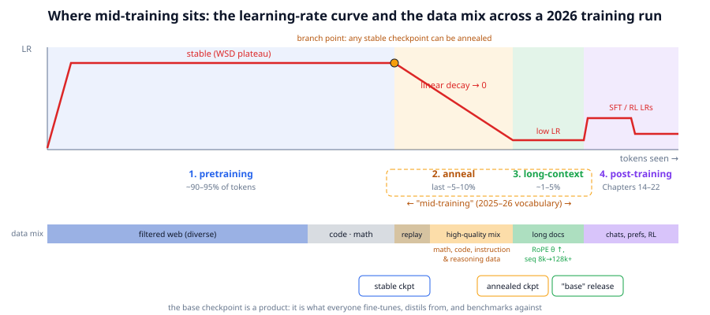
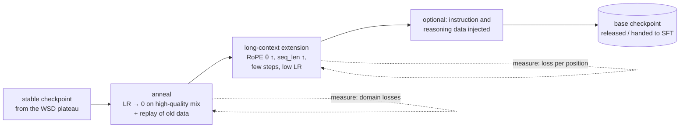

# Chapter 13: Mid-training and continued pretraining

**Part II · ~2 hours · Prerequisites: Chapters 8, 10, 12**

> 🎯 Goal: Explain what happens between pretraining and post-training and why it matters in 2026.
> 🧪 Lab: `labs/lab13_midtrain.py` · 🎛️ Interactive: none for this chapter

## Why this matters

The base model you get at the end of Chapter 10 is not the base model a lab releases. Between the long, flat stretch of pretraining and the post-training pipeline of Part III sits a phase that 2025–26 model reports call **mid-training**: a few percent of the total tokens, spent on the best data you have while the learning rate decays to zero, then a short stretch at much longer sequence lengths, often with instruction-shaped and reasoning-shaped text mixed in before any supervised fine-tuning begins. It is cheap (a few percent of the compute) and it moves benchmarks by amounts that would otherwise cost a full re-run: the difference between a model that can do multi-digit arithmetic and one that cannot, or between a 4k-token context and a 128k one, is often made here. In the lab you take your own base TinyLM, anneal it on a mix that up-weights arithmetic, and watch its math loss fall while its story loss barely moves; then you extend its context from 128 to 512 tokens and watch the loss at positions it never saw come down.

## The idea in pictures 📐



Read the figure along the red learning-rate curve. Phase 1 is pretraining with the WSD schedule from Chapter 10: warm up, then a long *stable* plateau over roughly 90–95% of the tokens, on the diverse filtered-web mix shown in the blue bar underneath. The orange dot is the **branch point**: because the plateau never decayed, any checkpoint on it can be turned into a finished model by running the decay from there, which is what makes experiments on the anneal cheap. Phase 2 is the **anneal** (also called the *decay phase* or *cooldown*): the learning rate falls linearly to zero while the data mix changes to the orange bar, a higher-quality, math- and code-heavy mix with a slice of the original data kept as **replay**. Phase 3 is **long-context extension**: a small number of tokens at a low learning rate, on long documents, after the positional encoding has been re-scaled (RoPE θ raised, sequence length raised from thousands to hundreds of thousands). The checkpoint after phase 3 is what ships as "the base model", and Part III starts from it. The dashed box marks what the field means by mid-training: phases 2 and 3, plus any instruction or reasoning data injected during them.



Every arrow in the flow is one experiment the lab runs at toy scale, with the measurement named on the dotted arrows: domain-specific held-out losses for the anneal, loss-per-position curves for the context extension.

## The idea in code

```python
import math, torch
from llm.data import make_corpus, mix_sources, tokenize_and_pack
from llm.model import TinyLM, rope_tables
from llm.optim import build_optimizer, lr_at, set_lr
from llm.train import get_batch, estimate_loss
from llm.pipeline import get_base_model, get_corpus, get_tokenizer
```

### The anneal: a decaying learning rate on a re-weighted mix

Two ingredients. The first is the data mix. `mix_sources` from Chapter 8 samples documents with per-source weights; a weight of 4 on math and 1 on stories makes a math document four times as likely to be drawn *per draw*. Because Storyland's math documents are short (≈14 tokens) and stories are long (≈79), the share of *tokens* is very different from the share of documents:

```python
tok = get_tokenizer()
docs = get_corpus()                                         # the pretraining corpus (seed 0)
mix = mix_sources(docs, {"stories": 1, "math": 4}, n_out=4000, seed=0)
n_math = sum(d["source"] == "math" for d in mix)
math_tokens = sum(len(tok.encode(d["text"])) for d in mix if d["source"] == "math")
all_tokens = len(tokenize_and_pack(mix, tok))
print(f"math: {100*n_math/len(mix):.0f}% of documents, {100*math_tokens/all_tokens:.0f}% of tokens")
# math: 81% of documents, 40% of tokens
```

Read this as: the mix that "up-weights math 4:1" in the code trains on 40% math *tokens*, and the tokens are what the loss counts. Real mixes are specified in tokens for exactly this reason. Note also that stories are not removed: the 60% of tokens that are stories are the replay that protects what the model already knows.

The second ingredient is the schedule. `lr_at` from Chapter 10 implements WSD; with no warmup and `decay_frac=1.0` the entire run *is* the decay:

```python
print([round(lr_at(s, 10, 1.0, warmup_steps=0, kind="wsd", decay_frac=1.0), 1) for s in range(10)])
# [1.0, 0.9, 0.8, 0.7, 0.6, 0.5, 0.4, 0.3, 0.2, 0.1]
```

$$\eta_t = \eta_0 \left(1 - \frac{t}{T_{\text{anneal}}}\right)$$

Read this as: the learning rate starts at the anneal's peak and falls in a straight line to zero at the last step. The peak is lower than pretraining's (the lab uses 3 × 10⁻⁴ against 10⁻³) because the model is already good and large steps would undo that. Why does decaying to zero help at all? During the stable phase the model bounces around a valley floor with step-size noise; shrinking the step lets it settle into the bottom, and doing that settling *on the best data* means the final position is chosen by that data. The current evidence (WSD analyses from 2024 onward, and the fact that most 2025–26 open reports describe such a phase) is that the decay phase contributes a large fraction of the final loss improvement and that the mix during it has an outsized effect on downstream skills.

The loop itself is Chapter 10's with the schedule and mix swapped in; the lab's version is:

```python
model, _ = get_base_model(quick=True)                       # your pretrained base
model.train()
mix_tokens = tokenize_and_pack(mix, tok)
opts = build_optimizer(model, "adamw", lr=3e-4, weight_decay=0.1)
g = torch.Generator().manual_seed(0)
STEPS = 60
for step in range(STEPS):
    set_lr(opts, lr_at(step, STEPS, 1.0, warmup_steps=0, kind="wsd", decay_frac=1.0))
    x, y = get_batch(mix_tokens, 8, 128, g)                 # (8, 128) windows from the packed mix
    _, loss = model(x, y)
    for o in opts: o.zero_grad(set_to_none=True)
    loss.backward()
    torch.nn.utils.clip_grad_norm_(model.parameters(), 1.0)
    for o in opts: o.step()
```

(The library's `train()` cannot express this schedule because it does not pass `decay_frac` through to `lr_at`; the explicit loop is eight lines and shows the schedule, so the lab uses it.)

### Measuring what changed: per-domain held-out streams

A single validation loss hides the trade-off that mid-training is about. The lab builds two held-out streams from *fresh* documents (`make_corpus(2000, seed=12345)`, never seen in pretraining), one math-only and one stories-only, and evaluates both before and after:

```python
eval_docs = make_corpus(2000, seed=12345)
math_eval  = tokenize_and_pack([d for d in eval_docs if d["source"] == "math"], tok)
story_eval = tokenize_and_pack([d for d in eval_docs if d["source"] == "stories"], tok)
math_loss  = estimate_loss(model, math_eval, 16, 128, n_batches=6)
story_loss = estimate_loss(model, story_eval, 16, 128, n_batches=6)
```

What you hope to see is math down and stories flat. What you fear is **catastrophic forgetting**: continued training on a narrow distribution overwrites the weights that served the old distribution, so the old loss climbs. The standard defences, all used in 2026 recipes, are **replay** (keep a slice of the original mix, the 60% of story tokens above), a low learning rate, and short duration. Chapter 10's Muon versus AdamW question resurfaces here in a small way: whichever optimizer pretrained the model, its state is usually discarded at the branch point and rebuilt, which is why the lab constructs a fresh AdamW.

### Long-context extension: teach RoPE about positions it never saw

RoPE (Chapter 5) rotates each pair of channels in a query or key by an angle proportional to the position; pair i of a head of width d turns at rate θ^(−2i/d). The fast pairs complete many turns within a 128-token window; the slow pairs do not:

```python
head_dim = 32
for theta in (10_000.0, 50_000.0):
    inv_freq = 1.0 / (theta ** (torch.arange(0, head_dim, 2).float() / head_dim))   # (16,)
    wavelength = 2 * math.pi / inv_freq                                               # positions per full turn
    print(f"theta={theta:>6.0f}: slowest pair turns once per {wavelength[-1]:7.0f} positions; "
          f"pairs slower than one turn per 128 positions: {(wavelength > 128).sum().item()}/16")
# theta= 10000: slowest pair turns once per   35333 positions; pairs slower than one turn per 128 positions: 10/16
# theta= 50000: slowest pair turns once per  159759 positions; pairs slower than one turn per 128 positions: 11/16
```

Read this as: with θ = 10,000 and a 128-token training length, ten of the sixteen channel pairs have only ever seen a fraction of one turn. Ask the model to attend at position 500 and those pairs produce angles it has never encountered, so the attention scores are out of distribution and the loss on late positions jumps; the lab measures exactly this. Two families of fixes exist:

- **Adjusted base frequency (ABF)**, used by Llama 3 (θ from 10k to 500k) and most 2025–26 models: raise θ so that every pair turns more slowly. Position 512 under θ = 50,000 gives the slowest pair the angle that position ≈ 113 gave under θ = 10,000, inside the trained range, while the fastest pairs, which encode local order and had already wrapped many times, barely change. The cost is that all *existing* positions shift slightly too, so a short fine-tune at the new length is needed to re-settle them; the lab shows the loss on positions 0–128 ticking up before that fine-tune and recovering after.
- **Position interpolation** and **YaRN**: instead of changing θ, scale the positions down so that 512 is fed to RoPE as 128 (interpolation), or, in YaRN, interpolate only the slow pairs, leave the fast pairs untouched, and add a small attention-temperature correction, which extends further with less fine-tuning. The intuition is the same as ABF's, applied per pair.

In TinyLM this is one call, which rebuilds the cos/sin tables at the new length and base:

```python
model.extend_context(512, theta=50_000.0)     # cfg.max_seq_len = 512, cfg.rope_theta = 50000, new tables
x = torch.randint(0, model.cfg.vocab_size, (1, 512))
print(model(x)[0].shape)                      # torch.Size([1, 512, 1024]): forward now accepts 512 tokens
```

The extension phase in a 2026 run is short (well under 1% of tokens), uses long documents (books, code repositories, concatenated conversations), a low learning rate, and context parallelism (Chapter 11) to fit sequences of 128k–1M tokens; DeepSeek-V4's million-token context is reached this way on top of the compressed-attention layers of Chapter 12 (🆕 arXiv 2606.19348). The lab's per-position loss curve is the standard diagnostic: flat means the model uses the whole window; rising means it does not.

### Injecting instruction and reasoning data before post-training

A practice that became standard in 2025–26 is to put instruction-formatted and chain-of-thought-style text into the anneal mix, well before SFT (Chapter 15). The base model then already knows the *shape* of a question–answer exchange and of a worked solution, so post-training needs fewer examples and fewer steps, and RL (Chapter 19) has something to reinforce. 🆕 FineInstructions (2026, https://arxiv.org/abs/2601.22146) scales this to pretraining-sized synthetic instruction corpora; Nemotron-CC's synthetic rephrasing and the 2026 synthetic-pretraining study (https://arxiv.org/abs/2604.13977) are the same idea from the data side. What is settled is that it helps; what is open is how much is too much, since a base model that already behaves like a chatbot is harder to evaluate as a base model and can lose some of the diversity RL relies on.

### The base checkpoint as a product

The checkpoint at the end of mid-training is what gets a name and a licence. It is what other teams fine-tune, what distillation (Chapter 20) uses as a teacher or student, what benchmarks list under "base", and what post-training experiments branch from over and over. That is why labs spend care on it out of proportion to its compute cost: a bad anneal cannot be fixed downstream at any price, while a good one makes every later stage cheaper. It is also why the WSD branch point matters organisationally: a stable checkpoint can be annealed several different ways in parallel, on different mixes, and the best one chosen by the per-domain measurements you build in the lab.

## Worked example 🧪

`python3 labs/lab13_midtrain.py` loads your base model (nano in quick mode, small with `--full`), reports the held-out math and story losses, anneals for 60 (quick) or 250 (full) steps on the 4:1 mix with a linear decay, reports again, then extends the context to 512 with θ = 50,000, fine-tunes for 20 (quick) or 60 (full) steps at sequence length 512, and plots loss per position for three states: tables extended with the old θ, the new θ before fine-tuning, and after. The final model is saved as `runs/lab13_annealed.pt`, the course's mid-trained checkpoint.

**Quick mode (nano base; 402 s on a shared machine at load ≈ 20, well under a minute on a quiet laptop):**

```text
base model: 295,584 params, max_seq_len 128, rope_theta 10000

--- data: the anneal mix and two held-out streams ---
   pretraining corpus: 1491 math / 4509 story docs
   anneal mix (weights stories:1, math:4): 3230/4000 docs are math = 81% of docs but 40% of tokens (math docs are short)
   held-out streams: math 7,057 tokens, stories 118,666 tokens

--- (a) anneal: 60 steps on the math-heavy mix, LR decaying linearly to 0 ---
   BEFORE: math loss 1.766 (ppl 5.8) | stories loss 1.045 (ppl 2.8)
   step    0 | mix loss 1.3940 | lr x1.00
   step   12 | mix loss 1.3289 | lr x0.80
   step   24 | mix loss 1.2681 | lr x0.60
   step   36 | mix loss 1.4194 | lr x0.40
   step   48 | mix loss 1.3406 | lr x0.20
   step   59 | mix loss 1.2656 | lr x0.02
   AFTER:  math loss 1.639 (ppl 5.1) | stories loss 1.050 (ppl 2.9)   [155s]
   change: math -0.128 | stories +0.005
✅ annealing on a math-heavy mix lowers the held-out MATH loss
✅ ...without a large regression on stories (change +0.005; replay keeps it small)
```

Two things to notice in part (a). The mix line is the token-versus-document point from the code section: 81% of documents but 40% of tokens are math. And the anneal does what mid-training is for: held-out math loss falls by 0.128 nats (perplexity 5.8 → 5.1) while held-out story loss moves by +0.005, within noise, because 60% of the tokens were story replay and the learning rate decayed to zero. This is the honest shape of the trade-off at this scale; with a narrower mix or a higher LR the story loss climbs (exercise 1).

```text
--- (b) long context: 128 -> 512 positions with RoPE theta 50000 ---
   tables extended, theta=10000       pos 0-128: 1.074 | pos 128-512: 1.202 | per-64 bins ['1.06', '1.09', '1.04', '1.08', '1.21', '1.28', '1.30', '1.30']
   theta=50000, before fine-tune      pos 0-128: 1.088 | pos 128-512: 1.161 | per-64 bins ['1.07', '1.11', '1.03', '1.05', '1.11', '1.24', '1.29', '1.24']
✅ before extension training, positions the model never saw are worse (RoPE is relative and Storyland docs are short, so expect a small gap)
   step    0 | loss at seq_len 512: 1.4755
   step    5 | loss at seq_len 512: 1.3520
   step   10 | loss at seq_len 512: 1.2181
   step   15 | loss at seq_len 512: 1.2778
   step   19 | loss at seq_len 512: 1.3591
   theta=50000, after 20 steps        pos 0-128: 1.083 | pos 128-512: 1.095 | per-64 bins ['1.07', '1.10', '1.02', '1.03', '1.10', '1.15', '1.17', '1.11']
   long-position loss: 1.202 (naive) -> 1.161 (ABF) -> 1.095 (ABF + fine-tune)   [116s]
✅ fine-tuning at 512 improves the loss on positions 128-512
✅ the gap between short and long positions shrinks
```

Part (b) reads top to bottom as three states of the same model. With the RoPE tables merely lengthened (θ = 10,000), positions 128–512 are 0.13 nats worse than positions 0–128, and the per-64 bins show the loss rising steadily past the trained length. Raising θ to 50,000 *without any training* already helps the far positions (1.202 → 1.161) and, as predicted, slightly hurts the near ones (1.074 → 1.088), because every pair's angles shifted. Twenty steps at sequence length 512 then bring the far positions to 1.095 and the near ones back to 1.083: the short-versus-long gap shrinks from 0.13 to 0.01 nats. The gap is small in absolute terms because RoPE is *relative* and Storyland documents are ~80 tokens long, so a query rarely needs a key more than 128 positions back; on real long documents the untrained-position penalty is far larger.

<!-- LAB13_FULL -->

## Try it yourself ✍️

1. **Forgetting on purpose.** Anneal on `{"math": 1}` only (no stories) for the same number of steps. How far does the story loss climb? Then add 10% stories back and find the smallest replay fraction that keeps the regression under 0.05 nats.
2. **Constant versus decay.** Repeat the anneal with `kind="constant"` (no decay) and compare the math loss. Is the improvement from the *data* or from the *decay*? Run a third variant, decay on the original mix, to separate them.
3. **Which θ?** Extend with θ = 10,000, 50,000 and 500,000 and fine-tune each for the same 20 steps. Plot the three per-position curves. Which θ gives the best positions 128–512, and does the best one hurt positions 0–128?
4. **Position interpolation.** Implement interpolation instead of ABF: leave θ at 10,000 but build `rope_tables` for 512 positions using `pos = torch.arange(512) * 128/512`. Compare with ABF before and after fine-tuning.
5. **Instruction injection.** Add 200 "Question: ... Answer: ..." documents (Storyland already generates some) with weight 3 to the anneal mix. After annealing, prompt the model with a question and compare the completions with the un-annealed base. This is a preview of Chapter 15.
6. **Branching.** Using Chapter 10's lab, save a checkpoint from the middle of the WSD plateau, anneal it with this lab's loop, and compare with annealing the final checkpoint. How much of the final quality was available early?

## Check yourself ✅

<details><summary>1. What are the two or three phases that "mid-training" refers to in 2025–26 reports, and roughly what fraction of the total tokens do they use?</summary>

The anneal (learning-rate decay on a high-quality, re-weighted mix, typically the last ~5–10% of tokens), the long-context extension (well under 1%, at a low LR on long documents), and, increasingly, the injection of instruction- and reasoning-formatted data during those phases. Together they are a few percent of the compute.
</details>

<details><summary>2. The lab's mix "up-weights math 4:1" but only 40% of the tokens are math. Why, and which number matters?</summary>

`mix_sources` weights *documents*, and math documents are about five times shorter than stories, so 81% of documents becomes 40% of tokens. The loss is a mean over tokens, so the token share is what determines the training pressure. Real recipes specify mixes in tokens.
</details>

<details><summary>3. Why does raising RoPE's θ help a model attend at positions beyond its training length, and why is a fine-tune still needed afterwards?</summary>

Slow channel pairs at θ = 10,000 have seen only a fraction of one rotation within 128 positions; positions beyond that produce angles the model never saw. Raising θ slows every pair, so position 512 produces angles similar to those a smaller position produced before, inside the seen range. But the same change shifts the angles of positions 0–128 too, so the weights are slightly mis-calibrated everywhere until a short fine-tune at the new length re-settles them.
</details>

<details><summary>4. What is catastrophic forgetting, and name the three defences the lab uses.</summary>

Continued training on a narrow distribution overwriting weights that served the earlier distribution, so performance on the old data drops. Defences: replay (keep 60% story tokens in the mix), a lower learning rate than pretraining (3e-4 vs 1e-3) that decays to zero, and a short run.
</details>

<details><summary>5. Why does the WSD schedule make mid-training experiments cheap?</summary>

Because the stable phase never decays, any checkpoint on it is a valid branch point; the anneal is the only part that must be re-run to test a new mix, and it is a few percent of the total tokens. With a cosine schedule the decay is entangled with the whole run, so testing a different final mix would mean re-training from much earlier.
</details>

## Key takeaways

- Mid-training is the anneal (LR to zero on a high-quality, re-weighted mix with replay) plus long-context extension plus, often, instruction and reasoning data, all before SFT; a few percent of compute with outsized effect.
- Specify mixes in tokens, not documents; measure with per-domain held-out streams so you can see the trade-off between the target domain improving and everything else holding.
- Catastrophic forgetting is the failure mode; replay, low LR, and short duration are the defences.
- RoPE pairs slower than one turn per training length produce unseen angles at longer positions; ABF (raise θ) or interpolation/YaRN (scale positions) bring them back in range, and a short fine-tune at the new length finishes the job. The per-position loss curve is the diagnostic.
- WSD's stable phase makes the anneal a branchable, repeatable experiment; the annealed, extended checkpoint is the base model as a product.

## Going deeper

- Hägele et al., *Scaling Laws and Compute-Optimal Training Beyond Fixed Training Durations* (2024), the WSD/cooldown analysis that made branching standard.
- Meta, *The Llama 3 Herd of Models* (2024), the annealing on high-quality data, the 500k RoPE base, and the six-stage context extension to 128k.
- Xiong et al., *Effective Long-Context Scaling of Foundation Models* (2023), the adjusted-base-frequency idea; Peng et al., *YaRN* (2023), per-pair interpolation with attention temperature.
- Chen et al., *Extending Context Window of Large Language Models via Positional Interpolation* (2023).
- Ibrahim et al., *Simple and Scalable Strategies to Continually Pre-train Large Language Models* (2024), replay and re-warming for continued pretraining.
- 🆕 *FineInstructions* (2026), https://arxiv.org/abs/2601.22146 , instruction data at pretraining scale; 🆕 a systematic study of synthetic pretraining data (2026), https://arxiv.org/abs/2604.13977 .
- 🆕 DeepSeek-AI, *DeepSeek-V4* (2026), https://arxiv.org/abs/2606.19348 , for how a million-token context is reached on top of compressed attention.

← [Chapter 12](12-modern-architectures.md) · [Course home](../README.md) · [Chapter 14](14-post-training-pipeline.md) →
