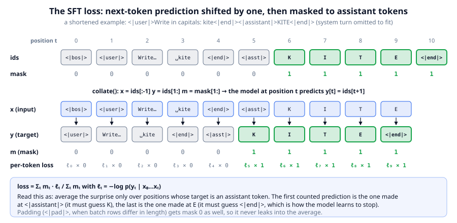
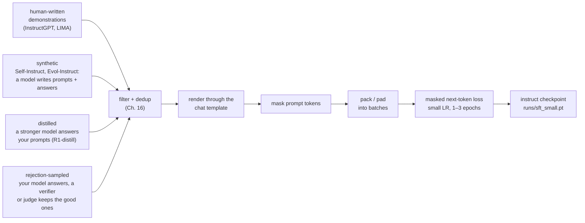
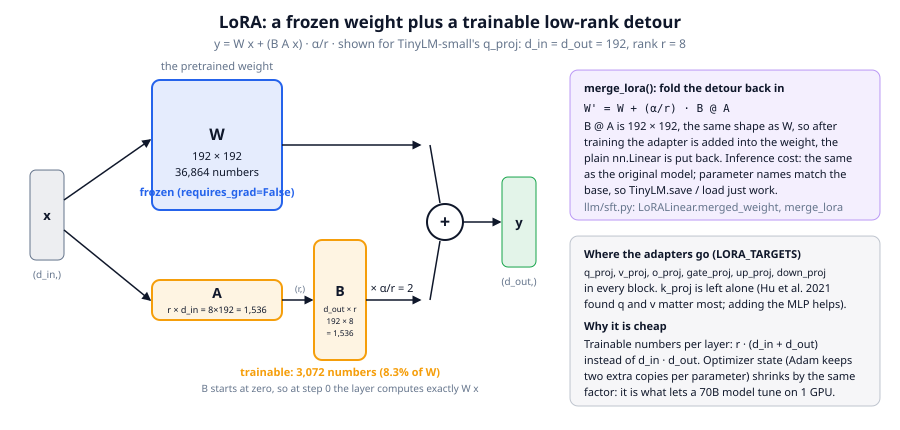

# Chapter 15: Supervised fine-tuning (SFT)

**Part III · ~3 hours · Prerequisites: Chapters 10, 13, 14**

> 🎯 Goal: Turn a base model into an instruction follower and explain loss masking.
> 🧪 Lab: `labs/lab15_sft.py` · 🎛️ Interactive: none for this chapter; use the SFT stage of `interactive/14_posttraining_map.html`

## Why this matters

At the end of Chapter 14 the small base model answered `Write in capitals: kite` with `you.`. This chapter makes it answer `KITE`, and then `<|end|>`, and then nothing. The method is the least glamorous in the whole pipeline: **supervised fine-tuning (SFT)** is the pretraining loop of Chapter 10 run again on a few thousand conversations, with one change to the loss (the prompt is masked out) and a smaller learning rate. Every 2026 model goes through it, usually more than once: as the first post-training stage, as the "cold start" that makes RL trainable, as the way a big model's outputs are copied into a small one, and as the final polish after RL. It is also the stage that is most often done badly, because it looks like it cannot go wrong. It can: SFT on facts the model does not know teaches it to make facts up, three epochs on a narrow set erases what pretraining built, and a model that imitates a stronger model's *style* without its *capability* is the classic failure of 2023. The lab measures all three, and it leaves behind `runs/sft_small.pt`, the checkpoint that Chapters 16 to 20 start from.

## The idea in pictures 📐

The base model already knows how to complete Storyland text and Storyland arithmetic. What it lacks is a mapping from "a conversation in the chat template, ending in `<|assistant|>`" to "an answer, then `<|end|>`". SFT supplies that mapping by example: show the model whole conversations, and train it, with the same next-token loss as pretraining, to predict the assistant's tokens given everything before them.



The figure follows one shortened example through `collate` and the loss. The top row is the token sequence with its mask from Chapter 14: only `K I T E <|end|>` are marked 1. `collate` produces three aligned rows: the input `x = ids[:-1]`, the target `y = ids[1:]`, and the mask `m = mask[1:]`, so that at every position `t` the model reads `x[t]` and is asked for `y[t]`, the *next* token. Under those rows is the per-token loss `ℓₜ`, the surprise the model expresses at the correct next token, and the mask multiplies each one by 0 or 1. Only five terms survive: the prediction made while reading `<|assistant|>` (target `K`), the three made while reading `K`, `I`, `T`, and the one made while reading `E` (target `<|end|>`). That last term is how the model learns to *stop*; a model trained without it produces a correct answer and then keeps going. The prompt tokens still matter, because every one of the five predictions attends back over them; they are context, not targets.

Why mask at all, when pretraining trains on every token? Because the data is not a sample of what the model should produce. In the lab's instruction set, 92% of tokens are the system prompt and the user's question. Training on them would spend 92% of every gradient step teaching the model to write `You are TinyLM, a helpful assistant`, and would make it very good at generating *questions*. Some 2024 recipes did train on prompts with a small weight, and a 2026 reader will occasionally see "prompt loss weight" in a config; the default everywhere is zero.

Where do the conversations come from? Four sources, in rising order of how much they depend on a model that already exists:



**Human-written** data is what InstructGPT (2022) used: contractors wrote about 13k prompt-and-answer pairs. LIMA (2023) showed that 1,000 carefully written examples are enough to teach the *format* to a strong base model, which is the origin of the phrase "SFT teaches style, pretraining teaches knowledge". **Synthetic** data starts from a handful of seed tasks and asks a model to invent new prompts and answer them: Self-Instruct (2022) generated 52k such examples from GPT-3, and Evol-Instruct (WizardLM, 2023) rewrote prompts to be progressively harder. **Distilled** data is the answers of a stronger model to your prompts; DeepSeek's R1-distill models (2025) are SFT of Qwen and Llama bases on 800k R1 outputs, nothing else. **Rejection-sampled** data is the model's own answers, filtered by a verifier or a judge, and is the bridge to on-policy methods: R1's third stage rejection-sampled 600k reasoning traces from its own RL checkpoint and fine-tuned on them. TinyLM's lab uses the first kind in spirit: `tasks.make_examples` writes the demonstrations from a template, so every one is correct by construction.

### Full fine-tuning vs LoRA

Full fine-tuning updates every weight. For a 2.5M-parameter TinyLM that is free; for a 70B model it means 70B parameters plus two Adam moments each in memory, and a full copy of the model per task you fine-tune it for. **LoRA (low-rank adaptation)** keeps the pretrained weights frozen and adds, next to each chosen linear layer, a small trainable detour.



In the figure the input `x` takes two paths. The upper path is the frozen weight `W` (192 × 192 for TinyLM-small's `q_proj`, 36,864 numbers). The lower path is two thin matrices: `A` squeezes `x` from 192 dimensions to `r = 8`, and `B` expands it back to 192. Their product `B A` has the same shape as `W`, so the two paths can be added, scaled by `α/r`. What is trained is only `A` and `B`: 8 × 192 + 192 × 8 = 3,072 numbers, 8.3% of `W`. `B` starts at zero, so on step 0 the layer computes exactly `W x` and training moves it away from the base model gradually. After training, `W + (α/r) B A` is computed once and written back into `W` (`merge_lora`), so the served model is an ordinary model with no extra cost. The rank `r` bounds how much the adapter can change: the update `B A` has at most 8 independent directions. Hu et al. (2021) found that surprisingly small ranks (4 to 16) match full fine-tuning on most tasks, and the current evidence (Biderman et al., 2024, "LoRA Learns Less and Forgets Less") is that LoRA under-performs full fine-tuning on tasks that need new knowledge, such as continued pretraining on code, and matches it on format and style tasks, while also forgetting less of the base model's abilities. The lab measures both halves of that claim.

An analogy: LoRA is like editing a published book with a sheet of errata clipped to each chapter instead of reprinting the book. The sheet is small, several sheets can be swapped in and out, and a reader can paste the corrections into the text if they want a single clean copy. The limit of the analogy: an erratum can change any sentence, while a rank-8 update can only change a weight matrix along eight directions.

## The idea in code

The library file is `llm/sft.py` (about 260 lines) on top of `llm/chat.py` from Chapter 14. The imports:

```python
import copy, torch
from llm.sft import SFTConfig, sft_train, build_sft_dataset, sft_loss, describe_mask
from llm.sft import LoRALinear, apply_lora, merge_lora, trainable_params, respond
from llm.pipeline import get_tokenizer, get_base_model, run_path
from llm.tasks import make_examples
from llm.evals import eval_tasks
tok = get_tokenizer()
base, _ = get_base_model(quick=True)              # TinyLM-nano: 295,584 non-embedding params
```

### Step 1: instruction examples become masked sequences

`tasks.make_examples` produces `TaskExample`s: a task name, a user prompt, and a reference answer with a checker. `build_sft_dataset` renders each one with the system prompt and tokenizes it into `(ids, mask)`.

```python
train = make_examples(2000, seed=1, tasks=["upper", "reverse", "add", "count"])
train[0].prompt, train[0].answer            # ('Write in capitals: goat', 'GOAT')
data = build_sft_dataset(tok, train)        # list of (ids, mask), 2000 long
ids, mask = data[0]
len(ids), sum(mask)                          # (64, 5): G, O, A, T and <|end|>
print(describe_mask(tok, ids, mask))
# <|bos|><|system|>You are TinyLM, a helpful assistant. Answer briefly.<|end|><|user|>Write in capitals: goat<|end|><|assistant|>[G][O][A][T][<|end|>]
```

`max_len` truncates conversations longer than the model's RoPE tables (`min(cfg.max_len, model.cfg.max_seq_len)`); with 60-to-70-token examples and a 128-token nano model it never fires here, but it is the line that prevents a crash on a long document in a real set.

### Step 2: the loss is masked cross-entropy

```python
pad_id = tok.special_tokens["<|pad|>"]
loss = sft_loss(base, data[:16], pad_id, "cpu")   # collate -> (B=16, T-1) x, y, m; model(x, targets=y, loss_mask=m)
loss.item()                                         # 7.84: the base model finds assistant tokens very surprising (ln 871 = 6.77 would be uniform)
```

`sft_loss` is four lines: `collate` the batch, call the model with `targets` and `loss_mask`, and return the loss. Inside `TinyLM.forward`, the loss function computes per-token cross-entropy, multiplies by the mask and divides by the mask's sum:

$$\mathcal{L}_{\text{SFT}} = \frac{\sum_t m_t \,\big(-\log p_\theta(y_t \mid x_{\le t})\big)}{\sum_t m_t}$$

Read this as: average the surprise at the correct next token over the assistant positions only. Dividing by `Σ m` rather than by the sequence length keeps the loss on the same scale as pretraining (nats per *trained* token), so "loss 2.3" means the same thing in both loops. Two conversations with 5 and 58 trainable tokens contribute in proportion to their trainable tokens, which is the standard choice and slightly favours long answers; a per-example normalisation is the main alternative.

### Step 3: the loop is the pretraining loop with a mask

`sft_train` is the training loop of Chapter 10 with three edits: batches are shuffled *conversations* rather than random windows of a token stream; the loss is `sft_loss`; and every `eval_every` steps it also runs `eval_tasks` on the validation examples, so the history carries an accuracy curve next to the loss curve. Everything else, AdamW, warmup, cosine decay, gradient clipping, is shared through `llm/optim.py`.

```python
cfg = SFTConfig(steps=300, batch_size=16, lr=1e-3, warmup_steps=20, schedule="cosine", eval_every=100)
model = copy.deepcopy(base)
hist = sft_train(model, tok, train, cfg, val_examples=make_examples(32, seed=2, tasks=["upper", "reverse", "add", "count"]))
hist.train_loss[0], hist.train_loss[-1], hist.val_acc    # loss ~9 -> ~1, accuracy per eval point
```

The defaults in `SFTConfig` encode the folklore of the stage. `lr = 3e-4` is a third of pretraining's `1e-3`; production SFT of a 7B-to-70B model uses `1e-5` to `2e-5`, roughly ten times below its pretraining rate, because the model is already in a good basin and a large step leaves it. The lab uses `1e-3` because TinyLM is 300 to 2,500 times smaller than those models and the default converges about three times slower at this scale; the rule "SFT LR ≈ pretraining LR / 10" is a rule for models that were pretrained near their optimal LR, which nano and small were not. `weight_decay = 0` because decay pulls weights toward zero, away from the pretrained solution. `epochs` is optional and usually 1 to 3: the third epoch on a small set overfits, which shows up as validation loss rising while accuracy plateaus. `max_len = 192` truncates; `grad_clip = 1.0` as always.

### Step 4: packing

Each of the lab's examples is about 63 tokens, and the small model's window is 256. `collate` pads every batch to its longest row, which wastes little here because the rows are all the same length. In a real instruction set, lengths range from 20 tokens to 8,000, and padding every batch to its longest row wastes most of the compute. **Packing** concatenates several conversations into one window of the model's full length, separated by `<|eos|>` (or `<|end|>`), and trains on the whole window in one forward pass, exactly as `tokenize_and_pack` did for pretraining in Chapter 10. The one subtlety is attention: in a plain packed window, the tokens of the second conversation can attend to the first. Most 2024 recipes ignored that (the model learns to reset at `<|eos|>`); careful 2026 recipes use a block-diagonal attention mask so that each conversation only sees itself, which FlashAttention's variable-length kernels support at no extra cost. `sft_train` pads rather than packs, and Exercise 3 asks you to change that.

### Step 5: LoRA in three functions

```python
lora = copy.deepcopy(base)
apply_lora(lora, rank=8)                            # freezes everything, wraps q,v,o,gate,up,down in every block
q = lora.blocks[0].attn.q_proj                      # a LoRALinear
q.base.weight.shape, q.lora_A.shape, q.lora_B.shape  # (96, 96), (8, 96), (96, 8) for nano
trainable_params(lora), sum(p.numel() for p in base.parameters())   # (37,632, 379,200): 9.9% (150,528 of 2,529,024 = 6.0% for small)
```

`LoRALinear.forward` is one line, `self.base(x) + (x @ A.T @ B.T) * scale`, with `scale = α/r` and `α = 2r` by default. Because `B` is initialised to zero, `lora(x)` equals `base(x)` before the first step; the lab checks this to `1e-5`. `sft_train` with `cfg.lora_rank > 0` calls `apply_lora`, filters the optimizer down to parameters with `requires_grad`, trains, and calls `merge_lora`, which copies `W + scale · B @ A` into each base weight and puts the plain `nn.Linear` back, so the returned model saves and loads like any TinyLM.

### Step 6: talking to it

```python
respond(model, tok, "Write in capitals: kite")      # 'KITE' after SFT (the base said '=  +  =  =  +  + 78')
eval_tasks(model, tok, val, max_new_tokens=16).table()   # a markdown table with a bootstrap CI per task
```

`respond` encodes the system and user turns with `chat.encode_chat` (role ids from the template, content with `allowed_special=False`, a trailing `<|assistant|>`), decodes greedily and stops at `<|end|>`. `eval_tasks` does that for every example and grades with `tasks.verify`; `EvalResult.table()` adds a 95% bootstrap confidence interval so that a difference of 0.05 on 32 items is not over-read.

## Worked example 🧪

```bash
python3 labs/lab15_sft.py            # quick: TinyLM-nano, 300 steps + 150 LoRA steps, saves runs/sft_nano.pt
python3 labs/lab15_sft.py --full     # TinyLM-small, 400 steps + 200 LoRA steps, saves runs/sft_small.pt
```

LAB15_WORKED_EXAMPLE

## What SFT teaches, and what it does not

Three things are settled. SFT teaches the **format**: after a few hundred steps the model emits `<|end|>`, answers on one line, and puts the sum after the equals sign, because those are the cheapest regularities in the data. SFT teaches **style**: tone, length, the use of markdown, the habit of restating the question, all of which is why R1-distill models "sound like" R1. SFT teaches a **task procedure** when the procedure is shallow enough to imitate: the copy tasks `upper` and `reverse` are learned from a few thousand examples because they are a fixed transformation of the prompt.

Two things it does not teach well. It does not add **knowledge**. The Storyland facts the model knows come from pretraining; SFT on a question whose answer the base model cannot already produce does not install the answer, it installs the *habit of answering confidently*, and Gekhman et al. (2024) showed that fine-tuning on unknown facts measurably increases hallucination on known ones. The `add` task is the lab's version: the base model saw two-digit sums in pretraining, so SFT can surface the skill; a task the base never saw would not be learned by SFT at this data size. And SFT does not produce **robust reasoning**. A model fine-tuned on correct chains of thought imitates the surface of the chain; "The False Promise of Imitating Proprietary LLMs" (2023) found that imitation-tuned models matched the teacher's style while their factual accuracy did not improve, and the 2025 shift to RLVR (Chapter 19) is the response: reward the *outcome* and let the model find chains that actually reach it.

**Catastrophic forgetting** is the cost side. Training on four narrow tasks moves every weight toward those tasks, and the lab measures the damage as Storyland perplexity before and after: LAB15_FORGETTING_SENTENCE The standard fix is **replay**, mixing a slice of the pretraining (or previous-stage) data into the SFT set, typically 5 to 20 percent, as Chapter 13 did for mid-training; a second is LoRA, which cannot move the weights far, and which the lab's table shows forgetting less. Exercise 4 adds replay and re-measures.

## 🆕 SFT in 2026

- **SFT is a short warm-start, not the main event.** DeepSeek-R1 used a few thousand cold-start examples before RL; Qwen3's report describes its SFT stages as preparation for RL and as the place where thinking and non-thinking modes are fused. The 2026 pattern is SFT for hundreds to a few thousand steps to establish the format and a sensible starting policy, then RLVR to improve it, then a final SFT or distillation pass to consolidate. The stages of Chapter 14's figure repeat several times per release. https://arxiv.org/abs/2501.12948
- **Instruction data has moved into pretraining.** FineInstructions (January 2026) synthesises instruction-answer pairs at pretraining scale, so that the base model already knows the format when post-training begins; mid-training mixes of 2025 models already did this at smaller scale (Chapter 13). The effect is that the base-to-instruct gap shrinks, and the SFT stage becomes shorter still. https://arxiv.org/abs/2601.22146
- **On-policy distillation replaces off-policy SFT for the small-model case.** SFT on teacher outputs was the standard way to make a small model from a large one; Thinking Machines (October 2025) and the 2026 follow-ups (arXiv 2604.13016) report that a short off-policy SFT followed by on-policy distillation beats SFT alone at a fraction of the compute of RL. Chapter 20 implements it. https://thinkingmachines.ai/blog/on-policy-distillation/
- **LoRA has become a serving primitive.** Hundreds of adapters over one base model can be served together (batched LoRA in vLLM and similar), which is why fine-tuning APIs return an adapter rather than a model. Full fine-tuning remains the choice when new knowledge must go in.

What is open: how much SFT data is "enough" once instruction data is in pretraining (the LIMA result of 1,000 examples was for a 65B model; small models need more), and whether SFT on chain-of-thought helps or hurts the RL that follows (R1-Zero says it is not needed; every shipped model still uses it).

🎛️ **Interactive.** This chapter shares Chapter 14's `interactive/14_posttraining_map.html`. Click the SFT stage and read the "what goes wrong" entry, then step the `17 × 24` trace: the SFT answer is well-formatted and ends `340 + 68 = 418`, a slip imitated confidently, which is the "format without capability" failure of this chapter in one line.

## Try it yourself ✍️

1. **Epochs.** Run the full fine-tune with `SFTConfig(epochs=1)`, `2` and `4` instead of `steps`, keeping everything else fixed. Plot validation loss and accuracy against epoch. Where does validation loss start rising, and does accuracy follow?
2. **Learning rate sweep.** Try `lr` in `{3e-5, 1e-4, 3e-4, 1e-3, 3e-3}` for 200 steps each on nano. Which is best, and what happens at `3e-3`? Compare with the "pretraining LR / 10" rule.
3. **Packing.** Write `pack_sft_dataset(data, T)` that concatenates `(ids, mask)` pairs into windows of length `T` (dropping the `<|bos|>` of all but the first, keeping the masks aligned) and a `packed_batches` generator, then train with it. How many examples fit in one 256-token window, and how much faster is a step?
4. **Replay.** Add 15% of pretraining text to the SFT set: take windows from `get_tokens()`, give them an all-ones mask, and mix them into `data`. Re-measure Storyland perplexity after SFT. How much of the forgetting is undone, and what happened to task accuracy?
5. **Rank.** Train LoRA at ranks 1, 2, 4, 8, 32. Plot accuracy and Storyland perplexity against rank. Where does the accuracy curve flatten, and does perplexity get worse with rank?
6. **Which layers?** Apply LoRA to attention only (`targets=("q_proj", "v_proj")`) and to the MLP only. Which matters more for these tasks?
7. **Unknown facts.** Add a fifth task whose answers the base model cannot know (for example `"What is the secret number for kite?"` → a random 3-digit number per word). Fine-tune and evaluate it and the four original tasks. Does the new task get learned, and what happens to accuracy on the others?

## Check yourself ✅

<details><summary>1. Write the SFT loss for one sequence and explain why the sum is divided by <code>Σ mₜ</code> rather than by the sequence length.</summary>

$\mathcal{L} = \sum_t m_t\,(-\log p_\theta(y_t \mid x_{\le t})) / \sum_t m_t$, with $m_t = 1$ only at assistant targets. Dividing by the number of trained tokens makes the loss "nats per trained token", the same unit as pretraining loss, so its scale does not depend on how long the prompts are.
</details>

<details><summary>2. Why is the closing <code>&lt;|end|&gt;</code> of the assistant turn trainable, and what does a model trained without it do?</summary>

The model must learn to produce the stop token itself; nothing else tells it the answer is finished. Without it, the model produces a correct answer and keeps generating until the token limit, which is what the base model does in the lab.
</details>

<details><summary>3. LoRA rank 8 on a 192 × 192 layer trains how many parameters, and why does the wrapped layer compute exactly the base layer's output at step 0?</summary>

8 × 192 + 192 × 8 = 3,072 (8.3% of the 36,864 in W). `B` is initialised to zero, so the detour `(B A x) · α/r` is zero until training moves `B`.
</details>

<details><summary>4. Name one thing SFT reliably teaches and one it does not, with the evidence from the lab.</summary>

It teaches the format and shallow procedures: the copy tasks `upper` and `reverse` reach high accuracy from a few thousand examples. It does not add knowledge or robust reasoning, and it costs: Storyland perplexity rises after SFT (catastrophic forgetting), and `add` lags the copy tasks because two-digit arithmetic is a skill the base only partly has.
</details>

<details><summary>5. Your SFT learning rate is 2e-5 for a 7B model. A colleague says "TinyLM uses 1e-3, so raise it". What is wrong with the argument?</summary>

The rule is relative to the model's pretraining LR and to its size: 2e-5 is already about a tenth of a 7B model's pretraining rate, and a large model in a good basin is knocked out of it by large steps. TinyLM is thousands of times smaller, was pretrained at 1e-3, and converges too slowly at the 3e-4 default; its number does not transfer.
</details>

## Key takeaways

- SFT is the pretraining loop on chat-formatted conversations with the prompt masked out of the loss and a smaller learning rate; `sft_train` differs from `train` in three lines.
- The mask keeps only assistant tokens and their `<|end|>`; the loss is normalised by the number of trained tokens.
- Data comes from humans, synthetic generation, distillation from a stronger model, or rejection sampling from the model itself; filter and dedup it first (Chapter 16).
- Small LR (≈ pretraining/10 for large models), no weight decay, 1–3 epochs, packing for throughput.
- LoRA trains a rank-r detour around frozen weights, is a no-op at initialisation, merges back into a plain model, learns format as well as full FT and forgets less.
- SFT teaches format, style and shallow procedures; it does not add knowledge or robust reasoning, and it forgets unless you replay.

## Going deeper

- Ouyang, L. et al. InstructGPT (2022), section 3.2. The original SFT stage: 13k demonstrations, 16 epochs (!), LR chosen by validation. https://arxiv.org/abs/2203.02155
- Zhou, C. et al. "LIMA: Less Is More for Alignment" (2023). 1,000 examples teach the format to a 65B base; the "superficial alignment hypothesis". https://arxiv.org/abs/2305.11206
- Wang, Y. et al. "Self-Instruct" (2022) and Xu, C. et al. "WizardLM" (2023). Synthetic instruction generation. https://arxiv.org/abs/2212.10560 · https://arxiv.org/abs/2304.12244
- Gudibande, A. et al. "The False Promise of Imitating Proprietary LLMs" (2023). Imitation copies style, not capability. https://arxiv.org/abs/2305.15717
- Hu, E. et al. "LoRA: Low-Rank Adaptation of Large Language Models" (2021). https://arxiv.org/abs/2106.09685
- Biderman, D. et al. "LoRA Learns Less and Forgets Less" (2024). The trade-off the lab's table shows. https://arxiv.org/abs/2405.09673
- Gekhman, Z. et al. "Does Fine-Tuning LLMs on New Knowledge Encourage Hallucinations?" (2024). https://arxiv.org/abs/2405.05904
- 🆕 FineInstructions (January 2026). Instruction data at pretraining scale. https://arxiv.org/abs/2601.22146
- 🆕 Karpathy, A. *nanochat* (October 2025). Its `chat_sft` stage is this chapter at 560M parameters; compare its LR and epoch choices with `SFTConfig`. https://github.com/karpathy/nanochat

---

← [Chapter 14](14-posttraining-pipeline.md) · [Course home](../README.md) · [Chapter 16](16-data-labeling.md) →
