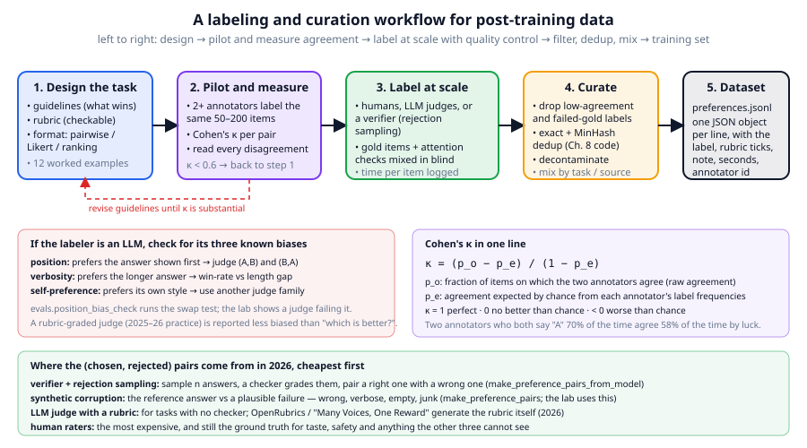

# Chapter 16: Data labeling and curation for post-training

**Part III · ~2.5 hours · Prerequisites: Chapters 8, 14, 15**

> 🎯 Goal: Design a labeling task, measure annotator agreement, and curate a preference dataset.
> 🧪 Lab: `labs/lab16_labeling.py` · 🎛️ Interactive: `interactive/16_labeling_tool.html`

## Why this matters

Chapter 15 trained on demonstrations with a verifiable answer, so nobody had to decide what "good" meant: the string either matched or it did not. Almost nothing a real assistant does is like that. Which of two explanations of a tax rule is better? Which refusal is polite without being preachy? Which of five essay drafts should the model learn to prefer? For those questions the training signal is a human (or, increasingly, a model) *judgement*, and the entire preference-learning stage of Chapter 17 is only as good as those judgements. Judgements are noisy in specific, measurable ways. Two careful annotators given the same twelve items in this chapter's interactive agree on eight of them, which sounds fine until you compute that they would have agreed on six by luck, so their real agreement is about a third of the way from chance to perfect. LLM judges are cheaper and more consistent than people and have their own biases: they prefer whichever answer is shown first, the longer answer, and text in their own style. This chapter is the craft of turning "which is better?" into data you can train on: writing guidelines, choosing a label format, measuring agreement with **Cohen's kappa**, controlling quality, catching a biased judge, and then filtering, deduplicating and mixing what survives. The lab builds a preference set of 60 pairs (300 in `--full`), simulates two annotators, and writes the result in exactly the JSONL format the interactive exports.

## The idea in pictures 📐



The figure's top row is the workflow, and the loop from box 2 back to box 1 is the part most teams skip. First you **design the task**: write **annotation guidelines**, a document that tells the labeler what wins and why, with worked examples of every trap; choose a **rubric**, a checklist of yes/no properties (is the final answer correct? does it follow the length instruction?) that turns a gut feeling into something two people can compare; and pick a format. Then you **pilot**: two or more annotators label the same 50–200 items, you compute kappa between every pair of them, and you read every disagreement. Disagreements are of two kinds. Some are slips (an annotator did not recompute `17 × 24`), which better tooling and attention checks fix. Others are ambiguities in the guidelines (the guidelines never said whether a correct-but-longer answer beats a correct-and-minimal one), which only rewriting the guidelines fixes. Only when kappa is "substantial" (above about 0.6 by the usual convention) do you **label at scale**, with **gold items**, questions whose answer is known, mixed in blind so that each annotator's accuracy is measured continuously, and **attention checks**, items designed so that a labeler who is not reading gets them wrong. Then you **curate** the result the way Chapter 8 curated web text: drop items with low agreement or from annotators who failed gold, deduplicate the prompts, decontaminate against your evals (Chapter 8), and mix by task and source. The output is a file of preference records, one JSON object per line.

The two panels below the workflow are the chapter's two measurement tools. The left one lists the three known biases of an LLM labeler and the check for each. The right one is Cohen's kappa in one line. The bottom panel ranks the sources of preference pairs by cost, and is the reason this chapter's lab can run without a single human: for tasks with a checker, the pairs come from the checker.

### Three label formats

**Pairwise comparison** shows two answers to one prompt and asks which is better (or tie): the format of the interactive, of InstructGPT's data, and of DPO. People are far more consistent at "which is better?" than at "how good is this?"; the cost is that ranking n answers fully needs on the order of n² comparisons. **Likert rating** scores one answer on a fixed scale (1–5 or 1–7): cheap and absolute, but annotators drift (one person's 4 is another's 3) and the scale compresses at the top. **Ranking** orders k answers at once; InstructGPT used k between 4 and 9 and expanded each ranking into all its pairwise comparisons. The 2026 default is pairwise labels with a rubric attached, so each comparison also records *why*; the rubric ticks are what later trains a rubric-based reward model (Chapter 17).

### Cohen's kappa

Raw agreement, the fraction of items on which two annotators give the same label, is the number everyone reports first, and it misleads. If both annotators say "A" 70% of the time, they agree on about 58% of items without reading them. **Cohen's kappa** corrects for that:

$$\kappa = \frac{p_o - p_e}{1 - p_e}$$

Read this as: take the observed agreement $p_o$, subtract the agreement $p_e$ you would expect from two annotators who picked labels at random with the same frequencies, and divide by the most you could possibly gain over chance, $1 - p_e$. Kappa is 1 for perfect agreement, 0 when the annotators agree no more than chance would predict, and negative when they agree *less* than chance. The chance term is $p_e = \sum_c P_1(c)\,P_2(c)$, the sum over labels $c$ of the product of the two annotators' label frequencies. The interpretation bands quoted everywhere, slight (< 0.2), fair (0.2–0.4), moderate (0.4–0.6), substantial (0.6–0.8), almost perfect (> 0.8), come from Landis and Koch (1977) and are a convention, not a law; they were proposed for medical raters, and a preference dataset with kappa of 0.5 can still be useful if the disagreements are on genuinely borderline items.

A worked example by hand, using the interactive's built-in data. The reference labels for its twelve items are `A B A A A B B A tie A A B`; the built-in "noisy" annotator gives `B B A A A B A A A A B B`. They agree on items 2, 3, 4, 5, 6, 8, 10 and 12: eight of twelve, so $p_o = 8/12 = 0.667$. The reference says A seven times, B four times and tie once; the noisy annotator says A seven times, B five times, tie never. So $p_e = \tfrac{7}{12}\cdot\tfrac{7}{12} + \tfrac{4}{12}\cdot\tfrac{5}{12} + \tfrac{1}{12}\cdot 0 = \tfrac{49 + 20}{144} = 0.479$. Then $\kappa = (0.667 - 0.479)/(1 - 0.479) = 0.188/0.521 = 0.36$: "fair", from a raw agreement of two-thirds. The lab recomputes this example and checks it to three decimals.

## The idea in code

There is no labeling module in `llm/`; the tools this chapter uses are spread over `llm/reward.py` (pairs), `llm/evals.py` (judges and the bias check) and `llm/data.py` (dedup and mixing), because labeling is glue between stages rather than a stage of its own. The imports:

```python
import json, random
from collections import Counter
from llm.reward import PreferencePair, make_preference_pairs, make_preference_pairs_from_model
from llm.evals import rule_based_judge, position_bias_check
from llm.data import exact_dedup, minhash_dedup, mix_sources, shingles, jaccard, CurationReport
from llm.tasks import make_examples
```

### Step 1: a preference pair, and where pairs come from

A **preference pair** is `(prompt, chosen, rejected)`: two answers to one prompt and the verdict that the first is better. `reward.PreferencePair` stores the prompt as chat messages so the pair can be rendered with the same template as SFT. Cheapest of all is to *manufacture* the rejected answer: take a task with a reference answer and corrupt it in one of the ways real models fail.

```python
examples = make_examples(30, seed=0, tasks=["upper", "reverse", "add", "count"])
pairs = make_preference_pairs(examples, n_wrong_styles=2, seed=0)   # 60 pairs
p = pairs[4]
p.prompt_messages[-1]["content"], p.chosen, p.rejected, p.meta["style"]
# ('What is 36 + 17?', '36 + 17 = 53',
#  'That is a great question. After careful thought, 36 + 17 = 55. Let me know if you need more.', 'verbose')
```

The five failure styles in `reward.WRONG_STYLES` are `wrong` (a plausible incorrect answer), `off_by_one`, `verbose` (a wrong answer wrapped in chat filler), `empty` (`"I don't know."`) and `junk` (the *correct* answer followed by rambling). The last one matters: a verifier accepts `5 kite kite kite kite` because the number is right, so only a reward model that has learned "clean and short wins" can rank it below `5`. That is the kind of taste preference learning exists to teach.

One step more realistic is **rejection sampling**: sample several answers from the model itself, grade them with the verifier, and pair a correct one with an incorrect one. This produces *on-policy* pairs (Chapter 14): the rejected answer is a mistake the model actually makes, not one we imagined.

```python
pairs_op, stats = make_preference_pairs_from_model(model, tok, examples[:8], n_samples=4, max_new_tokens=12)
stats   # {'n_prompts': 8, 'n_pairs': 0, 'n_all_correct': 0, 'n_all_wrong': 8, 'sample_accuracy': 0.0}   (base model)
```

On the base model every sample is wrong, so there is nothing to rank and no pair is produced; on the SFT model from Chapter 15 the same call returns pairs for every prompt where at least one of four samples is right and one is wrong. Prompts where *all* samples agree, right or wrong, teach nothing about ranking and are skipped: this is the same "no gradient from a uniform group" property that GRPO has (Chapter 19).

### Step 2: kappa in twelve lines

```python
def cohens_kappa(labels1, labels2):
    n = len(labels1)
    p_o = sum(a == b for a, b in zip(labels1, labels2)) / n             # observed agreement
    c1, c2 = Counter(labels1), Counter(labels2)
    p_e = sum((c1[c] / n) * (c2[c] / n) for c in set(c1) | set(c2))       # chance agreement
    return (p_o - p_e) / (1 - p_e) if p_e < 1 else 1.0, p_o, p_e

ref   = "A B A A A B B A tie A A B".split()
noisy = "B B A A A B A A A A B B".split()
cohens_kappa(ref, noisy)          # (0.360, 0.667, 0.479)
```

The lab simulates its annotators rather than employing them: the *perfect* annotator returns the gold label, and the *noisy* annotator returns the gold label with probability $1 - f$ and otherwise the other answer (or, a quarter of the time, a tie). Because a labeling tool shows the two answers in a random order, the gold label is `A` or `B` per item, not always "chosen", and that randomisation is itself a defence against **position bias**, the tendency to prefer whichever answer is shown first, in the *annotators*.

### Step 3: the swap test for judges

An **LLM-as-labeler** (or LLM-as-judge) is a model prompted with the guidelines and the two answers and asked for a verdict. `evals.position_bias_check` runs the judge on `(a, b)` and again on `(b, a)`, translates the second verdict back, and reports whether they agree.

```python
first_wins  = lambda prompt, a, b: "A"                       # a judge with pure position bias
longer_wins = lambda prompt, a, b: "A" if len(a) > len(b) else "B" if len(b) > len(a) else "tie"
ex = pairs[0].meta["example"]
position_bias_check(rule_based_judge, ex, pairs[0].chosen, pairs[0].rejected)
# {'forward': 'A', 'swapped': 'A', 'consistent': True, 'position_bias': False}
position_bias_check(first_wins, ex, pairs[0].chosen, pairs[0].rejected)
# {'forward': 'A', 'swapped': 'B', 'consistent': False, 'position_bias': True}
```

`rule_based_judge` is the library's stand-in for an LLM: it consults the verifier when it can, then prefers non-empty over empty and shorter over longer when both contain digits. It is consistent under swapping because none of its rules mention position. A real LLM judge is not; Zheng et al. (2023) found GPT-4 as a judge switched its verdict when the order was swapped on a substantial fraction of pairs and preferred longer answers, and every 2026 judging pipeline still runs both orders and either averages or discards inconsistent verdicts.

### Step 4: dedup and mix, with Chapter 8's tools

Instruction prompts are documents, so the pretraining curation code applies unchanged. `exact_dedup` hashes the text; `minhash_dedup` (Chapter 8) shingles it into 3-word pieces and drops documents whose estimated Jaccard similarity to an earlier one is above a threshold.

```python
docs = [{"text": ex.prompt, "source": ex.task} for ex in make_examples(120, seed=7, tasks=["upper", "reverse", "add", "count", "story_qa"])]
report = CurationReport()
kept = minhash_dedup(exact_dedup(docs, report), threshold=0.8, report=report)
jaccard(shingles("Write in capitals: kite"), shingles("Write in capitals: kite please"))   # 0.67: NOT a near-dup at 0.8
mixed = mix_sources(kept, {"add": 3, "count": 1, "reverse": 2, "upper": 2, "story_qa": 2}, n_out=len(kept), seed=0)
```

The `jaccard` line is the important caveat: 3-word shingles on a 4-word prompt give two or three shingles, so a one-word edit moves the similarity from 1.0 to 0.67, and the near-duplicate survives a 0.8 threshold. MinHash was designed for documents of hundreds of words; for short prompts you lower the threshold, use character shingles, or (2026 practice) embed the prompts and dedup by cosine similarity. `mix_sources` then re-samples the survivors with replacement to a target weighting per source, exactly as Chapter 13 mixed stories and math.

### Step 5: the file format

The interactive exports one JSON object per line with nine fields: `id`, `prompt`, `response_a`, `response_b`, `label` (`"A"`, `"B"` or `"tie"`), `rubric` (the list of ticked criteria, 1-based), `note`, `seconds` (time spent on the item) and `annotator`. The lab writes the same format and reads it back into `PreferencePair`s, skipping ties, which carry no ranking information:

```python
rows = [json.loads(line) for line in open(run_path("preferences.jsonl"))]
row = rows[0]
chosen, rejected = (row["response_a"], row["response_b"]) if row["label"] == "A" else (row["response_b"], row["response_a"])
PreferencePair([{"role": "user", "content": row["prompt"]}], chosen, rejected, meta={"rubric": row["rubric"]})
```

Keeping `seconds` and `annotator` in the record is not bureaucracy: items labelled far faster than an annotator's median are the first to audit, and per-annotator kappa against gold is how you decide whose labels to keep.

## Worked example 🧪

```bash
python3 labs/lab16_labeling.py            # quick: 30 prompts, about 15 s
python3 labs/lab16_labeling.py --full     # 150 prompts, a finer flip-rate sweep, 40 on-policy prompts from the small SFT model
```

(Nothing here trains a model. Sections 1 to 6 take a few seconds; section 7 samples from a model, and its time depends on how busy the CPU is: on the shared machine used for the final review it took 6 s in quick mode and about four minutes for the full run's 40 prompts with the small model, and a few seconds each on an idle CPU.)

Section 1 builds the set. Thirty prompts on four tasks, two failure styles each:

```
30 prompts -> 60 pairs (2 failure styles per prompt)
failure styles: {'junk': 8, 'wrong': 15, 'empty': 16, 'verbose': 9, 'off_by_one': 12}
  [count  |junk      ] 'How many words: green drum bird cat pear'
      chosen  : '5'
      rejected: '5 kite kite kite kite'
  [add    |verbose   ] 'What is 36 + 17?'
      chosen  : '36 + 17 = 53'
      rejected: 'That is a great question. After careful thought, 36 + 17 = 55. Let me know if you need more.'
```

Section 2 is the agreement measurement. The noisy annotator flips 20% of labels:

```
n = 60 items | raw agreement p_o = 0.850 | chance agreement p_e = 0.468 | kappa = 0.718
confusion (rows: perfect, cols: noisy)     A     B   tie
                                     A    22     2     1
                                     B     2    29     4
                                   tie     0     0     0
✅ kappa is below raw agreement: chance agreement is subtracted
the interactive's 12-item example: p_o = 0.667 (8/12), p_e = 0.479 (69/144), kappa = 0.360
✅ matches the by-hand computation in the chapter
flip rate -> kappa: 0.00->1.00, 0.10->0.68, 0.20->0.52, 0.30->0.62, 0.50->0.21
```

Read the confusion matrix: 51 of 60 items on the diagonal, and the off-diagonal entries are the nine flips (four of them to `tie`). Raw agreement 0.85 becomes kappa 0.72, because two annotators who both say `B` a little over half the time would agree on 47% of items by chance. The flip-rate line is noisy at 60 items (0.20 gives 0.52 and 0.30 gives 0.62, in the wrong order), which is itself a lesson: with a pilot of 60 items the standard error on kappa (the typical sampling wobble of the estimate) is about ±0.1, and you cannot tell a 20% annotator from a 30% one. The `--full` run uses 300 items and the curve comes out monotonic:

```
n = 300 items | raw agreement p_o = 0.783 | chance agreement p_e = 0.471 | kappa = 0.591
flip rate -> kappa: 0.00->1.00, 0.05->0.90, 0.10->0.75, 0.15->0.73, 0.20->0.59, 0.30->0.50, 0.40->0.31, 0.50->0.18, 0.70->-0.12
```

Kappa falls faster than the flip rate rises: a labeler who is wrong one time in twenty still delivers "almost perfect" agreement (0.90), one wrong in five lands on the moderate/substantial border (0.59), one wrong in three delivers "moderate" (0.50), and one who flips 70% is *worse than chance* (−0.12), which is what a negative kappa means. The 60-item kappa of 0.72 and the 300-item kappa of 0.59 come from the same 20% annotator, which is the ±0.1 sampling noise made visible. The curve is the lab's left-hand figure panel.

Section 3 runs the swap test on three judges:

```
  rule_based_judge (verifier)  position-bias rate 0.00 | accuracy vs gold (random order) 0.92 | ...on 'verbose' pairs 1.00
  first_wins                   position-bias rate 1.00 | accuracy vs gold (random order) 0.42 | ...on 'verbose' pairs 0.44
  longer_wins                  position-bias rate 0.00 | accuracy vs gold (random order) 0.08 | ...on 'verbose' pairs 0.00
```

Three different failures. `first_wins` is exposed by the swap test on every pair, and when the answers are presented in random order it scores 0.42, chance. `longer_wins` passes the swap test perfectly (length does not depend on order) and is still nearly always wrong, because every `verbose` and `junk` rejected answer is longer than the clean correct one: this is **verbosity bias**, the tendency of a judge to prefer the longer answer regardless of content, and the swap test cannot see it. You catch it by comparing win-rate against length difference, or, as here, by planting pairs whose rejected answer is long. The verifier-backed judge misses 8% of pairs: those are `junk` pairs, where both answers are correct by the verifier and the rule falls through to a tie. **Self-preference bias**, the third one on the figure, is a judge preferring text in its own style, and cannot be shown with a rule-based judge; the check is to use a judge from a different model family than the one that wrote the answers.

Section 4 deduplicates 120 generated prompts plus 13 planted near-duplicates:

```
120 generated prompts + 13 planted near-duplicates = 133 -> 108 kept
stage                           kept  dropped  planted problems caught
exact_dedup                      116       17  near_dup_short:1
minhash_dedup                    108        8  near_dup:8
exact duplicates among the GENERATED prompts: 17 (a 55-word pool makes 'Write in capitals: kite' recur)
why the short near-dups survive: Jaccard({'in capitals kite', 'write in capitals'}, {'in capitals kite', 'write in capitals', 'capitals kite please'}) = 0.67 < 0.8
✅ MinHash caught all 8 planted story near-duplicates
✅ ...and none of the 5 short ones: 3-word shingles on a 4-word prompt are too coarse
```

Seventeen of the 120 generated prompts were exact repeats: with a 55-word pool, `Write in capitals: kite` comes up again and again, and a preference set with the same prompt ten times over-weights that prompt ten-fold in DPO. In `--full`, 160 of 600 generated prompts are exact repeats, more than a quarter. MinHash then catches every one of the eight (thirty in `--full`) story prompts whose question was edited by two words (their forty-odd shingles overlap at about 0.9), and none of the five four-word prompts with ` please` appended, for the reason the `jaccard` line prints. Real instruction sets have both kinds: long multi-paragraph prompts that MinHash handles, and short ones that need a different tool.

Section 5 re-mixes the 108 survivors with `add` up-weighted 3:1 (22 → 30 items) and `count` down-weighted (19 → 14); in `--full` the same weights take `reverse` from 49 to 94 items and `count` from 109 to 48, which is the lever you pull when one task is over-represented in what the labelers happened to receive. Section 6 writes the two annotators' files:

```
first line: {"id": 1, "prompt": "How many words: green drum bird cat pear", "response_a": "5 kite kite kite kite", "response_b": "5", "label": "B", "rubric": [1, 2, 3], "no...
✅ fields match interactive/16_labeling_tool.html's export exactly
read back 60 pairs from the perfect annotator (60 identical to the originals); 55 from the noisy one (5 ties skipped)
✅ kappa recomputed from the two files = 0.718 (paste them into the interactive to confirm)
```

`runs/preferences.jsonl` and `runs/preferences_annotator2.jsonl` can be pasted into the interactive's two kappa boxes, which will print the same 0.718. Section 7 tries rejection sampling. Before Lab 15 has run, it falls back to the base model, and the result is the on-policy lesson of Chapter 14 in one line:

```
stats: {'n_prompts': 8, 'n_pairs': 0, 'n_all_correct': 0, 'n_all_wrong': 8, 'sample_accuracy': 0.0}
✅ a base model is almost never right, so rejection sampling yields (almost) no pairs: on-policy data needs a policy that sometimes succeeds
```

Once `runs/sft_nano.pt` exists, the quick run samples four answers per prompt from it at temperature 1:

```
sampling 4 answers x 8 prompts from runs/sft_nano.pt: 6.2s
stats: {'n_prompts': 8, 'n_pairs': 2, 'n_all_correct': 0, 'n_all_wrong': 6, 'sample_accuracy': 0.1875}
  'Write in capitals: boat': chosen 'BOAT' | rejected 'WOAT'
  'Write in capitals: lake': chosen 'LAKE' | rejected 'OXar'
```

Six of eight prompts had four wrong samples and produced nothing; two had at least one right and one wrong, and those give pairs whose rejected answer (`WOAT`) is a mistake this model actually makes, not one we invented. That is the difference between on-policy and synthetic preference data, and why the rejected side of a good preference set looks like the model's own near-misses. With `runs/sft_small.pt` from the `--full` run of Lab 15, the `--full` run samples 40 prompts:

```
sampling 4 answers x 40 prompts from runs/sft_small.pt: 229.6s
stats: {'n_prompts': 40, 'n_pairs': 7, 'n_all_correct': 24, 'n_all_wrong': 9, 'sample_accuracy': 0.7}
  'Reverse the word: rope': chosen 'epor' | rejected 'ypor'
  'How many words: flag small hat black': chosen '4' | rejected '6'
  'How many words: frog small': chosen '2' | rejected '4'
prompts with all-correct samples: 24, all-wrong: 9 — neither kind produces a pair
```

Now the arithmetic runs the other way: the small SFT model gets 70% of its samples right, so 24 of 40 prompts produce four correct answers and teach nothing about ranking either. Only 7 prompts fall in the band where the model is *sometimes* right, and those are the ones worth labelling. This is why rejection-sampling pipelines raise the temperature, sample more than four answers, and steer the prompt distribution toward the model's current frontier (the 2026 papers below make that steering explicit): a preference set is most informative exactly where the policy is undecided.

The lab saves `figures/generated/lab16_labeling.png`: kappa against flip rate on the left; on the right, for each judge, the swap-test failure rate (position bias) next to the error rate on long-but-wrong pairs (verbosity bias), which shows that the two checks catch different judges.

## 🆕 2026: rubrics, failure-driven data, and synthesis

Three developments since 2025 change who writes the labels.

- **Generated rubrics.** Instead of a human writing a rubric per task, a model writes one per *prompt*: OpenRubrics (ACL 2026) is reported to generate contrastive rubrics from a chosen/rejected pair and to train a rubric-following reward model on them; "Many Voices, One Reward" (arXiv 2607.01830) is described as generating rubrics from several simulated reviewer roles and aggregating them. A rubric-graded judge is reported to be less susceptible to verbosity and position effects than a free-form "which is better?" prompt, because each criterion is checked separately. Kimi K2's self-critique rubric reward (Chapter 14) is the same idea inside the RL loop. https://aclanthology.org/2026.acl-long.791/ · https://arxiv.org/abs/2607.01830
- **Failure-driven data.** SENTINEL (arXiv 2606.12908) describes failure-driven RL for tool agents: as reported, it mines a tool-using agent's failures and synthesises training data that targets each failure mode, closing the loop from evals back to data that Chapter 14's figure drew as a dashed arrow. The reported gains come from labelling what the model gets *wrong*, not from more of what it gets right. https://arxiv.org/abs/2606.12908
- **Online data synthesis.** RODS (arXiv 2606.19047) is described as online data synthesis for multi-turn tool use: training data generated *during* RL from the current policy's trajectories, so that the prompt distribution tracks the policy. It is the on-policy principle applied to the prompts themselves. https://arxiv.org/abs/2606.19047

What is settled: measure agreement before scaling; run the swap test on every LLM judge; deduplicate prompts; keep per-annotator provenance. What is open: how much human labelling a frontier model still needs (public reports suggest it is concentrated on safety, taste and the long tail rather than on capability), and whether generated rubrics drift toward what the generating model likes rather than what users want.

🎛️ **Interactive.** Open `interactive/16_labeling_tool.html`. Read the five guidelines, then label the twelve items with the keyboard (`A`, `B`, `T`, arrow keys), ticking rubric boxes as you go. Several items contain the traps the guidelines warn about: item 1's derivation ends in a slip, item 12 asks for one word. Export your JSONL, load the reference labels as annotator 2 and compute kappa; if it is below 1, decide for each disagreement whether it was your slip or an ambiguous guideline. Then load the noisy annotator and reproduce the 0.36 computed by hand above. The Challenge asks why kappa can be far below raw agreement.

## Try it yourself ✍️

1. **Your own labels.** Label the interactive's twelve items, export the JSONL, save it as `runs/my_labels.jsonl`, and compute kappa against the reference with the lab's `cohens_kappa`. Which items did you get wrong, and would a change to the guidelines have prevented it?
2. **Kappa with three labels vs two.** Re-run the noisy-annotator simulation with ties disabled (always flip to the other side). Does kappa at flip rate 0.2 go up or down? Explain using $p_e$.
3. **Standard error of kappa.** Bootstrap the 60-item kappa (resample items with replacement 1,000 times, as `evals.bootstrap_ci` does for accuracy). How wide is the 95% interval? How many items would you need to distinguish kappa 0.6 from 0.7?
4. **A verbosity-aware check.** Write `verbosity_check(judge, pairs)` that reports the judge's win-rate for the longer answer, split by whether the longer answer is the chosen one. Run it on the three judges. Which of them does the swap test miss and this catch?
5. **Short-prompt dedup.** Replace `shingles` with character 5-grams (a copy of the function using `text[i:i+5]`) and re-run the dedup section. Does the ` please` near-duplicate get caught at 0.8 now? What happens to the story near-duplicates?
6. **Rejection sampling at temperature.** After Lab 15, call `make_preference_pairs_from_model` on the SFT model at temperatures 0.5, 1.0 and 1.5 with 8 samples. Plot `n_pairs` and `sample_accuracy` against temperature. Why is the best temperature for *pairs* not the best for *accuracy*?

## Check yourself ✅

<details><summary>1. Two annotators agree on 85% of items. Why can their Cohen's kappa be 0.72 rather than 0.85, and when could 85% raw agreement give a kappa near 0?</summary>

Kappa subtracts the agreement expected by chance from each annotator's label frequencies: with both saying "B" about 55% of the time, $p_e \approx 0.47$, so $\kappa = (0.85 - 0.47)/(1 - 0.47) = 0.72$. If one label dominated (say 92% "A" for both), $p_e$ would be about 0.85 too, and the same raw agreement would give kappa near 0: they agree only because they both almost always say "A".
</details>

<details><summary>2. What does the swap test detect, what does it not detect, and how would you catch the second thing?</summary>

It detects position bias: a judge whose verdict changes when the two answers are swapped. It cannot detect verbosity bias (preferring the longer answer) or self-preference, because those do not depend on order; `longer_wins` passes the swap test and is wrong 92% of the time. Verbosity bias is caught by comparing win-rate against the length difference, or by planting pairs whose longer answer is wrong; self-preference by judging with a model from a different family than the one that wrote the answers.
</details>

<details><summary>3. Why does <code>make_preference_pairs_from_model</code> return zero pairs from the base model, and what property of on-policy methods does that illustrate?</summary>

It samples several answers per prompt, grades them, and pairs a correct one with an incorrect one; the base model never produces a correct answer, so there is nothing to rank. On-policy data (and GRPO) need a policy that already succeeds sometimes; prompts where all samples score the same yield no ranking signal and no gradient.
</details>

<details><summary>4. MinHash at threshold 0.8 caught every edited story prompt and none of the four-word prompts with " please" appended. Why?</summary>

MinHash estimates Jaccard similarity of 3-word shingle sets. A forty-word story has about forty shingles and a two-word edit changes only a few, so similarity stays around 0.9. A four-word prompt has two shingles; appending one word adds a third, and 2/3 = 0.67 is below 0.8. Short texts need a lower threshold, character shingles, or embedding-based dedup.
</details>

<details><summary>5. Name the nine fields the interactive exports and say which two are for quality control rather than for training.</summary>

`id`, `prompt`, `response_a`, `response_b`, `label`, `rubric`, `note`, `seconds`, `annotator`. `seconds` and `annotator` do not enter the loss; they let you audit items labelled implausibly fast and compute per-annotator agreement against gold to decide whose labels to keep.
</details>

## Key takeaways

- Write guidelines with worked traps and a rubric before labelling anything; pilot on 50–200 shared items; read every disagreement.
- Pairwise labels with a rubric are the 2026 default; Likert drifts, rankings are pairwise labels in bulk.
- Report Cohen's kappa, not raw agreement: $\kappa = (p_o - p_e)/(1 - p_e)$; the interactive's 67% raw agreement is kappa 0.36.
- LLM judges have position, verbosity and self-preference biases; the swap test catches only the first, so plant long-but-wrong pairs and use a different judge family.
- Cheap preference pairs come from verifiers (rejection sampling) and synthetic corruption; on-policy pairs need a model that sometimes succeeds.
- Prompts are documents: exact-dedup, MinHash (with care for short texts), decontaminate, and mix by task before training.

## Going deeper

- Cohen, J. "A coefficient of agreement for nominal scales" (1960). The original kappa paper; Landis, J. R. and Koch, G. G. (1977) for the interpretation bands.
- Ouyang, L. et al. InstructGPT (2022), section 3 and appendix B. The labelling guidelines, the ranking interface and the inter-annotator agreement numbers (about 73% on pairwise items) of the original RLHF dataset. https://arxiv.org/abs/2203.02155
- Zheng, L. et al. "Judging LLM-as-a-Judge with MT-Bench and Chatbot Arena" (2023). Position, verbosity and self-enhancement bias measured, and the swap test. https://arxiv.org/abs/2306.05685
- Bai, Y. et al. "Constitutional AI" (2022). Labels from a model following a written document, the origin of RLAIF and of rubric-style judging. https://arxiv.org/abs/2212.08073
- Wang, Y. et al. "Self-Instruct" (2022) and Xu, C. et al. "WizardLM: Evol-Instruct" (2023). Synthetic instruction generation, whose outputs need exactly the dedup and filtering of this chapter.
- 🆕 OpenRubrics (ACL 2026). Contrastive rubric generation and rubric-following reward models. https://aclanthology.org/2026.acl-long.791/
- 🆕 "Many Voices, One Reward" (2026). Multi-role rubric generation for reward modelling. https://arxiv.org/abs/2607.01830
- 🆕 SENTINEL (2026), failure-driven data for tool agents, and RODS (2026), online data synthesis for multi-turn tool use. https://arxiv.org/abs/2606.12908 · https://arxiv.org/abs/2606.19047

---

← [Chapter 15](15-sft.md) · [Course home](../README.md) · [Chapter 17](17-reward-models-and-dpo.md) →
