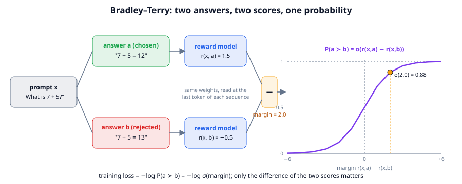
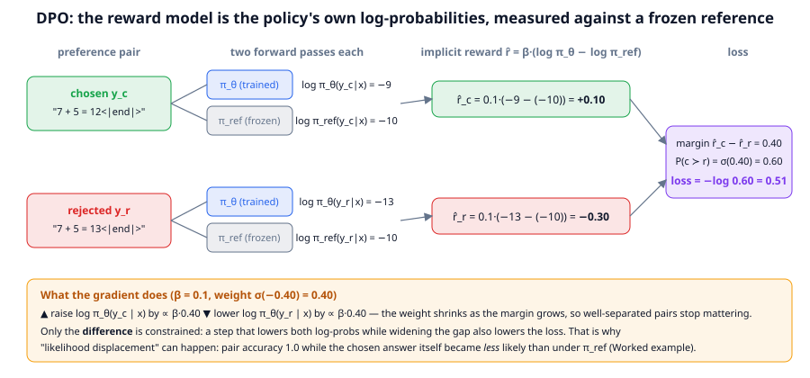
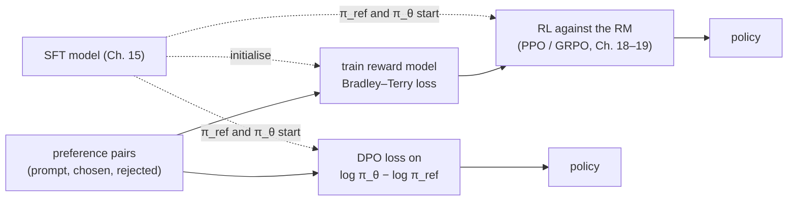

# Chapter 17: Reward models and preference optimization

**Part III · ~3 hours · Prerequisites: Chapters 14, 15, 16**

> 🎯 Goal: Train a reward model and run DPO, and explain when to use which.
> 🧪 Lab: `labs/lab17_reward_dpo.py` · 🎛️ Interactive: `interactive/17_dpo_explorer.html`

## Why this matters

After SFT (Chapter 15) TinyLM answers questions in the right format, but it is only imitating the demonstrations it was shown. It has no notion of *better* and *worse*: two answers that are both grammatical, both on-topic and both the right length look identical to a next-token loss even when one of them is wrong. Chapter 16 showed how to collect human judgements of the form "answer A is better than answer B". This chapter turns those judgements into a training signal. There are two routes. The classic one, from InstructGPT (2022), trains a separate **reward model**, a network that reads a prompt and an answer and outputs one number, and then uses reinforcement learning (Chapter 18) to make the policy produce answers that score highly. The 2023 shortcut, **Direct Preference Optimization (DPO)**, skips the separate model and turns each comparison directly into a loss on the policy's own probabilities. Both routes share one danger, which the lab measures rather than describes: a reward is a *proxy* for what you want, and a policy optimised hard enough against a proxy finds its blind spots. That failure has two names: **reward hacking**, when a policy scores highly by exploiting flaws in the reward instead of doing the task, and **Goodhart's law**, the older observation that "when a measure becomes a target it ceases to be a good measure". On a 380k-parameter reward model the blind spot is obvious (it learns "short and well-formed" long before it learns arithmetic); on a frontier model it is subtler, but it is the same phenomenon.

## The idea in pictures 📐

### From comparisons to a number

A human can say "A is better than B" far more reliably than they can say "A is a 7 out of 10". The **Bradley–Terry model** (1952, originally for ranking chess players and sports teams) is the standard way to turn pairwise comparisons into scores. Every item gets a hidden number, its *strength*, and the probability that A beats B depends only on the difference of the two strengths.



In the figure the prompt "What is 7 + 5?" has two candidate answers. The reward model, the same network with the same weights, reads each one and produces a score: 1.5 for the chosen answer, −0.5 for the rejected one. The scores are subtracted, and the margin of 2.0 is fed through the **sigmoid** curve on the right, the S-shaped function σ(z) = 1 / (1 + e^(−z)) that squashes any real number into a probability. σ(2.0) = 0.88: the model is claiming an 88 % chance that a person would prefer answer a. Two things about the picture matter for everything that follows. First, only the *difference* of the scores enters: adding 100 to every score changes nothing, which is why reward-model scores have no absolute meaning and cannot be compared across models. Second, the sigmoid never reaches 0 or 1, so the training loss keeps asking for a slightly larger margin no matter how well separated a pair already is.

### DPO: the policy is its own reward model

DPO's insight is that the reward model does not need to be a separate network. If you write down what the *optimal* policy under a reward looks like (the policy that maximises reward while staying close to a reference model), you can solve for the reward in terms of the policy and plug it into Bradley–Terry.



Read the figure left to right. A preference pair supplies a chosen and a rejected answer to the same prompt. Each answer goes through two models: the **policy** π_θ, which is being trained, and a frozen copy of it made before training started, the **reference** π_ref. Each pass produces the summed log-probability of the answer's tokens. The **implicit reward** of an answer is β times how much more likely the policy makes it than the reference does: for the chosen answer, 0.1·(−9 − (−10)) = +0.10; for the rejected one, 0.1·(−13 − (−10)) = −0.30. From here it is Bradley–Terry again: the margin is 0.40, σ(0.40) = 0.60, and the loss is −log 0.60 = 0.51. The gradient raises log π_θ of the chosen answer and lowers that of the rejected one, weighted by σ(−β·margin), which shrinks as a pair becomes well separated. The bottom band of the figure states the catch that the lab reproduces: the loss constrains only the *difference*. Lowering both answers while widening the gap also lowers the loss, and that is exactly what happens when the chosen and rejected answers share most of their tokens. The effect is called **likelihood displacement**: the pairs become well separated while the chosen answers themselves become *less* likely than they were under the reference.

The two routes side by side:



Read the flow as: both routes start from the SFT model and the same pairs. The top route trains a reusable reward model that can score *any* answer, including ones sampled during RL; the bottom route trains the policy directly and only ever sees the answers in the pairs. That difference, "can the reward be evaluated on new samples?", is the main thing to remember when choosing between them.

An analogy: a reward model is a judge who has watched a few hundred head-to-head contests and now scores contestants on a private scale. DPO is a coach who never writes scores down and instead tells the athlete, for each pair of past performances, "more like this one, less like that one". The limit of the analogy: the judge can score a performance she has never seen, the coach can only compare performances that were already recorded.

## The idea in code

The library files are `llm/reward.py` (about 420 lines) and `llm/dpo.py` (about 300 lines). The imports for this chapter:

```python
import copy, torch
from llm import tasks
from llm.pipeline import get_tokenizer, run_path
from llm.model import TinyLM
from llm.reward import (RewardModel, bradley_terry_loss, make_preference_pairs,
                        make_preference_pairs_from_model, train_reward_model, RMConfig,
                        reward_accuracy, score_completions, rubric_reward, ARITHMETIC_RUBRIC)
from llm.dpo import (sequence_logprob, dpo_loss, ipo_loss, simpo_loss, orpo_loss,
                     DPOConfig, dpo_train, dpo_eval, make_reference)
```

### Step 1: the Bradley–Terry loss

Write r_a for the score of the chosen answer and r_b for the rejected one. The model says

$$P(a \succ b) = \sigma(r_a - r_b) = \frac{1}{1 + e^{-(r_a - r_b)}}$$

Read this as: "the probability that a beats b is the sigmoid of the score gap; a gap of 0 means a coin flip, a gap of +2 means 88 %, a gap of −2 means 12 %." Here is why that particular formula and not another. Suppose each answer's true quality is its score plus some random noise in the judge's head, and the judge picks whichever noisy quality is larger. If the noise has a *logistic* distribution, the probability that a's noisy quality exceeds b's works out to exactly σ(r_a − r_b) (a Gaussian noise assumption gives the closely related Thurstone model, with a Gaussian curve in place of the sigmoid). So Bradley–Terry is "the judge compares qualities, with logistic noise", and it has the property we need: it depends only on differences.

We want the model to assign high probability to the comparisons humans actually made, so we minimise the negative log of that probability:

$$\mathcal{L}_{\text{BT}} = -\log \sigma(r_{\text{chosen}} - r_{\text{rejected}})$$

Read this as: "pay a penalty equal to how surprised the model is that the chosen answer won." When the margin is 0 the loss is log 2 ≈ 0.693; a margin of +2 costs 0.127; a margin of −2 costs 2.13. The library's version is one line:

```python
r_c, r_r = torch.tensor([1.5, 0.0]), torch.tensor([-0.5, 0.0])
print(bradley_terry_loss(r_c, r_r))      # tensor(0.4100): mean of -log σ(2.0)=0.127 and -log σ(0)=0.693
```

### Step 2: the reward model is TinyLM with a different head

`RewardModel` keeps the whole Transformer and replaces the language-model head (d_model → V) with a single linear unit (d_model → 1), read at the *last real token* of the sequence. In a causal model the last position is the only one that has attended to everything before it, so its hidden state is the summary of prompt plus answer. The head is initialised to zero so every sequence starts at reward 0, a neutral point for the loss.

```python
tok = get_tokenizer()
sft = TinyLM.load(run_path("lab17_sft_nano.pt"))          # the SFT warm start the lab makes
rm = RewardModel(copy.deepcopy(sft))                        # InstructGPT: RM starts from the SFT model
ids = torch.randint(0, tok.vocab_size, (3, 12))             # (B=3, T=12) right-padded ids
lengths = torch.tensor([12, 5, 9])                          # real lengths per row
print(rm(ids, lengths).shape)                               # torch.Size([3]) — one number per row
```

The forward pass returns one score per row. Padding after the last real token cannot change the score, because causal attention never lets a later position influence an earlier one; the test suite checks this.

### Step 3: where preference pairs come from

`PreferencePair` holds the prompt messages, a `chosen` string and a `rejected` string. The library builds them two ways. `make_preference_pairs` is synthetic: the chosen answer is the task's reference answer and the rejected one is a plausible failure in one of five *styles*: `wrong` (a different number), `off_by_one`, `verbose` (the right shape wrapped in hedging), `empty` ("I don't know.") and `junk` (the correct answer followed by rambling). The `junk` style is worth noticing: a verifier would still accept it, so only a reward model that has learned "short and clean is better" can rank it below the plain answer.

```python
examples = tasks.make_examples(4, seed=3, tasks=["add"], max_value=20)
for p in make_preference_pairs(examples, n_wrong_styles=1, seed=0):
    print(f"[{p.meta['style']:>10}] chosen={p.chosen!r:14} rejected={p.rejected!r}")
# [      junk] chosen='17 + 4 = 21'  rejected='17 + 4 = 21 and the moon is blue blue blue'
# [off_by_one] chosen='19 + 15 = 34' rejected='19 + 15 = 33'
# [      junk] chosen='2 + 19 = 21'  rejected='2 + 19 = 21 kite kite kite kite'
# [     empty] chosen='15 + 8 = 23'  rejected='Sorry, I cannot answer that.'
```

`make_preference_pairs_from_model` builds **on-policy pairs**: it samples several answers *from the model being trained*, grades each with the verifier, and pairs one correct sample with one incorrect one. Prompts where every sample is right or every sample is wrong yield no pair, and the returned `stats` say how many prompts fell into each bucket. On-policy pairs are what every 2025–2026 preference recipe uses, because the rejected answers are the model's *actual* mistakes rather than mistakes someone imagined for it.

### Step 4: training the reward model

`train_reward_model` is the pretraining loop with a different batch and loss: each step takes a mini-batch of pairs, encodes chosen and rejected rows (`_rm_batch` stacks them as one `(2B, T)` tensor), runs the reward model once, splits the scores into two halves and applies the Bradley–Terry loss. It logs the batch **pair accuracy** (fraction of pairs where the chosen answer scored higher) and the mean margin.

```python
pairs = make_preference_pairs(tasks.make_examples(120, seed=0, tasks=["add"], max_value=20), n_wrong_styles=2)
print(reward_accuracy(rm, tok, pairs))                     # 0.0 before training: every margin is exactly 0
hist = train_reward_model(rm, tok, pairs, RMConfig(steps=60, batch_size=8, lr=1e-4, log_every=20))
# [rm] step    0 | loss 0.6931 | pair acc 0.00 | margin +0.000 | ...
# [rm] step   20 | loss 0.6253 | pair acc 0.88 | margin +0.144 | ...
# [rm] step   40 | loss 0.6351 | pair acc 0.88 | margin +0.133 | ...
# [rm] step   59 | loss 0.5260 | pair acc 0.75 | margin +0.396 | ...
print(reward_accuracy(rm, tok, pairs))                     # 0.84 on the training pairs after 60 steps
```

The first loss is exactly log 2, because the zero head gives every pair a margin of 0. The later lines are noisy (a batch of 8 pairs; the exact values shift a little between machines) and will not match yours to the last digit: read the trend, loss down and margin up. About 25 s on an idle laptop CPU; the timing column is omitted. `score_completions(rm, tok, prompt_messages, [c1, c2, c3])` scores several candidates for one prompt, which is all a best-of-N sampler needs.

### Step 5: DPO, derived in plain language

Here is the derivation, one step at a time, with each equation read aloud. Start from the objective that RLHF actually optimises (Chapter 18 does this properly):

$$\max_{\pi_\theta}\; \mathbb{E}_{x,\;y \sim \pi_\theta}\big[r(x, y)\big] - \beta\, \mathrm{KL}\big(\pi_\theta(\cdot|x)\,\|\,\pi_{\text{ref}}(\cdot|x)\big)$$

Read this as: "make answers that score highly, but pay β for every unit of divergence from the reference model." The **KL divergence** is the average, over the policy's own answers, of log π_θ(y|x) − log π_ref(y|x): how much more the policy believes in its answers than the reference does. Without that term the policy would collapse onto whatever single string the reward model likes best.

This objective has a closed-form solution. For each prompt, the best policy is the reference re-weighted by the exponentiated reward:

$$\pi^*(y|x) = \frac{1}{Z(x)}\,\pi_{\text{ref}}(y|x)\,\exp\!\big(r(x,y)/\beta\big)$$

Read this as: "start from the reference distribution and multiply each answer's probability by e^(reward/β), then renormalise." Z(x) is the normaliser, the sum of the numerator over every possible answer, which is astronomically expensive to compute. A large β keeps the re-weighting mild; a small β lets high-reward answers take over.

Now the trick: take the logarithm of both sides and solve for the reward.

$$r(x, y) = \beta \log \frac{\pi^*(y|x)}{\pi_{\text{ref}}(y|x)} + \beta \log Z(x)$$

Read this as: "the reward of an answer is β times how much more the optimal policy likes it than the reference does, plus a term that depends only on the prompt." Plug this reward into Bradley–Terry for a pair with the same prompt. The β log Z(x) term is identical for both answers, so it cancels in the difference:

$$P(y_c \succ y_r) = \sigma\!\Big(\beta \log \frac{\pi^*(y_c|x)}{\pi_{\text{ref}}(y_c|x)} - \beta \log \frac{\pi^*(y_r|x)}{\pi_{\text{ref}}(y_r|x)}\Big)$$

Read this as: "the probability that the chosen answer wins is the sigmoid of the gap between the two implicit rewards." The impossible normaliser is gone. The last step is to replace the unknown optimal policy π* by the policy we are training, π_θ, and minimise the negative log-probability of the human comparisons, exactly as for the reward model:

$$\mathcal{L}_{\text{DPO}} = -\log \sigma\!\Big(\beta\big[(\log \pi_\theta(y_c|x) - \log \pi_{\text{ref}}(y_c|x)) - (\log \pi_\theta(y_r|x) - \log \pi_{\text{ref}}(y_r|x))\big]\Big)$$

Read this as: "compute how much the policy has moved away from the reference on the chosen answer, subtract how much it has moved on the rejected answer, scale by β, and apply the Bradley–Terry loss." Every piece is computable with two forward passes per answer: policy and frozen reference. There is no sampling, no reward model and no RL loop, which is why DPO became the default preference method for open-weight models within a year of its publication.

The gradient makes the behaviour concrete. Differentiating gives

$$\nabla_\theta \mathcal{L}_{\text{DPO}} = -\beta\,\sigma(-\beta\Delta)\,\big[\nabla_\theta \log \pi_\theta(y_c|x) - \nabla_\theta \log \pi_\theta(y_r|x)\big], \quad \Delta = \text{the bracket above}$$

Read this as: "push the chosen answer's log-probability up and the rejected one's down, both by an amount that shrinks as the margin Δ grows." The weight σ(−βΔ) is what makes DPO stop caring about pairs it has already separated, and what makes it care most about pairs it currently gets *wrong* (negative margin, weight near 1).

### Step 6: the DPO loss in code

`sequence_logprob` computes log π(response | prompt) as the *sum* of the response tokens' log-probabilities, using the response mask from `encode_response` shifted by one so that each logit scores the token after it. `dpo_loss` then does the arithmetic of the figure:

```python
pc, pr = torch.tensor([-9.0]), torch.tensor([-13.0])      # log π_θ(chosen), log π_θ(rejected)
rc, rr = torch.tensor([-10.0]), torch.tensor([-10.0])     # the same under π_ref
loss, stats = dpo_loss(pc, pr, rc, rr, beta=0.1)
print(round(loss.item(), 3), stats)
# 0.513 {'chosen_reward': 0.1, 'rejected_reward': -0.3, 'margin': 0.4, 'accuracy': 1.0}
```

Those are the figure's numbers: implicit rewards +0.10 and −0.30, margin 0.40, loss −log σ(0.40) = 0.513. At initialisation the policy *is* the reference, every log-ratio is 0, the margin is 0 and the loss is log 2, and `_pair_stats` counts an exact tie as half a point so that an untrained model reads 0.5 pair accuracy, coin-flip level.

`dpo_train` is the loop: shuffle pairs, build a padded batch with `build_pair_batch` (chosen and rejected share one `T` so both halves go through one `(2B, T)` forward pass), compute `pair_loss`, AdamW step with a small learning rate (2e-5 by default, an order of magnitude below SFT's). `make_reference` deep-copies the policy and freezes it. `dpo_eval` reports loss, margin and accuracy on held-out pairs without training.

### Step 7: the variants

Four cousins live in `llm/dpo.py`, each fixing one complaint about DPO. All formulas are copied from the file.

**IPO** (Azar et al., 2023) replaces the sigmoid with a squared target:

$$\mathcal{L}_{\text{IPO}} = \Big(\big[\text{log-ratio}(y_c) - \text{log-ratio}(y_r)\big] - \frac{1}{2\beta}\Big)^2$$

Read this as: "make the gap between the log-ratios equal to 1/(2β), then stop." DPO's sigmoid never saturates, so on noisy labels it keeps widening gaps that should not exist; IPO asks for a fixed gap and penalises overshooting.

**SimPO** (Meng et al., 2024) drops the reference model and normalises by length:

$$\mathcal{L}_{\text{SimPO}} = -\log \sigma\Big(\beta\big[\overline{\log \pi_\theta}(y_c) - \overline{\log \pi_\theta}(y_r)\big] - \gamma\Big)$$

Read this as: "the reward is the *average per-token* log-probability of the answer, and the chosen answer must win by at least γ." The per-token average is the quantity greedy decoding maximises, so training and generation agree, and long answers are no longer favoured merely for having more tokens to sum. Dropping π_ref halves compute and memory. Typical values are β = 2, γ = 0.5, very different from DPO's β = 0.1, because the reward is on a different scale.

**ORPO** (Hong et al., 2024) folds SFT and preference learning into one loss with no reference:

$$\mathcal{L}_{\text{ORPO}} = \text{NLL}(y_c) + \lambda\Big(-\log \sigma\big(\log \text{odds}(y_c) - \log \text{odds}(y_r)\big)\Big), \quad \text{odds}(y) = \frac{p(y)}{1 - p(y)}$$

Read this as: "do ordinary SFT on the chosen answer, plus a penalty that pushes the odds of the rejected answer below the chosen one." Here p(y) is exp of the average per-token log-probability. Because the first term is SFT, ORPO can start from a base model.

**KTO** (Ethayarajh et al., 2024) is not in the library but belongs in the list: it needs no pairs at all, only answers labelled "good" or "bad", and uses a loss shaped like human loss-aversion from prospect theory (gains and losses relative to a reference point are weighted differently). It matters in practice because thumbs-up/thumbs-down data is far cheaper to collect than pairs.

```python
avg_c, avg_r = torch.tensor([-0.4]), torch.tensor([-1.2])   # per-token average log-probs
print(round(simpo_loss(avg_c, avg_r, beta=2.0, gamma=0.5)[0].item(), 3))   # 0.287: margin 2*(0.8)-0.5 = 1.1, -log σ(1.1)
print(round(orpo_loss(avg_c, avg_r, lam=0.1)[0].item(), 3))                # 0.419: 0.4 of NLL + 0.1 * the odds-ratio term
print(round(ipo_loss(pc, pr, rc, rr, beta=0.1)[0].item(), 3))              # 1.0: gap 4 vs target 1/(2*0.1) = 5
```

`DPOConfig(loss="simpo")` selects the variant; `pair_loss` computes per-token averages for SimPO/ORPO and sums for DPO/IPO, and skips the reference pass when it is not needed.

### Step 8: rewards without a reward model 🆕

Two more reward sources in `llm/reward.py` do not need training at all. A **verifiable reward** (`verifiable_reward`) is a program that checks the answer, 1.0 or 0.0; it is the basis of Chapter 19. A **rubric reward** (`rubric_reward`) is a checklist of yes/no criteria averaged into a score:

```python
score, per = rubric_reward("23 + 45 = 68", ARITHMETIC_RUBRIC)
print(score, per)
# 1.0 {'has_equation': 1.0, 'single_line': 1.0, 'is_short': 1.0, 'no_hedging': 1.0, 'ends_cleanly': 1.0}
print(rubric_reward("I think maybe\nit is 68", ARITHMETIC_RUBRIC)[0])       # 0.4
```

Rubrics are the 2025–2026 answer to "how do we reward answers with no single right string?": an LLM or a person writes the checklist once (for a medical answer: "mentions the contraindication", "does not invent a dosage"), and any grader, from a regex to a large model, applies it. OpenRubrics (ACL 2026) builds large rubric datasets and trains rubric-following reward models; "Many Voices, One Reward" (2026) generates rubrics from several role-perspectives and reports that the diversity of criteria matters more than their number; alternating RL for rubric-based reward models (2026) trains the grader and the policy in turns. Note what the demo rubric does *not* check: the number. That is deliberate (the library's `ARITHMETIC_RUBRIC` carries a warning comment saying so), and the lab exploits it. The general rule: every reward has an exploit until you look for it, and the fix is another grader. Even the verifier has one. `tasks.verify` reads only the *last* number after `=`, so a misquoted equation such as `8 + 8 = 10` is a rewarded answer to "What is 2 + 8?"; `tasks.strict_verify` also requires the restated operands and operator to match the question, and is what a rubric should pair with its style criteria:

```python
ex = tasks.TaskExample("add", "What is 2 + 8?", "2 + 8 = 10", {"answer": 10})
for c in ("2 + 8 = 10", "8 + 8 = 10", "2 + 8 = 1 2 3 10", "the answer is 10"):
    print(f"{c!r:20} verify {tasks.verify(ex, c):.1f}  strict_verify {tasks.strict_verify(ex, c):.1f}  rubric {rubric_reward(c, ARITHMETIC_RUBRIC)[0]:.1f}")
# '2 + 8 = 10'         verify 1.0  strict_verify 1.0  rubric 1.0
# '8 + 8 = 10'         verify 1.0  strict_verify 0.0  rubric 1.0   <- the exploit Labs 18-19 see RL discover
# '2 + 8 = 1 2 3 10'   verify 1.0  strict_verify 0.0  rubric 1.0
# 'the answer is 10'   verify 1.0  strict_verify 0.0  rubric 0.8
```

Read the table column by column: the lenient verifier accepts all four (it grades the last number), the strict one accepts only the real answer, and the rubric is happiest with anything that *looks* like an equation, right or wrong. No single column is "the" reward; Chapter 18's lab shows REINFORCE finding the second row on its own.

Two related 2026 ideas. A **generative reward model** (also *critic model*) is an LLM that writes a critique and then a verdict instead of emitting a scalar; the reasoning trace makes the judgement more accurate on hard cases and easier to audit, at the cost of one generation per grade. **LLM-as-judge as reward** uses an off-the-shelf model with a prompt ("which answer is more helpful?") as the reward source; Chapter 23's `judge_pairwise` and `position_bias_check` are the evaluation-side tools, and the same biases (position, length, self-preference) become reward-hacking targets when a judge is used for training.

## Worked example 🧪

```bash
python3 labs/lab17_reward_dpo.py            # quick: nano model, ~5 min on an idle laptop CPU incl. a one-off ~3 min SFT warm start (17 min on our shared 4-core box)
python3 labs/lab17_reward_dpo.py --full     # small model, see the timing note below
```

The lab needs a model that can *sometimes* add. It first looks for an SFT checkpoint that can (Lab 15's `sft_nano.pt` is multi-task and scores 0.00 on sums, so it is rejected and reported) and otherwise trains its own on 400 random "What is a + b?" draws with a, b ≤ 20. Only 441 such sums exist, so the 100 fresh draws used for every evaluation in Chapters 17–19 overlap the SFT prompts (52 of the 100 in this run); the numbers measure accuracy on the task distribution, not generalisation to unseen sums, and the lab prints the overlap so this is never hidden. (With a strict 341/100 split the small model memorises its training sums and scores 0.05–0.09 on the rest; that experiment is Chapter 19's exercise 7.) All numbers below are pasted from the runs.

### Quick mode (nano, 295k parameters)

```
   greedy accuracy [SFT warm start]: 0.23  (95% CI [0.16, 0.32], n=100)
   240 pairs from 120 prompts (2 failure styles each): 192 train / 48 val
   held-out pair accuracy: 0.00 (zero head: every margin is 0) -> 0.81   [21s]
   accuracy by failure style: empty=1.00 (n=12), junk=1.00 (n=6), off_by_one=0.67 (n=9), verbose=1.00 (n=8), wrong=0.54 (n=13)
```

Read the last line before the one above it. The headline 0.81 hides a split: the reward model is perfect on every *style* failure (empty, junk, verbose) and barely above a coin flip on `wrong` (0.54) and `off_by_one` (0.67): a 295k-parameter Transformer learns "a good answer is one short equation" long before it learns arithmetic. That is not a bug in the loop; it is what a proxy trained on shape-heavy pairs is. Section (c) does what Gao et al. did: sample 16 answers per prompt and pick the best under a proxy.

```
   16 held-out prompts x 16 samples at T=1: sample accuracy 0.13
     N | RM pick: proxy  gold | rubric pick: proxy  gold | any correct
     1 |           0.29  0.00 |               0.96  0.00 |        0.00
     4 |           0.34  0.19 |               1.00  0.00 |        0.38
    16 |           0.34  0.25 |               1.00  0.00 |        1.00
   extract_answer leniency: verify('2 + 18 = 1 2 3 20') = 1.0  (the LAST number after '=' is graded)
   rubric exploit: rubric_reward('0 + 0 = 0') = 1.00 for 'What is 2 + 18?' (the rubric checks shape, never the number); verify = 0.0
   strict_verify: '2 + 18 = 1 2 3 20' -> 0.0, '0 + 0 = 20' -> 0.0 (verify gives 1.0), '2 + 18 = 20' -> 1.0
```

The right-hand column is the ceiling: with 16 samples every prompt has a correct answer *somewhere*. Picking by the rubric reaches a proxy score of 1.00 and a gold accuracy of 0.00, because the rubric never looks at the number. Picking by the reward model reaches 0.25 and its own score flattens at 0.34 by N = 4: the proxy stops discriminating long before the ceiling. That flattening is the overoptimisation picture of Gao et al. (2022) at toy scale. The static lines show the graders' blind spots directly: the verifier reads the *last* number after `=`, so a policy that lists candidates is graded on its final guess, and the rubric is satisfied by an equation that ignores the question. The last line is the repair: `tasks.strict_verify` rejects both exploits and still accepts the real answer, which is why a rubric should carry it as one of its criteria.

Section (d) samples four answers per prompt and pairs a correct one with a wrong one; sections (e)–(g) run DPO, the displacement experiment and SimPO:

```
   53/120 prompts yield a pair; 0 were all-correct (nothing to rank), 67 all-wrong (no positive example)
      chosen='2 + 8 = 10'     rejected='1 + 7 = 13'
--- (e) DPO on 43 on-policy pairs, 40 steps ---
   before: val pair acc 0.50 | margin +0.000 | loss 0.693  (= log 2: policy == reference)
   after:  val pair acc 0.20 | margin +0.008 | loss 0.690   [10s]
   train pairs: acc 0.95 | margin +0.500
   greedy accuracy: SFT 0.23 -> DPO 0.23
--- (f) likelihood displacement: 60 DPO steps at lr 5e-5 on 24 pairs ---
   train pair accuracy 1.00, margin +0.48
   mean log pi(chosen):     -3.15 ->   -3.20   (DOWN by 0.05 nats)
   mean log pi(rejected):  -13.21 ->  -18.08   (down by 4.87 nats)
   greedy accuracy: SFT 0.23 -> 0.19
--- (g) SimPO vs DPO ---
   method val pair acc   margin  greedy acc
   DPO            0.20   +0.008        0.23
   SimPO          0.80   +0.376        0.22
```

Three things to read. DPO separates the training pairs (0.95, margin +0.50) and none of the ten held-out ones: with 43 pairs that differ only in a number, the nano model memorises which string was chosen. The displacement run shows the mechanism in miniature: after 60 steps on 24 pairs the pairs are perfectly separated, the rejected answers have fallen 4.87 nats, and the chosen answers did not rise at all (−0.05 nats); the whole margin came from pushing the rejected side down, and greedy accuracy slipped from 0.23 to 0.19. SimPO reaches 0.80 held-out pair accuracy where DPO reached 0.20, because its length-normalised, reference-free reward is closer to what greedy decoding uses, but its task accuracy is no better. The full run below, on the larger model, is where the displacement becomes a collapse.

### Full mode (small, 2.4M parameters)

The full run uses a 700-step SFT warm start (0.65 greedy on fresh sums), 400 synthetic pairs, 120 RM steps, 200 prompts for on-policy pairs and 60 DPO steps. It took 1,963 s in total because it shared the machine with Labs 18 and 19 running at the same time (the RM stage alone took 876 s under that contention; the DPO stage 47 s).

```
   greedy accuracy [SFT warm start]: 0.65  (95% CI [0.56, 0.74], n=100)
   held-out pair accuracy: 0.00 (zero head: every margin is 0) -> 0.88   [876s]
   accuracy by failure style: empty=1.00 (n=18), junk=1.00 (n=14), off_by_one=0.68 (n=19), verbose=1.00 (n=13), wrong=0.75 (n=16)
   24 held-out prompts x 16 samples at T=1: sample accuracy 0.51
     N | RM pick: proxy  gold | rubric pick: proxy  gold | any correct
     1 |           1.31  0.42 |               0.99  0.42 |        0.42
     2 |           1.32  0.50 |               1.00  0.42 |        0.58
     4 |           1.32  0.46 |               1.00  0.42 |        0.62
     8 |           1.32  0.42 |               1.00  0.42 |        0.62
    16 |           1.32  0.25 |               1.00  0.42 |        0.75
```

The bigger reward model is better on numbers (0.75 on `wrong`, 0.68 on `off_by_one`) but still far from its 1.00 on style. The best-of-N table is now the full Gao et al. curve: gold accuracy under the reward model *rises* to 0.50 at N = 2, then falls as N grows, to 0.25 at N = 16, below the N = 1 value, while the ceiling climbs to 0.75 and the proxy score sits at 1.32 throughout. With more samples to choose from, the reward model increasingly finds the answer that looks best to *it*, and among 16 candidates that is usually a well-formed wrong one. This is overoptimisation: more optimisation pressure against the same proxy makes the true objective worse.

```
   80/200 prompts yield a pair; 119 were all-correct (nothing to rank), 1 all-wrong (no positive example)
      chosen='6 + 3 = 9'      rejected='6 + 3 = 8'
--- (e) DPO on 64 on-policy pairs, 60 steps ---
   after:  val pair acc 0.25 | margin -0.041 | loss 0.714   [47s]
   train pairs: acc 1.00 | margin +0.383
   greedy accuracy: SFT 0.65 -> DPO 0.61
--- (f) likelihood displacement: 100 DPO steps at lr 5e-5 on 24 pairs ---
   train pair accuracy 1.00, margin +0.80
   mean log pi(chosen):     -0.23 ->   -0.55   (DOWN by 0.32 nats)
   mean log pi(rejected):  -10.40 ->  -18.69   (down by 8.29 nats)
   greedy accuracy: SFT 0.65 -> 0.51
--- (g) SimPO vs DPO ---
   method val pair acc   margin  greedy acc
   DPO            0.25   -0.041        0.61
   SimPO          0.94   +1.232        0.61
```

The on-policy statistics have flipped: the stronger model gets 119 of 200 prompts right on all four samples, so only 80 prompts yield a pair, and the pairs differ in one number (`6 + 3 = 9` vs `6 + 3 = 8`). DPO again fits its training pairs perfectly and its held-out pairs not at all, with greedy accuracy slipping within noise. Section (f) is the displacement the module's author reported (100 steps at lr 5e-5 on 24 pairs: pair accuracy 1.0, greedy accuracy 0.33 → 0.15 on their warm start) reproduced on ours: pair accuracy 1.00, the chosen answers 0.32 nats *less* likely than under the reference, the rejected ones 8.29 nats less likely, and greedy accuracy 0.65 → 0.51, a drop whose confidence intervals ([0.56, 0.74] vs [0.42, 0.61]) barely touch. The chosen answers started at −0.23 nats, already near certainty, so there was almost nothing to gain on that side; every step's easiest way to widen the margin was to push the rejected answers down, and because those share seven of their eight tokens with the chosen answers, the chosen answers went down with them. SimPO separates held-out pairs (0.94) where DPO does not (0.25) and lands on the same task accuracy. The figure `figures/generated/lab17_reward_dpo.png` shows the four panels: RM training, the best-of-N curves, DPO/SimPO margins, and the before/after log-probabilities of section (f).


## Try it yourself ✍️

1. **Style vs substance.** Retrain the reward model in the lab with `styles=["verbose", "empty", "junk"]` only (no `wrong`/`off_by_one`), then evaluate it on `wrong` pairs. What accuracy do you get, and what does that say about what a reward model trained on style data has learned?
2. **β sweep.** Run DPO on the on-policy pairs with β ∈ {0.02, 0.1, 0.5}. Record the final margin, the val pair accuracy and greedy task accuracy. Which β moves the policy furthest from the reference (largest |log π_θ − log π_ref|), and does that help the task?
3. **IPO on noisy labels.** Flip 20 % of the on-policy pairs (swap chosen and rejected) and train DPO and IPO for the same number of steps. Compare the margin on the *clean* validation pairs. IPO's fixed target should hurt less.
4. **Displacement, dialled up.** Repeat section (f) of the lab with 200 steps and learning rate 1e-4. Plot mean log π(chosen) per 20 steps. At what step does it cross below the reference value, and what happens to greedy accuracy?
5. **Best-of-N with the verifier in the loop.** Add a third proxy to section (c): the rubric score *plus* the verifier. Show that gold accuracy now tracks coverage. This is the "verifiable rewards" idea of Chapter 19 in one line.
6. **KTO by hand.** Write a `kto_loss(policy_lp, ref_lp, label)` that takes a batch of *single* answers labelled good (1) or bad (0) and returns −log σ(β·(log-ratio − z₀)) for good ones and −log σ(−β·(log-ratio − z₀)) for bad ones, with z₀ the batch-mean log-ratio. Train it on the on-policy samples (not pairs) and compare with DPO.
7. **Interactive** 🎛️: open `interactive/17_dpo_explorer.html`. Drag log π_θ(rejected) down and watch the loss fall while the gradient weight σ(−βΔ) shrinks. Then use the "One gradient step" panel with a high gradient-overlap dial and a rejected answer longer than the chosen one, and take ten steps: both log-probabilities go down while the loss keeps improving. Do the Challenge: find a state with DPO loss below 0.2 where both answers are less likely under π_θ than under π_ref.

## Check yourself ✅

<details><summary>1. Why does the Bradley–Terry loss leave the absolute scale of reward-model scores undefined, and why does that matter for RL?</summary>

The loss depends only on r_chosen − r_rejected, so adding any constant to every score leaves it unchanged; nothing in training pins the scale. It matters because an RL algorithm that uses raw rewards is sensitive to that arbitrary offset and scale, which is one reason Chapter 19's GRPO normalises rewards within a group before using them.
</details>

<details><summary>2. In DPO, what is the "implicit reward" of an answer, and what happens to the β log Z(x) term?</summary>

The implicit reward is β·(log π_θ(y|x) − log π_ref(y|x)): how much more likely the policy makes the answer than the reference does, scaled by β. The β log Z(x) term is the same for both answers to a prompt, so it cancels when the two implicit rewards are subtracted inside the sigmoid, which is what makes DPO tractable.
</details>

<details><summary>3. The lab's reward model reached 1.00 accuracy on <code>empty</code> and <code>verbose</code> pairs but far less on <code>wrong</code> pairs. What has it learned, and how would best-of-N against it fail?</summary>

It has learned the *shape* of a good answer (short, one line, an equation) but not the arithmetic. Best-of-N with it as the proxy picks the best-looking answer among the samples, which is often a well-formed wrong one, so the proxy score rises with N while gold accuracy lags far behind the fraction of prompts that had a correct sample available.
</details>

<details><summary>4. Explain likelihood displacement in one sentence and say why on-policy pairs with similar chosen/rejected answers make it worse.</summary>

DPO only constrains the *difference* of the two log-probabilities, so it can lower both while widening the gap, and it does so when the chosen and rejected answers share most tokens, because pushing down the shared tokens of the rejected answer also pushes down the chosen answer; only the last differing tokens keep them apart.
</details>

<details><summary>5. When would you train a reward model instead of running DPO?</summary>

When you need to score answers you have not seen: in an RL loop that samples fresh answers (Chapter 18–19), for best-of-N selection at inference, or to grade data at scale. DPO can only use the fixed pairs it is given; a reward model generalises (imperfectly) to new samples. Conversely, when you have pairs and no RL infrastructure, DPO is cheaper and more stable.
</details>

## Key takeaways

- Bradley–Terry turns pairwise comparisons into scores: P(a ≻ b) = σ(r_a − r_b); the loss −log σ(margin) trains a reward model whose scores have no absolute scale.
- A reward model is the same Transformer with a scalar head read at the last token, initialised from the SFT model and trained on preference pairs.
- Any reward is a proxy; best-of-N against it shows Goodhart's law directly: proxy up, gold flat once the proxy's blind spots dominate.
- DPO follows from the KL-regularised RL objective: the optimal policy's reward is β·log(π/π_ref) plus a per-prompt constant that cancels in pairs, so the policy is its own reward model.
- DPO constrains only the *difference* of log-probabilities: likelihood displacement (pair accuracy up, chosen answers less likely, task accuracy down) is the failure to watch for; IPO, SimPO, ORPO and KTO each change one term to address one complaint.
- In 2026 many rewards are not learned at all: verifiers (Chapter 19), rubrics, and LLM judges; each has an exploitable blind spot you must measure.

## Going deeper

- Bradley, R. A. and Terry, M. E. "Rank Analysis of Incomplete Block Designs: The Method of Paired Comparisons" (1952). The original model.
- Ouyang, L. et al. "Training language models to follow instructions with human feedback" (InstructGPT, 2022). Reward model from the SFT model, then PPO; the pipeline this chapter's top route follows. https://arxiv.org/abs/2203.02155
- Rafailov, R. et al. "Direct Preference Optimization: Your Language Model is Secretly a Reward Model" (2023). The derivation of Step 5. https://arxiv.org/abs/2305.18290
- Gao, L., Schulman, J. and Hilton, J. "Scaling Laws for Reward Model Overoptimization" (2022). Best-of-n and RL against a proxy reward model vs a gold model; the curves the lab's section (c) reproduces qualitatively. https://arxiv.org/abs/2210.10760
- Azar, M. et al. "A General Theoretical Paradigm to Understand Learning from Human Preferences" (IPO, 2023); Meng, Y. et al. "SimPO: Simple Preference Optimization with a Reference-Free Reward" (2024); Hong, J. et al. "ORPO: Monolithic Preference Optimization without Reference Model" (2024); Ethayarajh, K. et al. "KTO: Model Alignment as Prospect Theoretic Optimization" (2024).
- Razin, N. et al. "Unintentional Unalignment: Likelihood Displacement in Direct Preference Optimization" (2024). Names and analyses the effect in section (f). https://arxiv.org/abs/2410.08847
- 🆕 OpenRubrics: rubric datasets and rubric-following reward models (ACL 2026). https://aclanthology.org/2026.acl-long.791/
- 🆕 "Many Voices, One Reward": multi-role rubric generation for reward modelling (2026). https://arxiv.org/abs/2607.01830
- 🆕 Alternating RL for rubric-based reward models (2026). https://arxiv.org/abs/2602.01511

---

← [Chapter 16](16-data-labeling.md) · [Course home](../README.md) · [Chapter 18](18-rl-for-llms.md) →
