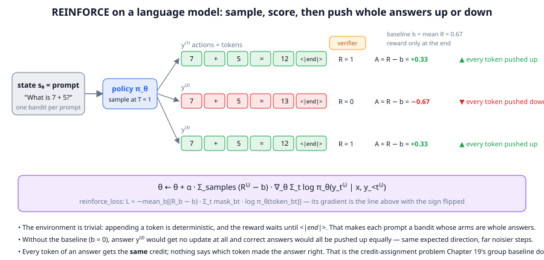
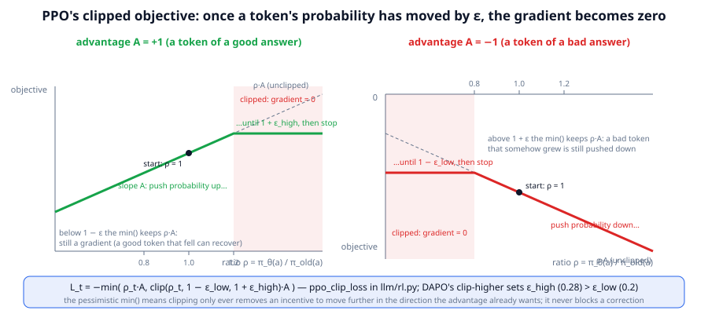
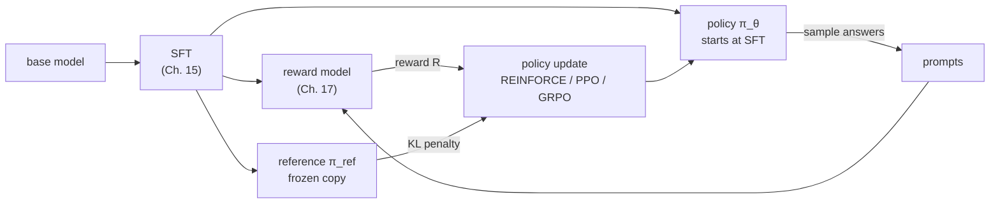

# Chapter 18: Reinforcement learning for language models

**Part III · ~3 hours · Prerequisites: Chapters 4, 15, 17**

> 🎯 Goal: Derive the policy-gradient update and explain PPO's clipping and the KL penalty.
> 🧪 Lab: `labs/lab18_reinforce.py` · 🎛️ Interactive: `interactive/18_policy_gradient.html`

## Why this matters

Everything the model has learned so far came from a target: the next token of a document (pretraining), the next token of a demonstration (SFT), or a pair of answers someone ranked (DPO). None of those lets the model learn from its *own* attempts. Suppose TinyLM answers "What is 13 + 8?" with "13 + 8 = 20". No dataset contains that exact mistake, but a verifier can score it (0) and can score the alternative "13 + 8 = 21" (1). **Reinforcement learning (RL)** is the family of methods that turn such scores on the model's own samples into gradient steps. It is the mechanism behind every 2025–2026 reasoning model, and the idea is smaller than its reputation: sample an answer, score it, make higher-scoring answers more likely. The complications, and this chapter is mostly about them, come from one fact: a single sample is a very noisy estimate of how good the policy is, and the noise, not the idea, is what most of the machinery (baselines, advantages, clipping, KL penalties) exists to control.

## The idea in pictures 📐

### RL vocabulary, translated

RL textbooks talk about an *agent* acting in an *environment*. The translation to language models is exact but degenerate, and knowing where it degenerates saves confusion.

| RL word | Meaning | For a language model |
|---|---|---|
| **state** s_t | what the agent sees before choosing | the prompt plus the tokens generated so far |
| **action** a_t | what the agent chooses | the next token |
| **policy** π_θ(a\|s) | the probability of each action in a state | the model's softmax over the vocabulary, given the prefix |
| **trajectory** (episode) | the sequence of states and actions until the end | one complete answer, ending in `<\|end\|>` |
| **reward** R | the score for the trajectory | one number for the whole answer (verifier, reward model, rubric) |
| **return** | the sum of future rewards | equal to R, because there is only one reward, at the end |
| **environment dynamics** | how a state changes after an action | deterministic: append the token |

The degeneracies: the environment does nothing except append tokens, and the reward arrives once, at the end. So although an answer is a trajectory of many actions, the model never gets feedback in the middle of it and no action changes anything except what the model itself sees next. This is why the chapter will say that LLM RL is *bandit-like*: each prompt is a slot machine whose arms are complete answers, and the model pulls one arm per sample.

### The policy gradient in one picture



The figure shows one step of REINFORCE, the simplest policy-gradient method. The prompt "What is 7 + 5?" is the state. The policy samples three complete answers at temperature 1. A verifier scores each one at the end: 1, 0, 1. The **baseline** b = 0.67 is the mean reward of the batch, and the **advantage** A = R − b of each answer is how much better than expected it was: +0.33, −0.67, +0.33. The update, in the purple band, is the sum over answers of advantage times the gradient of the answer's log-probability. Every token of a positive-advantage answer is pushed up by the same amount, and every token of a negative-advantage answer is pushed down, including tokens like "7 + 5 =" that all three answers share. Two facts to hold on to from the figure: without the baseline, the wrong answer would receive no update at all (0 × anything), and correct answers would all be pushed up equally hard regardless of how routine they are; and nothing in the update says *which* token made an answer right, only that the whole answer was.

### Why the update needs a brake



The figure plots PPO's objective for one token against the **probability ratio** ρ = π_θ(a)/π_old(a): how much the token's probability has changed since the policy that produced the sample. Left, for a token of a good answer (A > 0): the objective rises with ρ (push the token up) until ρ reaches 1 + ε_high, after which it is flat and the gradient is exactly zero. Right, for a token of a bad answer (A < 0): push down until ρ reaches 1 − ε_low, then flat. The pessimistic `min` in the formula means the clip only ever removes the incentive to *keep going* in the direction the advantage already wants; a good token whose probability has somehow fallen still receives a gradient. DAPO's *clip-higher* (Chapter 19) sets ε_high = 0.28 above ε_low = 0.2 so that rare tokens of good answers get more room to grow.

The whole RLHF pipeline, as InstructGPT drew it in 2022 and as it is still drawn in 2026:



Read the flow as a loop: the policy samples answers to a batch of prompts, the reward model scores them, the update pushes the policy toward high-reward answers while the KL penalty pulls it back toward the reference, and the loop repeats. Everything in this chapter lives inside the "policy update" box.

An analogy: REINFORCE is a coach who watches an athlete attempt a routine, hears the judges' score, and says "do more of everything you did in that attempt" or "less of everything". The limit: a coach who has watched two attempts can say which was better; REINFORCE on a single sample, with no baseline, can only say "that was worth 7", which is useless without knowing what a normal attempt scores.

## The idea in code

The library file is `llm/rl.py` (Chapter 18 uses its first 210 lines). Imports for this chapter:

```python
import torch
from llm import rl, chat, tasks
from llm.rl import (token_logprobs, response_mask, reinforce_loss, kl_estimators,
                    ppo_clip_loss, masked_mean)
from llm.generate import sample_group
from llm.model import TinyLM
from llm.pipeline import get_tokenizer, run_path
```

### Step 1: the objective and the score-function trick

We want parameters θ that make the expected reward of the policy's answers as large as possible:

$$J(\theta) = \mathbb{E}_{y \sim \pi_\theta(\cdot|x)}\big[R(x, y)\big] = \sum_y \pi_\theta(y|x)\, R(x, y)$$

Read this as: "the average reward you would get by sampling answers from the policy, which is the sum over every possible answer of its probability times its reward." The sum has V^T terms (every token sequence of length T), so nobody computes it; but we can differentiate it symbolically. R does not depend on θ, so

$$\nabla_\theta J = \sum_y R(x, y)\, \nabla_\theta \pi_\theta(y|x)$$

Read this as: "the gradient of the expected reward is the reward-weighted sum of the gradients of each answer's probability." This is still a sum over all answers. The **score-function trick** (also called the log-derivative trick) rewrites the gradient of a probability as the probability times the gradient of its log, using the calculus identity ∇ log f = ∇f / f:

$$\nabla_\theta \pi_\theta(y|x) = \pi_\theta(y|x)\, \nabla_\theta \log \pi_\theta(y|x)$$

Substituting turns the sum back into an expectation over the policy's own samples:

$$\nabla_\theta J = \sum_y \pi_\theta(y|x)\, R(x,y)\, \nabla_\theta \log \pi_\theta(y|x) = \mathbb{E}_{y \sim \pi_\theta}\big[R(x,y)\, \nabla_\theta \log \pi_\theta(y|x)\big]$$

Read this as: "sample an answer from the policy, multiply its reward by the gradient of its log-probability, and you have an unbiased estimate of the gradient of the expected reward." That single line is the **policy gradient theorem** for this setting, and the algorithm that uses it directly, one or a few samples at a time, is **REINFORCE** (Williams, 1992). For a language model the log-probability of an answer is a sum over its tokens (the chain rule of Chapter 1),

$$\log \pi_\theta(y|x) = \sum_{t} \log \pi_\theta(y_t \mid x, y_{<t})$$

so the gradient of the log-probability is what ordinary backpropagation of the token log-probabilities gives, exactly as in SFT, except that the "target" is the model's own sample and the loss is multiplied by the reward.

### Step 2: the log-probabilities of a sampled answer

Two helpers produce the ingredients. `token_logprobs(model, ids)` runs the model on `ids[:, :-1]` and picks out log π of each actual next token, returning `(B, T−1)`. `response_mask` marks which of those positions belong to the generated answer (after the prompt, up to and including the first `<|end|>`, never padding):

```python
tok = get_tokenizer()
model = TinyLM.load(run_path("lab17_sft_nano.pt"))
pad_id, end_id = tok.special_tokens["<|pad|>"], tok.special_tokens["<|end|>"]
ex = tasks.make_examples(1, seed=1, tasks=["add"], max_value=20)[0]
prompt_ids = tok.encode(chat.render(ex.messages(with_answer=False)))          # ends in <|assistant|>
ids = sample_group(model, prompt_ids, n=4, max_new_tokens=12, stop_ids=[end_id], pad_id=pad_id, seed=0)
print(ids.shape)                                                              # (4, 67): 4 answers, prompt 55 + 12 new
logps = token_logprobs(model, ids)                                            # (4, 66), gradients flow
mask = response_mask(ids, len(prompt_ids), pad_id, end_id)                    # (4, 66), 1.0 on answer tokens
print(mask.sum(-1))                                                           # tensor([8., 8., 12., 8.]): "a + b = c" + <|end|>, one ran to the limit
print((logps * mask).sum(-1))                                                 # tensor([-5.98, -1.37, -44.89, -10.10]) = log π(answer)
```

The shift by one is the usual next-token alignment: position t−1 of `logps` scores token t of `ids`. The mask includes `<|end|>` because the model must learn to stop.

### Step 3: REINFORCE with a baseline

`reinforce_loss` is the negative of the Step 1 estimator, averaged over the batch, with an optional baseline:

$$\mathcal{L}_{\text{REINFORCE}} = -\frac{1}{B}\sum_{b=1}^{B} (R_b - b)\sum_t \text{mask}_{bt}\, \log \pi_\theta(y_{bt} \mid x_b, y_{b,<t})$$

Read this as: "for each sampled answer, add up its tokens' log-probabilities, multiply by how much better than the baseline its reward was, and minimise the negative of the batch mean." Minimising this with gradient descent is the same as ascending the policy gradient.

```python
answers = [tok.decode(rl.split_completion(r, len(prompt_ids), pad_id, end_id)) for r in ids.tolist()]
print(answers)                            # ['2 + 9 = 10', '2 + 8 = 10', 'y and rope orange cake ...', '1 + 7 = 13']
rewards = torch.tensor([tasks.verify(ex, a) for a in answers])               # tensor([1., 1., 0., 0.])
loss = reinforce_loss(logps, mask, rewards, baseline=rewards.mean())         # tensor(-5.96): A = [+.5, +.5, -.5, -.5]
loss.backward()                                                               # pushes answers 0 and 1 up, 2 and 3 down
print([tasks.strict_verify(ex, a) for a in answers])                          # [0.0, 1.0, 0.0, 0.0]
```

The prompt was "What is 2 + 8?". Two of the four samples are rewarded, so with the batch-mean baseline of 0.5 the two correct answers get advantage +0.5 and the two wrong ones −0.5, and the loss is the advantage-weighted sum of the four log-probabilities: −0.5·(−5.98 − 1.37) + 0.5·(−44.89 − 10.10), divided by 4. Look at the first rewarded answer, though: `'2 + 9 = 10'` misquotes the question. `tasks.verify` grades only the last number, so it pays 1.0 for it, and REINFORCE will now push that string up as hard as the genuine `'2 + 8 = 10'`. `tasks.strict_verify` also requires the restated operands to match the question and rejects it. Which grader you plug in *is* the reward function, and the lab below shows the policy learning to exploit the lenient one. One more thing to notice: had all four samples been wrong (as they are for other seeds), every advantage would be 0, the loss exactly 0 and the step would teach nothing. A batch with no variation in reward carries no information about *which* answers are better; Chapter 19's dynamic sampling exists to skip such batches rather than spend an update on them.

Why is subtracting a baseline allowed? Because the expected value of b·∇log π_θ(y) is zero for any constant b:

$$\mathbb{E}_{y \sim \pi_\theta}\big[\nabla_\theta \log \pi_\theta(y)\big] = \sum_y \pi_\theta(y)\frac{\nabla_\theta \pi_\theta(y)}{\pi_\theta(y)} = \nabla_\theta \sum_y \pi_\theta(y) = \nabla_\theta 1 = 0$$

Read this as: "the probabilities of all answers sum to one, and the gradient of a constant is zero, so on average the score function points nowhere." A baseline therefore changes no expected gradient, only the spread of the individual estimates. The quantity R − b is the **advantage**: the reward relative to what was expected. The best constant baseline is close to the expected reward; a **value function** V(s), a learned estimate of the expected reward from a state, is what PPO in the classic RLHF setup uses (a second network, the *critic*); Chapter 19's GRPO uses the mean reward of a group of samples for the same prompt, which needs no extra network.

### Step 4: why variance is the enemy

The estimate R·∇log π from one sample is unbiased but wild. Consider the bandit in the lab: five arms, hidden success probabilities 0.25 to 0.90, softmax policy. With no baseline, a reward of 0 produces no update and a reward of 1 produces a big one, so the update is either nothing or a lurch; with a running-mean baseline every sample carries information ("better or worse than usual?"). The lab computes both the expected update (identical in both cases) and E‖g‖² (much smaller with the baseline) exactly, since the bandit is discrete. For a language model the situation is worse: the "arms" are all V^T token sequences, each sample touches every parameter, and a single lucky sample can move the policy a long way. Everything from here on is variance control.

### Step 5: PPO clipping

If a batch of samples produces a large gradient, one step can change the policy so much that the samples no longer represent it, and the next step is computed on a policy that never produced them. **Proximal Policy Optimization (PPO)** (Schulman et al., 2017) limits how far one update can move each token's probability relative to the policy that produced the samples, π_old. The objective per token is

$$L_t = -\min\big(\rho_t A,\; \mathrm{clip}(\rho_t,\, 1-\varepsilon_{\text{low}},\, 1+\varepsilon_{\text{high}})\, A\big), \qquad \rho_t = \frac{\pi_\theta(y_t \mid \cdot)}{\pi_{\text{old}}(y_t \mid \cdot)}$$

Read this as: "move probability toward tokens of good answers and away from tokens of bad ones, but once a token's probability ratio has left the window [1−ε, 1+ε] in the direction the advantage wants, stop: the clipped branch wins the min and its gradient is zero." The ratio form is an **importance weight**: it corrects for the fact that the gradient is evaluated under π_θ while the samples came from π_old, so the same samples can be re-used for several optimizer steps (PPO's *epochs*). At the first step π_θ = π_old, every ratio is exactly 1 and the clip cannot activate; the clip only bites when samples are re-used or when the sampler lags behind the trainer.

```python
old = torch.zeros(2, 4); mask4 = torch.ones(2, 4); adv = torch.tensor([1.0, -1.0])
logp = torch.tensor([[0.5] * 4, [0.0] * 4], requires_grad=True)   # row 0: ratio e^0.5 = 1.65, A > 0
loss, stats = ppo_clip_loss(logp, old, adv, mask4, eps_low=0.2, eps_high=0.28)
loss.backward()
print(stats)                    # {'clip_frac': 0.5, 'approx_kl': 0.0533, 'ratio_mean': 1.324}
print(logp.grad[0].tolist())    # [0.0, 0.0, 0.0, 0.0]      <- clipped row: no gradient at all
print(logp.grad[1].tolist())    # [0.125, 0.125, 0.125, 0.125] <- ratio-1 row: -A/8 per token
```

`stats["clip_frac"]` is the fraction of answer tokens whose gradient the clip zeroed, the number to watch in any RL log: near 0 means the policy barely moved, a large value means most of the batch was thrown away. `token_level=True` averages over every token in the batch (DAPO's choice), `False` averages within each answer first (original GRPO); `masked_mean` implements both.

### Step 6: the KL-to-reference penalty and its three estimators

Clipping bounds one step. Over many steps the policy can still wander anywhere the reward likes, including into degenerate text that happens to score well. The second brake is a penalty on the KL divergence from the frozen reference π_ref, the term that was already in Chapter 17's objective:

$$\text{maximise}\;\; \mathbb{E}\big[R\big] - \beta\, \mathrm{KL}(\pi_\theta \,\|\, \pi_{\text{ref}}), \qquad \mathrm{KL}(\pi_\theta\|\pi_{\text{ref}}) = \mathbb{E}_{y\sim\pi_\theta}\Big[\log \frac{\pi_\theta(y)}{\pi_{\text{ref}}(y)}\Big]$$

Read this as: "pay β for every nat by which the policy's samples have become more probable under the policy than under the reference." The expectation is over the policy's own samples, so it is estimated from the same rollouts, per token. With r = π_ref(y_t)/π_θ(y_t), the library offers three estimators (Schulman, 2020):

$$k_1 = -\log r, \qquad k_2 = \tfrac{1}{2}(\log r)^2, \qquad k_3 = (r - 1) - \log r$$

Read them as: "k₁ is the raw log-ratio, unbiased but noisy and often negative; k₂ is a squared version, always positive, low variance, but biased; k₃ is the log-ratio corrected by the ratio itself, unbiased *and* always non-negative." The lab checks all three claims numerically on a 10-symbol distribution with a known KL. GRPO uses k₃; InstructGPT-style PPO folded k₁ into the reward as a per-token penalty.

```python
lp, ref_lp = torch.tensor([-1.0, -2.0, -0.5]), torch.tensor([-1.2, -1.5, -0.5])
print(kl_estimators(lp, ref_lp))
# {'k1': tensor([ 0.2, -0.5,  0.0]), 'k2': tensor([0.02, 0.125, 0.0]), 'k3': tensor([0.0187, 0.1487, 0.0])}
```

Two clarifications beginners ask for. The DPO chapter measured against π_ref and PPO measures against π_old *and* π_ref: π_old is the policy from a few steps ago (the sampler) and only governs the clip; π_ref is the SFT model and never changes. And whether to include the KL term at all is a 2025–2026 debate: DAPO and Dr. GRPO drop it (β = 0) for verifiable-reward training, on the grounds that the verifier cannot be gamed the way a reward model can and the policy *should* be allowed to move far; `GRPOConfig.kl_coef` defaults to 0 for that reason.

### Step 7: why LLM RL is a bandit problem, and what that buys

In a game or robot, actions have consequences the agent observes: the state changes, rewards trickle in, and a method must estimate the value of intermediate states to assign credit through time. For an LLM answering a prompt, the "state" after t tokens is fully determined by the tokens the model itself chose, no reward arrives until `<|end|>`, and the episode ends. That makes each prompt a **contextual bandit**: choose an arm (an answer), observe a reward, repeat, with the prompt as the context. Two things follow. First, the elaborate value-estimation machinery of deep RL (temporal-difference learning, generalised advantage estimation) is mostly unnecessary; a per-prompt baseline is enough, which is why GRPO could drop PPO's critic. Second, credit assignment *within* an answer, which token was the mistake, is not solved by any of this: every token of an answer gets the whole answer's advantage. Process reward models and per-turn rewards (Chapter 21) are attempts to put structure back.

### Step 8: the classic RLHF recipe (InstructGPT, 2022)

Putting the pieces in order: (1) SFT on demonstrations; (2) collect comparisons of the SFT model's samples and train a reward model (Chapter 17); (3) run PPO where the policy starts at the SFT model, the reward is the RM score minus β times the per-token KL to the SFT model, a critic network estimates the value baseline, ratios are clipped at ε = 0.2, and a small amount of pretraining loss is mixed in to prevent forgetting. In 2026 the shape of the loop is unchanged, but the reward is often a verifier or rubric rather than an RM, the critic is replaced by a group baseline, and the KL term is frequently zero. Chapter 19 is that modern version.

## Worked example 🧪

```bash
python3 labs/lab18_reinforce.py            # quick: nano model, 98 s (the warm start comes from Lab 17)
python3 labs/lab18_reinforce.py --full     # small model, 30 REINFORCE steps; see the timing note below
```

### Quick mode (nano)

The bandit comes first because everything about it can be computed exactly. Five arms with hidden success probabilities 0.25–0.90, a softmax policy over five logits, α = 0.2, 600 steps, 20 trials per setting:

```
   no baseline : final P(best arm) 0.88 | median steps to P(best)>=0.9:  176 | runs stuck on a wrong arm at step 600: 2/20
   baseline    : final P(best arm) 0.97 | median steps to P(best)>=0.9:  199 | runs stuck on a wrong arm at step 600: 0/20
   at a fixed policy, no baseline     : E[update] = [-0.047 -0.031 -0.008  0.014  0.071]  E||g||^2 = 0.481  Var = 0.472
   at a fixed policy, baseline b=E[r] : E[update] = [-0.047 -0.031 -0.008  0.014  0.071]  E||g||^2 = 0.187  Var = 0.179
```

The two E[update] rows are identical to three decimals, as Step 3 promised: the baseline is invisible in expectation. The variance is 2.6× smaller with it. The median convergence time barely differs (176 vs 199 steps: the expected drift dominates an easy bandit), but the *tail* does: two of twenty no-baseline runs lock onto a wrong arm and never recover, none with the baseline. A lurch of α·1·(1 − π_a) on a lucky pull of a bad arm early on is what a baseline prevents. (This is also the interactive's Challenge.)

Then REINFORCE on TinyLM, six prompts, eight samples each, twelve steps:

```
   6 prompts x 8 samples per step, 12 steps, lr 0.0001; log pi(correct) before: -2.78
   step   0 | mean reward 0.104 | log pi(reference answer)  -2.80 | grad norm 4.33 | 1s
   step   6 | mean reward 0.250 | log pi(reference answer)  -2.70 | grad norm 4.24 | 3s
   step  11 | mean reward 0.312 | log pi(reference answer)  -2.68 | grad norm 5.15 | 6s
   mean reward, first 3 steps 0.160 -> last 3 steps 0.243; log pi(reference answer) -2.78 -> -2.68
   rewarded samples in the last batch (what REINFORCE actually pushed up): ['8 + 8 = 10', '6 + 17 = 10', '2 + 20 = 10', '2 + 8 = 10', '11 + 11 = 10']
```

The sampled reward rises from 0.16 to 0.24 in twelve steps, and the log-probability of the *reference* answers edges up by 0.1 nats. The last line is the one to remember: REINFORCE raised the probability of whatever *it* sampled and the verifier accepted, and four of those five samples misquote the operands. `tasks.verify` grades only the last number, so `8 + 8 = 10` is a rewarded answer to "What is 2 + 8?". The policy is not being taught the reference string; it is being taught its own rewarded behaviour, blind spots of the grader included. Chapter 17's Goodhart lesson, now in the RL loop.

```
   no baseline : ||mean grad|| 0.698 | mean ||g_i - mean||^2 (variance) 0.512
   baseline    : ||mean grad|| 0.681 | mean ||g_i - mean||^2 (variance) 0.537
```

On TinyLM the five-batch variance estimate did *not* fall with the batch-mean baseline this time. With rewards that are mostly 0, the baseline is about 0.2 and the two estimators are nearly the same; five batches cannot resolve the difference. The bandit's exact computation is the reliable statement; the TinyLM measurement is there so you see how noisy such estimates are in practice.

```
   close (small KL): true KL(p || q) = 0.0842 over V=10 symbols, 20,000 samples from p
      k1: mean 0.0850 | std 0.393 | fraction of negative samples 0.33 | bias +0.0007
      k2: mean 0.0807 | std 0.109 | fraction of negative samples 0.00 | bias -0.0036
      k3: mean 0.0826 | std 0.125 | fraction of negative samples 0.00 | bias -0.0016
   far (large KL): true KL(p || q) = 0.6815 over V=10 symbols, 20,000 samples from p
      k1: mean 0.6692 | std 1.047 | fraction of negative samples 0.23 | bias -0.0123
      k2: mean 0.7720 | std 0.566 | fraction of negative samples 0.00 | bias +0.0904
      k3: mean 0.6869 | std 1.090 | fraction of negative samples 0.00 | bias +0.0054
   TinyLM, REINFORCE'd policy vs SFT reference, per answer token: k1=0.0873, k2=0.1234, k3=0.0889
```

For nearby distributions every claim of Step 6 holds: k₁ is unbiased but a third of its samples are negative and its standard deviation is three times k₃'s; k₂ is smooth but biased; k₃ is unbiased, never negative, and low-variance. The far case is the caveat textbooks skip: at KL 0.68 the exp(log r) inside k₃ blows up on rare tokens and its variance exceeds k₁'s. The low-variance claim is a small-KL statement, which is the regime a KL penalty keeps a policy in. On TinyLM after twelve REINFORCE steps the policy is 0.09 nats per token from the SFT model, and k₁ and k₃ agree.

```
   sigma of log-ratio | clip frac 0.2/0.2 | clip frac 0.2/0.28 | approx KL (k3)
                 0.05 |             0.001 |              0.000 |         0.0012
                 0.20 |             0.139 |              0.100 |         0.0187
                 0.40 |             0.309 |              0.274 |         0.0840
   row with ratio 1.65 and A>0: clip_frac 0.50, grad on that row = [0.0, 0.0, 0.0, 0.0], grad on the ratio-1 row = [-0.125, -0.125, -0.125, -0.125]
```

With synthetic per-token log-ratios drawn from N(0, σ²), the clip fraction is the fraction of tokens outside the window: negligible at σ = 0.05, 14 % at σ = 0.2, 31 % at σ = 0.4, and always lower with clip-higher because the upper window is wider. The last line is the figure's claim made literal: the row whose ratio is 1.65 with a positive advantage receives a gradient of exactly zero on every token.

### Full mode (small)

```
   no baseline : final P(best arm) 0.90 | median steps to P(best)>=0.9:  209 | runs stuck on a wrong arm at step 600: 3/40
   baseline    : final P(best arm) 0.97 | median steps to P(best)>=0.9:  219 | runs stuck on a wrong arm at step 600: 0/40
   6 prompts x 8 samples per step, 30 steps, lr 0.0001; log pi(correct) before: -0.13
   step   0 | mean reward 0.812 | log pi(reference answer)  -0.20 | grad norm 6.65 | 48s
   step  15 | mean reward 0.958 | log pi(reference answer)  -0.07 | grad norm 1.02 | 686s
   step  29 | mean reward 0.917 | log pi(reference answer)  -0.06 | grad norm 3.60 | 1180s
   mean reward, first 3 steps 0.826 -> last 3 steps 0.958; log pi(reference answer) -0.13 -> -0.06
   rewarded samples in the last batch (what REINFORCE actually pushed up): ['2 + 8 = 10', '2 + 8 = 10', '2 + 8 = 10', '2 + 8 = 10', '2 + 8 = 10']
   no baseline : ||mean grad|| 0.944 | mean ||g_i - mean||^2 (variance) 0.109
   baseline    : ||mean grad|| 0.477 | mean ||g_i - mean||^2 (variance) 0.773
   TinyLM, REINFORCE'd policy vs SFT reference, per answer token: k1=-0.0008, k2=0.0118, k3=0.0302
```

With 40 bandit trials the tail story holds (3 of 40 no-baseline runs stuck, none with the baseline). On the small model the warm start already answers its six training prompts with reward 0.83 and log π(reference) = −0.13, so REINFORCE has little to do and does it: reward 0.83 → 0.96, the reference answers now at −0.06 nats, and the rewarded samples are the reference strings themselves, not the misquoted operands of the quick run. The gradient-variance rows are the surprise, and worth understanding: with rewards almost all equal to 1, the *no-baseline* gradient is nearly the same in every batch ("push everything up") and so has low variance across batches, 0.109, while the baseline of ≈ 0.96 leaves only the rare wrong answer with a large weight (−0.96), so the with-baseline gradient depends on which batch happened to contain a mistake, variance 0.773. A baseline reduces variance *of the estimate of the true gradient*; when the reward is nearly constant, the true gradient is nearly zero, the no-baseline estimator is confidently pointing in a direction that mostly does not matter, and the batch-mean baseline correctly makes the update small and noisy. The bandit's exact numbers, computed at a policy with reward variance, are the general case. After 30 steps the policy is 0.03 nats per token from the SFT model by k₃ and k₁ reads slightly negative, the kind of sample noise Step 6 warned about. Wall-clock: 1,524 s, of which the 30 REINFORCE steps were 1,180 s, because the three full labs ran concurrently at two threads each on a four-core machine; on its own this lab is a few minutes.


## Try it yourself ✍️

1. **Hard bandit.** Change `P_ARMS` in the lab to `[0.85, 0.90]` (two arms) and α to 0.5. Run 40 trials with and without the baseline and count how many end with P(best) < 0.5. The expected gradient is the same in both; the tails are not.
2. **Baseline choice.** Replace the running mean with a constant baseline of 0.5, then 1.0, then 2.0 (above every possible reward). Which one converges fastest, and why does a baseline above all rewards still converge?
3. **REINFORCE without a baseline on TinyLM.** Rerun section (b) with `use_baseline=False`. Compare the reward curve and the gradient norms over the same steps and seeds.
4. **KL vs temperature.** Sample from the SFT model at temperatures 0.7, 1.0 and 1.3 and compute k₁, k₂, k₃ against the *same* model. Which estimator is fooled by the temperature, and what does that tell you about estimating KL from samples that were not drawn from π_θ?
5. **Clip fraction over epochs.** Take one batch of rollouts and apply `ppo_clip_loss` for 1, 2, 4 and 8 optimizer steps on the *same* samples (PPO epochs), logging `clip_frac` and `approx_kl` each time. At what epoch does the clip zero more than half the tokens?
6. **Advantage sign check.** Construct a batch where all rewards are equal. Show that REINFORCE with the batch-mean baseline produces an exactly zero gradient, and explain why Chapter 19's dynamic sampling skips such batches.
7. **Interactive** 🎛️: open `interactive/18_policy_gradient.html`. Press "Sample one action" a few times and check the update line against the formula θ_j ← θ_j + α(r − b)(1[j = a] − π_j). Then run 100 steps with and without the baseline and read the exact variance panel. Do the Challenge: converge to the best arm twice, once per baseline setting, then "Run comparison" to see whether your two runs were typical.

## Check yourself ✅

<details><summary>1. State the score-function trick and say why it matters for language models.</summary>

∇_θ π_θ(y) = π_θ(y) ∇_θ log π_θ(y). It turns the gradient of an expected reward, a sum over all V^T possible answers, into an expectation over the policy's own samples, so it can be estimated by sampling a few answers and backpropagating their log-probabilities weighted by reward.
</details>

<details><summary>2. Why does subtracting a baseline not change the expected gradient, and what does it change?</summary>

E_y~π[∇ log π(y)] = ∇ Σ_y π(y) = ∇1 = 0, so b·∇log π has zero mean for any constant b. It changes the variance of the estimate: with b ≈ E[R], every sample contributes "better or worse than expected", instead of rewards of 0 contributing nothing and rewards of 1 contributing a lurch.
</details>

<details><summary>3. In <code>ppo_clip_loss</code>, when is a token's gradient exactly zero, and why does the objective use <code>min</code> rather than always clipping?</summary>

When A > 0 and ρ > 1 + ε_high, or A < 0 and ρ < 1 − ε_low: the clipped branch is the smaller one, and it has no dependence on θ. The min makes the objective pessimistic: it only removes the incentive to move further in the direction the advantage already wants, never the incentive to correct a token that moved the wrong way.
</details>

<details><summary>4. Which KL estimator is both unbiased and never negative, and what is π_old versus π_ref?</summary>

k₃ = (r − 1) − log r with r = π_ref/π_θ. π_old is the policy that produced the current samples (a few steps old at most) and only enters the clip ratio; π_ref is the frozen SFT model that the KL penalty measures against and never changes during the run.
</details>

<details><summary>5. Why is RL for language models called a bandit problem, and what problem does that framing leave unsolved?</summary>

Each prompt is a context, each complete answer is an arm, the environment does nothing but append tokens, and one reward arrives at the end, so no intermediate value estimation is needed and a per-prompt baseline suffices. It leaves credit assignment within an answer unsolved: every token receives the whole answer's advantage, whether or not it was the token that made the answer right or wrong.
</details>

## Key takeaways

- RL for LLMs: state = prompt + tokens so far, action = next token, reward = one number per answer; the environment only appends tokens.
- The policy gradient ∇J = E[R ∇log π(y)] follows from the score-function trick; REINFORCE estimates it from samples, and `reinforce_loss` is its negative.
- A baseline leaves the expected gradient unchanged and cuts its variance; the advantage R − b is what actually drives updates.
- PPO clips the per-token probability ratio to [1−ε_low, 1+ε_high] so one batch cannot move the policy too far; clipped tokens get zero gradient, and the clip only acts when samples are re-used or the sampler lags.
- The KL-to-reference penalty keeps the policy near the SFT model; k₃ is the estimator to use (unbiased, non-negative); modern verifiable-reward runs often set β = 0.
- LLM RL is bandit-like: per-prompt baselines suffice, critics are optional, and within-answer credit assignment remains open.

## Going deeper

- Williams, R. J. "Simple Statistical Gradient-Following Algorithms for Connectionist Reinforcement Learning" (1992). REINFORCE, including the baseline argument.
- Sutton, R. S. and Barto, A. G. *Reinforcement Learning: An Introduction*, 2nd ed. (2018), chapters 2 (bandits) and 13 (policy gradients). Free online.
- Schulman, J. et al. "Proximal Policy Optimization Algorithms" (2017). The clipped objective. https://arxiv.org/abs/1707.06347
- Schulman, J. "Approximating KL Divergence" (blog, 2020). The k₁/k₂/k₃ estimators. http://joschu.net/blog/kl-approx.html
- Ouyang, L. et al. "Training language models to follow instructions with human feedback" (2022). The RLHF recipe of Step 8. https://arxiv.org/abs/2203.02155
- Ahmadian, A. et al. "Back to Basics: Revisiting REINFORCE-Style Optimization for Learning from Human Feedback in LLMs" (2024). Argues that the bandit structure makes REINFORCE with a good baseline competitive with PPO.
- 🆕 Shao, Z. et al. "DeepSeekMath" (2024) and the 2025–2026 GRPO variants surveyed in Chapter 19; a readable 2026 overview: https://www.turingpost.com/p/reasoning-rl-in-2026

---

← [Chapter 17](17-reward-models-and-dpo.md) · [Course home](../README.md) · [Chapter 19](19-grpo-and-rlvr.md) →
