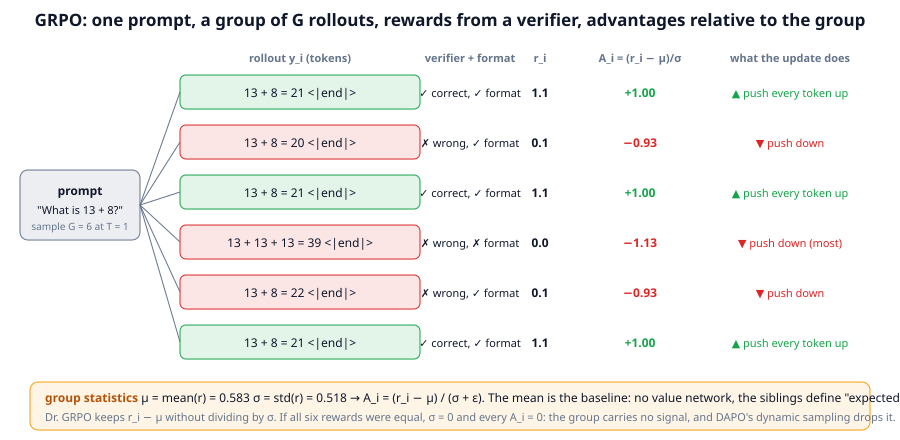
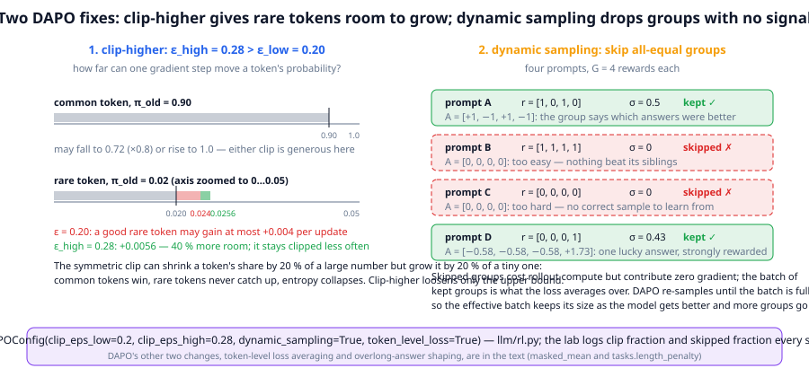
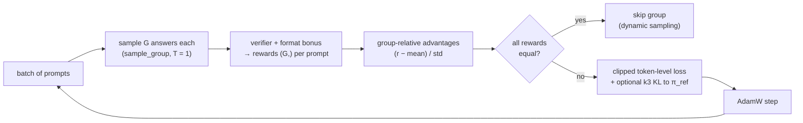

# Chapter 19: GRPO, RLVR and reasoning models

**Part III · ~3 hours · Prerequisites: Chapters 15, 17, 18**

> 🎯 Goal: Implement GRPO with verifiable rewards and reproduce the "reasoning emerges" effect at toy scale.
> 🧪 Lab: `labs/lab19_grpo.py` · 🎛️ Interactive: `interactive/19_grpo_simulator.html`

## Why this matters

In January 2025 DeepSeek published R1, a model whose long, self-correcting "thinking" before an answer had not been written by anyone: it appeared during reinforcement learning against a reward that only checked whether the final answer was right. The recipe, **reinforcement learning with verifiable rewards (RLVR)**, is now the main way frontier labs turn an instruct model into a reasoning model, and the algorithm underneath it, **Group Relative Policy Optimization (GRPO)**, is Chapter 18's policy gradient with one change: the baseline is the mean reward of a *group* of answers to the same prompt, so no critic network is needed. The 2025–2026 literature is a list of small corrections to that recipe (clip-higher, dynamic sampling, token-level losses, sequence-level ratios), each fixing a failure people hit in practice, and each a one-line switch in `llm/rl.py`. This chapter runs the whole thing on TinyLM: an SFT model that adds two numbers about half the time becomes one that does so more often, with every training signal logged, and then asks the uncomfortable question the field is still arguing about: did the model learn to add, or did it learn to pick the right answer from the ones it could already produce?

## The idea in pictures 📐

### A group of rollouts



The figure follows one prompt through one GRPO step. The policy samples G = 6 answers at temperature 1. A **verifier**, here `tasks.verify`, checks each answer and a small format bonus is added: a correct, well-formed answer scores 1.1; a wrong but well-formed one 0.1; a wrong, malformed one 0.0. The group's mean reward, 0.583, is the baseline, and each answer's **advantage** is its reward minus that mean, divided by the group's standard deviation: +1.00 for the three correct answers, −0.93 for the formatted wrong ones, −1.13 for the ramble. Every token of a positive-advantage answer is pushed up and every token of a negative-advantage answer is pushed down, exactly as in REINFORCE, but now "expected" means "what this prompt's siblings scored". Read the bottom band carefully: if all six rewards had been equal, every advantage would be zero and the group would carry no gradient at all; a prompt the model always solves teaches nothing, and so does one it never solves.

### Two of DAPO's fixes



The left panel explains **clip-higher**. PPO's symmetric clip lets a token's probability ratio move within [0.8, 1.2] before the gradient is cut off. For a common token at probability 0.90 that is generous in both directions. For a rare token at 0.02 it is not: the upper bound allows a rise to 0.024, an absolute gain of 0.004 per update, while a common token may lose 0.18 in the same step. Under such a rule the probability mass of good answers concentrates on tokens that were already likely, rare-but-useful tokens never catch up, and the policy's **entropy**, its per-token uncertainty, collapses toward zero. Raising only the upper bound to 1.28 gives the rare token 40 % more room. The right panel shows **dynamic sampling**: of four prompts, two produced all-equal rewards (all correct, all wrong), their advantages are all zero, and they are dropped from the batch; DAPO keeps sampling until the batch is full of informative groups, so the effective batch does not shrink as the model improves and more prompts become "too easy".

The full loop, as `grpo_train` runs it:



Read the flow as: rollouts, rewards, advantages, a filter, one clipped policy-gradient step, repeat. The expensive box is the first one; on TinyLM about half of each step is spent sampling, and in frontier runs the ratio is far more lopsided, which is why the 2026 infrastructure papers (Chapter 21) are mostly about rollouts.

An analogy: GRPO grades on a curve, per question. A student's mark on a question is how far above or below the class average they came, so a question everybody got right and a question nobody got right both contribute nothing. The limit: a class has one teacher and many students, while here the "students" are samples from one model, so the curve is measuring the model against its own luck.

## The idea in code

The library file is `llm/rl.py`, lines 211–445. Imports for this chapter:

```python
import torch
from llm import rl, chat, tasks
from llm.rl import (grpo_advantages, GRPOConfig, rollout_group, grpo_step, grpo_train,
                    gspo_ratio, gspo_loss, default_reward, make_optimizer)
from llm.model import TinyLM
from llm.pipeline import get_tokenizer, run_path
```

### Step 1: a verifiable reward

`tasks.verify(example, completion)` extracts the model's final answer from free text and compares it with the reference; `tasks.format_reward` gives 1 if the answer has the expected shape; `rl.default_reward` combines them so that a well-formed wrong answer beats gibberish:

$$R(y) = \text{verify}(y) + 0.1\cdot\text{format}(y) \in \{0,\; 0.1,\; 1.0,\; 1.1\}$$

Read this as: "one point for being right, a tenth of a point for looking like an answer." The format term is **reward shaping**: an extra term that makes the reward less sparse so early training has something to climb. Keep such terms small; if they outweigh correctness the policy optimises them instead (Chapter 17's Goodhart demonstration). `reward.combined_reward` adds a third term, −0.5 for hitting the token limit without finishing, which is the course's version of DAPO's *overlong shaping*.

```python
tok = get_tokenizer()
ex = tasks.make_examples(1, seed=4, tasks=["add"], max_value=20)[0]      # 'What is 3 + 12?'
for c in ("3 + 12 = 15", "3 + 12 = 16", "the answer is 15", "kite kite"):
    print(f"{c!r:20} -> {default_reward(ex, c, [0]):.1f}")
# '3 + 12 = 15'        -> 1.1
# '3 + 12 = 16'        -> 0.1
# 'the answer is 15'   -> 1.0
# 'kite kite'          -> 0.0
```

### Step 2: group-relative advantages

For G rewards r₁…r_G to the same prompt,

$$A_i = \frac{r_i - \text{mean}(r)}{\text{std}(r) + \epsilon} \quad \text{(GRPO)}, \qquad A_i = r_i - \text{mean}(r) \quad \text{(Dr. GRPO)}$$

Read this as: "an answer is good if it beat its siblings, measured in units of how much the siblings disagreed." Dividing by the standard deviation makes every prompt contribute advantages of the same size whether its rewards were {0, 1.1} or {1.0, 1.1}; Dr. GRPO argues that this over-weights prompts that are almost always right or almost always wrong (tiny std, huge advantages) and drops the division.

```python
r = torch.tensor([1.1, 0.1, 1.1, 0.0, 0.1, 1.1])                # the figure's group
print(grpo_advantages(r))                                       # tensor([ 0.998, -0.934,  0.998, -1.127, -0.934,  0.998])
print(grpo_advantages(r, normalize_std=False))                  # tensor([ 0.52, -0.48,  0.52, -0.58, -0.48,  0.52])
print(grpo_advantages(torch.ones(4)))                           # tensor([0., 0., 0., 0.]): no signal
```

### Step 3: the GRPO objective, with every symbol read aloud

For a batch of prompts, G answers each, tokens t within answer i, with ρ_{i,t} = π_θ(y_{i,t}|·)/π_old(y_{i,t}|·) the per-token probability ratio of Chapter 18:

$$\mathcal{L}_{\text{GRPO}} = -\frac{1}{\sum_i |y_i|}\sum_{i}\sum_{t=1}^{|y_i|} \min\!\Big(\rho_{i,t} A_i,\; \mathrm{clip}(\rho_{i,t}, 1-\varepsilon_{\text{low}}, 1+\varepsilon_{\text{high}})\, A_i\Big) \;+\; \beta\, \mathrm{KL}_{k_3}(\pi_\theta \,\|\, \pi_{\text{ref}})$$

Read this as, piece by piece: "for every token of every sampled answer, take the clipped policy-gradient term of Chapter 18 with the answer's group-relative advantage; average over all tokens in the batch; add β times the k₃ estimate of the KL to the reference." Three details decide what the loss actually does. The *advantage is per answer* (A_i, not A_{i,t}): every token of an answer gets the same push, the bandit structure of Chapter 18. The *average is over tokens* (the 1/Σ|y_i| in front): a 12-token answer contributes 12 terms and an 8-token answer 8, so long answers weigh more; this is DAPO's **token-level loss**, and the original GRPO paper instead averaged within each answer first (1/|y_i|) and then across answers, which gives every answer equal weight and, Dr. GRPO showed, quietly rewards long wrong answers (their per-token penalty is diluted) and short right ones. The *KL term* uses k₃ against the SFT model; DAPO and Dr. GRPO set β = 0, the library's default, on the argument that a verifier cannot be gamed the way a reward model can.

In code the objective is `ppo_clip_loss` applied to collated rollouts plus an optional KL term; `policy_update` in `llm/rl.py` does exactly that and nothing else. One implementation fact that puzzles beginners: with `ppo_epochs = 1` the policy that sampled the answers is the policy being updated, so π_old = π_θ, every ρ is exactly 1 and the clip can never activate; the library skips the extra forward pass in that case. The clip matters when the same rollouts are re-used for several epochs (`ppo_epochs > 1`, which the lab uses so that its clip fraction is a real number) or when the sampler lags behind the trainer in a large asynchronous system.

### Step 4: one rollout group, one step

```python
model = TinyLM.load(run_path("lab17_sft_nano.pt"))
cfg = GRPOConfig(group_size=8, prompts_per_step=4, max_new_tokens=12, lr=1e-4,
                 clip_eps_low=0.2, clip_eps_high=0.28, dynamic_sampling=True,
                 token_level_loss=True, normalize_std=True, kl_coef=0.0, ppo_epochs=2)
ro = rollout_group(model, tok, ex, cfg, seed=0)
print(ro.ids.shape, ro.mask.shape, ro.prompt_len)     # torch.Size([8, 64]) torch.Size([8, 63]) 55
print(ro.completions[:3], ro.rewards[:3])             # ['3 + 12 = 12', '3 + 15 = 14', 'y7 + 17 = 17'] tensor([0.1, 0.1, 0.1])
opt = make_optimizer(model, cfg)
st = grpo_step(model, None, tok, [ex] * 4, cfg, opt)
print({k: round(v, 3) for k, v in st.items() if isinstance(v, float)})
# {'reward': 0.219, 'accuracy': 0.125, 'resp_len': 8.156, 'skipped_frac': 0.0, 'clip_frac': 0.046,
#  'approx_kl': 0.021, 'ratio_mean': 0.983, 'entropy': 0.861, 'grad_norm': 2.781, 'loss': 0.027, ...}
```

`Rollout` carries everything a step needs: the padded ids, the prompt length, rewards, decoded completions and the response mask aligned with `token_logprobs`. `grpo_step` runs `rollout_group` for each prompt, computes advantages, drops all-equal groups when `dynamic_sampling` is on, collates the survivors and calls `policy_update`. `grpo_train` cycles through the prompts for `cfg.steps` steps and returns one dictionary of statistics per step; those are the curves in the lab's figure.

### Step 5: the DeepSeek-R1 recipe

R1 arrived as two models and a story. **R1-Zero** was trained by GRPO *directly on the base model* with only two rule-based rewards: is the final answer right (checked by a program, for maths and code) and is the output in the required `<think>…</think><answer>…</answer>` format. No SFT, no reward model, no demonstrations of reasoning. Over thousands of steps its answers grew from a few hundred tokens to many thousands, and the paper reports behaviours nobody wrote down: re-checking steps, trying alternatives, and the much-quoted **"aha moment"**, a training log excerpt in which the model writes "Wait, wait. Wait. That's an aha moment I can flag here" and restarts a derivation. Treat the anecdote with care. The reported facts are that response length and accuracy rose together under a reward that saw only the final answer, and that reflective phrasing became more frequent; whether that phrasing reflects a *new* capability or a re-weighting of patterns already present in the base model is the open question of Step 8, and later analyses (Liu et al., 2025, "Understanding R1-Zero-like training") found such phrases already present in the base models before any RL. R1-Zero's outputs were also hard to read (language mixing, no consistent format). The released **R1** fixed that with a multi-stage recipe: (1) a small "cold-start" SFT on a few thousand long, clean reasoning traces; (2) GRPO with the verifiable reward plus a language-consistency reward; (3) rejection sampling from that checkpoint to build a large SFT set, mixed with general instruction data; (4) SFT on it; (5) a final RL stage that adds a reward model for helpfulness and harmlessness on non-verifiable prompts. Chapter 14's pipeline diagram is that sequence, and most 2026 reasoning models follow it with local variations.

### Step 6: the 2026 fixes 🆕

Each of the following is a switch in `GRPOConfig`, and each was introduced to fix a failure that appeared at scale. Reported results are the papers' own; small-scale reproductions, including the lab's, are noisy.

- **DAPO** (ByteDance Seed / Tsinghua, 2025) named four changes and reported 50 points on AIME 2024 with a Qwen2.5-32B base: *clip-higher* (ε_high = 0.28 vs ε_low = 0.2, `clip_eps_high`); *dynamic sampling* (`dynamic_sampling`); *token-level policy-gradient loss* (`token_level_loss`); and *overlong reward shaping*, a soft penalty that grows with how far an answer runs past a length budget instead of a hard cut (the course's `length_penalty` is the hard version). It also dropped the KL term.
- **Dr. GRPO** ("GRPO Done Right", Liu et al., 2025) removed two normalisations it identified as biases: the per-answer 1/|y_i| (which favours long wrong answers) and the division by std (which over-weights easy and impossible prompts). `normalize_std=False` plus `token_level_loss=True` is the library's approximation; the paper reports the same accuracy with much shorter answers.
- **GSPO** (Qwen, 2025) replaced the per-token ratio by a *sequence-level* ratio, the geometric mean over an answer's tokens of the per-token ratios, and clipped that one number per answer with a tiny ε (≈ 3e-4). The motivation was training instability in mixture-of-experts models, where per-token ratios are noisy because routing changes between sampler and trainer; the argument is that the reward is one number per answer, so the importance weight should be too. `sequence_ratio=True` selects `gspo_loss`.
- **CISPO** (MiniMax-M1, 2025) keeps every token's gradient and instead clips the importance weight itself (treated as a constant), so that low-probability but important tokens (the "wait", "however" tokens of a reflective answer) are never zeroed out by the clip. The library does not implement it; exercise 5 asks you to.
- **GMPO** (Geometric-Mean Policy Optimization, 2025) optimises the geometric rather than arithmetic mean of per-token weighted ratios, which the authors report keeps the ratios in a narrower range and allows a wider clip. https://arxiv.org/abs/2507.20673
- **Adaptive rollout** (2026) allocates more samples to prompts whose groups are informative and fewer to saturated ones, a budget-aware version of dynamic sampling. https://arxiv.org/abs/2602.14338

The failure modes these address have names. **Entropy collapse** is the policy's per-token entropy falling toward zero early in training, after which every group samples the same answer, every reward is equal and learning stops; clip-higher and a temperature of 1.0 for sampling are the standard defences, and the lab logs entropy every step. A **gradient dead zone** is the set of tokens whose gradient the clip has zeroed, which under a symmetric clip is disproportionately the rare tokens of good answers; clip-higher, CISPO and GSPO are three different ways of shrinking it. **Length control** is the other recurring problem: because the reward arrives at the end, a policy can learn that longer answers are more often right (more chances to self-correct) and grow without bound; the responses are overlong shaping, Dr. GRPO's un-normalised loss, and explicit length budgets in the prompt. On TinyLM's 8-token answers the effect is invisible, and the lab logs response length anyway so that the number is in front of you.

### Step 7: test-time compute 🆕

RLVR made models better at *one* sample. A second axis is to spend more compute at inference: sample several answers and combine them. **Majority voting** (also *self-consistency*) extracts the final answer from each sample and returns the most common one; it needs no verifier and is the cheapest form of **test-time compute**. **Best-of-N** with a verifier returns any correct sample and is an upper bound (pass@N) that only a perfect grader reaches. The 2025–2026 work on **parallel thinking** trains the model to produce several reasoning paths in one pass and merge them (ParaThinker, 2025; parallel test-time scaling for latent reasoning, ACL 2026; Fork-Think with Confidence, 2026), and reports that at an equal token budget several short chains with voting beat one long chain, which is the "wider, not longer" lesson. The lab measures majority-vote and pass@N accuracy against N for the SFT model and the GRPO'd model, and the two curves together answer Step 8's question at toy scale.

### Step 8: what RLVR does and does not teach (open)

Here is the argument, as of September 2026. One camp, starting from Yue et al. (2025, "Does RL really incentivize reasoning capacity beyond the base model?"), measured pass@N for large N and reported that RLVR-trained models beat their base models at small N but are matched or beaten by the base at large N: RL had *sharpened* the distribution, moving probability onto answers the base could already produce, without adding new solutions. The other camp (ProRL, NVIDIA 2025, and later work on longer runs) reported that with enough steps, KL control and periodic resets, pass@N improves even at large N on some tasks, that is, genuinely new solutions appear. Both may be right for different regimes: sharpening is the first thing RLVR does and is enough for large gains at pass@1, and whether the boundary moves after that depends on the task, the base model and the length of training. The evidence is consistent that RLVR is *sample-efficient in data* (thousands of prompts, not millions) and *expensive in compute* (rollouts), and that its benefit is largest on tasks with a clean verifier. The lab's pass@8 before and after is the smallest possible version of the sharpening test; do not over-read a 50-prompt result, but do notice what it shows.

<!-- WORKED_EXAMPLE -->

## Try it yourself ✍️

1. **Group size.** Rerun the GRPO section with `group_size` 4 and 16 at the same number of steps. Compare the fraction of skipped groups, the variance of the per-step reward and the final greedy accuracy. Why does a larger group make dynamic sampling skip less?
2. **KL back on.** Set `kl_coef=0.05` and pass the SFT model as `ref`. Log `kl_ref` per step and compare the entropy curve with the β = 0 run. Does the penalty slow the reward, and does it change the final accuracy on the held-out set?
3. **Reward hacking with a verifier.** Replace `default_reward` with `lambda e, t, i: float(len(i))` (reward = answer length) for 15 steps. Watch response length and entropy, then look at the completions. This is what a mis-specified reward does in under a minute.
4. **Entropy collapse on purpose.** Sample rollouts at `temperature=0.6` while training (the loss still assumes T = 1, a deliberate mismatch) with a symmetric clip. Plot entropy per step against the default run. At what step does the skipped fraction go to 1?
5. **CISPO.** Implement `cispo_loss(logp, old_logp, adv, mask, eps_high)` that computes `w = clip(ratio, max=1+eps_high).detach()` and returns `-masked_mean(w * adv * logp, mask)`. Verify that no token ever has an exactly-zero gradient and compare its training curve with `ppo_clip_loss` for `ppo_epochs=4`.
6. **Sharpening test, larger.** Run pass@N for N up to 64 on 50 held-out prompts for the SFT model, the GRPO'd model and the DPO'd model from Lab 17. Plot the three curves. Which model has the highest ceiling, and at what N do the curves cross, if they do?
7. **Interactive** 🎛️: open `interactive/19_grpo_simulator.html`. Slide P(correct) to 0.9 and resample until the group is all-correct: every advantage becomes 0 and the dynamic-sampling light turns on. Press "Perturb ratios" and widen ε_high above ε_low to see which tokens stop contributing gradient. Then run 30 training steps and watch the entropy fall as P(correct) climbs. Do the Challenge: produce a group that gives zero learning signal and explain why.

## Check yourself ✅

<details><summary>1. Why does GRPO need no value network, and what does it use instead?</summary>

Because each prompt is a one-step bandit (Chapter 18), the only baseline needed is an estimate of the prompt's expected reward, and the mean reward of G samples for that prompt is such an estimate. A value network would have to learn the same number from the prompt text; the group measures it directly at the cost of G rollouts.
</details>

<details><summary>2. A group of 8 rollouts all scored 1.1. What are the advantages, what does the step do with the group, and why is that not a bug?</summary>

Every advantage is (1.1 − 1.1)/(0 + ε) = 0. With dynamic sampling the group is skipped; without it the group contributes zero gradient anyway. It is not a bug: the rewards contain no information about which answers were better, so there is nothing to learn from them, only rollout compute to waste.
</details>

<details><summary>3. Explain clip-higher in terms of a token with probability 0.02 and one with probability 0.9.</summary>

With a symmetric ε = 0.2, the rare token can rise at most to 0.024 (+0.004) per update while the common token can fall to 0.72 (−0.18); the rule lets probability leave common tokens faster than it can arrive at rare ones, so good answers concentrate on already-likely tokens and entropy collapses. Raising only the upper bound to 1.28 gives rare tokens of good answers 40 % more room (to 0.0256) while leaving the downward bound alone.
</details>

<details><summary>4. What is the difference between token-level and sequence-level loss averaging, and what bias does the sequence-level version introduce?</summary>

Token-level (DAPO) averages the clipped terms over every answer token in the batch, so an answer's weight is proportional to its length. Sequence-level (original GRPO) averages within each answer first, then across answers, giving every answer equal weight regardless of length. Dr. GRPO showed the sequence-level version dilutes the per-token penalty of long wrong answers and concentrates the reward of short right ones, which pushes wrong answers to grow longer over training.
</details>

<details><summary>5. What does the lab's pass@8 before-and-after comparison test, and what would each outcome mean?</summary>

Whether RL made new prompts solvable or only made the model pick its already-available correct answers more often. If greedy accuracy rises while pass@8 stays flat, RL sharpened the distribution (the correct answer was already among 8 samples before training); if pass@8 also rises, prompts that had no correct sample before now have one, which is new capability at that sample budget. The 2025–2026 evidence is that sharpening comes first and dominates short runs, and whether the boundary moves in long runs is still debated.
</details>

## Key takeaways

- RLVR = policy gradient with a reward computed by a program; GRPO's only structural change to REINFORCE is the group-mean baseline, which removes the critic.
- Advantages are group-relative: A_i = (r_i − mean)/std; all-equal groups carry no signal and are skipped (dynamic sampling).
- The objective is the clipped per-token surrogate of Chapter 18 with a per-answer advantage, averaged over tokens (DAPO) or answers (original GRPO), plus an optional k₃ KL that 2025–2026 recipes usually set to zero.
- DAPO's clip-higher, Dr. GRPO's un-normalised advantages, GSPO's sequence ratio and CISPO's un-zeroed gradients are four answers to the same two problems: entropy collapse and gradient dead zones.
- R1-Zero showed long reasoning can emerge from a final-answer reward alone; R1's release recipe wraps that RL in cold-start SFT, rejection sampling and a final mixed-reward stage.
- Test-time compute (majority voting, parallel thinking) buys accuracy at inference; whether RLVR adds capability beyond sharpening is measured with pass@N and remains open.

## Going deeper

- Shao, Z. et al. "DeepSeekMath: Pushing the Limits of Mathematical Reasoning in Open Language Models" (2024). Introduces GRPO. https://arxiv.org/abs/2402.03300
- DeepSeek-AI. "DeepSeek-R1: Incentivizing Reasoning Capability in LLMs via Reinforcement Learning" (January 2025). R1-Zero, the aha-moment excerpt, the multi-stage recipe. https://arxiv.org/abs/2501.12948
- 🆕 Yu, Q. et al. "DAPO: An Open-Source LLM Reinforcement Learning System at Scale" (2025). Clip-higher, dynamic sampling, token-level loss, overlong shaping.
- 🆕 Liu, Z. et al. "Understanding R1-Zero-Like Training: A Critical Perspective" (Dr. GRPO, 2025). The length and std biases; reflective phrases already present in base models.
- 🆕 Zheng, C. et al. "Group Sequence Policy Optimization" (GSPO, Qwen, 2025). Sequence-level importance ratios.
- 🆕 MiniMax. "MiniMax-M1" (2025), section on CISPO. Clipping the importance weight instead of the token update.
- 🆕 "Geometric-Mean Policy Optimization" (2025). https://arxiv.org/abs/2507.20673
- 🆕 Yue, Y. et al. "Does Reinforcement Learning Really Incentivize Reasoning Capacity in LLMs Beyond the Base Model?" (2025) and Liu, M. et al. "ProRL" (2025): the two sides of the sharpening debate of Step 8.
- 🆕 ParaThinker (2025, https://arxiv.org/abs/2509.04475); parallel test-time scaling for latent reasoning (ACL 2026, https://arxiv.org/abs/2510.07745); Fork-Think with Confidence (2026, https://arxiv.org/abs/2606.31484); adaptive rollout (2026, https://arxiv.org/abs/2602.14338).
- 🆕 A readable 2026 survey of the GRPO family and its failure modes: https://www.turingpost.com/p/reasoning-rl-in-2026

---

← [Chapter 18](18-rl-for-llms.md) · [Course home](../README.md) · [Chapter 20](20-distillation.md) →
