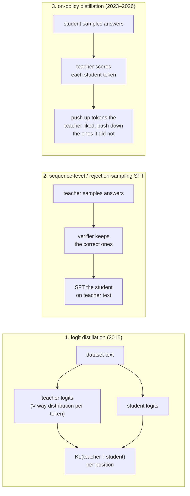
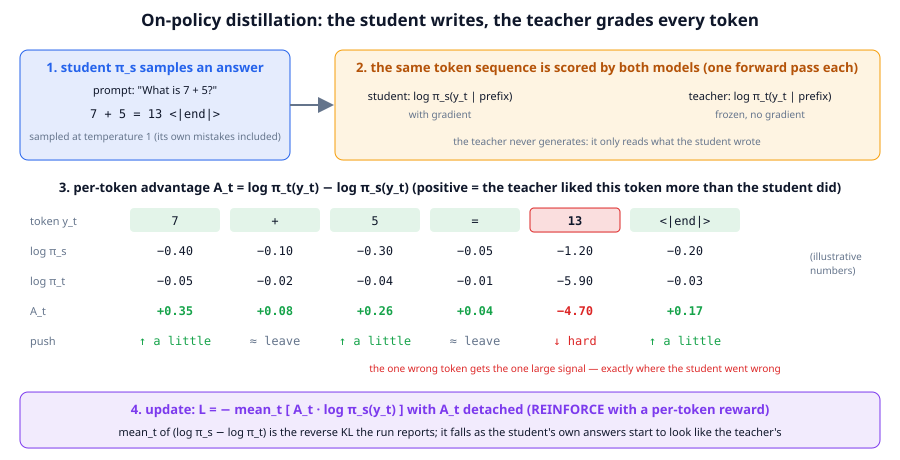

# Chapter 20: Distillation and on-policy distillation

**Part III · ~2.5 hours · Prerequisites: Chapters 15, 18, 19**

> 🎯 Goal: Explain teacher–student training and implement on-policy distillation.
> 🧪 Lab: `labs/lab20_opd.py` · 🎛️ Interactive: none for this chapter (the GRPO simulator `interactive/19_grpo_simulator.html` shows the sampling half of the loop)

## Why this matters

Every frontier lab in 2026 trains one very large model and then ships a family of smaller ones, and the small ones are not trained from scratch on the same recipe: they are **distilled**, meaning trained to imitate the big one. **Distillation** is any procedure in which a **student** model learns from the outputs of a **teacher** model rather than (or in addition to) from a dataset. The reason is cost. Reinforcement learning with verifiable rewards (Chapter 19) is expensive because the only signal is one number per sampled answer; a teacher that already knows the answer can say, for every token the student writes, "that token was fine" or "that token was the mistake", and a dense signal teaches faster than a sparse one. The Thinking Machines write-up of October 2025 reported that this **on-policy distillation** reached the same reasoning-benchmark score as RL for a small fraction of the compute (they report figures in the range of 10–30× cheaper) and it has since become the cheapest stage of the post-training pipeline. In this chapter you build the three classic recipes, in order of age, watch the two older ones fail in the way that motivated the newest one, and distil your own `small` TinyLM into a `nano` one on the addition task.

## The idea in pictures 📐

There are three ways to learn from a teacher, and they differ in one question: *whose text is the student trained on?*



Recipe 1 trains the student on *dataset* text and asks it to copy the teacher's whole probability distribution at every position, not only the correct token. Recipe 2 trains the student on *teacher* text: sample from the teacher, keep what a verifier accepts, fine-tune. Recipe 3 trains the student on *its own* text: the student writes, the teacher grades what it wrote. Recipes 1 and 2 are **off-policy** (the training text was not produced by the policy being trained); recipe 3 is **on-policy** (it was). The distinction matters because of a failure mode called **exposure bias**: a model trained only on good text never sees the states it reaches after making a mistake, so when it does make one at generation time it has no idea how to recover, and errors compound. On-policy training removes exposure bias by construction: the student is corrected in exactly the states it actually visits.



The figure follows one on-policy distillation step on the prompt "What is 7 + 5?". In box 1 the student samples an answer at temperature 1 and writes `7 + 5 = 13`, a wrong sum. In box 2 the *same* token sequence is run through the student (with gradients) and the teacher (frozen), which gives two log-probabilities for every generated token. The table in box 3 subtracts them: the **per-token advantage** `A_t = log π_t(y_t) − log π_s(y_t)` is small and positive on the tokens `7`, `+`, `5`, `=` (the teacher agrees with them slightly more confidently than the student) and large and negative on `13`, the one token where the student went wrong and the teacher would have written something else. Box 4 is the update: a REINFORCE step with `A_t` in place of the reward, so `13` is pushed down hard and the rest are nudged up. Compare this with GRPO on the same answer: the verifier would return a single 0 and every token of the answer, including the correct `7 + 5 =`, would be pushed down equally. Note that the teacher never generates anything: it only reads.

An analogy: recipe 2 is learning chess by studying grandmaster games; recipe 3 is playing your own games with a grandmaster who comments on every move. The limit of the analogy: a chess coach can explain *why*, whereas the teacher model only supplies a number per token, and if the teacher is wrong the student copies the error with equal confidence.

## The idea in code

The library file is `llm/distill.py` (about 200 lines). Imports for this chapter:

```python
import torch
from llm import tasks, chat
from llm.distill import kd_logit_loss, offline_distill, OPDConfig, on_policy_distill_step, opd_train
from llm.model import TinyLM
from llm.pipeline import get_tokenizer, run_path
from llm.rl import token_logprobs, response_mask, masked_mean
```

### Recipe 1: logit distillation

**Logit distillation** (Hinton, Vinyals and Dean, 2015) trains the student to match the teacher's full next-token distribution on a fixed text. The loss is the **forward KL divergence** from teacher to student, averaged over the positions the mask selects:

```
L = (1 / Σ mask) · Σ_t mask_t · τ² · Σ_v p_t(v) · [ log p_t(v) − log p_s(v) ]
```

Read this as: at every position, for every vocabulary entry `v`, weight the log-ratio of teacher to student probability by how much the *teacher* believes in `v`, and add it up. The loss is zero only when the two distributions are identical. The **temperature** τ divides both sets of logits before the softmax; τ > 1 flattens the distributions so the student also learns which wrong tokens are nearly right (Hinton's "dark knowledge"), and the τ² factor keeps the gradient scale independent of τ.

```python
tok = get_tokenizer()
teacher = TinyLM.load(run_path("base_small.pt"))
student = TinyLM.load(run_path("base_nano.pt"))
ex = tasks.make_examples(1, seed=0, tasks=["add"], max_value=20)[0]
ids = torch.tensor([tok.encode(chat.render(ex.messages(), add_generation_prompt=False))])  # (1, T)
with torch.no_grad():
    t_logits, _ = teacher(ids[:, :-1])                       # (1, T-1, V)
s_logits, _ = student(ids[:, :-1])                           # (1, T-1, V), with gradient
mask = torch.ones(1, ids.shape[1] - 1)                       # (1, T-1): every position counts
print(kd_logit_loss(s_logits, t_logits, mask).item())        # 2.95 nats/token (two base models)
print(kd_logit_loss(t_logits, t_logits, mask).item())        # 0.0: identical distributions
```

The catch is the one the figure made: the text came from a dataset, and the student is never asked what *it* would have written.

### Recipe 2: sequence-level distillation, or rejection-sampling SFT

**Sequence-level distillation** (Kim and Rush, 2016) replaces the dataset with teacher samples. Its modern form adds a verifier and is called **rejection-sampling SFT**: sample several answers per prompt from the teacher, keep those the verifier marks correct, fine-tune the student on the survivors with the ordinary masked SFT loss of Chapter 15. This is how the DeepSeek-R1-Distill models of January 2025 were made (about 800k reasoning traces sampled from R1, filtered, then SFT into Qwen and Llama models of 1.5–70B parameters).

```python
out = offline_distill(student, teacher, tok, examples, n_samples=4, sft_steps_n=50, max_new_tokens=16)
print(out["keep_rate"], len(out["sft_losses"]))   # fraction of teacher samples that were correct; 50 losses
```

`offline_distill` does the three steps in ten lines: `sample_group` from the teacher, `tasks.verify` to reject, then `sft_steps` (a compact copy of `sft_train`) on the kept conversations. Two things to notice. If the teacher's keep rate is low, most of the sampling budget is wasted, and the student still never trains on its own mistakes.

### Recipe 3: on-policy distillation

**On-policy distillation (OPD)** was introduced as "generalized knowledge distillation" by Agarwal et al. (2023), and the Thinking Machines blog (October 2025) made the version below standard. The quantity minimised is the **reverse KL**, the divergence from student to teacher measured on samples from the *student*:

```
KL(π_s ‖ π_t) = E_{y ~ π_s} Σ_t [ log π_s(y_t | y_<t) − log π_t(y_t | y_<t) ]
```

Read this as: on the answers the student actually writes, how much more likely does the student find its own tokens than the teacher does? Reverse KL is **mode-seeking**: it is minimised by a student that places its probability mass only where the teacher's is high, and it does not punish the student for ignoring parts of the teacher's distribution it never samples. Forward KL (recipe 1) is **mode-covering** and forces a small student to spread probability over everything a large teacher might say, including modes it has no capacity to reproduce well.

The gradient is the step the figure drew. Because `E_{y~π_s}[∇ log π_s(y)] = 0`, differentiating the sampled sum directly gives pure noise; the correct gradient is the policy-gradient identity of Chapter 18 with the per-token advantage in place of the reward:

```
A_t = log π_t(y_t) − log π_s(y_t)            (detached)
L   = − (1 / Σ mask) · Σ_t mask_t · A_t · log π_s(y_t)
```

Read this as: every sampled token is a small REINFORCE episode whose reward is the teacher's opinion of that token relative to the student's own. The library function is twenty lines of tensor code:

```python
# inside on_policy_distill_step (llm/distill.py), after sampling ids (N, T) and mask (N, T-1)
with torch.no_grad():
    logp_t = token_logprobs(teacher, ids)        # (N, T-1) the teacher grades
logp_s = token_logprobs(student, ids)            # (N, T-1) the student, with gradient
adv = (logp_t - logp_s).detach()                 # (N, T-1) per-token advantage
loss = -masked_mean(adv * logp_s, mask)          # scalar
reverse_kl = masked_mean(-adv, mask)             # what the run reports
```

Three properties follow directly from this code. **Dense signal**: `adv` has one entry per generated token, against one entry per *answer* in GRPO. **No verifier**: nothing in the step checks whether the answer is right; the teacher's log-probabilities are the only supervision, so OPD works on tasks with no checkable answer. **Cheap teacher**: the teacher does one forward pass over text the student already produced, never a decode loop, so a teacher ten times the student's size costs roughly one student-sized training step of extra compute per batch rather than ten decode passes. The price is the one property GRPO does not have: the student can only become as good as the teacher, and it will copy the teacher's mistakes.

Running it is one call:

```python
cfg = OPDConfig(steps=40, group_size=4, prompts_per_step=4, max_new_tokens=16, lr=2e-4)
history = opd_train(student, teacher, tok, examples, cfg)
# opd step    0 | reverse KL 0.5123 | acc 0.05 | len  10.2 | 1.9s
# ...
```

Each step samples `group_size × prompts_per_step` answers from the student, grades them with the teacher, and takes one AdamW step. `history[i]["reverse_kl"]` is the curve to watch: it should fall, and accuracy should rise with it if the teacher is competent.

## Worked example 🧪

```bash
python3 labs/lab20_opd.py            # quick: 8 OPD steps, about 40 s once the warm-starts are cached
python3 labs/lab20_opd.py --full     # 60 OPD steps + the offline and two-stage recipes, about 8 min
```

The first run trains the two warm-starts and caches them (teacher: `base_small.pt` fine-tuned on 400 addition prompts for 800 steps, about 15 minutes; student: `base_nano.pt` for 600 steps, about 2.5 minutes). If another lab has left `runs/grpo_small.pt`, `runs/sft_small.pt` or `runs/sft_nano.pt` behind, the lab evaluates them on the task and uses them instead when they are good enough. All numbers below are from one CPU thread on a busy machine.

**The two models.** With `max_value=20` there are only 441 distinct addition problems, so this is a small memorise-and-generalise task, and it is deliberately one the nano model half-knows:

```
   teacher lab20_teacher_sft_small.pt: 2,361,792 params, accuracy 0.77
   student lab20_student_sft_nano.pt: 295,584 params, accuracy 0.33   [30 held-out prompts, greedy]
✅ the teacher is clearly better than the student on the task
```

The teacher is right three times in four and the student one time in three; the student already writes the `a + b = c` format perfectly and gets the operands right, and what it gets wrong is the sum. That is the "shared thinking patterns" precondition of the 2026 paper: the two models agree on *how* to answer and differ on *what*.

**(a) Logit distillation on one batch.** Eight held-out conversations are rendered through the chat template and both models score every position; `kd_logit_loss` averages the forward KL over the assistant tokens:

```
   tau = 1: KL(teacher || student) on assistant tokens = 0.222 nats/token
   tau = 2: KL(teacher || student) on assistant tokens = 1.936 nats/token
   tau = 4: KL(teacher || student) on assistant tokens = 2.858 nats/token
   teacher vs itself: 0.000000   |   over ALL positions (prompt included): 9.172
```

Read the first line as: on the answer tokens, the student's distribution is on average 0.22 nats away from the teacher's, a small number because both are near-certain about `13`, ` +`, `20`, ` =` and disagree only on the sum. Raising τ flattens both distributions and exposes the disagreement in the *tails* (which wrong sums each model considers plausible), and the τ² factor scales it back up, so the reported loss grows; that tail information is the "dark knowledge" logit distillation is designed to transfer. The last line is a warning about masks: over all positions, including the user's question, the KL is 9.2 nats, because neither model was ever trained to predict the prompt and their guesses about it are unrelated. Distil on the tokens you want to transfer, not on everything.

**(b) One on-policy step by hand.** The student samples four answers to `What is 13 + 20?` at temperature 1, and both models score them:

```
   sample 0: '13 + 20 =  is3'         wrong   | reverse KL  0.605
   sample 1: '13 + 20 = 34'           wrong   | reverse KL  0.207
   sample 2: '13 + 20 = 32'           wrong   | reverse KL -0.324
   sample 3: '13 + 20 = 26'           wrong   | reverse KL  0.480
   per-token table for sample 0:
          token  log pi_s  log pi_t      A_t
           '13'    -0.062    -0.000    0.062
           ' +'    -0.000    -0.000    0.000
            ' '    -0.000    -0.000    0.000
           '20'    -0.071    -0.000    0.071
           ' ='    -0.000    -0.000    0.000
            ' '    -0.000    -0.000    0.000
          ' is'    -6.245   -10.758   -4.513
            '3'    -5.133    -6.198   -1.065
      '<|end|>'    -0.001    -0.000    0.001
   most negative advantage in this sample: -4.51  (the token the teacher would not have written)
```

This is the figure with real numbers. Six of the nine generated tokens have advantages within ±0.07: both models are certain about them and the update leaves them alone. The token ` is` (the student wandered off-format) has `log π_s = −6.2` and `log π_t = −10.8`, an advantage of −4.5, and it will be pushed down hard; the `3` that followed gets −1.1. Every gradient this step produces is concentrated on the two tokens where the student went wrong, and nothing is spent on the seven it got right. Compare GRPO on the same sample: the verifier says 0, and every one of the nine tokens, including `13`, ` +`, `20`, is pushed down by the same amount.

Sample 2 is the other half of the lesson. Its reverse KL is *negative*: the teacher finds `32` more likely than the student does, because the teacher itself gets `13 + 20` wrong (it answered `32` during its own SFT evaluation). OPD will push the student toward `32` on this prompt. A student cannot learn from a teacher what the teacher does not know, and the teacher's errors arrive with the same per-token confidence as its correct answers.

PART_C_PLACEHOLDER

## 🆕 What the 2026 papers add, and when OPD fails

Three findings, all from 2026, with the level of evidence stated.

- **OPD works when student and teacher share thinking patterns and the teacher has something new to offer.** "Rethinking On-Policy Distillation" (April 2026, arXiv 2604.13016) reports that OPD gains are largest when the student already writes in a style the teacher recognises (so the teacher's per-token opinions are meaningful) *and* the teacher is genuinely more capable on the task; a teacher that only differs in style produces reverse-KL curves that fall without accuracy rising. The same paper's recipe is the **two-stage** one this chapter's lab reproduces at toy scale: an off-policy SFT stage on teacher samples first (to get the student into the teacher's style, so that the teacher's grades become informative), then OPD. https://arxiv.org/abs/2604.13016
- **Efficiency variants.** Lightning OPD (arXiv 2604.13010), Uni-OPD (arXiv 2605.03677) and DOPD (arXiv 2606.30626) propose ways to reduce the teacher's cost or unify OPD with RL objectives; a survey (arXiv 2606.22793) collects them. These are reported results from single papers and have not yet been reproduced across labs; treat the specific speed-up claims as provisional.
- **OPD is now the standard cheap stage.** Qwen3 (2025) used on-policy distillation from its flagship into its smaller models, and the Thinking Machines post reported reasoning gains at a small fraction of the RL cost. What is settled: OPD is cheaper than RL per unit of improvement whenever a good teacher exists. What is open: how far a student can be pushed past its teacher by mixing OPD with a verifiable reward, and whether the reverse-KL objective's mode-seeking behaviour costs diversity in ways the standard benchmarks do not measure.

**Distillation for reasoning models.** The R1 report of January 2025 made a claim that still holds in 2026: for small models, distilling the reasoning traces of a large RL-trained model (recipe 2) beats running RL on the small model directly, because a small model's own samples rarely contain the long, correct reasoning chains RL needs to reinforce. OPD is the natural next step (recipe 3 after recipe 2), which is exactly the two-stage recipe above.

## Try it yourself ✍️

1. **Temperature in logit distillation.** Repeat the `kd_logit_loss` snippet with `temperature=2.0` and `4.0`. Why does the loss shrink even though the τ² factor is there? (Hint: print the entropy of the teacher's softened distribution.)
2. **Forward vs reverse KL by hand.** Take a teacher distribution `[0.5, 0.5, 0.0]` over three tokens and a student that can only put mass on one token. Compute forward and reverse KL for students `[1, 0, 0]` and `[0.5, 0.5, 0]`. Which objective prefers which student, and why does that match "mode-seeking" vs "mode-covering"?
3. **Break the teacher.** Run `opd_train` with `teacher = student` (a copy). What does the reverse-KL curve do? Then use `base_small.pt` (the *base*, not SFT) as teacher. Does accuracy rise?
4. **Compute accounting.** Count forward passes per step for `on_policy_distill_step` (student sampling, teacher scoring, student scoring) and for `grpo_step` with the same group size. Which is cheaper, and what changes if the teacher is 10× the student's size?
5. **Two-stage recipe.** Run `offline_distill` for 100 SFT steps and then `opd_train` for 20 steps, and compare with 40 steps of OPD alone at the same wall-clock. The lab's `--full` mode prints the numbers you need to check your prediction.
6. **Interactive** 🎛️: in `interactive/19_grpo_simulator.html`, set every rollout's reward to the same value and watch the advantages vanish; then imagine each token having its own reward, as in OPD. Which of the simulator's failure modes (all-equal groups, entropy collapse) can OPD not have, and which can it still have?

## Check yourself ✅

<details><summary>1. What is the difference between off-policy and on-policy distillation, in terms of whose text the student is trained on?</summary>

Off-policy distillation (logit KD, rejection-sampling SFT) trains the student on text from a dataset or from the teacher; on-policy distillation trains the student on text the student itself sampled, with the teacher supplying per-token scores. Only the on-policy version corrects the student in the states it actually reaches at generation time.
</details>

<details><summary>2. Why is the naive gradient of the sampled reverse KL useless, and what replaces it?</summary>

The sampled sum Σ_t (log π_s − log π_t) is differentiated with respect to the student, but the expectation of ∇ log π_s under samples from π_s is zero, so the gradient is pure noise. The correct gradient is the score-function (REINFORCE) form: −Σ_t A_t ∇ log π_s(y_t) with A_t = log π_t(y_t) − log π_s(y_t) treated as a constant.
</details>

<details><summary>3. Name two things OPD needs that GRPO does not, and two things GRPO needs that OPD does not.</summary>

OPD needs a teacher model and enough capacity overlap that the teacher's per-token opinions are meaningful for the student; it also cannot exceed the teacher. GRPO needs a verifier (or reward model) and a group of samples per prompt so that the group mean can serve as a baseline; it also needs enough samples with different rewards or the step is wasted.
</details>

<details><summary>4. Why does reverse KL suit a small student better than forward KL?</summary>

Reverse KL is minimised by a student that puts its mass where the teacher's mass is high and ignores the rest (mode-seeking); forward KL forces the student to cover every mode of the teacher (mode-covering). A small student cannot represent everything a large teacher can, so covering makes it mediocre everywhere while seeking lets it be good where it can be.
</details>

<details><summary>5. The lab's two-stage recipe runs rejection-sampling SFT before OPD. What does the first stage buy?</summary>

It moves the student into the teacher's output style so that the teacher's per-token log-probabilities on student samples become informative (a teacher gives near-uniformly low scores to text in a format it never writes, which is a useless signal). This is the "shared thinking patterns" condition of the 2026 "Rethinking OPD" paper.
</details>

## Key takeaways

- Distillation trains a student on a teacher's outputs; the three recipes differ in whose text is used: a dataset (logit KD), the teacher's (rejection-sampling SFT), or the student's own (OPD).
- Off-policy recipes suffer from exposure bias: the student is never corrected in the states it reaches after its own mistakes.
- OPD minimises the reverse KL on student samples; the gradient is REINFORCE with a per-token advantage `log π_t − log π_s`, a dense signal instead of GRPO's one number per answer.
- The teacher only reads, never generates, so OPD is cheap; but the student cannot exceed the teacher and copies its errors.
- 🆕 2026 evidence: OPD works best when student and teacher share output style and the teacher is genuinely stronger; the practical recipe is off-policy SFT first, then OPD.
- Distilling reasoning traces from an RL-trained model beats running RL on a small model directly (R1, 2025); OPD is the follow-on stage.

## Going deeper

- Hinton, G., Vinyals, O. and Dean, J. "Distilling the Knowledge in a Neural Network" (2015). Logit distillation and the temperature trick. https://arxiv.org/abs/1503.02531
- Kim, Y. and Rush, A. "Sequence-Level Knowledge Distillation" (2016). Training on teacher samples instead of teacher logits. https://arxiv.org/abs/1606.07947
- Agarwal, R. et al. "On-Policy Distillation of Language Models: Learning from Self-Generated Mistakes" (GKD, 2023). The reverse-KL, student-samples formulation. https://arxiv.org/abs/2306.13649
- DeepSeek-AI. "DeepSeek-R1" (January 2025), section on distillation: rejection-sampling SFT of R1 traces into 1.5–70B models. https://arxiv.org/abs/2501.12948
- 🆕 Thinking Machines. "On-Policy Distillation" (October 2025). The recipe this chapter implements and the cost comparison with RL. https://thinkingmachines.ai/blog/on-policy-distillation/
- 🆕 "Rethinking On-Policy Distillation" (April 2026). When OPD works and the two-stage recipe. https://arxiv.org/abs/2604.13016
- 🆕 Lightning OPD (2026) https://arxiv.org/abs/2604.13010 , Uni-OPD https://arxiv.org/abs/2605.03677 , DOPD https://arxiv.org/abs/2606.30626 , and a survey https://arxiv.org/abs/2606.22793 . Efficiency variants; single-paper results.

---

← [Chapter 19](19-grpo-and-rlvr.md) · [Course home](../README.md) · [Chapter 21](21-agentic-rl.md) →
