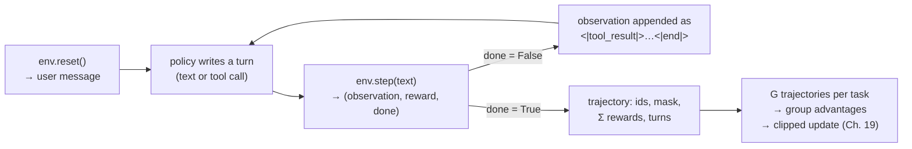
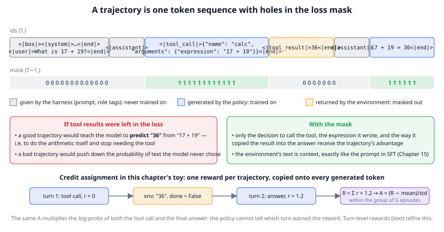

# Chapter 21: Agentic RL — training models to use tools

**Part III · ~3 hours · Prerequisites: Chapters 15, 19, 20**

> 🎯 Goal: Train a policy over multi-turn tool interactions and explain the infrastructure it needs.
> 🧪 Lab: `labs/lab21_agentic_rl.py` · 🎛️ Interactive: none for this chapter (`interactive/24_agent_loop_tracer.html` steps through the same kind of transcript the lab trains on)

## Why this matters

Everything in Chapters 18–20 trained a model to write one answer to one prompt. An **agent** does something different: it writes a message, the world replies (a tool result, a test failure, a file listing), it writes again, and the thing being judged is the whole back-and-forth. Coding assistants, computer-use agents and research agents in 2026 are trained with reinforcement learning on exactly these back-and-forths, and the recipe is GRPO from Chapter 19 with three changes that sound small and are not: the episode is a **trajectory** of several model turns rather than a single response; some of the tokens in that trajectory were *written by the environment*, not by the model, and must be kept out of the loss; and the environment is a real program (a shell, a browser, a Python sandbox) that has to be started, reset and isolated for every one of the thousands of rollouts a step needs. In this chapter you take TinyLM, which cannot add two numbers reliably, give it a calculator tool, and use multi-turn GRPO to teach it to call the tool and copy the result into its answer. Along the way you see the loss mask that keeps tool output out of the gradient, the crudest possible credit assignment, and a small example of an agent learning to game its reward.

## The idea in pictures 📐

A single-turn RL episode is `prompt → answer → reward`. A multi-turn episode is a loop:



Read the loop as: the environment starts the conversation, the policy writes until it either answers or asks for a tool, the environment answers the tool call, and the loop continues until the environment says the episode is over or the turn budget runs out. The **environment** is any object with `reset()` and `step(text)`; the library's `CalculatorEnv` is thirty lines, a coding environment in a 2026 lab is a container with a repository checked out and a test runner inside. What comes out of the loop is not a response but a `Trajectory`: one token sequence containing every turn, one **loss mask** saying which of those tokens the policy wrote, and one reward. From there the GRPO machinery of Chapter 19 applies unchanged.



The figure shows one two-turn trajectory from the lab as the model sees it: one flat sequence of token ids. Grey segments were given by the harness (system prompt, user question, the `<|assistant|>` tags that open each model turn); blue segments were generated by the policy (the tool call and the final answer); the orange segment was returned by the environment (the calculator's `36`). The mask row underneath is what `multi_turn_rollout` builds: 1 on generated tokens, 0 everywhere else. The two boxes explain why the orange segment must be masked. If tool results were in the loss, a rewarded trajectory would teach the model to *predict* `36` from `17 + 19`, which is teaching it to do arithmetic in its head and stop needing the tool, and a punished trajectory would push down the probability of text the model never chose. With the mask, only the decision to call the tool, the expression it wrote, and how it copied the result receive the advantage. The bottom row shows **credit assignment** as the lab does it: rewards from every turn are summed into one trajectory reward, the group-relative advantage is computed from that sum, and the same advantage multiplies every generated token, in both turns. The policy cannot tell which turn earned the reward; it learns anyway, because over many trajectories the turns that correlate with reward are reinforced more.

An analogy: a trajectory-level reward is a team bonus paid to everyone on a project; nobody knows whose contribution mattered, but over many projects the people who contribute end up on more bonus-winning teams. Its limit: on a long project with one saboteur, everyone's bonus is cut, and the signal per person is very weak; this is why long-horizon agent training looks for turn-level rewards.

## The idea in code

The library code is the Chapter 21 section of `llm/rl.py` (`Turn`, `Trajectory`, `encode_turn`, `multi_turn_rollout`, `multi_turn_grpo_step`, `CalculatorEnv`) plus the tool-call helpers in `llm/chat.py`. Imports for this chapter:

```python
import json, torch
from llm import chat, rl, tasks
from llm.model import TinyLM
from llm.pipeline import get_tokenizer, run_path
from llm.rl import CalculatorEnv, GRPOConfig, multi_turn_rollout, multi_turn_grpo_step, make_optimizer
```

### Tool-call format

A **tool call** in TinyLM's chat format is an assistant turn whose content begins with the special token `<|tool_call|>`, followed by JSON with a `name` and `arguments`. The harness replies with a `<|tool_result|>` turn. Both are ordinary turns in the template of Chapter 14:

```python
call = {"name": "calc", "arguments": {"expression": "17 + 19"}}
msgs = [{"role": "system", "content": "Use the calc tool."},
        {"role": "user", "content": "What is 17 + 19?"},
        {"role": "tool_call", "content": json.dumps(call)},
        {"role": "tool_result", "content": "36"},
        {"role": "assistant", "content": "17 + 19 = 36"}]
print(chat.render(msgs, add_generation_prompt=False))
# <|bos|><|system|>Use the calc tool.<|end|><|user|>What is 17 + 19?<|end|><|assistant|><|tool_call|>{"name": "calc", ...}<|end|><|tool_result|>36<|end|><|assistant|>17 + 19 = 36<|end|>
print(chat.parse_tool_call('<|tool_call|>{"name": "calc", "arguments": {"expression": "2+3"}}<|end|>'))
# {'name': 'calc', 'arguments': {'expression': '2+3'}}
```

`parse_tool_call` is the only parser: a regular expression for the marker and a JSON decode, and anything that fails to parse is treated as plain text (the environment then grades it as a final answer). Frontier APIs use the same shape with different delimiters; the two rules that matter are that the model learns to *emit* the marker itself (so the marker's tokens are in the loss mask) and that tool results are encoded with `allowed_special=False` so a tool cannot inject a fake `<|assistant|>` turn (Chapter 2's special-token rule; `rl.encode_turn` does this).

### Environments

The environment protocol is two methods:

```python
env = CalculatorEnv(17, 19)
print(env.reset())                                   # 'What is 17 + 19?'
print(env.step('<|tool_call|>{"name": "calc", "arguments": {"expression": "17 + 19"}}<|end|>'))
# ('36', 0.0, False)         observation, turn reward, done
print(env.step('17 + 19 = 36<|end|>'))
# (None, 1.2, True)          no observation, reward 1 + 0.2 tool bonus, episode over
```

`step` returns the tool's output as the next observation with reward 0 and `done=False`; a plain-text turn is graded with `tasks.verify`, and the episode ends. The **tool-use bonus** of 0.2 is a shaping reward paid only when the tool was called with an expression that actually evaluates to the answer *and* the final answer is right; the lab shows why the "and" matters. `CalculatorEnv.from_seed(i)` builds task `i` deterministically, which `multi_turn_grpo_step` needs so that the `G` trajectories of a group face the same problem and are comparable.

A real environment is a **sandbox**: an isolated process or container in which the agent's actions (shell commands, file edits) cannot reach anything outside, that can be reset to a known state for every rollout, and that returns observations as text. Chapter 26 builds the sandboxing; here the only sandboxing is the calculator's whitelist of characters.

### Rollouts and the mask

`multi_turn_rollout` plays one episode and builds the figure's `ids` and `mask`:

```python
tok = get_tokenizer()
model = TinyLM.load(run_path("lab21_tool_sft.pt"))            # the SFT'd policy from the lab
cfg = GRPOConfig(group_size=4, max_new_tokens=70, temperature=1.0)
traj = multi_turn_rollout(model, tok, CalculatorEnv.from_seed(3), cfg, max_turns=3)
for t in traj.turns:
    print(f"{t.role:12s} {t.text!r}")
print(traj.reward, traj.n_tool_calls, traj.ids.shape, traj.mask.shape)   # e.g. 1.2 1 torch.Size([84]) torch.Size([83])
trained = tok.decode([i for i, m in zip(traj.ids[1:].tolist(), traj.mask.tolist()) if m])
print(trained)   # exactly the two assistant turns, nothing else
```

The last two lines are the check that matters: decoding the tokens where `mask == 1` gives back exactly the assistant's text, with its `<|end|>` tokens, and nothing the environment wrote. Inside the function, every generated token appends a 1 to `gen_mask` and every token of an observation appends a 0; the mask is then shifted by one to align with `token_logprobs` (Chapter 18). One more detail: generation is budgeted so that a model turn always fits in the context, and if a *tool result* would overflow, it is the tool result that gets truncated, never a generated token, so the mask stays valid.

### The multi-turn GRPO step

```python
opt = make_optimizer(model, cfg)
st = multi_turn_grpo_step(model, tok, CalculatorEnv.from_seed, cfg, opt, n_tasks=2, max_turns=3)
print({k: round(v, 3) for k, v in st.items() if isinstance(v, float)})
# {'reward': 0.7, 'accuracy': 0.62, 'tool_call_rate': 0.88, 'turns': 1.9, 'skipped_frac': 0.0, ...}
```

Read the function as Chapter 19's `grpo_step` with `rollout_group` replaced by `G` calls to `multi_turn_rollout` per task, trajectory rewards in place of answer rewards, and the trajectory masks stacked into the batch. The objective is unchanged:

```
L = − (1 / Σ mask) · Σ_trajectories Σ_t mask_t · min(ρ_t · A, clip(ρ_t) · A)
```

Read this as: every token the policy generated anywhere in an above-average trajectory is pushed up, every generated token of a below-average one is pushed down, and the environment's tokens contribute nothing because their mask is 0. The stats add two agent-specific numbers: `tool_call_rate` (fraction of trajectories with at least one parsed tool call) and `turns` (mean assistant turns per trajectory).

### Turn-level rewards and credit assignment

`CalculatorEnv.step` returns a reward for *every* turn, and the library sums them. That is the hook for **turn-level rewards**: an environment can pay +0.1 for a well-formed tool call in turn 1 and 1.0 for the right answer in turn 2, and the sum still becomes one trajectory reward. Assigning different advantages to different turns (so that the tool-call turn is credited for the tool call and the answer turn for the answer) is **credit assignment**, and the library deliberately does not do it: every generated token receives the trajectory advantage. The 2026 systems below do more, from per-turn value estimates to process reward models that score each step, but the trajectory-level version is the baseline they are compared with, and on short episodes it works.

## Worked example 🧪

```bash
python3 labs/lab21_agentic_rl.py            # quick: 4 GRPO steps, about 90 s once the warm-start is cached
python3 labs/lab21_agentic_rl.py --full     # 30 GRPO steps, about 3 min
```

The first run trains the SFT warm-start (700 steps, about 5 minutes) and caches it as `runs/lab21_tool_sft.pt`; every later run loads it. All numbers below are from a CPU with one thread, on a busy machine.

**(a) The base model.** `multi_turn_rollout` on `base_nano.pt` produces Storyland, not a tool call:

```
      user         'What is 4 + 18?'
      assistant    ': 86 133 + 135?\nAnswer: � + 33 = 67.<|eos|>At the bridge, Ruby met Ivy. Finn was sad ...'
      reward 0.0 | tool calls 0 | 93 tokens | done=True
✅ the base model never produces a parseable tool call
```

The base model has seen `<|eos|>` but none of the chat tokens, so it continues the prompt as if it were a document. `parse_tool_call` returns `None`, the environment grades the text as a final answer, the episode ends with reward 0.

**(b) The data and the mask.** The lab builds 500 conversations (300 with a tool call, 200 direct answers) and prints the first one with trained tokens in brackets:

```
   example 0: 86 tokens, 59 trainable
   <|bos|><|system|>Use the calc tool.<|end|><|user|>What is 12 + 13?<|end|><|assistant|>[<|tool_call|>][{]["][n][a][m][e]["][:][ ]["][c][a][l][c]["][,] ... ["][12][ +][ ][13]["][}][}][<|end|>]<|tool_result|>25<|end|><|assistant|>[12][ +][ ][13][ =][ ][25][<|end|>]
✅ the tool_call marker is trained, the tool_result turn is not
```

Read the brackets against the figure: the `<|tool_call|>` marker and every character of the JSON are trained (the model must learn to *produce* them), `<|tool_result|>25<|end|>` is not, the second `<|assistant|>` tag is not, and the final answer is. Two costs are visible. The Storyland tokenizer has never seen JSON, so `{"name": "calc", ...}` is spelled out one character at a time: 46 of the 59 trainable tokens are the tool-call syntax. And the whole conversation is 86 tokens against the nano model's 128-position context, which is why the system prompt is the four-word `Use the calc tool.` rather than the library's default (the default pushes a two-turn trajectory to 148 tokens, and it no longer fits).

The SFT loop is fifteen lines in the lab: `chat.build_sft_example` per conversation, `chat.collate` per batch, `model(x, y, loss_mask=m)`. The masked loss goes from 8.63 to 0.05 in 700 steps at learning rate 1e-3 (at 3e-4 it stalls near 0.3 and the model copies the wrong numbers into the expression; the sum is not the hard part for this model, copying two numbers across 60 tokens of JSON is). After SFT, one sampled rollout and the greedy evaluation on 16 fixed tasks:

```
      user         'What is 4 + 18?'
      assistant    '4 + 19 = 20<|end|>'
      reward 0.0 | tool calls 0 | 31 tokens | done=True
   before GRPO (16 greedy episodes, 7s): tool_rate 0.56 | accuracy 0.69 | tool_and_correct 0.56 | reward 0.80 | turns 1.56
```

The sample shows the failure mode the tool exists to fix: without the calculator the model writes a wrong sum (and here even a wrong operand). The greedy numbers say the SFT policy calls the tool in 56% of episodes, matching the 60% of its training data, and *every* tool episode was correct (`tool_and_correct` equals `tool_rate`), while the direct answers were right about a third of the time. The reward gap between the two behaviours (1.2 versus about 0.3 in expectation) is what GRPO can exploit.

**(c) Multi-turn GRPO.** Four steps in quick mode, each with 2 tasks × 4 trajectories:

```
   step   0 | reward 0.75 | acc 0.62 | tool rate 0.62 | turns 1.6 | skipped 0.50 | loss -1.064 | 5s
   step   1 | reward 1.02 | acc 0.88 | tool rate 0.88 | turns 1.9 | skipped 0.50 | loss +0.083 | 10s
   step   2 | reward 0.82 | acc 0.75 | tool rate 0.38 | turns 1.4 | skipped 0.00 | loss -0.407 | 13s
   step   3 | reward 0.90 | acc 0.75 | tool rate 0.75 | turns 1.8 | skipped 0.50 | loss -0.081 | 20s

   metric               before    after
   tool_rate              0.56     0.62
   accuracy               0.69     0.75
   tool_and_correct       0.56     0.62
   reward                 0.80     0.87
```

Read `skipped 0.50` as: in half the groups all four trajectories got the same reward, so their advantages are zero and DAPO's dynamic sampling dropped them (Chapter 19). With only two tasks per step this happens often, and four steps is too few to see more than a nudge: every metric moves up by one episode in sixteen. The `--full` run is where the trend shows:

```
   before GRPO (40 greedy episodes, 17s): tool_rate 0.47 | accuracy 0.62 | tool_and_correct 0.47 | reward 0.72 | turns 1.48
   step   0 | reward 0.75 | acc 0.62 | tool rate 0.62 | turns 1.6 | skipped 0.50 | loss -1.064 | 5s
   step   5 | reward 0.25 | acc 0.25 | tool rate 0.25 | turns 1.2 | skipped 0.00 | loss +0.355 | 30s
   step  10 | reward 0.67 | acc 0.62 | tool rate 0.25 | turns 1.2 | skipped 0.00 | loss -1.045 | 48s
   step  15 | reward 0.90 | acc 0.75 | tool rate 0.88 | turns 1.9 | skipped 0.50 | loss -0.276 | 65s
   step  20 | reward 0.90 | acc 0.75 | tool rate 0.88 | turns 1.9 | skipped 0.00 | loss -0.210 | 83s
   step  29 | reward 0.90 | acc 0.75 | tool rate 0.75 | turns 1.8 | skipped 0.00 | loss -0.477 | 114s

   GRPO wall-clock 114s (3.8s per step)
   metric               before    after
   tool_rate              0.47     0.72
   accuracy               0.62     0.80
   tool_and_correct       0.47     0.70
   reward                 0.72     0.94
   turns                  1.48     1.73
✅ mean reward did not fall after GRPO
✅ the tool-use rate did not fall: tool trajectories earn the bonus
```

Thirty steps, two minutes, 240 trajectories in total. On 40 fixed tasks the greedy tool-use rate goes from 0.47 to 0.72, accuracy from 0.62 to 0.80, mean reward from 0.72 to 0.94, and the mean number of assistant turns from 1.48 to 1.73 (a tool episode has two turns). `tool_and_correct` tracks `tool_rate` almost exactly both before and after: whenever this policy calls the tool it gets the answer right, so the whole gain is the policy choosing the tool more often. That is the intended lesson of the environment's reward design: the tool episode is worth 1.2 and the direct answer is worth 1.0 times a coin flip, and the group-relative advantage turns that gap into a gradient toward calling the tool. Look also at steps 5–10: the rollout statistics collapse (tool rate 0.25, reward 0.25) and recover by step 15. With 8 trajectories per step the per-step numbers are noisy, and an early update that happened to push down a tool-call trajectory (a group where the direct answers were lucky) can suppress the tool for a few steps until the next group where it wins; larger groups and more tasks per step (the frontier uses hundreds) are what smooth this out.

**The mask on a trained trajectory.** The lab decodes the tokens where `mask == 1` and where `mask == 0` separately for one trajectory of the last step:

```
      user         'What is 15 + 0?'
      assistant    '<|tool_call|>{"name": "calc", "arguments": {"expression": "15 + 0"}}<|end|>'
      tool_result  '15'
      assistant    '1515 + 0 = 15<|end|>'
      reward 1.2 | tool calls 1 | 87 tokens | done=True
   trained  (60 tokens): '<|tool_call|>{"name": "calc", "arguments": {"expression": "15 + 0"}}<|end|>1515 + 0 = 15<|end|>'
   given    (26 tokens): '<|system|>Use the calc tool.<|end|><|user|>What is 15 + 0?<|end|><|assistant|><|tool_result|>15<|end|><|assistant|>'
✅ no environment or prompt token is in the loss
```

The trained string is exactly the two assistant turns concatenated; the given string is the prompt, both `<|assistant|>` tags and the tool result. Notice `1515 + 0 = 15`: the model stuttered on the copied number, the grader (`tasks.extract_answer` takes the last number after `=`) accepted it, and the trajectory earned the full 1.2. Lenient graders are how small hacks get reinforced; Chapter 23 returns to this.

The lab saves `figures/generated/lab21_agentic_rl.png` (reward, accuracy and tool rate per step; before/after bars) and `runs/lab21_tool_grpo.pt`, which Chapter 23's lab will evaluate alongside everything else.

## 🆕 The 2026 infrastructure and research landscape

What changes at scale is almost entirely about rollouts. A frontier agentic-RL step needs thousands of trajectories, each of which is a *conversation with a program* that can take seconds to minutes (run the tests, load the web page), and the trajectories have wildly different lengths. Three consequences drive the 2026 frameworks:

- **Asynchronous rollouts.** The trainer cannot wait for the slowest environment. AgentRL (arXiv 2510.04206) describes a fully asynchronous multi-turn, multi-task pipeline in which generation, environment execution and training overlap; verl's agentic-RL mode and SkyRL-Agent (arXiv 2511.16108) do the same with different engineering. The price is **off-policy lag**: the policy that produced a trajectory is a few updates older than the one being trained, and this is where PPO's clipping (Chapter 18) stops being a formality and starts doing work. https://arxiv.org/abs/2510.04206 , https://verl.readthedocs.io/en/latest/start/agentic_rl.html , https://arxiv.org/abs/2511.16108
- **Rollout-as-a-service.** ProRL-Agent (Microsoft, reported 2026) separates the environment fleet from the trainer entirely: containers are provisioned, reset and torn down by a service that the training job calls over the network. The lab's `env_factory(i)` is a one-line stand-in for that service.
- **Data from failures.** SENTINEL (arXiv 2606.12908) mines the trajectories where a tool agent failed, categorises the failures, and re-weights training toward them; RODS (arXiv 2606.19047) synthesises new multi-turn tool-use tasks online, so the task distribution keeps up with the policy. T²PO (arXiv 2605.02178) steers exploration with the policy's own uncertainty at each turn. These are single-paper results and their gains have not yet been reproduced across labs. https://arxiv.org/abs/2606.12908 , https://arxiv.org/abs/2606.19047 , https://arxiv.org/abs/2605.02178
- **Curriculum.** Every 2026 recipe reports some ordering of tasks from easy to hard, because a group of `G` trajectories on a task the policy always fails (or always solves) has zero advantage everywhere (DAPO's dynamic sampling, Chapter 19, throws such groups away). The lab's `from_seed(i, max_value)` is the knob: start with small numbers, raise `max_value` as accuracy rises.

**Reward hacking in agents.** An agent has more ways to cheat than a single-response model because it can act. In the lab the shaping bonus is paid only when the tool was called *and* the final answer is right; make it a flat bonus for calling the tool and the policy learns to call the tool and ignore the result, since the call is cheaper than the copy. At scale the same thing looks like editing the tests instead of the code, or printing "all tests pass". BenchJack (arXiv 2605.12673) audits agent benchmarks for exactly these exploits and reports that several widely used ones can be gamed by trajectories that never solve the task; the eval side of this story is Chapter 23. https://arxiv.org/abs/2605.12673

## Try it yourself ✍️

1. **Read the mask.** For three trajectories from the lab's `--quick` run, print `tok.token_str(i)` for every id with a bracket around the trained ones (the `describe_mask` helper from Chapter 15 does this). Confirm that every `<|tool_result|>` segment is unbracketed.
2. **Turn-level rewards.** Subclass `CalculatorEnv` so that `step` returns +0.1 on a syntactically valid tool call and 1.0 on a correct answer. Does `tool_call_rate` rise faster than in the lab? Does the final accuracy change?
3. **Hack the bonus.** Change the environment so the 0.2 bonus is paid whenever the tool is called, regardless of the answer. Train for the lab's number of steps and report `tool_call_rate` and `accuracy`. Explain what the policy found.
4. **Curriculum.** Train 20 steps with `max_value=10`, then 20 with `max_value=20`, versus 40 steps at 20. Compare accuracy at 20.
5. **Context budget.** The nano model has 128 positions and a trajectory in the lab is about 90 tokens. Add a second tool call (change `max_turns` to 4 and make the environment return an error the first time) and see what `multi_turn_rollout` does when the context fills. Which tokens get dropped, and why is that the safe choice?
6. **Interactive** 🎛️: open `interactive/24_agent_loop_tracer.html` and step through a transcript. For each event, say whether its tokens would be mask 1 or mask 0 in this chapter's trajectory, and which turn's reward it would receive under trajectory-level credit assignment.

## Check yourself ✅

<details><summary>1. What is a trajectory, and how does it differ from the responses GRPO trained on in Chapter 19?</summary>

A trajectory is the whole multi-turn episode (every model turn and every environment observation) encoded as one token sequence, with a mask marking the model's tokens and one reward for the episode. A Chapter 19 response is a single model turn; its "trajectory" has one blue segment and no environment tokens.
</details>

<details><summary>2. Why must tool results be masked out of the loss? Give both failure modes.</summary>

With a positive advantage, training on the tool result teaches the model to predict the tool's output itself (to do the arithmetic in its head), which defeats the purpose of the tool; with a negative advantage, it pushes down the probability of text the model never chose, which is noise at best. Masking makes the environment's text context, exactly like the prompt in SFT.
</details>

<details><summary>3. How does the lab assign credit across turns, and what is the cost?</summary>

It sums the per-turn rewards into one trajectory reward, computes a group-relative advantage from it, and multiplies every generated token in every turn by that same advantage. The cost is that the policy cannot tell which turn earned the reward, so the signal per turn is weak on long episodes; turn-level rewards and per-step value estimates are the remedies.
</details>

<details><summary>4. Why do agentic-RL frameworks need asynchronous rollouts, and what does that do to the objective?</summary>

Environments take variable, sometimes long, wall-clock time (tests, browsers), so a synchronous step would idle the trainer while waiting for the slowest one. Running rollouts asynchronously means trajectories were produced by a slightly older policy, so the importance ratio ρ is no longer 1 and PPO's clip actually constrains the update.
</details>

<details><summary>5. Describe a reward hack the calculator agent could find if the tool bonus were unconditional.</summary>

Call the tool (collect the bonus) and then write any answer, or even the same answer it would have written without the tool: the call is cheap to produce and is paid regardless of whether the result is used. The fix is to pay the bonus only when the tool's result matches the final, correct answer, which the library's environment does.
</details>

## Key takeaways

- Agentic RL trains a policy over trajectories: several model turns interleaved with environment observations, encoded as one token sequence with a loss mask.
- Tool calls are ordinary assistant turns with a marker the model must learn to emit; tool results are turns the model is given and must be masked out of the loss.
- Multi-turn GRPO is Chapter 19's GRPO with trajectory rewards and trajectory masks; the library sums per-turn rewards and gives every generated token the same advantage.
- Credit assignment across turns is the open problem; trajectory-level credit works on short episodes and weakens as episodes grow.
- 🆕 2026 infrastructure is about rollouts: asynchronous generation, environment fleets as a service, failure-driven and synthesised data, curricula.
- Agents can act, so they have more ways to hack a reward; pay shaping bonuses only when they coincide with the outcome you want.

## Going deeper

- Schulman, J. et al. "Proximal Policy Optimization Algorithms" (2017). The clip that matters once rollouts are asynchronous. https://arxiv.org/abs/1707.06347
- Yao, S. et al. "ReAct: Synergizing Reasoning and Acting in Language Models" (2022). The observe–think–act transcript format that agentic RL trains on. https://arxiv.org/abs/2210.03629
- 🆕 AgentRL: "Scaling Agentic Reinforcement Learning with a Multi-Turn, Multi-Task Framework" (2025). Asynchronous multi-turn RL infrastructure. https://arxiv.org/abs/2510.04206
- 🆕 SkyRL-Agent (2025). https://arxiv.org/abs/2511.16108
- 🆕 verl, "Agentic RL" documentation (2026). A concrete reference for how a production framework represents multi-turn trajectories and masks. https://verl.readthedocs.io/en/latest/start/agentic_rl.html
- 🆕 SENTINEL: failure-driven RL for tool agents (2026) https://arxiv.org/abs/2606.12908 ; RODS online data synthesis (2026) https://arxiv.org/abs/2606.19047 ; T²PO uncertainty-guided exploration (2026) https://arxiv.org/abs/2605.02178 .
- 🆕 BenchJack: auditing agent benchmarks for exploits (2026). https://arxiv.org/abs/2605.12673
- 🆕 Wolfe, C. "Agentic RL" (Substack, 2026). A readable survey of the field's infrastructure. https://cameronrwolfe.substack.com/p/agentic-rl

---

← [Chapter 20](20-distillation.md) · [Course home](../README.md) · [Chapter 22](22-safety-alignment.md) →
