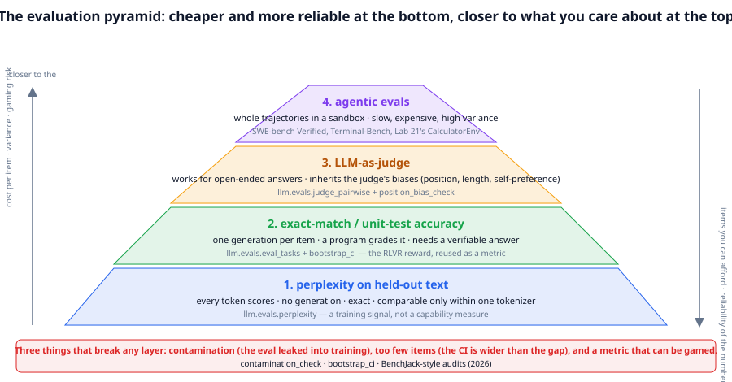
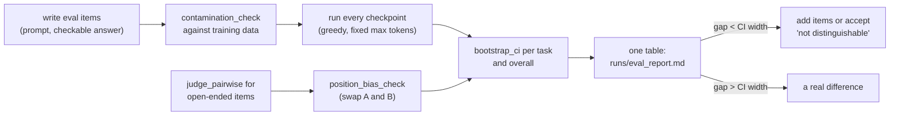

# Chapter 23: Evaluation

**Part III · ~2.5 hours · Prerequisites: Chapters 1, 15, 17, 19**

> 🎯 Goal: Build an eval harness and explain why benchmark numbers mislead.
> 🧪 Lab: `labs/lab23_evals.py` · 🎛️ Interactive: none for this chapter (`interactive/19_grpo_simulator.html` shows why a verifier's 0/1 is the same object as an exact-match eval)

## Why this matters

You now have a shelf of TinyLM checkpoints: base models of two sizes, an annealed one, SFT, distilled, tool-using and constitution-aligned ones. Which is best? The question sounds simple and every part of it is a trap. "Best at what" has to be a task with a checkable answer, or a judge, and judges have biases. The number you get has an error bar, and with a few dozen items the error bar is wider than the differences you are trying to see. The items may have leaked into training, in which case the score measures memory rather than skill; in 2026 this happened to the most-cited coding benchmark in the field. And an agent can score well by gaming the grader rather than solving the task. **Evaluation** is the discipline of producing numbers that survive these traps, and it is what every other chapter's claims rest on: "GRPO raised accuracy from 0.4 to 0.8" is only a fact if the eval was clean, large enough, and measured the right thing. In this chapter you build the harness, run every checkpoint through it with confidence intervals, plant a contamination and watch it inflate a score, and catch a biased judge with a two-line test.

## The idea in pictures 📐



The figure stacks the four kinds of measurement the library supports. At the bottom, **perplexity** on held-out text: every token in the text is a scored prediction, no generation is needed, the number is exact, and it is comparable only between models that share a tokenizer (Chapter 2). It is the cheapest and most reliable number, and it is a *training* signal: a model can have lower perplexity and be worse at every task you care about. One layer up, **exact-match** and **unit-test** evals: generate one answer per item and let a program grade it. This is the verifiable reward of Chapter 19 reused as a metric, and it needs a task whose answer can be checked. Above that, **LLM-as-judge**: for open-ended answers, ask a model which of two answers is better; it scales to anything but inherits the judge's biases. At the top, **agentic evals**: run whole trajectories in a sandbox and check the outcome (did the tests pass, did the file get written), the closest to what a deployed agent does and the slowest, most expensive and highest-variance number. The arrows on the sides say the trade: going up buys relevance and costs items, so the error bars widen and the gaming risk grows. The red band at the bottom names the three things that break every layer, and the lab exercises each.



Read the flow as the lab's order of operations: items first, contamination check before any model runs, deterministic decoding so a rerun gives the same number, a confidence interval on every accuracy, and a decision rule for reading the table. The judge branch joins the same table once its position bias has been checked.

An analogy: a benchmark score is a medical test result. The test has a false-positive rate (contamination), a sample size (the error bar), and it can be gamed by studying for the test rather than getting healthy. Its limit: a medical test is calibrated against a ground truth; for most of what people want from language models, there is no ground truth to calibrate against, which is why the field keeps building new benchmarks.

## The idea in code

The library file is `llm/evals.py` (about 210 lines). Imports for this chapter:

```python
import torch
from llm import tasks
from llm.evals import (perplexity, eval_tasks, bootstrap_ci, judge_pairwise, position_bias_check,
                       rule_based_judge, contamination_check, compare_checkpoints)
from llm.data import decontaminate
from llm.model import TinyLM
from llm.pipeline import get_tokenizer, get_tokens, run_path
```

### Perplexity

```python
tok = get_tokenizer()
_, val_tokens = get_tokens(tok)                              # held-out Storyland stream, (N,) ids
model = TinyLM.load(run_path("base_small.pt"))
print(perplexity(model, val_tokens, batch_size=8, seq_len=128, n_batches=10))   # e.g. 3.2
```

`perplexity` is `exp` of the mean next-token loss over fixed random windows of the stream (same windows every call, so it is reproducible). Read the number as "the model is as unsure as if it were choosing uniformly among this many tokens". It is a fine way to compare two pretraining runs on the same data; it says nothing about whether the model can add.

### Exact-match accuracy, with an error bar

```python
eval_set = tasks.make_examples(84, seed=2023, max_value=20)  # 7 task types, checkable answers
res = eval_tasks(model, tok, eval_set, max_new_tokens=24)    # greedy decoding
print(res.accuracy, res.per_task)                            # overall and per task
print(res.table())                                           # markdown with 95% CIs per task
lo, hi = bootstrap_ci(res.correct)                           # (0.31, 0.52) for accuracy 0.42 on 84 items
```

`eval_tasks` asks every question through the chat template at temperature 0, grades with `tasks.verify` (the same function that was the reward in Chapter 19), and keeps the per-item 0/1 scores. `bootstrap_ci` resamples those scores with replacement 1,000 times and reports the central 95% of the resampled means. The formula for a rough half-width is:

```
half-width ≈ 1.96 · sqrt( p (1 − p) / n )        (≈ 1 / sqrt(n) when p ≈ 0.5)
```

Read this as: with 100 items the interval is about ±0.10 wide, so two models at 0.62 and 0.58 are not distinguishable; to see a 0.05 gap reliably you need around 400 items, and to see a 0.02 gap around 2,500. The lab prints this table for real.

### Contamination

**Contamination** is overlap between evaluation items and training data. The GPT-3 and Llama reports checked it with word n-grams: an eval item is contaminated if any run of `n` consecutive words in it also appears in the training set. The library has both directions:

```python
train_docs = [{"text": "Reverse the word: kite etik"}, {"text": "Mia had a red kite."}]
print(contamination_check(train_docs, ["Reverse the word: kite"], n=4))   # 1.0: it leaked
print(contamination_check(train_docs, ["Write in capitals: boat"], n=4))  # 0.0
kept = decontaminate(train_docs, ["Reverse the word: kite"], n=4)          # training-side: drop the doc
```

`n` matters: with `n=13` (a common production choice) a four-word prompt can never match, so the lab uses `n=4` for its short items and says so. The check catches verbatim leaks; paraphrased leaks (the same problem in different words, the same code with renamed variables) are the 2026 problem, discussed below.

### LLM-as-judge and the swap test

```python
ex = tasks.TaskExample("add", "What is 3 + 4?", "3 + 4 = 7", {"answer": 7})
judge_pairwise(ex, "3 + 4 = 7", "3 + 4 = 8", rule_based_judge)          # "A"
position_bias_check(rule_based_judge, ex, "3 + 4 = 7", "3 + 4 = 8")
# {'forward': 'A', 'swapped': 'A', 'consistent': True, 'position_bias': False}
position_bias_check(lambda p, a, b: "A", ex, "3 + 4 = 7", "3 + 4 = 8")     # a judge that always picks the first
# {'forward': 'A', 'swapped': 'B', 'consistent': False, 'position_bias': True}
```

A **judge** is any function `(prompt, answer_a, answer_b) → "A" | "B" | "tie"`; the library ships a rule-based one so the scaffolding can be exercised without an API. The **swap test** judges `(a, b)` and `(b, a)` and translates the second verdict back: a judge with **position bias** (LLM judges measurably prefer the first answer shown, and some the second) contradicts itself. The other known biases, **length bias** (longer answers win) and **self-preference** (a model prefers its own style), are checked the same way, by controlled pairs; the lab shows a length-biased judge preferring a verbose wrong answer.

### One table for every checkpoint

```python
print(compare_checkpoints([run_path("base_nano.pt"), run_path("lab20_student_opd.pt")], tok, eval_set[:8]))
# | checkpoint | accuracy | perplexity |
# |---|---:|---:|
# | base_nano.pt | 0.00 | 26799.0 |
# | lab20_student_opd.pt | 0.12 | 46963.0 |
```

`compare_checkpoints` loads each path, runs `eval_tasks`, and measures perplexity on the chat-formatted eval items themselves (so it tracks how well each checkpoint models the conversation format; a base model that has never seen a chat token scores in the tens of thousands here, and even fine-tuned models score in the thousands because the eight items are short and the window is 128 tokens of mostly special-token structure). The lab builds a richer table on top of it: per-task accuracy, bootstrap CIs, and Storyland perplexity, saved as markdown.

## Worked example 🧪

```bash
python3 labs/lab23_evals.py            # quick: 28 eval items per checkpoint, about 3.5 min with 35 checkpoints
python3 labs/lab23_evals.py --full     # 84 items, about 5.5 min
```

The lab evaluates *every* loadable checkpoint in `runs/` (Lab 10's optimizer checkpoints are skipped), so its table depends on which labs you have run. All numbers below are from one CPU thread on a shared machine.

**(a) Every checkpoint, with error bars.** Task accuracy on 84 items spread over the seven task types (greedy, 24 new tokens), a 95% bootstrap CI, and Storyland perplexity on the held-out stream:

```
   35 checkpoints: ['base_nano.pt', 'base_small.pt', ..., 'sft_nano.pt', 'sft_small.pt']
   base_nano.pt                 base           acc 0.00 [0.00, 0.00]  ppl(story)    2.9      4s
   base_small.pt                base           acc 0.00 [0.00, 0.00]  ppl(story)    2.1     11s
   lab13_annealed.pt            mid-training   acc 0.00 [0.00, 0.00]  ppl(story)    2.1    141s
   lab17_sft_small.pt           sft            acc 0.13 [0.06, 0.20]  ppl(story)    8.1    176s
   lab17_dpo_small.pt           dpo            acc 0.12 [0.05, 0.19]  ppl(story)    8.7    159s
   grpo_small.pt                grpo           acc 0.12 [0.06, 0.19]  ppl(story)    8.8    116s
   lab20_student_sft_nano.pt    sft            acc 0.12 [0.06, 0.19]  ppl(story) 2930.5    193s
   lab20_student_opd.pt         distilled      acc 0.11 [0.05, 0.18]  ppl(story) 1299.1    183s
   lab20_teacher_strong.pt      sft            acc 0.20 [0.12, 0.29]  ppl(story) 19753.6    213s
   lab21_tool_sft.pt            sft-tool-use   acc 0.02 [0.00, 0.06]  ppl(story) 12394.3    239s
   lab21_tool_grpo.pt           agentic-grpo   acc 0.01 [0.00, 0.04]  ppl(story) 21439.6    226s
   lab22_aligned.pt             cai-stage1     acc 0.08 [0.04, 0.14]  ppl(story) 16633.1    244s
   sft_nano.pt                  sft            acc 0.32 [0.23, 0.42]  ppl(story)  840.3    263s
   sft_small.pt                 sft            acc 0.43 [0.32, 0.54]  ppl(story)  183.4    267s
   ...
   lowest Storyland perplexity: base_small.pt (2.1); highest accuracy: sft_small.pt (0.43)
✅ perplexity and task accuracy rank checkpoints differently
```

(The full table, one row per checkpoint with per-task columns, is in `runs/eval_report.md`; the excerpt keeps the rows the chapters discuss. On this machine other labs had left 35 checkpoints in `runs/`, and the whole pass took 4.5 minutes.) Four things to read off it.

*Perplexity and accuracy disagree completely.* The best Storyland perplexity belongs to the base and mid-trained models (2.1), which score exactly 0.00 on every task because they have never seen a chat token; the best accuracy belongs to `sft_small.pt` (0.43), whose Storyland perplexity is 183, nearly a hundred times worse. Every post-training stage trades prose likelihood for behaviour, and perplexity on the pretraining distribution never sees the trade.

*The error bars are the story.* `lab17_sft_small`, `lab17_dpo_small` and `grpo_small` sit at 0.13, 0.12 and 0.12 with intervals of about ±0.07: this eval cannot rank them, and any chapter that claimed one beat another on 84 items would be over-reading. `sft_small` at 0.43 [0.32, 0.54] against `sft_nano` at 0.32 [0.23, 0.42] is a real gap only barely (the intervals overlap by 0.1).

*A checkpoint that is good at one thing scores low on a broad eval.* `lab20_teacher_strong.pt` is 98% accurate on addition (Chapter 20) and scores 0.20 here, because six of the seven task types are not addition; its per-task row in the report shows `add 0.94`. Read a benchmark's task mix before reading its number.

*Prompt mismatch shows up as a near-zero.* `lab21_tool_sft.pt` and `lab21_tool_grpo.pt` score 0.02 and 0.01. In Chapter 21 the GRPO checkpoint scored 0.97 on addition, but under the system prompt it was trained with; `eval_tasks` uses the course's default system prompt, and the policy does not recognise the task without its tool listing. The eval is not wrong, it is answering a different question ("how good is this model under *this* prompt"), which is why an eval must fix its prompt and say so.

The second table the report contains, from `compare_checkpoints`, measures perplexity on the *chat-formatted* eval items instead of Storyland prose, and there the base models are the outliers (5.4 million for `base_small.pt`): a distribution with special tokens the model never saw is, to it, nearly impossible text.

**(b) How wide is the error bar?** The lab resamples the best checkpoint's per-item scores at several sizes:

```
       n    acc         95% CI  half-width
      10   0.40 [0.10, 0.70]         0.30
      25   0.48 [0.28, 0.68]         0.20
      50   0.38 [0.24, 0.52]         0.14
     100   0.36 [0.27, 0.45]         0.09
     400   0.42 [0.37, 0.46]         0.05
```

Read the last column against the rule of thumb: at n = 100 the half-width is 0.09, so any two checkpoints in the table whose accuracies differ by less than about 0.1 are not distinguishable by this eval, whatever the second decimal says. To resolve a 0.05 gap you need 400 items, and the labs in this course use 30–100 because each item costs a generation.

**(c) Contamination, planted and caught.** Twenty story-QA items are copied into a training set of 100 clean story-QA items, five times each (a popular benchmark appears on many web pages), and `contamination_check` is run with the production value n = 13:

```
   contamination_check (n=13): clean train set vs leaked eval  0.00 | contaminated train set vs leaked eval  1.00 | contaminated vs the clean eval  0.10
   decontaminate() drops 100 of 200 documents
✅ contamination_check flags the planted items
   fine-tuned lab20_student_sft_nano.pt for 200 steps on 100 clean + 20 leaked items x5 (28s)
                            before    after
   leaked eval items          0.00     1.00   <- inflated: the model saw these exact prompts
   clean eval items           0.00     0.05   <- the honest number
✅ the leaked items improve more than the clean ones: the score is contaminated
```

`contamination_check` flags all 20 planted items against the contaminated set and none against the clean one; the 0.10 against the clean eval is a true positive of a different kind (two Storyland stories happen to share a 13-word run, because the corpus is built from templates). `decontaminate` then drops exactly the 100 leaked copies. The fine-tune is the part that matters: 200 steps on the contaminated set take the model from 0.00 to **1.00** on the leaked items and from 0.00 to 0.05 on the clean ones. A model that memorised twenty questions did not learn story comprehension, and if the leaked items had been the benchmark, its reported score would have been 1.00. Note also the recipe: the leak is planted five times, because that is how benchmark items appear on the web (a popular question is quoted, mirrored and scraped many times), and a single copy in 100 clean examples was *not* enough to move the score in the lab's earlier trials. Contamination is not a matter of one document.

**(d) A judge and its position bias.** The rule-based judge and two deliberately broken ones on the same pair:

```
   prompt 'What is 11 + 20?': A = '11 + 20 = 31' (correct), B = '11 + 20 = 32' (off by one)
   rule-based judge : forward A, swapped A  -> consistent=True
   'first wins'     : forward A, swapped B  -> position_bias=True
   'longer wins'    : B picks the verbose wrong answer over '11 + 20 = 31'
   over 20 prompts the 'first wins' judge shows position bias on 20/20; the rule-based judge on 0/20
```

The swap test is two calls and a dictionary lookup, and it separates the fair judge from the position-biased one on every prompt. It does not catch the length-biased judge, whose verdict is stable under swapping and simply wrong; that one needs a controlled pair (same content, different length), which is what the third line is.

The lab saves `runs/eval_report.md` (the full table, plus `compare_checkpoints`' own two-column version) and `figures/generated/lab23_evals.png`.

## 🆕 The 2026 benchmark landscape

What happened to the field's headline numbers, stated with the source and the level of evidence.

- **SWE-bench Verified lost its status.** The benchmark (real GitHub issues with hidden tests, 500 human-verified items) was the standard coding-agent number of 2024–2025. An OpenAI audit reported in 2026 found overlap between its items and the training data of frontier models, and that 59.4% of the hard tasks had flawed tests (tests that pass on wrong patches or fail on right ones). Both findings are reported figures from one audit; the direction is not disputed. The community moved to Terminal-Bench 2.x (whole terminal sessions in a container, graded by outcome), Humanity's Last Exam (expert-written questions designed to be unsearchable), and ARC-AGI-3 (novel interactive puzzles). "Coding Benchmarks Are Misaligned with Agentic SE" (arXiv 2606.17799) argues the deeper problem: issue-to-patch benchmarks do not measure what deployed coding agents do. https://arxiv.org/abs/2606.17799
- **Benchmarks can be gamed by agents.** BenchJack (arXiv 2605.12673) audits agent benchmarks for exploits and reports that several can be passed by trajectories that never solve the task: reading the expected output from a fixture, editing the test, or exploiting the grader. This is Chapter 21's reward hacking turned on the evaluator. https://arxiv.org/abs/2605.12673
- **Benchmark health as a number.** The Benchmark Health Index (arXiv 2602.11674) proposes scoring benchmarks themselves on contamination, label quality, saturation and gaming resistance, so that "our model scores 71.3" comes with "on a benchmark whose health is 0.4". Contamination detection beyond n-grams (arXiv 2603.21454) uses model-side signals (unexpectedly confident on eval items relative to paraphrases) to catch leaks that no string match finds. https://arxiv.org/abs/2602.11674 , https://arxiv.org/abs/2603.21454

**Agentic evals** deserve one more note. A trajectory-level eval has all of this chapter's problems at once: the outcome check must be tamper-proof (the sandbox must not let the agent touch the grader), the variance is high (one flaky test changes the score), and the cost per item is minutes. The 2026 practice is to run each item several times and report pass@k or mean pass rate with a CI, and to treat any benchmark the agent has not been audited against (BenchJack-style) as provisional.

## Eval-driven development, and building your own

The benchmarks above are for comparing labs. For your own model, the useful eval is the one that measures your task, and the practice that works is **eval-driven development**: write the eval before the training run, freeze it, decontaminate the training data against it, run every checkpoint through it, and change one thing at a time. The rules for writing it, each of which the lab demonstrates:

1. **Checkable answers where possible.** `tasks.verify` is the model: a program that returns 0 or 1. If the task is open-ended, write a rubric (Chapter 17) and use a judge, with the swap test.
2. **Enough items for the gap you care about.** Compute the CI before deciding the model improved. Prefer 400 items on one task over 40 items on ten tasks if the decision is about that one task.
3. **Hold it out.** Decontaminate the training data with `decontaminate` at an `n` that matches your item length. Never fine-tune on it "just to see".
4. **Deterministic decoding, fixed budget.** Temperature 0 and a fixed `max_new_tokens`, so a rerun reproduces the number and a longer answer budget is a documented change.
5. **Keep the failures.** `EvalResult.samples` holds every prompt, completion and verdict; read the wrong ones. The failure list is where the next training change comes from.

## Try it yourself ✍️

1. **Rank by perplexity, rank by accuracy.** From the lab's table, rank the checkpoints by Storyland perplexity and by task accuracy. Where do the rankings disagree, and what does each disagreement tell you about what the checkpoint was trained on?
2. **Widen the eval.** Re-run `eval_tasks` on the best checkpoint with 84, 168 and 336 items (`make_examples(n, seed=2023, max_value=20)`) and print the CI each time. At what `n` can you distinguish it from the second-best?
3. **Paraphrase contamination.** Re-run the lab's contamination demo but plant the leaked items *rephrased* ("Please reverse this word: kite"). Does `contamination_check` at `n=4` still catch them? Does the score still inflate?
4. **Length bias.** Write a judge that prefers the longer answer and run `position_bias_check` on it. Does the swap test catch it? Why not, and what test would?
5. **Your own eval.** Write 30 items for a task TinyLM has not been trained on (e.g. "What comes after Tuesday?"), with `tasks.verify`-style checking, and evaluate three checkpoints. Report accuracies with CIs and say whether any difference is real.
6. **Interactive** 🎛️: open `interactive/19_grpo_simulator.html` and note that the reward it shows for each rollout is exactly the `verify` score the eval uses. What would change in the simulator if the reward were a judge's verdict with 20% position bias?

## Check yourself ✅

<details><summary>1. Why can a model have lower perplexity and worse task accuracy than another?</summary>

Perplexity averages next-token loss over all held-out text and rewards modelling the corpus's style and common patterns; task accuracy asks for one specific behaviour on prompts that may be rare in the corpus. A model annealed on stories can predict stories better while a model fine-tuned on arithmetic answers questions better; the numbers measure different things.
</details>

<details><summary>2. Two models score 0.62 and 0.58 on 100 items. What can you conclude?</summary>

Nothing yet. The 95% bootstrap CI on 100 items is roughly ±0.10, so both intervals overlap heavily; a 0.04 gap would need on the order of 1,000 items to be resolved. Report "not distinguishable at n = 100" or add items.
</details>

<details><summary>3. What does <code>contamination_check</code> detect, what does it miss, and how does <code>n</code> affect it?</summary>

It detects verbatim overlap: any n-word sequence shared between an eval item and a training document. It misses paraphrases, translations and renamed-variable code. A large `n` (13) never matches short prompts; a small `n` (4) flags common phrases as leaks; choose it with the item length in mind.
</details>

<details><summary>4. What is the swap test and which judge bias does it catch?</summary>

Judge (a, b), then judge (b, a) and translate the verdict back; a consistent judge agrees with itself. It catches position bias (preferring the first or second slot). It does not catch length bias or self-preference, which need controlled pairs that vary only length or only style.
</details>

<details><summary>5. Name three reasons SWE-bench Verified stopped being the standard coding number in 2026.</summary>

Reported contamination (overlap with frontier training data), flawed tests on a large share of hard items (an audit reported 59.4%), and a mismatch between issue-to-patch tasks and what deployed agents actually do; plus the general finding (BenchJack) that agent benchmarks can be passed by gaming the grader.
</details>

## Key takeaways

- The four measurements (perplexity, exact match, judge, agentic) trade reliability and cost for relevance; perplexity is a training signal, not a capability score.
- Every accuracy needs a confidence interval; half-width ≈ 1/√n, so most differences people report on small evals are noise.
- Contamination is checked with n-gram overlap on both sides (`contamination_check`, `decontaminate`); it catches verbatim leaks only, and a leaked item's score inflates after a handful of fine-tuning steps.
- Judges have position, length and self-preference biases; the swap test is the minimum check.
- 🆕 In 2026 the field moved from SWE-bench Verified to Terminal-Bench, HLE and ARC-AGI-3, audits benchmarks for exploits (BenchJack) and scores their health.
- Build your own eval before training, freeze it, hold it out, decode deterministically, and read the failures.

## Going deeper

- Brown, T. et al. GPT-3 (2020), appendix C. The n-gram contamination methodology and its limits. https://arxiv.org/abs/2005.14165
- Zheng, L. et al. "Judging LLM-as-a-Judge with MT-Bench and Chatbot Arena" (2023). Position, verbosity and self-enhancement biases, measured. https://arxiv.org/abs/2306.05685
- Efron, B. and Tibshirani, R. *An Introduction to the Bootstrap* (1993). Where `bootstrap_ci` comes from.
- OpenAI. "Introducing SWE-bench Verified" (2024). The benchmark as it was intended.
- 🆕 "Coding Benchmarks Are Misaligned with Agentic Software Engineering" (2026). https://arxiv.org/abs/2606.17799
- 🆕 BenchJack: auditing agent benchmarks for exploits (2026). https://arxiv.org/abs/2605.12673
- 🆕 Benchmark Health Index (2026) https://arxiv.org/abs/2602.11674 ; contamination detection beyond n-grams (2026) https://arxiv.org/abs/2603.21454 .
- Terminal-Bench, Humanity's Last Exam, ARC-AGI-3: read each benchmark's own description of how it resists contamination and gaming, and compare with the rules in this chapter.

---

← [Chapter 22](22-safety-alignment.md) · [Course home](../README.md) · [Chapter 24](24-the-agent-loop.md) →
