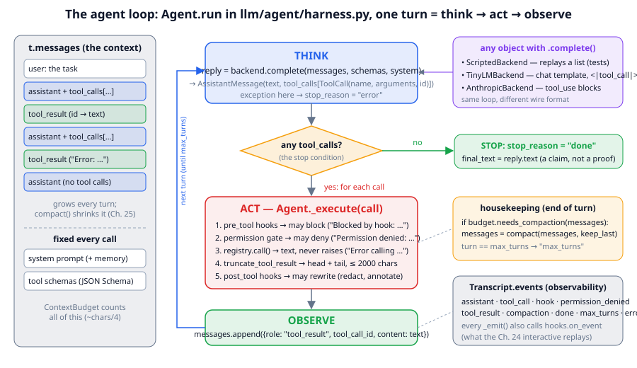
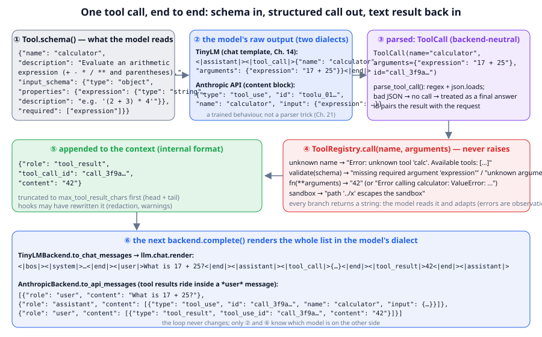
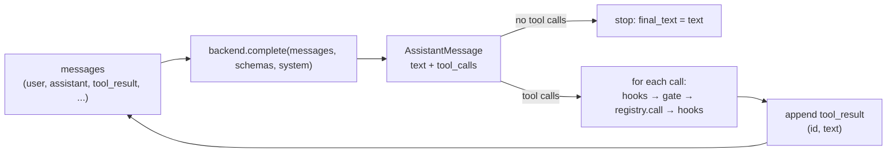

# Chapter 24: From model to agent — the loop

**Part IV · ~3 hours · Prerequisites: Chapters 7, 15, 21**

> 🎯 Goal: Write an agent loop from scratch and explain tool calling.
> 🧪 Lab: `labs/lab24_agent_loop.py` · 🎛️ Interactive: `interactive/24_agent_loop_tracer.html`

## Why this matters

Everything you have built so far is a function from text to text: give TinyLM a prompt, get a completion. An **agent** is that same function inside a loop that lets it *act*: the model writes a request such as "run the calculator on `(17 + 25) * 3`", a program runs it, the answer `126` is pasted back into the conversation, and the model reads it and decides what to do next. Claude Code fixing a failing test, a research assistant reading forty pages, a browsing agent booking a ticket: each is this loop with different tools. The loop itself is short. `Agent.run` in `llm/agent/harness.py` is forty lines, and the first half of this chapter walks through it line by line. The second half is about the machinery around it that makes the difference between a demo and something you would let touch your files: the schemas that tell the model what tools exist, the parser that turns the model's text into a call, the stop conditions, the rule that errors are observations rather than crashes, the permission gate, and the **backend** abstraction that lets the same loop drive a scripted fake (for tests), your own TinyLM, or a frontier model behind an API. The lab ends with an honest experiment: the instruction-tuned model of Chapter 15 cannot call a tool at all, Chapter 21's tool-trained model can, and a quick fine-tune in between learns the format but not the meaning; tool calling is a trained behaviour, not a parsing trick.

## The idea in pictures 📐



The figure is `Agent.run` drawn as a machine. The left column is the **context**: the list `t.messages` the model sees on every call, plus the fixed material (system prompt and tool schemas) re-sent each time. The centre is one **turn**. In THINK, the harness hands the whole context to the backend and gets back an `AssistantMessage`: some text and zero or more `ToolCall`s. The diamond is the **stop condition**: if there are no tool calls, the reply is the final answer and the run ends with `stop_reason = "done"`. Otherwise, for each call, ACT runs the five steps of `Agent._execute`: pre-tool hooks (may block), the permission gate (may deny), the registry (runs the tool and never raises), truncation, and post-tool hooks (may rewrite). Whatever came out, including an error message, a denial or a block, OBSERVE appends it as a `tool_result` message, and the loop goes back to THINK. The right-hand boxes are the parts that are not the loop: the three interchangeable backends, the end-of-turn housekeeping (compaction, Chapter 25; the `max_turns` cut-off), and the **event** log that the interactive replays.

Notice what the model *never* does. It never runs anything, never touches a file, never decides whether a call is permitted. It emits text that says "please run this"; the harness does the rest. That separation is why the same loop can drive an untrusted model safely.



The second figure follows a single call through its formats. ① The model has read the tool's schema, a JSON Schema object with the tool's name, a description and the types of its arguments. ② It emits a call in its own dialect: TinyLM writes `<|tool_call|>{...}<|end|>` in the chat template of Chapter 14; an API model returns a `tool_use` content block. ③ The backend parses either into the same `ToolCall(name, arguments, id)`. ④ `ToolRegistry.call` validates the arguments against the schema, runs the function, and returns a string on *every* path. ⑤ The string becomes a `tool_result` message with the call's id. ⑥ The next `complete` renders the list back into the model's dialect. Only ② and ⑥ know which model is on the other side.

One turn, as a flow:



Read the flow as: the model proposes, the harness disposes, and the result of every disposal goes back into the model's view of the world.

An analogy: the model is an expert on a phone line who cannot see your screen. You read them what is on it, they tell you what to type, you type it and read back what happened. The harness is you: hands, eyes and the judgement to refuse a dangerous command. The limit of the analogy: a person on the phone remembers the call; the model remembers only what you re-send, which is why the whole message list goes back every turn (Chapter 25 is about the cost of that).

## The idea in code

The library files are `llm/agent/tools.py` (tools and the registry), `llm/agent/backends.py` (where replies come from) and `llm/agent/harness.py` (the loop). Imports for this chapter:

```python
import json, os
from llm.agent import (Agent, AgentConfig, AnthropicBackend, AssistantMessage, Hooks, ScriptedBackend,
                       Tool, ToolCall, ToolRegistry, make_builtin_tools)
from llm.chat import parse_tool_call
```

### Step 1: the message format

The harness keeps a conversation as a list of small dicts with three roles. A tool call is part of an *assistant* message; a tool result is its own role, paired to the call by id:

```python
messages = [
    {"role": "user",        "content": "What is 6 * 7?"},
    {"role": "assistant",   "content": "Let me compute that.",
                            "tool_calls": [{"id": "call_1", "name": "calculator", "arguments": {"expression": "6 * 7"}}]},
    {"role": "tool_result", "tool_call_id": "call_1", "content": "42"},
    {"role": "assistant",   "content": "6 * 7 = 42."},
]
```

This is the *internal* format. Each backend translates it to and from its own wire format (Step 3), so the loop never changes when the model does.

### Step 2: tools and their schemas

A **tool** is a Python function plus a description the model can read. The description is a **JSON Schema**, the standard vocabulary for saying "an object with these typed properties, these of which are required"; the Anthropic and OpenAI APIs and MCP (Chapter 26) all use it, so the model learns one convention. **Function calling** (or tool calling) is the trained ability of a model to emit a request in that convention instead of prose.

```python
tools = make_builtin_tools("/tmp/lab24_demo")             # 7 sandboxed tools: read_file, write_file, list_dir, search, calculator, run_python, run_tests
print(json.dumps(tools.get("calculator").schema(), indent=1))
# {"name": "calculator",
#  "description": "Evaluate an arithmetic expression (+ - * / ** and parentheses).",
#  "input_schema": {"type": "object",
#                   "properties": {"expression": {"type": "string", "description": "e.g. '(2 + 3) * 4'"}},
#                   "required": ["expression"]}}
print(tools.call("calculator", {"expression": "(17 + 25) * 3"}))   # 126
print(tools.call("calculator", {}))                                 # Error calling calculator: missing required argument 'expression' (expected: ['expression'])
print(tools.call("teleport", {}))                                   # Error: unknown tool 'teleport'. Available tools: ['read_file', ...]
```

`ToolRegistry.call` carries the chapter's central design rule, **errors are observations**: the registry never raises. A wrong name, a missing argument, a wrong type, an exception inside the function, a path outside the sandbox: each comes back as text, and the model reads it and adapts, as a person reads an error message. A harness that raised instead would turn every model mistake into a crash. Each `Tool` also carries `read_only`, a promise the permission gate relies on (Step 6). Adding a tool of your own is one line:

```python
def word_count(text: str) -> str:
    return str(len(text.split()))
tools.register(Tool("word_count", "Count the whitespace-separated words in a text.",
                    {"type": "object", "properties": {"text": {"type": "string", "description": "the text"}}, "required": ["text"]},
                    word_count, read_only=True))
print(tools.call("word_count", {"text": "the quick brown fox"}))     # 4
```

### Step 3: backends, or where the next message comes from

A **backend** is any object with one method, `complete(messages, tools, system) -> AssistantMessage`. The library ships three:

```python
backend = ScriptedBackend([
    {"text": "Let me compute that.", "tool_calls": [{"name": "calculator", "arguments": {"expression": "6 * 7"}}]},
    "6 * 7 = 42.",
])
reply = backend.complete(messages[:1], tools.schemas(), "You are helpful.")
print(reply.text, reply.tool_calls[0].name, reply.tool_calls[0].id[:5])   # Let me compute that. calculator call_
print(backend.complete([], [], "").text)                                   # 6 * 7 = 42.
print(backend.complete([], [], "").text, len(backend.calls))               # (script exhausted) 3
```

The **scripted backend** replays a fixed list of replies and records every call it receives in `.calls`. It is what every test in `tests/test_agent.py` uses and what most of the lab uses, because it makes the *harness* the thing under test: deterministic, instant, no model, and you can assert exactly what the model was shown. When the script runs out it returns a text-only reply, so the loop always terminates.

`TinyLMBackend` drives your own model through the chat template: tools are listed in the system prompt (compactly by default, `- calculator(expression): Evaluate ...`, because a full JSON schema costs ~300 Storyland tokens; `compact_tools=False` pastes the schemas), tool calls become `<|tool_call|>{json}` turns, results become `<|tool_result|>` turns, and the reply is parsed with `parse_tool_call`. If the rendered prompt does not fit the model's window, `complete` raises `ContextTooLongError` rather than generating nothing; `Agent.run` turns that into `stop_reason="error"`.

```python
raw = '<|tool_call|>{"name": "calculator", "arguments": {"expression": "6*7"}}<|end|>'
print(parse_tool_call(raw))            # {'name': 'calculator', 'arguments': {'expression': '6*7'}}
print(parse_tool_call(raw[:-7]))       # {'name': ...}  (works without the closing <|end|>: generate strips stop tokens)
print(parse_tool_call('<|tool_call|>{"name": "calculator", "arguments": {"expression": "6*7"}<|end|>'))   # None: malformed JSON
print(parse_tool_call("I think the answer is 42."))                                                       # None: no call
```

A `None` means "no tool call", and the loop treats the text as a final answer. That is the safe failure: a model that produces broken JSON ends the run rather than crashing it. (Whether it can produce *valid* JSON at all is the subject of the lab's part 4.)

`AnthropicBackend` talks to a frontier model. The interesting part for a learner is not the network call but the translation, because the API keeps tool calls and results as typed *content blocks* inside ordinary user and assistant messages:

```python
api = AnthropicBackend.to_api_messages(messages)
print(api[1]["content"][1])   # {'type': 'tool_use', 'id': 'call_1', 'name': 'calculator', 'input': {'expression': '6 * 7'}}
print(api[2])                 # {'role': 'user', 'content': [{'type': 'tool_result', 'tool_use_id': 'call_1', 'content': '42'}]}
```

The tool result travels in a *user* message: from the API's point of view, the harness is the user, reporting what happened. The backend is imported lazily and refuses to construct without the `anthropic` package and an `ANTHROPIC_API_KEY`, so the whole course runs without either; to enable it, `pip install anthropic`, export the key, and pass `AnthropicBackend(model="claude-sonnet-5")` (or whichever current model id the provider lists; the library's own default is older) where the lab passes a `ScriptedBackend`. Nothing else changes.

### Step 4: `Agent.run`, line by line

Here is the loop, with only the event bookkeeping removed (the full version is `harness.py` lines 161–202):

```python
# def run(self, task, permission_fn=None) -> Transcript:
#     t = Transcript(messages=[{"role": "user", "content": task}])          # 1. the context starts with the task
#     system, schemas = self._system(), self.tools.schemas()                # 2. fixed material, built once per run
#     budget = ContextBudget(self.config.context_budget_tokens, system, json.dumps(schemas))
#     for turn in range(1, self.config.max_turns + 1):                      # 3. bounded: never an infinite loop
#         try:
#             reply = self.backend.complete(t.messages, schemas, system)    # 4. THINK
#         except Exception as e:
#             t.stop_reason = "error"; return t                             # 5. a backend failure ends the run
#         t.messages.append(reply.to_message())                             # 6. the model's turn joins the context
#         if not reply.tool_calls:                                          # 7. STOP: no calls = final answer
#             t.final_text, t.stop_reason = reply.text, "done"; return t
#         for call in reply.tool_calls:                                     # 8. ACT, one call at a time
#             result = self._execute(t, call, permission_fn, turn)          #    hooks → gate → tool → hooks
#             t.messages.append({"role": "tool_result", "tool_call_id": call.id, "content": result})   # 9. OBSERVE
#         if budget.needs_compaction(t.messages, self.config.compaction_threshold):                   # 10. housekeeping
#             t.messages = compact(t.messages, keep_last=self.config.compaction_keep_last)
#     t.stop_reason = "max_turns"; return t                                 # 11. the other way out
```

Line 1: the context is a list whose first entry is the task; `compact` (Chapter 25) never removes it. Line 2: the system prompt and schemas are computed once and re-sent on every call; `_system` also splices in the memory file if there is one. Line 3: `max_turns` (20 by default) is the outer stop condition; without it a model that always calls a tool would run forever. Line 4 is the only place the model is consulted. Line 5: if the backend throws (a timeout, an exhausted quota), the run ends with `stop_reason="error"` and an inspectable transcript; retry policy belongs to the backend. Line 6: the reply is appended *before* the check, so the transcript always contains what the model said. Line 7 is the inner stop condition. Lines 8–9: one `tool_result` per call, in order, paired by id. Line 10 keeps the context under budget. Line 11: falling off the end sets `final_text` to the last assistant text and the reason to `max_turns`.

The `Transcript` it returns holds the messages, the **events** (one record per thing that happened, which the interactive replays), the final text, the counts and the stop reason. `transcript.pretty()` prints the conversation, which is what the lab shows.

### Step 5: `_execute`, where the safety lives

```python
# def _execute(self, t, call, permission_fn, turn) -> str:
#     reason = self.hooks.run_pre(call)                                     # a. harness-owner rules first
#     if reason:
#         result = f"Blocked by hook: {reason}"
#     else:
#         tool = self.tools.get(call.name)
#         if tool is None:
#             result = self.tools.call(call.name, call.arguments)           # b. "Error: unknown tool ..."
#         elif not self._permitted(call, tool, permission_fn):
#             result = f"Permission denied: '{call.name}' is not allowed under policy '{policy}'. Try a different approach or ask the user."
#         else:
#             result = self.tools.call(call.name, call.arguments)           # c. the tool runs; never raises
#     result = truncate_tool_result(result, self.config.max_tool_result_chars)   # d. bound the size
#     return self.hooks.run_post(call, result)                              # e. harness-owner rewrites last
```

Every branch returns a string, and every string goes back to the model. The order matters: hooks run before the gate so a harness rule can block a call the policy would allow; the gate runs before the tool so a denied call never executes; truncation runs before post-hooks so a hook sees what the model will see.

### Step 6: the permission gate

The **permission gate** is `Agent._permitted`: it decides, per call, whether the tool may run. A **permission policy** is the config string that answers first: `allow_all` (tests and sandboxes); `allow_read_only` (any tool whose `read_only` flag is true runs without asking; for anything else the gate falls through to the permission function); or `ask`, which consults the permission function for every call. The **permission function** is a `permission_fn(call, tool) -> bool` passed to `run`, which a real harness wires to a prompt on the user's screen. With no function to ask, the answer is *deny*: the safe default. So `allow_read_only` is "auto-approve reads, ask about the rest", which is how the allowlists of production harnesses behave, and `ask` with no function is "deny everything".

```python
def ask_user(call, tool):
    print(f"[prompt] {call.name}({call.arguments}) read_only={tool.read_only}")
    return tool.read_only or call.arguments.get("path", "").endswith(".txt")
backend = ScriptedBackend([{"text": "", "tool_calls": [{"name": "write_file", "arguments": {"path": "note.txt", "content": "hi"}}]}, "Saved."])
t = Agent(backend, tools, AgentConfig(permission_policy="ask")).run("Save a note.", permission_fn=ask_user)
print(t.messages[2]["content"], "|", os.path.exists("/tmp/lab24_demo/note.txt"))   # Wrote 2 chars to note.txt | True
t = Agent(ScriptedBackend([{"text": "", "tool_calls": [{"name": "write_file", "arguments": {"path": "x.txt", "content": "hi"}}]}, "ok"]),
          tools, AgentConfig(permission_policy="allow_read_only")).run("Save.")
print(t.messages[2]["content"][:60])      # Permission denied: 'write_file' is not allowed under policy '
```

A denial is not an exception. It is a tool result that says why, and a well-trained model reads it and either finds another way or asks the user, which is exactly what the lab's scripted model does.

### Step 7: hooks

A **hook** is a function the *harness owner* (not the model) attaches to a point in `_execute`: `pre_tool(call)` returns a reason to block or `None`; `post_tool(call, result)` returns a replacement result or `None`; `on_event(event)` sees every event for logging and UIs. Hooks are how you encode rules that no policy string expresses: "never write under `secrets/`", "redact anything that looks like a key before the model sees it", "append a reminder to every test result".

```python
hooks = Hooks()
hooks.pre_tool.append(lambda c: "secrets/ is read-only" if c.name == "write_file" and c.arguments.get("path", "").startswith("secrets/") else None)
hooks.post_tool.append(lambda c, r: r + " [logged]")
backend = ScriptedBackend([{"text": "", "tool_calls": [{"name": "write_file", "arguments": {"path": "secrets/k", "content": "x"}}]}, "ok"])
t = Agent(backend, tools, AgentConfig(permission_policy="allow_all"), hooks=hooks).run("Write the key.")
print(t.messages[2]["content"])            # Blocked by hook: secrets/ is read-only [logged]
```

The block happened under `allow_all`: hooks and the gate are independent layers, and a call must pass both.

### Step 8: single-turn versus multi-turn

A **single-turn** tool use is the special case where the model calls one tool and answers: two model calls, one result. A **multi-turn** episode is the general case: the model chains calls, reads results, changes plan, and stops when it decides it is done (or hits `max_turns`). The loop is the same; what changes is that the context grows every turn and later decisions depend on earlier results, which is why Chapter 21 trained on *trajectories* and why Chapter 25 has to manage the window.

### Step 9: the same loop in production harnesses

Claude Code, the Claude Agent SDK and their equivalents from other labs are reported to be this loop with more machinery around each box: a richer tool set (shell, editor, browser, MCP servers), a permission system with allowlists and per-tool prompts, user-written pre- and post-tool hooks, sub-agents, skills (bundled instructions plus tools) and automatic compaction. The Agent SDK's public description lists exactly those parts, which map one-to-one onto `AgentConfig`, `Hooks`, `run_subagent` and `compact` here. The core, "call the model, run what it asked for, feed the result back, stop when it stops asking", is the forty lines above. Treat product specifics as reported and subject to change; the loop is the stable part.

## Worked example 🧪

```bash
python3 labs/lab24_agent_loop.py            # quick: 1–2 min (8 s importing torch, the rest three tiny models decoding on CPU)
python3 labs/lab24_agent_loop.py --full     # adds a 150-step tool-call SFT of the nano model: about 2 min more
```

Part (1) runs the two-tool task with a scripted model and prints the transcript and the events:

```
USER: Compute (17 + 25) * 3 and save the result to result.txt.
ASSISTANT: I'll compute the expression first.
  -> call calculator({"expression": "(17 + 25) * 3"})
  <- result: 126
ASSISTANT: 126. Now I'll save it.
  -> call write_file({"path": "result.txt", "content": "126\n"})
  <- result: Wrote 4 chars to result.txt
ASSISTANT: Done: (17 + 25) * 3 = 126, saved to result.txt.
[done after 3 turns, 2 tool calls]

   events:
    [turn 1] assistant: {"text": "I'll compute the expression first.", "n_tool_calls": 1}
    [turn 1] tool_call: {"id": "call_1", "name": "calculator", "arguments": {"expression": "(17 + 25) * 3"}}
    [turn 1] tool_result: {"id": "call_1", "name": "calculator", "content": "126"}
    ... (turn 2: assistant, tool_call, tool_result)
    [turn 3] assistant: {"text": "Done: (17 + 25) * 3 = 126, saved to result.txt.", "n_tool_calls": 0}
    [turn 3] done: {"text": "Done: (17 + 25) * 3 = 126, saved to result.txt."}
   what the model saw on each call (roles):
      call 0: ['user']  ~541 tokens
      call 1: ['user', 'assistant', 'tool_result']  ~600 tokens
      call 2: ['user', 'assistant', 'tool_result', 'assistant', 'tool_result']  ~664 tokens
```

Three turns, two tool calls, eight events; `assistant` is THINK, `tool_call` and `tool_result` are ACT and OBSERVE, `done` is the diamond. The last three lines are the scripted backend's record of what the model saw: the context grows by a call and a result each turn, on top of about 520 fixed tokens for the system prompt and seven schemas. Part (1b) is the catalogue of other endings:

```
   unknown tool -> Error: unknown tool 'calc'. Available tools: ['read_file', 'write_file', 'list_dir', 'search',
✅ unknown tool: an error text, then the (scripted) model corrected the name and finished
   bad arguments -> Error calling calculator: missing required argument 'expression' (expected: ['expression'])
✅ a model that always calls a tool is cut off: stop_reason='max_turns' after 3 turns
✅ a backend exception ends the run with stop_reason='error': TimeoutError: upstream API timed out
✅ two calls in one turn -> two tool_result messages (ids a, b) in one turn
✅ malformed JSON parses to None: the reply is then treated as a final answer, not a crash
```

Part (2) is the permission gate. Under `allow_read_only` the write is denied and the scripted model adapts:

```
ASSISTANT:
  -> call write_file({"path": "result.txt", "content": "126\n"})
  <- result: Permission denied: 'write_file' is not allowed under policy 'allow_read_only'. Try a different approach or ask the user.
ASSISTANT: I computed 126, but I am not allowed to write files under this policy. Please save it yourself or grant write access.
[done after 3 turns, 2 tool calls]
✅ result.txt was NOT written
      [permission prompt] write_file({"path": "result.txt", "content": "126\n"}) read_only=False -> allow
✅ under 'ask', the permission function allowed the .txt write and the file exists
✅ under 'ask' with no permission function, every tool is denied, the read-only calculator included (safe default)
```

Part (3) attaches three hooks and prints the live trace from `on_event`:

```
      trace | turn 2 | hook              | {"stage": "pre_tool", "blocked": true, "reason": "secrets/ is read-onl
   read result the model saw: API_KEY=[REDACTED] | DEBUG=false |
   write result the model saw: Blocked by hook: secrets/ is read-only for the agent
✅ post_tool hook redacted the API key before the model saw it
✅ pre_tool hook blocked the write even though the policy was allow_all
✅ the file on disk is untouched
```

Part (4) puts real models on the other side. The first thing it shows is why the backend lists tools compactly:

```
   nano model: 295,584 params, window 128 tokens
   prompt with ONE full JSON schema (compact_tools=False): 314 tokens; with the compact listing (default): 156 tokens
   -> ContextTooLongError: prompt is 314 tokens but the model's window is 128; compact the context (Chapter 25)
✅ an over-long prompt raises ContextTooLongError instead of silently generating nothing
✅ inside Agent.run the same error becomes stop_reason='error'
```

With the Storyland tokenizer, which compresses JSON poorly, one full schema is 314 tokens against the nano model's 128-token window; even the compact listing is 156 (the built-in calculator's description is long). `TinyLMBackend.complete` refuses with `ContextTooLongError`, and in the loop that is the `except` on line 5 of Step 4: `stop_reason="error"`, with the message in the last event. For the two *nano* models below the lab uses a backend subclass that sends *no* tool listing at all (the listing alone would cost ~50 of their 128 tokens, and the lab's own SFT is trained without it); Chapter 21's model is served with the plain `TinyLMBackend`, because Chapter 21 trained it *with* the listing and stored the served prompt in the checkpoint. Then three models, in order of how much tool training they have had:

```
   instruction-SFT model (Lab 15, no tool data): on 3 questions: 0/3 well-formed tool calls, 0/3 with the right expression
   instruction-SFT model (Lab 15, no tool data) in the loop: raw '55 + 63 = 118' -> stop_reason='done', tool calls 0
   -> a model with no tool training did NOT emit a valid <|tool_call|>: tool use is a trained behaviour (Chapters 15, 21)
   Chapter 21 model (runs/lab21_tool_grpo.pt): on 3 questions: 3/3 well-formed tool calls, 3/3 with the right expression
USER: What is 17 + 5?
ASSISTANT:
  -> call calc({"expression": "17 + 5"})
  <- result: 22
ASSISTANT: 17 + 5 = 22
[done after 2 turns, 1 tool calls]
✅ Chapter 21's model called calc({'expression': '17 + 5'}) and the harness returned 22
✅ its final answer uses the result: '17 + 5 = 22'
```

The instruction-tuned model of Lab 15 follows instructions but has never seen `<|tool_call|>`; asked "What is 17 + 25?" with a calculator on offer, it answers `55 + 63 = 118` directly, and the loop reads a reply with no tool calls as "done" and ends with a wrong answer rather than a crash. Chapter 21's model (the `small` TinyLM: 500 steps of SFT on tool traces, then 30 GRPO steps with a verifiable reward, on sums up to 20) is the successful case: it emits a well-formed call with the *right* expression, the harness runs `calc`, the result comes back as a `<|tool_result|>` turn, and the model answers from it. The line in between is Chapter 21's most practical lesson seen from the harness side: the *same weights* served without the tool listing they were trained under produce `<|tool_call|>{{nn{mm: "{aa"...`, JSON-shaped noise, 0/3. A fine-tuned policy is conditioned on its exact prefix, which is why the checkpoint carries the prompt and the lab checks that the harness serves it verbatim. (If `runs/lab21_tool_grpo.pt` is missing, run Lab 21 first.) `--full` adds a third model, a 150-step SFT on 600 traces trained inside this lab (106 s):

```
   SFT done in 106s: loss 9.38 -> 0.56
   150-step tool-SFT model: on 3 questions: 3/3 well-formed tool calls, 0/3 with the right expression
USER: What is 17 + 25?
ASSISTANT:
  -> call calculator({"expression": "21 + 34"})
  <- result: 55
ASSISTANT: 21 + 34 = 34
[done after 2 turns, 1 tool calls]
✅ the 150-step model emitted a well-formed call; the harness ran calculator('21 + 34') -> '55'
   expression correct for 'What is 17 + 25?': False (expected '17 + 25'); on the other 3: 0/3
```

Read the two halves of that separately. The *syntax* is learned in 150 steps: every reply is a well-formed `<|tool_call|>` with the right tool name and parseable JSON, the gate passes it, the calculator runs, and the model answers in turn 2. The *semantics* are not: the expression is `21 + 34` whatever the question, and the harness cannot tell, because the call was valid. A 0.3M-parameter model after 2,400 examples has memorised the template, not the copying of two numbers from the user turn into the JSON (250 steps on the 0–20 range gave the same result). What closes the gap is Chapter 21's recipe: more SFT, a narrower range, and then RL with a reward that checks the *answer*. That gap, a valid call with ungrounded arguments, is also why a harness should verify outcomes (Chapter 27) rather than trust that a tool was called.

Part (5) prints the Anthropic-format conversion of a six-message conversation (Step 3 shows the shape), checks the reverse direction on a fake response object, and shows that `AnthropicBackend()` refuses to construct without the package. The lab saves `figures/generated/lab24_events.png`, the events of run (1) on a timeline coloured by phase.

## 🆕 2026: what is settled and what is not

Settled: the loop; JSON Schema as the tool description language across providers and MCP; parallel tool calls in one turn; errors and denials returned as results rather than raised; permission gates with read-only allowlists; hooks as the extension point.

Open: how much *decision-making* belongs in the loop versus the model. Agentic RL (Chapter 21: AgentRL, SkyRL-Agent, ProRL-Agent, 2025–2026) trains models to plan, recover and stop on their own, shrinking what the harness must enforce; harness engineering (Chapter 27) adds verification around a model that is not trusted to self-report. The current evidence supports doing both; no one has a principled rule for where the line goes.

## Try it yourself ✍️

1. **A retrying backend.** Wrap `ScriptedBackend` in a class whose `complete` raises `TimeoutError` on its first call and delegates afterwards; add retry-with-backoff *inside the backend*, not the loop. Check `stop_reason == "done"` and that `backend.calls` shows the retry.
2. **Parallel tool calls.** Script a turn with three `calculator` calls and confirm three `tool_result` messages with matching ids in one turn. Break one (bad expression) and confirm the other two still ran.
3. **A stricter validator.** `ToolRegistry.validate` checks required keys, unknown keys and scalar types. Add `enum` and `minimum`/`maximum` support in a subclass and write a tool that needs them.
4. **Your own permission UI.** Write a `permission_fn` that reads from `input()` and run the two-tool task under `ask` in a terminal. Then write one that allows a tool once and denies it the second time, and read the scripted model's transcript.
5. **A loop from scratch.** Without looking at `harness.py`, write a 20-line `run(backend, tools, task)` implementing lines 1–9 of Step 4, and run `test_agent_loop_tool_call_then_answer` from `tests/test_agent.py` against it.
6. **Train tool use properly.** Run `--full`, then try to make the arguments correct: more steps, more examples, the `small` preset, or the 0–20 range of Chapter 21's `CalculatorEnv`. Report well-formed and correct counts for each change. Then rename the tool to `calc` in the data only, and see whether the model recovers from the `unknown tool` error.
7. **Interactive** 🎛️: open `interactive/24_agent_loop_tracer.html`. Step through transcript A and watch which box lights up; open the tool-call JSON and the result. Set `write_file` to *deny*, reset, and do the Challenge: predict the stop reason and turn count before stepping past the write. Then switch to transcript B to see a missing-file error handled as an observation.

## Check yourself ✅

<details><summary>1. What is the stop condition of <code>Agent.run</code>, and what are the two other ways a run can end?</summary>

A reply with no tool calls is the final answer (`stop_reason="done"`). The run also ends when `turn` reaches `max_turns` (`"max_turns"`, with `final_text` set to the last assistant text) or when the backend raises (`"error"`). "Done" means the model stopped asking, not that the task succeeded.
</details>

<details><summary>2. Why does <code>ToolRegistry.call</code> never raise, and what would go wrong if it did?</summary>

Because the model must be able to read its mistakes: an unknown tool, a missing argument or an exception inside the function comes back as text in a `tool_result`, and the model adapts (the lab's model corrects `calc` to `calculator`). If the registry raised, every model mistake would end the run with `stop_reason="error"` instead of being a step the model can recover from.
</details>

<details><summary>3. A tool result in our format is a message with <code>role: "tool_result"</code>. Where does it go in the Anthropic API format, and why?</summary>

Inside a *user* message, as a `tool_result` content block whose `tool_use_id` matches the assistant's `tool_use` block. From the API's point of view the harness is the user, reporting back what happened; consecutive results for one turn share a single user message.
</details>

<details><summary>4. Under <code>allow_all</code>, can a pre-tool hook still stop a call? Under <code>allow_read_only</code>, can a permission function allow a write?</summary>

Yes: hooks run before the gate and are an independent layer, so a hook can block under any policy (the lab blocks `secrets/` under `allow_all`). Yes, if one was passed: `_permitted` auto-approves read-only tools under `allow_read_only` and falls through to `permission_fn` for the rest, so a function that returns `True` lets the write run; with no function, the write is denied. Under `ask` the function is consulted for every tool, read-only ones included, and with no function everything is denied.
</details>

<details><summary>5. The instruction-tuned model answered <code>55 + 63 = 118</code> instead of calling the calculator. Is that a parsing problem?</summary>

No. `parse_tool_call` works (the lab checks it on valid and malformed strings); the model never emitted `<|tool_call|>` because nothing in its training taught it to. Tool calling is trained: 150 steps of SFT on tool traces make the same architecture emit well-formed calls (with wrong arguments), and Chapter 21's SFT-plus-GRPO model emits well-formed calls with the right arguments.
</details>

## Key takeaways

- An agent is a model in a loop: think (one model call), act (run each requested tool), observe (append the result), until a reply has no tool calls or `max_turns` is hit.
- Tools are described by JSON Schema; the model emits a call in its own dialect and the backend parses it into a `ToolCall`; the loop never learns which model is on the other side.
- Errors are observations: unknown tools, bad arguments, exceptions, denials and hook blocks all return as text the model reads.
- Safety lives in `_execute`: pre-tool hooks, then the permission gate (`allow_all` / `allow_read_only` / `ask`), then the sandboxed tool, then truncation and post-tool hooks.
- The scripted backend makes the harness testable; TinyLM and an API model plug into the same `complete` interface.
- Tool calling is trained, not parsed into existence: an instruction-tuned model produces no call, a short SFT produces well-formed calls with ungrounded arguments, and Chapter 21's RL-trained model gets both right.

## Going deeper

- Yao, S. et al. "ReAct: Synergizing Reasoning and Acting in Language Models" (2022). The paper that named the think–act–observe loop. https://arxiv.org/abs/2210.03629
- Schick, T. et al. "Toolformer: Language Models Can Teach Themselves to Use Tools" (2023). Tool calls as trained tokens in the text. https://arxiv.org/abs/2302.04761
- Anthropic, "Building effective agents" (December 2024). Workflows versus agents, and why the simplest loop is usually right. https://www.anthropic.com/research/building-effective-agents
- Anthropic, tool-use documentation for the Messages API (2024–). The `tool_use` / `tool_result` content blocks that `AnthropicBackend` translates. https://docs.anthropic.com/en/docs/build-with-claude/tool-use
- JSON Schema specification. The vocabulary every tool description uses. https://json-schema.org
- 🆕 Anthropic, Claude Agent SDK documentation (2025–2026). The production version of this chapter's loop: tools, permissions, subagents, hooks, skills, compaction. https://docs.anthropic.com/en/docs/agent-sdk
- 🆕 AgentRL (arXiv 2510.04206, 2025) and SkyRL-Agent (arXiv 2511.16108, 2025). Training the model's side of the loop; the companion to Chapter 21. https://arxiv.org/abs/2510.04206

---

← [Chapter 23](23-evaluation.md) · [Course home](../README.md) · [Chapter 25](25-context-engineering.md) →
