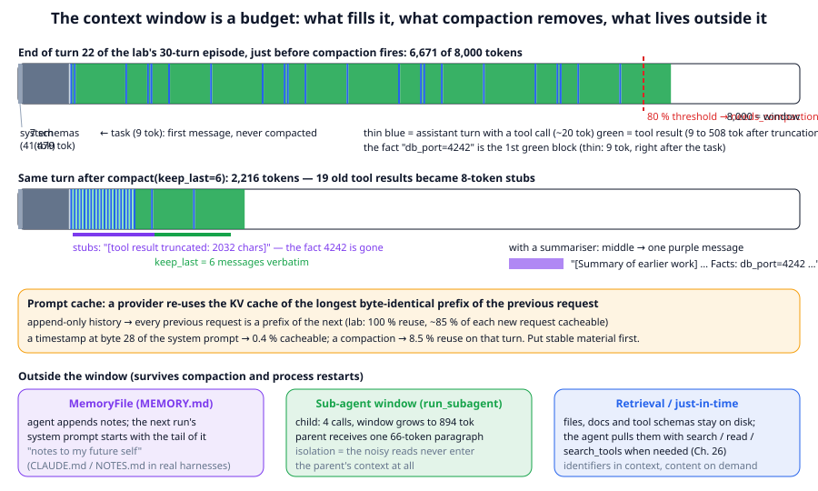
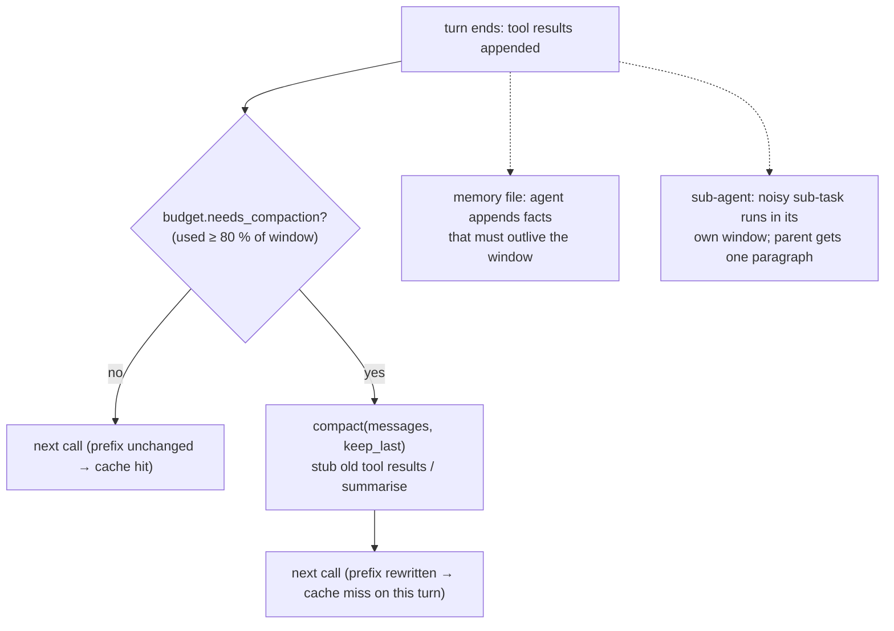

# Chapter 25: Context engineering

**Part IV · ~2 hours · Prerequisites: Chapters 7, 24**

> 🎯 Goal: Manage a context window deliberately: what goes in, when, and what gets removed.
> 🧪 Lab: `labs/lab25_context.py` · 🎛️ Interactive: `interactive/25_context_budget.html`

## Why this matters

The agent loop of Chapter 24 appends to its message list forever. Every tool result, every intermediate reply, stays in the context and is re-sent on every call. After thirty tool calls the lab's agent has 8,337 tokens of history against an 8,000-token window; after ninety it has 25,089. Three things go wrong as that number grows. The model is *cut off*: a real API rejects a request that exceeds the window, and `TinyLMBackend`, as the lab shows, raises `ContextTooLongError`, which ends the run with `stop_reason="error"`. The model gets *worse before that*: the current evidence, which this chapter cites, is that accuracy falls as relevant facts are buried under more tokens, a phenomenon the 2025–2026 literature calls **context rot**. And the bill grows *quadratically*: each call re-sends everything, so N turns cost about N²/2 turns' worth of input tokens unless a prompt cache is reused. **Context engineering** is the discipline of deciding what is in the window at each call: what is fixed, what is history, what gets compacted, what lives outside the window in files and sub-agents, and how to keep the prefix stable so that caching works. The library's `llm/agent/context.py` is 130 lines and does all of it.

## The idea in pictures 📐



The top bar in the figure is the lab's context at the end of turn 22, the first moment `ContextBudget.needs_compaction` returns true, drawn to scale against an 8,000-token window. From the left: the system prompt (41 tokens) and the seven tool schemas (479 tokens) are the **fixed cost**, paid on every call whether or not anything happened; then the task (9 tokens); then twenty-two alternating pairs of a thin blue assistant turn (a tool call, about 20 tokens) and a green tool result (between 9 and 508 tokens, the top end because the harness has already truncated each result to 2,000 characters). The red dashed line at 80 % (6,400 tokens) is the threshold the bar has just crossed. The second bar is the same context a moment later, after `compact(keep_last=6)` has run in the same turn: the first message is untouched, the last six messages are kept verbatim, and every older tool result has been replaced by an 8-token **stub** reading `[tool result truncated: 2032 chars]`. The window drops from 6,671 to 2,216 tokens. The purple mark under the stubs is the point of the chapter: the fact `db_port=4242`, read at turn 1, was the first green block, a thin 9-token one right after the task, and is now gone. A **summariser** (the purple message on the right) is the alternative that keeps facts at the cost of a model call.

The orange band is the **prompt cache**. Providers store the KV cache (Chapter 7) of a request and reuse it for any later request whose *byte-identical prefix* matches; append-only histories reuse everything, while a timestamp in the system prompt or a compaction rewrites the prefix and forfeits the reuse. The three boxes at the bottom are the places information can live *outside* the window: a **memory file** the agent appends to and a future run reads back; a **sub-agent** whose own window absorbs a noisy search and returns one paragraph; and **retrieval**, where files, documents and tool schemas stay on disk until the agent asks for them.

The decisions, as a flow the harness runs every turn:



Read the flow as: compaction is a tax the harness pays when it must, and the other two arrows are ways of never needing to pay it for the information that matters.

An analogy: the context window is a desk. Everything on the desk is visible at once, but the desk has a fixed size; when it is full you either sweep old papers into the bin (compaction), write the essentials on a sticky note before you sweep (a summary), file them in a cabinet you can reopen (memory and retrieval), or ask a colleague to do the messy part at their own desk and bring you the result (a sub-agent). The limit of the analogy: a person's attention does not degrade as the desk fills, and the evidence is that a model's does.

## The idea in code

The library file is `llm/agent/context.py`; the harness calls it from `Agent.run`. Imports for this chapter:

```python
import json
from llm.agent import (Agent, AgentConfig, ContextBudget, MemoryFile, ScriptedBackend, Tool,
                       compact, estimate_tokens, make_builtin_tools, run_subagent, DEFAULT_SYSTEM)
from llm.agent.context import message_text, truncate_tool_result
```

### Step 1: measuring the window

You cannot manage what you do not measure, and measuring exactly would mean running the tokenizer on every call. The library uses the approximation that English text is about four characters per token:

```python
print(estimate_tokens("The quick brown fox jumps over the lazy dog."))    # 11 (44 chars // 4)
tools = make_builtin_tools("/tmp/lab25_demo")
budget = ContextBudget(max_tokens=8000, system=DEFAULT_SYSTEM, tools_text=json.dumps(tools.schemas()))
print(budget.fixed)                                                       # 520: system prompt + 7 schemas, paid every call
msgs = [{"role": "user", "content": "Find the db port."}]
print(budget.used(msgs), budget.remaining, budget.needs_compaction(msgs))  # 524 7476 False
```

Read `budget.used` as: fixed cost plus the estimated tokens of every message, where a message's cost includes its tool-call JSON (`message_text`). The estimate is 20–30 % off for code and JSON (the lab's tool schemas are 479 tokens by this estimate and would be more under a real tokenizer), which is fine because the threshold is 80 %, not 100 %: the harness compacts well before the true limit, leaving room for the next reply and the next result.

### Step 2: truncation, the first line of defence

Before any result enters the context, `Agent._execute` truncates it:

```python
big = "\n".join(f"line {i}: INFO worker handled request {1000 + i}" for i in range(200))
print(len(big))                                     # 8489 chars
small = truncate_tool_result(big, max_chars=200)
print(small)
# line 0: INFO worker handled request 1000
# line 1: INFO worker handled request 1001
# line 2: INFO worke
# ... [8289 chars truncated] ...
# d request 1197
# line 198: INFO worker handled request 1198
# line 199: INFO worker handled request 1199
```

Head and tail are kept and the middle is dropped, on the grounds that a long listing or log is most informative at its ends (the command and the final error). The default `max_tool_result_chars=2000` is why no single result in the lab exceeds 508 tokens. Truncation is lossy and stupid; it is also the reason thirty tool calls cost 7,191 tokens of results rather than tens of thousands.

### Step 3: compaction, the second line

When truncation is not enough, `compact` rewrites the history:

```python
msgs = [{"role": "user", "content": "task"}]
for i in range(10):
    msgs.append({"role": "assistant", "content": "", "tool_calls": [{"id": str(i), "name": "read_file", "arguments": {"path": f"f{i}"}}]})
    msgs.append({"role": "tool_result", "tool_call_id": str(i), "content": "x" * 400})
out = compact(msgs, keep_last=4)
print(len(msgs), "->", len(out))                                        # 21 -> 21 (same count, smaller middle)
print(out[2]["content"])                                                # [tool result truncated: 400 chars]
print(out[-1]["content"][:10], budget.used(msgs), "->", budget.used(out))   # xxxxxxxxxx 1681 -> 945
```

The rules, in order of importance: the first message (the task, or the system prompt if it is in the list) is never touched, because an agent that forgets what it was asked is worse than one that forgets what it found; the last `keep_last` messages are kept verbatim, because recent context is the most relevant; every older `tool_result` becomes a stub. Assistant turns in the middle are kept, so the model can still see *what it did*, just not *what it saw*. With a `summarizer` function the whole middle collapses into one message instead:

```python
def summariser(older):        # a real harness calls the model here; this stand-in extracts facts
    facts = [l for m in older if m["role"] == "tool_result" for l in m["content"].splitlines() if "=" in l]
    return f"{len(older)} older messages; facts: {facts}"
out = compact(msgs, keep_last=4, summarizer=summariser)
print(len(out), out[1]["content"][:60])      # 6 [Summary of earlier work]\n16 older messages; facts: []
```

The summariser sees the *full* older messages, not the stubs, so it can pull out what matters. In production the summariser is a model call with a prompt like "list the decisions made, the facts learned and the open questions", and it is the most expensive and the most valuable line in this file: a summary that drops a fact loses it forever, and a summary that keeps it is the difference between the lab's compacted run, which loses `db_port=4242`, and its summarised run, which keeps it. `AgentConfig(summarizer=fn)` wires it into `Agent.run`; note that after the second compaction the summariser is summarising an earlier *summary*, so it (or its prompt) must be told to carry facts forward, which is what the lab's rule does and what its `--full` run tests over four compactions.

### Step 4: memory files, outside the window

Compaction deletes; a **memory file** remembers. It is a plain text file the agent appends to and that the next run's system prompt starts with:

```python
mem = MemoryFile("/tmp/lab25_demo/MEMORY.md")
mem.append("billing service: db_port=4242 (from config.txt)")
print(mem.render_for_prompt())
# ## Memory (notes from earlier sessions)
# billing service: db_port=4242 (from config.txt)
backend = ScriptedBackend(["The port is 4242."])
Agent(backend, tools, AgentConfig(memory_path=mem.path)).run("What is the db port?")
print("db_port=4242" in backend.calls[0]["system"])    # True: the note arrived via the system prompt, no tool call
```

`Agent._system` re-reads the file on every run, so the memory can grow between sessions and even between processes (run the snippet twice and the note appears twice: the file is append-only, and nothing deduplicates it but the agent); `render_for_prompt` keeps the *tail* of a long file, so the newest notes win. The library gives the agent no built-in tool for writing to memory; the lab registers a one-line `remember(note)` tool, which is the pattern real harnesses use (CLAUDE.md, NOTES.md, a scratchpad directory): the model decides what its future self needs to know and writes it down in words. Chapter 27 builds two structured memory files, PLAN.md and PROGRESS.md, on the same primitive.

### Step 5: sub-agents as context isolation

A **sub-agent** is a fresh `Agent` with an empty context that runs one sub-task and returns only its final text:

```python
backend = ScriptedBackend([
    {"text": "", "tool_calls": [{"name": "list_dir", "arguments": {"path": "."}}]},   # the child's one call
    "There are 3 files.",                                                            # the child's answer
])
parent = Agent(backend, tools, AgentConfig(permission_policy="allow_read_only"))
print(run_subagent(parent, "How many files are here?", tools_subset=["list_dir"], max_turns=4))   # There are 3 files.
print([m["role"] for m in backend.calls[1]["messages"]])   # ['user', 'assistant', 'tool_result'] — the child's window
```

`run_subagent` copies the parent's backend, hooks and permission policy, restricts the tools to a subset, and starts a new `Transcript`. Whatever the child reads stays in the child's messages; the parent receives one string. This is **context isolation**, and it is why "search the codebase for every use of X and tell me the pattern" is a sub-agent task in every 2026 coding harness: the fifty search results would fill the parent's window and rot it, while the one-paragraph finding is what the parent needs. The lab measures it: the child's window grows to 894 tokens over four calls; the parent's stays at 66.

### Step 6: the stable prefix and the prompt cache

A **prompt cache** lets a provider reuse the KV cache of a previous request for the longest byte-identical prefix of a new one, at a fraction of the price (Anthropic's documentation prices cache reads at about a tenth of the normal input price; other providers are similar). The rule for the harness is: put stable material first and never rewrite it. The lab checks this by rendering consecutive requests the way a provider would see them and computing the longest common prefix:

```python
def rendered(c):      # what a provider hashes: system, tools, messages, in order
    return c["system"] + "\n" + json.dumps(c["tools"]) + "\n" + json.dumps(c["messages"])
def common_prefix(a, b):
    n = min(len(a), len(b)); i = 0
    while i < n and a[i] == b[i]:
        i += 1
    return i
backend = ScriptedBackend([{"text": "", "tool_calls": [{"name": "list_dir", "arguments": {}}]}] * 3 + ["done"])
Agent(backend, tools, AgentConfig(permission_policy="allow_read_only", context_budget_tokens=10**9)).run("look around")
prev, cur = rendered(backend.calls[1]), rendered(backend.calls[2])
print(len(prev), common_prefix(prev, cur))             # 2327 2326: all of the previous request but its closing bracket
```

Three things break the prefix, and the lab shows each: a value that changes every call (a timestamp, a random id, "you have N tokens left") placed early in the system prompt, which cuts the common prefix to 28 bytes and makes every call pay full price; compaction, which rewrites the middle of the history and drops the reuse to 8.5 % on that turn; and re-ordering (tool schemas in a different order, a memory block that is re-rendered differently). None of this changes what the model sees; it changes what you pay and how fast the first token arrives.

### Step 7: how the harness ties it together

`Agent.run` builds one `ContextBudget` per run, truncates every result in `_execute`, and at the end of every turn checks the budget and compacts:

```python
# from Agent.run (harness.py), after the tool results of a turn are appended:
# if budget.needs_compaction(t.messages, self.config.compaction_threshold):
#     before = budget.used(t.messages)
#     t.messages = compact(t.messages, keep_last=self.config.compaction_keep_last,
#                              summarizer=self.config.summarizer)
#     after = budget.used(t.messages)
#     self._emit(t, "compaction", {"tokens_before": before, "tokens_after": after}, turn)
```

`AgentConfig` exposes the knobs: `context_budget_tokens` (8,000 by default, chosen small so the lab can show compaction in thirty turns), `compaction_threshold` (0.8), `compaction_keep_last` (6), `max_tool_result_chars` (2,000) and `summarizer` (`None` = stub only). The interactive lets you move the window size, the truncation cap and the auto-compaction switch and watch the bar.

🆕 Providers have started offering the same moves on their side of the API: Anthropic's Messages API documents a beta *compaction* option that summarises earlier context automatically once it passes a threshold, and a *context editing* option that clears old tool results (the equivalent of stubbing). They are the operations of this chapter run by the provider instead of the harness; the budget arithmetic, and the cache cost of a rewritten prefix, are the same.

### Step 8: what the 2026 evidence says about long contexts

The engineering above assumes that a fuller window is worse, not just more expensive. The current evidence supports that, with caveats:

- **Context rot.** Chroma's "Context Rot" study (2025) reported that on simple retrieval and reasoning tasks, the accuracy of eighteen frontier models fell as the input grew, even when the relevant fact was present and the task was unchanged; distractors and low similarity between question and answer made it worse. The effect is model- and task-dependent and the exact curve should not be transferred (the interactive draws an *illustrative* curve, labelled as such).
- 🆕 **Long-horizon search agents.** "Diagnosing and Mitigating Context Rot in Long-horizon Search" (arXiv 2606.29718, June 2026) studies agents that run many search turns and reports that accumulated tool results degrade later decisions; its mitigations are versions of the tools in this chapter (pruning old results, summarising, isolating sub-searches). https://arxiv.org/abs/2606.29718
- 🆕 **Benchmarks for it.** LOCA-bench (arXiv 2602.07962, February 2026) measures long-context agent behaviour over many turns rather than single long prompts. https://arxiv.org/abs/2602.07962
- 🆕 **Stability of long-running agents.** AgentSwing (arXiv 2603.27490, March 2026) and SmoothAgent (arXiv 2607.00151, July 2026) are reported to study, respectively, oscillation in agents' behaviour over long episodes and methods to smooth it; both treat context management as part of the fix. Treat the specifics as reported until you have read them. https://arxiv.org/abs/2603.27490 · https://arxiv.org/abs/2607.00151
- **Practitioner guidance.** Anthropic's "Effective context engineering for AI agents" (September 2025) gives the same four moves this chapter implements: compaction, structured note-taking (memory files), sub-agent architectures, and just-in-time retrieval of identifiers rather than content; and its "Effective harnesses for long-running agents" (November 2025) turns memory files into a session protocol (Chapter 27). https://www.anthropic.com/engineering/effective-context-engineering-for-ai-agents

What is settled: bigger windows (200k to 1M tokens in 2026 models, Chapter 12) did not remove the need for any of this, because cost, latency and attention quality all still scale with what is in the window. What is open: how much of the rot is a training artefact that future models will not have, and whether summarisation by the model itself is trustworthy enough to replace stubbing in high-stakes runs.

## Worked example 🧪

```bash
python3 labs/lab25_context.py            # quick: 30-turn episode, about 15 s (8 s is importing torch)
python3 labs/lab25_context.py --full     # 90-turn episode, about 16 s
```

The lab builds a sandbox with a small `config.txt` (containing the planted fact `db_port=4242`), a 120-line log, and four CSV files, and scripts a 30-turn episode: turn 1 reads the config, turns 2–29 cycle through noisy reads and searches, turn 30 answers. Part (a) runs it with a budget so large that compaction never fires:

```
--- (a) a 30-turn tool-heavy episode with compaction OFF ---
   fixed cost per call (system prompt + 7 tool schemas): 520 tokens
   30 turns, 29 tool calls, 60 messages
   tokens by role: {'user': 9, 'assistant': 617, 'tool_result': 7191}  (tool results dominate)
   final usage 8,337 tokens vs an 8,000-token window: OVER by 337
✅ the 8000-token window is exceeded at message 54 of 60
✅ every tool result was already capped at max_tool_result_chars=2000 (~508 tokens)

   what an over-full window does to TinyLM (nano, 128-token window):
   short prompt (8 tokens): raw reply '.'
   8 messages (809 est. tokens): ContextTooLongError: prompt is 2320 tokens but the model's window is 128; compact the context (Chapter 25)
✅ past its window the backend REFUSES with ContextTooLongError instead of replying
✅ Agent.run turns it into stop_reason='error' (ContextTooLongError: prompt is 1214 tokens but the model's w...)
```

Ninety-two per cent of the history is tool results. The TinyLM lines show what an overflow looks like when the harness is honest about it: `TinyLMBackend.complete` counts the rendered prompt against the model's window and raises `ContextTooLongError` (a direct call must catch it; inside `Agent.run` it becomes `stop_reason="error"` with the message in the last event). A real API rejects the request the same way. The failure mode to avoid is the quiet one, where a truncated or empty reply is read as "done"; an error you can see is an error you can handle, by compacting and retrying. In `--full` the 90-turn episode ends at 25,089 tokens, three times the window.

Part (b) is the same script with the default budget:

```
--- (b) the same episode with compaction ON (budget 8000, threshold 0.8, keep_last 6) ---
   turn 22: compaction 6,671 -> 2,216 tokens
   1 compactions; final window 3,864 tokens; 19 of 29 tool results are now stubs; peak seen by the model 6,143
✅ the model never saw more than 6,143 tokens (window 8,000)
✅ the task (first message) survived every compaction
✅ the planted fact (db_port=4242, read at turn 1) did NOT survive: its tool result became a stub
   the final answer still says 4242 only because it was scripted; a real model would have to guess
   compact() with a summariser: 60 messages -> 8; 8,337 -> 1,337 tokens
   summary message: '[Summary of earlier work]\nRan 27 tool calls (list_dir, read_file, search). Facts: db_port=4242; retries=3; service=billing'
✅ the summariser carried db_port=4242 across the compaction
   Agent.run with summarizer: 1 compactions, 1 summary message(s) in the final context, peak 6,143 tokens, 23 messages
   final context's summary: '[Summary of earlier work]\nRan 19 tool calls (list_dir, read_file, search). Facts: db_port=4242; retries=3; service=billing'
✅ inside the loop the summary kept db_port=4242 through every compaction
```

Compaction fires once, at turn 22, when usage crosses 6,400 (80 % of 8,000), and cuts the window by two thirds. The lines that follow are the chapter's argument in numbers: the task survived, the fact did not, and a summariser (here a rule that keeps `key=value` facts; in practice a model call) keeps it, both when `compact()` is called by hand and when `AgentConfig(summarizer=...)` runs it inside the loop. In `--full` the 90-turn run compacts six times with stubbing (turns 22, 37, 52, 66, 78, 87), the model never sees more than 6,308 tokens, and 84 of 89 results end as stubs; with the summariser it compacts four times and the final summary still contains `db_port=4242`, because the rule mines facts from the earlier summary as well as from tool results.

Part (c) is the memory file across two separate `Agent.run` calls:

```
   MEMORY.md now: 'billing service: db_port=4242 (from config.txt)\n'
   run 2 system prompt tail:
      ## Memory (notes from earlier sessions)
      billing service: db_port=4242 (from config.txt)
✅ run 2 read the note from MEMORY.md in its system prompt without any tool call
✅ run 2 answered with zero tool calls
```

Run 1's system prompt had no memory block (the file did not exist); run 1 called `remember`; run 2, a new agent with an empty context, started with the note and answered without a tool call. Part (d) delegates a noisy search to a sub-agent and prints what each model call saw:

```
   call 0: parent saw  1 messages, ~   13 tokens, tools offered: ['read_file', 'write_file', ..., 'delegate']
   call 1: child  saw  1 messages, ~   19 tokens, tools offered: ['search', 'read_file']
   call 2: child  saw  3 messages, ~  242 tokens, tools offered: ['search', 'read_file']
   call 3: child  saw  5 messages, ~  770 tokens, tools offered: ['search', 'read_file']
   call 4: child  saw  7 messages, ~  894 tokens, tools offered: ['search', 'read_file']
   call 5: parent saw  3 messages, ~   66 tokens, tools offered: ['read_file', 'write_file', ..., 'delegate']
✅ the child's window grew to 894 tokens; the parent's stayed at 66
✅ the parent's transcript has 4 messages: task, delegate call, one result, answer
```

The parent and child share one `ScriptedBackend`, so its `calls` list is a record of both windows interleaved: the child's grows with each search, the parent's second call is 66 tokens because all it received was the child's one-line report. The child was also offered only two tools, which is `tools_subset` doing least privilege for free.

Part (e) is the cache check:

```
   A. static system prompt, append-only history (compaction off)
      call 0->1: prev  2,156 chars, new  2,408, common prefix  2,155 = 100.0% of prev reused,  89.5% of the new request cacheable
      call 1->2: prev  2,408 chars, new  4,684, common prefix  2,407 = 100.0% of prev reused,  51.4% of the new request cacheable
      over 11 calls: min reuse of the previous request 100.0%, mean cacheable share of each new request 84.8%
   B. a timestamp at the top of the system prompt
      call 0->1: prev  2,188 chars, new  2,440, common prefix     28 =   1.3% of prev reused,   1.1% of the new request cacheable
      over 11 calls: min reuse of the previous request 0.2%, mean cacheable share of each new request 0.4%
   C. static prompt, compaction on (from part b)
      call 21->22: prev 27,936 chars, new 11,886, common prefix  2,363 =   8.5% of prev reused,  19.9% of the new request cacheable
      over 29 calls: min reuse of the previous request 8.5%, mean cacheable share of each new request 87.8%
```

In A every request reuses all of the previous one except its closing `]`, and about 85 % of each new request is cacheable on average (the rest is the turn just appended). In B a 28-byte timestamp at the top makes the reusable prefix 28 bytes: at cache pricing, case B costs roughly six times as much as case A for the same conversation. In C the compaction turn throws away 91.5 % of the reuse, once; every other turn is as good as A. The lab saves `figures/generated/lab25_context.png`: the usage curves with and without compaction on the left, the parent-versus-child bars on the right.

## Try it yourself ✍️

1. **A model-backed summariser.** Write a `summarizer` for `AgentConfig` that asks the same backend to summarise the older turns (render them as text, call `backend.complete`, return the reply). With `ScriptedBackend`, script the summary; check that `db_port=4242` survives two compactions, then make the scripted summary forget it and watch what the final answer has to work with.
2. **Find the knee.** Run the 30-turn episode with `context_budget_tokens` in {2000, 4000, 8000, 16000} and `compaction_keep_last` in {2, 6, 12}. Tabulate the number of compactions and the peak tokens. Which combination keeps the most tool results verbatim while never exceeding 80 % of the window?
3. **Truncation strategies.** `truncate_tool_result` keeps head and tail. Write a version that keeps every line containing `ERROR` plus the head, and compare what survives on the lab's `log.txt`.
4. **Memory hygiene.** Make the memory-file agent append a note on *every* turn for 50 turns, then look at `render_for_prompt(max_chars=4000)`. Which notes survive, and what would you change so the important ones do (hint: a `## Facts` section that is rewritten, not appended)?
5. **Cache-friendly memory.** The memory block is rendered inside the system prompt at the *start* of every request. Measure the common prefix between two runs when a note is appended between them. Propose a layout that keeps the prefix stable (hint: put the memory block after the tool schemas, or in the first user message).
6. **A sub-agent that lies.** Script a child that returns a confident but wrong summary. What in the parent's transcript would let a reviewer detect it? Add a post-tool hook on `delegate` that appends the child's `tool_calls_made` and `stop_reason` to the report.
7. **Interactive** 🎛️: open `interactive/25_context_budget.html`. Add 3,000-token tool results until the bar crosses the red line, compact, and compare the before/after bars; switch the prompt-cache overlay on and toggle "timestamp in system prompt" to see the hatched prefix vanish. Do the Challenge: thirty 3,000-token results in a 32k window without exceeding it, first with compaction, then with truncation only, and explain why an 8k window needs both.

## Check yourself ✅

<details><summary>1. What is the fixed cost of a call, and why does it matter more than any single message?</summary>

The system prompt plus every tool schema, re-sent on every call whether or not anything happened: 520 tokens in the lab for seven tools (41 for the prompt, 479 for the schemas). It is multiplied by the number of turns, and adding tools raises it linearly (about 70 tokens per built-in tool; about 88 for the longer schemas of Chapter 26's catalogue), which is why large tool sets need tool search (Chapter 26) and why the fixed part should be first and stable for the cache.
</details>

<details><summary>2. <code>compact()</code> keeps the first message and the last <code>keep_last</code> and stubs older tool results. What is lost, and what is the alternative?</summary>

The *content* of older results is lost: the lab's `db_port=4242`, read at turn 1, became the 8-token stub `[tool result truncated: 39 chars]`. The assistant turns are kept, so the agent still sees what it did. The alternative is a summariser, which sees the full older messages and collapses them into one message that can carry the facts, at the price of a model call and the risk that the summary omits something.
</details>

<details><summary>3. What happens in <code>Agent.run</code> when the rendered prompt no longer fits TinyLM's window, and why is that better than a silent empty reply?</summary>

`TinyLMBackend.complete` counts the prompt against `max_seq_len` and raises `ContextTooLongError`; `Agent.run` catches it, records an `error` event with the message, and returns `stop_reason="error"`. An empty reply would instead be read as a final answer (`stop_reason="done"`), so the run would look finished with nothing in it. An error you can see can be handled: compact and retry, or raise the budget.
</details>

<details><summary>4. A sub-agent shares the parent's backend and hooks. What does it <em>not</em> share, and why is that the point?</summary>

Its messages: the child starts with an empty `Transcript` and its tool results never enter the parent's list; the parent receives only the child's final text (66 tokens in the lab against the child's 894). It also gets only the tools in `tools_subset`. The isolation keeps noisy sub-tasks from filling and rotting the parent's window.
</details>

<details><summary>5. Rank these by how much they hurt the prompt cache: a timestamp at the top of the system prompt; one compaction in a 30-turn run; appending a tool result.</summary>

Appending a tool result hurts nothing: the previous request is a prefix of the new one (100 % reuse). One compaction hurts once: reuse drops to 8.5 % on that turn and recovers after. A timestamp at the top hurts every call: the common prefix is 28 bytes, so no request reuses any of the previous one (0.4 % cacheable), which is the most expensive of the three by far.
</details>

## Key takeaways

- The context is a budget: fixed cost (system prompt + schemas) plus history; tool results dominate the history (92 % in the lab) and are truncated first, compacted second.
- `compact` never touches the task, keeps the recent tail, and stubs older results; a summariser keeps facts across compaction at the cost of a model call.
- Overflow must be loud: `TinyLMBackend` raises `ContextTooLongError` and the loop stops with `stop_reason="error"`. Measure and compact at 80 %, not at the limit.
- What must outlive the window goes outside it: memory files (read back via the system prompt), sub-agents (their windows absorb the noise), retrieval (identifiers in context, content on demand).
- Keep the prefix stable: append-only histories reuse 100 % of the previous request; a timestamp at the top reuses 28 bytes; a compaction costs one cache miss.
- The 2026 evidence (Context Rot, arXiv 2606.29718, LOCA-bench) says models get worse as the window fills, not only more expensive; bigger windows did not make this chapter unnecessary.

## Going deeper

- Anthropic, "Effective context engineering for AI agents" (September 2025). The four moves this chapter implements, from the people who run them in production. https://www.anthropic.com/engineering/effective-context-engineering-for-ai-agents
- Anthropic, "Effective harnesses for long-running agents" (November 2025). Memory files as a session protocol; the basis of Chapter 27. https://www.anthropic.com/engineering/effective-harnesses-for-long-running-agents
- Chroma, "Context Rot: How Increasing Input Tokens Impacts LLM Performance" (2025). The study behind the term; read its distractor experiments. https://research.trychroma.com/context-rot
- Liu, N. et al. "Lost in the Middle: How Language Models Use Long Contexts" (2023). The earlier result that position within the window matters. https://arxiv.org/abs/2307.03172
- 🆕 "Diagnosing and Mitigating Context Rot in Long-horizon Search" (arXiv 2606.29718, June 2026). https://arxiv.org/abs/2606.29718
- 🆕 LOCA-bench (arXiv 2602.07962, February 2026); AgentSwing (arXiv 2603.27490, March 2026); SmoothAgent (arXiv 2607.00151, July 2026). Long-horizon agent evaluation and stability, as reported in the research notes.
- Anthropic, "Prompt caching" documentation (2024–). The stable-prefix rule and the pricing that makes it matter. https://docs.anthropic.com/en/docs/build-with-claude/prompt-caching

---

← [Chapter 24](24-the-agent-loop.md) · [Course home](../README.md) · [Chapter 26](26-tools-and-mcp.md) →
