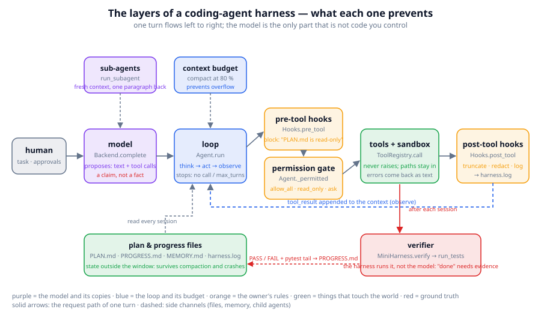
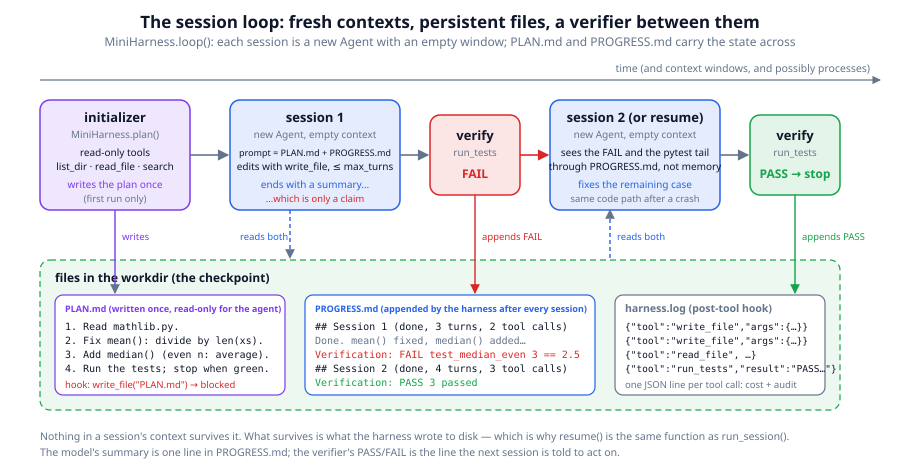
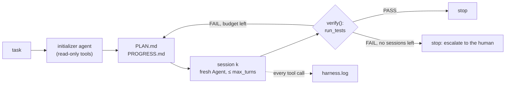

# Chapter 27: Harness engineering for long-running agents

**Part IV · ~3 hours · Prerequisites: Chapters 24, 25, 26**

> 🎯 Goal: Build a coding agent harness with permissions, hooks, verification, and resumability.
> 🧪 Lab: `labs/lab27_miniharness.py` · 🎛️ Interactive: `interactive/27_harness_anatomy.html`

## Why this matters

Two products can call the same model through the same API and behave like different species. One edits your files while you watch, asks before every destructive command, runs your tests, and picks up tomorrow where it stopped tonight; the other answers a question and forgets you. The difference is not the model. It is the **harness**: the program around the model that decides what it may do, checks what it did, remembers what happened, and stops it when it should stop. In 2026 the phrase "the harness is the product" is common among people who build coding agents, and it is literally true: the model is rented, the harness is what you own. This chapter turns the agent loop of Chapter 24 and the context tools of Chapter 25 into a harness that can be trusted with a repository for hours. The concrete problem it solves is small and universal: a test fails, the agent says "fixed", and nobody has checked.

## The idea in pictures 📐

A harness is a set of layers around the model, each one there to prevent a specific failure. The figure shows one turn flowing left to right through them.



Read the figure from the left. The human supplies a task and, when asked, approvals. The **model** proposes a text reply and zero or more tool calls; the red note under it is the whole philosophy of the chapter: what the model says is a *claim*, not a fact. The **loop** (`Agent.run`) turns proposals into actions and stops when the model replies without a tool call or when `max_turns` runs out. Before a tool runs, two orange layers get a say. **Pre-tool hooks** are the harness owner's code: a function that looks at the call and can block it with a reason ("PLAN.md is read-only"). The **permission gate** applies a policy (`allow_all`, `allow_read_only`, or `ask`, which defers to a human). The green **tools + sandbox** layer runs the call, never raises, and keeps every path inside the working directory; whatever happens comes back as text. **Post-tool hooks** truncate, redact or log the result before it is appended to the context as the observation. Above the loop sit the **context budget** from Chapter 25 (compact at 80 %) and **sub-agents** (fresh context, one paragraph back). Below sit the two layers this chapter adds: the **plan and progress files**, state that lives outside the window, and the **verifier**, the harness running the tests itself after every session.

The verifier and the files matter most when a task does not fit in one context window, or one process, or one evening. The second figure shows how sessions chain.



Time runs left to right. An **initializer** agent with read-only tools writes `PLAN.md` once. **Session 1** is a brand-new `Agent` with an empty context whose only input is the plan and the progress file; it edits, and ends with a summary. The harness then runs the tests. In the figure the tests fail, so the verifier appends `Verification: FAIL` and the last lines of `pytest` output to `PROGRESS.md`. **Session 2** is again a fresh agent; it learns about the failure by reading the file, not by remembering. This is the same code path a crash recovery takes, which is why `resume()` and `run_session()` are the same function. The lower band shows the three files: the plan (which a hook makes read-only for the agent), the progress log (which only the harness appends to), and `harness.log` (one JSON line per tool call).

An analogy: a general contractor and a building inspector. The contractor can be excellent and still never gets to sign off on their own work; the inspector runs the checklist, and the next crew reads the inspection report, not the contractor's memory. The limit of the analogy: an inspector exercises judgement, while our verifier is a test-suite that only knows what its tests know. A green suite proves the tests pass, not that the task is done.

The flow of one full run, as a pipeline:



Read it as: the plan is written once; sessions and verifications alternate; the loop ends on a pass or on an exhausted budget, and in both cases the files say what happened.

## The idea in code

The library files are `llm/agent/harness.py` (the loop, gate and hooks, from Chapter 24) and `llm/agent/miniharness.py` (132 lines, this chapter). The imports for every snippet:

```python
import os, json, shutil
from llm.agent import (Agent, AgentConfig, Hooks, MiniHarness, ScriptedBackend,
                       make_builtin_tools, run_subagent, estimate_tokens)
from llm.agent.context import message_text
```

Every snippet uses a `ScriptedBackend`, which replays fixed replies, so the harness is the only moving part. A helper for a scripted tool call:

```python
def call(name, **arguments):
    return {"text": "", "tool_calls": [{"name": name, "arguments": arguments}]}

box = "/tmp/ch27"; shutil.rmtree(box, ignore_errors=True); os.makedirs(box + "/tests")
open(box + "/tests/test_ok.py", "w").write("def test_ok():\n    assert 1 + 1 == 2\n")
tools = make_builtin_tools(box)                         # read_file, write_file, list_dir, search, calculator, run_python, run_tests
```

### Step 1: the permission gate

A **permission gate** decides whether a proposed tool call may run at all. `Agent._permitted` asks the **permission policy** first: `allow_all` says yes; `allow_read_only` says yes only for tools that declared `read_only=True`; `ask` defers to a `permission_fn`, which in a real harness is the prompt you see on screen. With no function to ask, the answer is no.

```python
script = [call("write_file", path="notes.txt", content="hello"), "ok"]
t = Agent(ScriptedBackend(script), tools, AgentConfig(permission_policy="allow_read_only")).run("write a note")
print(t.messages[2]["content"][:60])      # Permission denied: 'write_file' is not allowed under policy ...

asked = []
def human(call_, tool):                   # (ToolCall, Tool) -> bool
    asked.append(call_.name)
    return not call_.arguments.get("path", "").startswith("tests")
t = Agent(ScriptedBackend(script), tools, AgentConfig(permission_policy="ask")).run("write a note", permission_fn=human)
print(t.messages[2]["content"], asked)    # Wrote 5 chars to notes.txt ['write_file']
```

A denial is not an exception. It is appended to the context as a tool result ("Permission denied ... Try a different approach or ask the user"), so the model can read it and adapt, exactly as it reads an error message. Notice what the gate does *not* do: it never checks whether a permitted action was any good.

### Step 2: hooks

A **hook** is a function the harness owner attaches to a point in the loop. `Hooks` has three lists: `pre_tool` (a **pre-tool hook** returns `None` to allow the call or a string to block it with that reason), `post_tool` (a **post-tool hook** may return a replacement for the result: truncate it, redact a secret, append a reminder) and `on_event` (logging and UIs). The important design choice is that hooks are *code*, not prompt text. A rule in the system prompt is a request; a hook is a law. `MiniHarness._hooks` installs two:

```python
def guard_writes(call: ToolCall) -> Optional[str]:
    if call.name == "write_file":
        target = os.path.normpath(call.arguments.get("path", ""))
        if target == "PLAN.md":
            return "PLAN.md is read-only for the agent; append notes to PROGRESS.md instead"
        if target.startswith("..") or os.path.isabs(target):
            return f"path '{target}' is outside the workdir"
    return None

def log(call: ToolCall, result: str) -> None:
    self._append("harness.log", json.dumps({"t": round(time.time(), 2), "tool": call.name,
                                            "args": call.arguments, "result": result[:200]}))
```

The first is the rule that the plan is the human's contract; the second is observability. Adding your own is a subclass away, and the lab adds one that refuses edits under `tests/`, because the cheapest way to make a failing test pass is to delete it:

```python
class GuardedHarness(MiniHarness):
    def _hooks(self) -> Hooks:
        hooks = super()._hooks()
        def protect_tests(call_):
            target = os.path.normpath(call_.arguments.get("path", ""))
            if call_.name == "write_file" and target.split(os.sep)[0] == "tests":
                return "tests/ is read-only for the agent: fix the code, not the tests"
            return None
        hooks.pre_tool.insert(0, protect_tests)
        return hooks
```

A blocked call still costs a turn and still produces a tool result (`Blocked by hook: ...`), so the model learns the rule from inside the conversation. The post-tool hook runs even for blocked calls, which is why `harness.log` records the attempt.

### Step 3: verification, or tests as ground truth

The single most important line in `miniharness.py` is in `run_session`: after the agent stops, *the harness* runs the tests.

```python
def verify(self, path: str = "tests") -> tuple[bool, str]:
    """Ground truth: run the test-suite. Returns (passed, report)."""
    report = self.tools.call("run_tests", {"path": path})
    return report.startswith("PASS"), report
```

A **verification loop** is the rule that a task is never marked done on the model's say-so: something outside the model (a test-suite, a type checker, a build, a second agent with a checklist) must produce the evidence, and the harness records that evidence next to the model's claim. The model may call `run_tests` itself as often as it likes, and a good one does; but its final "all tests pass" is just text until `verify()` says the same. `loop()` is this rule turned into control flow:

```python
def loop(self, task: str, max_sessions: int = 3, max_turns: Optional[int] = None) -> bool:
    for _ in range(max_sessions):
        self.run_session(max_turns, task=task)
        if self.verify()[0]:
            return True
    return False
```

Read it as: keep starting sessions until the evidence says yes or the budget says stop. `False` is a valid outcome, and the right response to it is a human, not a fourth session.

### Step 4: plan and progress files

A **plan file** (`PLAN.md`) is written once by an initializer and read by every session; it is the task decomposed into steps and it does not change. A **progress file** (`PROGRESS.md`) is appended after every session by the harness: the model's summary, then the verifier's verdict and the tail of the test output. Together they are the whole state of the job, and they are all a new session gets:

```python
def run_session(self, max_turns=None, task=None) -> Transcript:
    if not self.has_plan():
        self.plan(task or "Make the tests pass.")
    prompt = ("PLAN.md:\n" + self._read("PLAN.md") + "\n\nPROGRESS.md:\n" + self._read("PROGRESS.md")
              + "\n\nContinue the plan from where PROGRESS.md leaves off.")
    agent = Agent(self.backend, self.tools, cfg, hooks=self._hooks(), system_prompt=SESSION_SYSTEM)
    t = agent.run(prompt)
    ok, report = self.verify()
    self._append("PROGRESS.md", f"\n## Session {n} ({t.stop_reason}, {t.turns} turns, {t.tool_calls_made} tool calls)\n"
                                f"{t.final_text.strip() or '(no summary)'}\n\nVerification: {'PASS' if ok else 'FAIL'}\n```\n{report.strip()[-800:]}\n```")
    return t
```

The planner is itself an agent, restricted to `list_dir`, `read_file` and `search` under `allow_read_only`, with six turns. The restriction is the point: a planner that can edit will start editing.

```python
backend = ScriptedBackend([
    call("list_dir", path="."),                              # planner looks around
    "1. Read the test. 2. Add hello.py with x = 1.",         # planner's plan, as text
    call("write_file", path="hello.py", content="x = 1\n"),  # session 1 edits
    "Added hello.py; the tests pass.",                       # session 1's claim
])
h = MiniHarness(backend, box, AgentConfig(max_turns=6))
print(h.loop("add hello.py so the tests pass"))               # True: the harness ran the tests
print(open(box + "/PROGRESS.md").read().splitlines()[4:8])    # ['## Session 1 (done, 2 turns, 1 tool calls)', 'Added hello.py; ...', '', 'Verification: PASS']
```

### Step 5: checkpointing and resuming across context windows

**Checkpointing** in a harness means the same thing it meant in Chapter 10's training loop: persist enough state that a fresh process can continue. Here the checkpoint is the pair of files, so **resuming** needs no special code:

```python
def resume(self, max_turns=None) -> Transcript:
    assert self.has_plan(), "nothing to resume: call plan()/run_session() first"
    return self.run_session(max_turns)
```

This is deliberate. Any state that lives only in the `MiniHarness` object, or only in the model's context, is state that a crash loses. The lab makes this concrete by creating a *second* `MiniHarness` on the same directory and resuming: it works, because the files were the state all along. It also exposes one thing that does live in the object: the session counter (`n = len(self.sessions)`), so a new process numbers its first session "Session 1" again. That is a real bug of exactly the kind this design is meant to prevent, and a good exercise (below) is to fix it by counting headings in `PROGRESS.md`.

The two files are also why long tasks survive the **context budget**: a session's window fills up with tool results and gets compacted (Chapter 25), but nothing the next session needs was ever *only* in the window. Compaction deletes; files remember.

### Step 6: the initializer/coder pattern, and the planner/generator/evaluator variant

What you have just read is the **initializer/coder pattern**: one agent (the initializer) turns a vague task into a written plan and an initial state, and a sequence of short-lived coder agents each pick up the state, do bounded work, and hand back to a verifier. Anthropic's engineering post "Effective harnesses for long-running agents" (November 2025) describes it with a feature list instead of `PLAN.md`, a progress file, and one further rule this chapter has not implemented: **clean git state per session**, meaning each session starts from a committed tree and commits its own work, so a bad session can be reverted rather than untangled. 🆕 A three-agent variant, **planner/generator/evaluator**, was reported by InfoQ in April 2026 as a follow-up used in production harnesses: a planner writes acceptance criteria once, a generator produces candidates, and a separate evaluator with a fresh context judges them against the criteria. Chapter 28 implements the generator/evaluator loop; the important design point is already visible here, that the one who writes and the one who judges should not share a context. These are practitioner reports, not controlled studies; the current evidence for the pattern is that several production harnesses converged on it independently, which is suggestive rather than conclusive.

### Step 7: skills and sub-agents

A **skill** is a folder of instructions (typically a `SKILL.md` with a short description plus any scripts or reference files it needs) that a harness loads into the context *only when the task matches the description*. It is the harness-level answer to a prompt that would otherwise have to contain every procedure the agent might ever need: the index of skill descriptions is always present and small; the body of a skill is paid for only when used. The Claude Agent SDK exposes skills, hooks, sub-agents and compaction as first-class features (reported in the sources listed under Going deeper). This course's library has no skill loader, but the mechanism is two lines on top of what you have:

```python
SKILLS = {"fix-tests": "When a test fails: read the test first, change the code not the test, run run_tests before claiming success."}
def system_with_skill(base: str, task: str) -> str:
    hit = [body for name, body in SKILLS.items() if name.split("-")[0] in task.lower()]
    return base + ("\n\n## Skill\n" + hit[0] if hit else "")
print(system_with_skill("You are a coding agent.", "please fix the failing tests")[-60:])
```

A **sub-agent** is a fresh `Agent` started by the harness (or by the parent agent through a tool) with its own empty context, usually a subset of the tools, and the same hooks and policy; only its final text comes back to the parent. Chapter 25 introduced it as context isolation; in a harness it is also *risk* isolation, because a sub-agent can be given fewer permissions than its parent.

```python
parent = Agent(ScriptedBackend([call("calculator", expression="2+2"), "the child says 4"]), tools,
               AgentConfig(permission_policy="allow_all"))
print(run_subagent(parent, "compute 2+2", tools_subset=["calculator"], max_turns=3))   # the child says 4
```

### Step 8: observability and cost control

**Observability** is being able to answer "what did the agent do, and why did it cost that much?" without re-running it. The harness has three sources: the `Transcript.events` stream (`assistant`, `tool_call`, `hook`, `permission_denied`, `tool_result`, `compaction`, `done`, `max_turns`, `error`), `harness.log`, and the backend's own records. **Cost control** is the set of limits you put on those numbers: `max_turns` per session, `max_sessions` per task, `max_tool_result_chars` per observation, the context budget, and, for API models, a running estimate of input tokens. Since each turn re-sends the whole context, the token cost of a session grows roughly quadratically with its length, which is the strongest argument for short sessions and fresh windows:

```python
per_call = [sum(estimate_tokens(message_text(m)) for m in c["messages"]) for c in backend.calls]
print(per_call)               # tokens in the context at each model call, e.g. [52, 59, 113, 192 | 246, 310, 399, 444]
```

### Step 9: 2026 lessons from production harnesses

A few findings that recur in 2025–2026 reports, stated with the confidence they deserve. Sessions should be short and bounded, and state should be in files: this is the converged practice of the harnesses cited above. **Context rot**, the degradation of an agent's judgement as its window fills with stale tool output, is now studied directly: 🆕 "Diagnosing and Mitigating Context Rot in Long-horizon Search" (2026), LOCA-bench (2026) and AgentSwing (2026) report that long-horizon agents lose accuracy with context length even when the relevant facts are still present, which supports compaction and fresh sessions rather than ever-larger windows. Verification is the difference between a demo and a product: the audit of SWE-bench Verified reported by OpenAI (Chapter 23) found flawed tests in a majority of hard tasks, which is a reminder that a verifier is only as good as its tests. Permission and sandboxing are security boundaries, not UX: the threat modelling of MCP and A2A (2026) treats every tool result as untrusted input, and a harness that lets tool output rewrite the plan has no boundary at all. None of this is a theorem; it is what people who run these systems say worked, and the chapter reports it as such.

## Worked example 🧪

```bash
python3 labs/lab27_miniharness.py            # quick: scripted runs + the nano model, about 16 s
python3 labs/lab27_miniharness.py --full     # the same with the small model, about 25 s
```

The lab builds a sandbox repository with `mathlib.py` (a `mean` that divides by `len(xs) - 1` and no `median`) and `tests/test_math.py` (three tests, two of which fail at import). Section 1 is the honest run:

```
loop() -> True after 1 session(s) in 1.4s; session 1: stop_reason=done, turns=4, tool_calls=3
events: assistant -> tool_call -> tool_result -> assistant -> tool_call -> tool_result -> assistant -> tool_call -> tool_result -> assistant -> done
✅ the honest agent passes verification in one session

┌─ PLAN.md (8 lines)
│ # Plan
│ Task: Make the tests in tests/ pass: mean() is wrong and median() is missing.
│ 1. Read mathlib.py.
│ 2. Fix mean(): divide by len(xs).
│ 3. Add median() that averages the two middle values for even n.
│ 4. Run the tests and stop when they pass.

┌─ PROGRESS.md (13 lines)
│ ## Session 1 (done, 4 turns, 3 tool calls)
│ Fixed mean() (divide by len(xs)) and added median() with the even-length case; run_tests reports 3 passed.
│ Verification: PASS
│ ```
│ PASS (exit code 0)
│ 3 passed in 0.02s
│ ```
cost: 7 model calls, ≈3,803 estimated input tokens (chars/4 over every call's context)
```

Seven model calls for a four-turn session: three went to the planner, which listed the directory and read the test before writing the plan. The `Verification: PASS` line was written by the harness, after its own `run_tests`, not copied from the model's summary.

Section 2 is the run that motivates the chapter. The scripted agent tries to overwrite `tests/test_math.py` with a test that always passes, half-fixes the module, and declares victory without running anything:

```
session 1: stop_reason=done, the model's last words: 'Done. mean() is fixed and median() is implemented; all tests pass.'
verifier : FAIL — first line of the report: 'FAIL (exit code 1)'
hook     : Blocked by hook: tests/ is read-only for the agent: fix the code, not the tests
✅ the verifier rejects the over-claiming session (tests still fail)
✅ the pre-tool hook blocked the edit to tests/
✅ the test file is untouched

resume(): session 2 started with 1 message(s) in context (a fresh window) whose prompt contains 'Verification: FAIL': True
session 2: done, 3 tool calls; verifier: PASS
✅ the resumed session saw the failing test's name through PROGRESS.md, not through memory
```

Read the three lines of session 1 together: the model said "all tests pass", the verifier said `FAIL`, and the hook had already refused the shortcut. `PROGRESS.md` after the resume shows what the second session was given:

```
│ ## Session 1 (done, 3 turns, 2 tool calls)
│ Done. mean() is fixed and median() is implemented; all tests pass.
│ Verification: FAIL
│ ```
│ >       assert median([1, 2, 3, 4]) == 2.5
│ E       assert 3 == 2.5
│ FAILED tests/test_math.py::test_median_even - assert 3 == 2.5
│ 1 failed, 2 passed in 0.06s
│ ```
│ ## Session 2 (done, 4 turns, 3 tool calls)
│ median() now averages the two middle values for even n; run_tests reports 3 passed.
│ Verification: PASS
```

The failing assertion, with its expected and actual values, arrived in session 2 through a file. Section 2b creates a brand-new `GuardedHarness` object on the same directory and calls `resume()`; it works, and it exposes the numbering wart: the headings read `Session 1, Session 2, Session 1`.

Section 3 is the bill. The planner call and the two sessions are visible in the per-call context sizes:

```
estimated context tokens per model call (planner | session 1 | session 2): [52, 59, 113, 192, 246, 310, 399, 444]
messages in context per model call                                     : [1, 1, 3, 5, 1, 3, 5, 7]
total: 8 model calls, ≈5,771 estimated input tokens
```

Session 2's first call is *larger* than session 1's last, because `PROGRESS.md` now carries the whole `pytest` report. What resets is the history (one message), and the files bound how much comes back; a design that fed the full transcript forward would grow without bound. The lab's figure `figures/generated/lab27_context_per_call.png` plots these eight bars.

Section 4 puts the real TinyLM base model behind the same harness, and finds two things. First, the session prompt is 1,833 tokens (the system prompt plus seven tool schemas as JSON) while the nano model's window is 128 tokens, so `generate()` has no room to decode and `TinyLMBackend` returns an empty reply, silently; the harness still terminates cleanly, records `Verification: FAIL` twice and stops. Second, with the window extended to 2,048 so the model can answer at all:

```
session 1: stop=done, turns=1, tool calls=0, said: '=  +  +  +  +  +  +  +  +  +  +  +  +  +  +  +  +  +  +  +'   (nano, quick)
session 1: stop=done, turns=1, tool calls=0, said: 'one, two, three.'                                          (small, --full)
loop() -> False in 7.3s
✅ a base model produces no tool calls; the harness records two failed sessions and stops
✅ PROGRESS.md says FAIL, not the model
```

A base model has never seen a tool call and cannot follow a plan; the point of the section is that the harness contains this without a crash, a false PASS, or an unbounded loop. Chapter 29 trains a model that can call a tool.

The interactive `interactive/27_harness_anatomy.html` draws the same anatomy as the first figure as a clickable diagram: select any block to read its role, the failure it prevents, and the line of `llm/agent/` that implements it. Below it, a session timeline steps through the initializer → coder → verifier pattern (and the planner → generator → evaluator variant) while showing `PLAN.md` staying fixed and `PROGRESS.md` growing, and an MCP handshake panel replays the JSON-RPC messages of Chapter 26. The Challenge asks which component stops the agent marking a task done without evidence; answer it before you click.

## Try it yourself ✍️

1. **Fix the numbering.** Subclass `MiniHarness` so that the session number is the count of `## Session` headings already in `PROGRESS.md` plus one. Re-run section 2b of the lab and confirm the headings read 1, 2, 3.
2. **A stricter verifier.** Change `verify()` to require both `run_tests` and a `run_python` call that imports the module and checks `mean([1]) == 1`. Write a scripted agent whose code passes the tests but fails the extra check, and watch `loop()` return `False`.
3. **A post-tool redaction hook.** Add a hook that replaces anything matching `sk-[A-Za-z0-9]{8,}` in a tool result with `[REDACTED]`. Plant a fake key in a file, have a scripted agent `read_file` it, and confirm the model's context never contains the key while `harness.log` records the call.
4. **Clean git state per session.** Run `git init` in the sandbox and add hooks so that a session begins from a clean tree (`git status --porcelain` empty) and the harness commits after a `PASS`. What should happen after a `FAIL`?
5. **Budget the bill.** Add a `max_input_tokens` field to your harness that stops `loop()` when the estimate from `cost_of` crosses it. How many sessions does the over-claiming script get with a budget of 4,000 tokens?
6. **Skills, minimal.** Write two skills as text files in a `skills/` folder and a loader that prepends the one whose first line matches the task. Confirm with `backend.calls[0]["system"]` that only one skill is in the system prompt.
7. **Interactive** 🎛️: in `interactive/27_harness_anatomy.html`, switch the timeline to the planner/generator/evaluator pattern and write down what the evaluator sees in round 1 that the generator does not. Then do the Challenge.

## Check yourself ✅

<details><summary>1. The model's final message says "all tests pass". What in <code>MiniHarness</code> decides whether that is true, and where is the answer written?</summary>

`MiniHarness.verify()` calls the `run_tests` tool itself after the session and returns `(passed, report)`. `run_session` appends `Verification: PASS` or `FAIL` plus the tail of the pytest output to `PROGRESS.md`, directly under the model's summary. The model's sentence is recorded as a claim; the verifier's line is what the next session is told to act on.
</details>

<details><summary>2. What is the difference between a pre-tool hook returning a string and the permission gate returning <code>False</code>?</summary>

Both stop the call and both produce a tool-result message the model can read. A hook is arbitrary code written by the harness owner and runs first; it blocks with a specific reason (`Blocked by hook: tests/ is read-only ...`). The gate applies the configured policy (`allow_all`, `allow_read_only`, `ask`) using each tool's `read_only` flag and, for `ask`, a human's answer; it denies with a generic message naming the policy.
</details>

<details><summary>3. Why is <code>resume()</code> just a call to <code>run_session()</code>? What kind of state would break this design?</summary>

Because every session starts from an empty context and is given only `PLAN.md` and `PROGRESS.md`, resuming after a crash needs nothing beyond the files. State that lives only in the Python object breaks it; the lab's example is the session counter `len(self.sessions)`, which restarts at 1 in a new process even though the file already has two sessions.
</details>

<details><summary>4. Session 2's first model call had a <em>larger</em> context than session 1's last. Why is that not a contradiction of "sessions reset the context"?</summary>

What resets is the history: session 2 starts from one message. That message contains `PROGRESS.md`, which now includes the 800-character pytest report from the failed verification, so it is bigger than session 1's tail (five short messages). The size is bounded by the files, not by how long the job has been running.
</details>

<details><summary>5. A skill and a system prompt both put instructions in front of the model. What is the difference, and why does it matter for cost?</summary>

A system prompt is always present. A skill is a folder of instructions whose one-line description is always present but whose body is loaded only when the task matches, so the model pays for the procedure only when it uses it. With dozens of procedures, always-on instructions would fill the window and dilute attention; skills keep the fixed cost small.
</details>

## Key takeaways

- The harness, not the model, decides what may run (gate, hooks), what counts as done (verifier), what is remembered (files) and what it costs (budgets).
- Tests are ground truth. The harness runs them itself after every session and writes the verdict next to the model's claim.
- Hooks are code, so a rule like "the plan is read-only" or "never edit tests/" cannot be talked out of.
- State lives in files: `PLAN.md` written once, `PROGRESS.md` appended by the harness, `harness.log` for humans. Resuming is the same as starting a session.
- Short sessions with fresh contexts are cheaper (cost grows with context length) and, per 2026 context-rot studies, more accurate than one long window.
- A base model behind a harness cannot use tools, and a good harness fails safely: no crash, no false PASS, a bounded number of sessions.

## Going deeper

- 🆕 Anthropic, "Effective harnesses for long-running agents" (November 2025). The initializer/coder pattern, feature lists, progress files and clean git state per session. Summarised with commentary at https://addyosmani.com/blog/long-running-agents/
- 🆕 InfoQ, "Anthropic's three-agent harness" (April 2026). The planner/generator/evaluator variant, as reported. https://www.infoq.com/news/2026/04/anthropic-three-agent-harness-ai/
- Anthropic, "Building effective agents" (December 2024) and "Effective context engineering for AI agents" (September 2025). The design vocabulary this chapter uses.
- 🆕 "Diagnosing and Mitigating Context Rot in Long-horizon Search" (2026), https://arxiv.org/abs/2606.29718 ; LOCA-bench (2026), https://arxiv.org/abs/2602.07962 ; AgentSwing (2026), https://arxiv.org/abs/2603.27490 . Evidence that long contexts degrade agents even when the facts are present.
- 🆕 Security threat modelling of MCP and A2A (2026), https://arxiv.org/abs/2602.11327 . Why tool results are untrusted input and why the plan must be unwritable by the agent.
- Terminal-Bench and SWE-bench Verified (Chapter 23). The benchmarks that made verification loops standard, and the audit that showed verifiers are only as good as their tests.

---

← [Chapter 26](26-tools-and-mcp.md) · [Course home](../README.md) · [Chapter 28](28-multi-agent-systems.md) →
