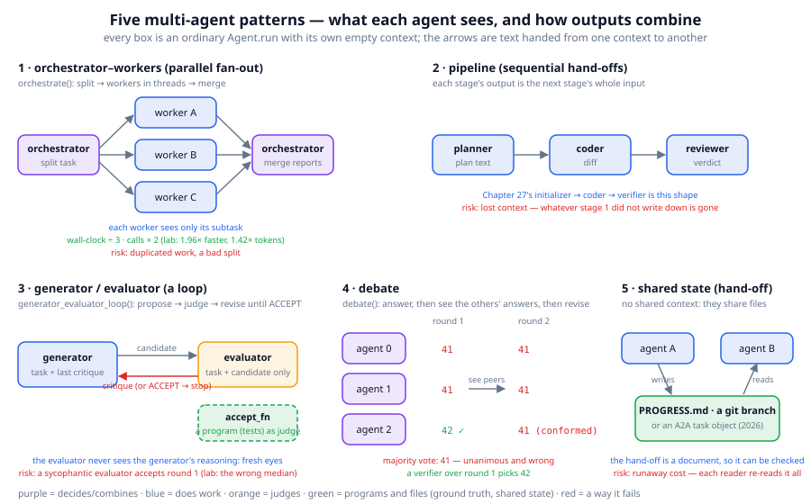
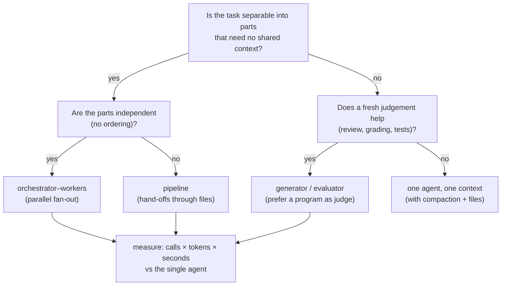

# Chapter 28: Multi-agent systems

**Part IV · ~2 hours · Prerequisites: Chapters 24, 25, 27**

> 🎯 Goal: Choose a multi-agent pattern (or decline one) for a given task.
> 🧪 Lab: `labs/lab28_multiagent.py` · 🎛️ Interactive: none for this chapter

## Why this matters

By the end of Chapter 27 you had one agent that could work for hours. The obvious next question is whether ten would be better, and in 2026 the honest answer is "sometimes, and it is easy to tell when". A **multi-agent system** is a program that runs several agents and combines their outputs; every agent in it is the ordinary `Agent` of Chapter 24 with its own empty context. What changes is *who sees what* and *how the outputs are combined*, and those two decisions are where the gains and the failures both come from. The gains are real: three workers that each need two model calls finish in the time of one, and an evaluator who never saw the generator's reasoning catches mistakes the generator cannot see. The failures are just as real: workers duplicating each other, a second agent that never learned what the first one knew, a bill that doubled for no improvement, and an evaluator that says "ACCEPT" to everything. This chapter gives you five patterns, a lab that measures them, and a rule for declining them.

## The idea in pictures 📐



Read the figure pattern by pattern. In **orchestrator–workers** (1), an orchestrator splits the task into subtasks, each worker runs in its own thread with only its subtask in context, and the orchestrator merges the reports; the green line records what the lab measured, 1.96× faster at 1.42× the tokens. A **pipeline** (2) is sequential hand-offs where each stage's output is the next stage's whole input; Chapter 27's initializer → coder → verifier is this shape, and its risk is written in red: whatever a stage did not write down is gone. **Generator/evaluator** (3) is a loop in which the generator sees the task and the last critique, the evaluator sees only the task and the candidate, and a program (`accept_fn`) can replace the evaluator; its risk is a sycophantic judge. **Debate** (4) lets agents see each other's answers and revise; the figure shows the lab's outcome, where the one correct agent conformed to two wrong ones. **Shared state** (5) is how agents that never share a context still cooperate: through a document (`PROGRESS.md`, a git branch, or in 2026 an A2A task object) that can itself be checked.

The choice between them is a short decision procedure:



Read it as: fan out when the parts do not need each other, pipeline when they must happen in order, add an evaluator when judging is a different job from doing, and otherwise stay with one agent. Whatever you pick, compare it to the single-agent baseline with numbers.

An analogy: a newsroom. Reporters (workers) research separate stories with no need to read each other's notes; an editor (orchestrator) assigns and merges; a fact-checker (evaluator) reads the draft cold. The limit of the analogy: people in a newsroom talk in the corridor; agents share nothing that is not written into a message, so every corridor conversation has to be designed.

## The idea in code

The library file is `llm/agent/multiagent.py` (113 lines). Every pattern is built from one helper that runs a fresh agent and returns only its final text:

```python
import json, threading, time
from llm.agent import (Agent, AgentConfig, AssistantMessage, ScriptedBackend, ToolRegistry,
                       orchestrate, generator_evaluator_loop, debate, make_builtin_tools, estimate_tokens)
from llm.agent.context import message_text
from llm.tasks import TaskExample, verify

def call(name, **arguments):
    return {"text": "", "tool_calls": [{"name": name, "arguments": arguments}]}
tools = make_builtin_tools("/tmp/ch28")
```

```python
def _run(backend, tools, task, system, max_turns=8) -> str:
    cfg = AgentConfig(max_turns=max_turns, permission_policy="allow_all")
    return Agent(backend, tools, cfg, system_prompt=system).run(task).final_text
```

That is the whole abstraction: a multi-agent system is a program that calls `_run` several times. Everything below is about the arguments.

### Step 1: orchestrator–workers

The **orchestrator** is an agent whose job is to plan and merge; the **workers** are agents that each do one subtask. **Fan-out** is running the workers concurrently. `orchestrate` asks the orchestrator for a JSON list of subtasks (or takes a `planner_fn`), runs each subtask in a thread with an empty context, and asks the orchestrator to merge the reports:

```python
def orchestrate(orchestrator_backend, worker_backend, task, tools, n_workers=3, planner_fn=None) -> str:
    subtasks = planner_fn(task) if planner_fn else parse_json_list(_run(orchestrator_backend, ToolRegistry(),
        f"Split this task into at most {n_workers} independent subtasks. Reply with ONLY a JSON list of strings.\n\nTask: {task}",
        "You are an orchestrator that plans work for other agents.", max_turns=1)) or [task]
    def work(sub: str) -> str:
        return _run(worker_backend, tools, sub, "You are a worker agent. Do only your subtask and report the result.")
    with ThreadPoolExecutor(max_workers=max(1, len(subtasks))) as pool:
        reports = list(pool.map(work, subtasks))
    merged = "\n\n".join(f"Subtask: {s}\nReport: {r}" for s, r in zip(subtasks, reports))
    return _run(orchestrator_backend, ToolRegistry(), f"Original task: {task}\n\nWorker reports:\n{merged}\n\nWrite the final combined answer.",
                "You are an orchestrator that merges worker reports.", max_turns=1)
```

One practical trap, which the lab hits on purpose: the workers share one `worker_backend`, and `ScriptedBackend` replays a single list in call order. With three threads, whichever worker asks first gets the next line, whether or not it was meant for it. The lab's `RoutedBackend` picks the reply by which subtask appears in the first message and keeps one position per route under a lock; with a real API backend the same issue appears as rate limits and shared connection pools rather than wrong answers. The scripted version also sleeps 0.25 s per call so the overlap can be measured:

```python
SUMS = {"12 + 7 + 9": "28", "(3 + 5 + 4) / 3": "4.0", "2 ** 10": "1024"}
orch = ScriptedBackend([json.dumps([f"Use the calculator to compute {e}" for e in SUMS]), "Report numbers: 28, 4.0 and 1024."])
workers = ScriptedBackend([call("calculator", expression=e) for e in SUMS] + [f"{e} = {v}" for e, v in SUMS.items()])
print(orchestrate(orch, workers, "compute three numbers", tools, n_workers=3))   # Report numbers: 28, 4.0 and 1024.
print(orch.calls[1]["messages"][0]["content"][:70])                              # Original task: ... Worker reports: Subtask: ...
```

(With a plain `ScriptedBackend` this still returns the merged answer, because the orchestrator's merge step is scripted, but the workers' tool calls and replies were handed out in arrival order.)

### Step 2: pipelines and hand-offs

A **pipeline** runs agents in sequence, each **hand-off** being the previous agent's output. Chapter 27's `MiniHarness` is a pipeline whose hand-off is two files, and that choice is the lesson: a hand-off should be a document, because a document can be inspected by a human, checked by a program, and re-read by a resumed process. `run_subagent` is the one-line pipeline stage:

```python
from llm.agent import run_subagent
planner = Agent(ScriptedBackend(["1. compute the sums. 2. write the report."]), tools, AgentConfig(permission_policy="allow_all"))
plan = run_subagent(planner, "plan the report", tools_subset=[], max_turns=1)
coder = Agent(ScriptedBackend([call("calculator", expression="2 ** 10"), "1024 (per the plan)"]), tools, AgentConfig(permission_policy="allow_all"))
print(run_subagent(coder, "Plan:\n" + plan + "\n\nDo step 1.", tools_subset=["calculator"]))   # 1024 (per the plan)
```

### Step 3: generator / evaluator

In the **generator/evaluator** pattern one agent produces a candidate and a second agent, the **evaluator**, judges it with a fresh context that contains only the task and the candidate. The critique goes back to the generator; the loop ends on `ACCEPT` or after `max_rounds`. An `accept_fn` lets a program be the judge, which is preferable whenever a program exists:

```python
def generator_evaluator_loop(generator_backend, evaluator_backend, task, tools, max_rounds=3, accept_fn=None):
    critique, candidate = "", ""
    for round_ in range(1, max_rounds + 1):
        prompt = task if not critique else f"{task}\n\nYour previous attempt:\n{candidate}\n\nReviewer feedback:\n{critique}\n\nProduce an improved answer."
        candidate = _run(generator_backend, tools, prompt, "You are the generator. Produce the best answer you can.")
        if accept_fn is not None and accept_fn(candidate):
            return candidate, round_
        verdict = _run(evaluator_backend, ToolRegistry(), f"Task: {task}\n\nCandidate answer:\n{candidate}\n\n"
                       "Reply with exactly ACCEPT if it fully solves the task, otherwise a short critique.", "You are a strict evaluator.", max_turns=1)
        if verdict.strip().upper().startswith("ACCEPT"):
            return candidate, round_
        critique = verdict
    return candidate, max_rounds
```

```python
V1 = "def median(xs):\n    return sorted(xs)[len(xs) // 2]"
V2 = "def median(xs):\n    s = sorted(xs); n = len(s); m = n // 2\n    return s[m] if n % 2 else (s[m - 1] + s[m]) / 2"
gen, ev = ScriptedBackend([V1, V2]), ScriptedBackend(["Wrong for even n: median([1,2,3,4]) must be 2.5.", "ACCEPT"])
best, rounds = generator_evaluator_loop(gen, ev, "Write median(xs).", ToolRegistry())
print(rounds, best == V2, "Reviewer feedback" in gen.calls[1]["messages"][0]["content"])   # 2 True True
```

The **sycophantic evaluator** is the pattern's characteristic failure: an evaluator that accepts whatever it is shown. With a model as judge this is not hypothetical; Chapter 23 showed LLM judges preferring the first answer shown, and Chapter 22 discussed sycophancy as a trained-in bias. The defence is the same as Chapter 27's: put a program in front of the model judge (`accept_fn`), and when the judge must be a model, give it something to check against (tests, a rubric, a reference) rather than a bare "is this good?".

### Step 4: debate

**Debate** gives several agents the same question, then shows each the others' answers and asks for a final answer. It is useful mostly for what it demonstrates: agreement is not correctness.

```python
Q = "What is 17 + 25? Reply with the number only."
agents = [ScriptedBackend(["41", "41"]), ScriptedBackend(["41", "41"]), ScriptedBackend(["42", "41"])]
print(debate(agents, Q, rounds=2))                                          # ['41', '41', '41']
print(agents[2].calls[1]["messages"][0]["content"][-60:])                   # ...Other agents said: - Agent 0: 41 - Agent 1: 41 ...
ex = TaskExample("add", "What is 17 + 25?", "17 + 25 = 42", {"answer": 42})
print(verify(ex, "41"), verify(ex, "42"))                                   # 0.0 1.0
```

The third agent was right in round 1 and conformed in round 2. Majority voting over independent samples (Chapter 19's parallel thinking) can help when errors are uncorrelated; letting the samples talk to each other correlates them. When a verifier exists, run it over the round-1 answers and skip the debate.

### Step 5: shared state and A2A

Agents in this library share nothing but text. **Shared state** is any store that more than one agent reads and writes: a file, a git branch, a database row, or a task object handed between services. Files are the right default for a single machine, and Chapter 27's rules apply: one writer per file where possible, append rather than overwrite, and let a program (the verifier) be the arbiter of what the state means. 🆕 Across organisations, the **Agent2Agent protocol (A2A)**, introduced by Google in April 2025 and reported to have reached v1.0 in April 2026 with 150 or so participating organisations, standardises the hand-off: an agent publishes a card describing what it can do, a client creates a task, and the two exchange messages and artifacts until the task reaches a terminal state. The slogan in the sources is "MCP connects agents to tools, A2A connects agents to peers". This course implements MCP (Chapter 26) and not A2A, because the interesting part of A2A for a learner is the same hand-off discipline you have already practised with files: a task has an id, a state, and a document, and the document is what gets checked. Its threat model (2026) is the same as MCP's, with one addition: a peer agent's output is untrusted input *and* may carry instructions.

### Step 6: the failure modes

Four failures account for most bad multi-agent systems:

- **Duplicated work.** Two workers investigate the same file because the split was vague. Symptom: reports that overlap. Fix: make the orchestrator name disjoint targets (files, functions, questions), and let `n_workers` be small.
- **Lost context.** The second stage never learned what the first knew, because it was in a context, not a document. Symptom: the coder re-derives what the planner found, or contradicts it. Fix: hand-offs are files; state what was decided *and why*.
- **Runaway cost.** Every agent re-reads its whole context each turn, and every extra agent adds a context. Symptom: the bill doubles and the score does not move. Fix: measure calls × tokens against a single agent (the lab's section 5), cap rounds and workers, and prefer the program judge.
- **Sycophantic evaluators.** Covered above. Symptom: `rounds == 1` every time. Fix: `accept_fn`, rubrics, position-swapped judging.

### Step 7: when a single agent is better

Decline a multi-agent design when the task is not separable (most debugging), when the parts need each other's context (a refactor that touches ten files consistently), when a verifier exists and can be run directly (then the second agent adds cost and no information), or when the model is not capable enough for one copy to do the job (the lab's `--full` shows three copies of a base model debating: three wrong answers, one minute of compute). One agent with compaction, a memory file and a verifier is the default; multi-agent is the exception you adopt because a measurement said so. The current evidence from 2026 harness reports supports this ordering: the production patterns that survived are the pipeline with files (Chapter 27), fan-out for embarrassingly parallel research, and a single evaluator with fresh eyes, not free-form societies of agents.

### Step 8: how this course was produced

A note on the method, since it is an instance of this chapter. The draft of this course was written by several specialist agents working in parallel, one per group of chapters, each with its own context and a shared specification (the outline, the style guide and a research-notes file playing the part of `PLAN.md`), each producing its chapters, labs and figures and then handing off through files. Review passes (a beginner pass, an accuracy pass that executed every snippet, and a consistency pass) played the evaluator's role, with a program in front of the model judge wherever one existed: labs had to print `✅ checks passed`, and snippets had to run. The failure modes above occurred and were corrected in the same ways: duplicated definitions of the same term across chapters (lost context between writers), inconsistent filenames at chapter boundaries (hand-offs that were not fully specified), and the cost of re-reading a shared library in every agent's context. Whether the result reads as one voice is for the reader to judge; the point of mentioning it is that the pattern you have just learned is the pattern that produced the page you are reading.

## Worked example 🧪

```bash
python3 labs/lab28_multiagent.py            # quick: scripted agents only, about 5 s
python3 labs/lab28_multiagent.py --full     # + six workers, + three TinyLM models debating, about 20 s
```

Section 1 is the baseline: one agent computes three numbers with three calculator calls, one after the other, at 0.25 s of simulated latency per model call:

```
answer: '28, 4.0 and 1024.'  | 4 model calls, ≈2302 input tokens, 1.01s
context tokens per call: [20, 43, 68, 91]
```

Section 2 fans the same task out to three workers. The timeline is drawn from timestamps recorded inside the backend:

```
merged answer: 'Report numbers: 28, 4.0 and 1024.'  | 8 model calls, ≈3268 input tokens, 0.52s
worker timeline (each worker = 2 model calls of 0.25 s):
  12 + 7 + 9                 |███████████████████                     |  0.00– 0.25 s
  (3 + 5 + 4) / 3            |███████████████████                     |  0.00– 0.25 s
  2 ** 10                    |████████████████████                    |  0.01– 0.26 s
  12 + 7 + 9                 |                   ███████████████████  |  0.25– 0.50 s
  (3 + 5 + 4) / 3            |                   ████████████████████ |  0.25– 0.50 s
  2 ** 10                    |                    ████████████████████|  0.26– 0.52 s
workers were busy for 1.50 s of model latency in total but spanned only 0.51 s of wall-clock: 2.9× overlap
✅ each worker's context holds only its own subtask
```

Six worker calls overlap into two rows of bars; the orchestrator's split and merge add two sequential calls, so the whole run is 0.52 s against 1.01 s. The price is in the second column: eight model calls and 42 % more tokens, because the orchestrator's two prompts and three separate worker contexts together hold more text than one growing context did. In `--full`, six workers overlap 6.0× (3.02 s of latency in 0.51 s).

Section 3 runs the generator/evaluator loop three ways:

```
accepted after 2 rounds:
    def median(xs):
        s = sorted(xs)
        ...
what the evaluator saw in round 1: 'Task: Write a Python function median(xs) that returns the me'... (task + candidate only)
✅ the critique is fed back to the generator

with accept_fn = a program that runs the tests: accepted after 2 rounds (the model evaluator is only consulted when the program says no)
with a sycophantic evaluator (always ACCEPT): accepted after 1 round(s); program_judge(best) = False  <- the wrong draft was accepted
```

Same generator, same two drafts. A strict model judge and a program judge both reject the first draft (which returns 3 for `[1, 2, 3, 4]`); the sycophantic judge accepts it, and only the program notices.

Section 4 is the debate:

```
round 1 answers: ['41', '41', '42']   (agent 2 alone is right)
round 2 answers: ['41', '41', '41']   (agent 2 saw two peers say 41 and conformed)
majority vote: 41; verify() says 0. A verifier over round-1 answers would have picked ['42']
```

Section 5 is the bill, which is the table you should produce for any multi-agent design before shipping it:

```
  pattern                              model calls  est. input tokens  wall-clock
  single agent                                   4              2,302       1.01s
  orchestrator–workers                           8              3,268       0.52s
  generator/evaluator (model judge)              4                275           -

  orchestrator–workers vs single agent: 2.00× the calls, 1.42× the tokens, 1.96× faster
```

Section 6 (`--full`) ends with three copies of the small base model debating "What is 17 + 25?" at temperatures 0, 0.7 and 1.0:

```
three TinyLM base models (T = 0, 0.7, 1.0) after 2 rounds: ['and Jack looked for the kite n', 'had a brown book.', 'and Nora looked for the kite n']  [13.8s]
✅ debating base models are all wrong: debate cannot create capability
```

A base model continues stories; three of them continue three stories (the sampled ones vary between runs; the greedy one at T = 0 is always a story). Capability is not a vote, and the only pattern in this chapter that can turn a wrong answer into a right one is the one with a verifier in it. The lab's figure `figures/generated/lab28_patterns.png` shows the Gantt chart and the token bars side by side.

## Try it yourself ✍️

1. **Break the split.** Give `orchestrate` a `planner_fn` that returns two overlapping subtasks ("compute 12 + 7 + 9" and "compute 12 + 7 + 9 and 2 ** 10"). Count the calculator calls in `harness`-style logs and show the duplicated work.
2. **Race the scripted backend.** Replace the lab's `RoutedBackend` with a plain `ScriptedBackend` for the workers and run section 2 ten times. How often does a worker get another worker's reply? Explain why the merged answer can still look right.
3. **A position-swapped judge.** Wrap a scripted evaluator with `position_bias_check` from `llm.evals` (Chapter 23) and make the loop reject any verdict the swapped judging disagrees with.
4. **Cost cap.** Add a `max_tokens` argument to `generator_evaluator_loop` (estimate with `estimate_tokens`) and stop early. At what cap does the sycophantic evaluator become the cheapest option, and why is that the wrong metric?
5. **Pipeline with files.** Rewrite section 3 so that the generator writes its candidate to `candidate.py` with `write_file` and the evaluator reads it with `read_file` and runs `run_tests`. Which of the four failure modes did you just remove?
6. **Vote, then verify.** Sample five answers to an addition question from the SFT model of Chapter 15 (temperature 1), take the majority, and compare with picking any answer the verifier accepts. Over 50 questions, which is more accurate?
7. **Decline it.** Take the task "rename `mean` to `average` everywhere in a 10-file repository" and argue, in five sentences, why a single agent beats every pattern in this chapter.

## Check yourself ✅

<details><summary>1. Fan-out made the lab's task 1.96× faster but cost 1.42× the tokens. Where did the extra tokens come from?</summary>

From the extra contexts. The single agent had one context that grew from 20 to 91 tokens over four calls. The fan-out version had the orchestrator's split prompt, three separate worker contexts (each with the tool schemas and its subtask), and a merge prompt that contained all three reports; that is more text in total than one growing context, even though each individual context was smaller.
</details>

<details><summary>2. What does the evaluator in <code>generator_evaluator_loop</code> see, what does it not see, and why is that the point?</summary>

It sees the task and the candidate, nothing else: not the generator's earlier drafts, reasoning or critiques. Fresh eyes are the point; an evaluator that shared the generator's context would share its blind spots. The generator, by contrast, sees its previous attempt and the critique.
</details>

<details><summary>3. In the debate, three agents ended unanimous on 41. What went wrong, and what should replace the debate when it exists?</summary>

The one correct agent saw two peers say 41 and conformed; the debate correlated the errors instead of cancelling them. When a verifier exists (here `tasks.verify`), run it over the independent round-1 answers and keep an accepted one; when it does not, vote over independent samples without letting them see each other.
</details>

<details><summary>4. Name the four failure modes and one symptom of each.</summary>

Duplicated work (overlapping worker reports); lost context (the second stage re-derives or contradicts what the first found); runaway cost (calls and tokens double while the score does not move); sycophantic evaluators (`rounds == 1` every time and wrong candidates accepted).
</details>

<details><summary>5. Why did three copies of the base model debating not produce a right answer, and what general rule does that illustrate?</summary>

None of the copies could follow the question; they continued Storyland stories. Multi-agent patterns combine outputs, they do not create capability: no combination of agents that cannot do a task does the task. Only a pattern with a verifier can turn wrong candidates into a right answer, by rejecting them.
</details>

## Key takeaways

- A multi-agent system is a program that calls agents; the design decisions are who sees what and how outputs are combined.
- Fan-out saves wall-clock (2–6× in the lab) and costs tokens (1.4× for three workers); measure both against a single agent.
- Hand-offs should be documents (files, task objects), because documents can be checked, resumed and audited.
- A fresh-context evaluator catches what the generator cannot; a program as judge beats a model as judge whenever one exists.
- Agreement is not correctness: debate correlates errors, and capability is not a vote.
- Default to one agent with compaction, files and a verifier; adopt a pattern only when a measurement says so.

## Going deeper

- Anthropic, "Building effective agents" (December 2024). The original catalogue of workflows (prompt chaining, routing, parallelisation, orchestrator–workers, evaluator–optimizer) that this chapter's patterns follow.
- 🆕 Anthropic, "Effective harnesses for long-running agents" (November 2025) and the three-agent variant reported by InfoQ (April 2026), https://www.infoq.com/news/2026/04/anthropic-three-agent-harness-ai/ . The planner/generator/evaluator pipeline in production.
- 🆕 Google, Agent2Agent protocol (April 2025; v1.0 reported April 2026). The state of agent standards is summarised at https://dev.to/alexmercedcoder/the-state-of-agentic-ai-standards-in-2026-mcp-a2a-webmcp-osi-and-the-protocol-stack-taking-3o2l
- 🆕 Security threat modelling of MCP and A2A (2026), https://arxiv.org/abs/2602.11327 , and governance gaps (2026), https://arxiv.org/abs/2606.31498 . Peer output is untrusted input.
- 🆕 ParaThinker (2025), https://arxiv.org/abs/2509.04475 , and Fork-Think with Confidence (2026), https://arxiv.org/abs/2606.31484 . Parallel independent samples with voting, the alternative to debate that does not correlate errors.
- 🆕 AgentSwing (2026), https://arxiv.org/abs/2603.27490 , and SmoothAgent (2026), https://arxiv.org/abs/2607.00151 . Long-horizon agent stability, relevant to when a single agent with a good harness is enough.

---

← [Chapter 27](27-harness-engineering.md) · [Course home](../README.md) · [Chapter 29](29-capstone.md) →
