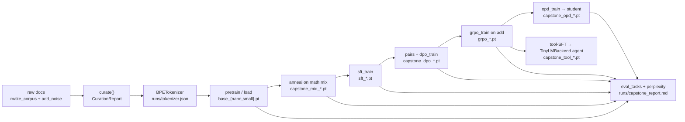
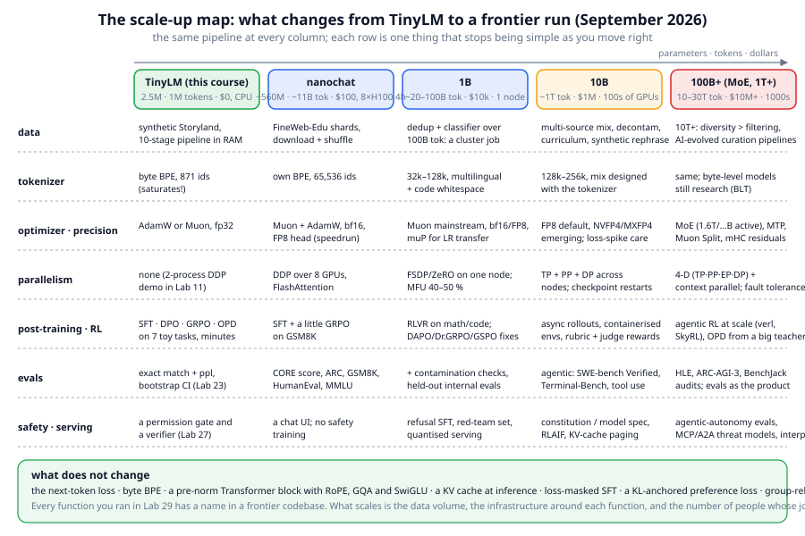

# Chapter 29: Capstone — TinyLM end to end, then the scale-up map

**Part IV · ~3 hours · Prerequisites: every chapter; at minimum 2, 8, 10, 13, 15, 17, 19, 20, 23, 24, 27**

> 🎯 Goal: Run the whole pipeline in one sitting and know exactly what changes at scale.
> 🧪 Lab: `labs/lab29_capstone.py` · 🎛️ Interactive: none for this chapter (open `interactive/00_pipeline_map.html` again and tick the stages off)

## Why this matters

The outline promised that you would take a language model through every stage a frontier model goes through in 2026, on a laptop, with code you can read in full. This chapter cashes that promise in one script: `lab29_capstone.py` starts from raw documents and ends with a model calling a calculator tool inside the harness of Chapter 27, running curation, tokenization, pretraining, mid-training, SFT, DPO, GRPO, on-policy distillation and an evaluation of every checkpoint on the same questions in between. The **capstone** is not a new technique; it is the discipline of running the old ones in one line and reading one table at the end. The second half of the chapter is the map you need next: what a $100 run does differently, what changes at 1B, 10B and 100B+, how to keep up, and what you can now do.

## The idea in pictures 📐

The pipeline is the one from Chapter 0, now with a filename at every arrow:



Read it as: every stage consumes the previous checkpoint and writes its own; the evaluation reads all of them. Two rules make the script re-runnable. **Checkpoint reuse**: each stage first looks for a checkpoint in `runs/` (its own `capstone_*` file or the one the chapter's lab produced, such as `sft_nano.pt` or `grpo_small.pt`) and trains only if none exists, so a second run takes seconds, and a crash in stage 7 does not cost you stages 0–6. A lineage rule: every `capstone_*` file records which checkpoint it was trained from (`extra["parent"]`), and it is reused only if that parent is the checkpoint the current run is actually using upstream; otherwise it is retrained, so the chain stays a chain even when an earlier lab's checkpoint appears in `runs/` between two runs.

The second figure is the scale-up map, discussed in its own section below.



## The idea in code

There is no new library code in this chapter. The script is 300 lines of calls into functions you have already read, and the pattern for every stage is the same:

```python
from llm.model import TinyLM
from llm.pipeline import run_path

with Stage("4. supervised fine-tuning (Chapter 15)") as st:          # times the block, records a note
    p = existing("sft_nano.pt", "capstone_sft_nano.pt", d_model=96, parent=paths["mid"])   # reuse if one exists
    if p is None:
        model = TinyLM.load(paths["mid"])                                                  # start from the previous stage
        hist = sft_train(model, tok, sft_examples, cfg, verbose=True)
        p = save_stage(model, "capstone_sft_nano.pt", "sft", parent=paths["mid"])          # records its parent
    paths["sft"] = p
```

`existing()` checks that a candidate has the right width (`cfg.d_model`), because a nano checkpoint from Lab 13 must not be reused in a `--full` (small) run. **The evaluation** (Chapter 23) is the same call for every checkpoint: greedy decoding, `tasks.verify` as the grader, plus perplexity on held-out Storyland:

```python
from llm.evals import eval_tasks, perplexity
from llm import tasks
held_all = tasks.make_examples(40, seed=2024)                              # seven task types
held_add = tasks.make_examples(24, seed=2025, tasks=["add"], max_value=9)  # what GRPO trained on
for name in ("base", "mid", "sft", "dpo", "grpo", "opd"):
    m = TinyLM.load(paths[name])
    r_all, r_add = eval_tasks(m, tok, held_all, max_new_tokens=16), eval_tasks(m, tok, held_add, max_new_tokens=16)
    ppl = perplexity(m, val_tokens, batch_size=16, seq_len=128, n_batches=5)
```

**Tool-SFT** is supervised fine-tuning on conversations that contain a tool call and a tool result, so that the model learns to emit the harness's format. The training conversations use *exactly* the system prompt that `TinyLMBackend` renders at inference (the prompt plus the tool schemas as JSON), because a format learned under one system prompt does not transfer to another:

```python
from llm.agent import TinyLMBackend, Tool, ToolRegistry
from llm.agent.tools import safe_eval
SYS = "You are TinyLM. Use the calc tool for arithmetic, then answer."
calc = Tool("calc", "Evaluate an arithmetic expression.",
            {"type": "object", "properties": {"expression": {"type": "string"}}, "required": ["expression"]},
            lambda expression: str(safe_eval(expression)))
reg = ToolRegistry([calc])
system_text = TinyLMBackend.to_chat_messages([], reg.schemas(), SYS)[0]["content"]     # ~243 tokens
conv = [{"role": "system", "content": system_text},
        {"role": "user", "content": "What is 17 + 25?"},
        {"role": "tool_call", "content": '{"name": "calc", "arguments": {"expression": "17 + 25"}}'},
        {"role": "tool_result", "content": "42"},
        {"role": "assistant", "content": "17 + 25 = 42"}]
```

`chat.build_sft_example` masks everything except the `tool_call` and `assistant` turns, so the model is trained to produce the call and the final answer and never the tool's output. A tool-call turn is 51 tokens with the course tokenizer (the JSON is spelled out nearly byte by byte), which is why the agent's `max_new_tokens` is 80 and the model's context is extended to 512 for this stage.

## Worked example 🧪

```bash
python3 labs/lab29_capstone.py            # --quick: the nano model; about 5 minutes the first time, 30 s when everything is reused
python3 labs/lab29_capstone.py --full     # the small model; about 25 minutes the first time
python3 labs/lab29_capstone.py --fresh    # retrain every capstone_* checkpoint
```

The timings below come from a 4-core machine with two PyTorch threads (`OMP_NUM_THREADS=2`) while other labs were running (load average 4–8); the script drops to one thread only when the load exceeds three times the core count. Because the earlier labs' checkpoints in `runs/` are what the capstone reuses, your table will differ from this one whenever those labs have been re-run.

### Quick mode (nano model)

Quick mode is what you get after working through the course in order, because `runs/` then already holds Lab 15's `sft_nano.pt`, Lab 17's `lab17_dpo_nano.pt` and Lab 19's `grpo_nano.pt`. The curation report is Chapter 8's table on 1,500 clean documents plus planted noise:

```
stage                           kept  dropped  planted problems caught
language_filter                 1824      114  non_english:45, spam:69
heuristic_filter                1773       51  spam:6, too_short:45
pii_scrub (rewrites)            1773        0  pii:45
exact_dedup                     1615      158  exact_dup:79, pii:1
minhash_dedup                   1518       97  exact_dup:1, near_dup:32, pii:19
quality_classifier              1514        4  pii:4
decontaminate                   1511        3  contaminated:3
   1,938 raw docs -> 1,511 curated
```

Then the base model is loaded, mid-training runs for 40 steps (`held-out MATH loss 1.770 -> 1.666`), three stages report `reusing ...`, and the two stages no earlier lab produced in this form run for real:

```
--- 7. on-policy distillation into a student (Chapter 20) ---
opd step    0 | reverse KL 5.2856 | acc 0.00 | len   7.8 | 0.2s
opd step    5 | reverse KL 5.5846 | acc 0.00 | len   8.4 | 1.2s
   student = the SFT checkpoint (same size), teacher = grpo_nano.pt: reverse KL 5.286 -> 5.585
```

A reverse KL of 5 nats per token says the SFT and GRPO models disagree violently about what to say next, and six OPD steps are too few to move it; the stage exists here to show the mechanics. On an empty `runs/` the script trains every stage itself (309 s the first time on a busy machine): SFT's masked loss fell from 9.61 to 3.38 in 120 steps at a validation accuracy of 0.04; DPO's held-out margin rose from 0.00 to +1.86 on synthetic pairs alone (the SFT model was wrong on all 24 sampled prompts, so no on-policy pairs); GRPO's reward stayed at 0.06–0.07 for 12 steps with `acc 0.00` throughout, because a group with no correct answer has nothing to learn from. A 300k-parameter model learns the *format* of an answer long before the answers.

The table that the whole course was building towards, with each checkpoint's answer to `'What is 7 + 2?'`:

```
| stage | checkpoint            | acc (all) | acc (add) | perplexity | eval s |   'What is 7 + 2?' ->
|---|---|---:|---:|---:|---:|
| base  | base_nano.pt          | 0.00 | 0.00 |    2.90 | 2 |   '+   78.'
| mid   | capstone_mid_nano.pt  | 0.00 | 0.00 |    2.89 | 2 |   '+    + 18.'
| sft   | sft_nano.pt           | 0.40 | 0.00 |  840.26 | 1 |   '3 + 63 = 87'
| dpo   | lab17_dpo_nano.pt     | 0.00 | 0.21 | 2526.88 | 2 |   '7 + 2 = 8'
| grpo  | grpo_nano.pt          | 0.00 | 0.17 |  982.33 | 2 |   '7 + 2 = 8'
| opd   | capstone_opd_nano.pt  | 0.35 | 0.00 | 1705.34 | 1 |   '3 + 63 = 97'
```

Read it column by column. Base and mid continue the prompt as a Storyland document and answer nothing, at a perplexity of 2.9. SFT (Lab 15 trained it on `upper`, `reverse`, `add` and `count`) produces the shape of an answer and scores 0.40 on the mixed tasks, at a Storyland perplexity of 840 instead of 2.9. Lab 17's DPO and Lab 19's GRPO checkpoints were trained on addition alone: they copy the operands (`7 + 2 = ...`), get a fifth of the single-digit sums right, and score zero on everything else, at perplexities in the thousands on the text they were pretrained on. That is Chapter 14's alignment tax taken to its limit by a 300k-parameter model pushed hard on one task; a bigger model pays it in a much smaller coin. OPD moved the SFT model toward the GRPO teacher without changing either score. With 40 and 24 questions the 95 % intervals are about ±0.15 and ±0.2, so `sft` versus `opd` is a tie; the base-versus-rest gap and the addition scores of `dpo` and `grpo` are the real differences (Chapter 23).

The last stage is the agent:

```
   tool-SFT: 300 traces of 197 tokens, 60 steps, loss 9.996 -> 0.745
   raw generation for 'What is 17 + 25?': '<|tool_call|>{"name": "calc", "arguments": {"expression": "24 + 21"}}<|end|><|tool_call|><|end|><|to'
   TinyLM transcript:
      USER: What is 17 + 25?
      ASSISTANT:
        -> call calc({"expression": "24 + 21"})
        <- result: 45
      ASSISTANT: 24 + 21 = {
      [done after 2 turns, 1 tool calls]
   TinyLM called the tool and its final answer was wrong ('24 + 21 = {')
✅ the agent loop terminates with a real model behind it
✅ the scripted reference agent uses the tool and answers
8/8 checks passed in 23.4s
```

Sixty steps of tool-SFT (three seconds on an idle CPU) are enough for the nano model to emit a well-formed tool call that the harness parses and executes. The operands are invented (`24 + 21` for `17 + 25`), the final answer ignores the `45` it was given and trails off into a brace, and the raw generation runs on past its turn into a second, empty tool call, which `parse_tool_call` ignores. The whole quick run took 25 s on the idle machine.

### Full mode (small model)

```
| stage | what happened | seconds |
|---|---|---:|
| 0. corpus and curation report (Chapter 8) | 7,743 raw -> 6,045 docs | 6.0 |
| 1. tokenizer (Chapter 2) | vocab 871, 4.04 bytes/token | 0.0 |
| 2. base model: pretrain or load (Chapter 10) | reused base_small.pt, ppl 2.07 | 11.3 |
| 3. mid-training anneal on a math-heavy mix (Chapter 13) | reused lab13_annealed.pt | 3.2 |
| 4. supervised fine-tuning (Chapter 15) | reused lab20_teacher_sft_small.pt | 0.1 |
| 5. preference pairs and DPO (Chapter 17) | reused lab17_dpo_small.pt | 0.1 |
| 6. GRPO with a verifiable reward on addition (Chapter 19) | reused grpo_small.pt | 0.1 |
| 7. on-policy distillation into a student (Chapter 20) | sft_nano.pt <- teacher, 16 steps, rKL 5.56 -> 4.32 | 25.7 |
| 8. evaluate every checkpoint (Chapter 23) | 6 checkpoints × 90 questions | 107.6 |
| 9. a TinyLM agent answers with a calculator tool (Chapters 21, 24) | tool-SFT 200 steps, loss 10.41 -> 0.06; TinyLM called the tool and its final answer was correct ('17 + 25 = 42') | 167.9 |

| stage | checkpoint | acc (all) | acc (add) | perplexity | eval s |   'What is 20 + 15?' ->
|---|---|---:|---:|---:|---:|
| base | base_small.pt              | 0.00 | 0.00 |    2.07 | 24 |   '.'
| mid  | lab13_annealed.pt          | 0.00 | 0.00 |    2.10 | 18 |   '.'
| sft  | lab20_teacher_sft_small.pt | 0.00 | 0.50 | 8902.14 | 24 |   '20 + 15 = 32'
| dpo  | lab17_dpo_small.pt         | 0.00 | 0.67 |    8.74 | 27 |   '20 + 15 = 37'
| grpo | grpo_small.pt              | 0.00 | 0.67 |    8.82 | 11 |   '20 + 15 = 37'
| opd  | capstone_opd_small.pt      | 0.35 | 0.00 | 1377.19 |  4 |   '3 + 3 = 97'

7/7 checks passed in 325.1s
```

Five and a half minutes, because every stage the earlier labs had already produced in `--full` mode was reused; when the capstone trained SFT, DPO and GRPO itself (an earlier run on the same machine while it was busy) it took 837 s. The reused checkpoints tell a cleaner story than the ones this script trains in a few minutes. Lab 20's SFT teacher was trained on addition alone for 800 steps: 0.50 on the addition questions, nothing on the other tasks, and a Storyland perplexity of 8,902, the alignment tax at its most extreme. Lab 17's DPO checkpoint reaches 0.67 on addition at a perplexity of 8.7, and Lab 19's GRPO checkpoint keeps both numbers; on 30 questions the 0.50 and 0.67 are within one interval of each other. The OPD student is the nano SFT model of Lab 15 distilled from the small GRPO teacher; 16 steps lower the reverse KL from 5.56 to 4.32 without changing its scores, and its 0.35 on the mixed tasks comes from Lab 15, not from distillation.

Two experiments behind this stage table are worth knowing about, because you will meet both when you run the script on your own checkpoints. When the capstone trains GRPO itself from a *weak* policy, most groups are all-wrong, `skipped` is 0.75–1.00, and nothing is learned. When it trains GRPO from a *good* policy (Lab 17's DPO model, 0.67 on addition) with the plain configuration of `lr = 2e-4` and no reference model, the reward falls from 0.61 to 0.31 over 20 steps and the held-out accuracy from 0.67 to 0.07: with `ppo_epochs = 1` nothing is clipped, and Adam turns a few hundred noisy answer tokens per step into full-size updates. Adding a KL anchor to a frozen copy (`kl_coef = 0.05`) at `lr = 2e-5` keeps the greedy accuracy (0.67 → 0.70), which is why the script now uses that configuration for the small model; Chapter 19's KL term is the difference between improving a policy and destroying one.

The agent is the finale, and it deserves to be read line by line:

```
   tool-SFT: 300 traces of 197 tokens, 200 steps, loss 10.414 -> 0.065
   raw generation for 'What is 17 + 25?': '<|tool_call|>{"name": "calc", "arguments": {"expression": "17 + 25"}}<|end|>xx25 + 17 = 25<|end|>a<|'
   TinyLM transcript:
      USER: What is 17 + 25?
      ASSISTANT:
        -> call calc({"expression": "17 + 25"})
        <- result: 42
      ASSISTANT: 17 + 25 = 42
      [done after 2 turns, 1 tool calls]
   TinyLM called the tool and its final answer was correct ('17 + 25 = 42')
```

After 200 steps of tool-SFT, starting from Lab 19's GRPO model, the 2.4M-parameter model emits a syntactically perfect tool call with the right operands, the harness runs `safe_eval("17 + 25")`, `42` comes back as a `tool_result` turn, and the model's second turn reads the result and answers `17 + 25 = 42`. That is the whole course in four lines: a pretrained model (Chapter 10), taught a chat format (15), sharpened on a task (17, 19), taught a tool protocol (this stage), driven by the loop of Chapter 24 with the tool registry of Chapter 26, and graded by a verifier rather than by itself (27). The raw generation shows what the harness hides: after `<|end|>` the model keeps producing tokens (`xx25 + 17 = 25`), and `TinyLMBackend` keeps only the part before the first foreign role tag. Nor is the success robust: in the earlier run on the busy machine the same recipe produced `calc("6 + 13")` and the answer `6 + 13 = 21`, ignoring the tool's `19`, and the nano model above never copies the operands at all. Copying two numbers out of a 200-token prompt into a template is a harder skill than the template, and it is the skill Chapter 21's reward pays for; tool-SFT teaches the *protocol* of tool use, agentic RL its *purpose*. The harness did its Chapter 27 job in every case: a bounded loop, a validated call, a sandboxed execution, and a transcript that records the call and the answer, so that a verifier, not the model, has the last word.

The report is saved to `runs/capstone_report.md` and the figure to `figures/generated/lab29_capstone.png` (accuracy per stage on the left, seconds per stage on the right).

## The scale-up map

Everything in the lab has a counterpart in a frontier run. The figure `29_scale_map.svg` is the table; this section walks its columns.

### What nanochat's $100 run does differently

**nanochat** (Karpathy, October 2025) is the closest public relative of this course: one repository that trains a tokenizer, pretrains a Transformer, mid-trains, SFTs, optionally runs a little RL, evaluates, and serves a chat UI, in about four hours on 8×H100 for roughly $100. Set against Lab 29, the differences are instructive because they are *not* differences of kind:

- **Data volume.** TinyLM sees about a million Storyland tokens; nanochat streams on the order of ten billion FineWeb-Edu tokens from disk shards through the same kind of packed-window loader, with the tokens-per-parameter ratio chosen from a scaling rule (Chapter 9).
- **Tokenizer.** Its own byte-level BPE with 2¹⁶ = 65,536 entries; ours saturates at 871 because Storyland has 401 distinct chunks.
- **Model and optimizer.** ~560M parameters with the block you built (pre-norm, RoPE, GQA, SwiGLU), Muon for the matrices and AdamW for the rest, in bfloat16; its speedrun lineage (modded-nanogpt) reached a GPT-2-grade result in a reported ~1.35 minutes on 8×H100 by April 2026 with Muon, FlashAttention-3, an FP8 head and multi-token prediction.
- **Parallelism.** Data parallelism across eight GPUs with an all-reduce per step (Lab 11 did this across two CPU processes).
- **Evals.** A fixed suite (a CORE-style aggregate, ARC, GSM8K, HumanEval, MMLU) on every checkpoint: the capstone's table with better questions.
- **Post-training.** SFT and a little RL on GSM8K; no preference stage, no distillation, no safety training. A $100 model is a research artefact, not a product.

nanochat is Lab 29 with 10⁴ times the data, 200 times the parameters, real benchmarks and a GPU. Every function name maps.

### What changes at 1B, 10B and 100B+

**Data volume and curation infrastructure.** At 1B parameters a compute-optimal run wants tens of billions of tokens and an over-trained one (Chapter 9) hundreds of billions; deduplication and quality classification become a cluster job over a shard store, with MinHash (Chapter 8) at petabyte scale. At 10B+ the mix is engineered: tuned source weights, a curriculum, decontamination against every eval you will report, synthetic rephrasing (Nemotron-CC, FineInstructions). At the 10T+-token horizon the 2026 evidence is that diversity beats aggressive filtering and that curation pipelines are themselves being evolved by models.

**Tokenizer size.** 32k–128k vocabularies at 1–10B, 128k–256k at the frontier, trained on a sample of the actual pretraining mix, with digit chunking and code-whitespace merges deliberately designed. The rule from Chapter 2 holds: the tokenizer and the mix are designed together.

**Precision, optimizer and architecture.** FP8 training is the 2026 default from about 10B up; NVFP4 recipes are reported validated on multi-trillion-token runs to ~120B, MXFP4 pretraining is under study, and Hadamard rotations keep FP4 stable. Muon is mainstream (Kimi K2, GLM-4.5/5 and DeepSeek-V4 report using it), with the commonly cited ≈2× compute-efficiency over AdamW and a July 2026 study reporting it matches or beats AdamW on hybrid Mamba-attention MoE models. At 100B+ the model is a mixture of experts: DeepSeek-V4 (~1.6T parameters) keeps DeepSeekMoE and MTP, adds compressed sparse attention for million-token context and replaces plain residuals with manifold-constrained hyper-connections. Chapter 12 built the MoE block; what changes is that expert placement becomes a networking problem.

**4-D parallelism.** Chapter 11's taxonomy becomes the daily job: tensor parallelism inside a node, pipeline across nodes, expert parallelism for the MoE layers, data parallelism over everything, context parallelism for long sequences; 40–50 % MFU is the target and fault tolerance is a feature. The loop of Chapter 10 is unchanged in shape.

**Evaluation infrastructure.** From a table on every checkpoint to a service: held-out internal evals, contamination checks on every source, agentic benchmarks (SWE-bench Verified, Terminal-Bench) in containers, and, after the 2026 audits (flawed tests in a majority of hard SWE-bench Verified tasks; BenchJack's benchmark exploits), a standing effort to audit the benchmarks themselves.

**RL infrastructure with async rollouts.** Chapter 19's `grpo_step` samples, scores and updates in one process. At scale the sampler is a separate inference fleet with paged KV caches, the trainer consumes trajectories as they arrive with a small policy lag (corrected by the clipped ratio you implemented), and agentic environments (Chapter 21) are containers started per episode; AgentRL, SkyRL-Agent, verl and rollout-as-a-service are the 2026 frameworks. The algorithmic fixes (DAPO, Dr. GRPO, GSPO, adaptive rollouts) address the entropy collapse you saw when every group had zero variance. On-policy distillation from a large teacher (Chapter 20) is reported 10–30× cheaper than RL for comparable gains.

**Safety.** Absent from the lab and from nanochat, mandatory in a product: a model spec (Chapter 22), RLAIF, refusal training, red-teaming, agentic-autonomy evals, interpretability as audit. The harness of Chapter 27 is the last line, not the first.

### What does not change

The next-token loss, byte-level BPE, the pre-norm block with RoPE, GQA and SwiGLU, the KV cache, loss-masked SFT, a KL-anchored preference loss, group-relative advantages, a verifier as the reward. Every function you called in Lab 29 has a name in a frontier codebase; what scales is the data, the infrastructure around each function, and the number of people whose whole job is one row of the map.

## A reading plan for staying current

The field moves monthly and most of what moves is engineering, so a **reading plan** is a habit, not a list. The one that works for practitioners in 2026:

1. **Primary sources first.** Read each major open-weight tech report in full (DeepSeek-V4, Kimi K3, GLM-5.x, Qwen3.x, gpt-oss, Gemma 4, Llama 4) and map its sections onto this course's chapters; a section with no chapter is what to learn next.
2. **One reference per stage**, replaced when a better one appears: FineWeb/DCLM/Nemotron-CC for data; Muon for optimisation; DeepSeekMoE, NSA/DSA and the hybrid SSM papers for architecture; DPO and rubric rewards for preferences; GRPO, DAPO, Dr. GRPO, GSPO for RL; the Thinking Machines blog for OPD; the SWE-bench Verified audit for evals; the Anthropic harness posts and the context-rot papers for agents.
3. **Aggregators as pointers** (Turing Post, Cameron Wolfe's surveys, the open-weight comparison pages, InfoQ): use them to find primary sources, and say "reported" when you repeat something you only read there.
4. **Reproduce one claim a month at toy scale.** Does clip-higher raise entropy? Does OPD beat rejection-sampling SFT at equal budget? Does a longer context hurt the agent? The library is built for this; it is the only reading method that produces understanding rather than familiarity.
5. **Read the code.** nanochat and modded-nanogpt for training; verl and SkyRL for RL infrastructure; the MCP and A2A specifications for agents; compare each with the file in `llm/`.

## What you can now do

A checklist to tick honestly.

- [ ] Compute a perplexity by hand from a bigram table (Ch. 1); train a byte-level BPE tokenizer and measure bytes/token (Ch. 2).
- [ ] Draw a Transformer block from memory, count its parameters, implement GQA attention with RoPE that matches PyTorch (Ch. 5–6); generate with a KV cache and explain every sampling knob (Ch. 7).
- [ ] Run a curation pipeline with dedup, a quality classifier and decontamination, and read its report (Ch. 8); size a model and its data for a budget and read a loss curve (Ch. 9).
- [ ] Pretrain with AdamW or Muon, with warmup, a schedule, clipping, checkpointing and resume (Ch. 10); explain the parallelisms (Ch. 11); build an MoE layer (Ch. 12); anneal and extend context (Ch. 13).
- [ ] Turn a base model into an assistant with loss-masked SFT or LoRA (Ch. 15); design a labeling task and measure agreement (Ch. 16).
- [ ] Train a reward model and run DPO (Ch. 17); derive the policy gradient and PPO's clip (Ch. 18); implement GRPO with a verifiable reward and its 2026 fixes (Ch. 19).
- [ ] Distil on-policy and say when it fails (Ch. 20); train a policy over multi-turn tool use (Ch. 21); run RLAIF against a written constitution (Ch. 22).
- [ ] Build an eval harness with confidence intervals, a contamination check and a position-bias check (Ch. 23).
- [ ] Write an agent loop with tools, a permission gate and hooks; manage a context budget; write an MCP server and client (Ch. 24–26).
- [ ] Build a harness whose sessions resume from files and whose "done" is decided by tests (Ch. 27); choose, measure or decline a multi-agent pattern (Ch. 28).
- [ ] Run the whole pipeline in one script, read the table of every checkpoint, and read a 2026 model card knowing which chapter built each term and what changes at scale.

## Try it yourself ✍️

1. **Fix a stage.** GRPO learned nothing in quick mode because no group ever contained a correct answer. Change `MAX_VALUE` to 5, raise `steps` to 40 and start GRPO from the DPO checkpoint with `temperature=1.2`. Does any group get a non-zero variance, and does the reward move?
2. **Reuse across labs.** Run Labs 15, 17 and 19 in `--full` mode, then the capstone in `--full`. Which stages say "reused", and does the table change?
3. **A fairer table.** Add bootstrap confidence intervals (`llm.evals.bootstrap_ci`) to the checkpoint table and mark which differences are real at 95 %.
4. **The alignment tax, measured.** Perplexity rises through post-training. Add a column with perplexity on the *chat-formatted* validation examples (as `compare_checkpoints` does) and check whether it falls while the Storyland perplexity rises.
5. **Tool-SFT data.** Double the number of tool traces and include subtraction. Does the model copy the operands correctly more often? Count, over 20 questions, how many tool calls parse and how many have the right expression.
6. **Your own scale-up row.** Pick a 2026 open-weight tech report and fill in one column of the scale-up map with the numbers it states; mark every number you could not find.

## Check yourself ✅

<details><summary>1. Why does the capstone reuse checkpoints, and what could go wrong if it reused them blindly?</summary>

Reuse makes the pipeline cheap to re-run and resumable after a failure: a stage loads its checkpoint from `runs/` and trains only if none exists. Blind reuse breaks the lineage: a DPO checkpoint trained from one SFT model would be evaluated as if it followed a different one, and a nano checkpoint could be loaded into a small run. The script checks `d_model` and reuses its own files only when their recorded parent matches.
</details>

<details><summary>2. Perplexity rose from 2.90 to 4.02 across post-training while task accuracy did not fall. Is that a bug?</summary>

No. Storyland perplexity measures how well the model continues stories; SFT, DPO and GRPO train it to answer questions instead, and every step away from the pretraining distribution costs fluency. This is Chapter 14's alignment tax at toy scale, and why post-training is evaluated with task accuracy and preference metrics, not perplexity.
</details>

<details><summary>3. GRPO's reward stayed flat in quick mode. What diagnostic in the log explains it, and what would you change first?</summary>

`acc 0.00` on every step: every group of eight answers was wrong, so within each group the rewards were equal, advantages were zero and the update had nothing to push on. Change the starting point or the task difficulty (smaller operands, a better SFT model) before the RL hyperparameters; GRPO needs some correct samples to learn from.
</details>

<details><summary>4. Name three things nanochat does differently from Lab 29 and one thing it does not do at all.</summary>

Differently: ~10⁴× more data streamed from FineWeb-Edu shards, a 65,536-entry tokenizer, a ~560M-parameter model trained with Muon in bfloat16 across eight GPUs with data parallelism, and real benchmarks (ARC, GSM8K, HumanEval, MMLU). Not at all: safety training (and no preference stage or distillation).
</details>

<details><summary>5. At 100B+ parameters, which stage changes most in <em>kind</em> rather than in size, and why?</summary>

RL infrastructure. At toy scale sampling, scoring and updating happen in one process; at scale the sampler is a separate inference fleet with async rollouts, the trainer tolerates a policy lag corrected by the clipped ratio, and environments are containers started per episode. Curation and parallelism grow enormously but keep their shape; async RL changes the shape of the loop.
</details>

## Key takeaways

- The whole pipeline fits in one script because every stage is a function that loads a checkpoint and saves one; reuse and a lineage rule make it re-runnable.
- The table of every checkpoint on the same questions is the deliverable; single-stage logs are diagnostics.
- At toy scale stages show the right diagnostics rather than large gains: perplexity rises through post-training, GRPO needs correct samples, tool-SFT teaches a format before copying.
- nanochat is the same pipeline with 10⁴× the data and a GPU; every function maps.
- What changes at 1B → 100B+ is data volume and curation infrastructure, tokenizer size, FP8/FP4 and Muon, MoE, 4-D parallelism, eval infrastructure, async RL, and safety; what does not change is the loss, the block, the mask, the KL anchor, the group baseline and the verifier.
- Staying current is a habit: primary sources, one reference per stage, aggregators as pointers, and one toy reproduction a month.

## Going deeper

- 🆕 Karpathy, A. *nanochat* (October 2025), https://github.com/karpathy/nanochat ; Jordan, K. *modded-nanogpt* (2024–2026), https://github.com/KellerJordan/modded-nanogpt . The $100 pipeline and the speedrun lineage; read them file by file against `llm/`.
- 🆕 "SOAP, Muon, and Beyond: Pushing LLM Pretraining Scales" (July 2026), https://arxiv.org/abs/2607.20548 ; PyTorch blog on Muon with DeepSpeed, https://pytorch.org/blog/using-muon-optimizer-with-deepspeed/
- 🆕 DeepSeek-AI, *DeepSeek-V4: Towards Highly Efficient Million-Token Context Intelligence* (2026), https://arxiv.org/abs/2606.19348 ; discussion at https://www.lmsys.org/blog/2026-04-25-deepseek-v4/
- 🆕 MXFP4 pretraining on native FP4 hardware (2026), https://arxiv.org/abs/2605.09825
- 🆕 Data at the 10T+ horizon: FineInstructions (2026), https://arxiv.org/abs/2601.22146 ; DataEvolve / "Data Darwinism II" (2026), https://arxiv.org/abs/2603.14420 ; a systematic study of synthetic pretraining data (2026), https://arxiv.org/abs/2604.13977
- 🆕 RL infrastructure: AgentRL (2025), https://arxiv.org/abs/2510.04206 ; verl agentic RL docs, https://verl.readthedocs.io/en/latest/start/agentic_rl.html ; adaptive rollouts (2026), https://arxiv.org/abs/2602.14338 ; Turing Post, "Reasoning RL in 2026", https://www.turingpost.com/p/reasoning-rl-in-2026
- 🆕 Thinking Machines, "On-policy distillation" (October 2025), https://thinkingmachines.ai/blog/on-policy-distillation/ ; "Rethinking On-Policy Distillation" (2026), https://arxiv.org/abs/2604.13016

---

← [Chapter 28](28-multi-agent-systems.md) · [Course home](../README.md) · [Appendix A](A-math-refresher.md) →
