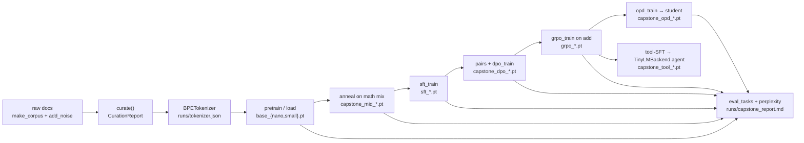

# Chapter 29: Capstone — TinyLM end to end, then the scale-up map

**Part IV · ~3 hours · Prerequisites: every chapter; at minimum 2, 8, 10, 13, 15, 17, 19, 20, 23, 24, 27**

> 🎯 Goal: Run the whole pipeline in one sitting and know exactly what changes at scale.
> 🧪 Lab: `labs/lab29_capstone.py` · 🎛️ Interactive: none for this chapter (open `interactive/00_pipeline_map.html` again and tick the stages off)

## Why this matters

Twenty-eight chapters ago the outline promised one thing: that you would take a language model through every stage a frontier model goes through in 2026, on a laptop, with code you can read in full. This chapter cashes that promise in a single script. `lab29_capstone.py` starts from raw documents and ends with a model calling a calculator tool inside the harness of Chapter 27, and between those two points it runs curation, tokenization, pretraining, mid-training, supervised fine-tuning, preference optimisation, reinforcement learning with a verifiable reward, on-policy distillation and an evaluation of every checkpoint on the same questions. The **capstone** is not a new technique; it is the discipline of running the old ones in one line and reading one table at the end. The second half of the chapter is the map you need next: what a $100 run does differently, what changes at 1B, 10B and 100B+ parameters, how to keep up, and a checklist of what you can now do.

## The idea in pictures 📐

The pipeline is the one from Chapter 0, now with a filename at every arrow:



Read it as: every stage consumes the previous checkpoint and writes its own; the evaluation reads all of them. Two rules make the script re-runnable. **Checkpoint reuse**: each stage first looks for a checkpoint in `runs/` (its own `capstone_*` file or the one the chapter's lab produced, such as `sft_nano.pt` or `grpo_small.pt`) and trains only if none exists, so a second run takes seconds, and a crash in stage 7 does not cost you stages 0–6. A lineage rule: every `capstone_*` file records which checkpoint it was trained from (`extra["parent"]`), and it is reused only if that parent is the checkpoint the current run is actually using upstream; otherwise it is retrained, so the chain stays a chain even when an earlier lab's checkpoint appears in `runs/` between two runs.

The second figure is the scale-up map, discussed in its own section below.


## The idea in code

There is no new library code in this chapter. The script is 300 lines of calls into functions you have already read, and the pattern for every stage is the same:

```python
from llm.model import TinyLM
from llm.pipeline import run_path

with Stage("4. supervised fine-tuning (Chapter 15)") as st:          # times the block, records a note
    p = existing("sft_nano.pt", "capstone_sft_nano.pt", d_model=96, parent=paths["mid"])   # reuse if one exists
    if p is None:
        model = TinyLM.load(paths["mid"])                                                  # start from the previous stage
        hist = sft_train(model, tok, sft_examples, cfg, verbose=True)
        p = save_stage(model, "capstone_sft_nano.pt", "sft", parent=paths["mid"])          # records its parent
    paths["sft"] = p
```

`existing()` checks that a candidate has the right width (`cfg.d_model`), because a nano checkpoint from Lab 13 must not be reused in a `--full` (small) run. Three stages deserve a closer look.

**The curation report** (Chapter 8) is printed, not asserted: the numbers change with the planted noise, and the point of the stage is that you can read what each filter removed. **The evaluation** (Chapter 23) is the same call for every checkpoint, greedy decoding, `tasks.verify` as the grader, plus perplexity on held-out Storyland:

```python
from llm.evals import eval_tasks, perplexity
from llm import tasks
held_all = tasks.make_examples(40, seed=2024)                              # seven task types
held_add = tasks.make_examples(24, seed=2025, tasks=["add"], max_value=9)  # what GRPO trained on
for name in ("base", "mid", "sft", "dpo", "grpo", "opd"):
    m = TinyLM.load(paths[name])
    r_all, r_add = eval_tasks(m, tok, held_all, max_new_tokens=16), eval_tasks(m, tok, held_add, max_new_tokens=16)
    ppl = perplexity(m, val_tokens, batch_size=16, seq_len=128, n_batches=5)
```

**Tool-SFT** is the one recipe that no earlier lab ran in exactly this form: supervised fine-tuning on conversations that contain a tool call and a tool result, so that the model learns to emit the harness's format. The training conversations use *exactly* the system prompt that `TinyLMBackend` will render at inference (the prompt plus the tool schemas as JSON), because a format learned under one system prompt does not transfer to another:

```python
from llm.agent import TinyLMBackend, Tool, ToolRegistry
from llm.agent.tools import safe_eval
SYS = "You are TinyLM. Use the calc tool for arithmetic, then answer."
calc = Tool("calc", "Evaluate an arithmetic expression.",
            {"type": "object", "properties": {"expression": {"type": "string"}}, "required": ["expression"]},
            lambda expression: str(safe_eval(expression)))
reg = ToolRegistry([calc])
system_text = TinyLMBackend.to_chat_messages([], reg.schemas(), SYS)[0]["content"]     # ~243 tokens
conv = [{"role": "system", "content": system_text},
        {"role": "user", "content": "What is 17 + 25?"},
        {"role": "tool_call", "content": '{"name": "calc", "arguments": {"expression": "17 + 25"}}'},
        {"role": "tool_result", "content": "42"},
        {"role": "assistant", "content": "17 + 25 = 42"}]
```

`chat.build_sft_example` masks everything except the `tool_call` and `assistant` turns, so the model is trained to produce the call and the final answer and never the tool's output. A tool-call turn is 51 tokens with the course tokenizer (the JSON is spelled out nearly byte by byte), which is why the agent's `max_new_tokens` is 80 and the model's context is extended to 512 for this stage.

## Worked example 🧪

```bash
python3 labs/lab29_capstone.py            # --quick: the nano model; about 5 minutes the first time, 30 s when everything is reused
python3 labs/lab29_capstone.py --full     # the small model; about 25 minutes the first time
python3 labs/lab29_capstone.py --fresh    # retrain every capstone_* checkpoint
```

The timings below come from a 4-core machine that was also running other labs (load average above 20), so the script fell back to one PyTorch thread; an idle laptop is two to five times faster.

### Quick mode, first run (nano model)

The curation report is Chapter 8's table on 1,500 clean documents plus planted noise:

```
QUICK_CURATION_TODO
```

The base model is loaded rather than trained because `runs/base_nano.pt` exists from Lab 10, and mid-training reuses Lab 13's annealed checkpoint. Then the post-training stages run, each printing its own log:

```
QUICK_STAGES
```

Three things to read in those logs. SFT's masked loss falls from 9.6 to 3.4 in 120 steps, but validation accuracy is 0.04: a 300k-parameter model learns the *format* of an answer long before it learns the answers. DPO's margin on held-out pairs goes from 0.00 to +1.86 and pair accuracy from 0.50 to 0.68, using synthetic pairs only, because the SFT model was wrong on all 24 sampled prompts and so yielded no on-policy pairs (Chapter 17 explained why an all-wrong prompt teaches nothing about ranking). GRPO's reward barely moves (0.065 → 0.069) in 12 steps with `accuracy 0.00` on every step: with no correct answers in any group, every group has zero variance and there is no signal to learn from; Lab 19 needed a better starting point and many more steps. The lesson is the pipeline's, not the model's: every stage ran, logged the right diagnostics, and saved a checkpoint the next stage could load.

The table that the whole course was building towards:

```
QUICK_TABLE
```

Read it column by column. Perplexity is lowest for the base and mid checkpoints and *rises* through post-training (2.90 → 4.02): every stage after pretraining trades Storyland fluency for something else, which is the alignment tax of Chapter 14 measured at toy scale. Accuracy on the mixed tasks moves from 0.00 to 0.05 at SFT and stays there: the nano model is too small for most of the seven tasks, and 40 questions give a 95 % interval of roughly ±0.07, so none of the differences between sft, dpo and grpo are distinguishable (Chapter 23). The sample answers in the right-hand column say more than the numbers: the base model continues the prompt (`'+   78.'`), the SFT model answers in the right shape with the wrong arithmetic (`'5 + 3 = 3'`), and the DPO model has started to over-generate the pattern it was rewarded for.

The last stage is the agent:

```
QUICK_AGENT
```

QUICK_AGENT_TEXT

### Full mode (small model)

```
| stage | what happened | seconds |
|---|---|---:|
| 0. corpus and curation report (Chapter 8) | 7,743 raw -> 5,301 docs | 10.5 |
| 1. tokenizer (Chapter 2) | vocab 871, 4.08 bytes/token | 0.1 |
| 2. base model: pretrain or load (Chapter 10) | reused base_small.pt, ppl 2.07 | 3.1 |
| 3. mid-training anneal on a math-heavy mix (Chapter 13) | 120 steps, math loss 1.509 -> 1.384 | 138.0 |
| 4. supervised fine-tuning (Chapter 15) | 200 steps, loss 12.66 -> 2.16 | 275.4 |
| 5. preference pairs and DPO (Chapter 17) | 323 pairs, 60 steps, margin +0.00 -> +2.74 | 102.7 |
| 6. GRPO with a verifiable reward on addition (Chapter 19) | 20 steps × 4×G8, reward 0.10 -> 0.10 | 24.0 |
| 7. on-policy distillation into a student (Chapter 20) | sft_nano.pt <- teacher, 16 steps, rKL 0.92 -> 0.33 | 8.7 |
| 8. evaluate every checkpoint (Chapter 23) | 6 checkpoints × 90 questions | 50.7 |
| 9. a TinyLM agent answers with a calculator tool (Chapters 21, 24) | tool-SFT 200 steps, loss 9.55 -> 0.09; TinyLM called the tool and its final answer was wrong ('6 + 13 = 21') | 223.6 |

| stage | checkpoint | acc (all) | acc (add) | perplexity | eval s |
|---|---|---:|---:|---:|---:|
| base | base_small.pt | 0.00 | 0.00 | 2.07 | 8 |
| mid | capstone_mid_small.pt | 0.00 | 0.00 | 2.08 | 13 |
| sft | capstone_sft_small.pt | 0.10 | 0.00 | 2.35 | 8 |
| dpo | capstone_dpo_small.pt | 0.07 | 0.03 | 2.47 | 8 |
| grpo | capstone_grpo_small.pt | 0.07 | 0.07 | 2.44 | 9 |
| opd | capstone_opd_small.pt | 0.17 | 0.00 | 34.03 | 3 |

report written to runs/capstone_report.md; total 837s
11/11 checks passed in 842.7s
```

Fourteen minutes on the loaded machine, 837 s of which 275 went to SFT and 224 to tool-SFT. The small model's mid-training anneal lowers the held-out math loss from 1.509 to 1.384 in 120 steps (Chapter 13's effect, reproduced), SFT takes the masked loss from 12.66 to 2.16, and DPO reaches a held-out margin of +2.74 with pair accuracy 0.85 using 320 synthetic pairs and the 3 on-policy pairs that the SFT model's 3 % sample accuracy allowed. Then GRPO shows something the quick run could not: the log reads `skipped 0.75` to `skipped 1.00` on every step and `H 1.57–1.75`, with `H nan` on the steps where every group was skipped. DPO had sharpened the policy so much that eight samples of the same prompt were usually eight copies of the same wrong answer; a group with zero variance has zero advantages, DAPO's dynamic sampling drops it, and in 20 steps the optimizer saw perhaps five groups. That is the entropy collapse of Chapter 19 arriving from the stage *before* RL, and it is the most useful number in the run: a preference stage that "worked" by its own metric (margin up, accuracy up) left the policy with too little diversity for the next stage to learn from. The 2026 fixes you implemented (clip-higher, no std normalisation, no KL) cannot help when there is nothing to clip; the fix is upstream, in DPO's `beta` or step count, or in sampling GRPO at a higher temperature.

The checkpoint table tells the same story in aggregate. Perplexity rises gently through SFT, DPO and GRPO (2.07 → 2.44) and jumps to 34 for the OPD row, which is a different, smaller model: the nano student from Lab 15 (`sft_nano.pt`) distilled from the small GRPO teacher, whose Storyland perplexity was already high before distillation. Its 0.17 on the mixed tasks is the highest in the table, and it is the smallest model; it comes from Lab 15's 300-step SFT on four task types, not from the 16 OPD steps, which lowered the reverse KL from 0.92 to 0.33 without changing its addition score. With 60 and 30 questions, the confidence intervals are about ±0.09 and ±0.12, so the only differences in the table that survive Chapter 23's scrutiny are base/mid versus the rest.

The agent is the finale, and it deserves to be read line by line:

```
   tool-SFT: 300 traces of 320 tokens, 200 steps, loss 9.553 -> 0.093
   raw generation for 'What is 17 + 25?': '<|tool_call|>{"name": "calc", "arguments": {"expression": "6 + 13"}}<|end|>: 6 + 7 =  Max likedm<|en'
   TinyLM transcript:
      USER: What is 17 + 25?
      ASSISTANT:
        -> call calc({"expression": "6 + 13"})
        <- result: 19
      ASSISTANT: 6 + 13 = 21
      [done after 2 turns, 1 tool calls]
   TinyLM called the tool and its final answer was wrong ('6 + 13 = 21')
```

After 200 steps of tool-SFT the 2.4M-parameter model emits a syntactically perfect tool call: the marker, valid JSON, the right tool name, the right argument key, a closing `<|end|>`. `parse_tool_call` accepts it, the harness runs `safe_eval("6 + 13")`, and the result `19` comes back as a `tool_result` turn. Then two failures that are worth more than a success would have been: the operands are `6 + 13`, not `17 + 25` (the model learned the template and not the copying of two numbers from the prompt into the call, which Chapter 5 would call an induction pattern it has not yet formed), and the final answer `6 + 13 = 21` ignores the `19` it was handed. The model learned the *protocol* of tool use, which is what tool-SFT teaches, and not the *purpose*, which is what Chapter 21's agentic RL rewards (a correct final answer, plus a bonus for a tool call whose result matches it). The harness, meanwhile, did exactly its job from Chapter 27: a bounded loop, a validated call, a sandboxed execution, and a transcript that records both the call and the wrong answer, so that a verifier, not the model, has the last word.

The quick run cannot get this far. The nano model after 60 tool-SFT steps produces `<|tool_call|>` followed by near-JSON with misspelled keys (the raw generation below shows it), `parse_tool_call` returns `None`, the reply is treated as text, and the loop ends after one turn with no tool call. Format learning is the first thing SFT teaches and the first thing a model too small for its context loses.

The report is saved to `runs/capstone_report.md` and the figure to `figures/generated/lab29_capstone.png` (accuracy per stage on the left, seconds per stage on the right).

## The scale-up map

Everything in the lab has a counterpart in a frontier run. The figure `29_scale_map.svg` is the table; this section walks its columns.

### What nanochat's $100 run does differently

**nanochat** (Karpathy, October 2025) is the closest public relative of this course: one repository that trains a tokenizer, pretrains a Transformer, mid-trains, SFTs, optionally runs a little RL, evaluates, and serves a chat UI, in about four hours on 8×H100 for roughly $100. Set against Lab 29, the differences are instructive because they are *not* differences of kind:

- **Data volume.** TinyLM sees about a million Storyland tokens; nanochat streams on the order of ten billion FineWeb-Edu tokens through the same kind of packed-window loader, so data arrives in shards from disk rather than from a Python list, and the tokens-per-parameter ratio is chosen from a scaling rule (Chapter 9) rather than by what fits in a minute.
- **Tokenizer.** Its own byte-level BPE with 2¹⁶ = 65,536 entries (Chapter 2 discussed why the vocabulary grows with the model); ours saturates at 871 because Storyland has only 401 distinct chunks.
- **Model and optimizer.** A ~560M-parameter model with the same block you built (pre-norm, RoPE, GQA-style attention, SwiGLU-like MLP), trained with Muon for the matrices and AdamW for embeddings and norms, in bfloat16; the speedrun lineage it borrows from (modded-nanogpt) had reached a GPT-2-grade result in a reported ~1.35 minutes on 8×H100 by April 2026 using Muon, FlashAttention-3, an FP8 head and multi-token prediction.
- **Parallelism.** Plain data parallelism across eight GPUs with an all-reduce per step (Chapter 11's Lab 11 did this across two CPU processes); nothing more is needed at this size.
- **Evals.** A fixed suite (a CORE-style aggregate, ARC, GSM8K, HumanEval, MMLU) run on every checkpoint, which is the same habit as the capstone's table with better questions.
- **Post-training.** SFT on conversations and a modest amount of RL on GSM8K; no preference stage and no distillation, and no safety training at all, which is worth noticing: a $100 model is a research artefact, not a product.

The honest summary is that nanochat is Lab 29 with 10⁴ times the data, 200 times the parameters, real benchmarks, and a GPU. Every function name maps.

### What changes at 1B, 10B and 100B+

**Data volume and curation infrastructure.** At 1B parameters a compute-optimal run wants tens of billions of tokens and an over-trained one (Chapter 9's 2026 practice for small models) hundreds of billions; deduplication and quality classification stop being a function call and become a cluster job over a shard store, with MinHash (Chapter 8) run at petabyte scale. At 10B+ the mix is engineered: multiple sources with tuned weights, a curriculum that shifts the mix over training, decontamination against every eval you will ever report, and synthetic rephrasing or generation (Nemotron-CC, FineInstructions). At the 10T+-token horizon the 2026 evidence (Nemotron-CC, and the "Data Darwinism" line of work) is that diversity matters more than aggressive filtering, and that curation pipelines themselves are being evolved by models.

**Tokenizer size.** 32k–128k vocabularies at 1–10B, 128k–256k at the frontier, trained on a sample of the actual pretraining mix, with digit chunking and code-whitespace merges deliberately designed. The rule from Chapter 2 holds: the tokenizer and the mix are designed together.

**Precision, optimizer and architecture.** FP8 training is the 2026 default from about 10B up, with NVFP4 recipes reported validated on multi-trillion-token runs to ~120B and MXFP4 pretraining under study; Hadamard rotations are the trick that keeps FP4 stable. Muon is mainstream (Kimi K2, GLM-4.5/5, DeepSeek-V4 report using it), with the commonly cited ≈2× compute-efficiency over AdamW from Moonshot's 2025 scaling paper and a July 2026 study reporting that it matches or beats AdamW on hybrid Mamba-attention MoE models with gains that grow with batch size. At 100B+ the architecture is a mixture of experts (DeepSeek-V4 at ~1.6T total parameters keeps DeepSeekMoE and MTP, adds compressed sparse attention for million-token context, and replaces plain residuals with manifold-constrained hyper-connections); GLM-5 is reported to orthogonalise MLA up-projections per head ("Muon Split"). Chapter 12 built the MoE block; what changes is that expert placement becomes a networking problem.

**4-D parallelism.** Chapter 11's taxonomy becomes the daily job: tensor parallelism inside a node, pipeline parallelism across nodes, expert parallelism for the MoE layers, data parallelism over everything, and context parallelism for long sequences. Model FLOPs utilisation of 40–50 % is the target, fault tolerance (checkpoint restarts, straggler handling) is a first-class feature, and the training loop of Chapter 10 is unchanged in shape but wrapped in a scheduler.

**Evaluation infrastructure.** From "a table on every checkpoint" to a service: held-out internal evals that are never trained on, contamination checks on every data source, agentic benchmarks (SWE-bench Verified, Terminal-Bench) run inside containers, and, after the audits of 2026 (flawed tests in a majority of hard SWE-bench Verified tasks; BenchJack's exploits of agent benchmarks), a standing effort to audit the benchmarks themselves. Evals become the product's specification.

**RL infrastructure with async rollouts.** Chapter 19's `grpo_step` samples a group, scores it and updates, in one process. At scale the sampler is a separate inference fleet (vLLM-style servers with paged KV caches), the trainer consumes trajectories as they arrive with a small policy lag (the off-policy correction is the clipped ratio you implemented), and the environments for agentic RL (Chapter 21) are containers started per episode. AgentRL, SkyRL-Agent, verl's agentic mode and Microsoft's rollout-as-a-service are the 2026 frameworks; the algorithmic fixes (DAPO, Dr. GRPO, GSPO, adaptive rollouts) address entropy collapse and gradient dead zones that you saw the seeds of when every group had zero variance in the lab. On-policy distillation from a large teacher (Chapter 20) is reported 10–30× cheaper than RL for comparable gains and is now a standard stage.

**Safety.** Absent from the lab and from nanochat, mandatory in a product: a constitution or model spec (Chapter 22), RLAIF, refusal training, red-teaming, agentic-autonomy evaluations, and interpretability used as an audit. The harness of Chapter 27 is the last line, not the first.

### What does not change

The next-token loss, byte-level BPE, the pre-norm Transformer block with RoPE and GQA and SwiGLU, the KV cache, loss-masked SFT, a KL-anchored preference loss, group-relative advantages, and a verifier as the reward. Every function you called in Lab 29 has a name in a frontier codebase; what scales is the data, the infrastructure around each function, and the number of people whose whole job is one row of the map.

## A reading plan for staying current

The field moves monthly and most of what moves is engineering, so a **reading plan** is a habit, not a list. The one that works for practitioners in 2026:

1. **Primary sources first.** Read the tech report of each major open-weight release in full (DeepSeek-V4, Kimi K3, GLM-5.x, Qwen3.x, gpt-oss, Gemma 4, Llama 4 in 2025–2026), and for each, map its sections onto the chapters of this course: data, tokenizer, architecture, optimizer, parallelism, post-training, evals. If a section has no chapter, that is what to learn next.
2. **The papers behind each stage.** Keep one reference per stage and update it when a better one appears: FineWeb/DCLM/Nemotron-CC for data; Chinchilla and the 2026 over-training practice for scaling; Muon and "Muon is Scalable" for optimisation; DeepSeekMoE, NSA/DSA and the hybrid SSM papers for architecture; DPO and the rubric-reward papers for preferences; GRPO, DAPO, Dr. GRPO and GSPO for RL; the Thinking Machines blog and "Rethinking On-Policy Distillation" for OPD; the SWE-bench Verified audit and Terminal-Bench for evals; the Anthropic harness posts and the context-rot papers for agents.
3. **A few aggregators, treated as pointers.** Turing Post's reasoning-RL roundups, Cameron Wolfe's agentic-RL survey, the open-weight comparison pages, and InfoQ for harness news; use them to find primary sources, and say "reported" when you repeat something you only read there.
4. **Reproduce one claim a month at toy scale.** Take one number from a paper and check its direction with TinyLM: does clip-higher raise entropy? does OPD beat rejection-sampling SFT on the same budget? does a longer context hurt the agent? The library is built for this, and it is the only reading method that produces understanding rather than familiarity.
5. **Read the code.** nanochat and modded-nanogpt for training; verl and SkyRL for RL infrastructure; the MCP and A2A specifications for agents. Compare each with the corresponding file in `llm/`.

## What you can now do

A checklist to tick honestly.

- [ ] Explain why a language model is a next-token predictor and compute a perplexity by hand from a bigram table (Chapter 1).
- [ ] Train a byte-level BPE tokenizer on your own data and measure bytes/token per language and domain (Chapter 2).
- [ ] Draw a Transformer block from memory, count its parameters, and implement attention with GQA and RoPE that matches PyTorch's reference (Chapters 5, 6).
- [ ] Generate text with a KV cache and explain every sampling knob (Chapter 7).
- [ ] Run a curation pipeline with dedup, quality classification and decontamination, and read its report (Chapter 8).
- [ ] Size a model and its data for a compute budget, and read a loss curve (Chapter 9).
- [ ] Pretrain with AdamW or Muon, with warmup, a schedule, clipping, checkpointing and resume (Chapter 10); explain data, tensor, pipeline and expert parallelism (Chapter 11); build an MoE layer (Chapter 12).
- [ ] Anneal a base model on a curated mix and extend its context (Chapter 13).
- [ ] Turn a base model into an assistant with loss-masked SFT, with full fine-tuning or LoRA (Chapter 15); design a labeling task and measure agreement (Chapter 16).
- [ ] Train a reward model and run DPO; explain when to prefer which (Chapter 17); derive the policy gradient and PPO's clip (Chapter 18); implement GRPO with a verifiable reward and its 2026 fixes (Chapter 19).
- [ ] Distil on-policy from a teacher and say when it fails (Chapter 20); train a policy over multi-turn tool use (Chapter 21); run RLAIF against a written constitution (Chapter 22).
- [ ] Build an eval harness with confidence intervals, a contamination check and a position-bias check for judges (Chapter 23).
- [ ] Write an agent loop with tool calling, a permission gate and hooks; manage a context budget with compaction and memory; write an MCP server and client (Chapters 24–26).
- [ ] Build a long-running harness whose sessions resume from files and whose "done" is decided by tests (Chapter 27); choose, measure or decline a multi-agent pattern (Chapter 28).
- [ ] Run the whole pipeline in one script and read a table of every checkpoint (this chapter).
- [ ] Read a 2026 model card and know, for every term, which chapter built it and what changes at scale.

## Try it yourself ✍️

1. **Fix a stage.** GRPO learned nothing in quick mode because no group ever contained a correct answer. Change `MAX_VALUE` to 5, raise `steps` to 40 and start GRPO from the DPO checkpoint with `temperature=1.2`. Does any group get a non-zero variance, and does the reward move?
2. **Reuse across labs.** Run Labs 15, 17 and 19 in `--full` mode first, then the capstone in `--full`. Which stages say "reused", and does the table change? Explain any change using the lineage rule.
3. **A fairer table.** Add bootstrap confidence intervals (`llm.evals.bootstrap_ci`) to the checkpoint table and mark which differences are real at 95 %.
4. **The alignment tax, measured.** Perplexity rises through post-training. Add a column with perplexity on the *chat-formatted* validation examples (as `compare_checkpoints` does) and check whether it falls while the Storyland perplexity rises.
5. **Tool-SFT data.** Double the number of tool traces and include subtraction. Does the model copy the operands correctly more often? Count, over 20 questions, how many tool calls parse and how many have the right expression.
6. **Your own scale-up row.** Pick a 2026 open-weight tech report and fill in one row of the scale-up map (data, tokenizer, precision, parallelism, RL infra, evals, safety) with the numbers it states. Mark every number you could not find.
7. **A month of reading.** Choose one claim from the reading plan's second item and reproduce its direction with TinyLM in under an hour of CPU. Write down the number you got and the number the paper reports.

## Check yourself ✅

<details><summary>1. Why does the capstone reuse checkpoints, and what could go wrong if it reused them blindly?</summary>

Reuse makes the pipeline cheap to re-run and resumable after a failure: a stage loads its checkpoint from `runs/` and trains only if none exists. Blind reuse breaks the lineage: a DPO checkpoint trained from one SFT model would be evaluated as if it followed a different SFT model, and a nano checkpoint could be loaded into a small run. The script checks `d_model` and marks its own downstream files stale once an upstream stage is retrained.
</details>

<details><summary>2. Perplexity rose from 2.90 to 4.02 across post-training while task accuracy did not fall. Is that a bug?</summary>

No. Perplexity on Storyland prose measures how well the model continues stories; SFT, DPO and GRPO train it to answer questions in a chat format instead, and every step away from the pretraining distribution costs Storyland fluency. This is the alignment tax of Chapter 14 at toy scale, and it is why post-training is evaluated with task accuracy and preference metrics, not perplexity.
</details>

<details><summary>3. GRPO's reward stayed flat in quick mode. What diagnostic in the log explains it, and what would you change first?</summary>

`acc 0.00` on every step, with `skipped 0.00`: every group of eight answers was wrong, so within each group the rewards were (nearly) equal, advantages were zero and the update had nothing to push on. The first change is the starting point or the task difficulty (smaller operands, a better SFT model), not the RL hyperparameters; GRPO needs some correct samples to learn from.
</details>

<details><summary>4. Name three things nanochat does differently from Lab 29 and one thing it does not do at all.</summary>

Differently: ~10⁴× more data streamed from FineWeb-Edu shards, a 65,536-entry tokenizer, a ~560M-parameter model trained with Muon in bfloat16 across eight GPUs with data parallelism, and real benchmarks (ARC, GSM8K, HumanEval, MMLU). Not at all: safety training (and no preference stage or distillation).
</details>

<details><summary>5. At 100B+ parameters, which stage changes most in <em>kind</em> rather than in size, and why?</summary>

RL infrastructure. At toy scale sampling, scoring and updating happen in one process; at scale the sampler is a separate inference fleet with async rollouts, the trainer tolerates a policy lag corrected by the clipped ratio, and agentic environments are containers started per episode. Data curation and parallelism grow enormously but keep their shape; async RL changes the shape of the loop.
</details>

## Key takeaways

- The whole pipeline fits in one script because every stage is a function that loads a checkpoint and saves one; reuse and a lineage rule make it re-runnable.
- The table of every checkpoint on the same questions is the deliverable; single-stage logs are diagnostics.
- At toy scale most stages show the right diagnostics rather than large gains: perplexity rises through post-training, GRPO needs correct samples, tool-SFT teaches a format before it teaches copying.
- nanochat is the same pipeline with 10⁴× the data and a GPU; every function maps.
- What changes at 1B → 100B+ is data volume and curation infrastructure, tokenizer size, FP8/FP4 and Muon, MoE, 4-D parallelism, eval infrastructure, async RL, and safety; what does not change is the loss, the block, the mask, the KL anchor, the group baseline and the verifier.
- Staying current is a habit: primary sources, one reference per stage, aggregators as pointers, and one toy reproduction a month.

## Going deeper

- 🆕 Karpathy, A. *nanochat* (October 2025). The $100 end-to-end pipeline; read it file by file against `llm/`. https://github.com/karpathy/nanochat
- Jordan, K. *modded-nanogpt* (2024–2026). The speedrun lineage (Muon, FP8 head, MTP); reported GPT-2-grade in ~1.35 min on 8×H100 by April 2026. https://github.com/KellerJordan/modded-nanogpt
- 🆕 "SOAP, Muon, and Beyond: Pushing LLM Pretraining Scales" (July 2026), https://arxiv.org/abs/2607.20548 ; PyTorch blog on Muon with DeepSpeed, https://pytorch.org/blog/using-muon-optimizer-with-deepspeed/
- 🆕 DeepSeek-AI, *DeepSeek-V4: Towards Highly Efficient Million-Token Context Intelligence* (2026), https://arxiv.org/abs/2606.19348 ; discussion at https://www.lmsys.org/blog/2026-04-25-deepseek-v4/
- 🆕 MXFP4 pretraining on native FP4 hardware (2026), https://arxiv.org/abs/2605.09825
- 🆕 Data at the 10T+ horizon: FineInstructions (2026), https://arxiv.org/abs/2601.22146 ; DataEvolve / "Data Darwinism II" (2026), https://arxiv.org/abs/2603.14420 ; a systematic study of synthetic pretraining data (2026), https://arxiv.org/abs/2604.13977
- 🆕 RL infrastructure: AgentRL (2025), https://arxiv.org/abs/2510.04206 ; verl agentic RL docs, https://verl.readthedocs.io/en/latest/start/agentic_rl.html ; adaptive rollouts (2026), https://arxiv.org/abs/2602.14338 ; Turing Post, "Reasoning RL in 2026", https://www.turingpost.com/p/reasoning-rl-in-2026
- 🆕 Thinking Machines, "On-policy distillation" (October 2025), https://thinkingmachines.ai/blog/on-policy-distillation/ ; "Rethinking On-Policy Distillation" (2026), https://arxiv.org/abs/2604.13016
- 🆕 The open-weight landscape as reported by aggregators (treat as approximate): https://wavect.io/blog/open-weight-llm-comparison-2026/ and https://www.morphllm.com/best-open-source-llm

---

← [Chapter 28](28-multi-agent-systems.md) · [Course home](../README.md) · [Appendix A](A-math-refresher.md) →
